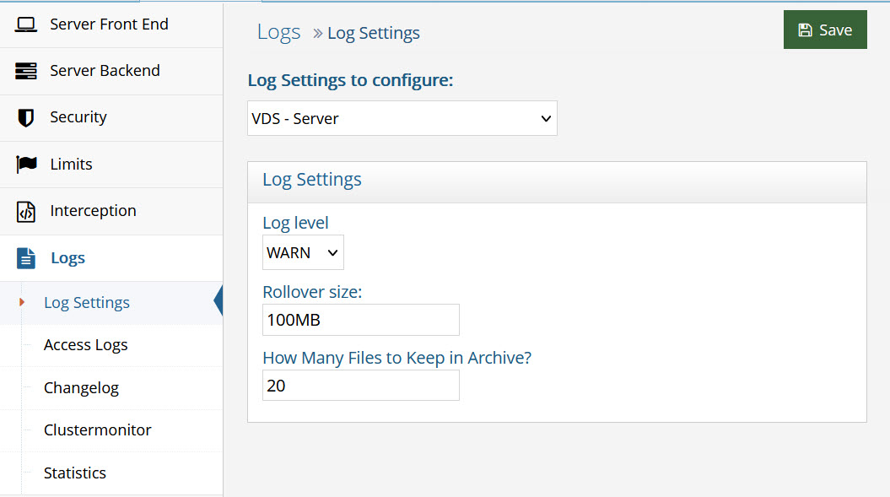
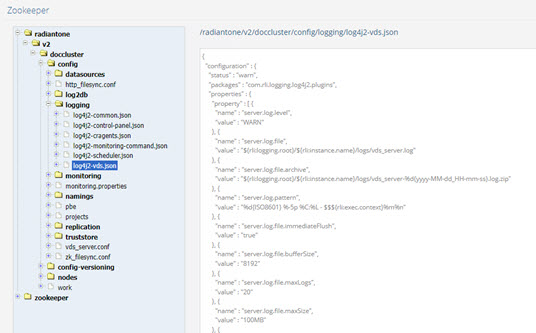

# Log Settings Commands

Log settings are managed from the Main Control Panel > Settings tab > Logs section > Log Settings, and can also be managed from command line using the <RLI_HOME>/bin/vdsconfig utility.

Details of the logging property keys and paths to the configuration can be seen from the ZooKeeper tab.

This document explains how to display and update log settings using a command line interface (CLI) instead of the GUI mentioned above.

## get-logging-property

This command displays a logging configuration property.

**Usage:**

`get-logging-property -key <key> -path <path> [-instance <instance>]`

**Command Arguments:**

`- key <key>`

[required] The logging property key. Examples of logging property keys for RadiantOne are: server.log.level, server.log.file, and server.log.file.archive. The logging property key names can be seen from the ZooKeeper tab in the Main Control Panel as described above.

`- path <path>`

[required] The path to the logging configuration. Examples of the path to the logging configuration are:
For RadiantOne: zk:log4j2-vds.json
For Control Panel: zk:log4j2-control-panel.json
The path to the logging configurations can be seen from the ZooKeeper tab in the Main Control Panel as described above.

`- instance <instance>`

The name of the RadiantOne instance. If not specified, the default instance named vds_server is used.

**REST (ADAP) Example**

In the following example, a request is made to display the value for the maximum size of the access log file.

`https://<rli_server_name>:8090/adap/util?action=vdsconfig&commandname=get-logging-property&key=access.log.file.maxSize&path=zk:log4j2-vds.json`

## set-logging-property

This command updates a logging configuration.

>[!important] If a temporary log level is currently active on a logger, this command will reject log level changes for that logger. You must first run `stop-temporary-log-level-reset` to cancel the temporary log level before making permanent changes with `set-logging-property`. This prevents users from unknowingly overriding a temporary logging configuration.

**Usage:**

`set-logging-property -key <key> -path <path> [-instance <instance>] [-value <value>]`

**Command Arguments:**

`- key <key>`

[required] The logging property key. Examples of logging property keys for RadiantOne are: server.log.level, server.log.file, and server.log.file.archive. The logging property key names can be seen from the ZooKeeper tab in the Main Control Panel as described above.

`- path <path>`

[required] The path to the logging configuration. Examples of the path to the logging configuration are:
For RadiantOne: zk:log4j2-vds.json
For Control Panel: zk:log4j2-control-panel.json
The path to the logging configurations can be seen from the ZooKeeper tab in the Main Control Panel as described above.

`- instance <instance>`

The name of the RadiantOne instance. If not specified, the default instance named vds_server is used.

`- value <value>`

The logging property value.

**REST (ADAP) Example**

In the following example, a request is made to set the maximum access log size to 300MB.

`https://<rli_server_name>:8090/adap/util?action=vdsconfig&commandname=set-logging-property&key=access.log.file.maxSize&path=zk:log4j2-vds.json&value=300MB`

## set-temporary-log-level

(Added in v7.4.22)

This command sets a temporary log level for a specified logger. The log level is changed immediately and automatically reverts to its previous value after the specified duration expires. Each logger can have its own independent temporary log level and expiration, allowing maximum flexibility when troubleshooting.

For example, if VDS - Server is currently set to INFO, you can temporarily set it to DEBUG for 30 minutes. Once the 30 minutes elapse, the log level automatically reverts back to INFO.

**Usage:**

`set-temporary-log-level -logger <logger> -level <level> -duration <duration> [-instance <instance>]`

**Command Arguments:**

`- logger <logger>`

[required] The name of the logger to set the temporary log level for. Examples include: vds-server, vds-vrs-server, sync-engine, control-panel-server. Use -h to see the full list of available logger names.

`- level <level>`

[required] The log level to set temporarily. Valid values include: DEBUG, INFO, WARN, ERROR, FATAL, TRACE.

`- duration <duration>`

[required] The duration in minutes for which the temporary log level should be active. After this period, the log level reverts to its previous value.

`- instance <instance>`

The name of the RadiantOne instance. If not specified, the default instance named vds_server is used.

**Example**

In the following example, the VDS server log level is temporarily set to DEBUG for 5 minutes:

`vdsconfig.bat set-temporary-log-level -level DEBUG -logger vds-server -duration 5`

After 5 minutes, the log level automatically reverts to whatever it was before (e.g., INFO or WARN).

>[!note] At any point while a temporary log level is active, you can set a new temporary log level (which replaces the previous one) or cancel the temporary setting and make the current level permanent using `stop-temporary-log-level-reset`.

## stop-temporary-log-level-reset

(Added in v7.4.22)

This command cancels the pending automatic revert of a temporary log level and makes the current log level permanent. This is a prerequisite before making any permanent log level changes using set-logging-property when a temporary log level is active.

**Usage:**

`stop-temporary-log-level-reset [-instance <instance>]`

Use -h to see all available arguments.

**Command Arguments:**

`- instance <instance>`

The name of the RadiantOne instance. If not specified, the default instance named vds_server is used.

**Example**

If a temporary DEBUG level is active on the VDS server logger and you want to make it permanent (or need to change the level via set-logging-property), first run:

`vdsconfig.bat stop-temporary-log-level-reset`

This cancels the scheduled revert. The log level remains at whatever it is currently set to (e.g., DEBUG), and you are now free to use set-logging-property to make further permanent changes.

## merge-logging-conf

This command performs a merge of two logging configurations.

**Usage:**

`merge-logging-conf -mergepath <mergepath> -path <path> [-instance <instance>]`

**Command Arguments:**

`- mergepath <mergepath>`

[required] The path of the JSON-formatted logging configuration to merge with.

>[!note] The value for this argument should specify the location of a logging configuration in either the file system (i.e. file:c/tmp/mylogger.json) or in Zookeeper (i.e. zk:log4j2-vds.json).

`- path <path>`

[required] The path of the JSON-formatted logging configuration. The result of the merge operation is stored in the location specified by this argument.

>[!note] The value for this argument should specify the location of a logging configuration in either the file system (i.e. file:c/tmp/mylogger.json) or in Zookeeper (i.e. zk:log4j2-vds.json).

`- instance <instance>`

The name of the RadiantOne instance. If not specified, the default instance named vds_server is used.

**REST (ADAP) Example**

In the following example, a request is made to merge two logging configurations.

`https://<rli_server_name>:8090/adap/util?action=vdsconfig&commandname=merge-logging-conf&mergepath=file:c:/radiantone/vds/config/logging/mylogger.json&path=zk:log4j2-vds.json`
