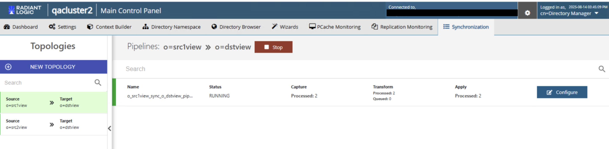

# Migration Commands

Migrating resources (e.g. root naming contexts, data sources, Global Identity Builder projects, virtual views, or schema files) from an existing development/QA environment to an existing production environment can be difficult because many resources are dependent upon other resources (virtual views are dependent upon data sources, schema files and often times even other virtual views). These resources usually need to be migrated together to ensure everything works properly in the target environment. This makes the migration process error prone.

This document explains how to traverse, export, and import resources and their dependencies using commands. For more information, see the [RadiantOne Operations Guide](/operations-guide/01-overview).

>[!note] The commands in this document do not support output format configuration. Refer to [Configuring Command Output Format](./01-introduction/#configuring-command-output-format) for more information.

### resource-traverse

This command displays the resource dependency tree. The results include any data sources, .orx files, .dvx files, root naming contexts, and .jar files (from interception scripts or custom object scripts) related to the resource. If you need to migrate the resource to another environment, all of the dependent files must be migrated also.

**Usage:**
<br>`resource-traverse -name <name> [-instance <instance>]`

**Command Arguments:**

`- name <name>`
<br>[required] The name of the resource. This could be a data source name, a .dvx file name (e.g. contextcatalog.dvx), an .orx file name (e.g. sales.orx), or a root naming context (e.g. o=companydirectory).

`- instance <instance>`
<br>The name of the RadiantOne instance. If not specified, the default instance named vds_server is used.

### resource-export

This command exports the resource and its dependencies.

>[!warning] This command does not export wizard artifacts (such as the XML files), except for Global Identity Builder project artifacts. This command also does not export persistent cache configurations on naming contexts - it only exports the underlying non-cached configuration and you must reconfigure persistent cache again after importing into the target environment.

**General Usage:**
<br>`resource-export -name <name> [-instance <instance>] [-path <path>] [-skip <name>] [--direct-chain]`

**Use the following command if you are exporting a single topology:**
<br>`resource-export -name <source_context->target_context> --cross-environment`

**Command Arguments:**

`- name <name>`
<br>[required] The name of the resource.

`- instance <instance>`
<br>The name of the RadiantOne instance. If not specified, the default instance named vds_server is used.

`- path <path>`
<br>The file or folder to export to.

`- skip <name>`
<br>The name of the resource to skip and exclude from the export.

`-name <source_context->target_context>`
<br>The name of the topology. It should be formatted as "o=sourceviewname->o=destinationviewname".

`-- cross-environment`
<br>Indicates that resources will be exported in cross-environment mode.

`-- direct-chain`
<br>Applies to naming-context exports only. When set, the exported bundle includes only the specified naming context (with its full subtree) plus the direct ancestor chain leading up to its parents. Unrelated sibling branches that share a parent are excluded, and parent virtual-tree (`.dvx`) files are physically pruned to remove references to the excluded siblings. This makes it easy to move a single branch between environments without dragging the entire tree along.
<br><br>The `-name` value must resolve to a **registered naming context**. If the DN resolves to an unregistered label inside a parent DVX (rather than its own naming context), the command aborts with an error and no bundle is produced. Remove the `--direct-chain` flag to fall back to legacy full-export behavior in that case.
<br><br>If `-name` resolves to the **root** naming context, `--direct-chain` has no ancestor chain to walk and no siblings to exclude — the bundle is functionally equivalent to a plain (non-direct-chain) full export.
<br><br>**Example — exporting a single branch:**
<br>`vdsconfig resource-export -name "dc=cde,dc=prod,dc=apps" -path /tmp/exports/cde-chain.zip -skip ldif --cross-environment --direct-chain`
<br><br>In this example, the bundle contains only the `dc=cde,dc=prod,dc=apps` naming context (and everything beneath it), its parent `dc=apps`, and a pruned copy of `dc_apps.dvx` that references only the `dc=prod → dc=cde` chain. Sibling branches such as `dc=qa,dc=prod,dc=apps` or `dc=cots,dc=cl,dc=apps` are excluded from the bundle entirely.

### resource-import

This command imports the resource and its dependencies.

>[!warning] This command does not import wizard artifacts (such as the XML files), except for Global Identity Builder project artifacts. This command also does not import persistent cache configurations on naming contexts - it only imports the underlying non-cached configuration and you must reconfigure persistent cache again after importing into the target environment.

**General Usage:**
<br>`resource-import -path <path> [-apply] [-instance <instance>] [-interactive] [-overwrite] [-skip <name>] [-skipregex <skipregex>]`

**Use the following command if you are importing a single topology:**
<br>`resource-export -name <source_context->target_context> --cross-environment`

**Command Arguments:**

`- path <path>`
<br>[required] The file or folder to import from.

`- apply`
<br>Flag required to apply the import. If this isn't passed, a dry-run summary of all resources to be added and overwritten in the target is displayed. In dry-run mode, merge diagnostics for DVX files indicate what would happen but no live files are modified.

`- instance <instance>`
<br>The name of the RadiantOne instance. If not specified, the default instance named vds_server is used.

`- interactive`
<br>Indicates the command should run in interactive mode (user may be prompted for input if a resource already exists). For `.dvx` files that already exist on the target, the prompt offers a three-way choice: **[K]eep** existing (skip the file), **[M]erge** with bundle (graft bundle-only nodes into the live file while preserving existing content), or **[O]verwrite** with bundle (replace the live file entirely). Invalid input is rejected and the prompt is re-displayed; input is case-insensitive.

>[!note] REST (ADAP) commands do not support this argument.

`- overwrite`
<br>Indicates that existing resources are allowed to be overwritten during the import. For `.dvx` files, this bypasses the default merge behavior — the bundle's DVX replaces the live one entirely. Combine with `-interactive` to be prompted per DVX with merge as a third option.

`- skip <name>`
<br>Resource name to skip. Always run the command without the -apply flag first to see how the target environment resources are going to be affected. This allows you to take note of the resources that should be skipped (using the -skip flag) when you run the command with the -apply flag.

`- skipregex <skipregex>`
<br>A regular expression indicating which resources to skip. The format for the regex is: resourcetype: regex. Supported resource types are: naming, ds, orx, dvx, file, custom, all.
<br>Example: naming:^ou.* --> skips all naming contexts starting with the name ou
<br>Example: all:^test.* --> skips all resources starting with the name test.

`-- cross-environment`
<br>Indicates that resources will be imported in cross-environment mode.

**DVX Merge Behavior**

When importing a bundle that contains a `.dvx` file which already exists on the target, the default behavior is **merge**: the importer grafts any nodes from the bundle that are not already present in the live file, while preserving all existing content. This allows multiple direct-chain bundles that share a common parent (e.g. `dc=apps`) to be imported sequentially — each import adds its branch without removing siblings added by previous imports.
<br><br>If the target `.dvx` does not exist, the bundle's file is copied in directly (no merge needed).
<br>Non-DVX resources (ORX files, datasources, custom JARs) are unaffected by this change and continue to use the previous skip-or-overwrite logic.
<br>Use `-overwrite` to bypass merge and force-replace the live DVX with the bundle's version.
<br>Use `-interactive` to choose per DVX file whether to Keep, Merge, or Overwrite.
<br>If the live `.dvx` file is malformed (not valid XML), the merge is skipped with an error and the live file is left unchanged. Use `-overwrite` to force-replace it as a recovery path.

## Examples

### Traversing a Resource - REST (ADAP) Example

In the following example, a request is made to display the resource dependency tree for a virtual view named contextcatalog.dvx.

`https://<rli_server_name>:8090/adap/util?action=vdsconfig&commandname=resource-traverse&name=contextcatalog.dvx`

### Exporting a Resource - REST (ADAP) Example

In the following example, a request is made to export the resource so_hr_o_examples.dvx and its dependencies.

`https://<rli_server_name>:8090/adap/util?action=vdsconfig&commandname=resource-export&name=so_hr_o_examples.dvx&path=C:\radiantone\vds\vds_server`

### Importing a Resource - REST (ADAP) Example

In the following example, a request is made to import the resource so_hr_o_examples.dvx and its dependencies.

```
https://<rli_server_name>:8090/adap/util?action=vdsconfig&commandname=resource-import&path=c:/radiantone/vds/vds_server/contextcatalog_dvx.zip&apply=&skipregex=ds:^derby.*
```

### Exporting and Importing a Single Topology Resource – Command Line Example

In this example, we'll assume that we have defined multiple synchronization topologies("o=src1view -> o=destview" & "o=src2view -> o=dstview"). However, we only want to export a single topology ("o=src1view->o=dstview").

  

To do so, run the following command in the source cluster.

`vdsconfig.bat resource-export -name "o=src1view->o=dstview" --cross-environment`

* o=src1view refers to the topology of the source data view.
* o=dstview refers to the topology of the destination view.

This command will generate and export a zip file to "C:\radiantone\vds\work\o_src1view_sync_o_dstview". Copy the generated zip file and move it to your destination cluster. Note down its file path, as you'll need it for the import command.

Then, to import the exported data, execute the following command on the destination cluster, specifying the copied file path as the value of the `path` parameter:

`vdsconfig.bat resource-import -path "C:\tmp\o_src1view_sync_o_dstview.zip" -apply`.
