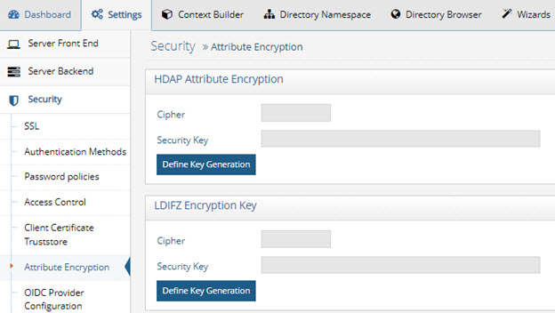

# Security Commands

Attribute encryption cipher and key can be set from the Main Control Panel > Settings tab > Security section > HDAP Attribute Encryption section.

>[!note] The commands in this chapter do not support output format configuration. Refer to [Configuring Command Output Format](introduction.md#configuring-command-output-format) for more information.

As an alternative, you can configure the cipher and key from command line using the <RLI_HOME>/bin/vdsconfig utility. Attribute encryption is only applicable to RadiantOne Universal Directory (HDAP) stores and persistent cache. Once you’ve defined the cipher and key, it cannot be changed if there are stores and/or persistent caches that use it. If you need to change the cipher/key, you must remove the existing attribute encryption. For details on how to do this, see the [RadiantOne Namespace Configuration Guide](/namespace-configuration-guide/01-introduction).

Support for client certificate/PIV card authentication and client certificate DN Mapping is configured from Main Control Panel, Settings tab, Security section, SSL.

Use the test-cert-mapping command to determine if a match exists between a certificate’s subject (or SAN) and a client certificate DN mapping.

## set-attrenc-key

This command sets the encryption cipher and key used for attribute encryption/decryption.

**Usage:**

 `set-attrenc-key -cipher <cipher> -key <key> [-instance <instance>] [-nowarning]`

**Command Arguments:**

`- cipher <cipher>`
 [required] The name of the cipher to use for encryption. The accepted possible values are: DES3, AES128 and AES256. Possible values are dependent upon whether unlimited strength cipher suites have been installed in RadiantOne. For details on supporting unlimited strength ciphers, see the [RadiantOne Hardening Guide](/hardening-guide/00-preface).

`- key <key>`
 [required] The secret key to use for encryption/decryption.

`- instance <instance>`
 The name of the RadiantOne instance. If not specified, the default instance named vds_server is used.

`- nowarning`
 Indicates that this command should not display the confirmation warning to the user. If this argument is not passed, the user is shown the following warning when they run the command and they must enter Y (to proceed) or N (to cancel the configuration of the security key).

`Warning: this command can only be launched once. Once these parameters have been set, you will no longer be able to change them. Are you sure you want to proceed (Y/N)?`

**REST (ADAP) Example**

In the following example, a request is made to set the encryption cipher and key used for attribute encryption/decryption.

`https://<rli_server_name>:8090/adap/util?action=vdsconfig&commandname=set-attrenc-key&cipher=AES128&key=secret123`

## set-ldifz-key

This command sets the key generation parameters (security key and cipher) for LDIFZ encryption.

**Usage:**

set-ldifz-key -cipher <cipher> -key <key> [-instance <instance>]

**Command Arguments:**

`- cipher <cipher>`
 [required] The cipher to use for encryption. The following ciphers are accepted by this command: DES3, AES128, AES256, and AWSKMS.

`- key <key>`
 [required] The security key used to generate an encryption key.

`- instance <instance>`
 The name of the RadiantOne instance. If not specified, the default instance named vds_server is used.

**REST (ADAP) Example**

In the following example, a request is made to set LDIFZ key generation parameters.

`https://<rli_server_name>:8090/adap/util?action=vdsconfig&commandname=set-ldifz-key&cipher=aes256&key=secret1234`

## set-secure-ldif-export

This command, if enabled, forces users to use the LDIFZ format when exporting an LDIF file.

>[!note] Enabling this property requires an LDIFZ encryption key to first be defined.

**Usage:**

 `set-secure-ldif-export -enable <enable> [-instance <instance>]`

**Command Arguments:**

`- enable <enable>`
 [required] Indicates if secure LDIF export should be enabled (true) or disabled (false).

`- instance <instance>`
 The name of the RadiantOne instance. If not specified, the default instance named vds_server is used.

**REST (ADAP) Example**

In the following example, a request is made to enforce the use of the LDIFZ format for exporting LDIF files.

`https://<rli_server_name>:8090/adap/util?action=vdsconfig&commandname=set-secure-ldif-export&enable=true`

## test-cert-mapping

This command tests the subject (or SAN) associated with a given certificate against the existing certificate to DN mappings.

**Usage:**
 `test-cert-mapping -cert <cert> [-instance <instance>]`

**Command Arguments:**

`- cert <cert>`
 [required] The path to the certificate to test.

`- instance <instance>`
 The name of the RadiantOne instance. If not specified, the default instance named vds_server is used.

**REST (ADAP) Example**

In the following example, a request is made to test the subject associated with a certificate against existing certificate-to-DN mapping.

`https://<rli_server_name>:8090/adap/util?action=vdsconfig&commandname=test-cert-mapping&cert=C:\radiantone\vds\certs\domain1.cer`

## set-cloud-certificate

The client certificate truststore contains security certificates that RadiantOne uses to establish secure SSL/TLS connections to backend sources. Certificates can be managed from the Main Control Panel > Settings tab > Security > Client Certificate truststore. Certificates can also be added using the following command.

**Usage:**

 `set-cloud-certificate -cert <cert> -name <name> [-instance <instance>]`

**Command Arguments:**

`- cert <cert>`
 [required] The path to the certificate to add to the client certificate truststore.

`- name <name>`
 [required] The name of the certificate to add to the client certificate truststore. This is equivalent to the certificate alias and must be unique across all certificates in the truststore.

`- instance <instance>`
 The name of the RadiantOne instance. If not specified, the default instance named vds_server is used.

**REST (ADAP) Example**

In the following example, a request is made to set a certificate in the RadiantOne client certificate truststore.

`https://<rli_server_name>:8090/adap/util?action=vdsconfig&commandname=set-cloud-certificate&cert=C:\radiantone\vds\work\certs\certificate.cer&name=cloudcert`

## delete-cloud-certificate

Certificates can be deleted from the RadiantOne client certificate truststore using the following command.

**Usage:**
 `delete-cloud-certificate -name <name> [-instance <instance>]`

**Command Arguments:**

`- name <name>`
 [required] The name of the certificate to delete from the client certificate truststore. This is equivalent to the certificate alias and must be unique across all certificates in the truststore.

**`- instance <instance>`**
The name of the RadiantOne instance. If not specified, the default instance named vds_server is used.

**REST (ADAP) Example**

In the following example, a request is made to delete a certificate from the RadiantOne client certificate truststore.

`https://<rli_server_name>:8090/adap/util?action=vdsconfig&commandname=delete-cloud-certificate&name=cloudcert`

## fips-mode-enable

This command enables FIPS mode. For details on FIPS mode, see the [Enabling FIPS Mode](/hardening-guide/04-securing-data-in-transit/#enable-fips-mode).

>[!note] This command must be run on all nodes.

**Usage:**
 `fips-mode-enable [-instance <instance>]`

**Command Arguments:**

`- instance <instance>`
 The name of the RadiantOne instance. If not specified, the default instance named vds_server is used.

**REST (ADAP) Example**

In the following example, a request is made to enable FIPS mode.

`https://<rli_server_name>:8090/adap/util?action=vdsconfig&commandname=fips-mode-enable`
