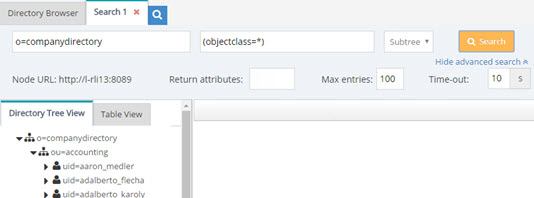
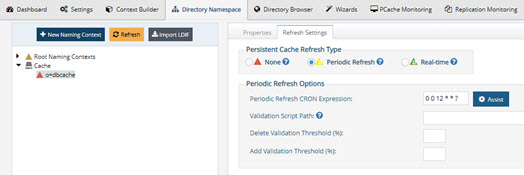

# Search Commands

Searches on the RadiantOne namespace can be performed on the Directory Browser tab in the Main Control Panel. This chapter describes how to perform an LDAP search on the RadiantOne namespace using the <RLI_HOME>/bin/vdsconfig utility instead of using the UI.

## search-vds

This command performs an LDAP search on the RadiantOne namespace.

**Usage**
 `search-vds -dn <dn> [-attr <attr>] [-filter <filter>] [-instance <instance>] [-leader] [-scope <scope>] [-sizelimit <sizelimit>] [-timelimit <timelimit>]`

**Command Arguments**

`- dn <dn>`
 [required] The base DN for the search.

`- attr <attr>`
 The attributes to return from the search. If this argument is not specified, all attributes are returned.

`- filter <filter>`
 The LDAP search filter. If this argument is not specified, the search filter defaults to (objectClass=*).

`- instance <instance>`
 The name of the RadiantOne instance. If not specified, the default instance named vds_server is used.

`- leader`
 Indicates that the search should be performed on the current RadiantOne leader.

`- scope <scope>`
 The scope of the search. If this argument is not specified, the search defaults to base scope. Accepted values: base, one, sub.

`- sizelimit <sizelimit>`
 The size limit for the search.

`- timelimit <timelimit>`
 The time limit for the search, in milliseconds.

**Examples**

### Manually Trigger a Periodic Persistent Cache Refresh

Periodic persistent cache refresh can be configured from the Main Control Panel > Directory Namespace tab > Cache section > selected cache branch > Refresh Settings tab.

You can manually initiate a periodic persistent cache refresh with the following command (substitute your cached naming context for <pcache naming>).

`C:\radiantone\vds\bin>vdsconfig.bat search-vds -dn "action=deltarefreshpcache,<pcachenaming>" -filter "(objectclass=*)" -leader`

**REST (ADAP) Example**

In the following example, a request is made to search the o=companyprofiles naming context in RadiantOne.

`https://<rli_server_name>:8090/adap/util?action=vdsconfig&commandname=search-vds&dn=o=companyprofiles&attr=EMPLOYEEID&scope=sub&filter=(employeeType=Intern)&sizelimit=12`
