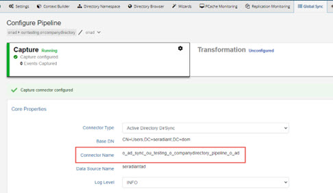
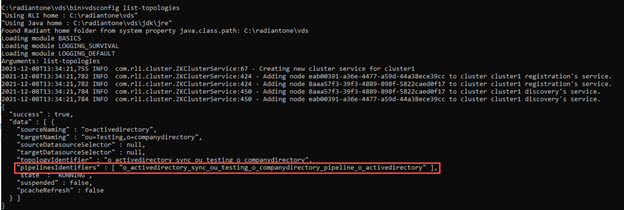

# Global Sync Commands

This chapter outlines commands used to configure Global Sync.

Global synchronization configuration can be performed on the Main Control Panel > Global Sync tab.

Several commands require the connectorname and/or the pipelineID. For Global Sync capture connectors, the value for the connectorname argument can be found in the Main Control Panel > Global Sync Monitoring tab. Select the topology on the left and click Configure on the right. Click the Capture component and expand the Core Properties section at the bottom. Note the Connector Name value. An example is shown below.



You can find the pipeline ID using the vdsconfig command line utility with the list-topologies command. The “pipelinesIdentifiers” property returns the pipeline ID. An example is shown below.



You can find the pipeline ID from the Main Control Panel > Global Sync tab.

Select the topology and hover over the name property of the pipeline. An example is shown below.


## create-sync-topology

Creates a Global Sync topology and its pipelines between two RadiantOne naming contexts.

**Usage**
<br>`create-sync-topology -namingcontextdn <namingcontextdn> -targetnamingcontextdn <target naming context DN>`

**Command Arguments:**

**`- namingcontextdn <naming context DN>`**
<br>[required] The DN of the naming context representing the source in the synchronization topology to be created.

**`- targetnamingcontextdn <target naming context DN>`**
<br>[required] The DN of the target naming context representing the destination in the synchronization topology to be created.

## remove-sync-topology

Removes a sync topology setup between two RadiantOne naming contexts.

**Usage**
<br>`remove-sync-topology -topologyid <topologyID>`

**Command Arguments:**

**`- topologyid <topologyID>`**
[required] The identifier of the topology to be removed. Run the list-topologies command to locate the topologyIdentifier.

## list-topologies

This command lists all topologies and can be helpful to find property values like pipeline identifiers and topology identifiers that are required arguments for other commands.

## get-topology-id

Get the topology identifier associated with two RadiantOne naming contexts.

**Usage**
<br>`get-topology-id -namingcontextdn <naming context DN> -targetnamingcontextdn <target naming context DN>`

**Command Arguments:**

**`- namingcontextdn <naming context DN>`**
<br>[required] The DN of the source naming context in the sync topology.

**`- targetnamingcontextdn <target naming context DN>`**
<br>[required] The DN of the target naming context in the sync topology.

## get-topology

Gets the topology information associated with a given topology identifier.

**Usage**
<br>`get-topology -topologyid <topologyID>`

**Command Arguments:**

**`- topologyid <topologyID>`**
<br>[required] The identifier of the topology. Run the list-topologies command to locate the topologyIdentifier.


## get-pipeline

Gets the pipeline information and data metrics for a given pipeline identifier.

**Usage**
<br>`get-pipeline -pipelineid <pipelineID>`

**Command Arguments:**

**`- pipelineid <pipelineID>`**
<br>[required] The identifier of the pipeline. Run the list-topologies command to locate the pipelines identifiers for each topology.

## init-sync-pipeline

Initializes/uploads data into the target store for a given sync pipeline.

**Usage**
<br>`init-sync-pipeline -pipelineid <pipelineID>`

**Command Arguments:**

**`- pipelineid <pipelineID>`**
<br>[required] The identifier of the pipeline. Run the list-topologies command to locate the pipelines identifiers for each topology.

## abort-init-sync-pipeline

Aborts any current init/upload process on a sync pipeline. Requests are processed as soon as possible.

**Usage**
<br>`abort-init-sync-pipeline -pipelineid <pipelineID>`

**Command Arguments:**

**`- pipelineid <pipelineID>`**
<br>[required] The identifier of the pipeline. Run the list-topologies command to locate the pipelines identifiers for each topology.

## dl-replay-sync-pipeline

Replays events from the dead-letter queue associated with a sync pipeline. Messages that fail to be applied on a target due to a non-communication error, are placed in the dead letter queue once the max number of retries (default of 5) are exhausted.

**Usage**
<br>`dl-replay-sync-pipeline -pipelineid <pipelineID>`

**Command Arguments:**

**`- pipelineid <pipelineID>`**
<br>[required] The identifier of the pipeline. Run the list-topologies command to locate the pipelines identifiers for each topology.

## abort-dl-replay-sync-pipeline

Aborts dead-letter replay process on a sync pipeline. The request is processed as soon as possible.

**Usage**
<br>`abort-dl-replay-sync-pipeline -pipelineid <pipelineID>`

**Command Arguments:**

**`- pipelineid <pipelineID>`**
<br>[required] The identifier of the pipeline. Run the list-topologies command to locate the pipelines identifiers for each topology.

## change-pipeline-state

This command is used to resume or suspend the synchronization process associated with a given pipeline in a topology.

**Usage**
<br>`change-pipeline-state -pipelineid <pipelineID> -state `<state>

**Command Arguments:**

**`- pipelineid <pipelineID>`**
<br>[required] The identifier of the pipeline. Run the list-topologies command to locate the pipelines identifiers for each topology.

**`- state <state>`**
<br>[required] The state for the pipeline. Use a value of “resume” to start the synchronization process. Use a value of “suspend” to stop the synchronization process.

## empty-queues

Every synchronization pipeline has its own queues below the cn=queue and cn=dlqueue naming contexts identified by the pipelineID. Messages are added into the queues by the capture connectors and retrieved from the queues by the sync engine. The sync engine can place failed messages back in the queues to replay later. This command empties the queues for a specific pipeline.

**Usage**
<br>`empty-queues -pipelineid <pipelineid> [-mode <mode>]`

**Command Arguments:**

**`- pipelineid <pipelineID>`**
<br>[required] The identifier of the pipeline. Run the list-topologies command to locate the pipelines
identifiers for each topology.

**`- mode <mode>`**
<br>This property indicates which queue to empty. Accepted values are: QUEUE_ONLY, DEAD_LETTER_QUEUE, or ALL. If mode is not passed in the command, ALL is the default, and both the main queue and dead letters queues are emptied. If you only want to empty the main queue, enter a value of QUEUE_ONLY for the mode. If you only want to empty the dead letter queue, enter a value of DEAD-LETTER_QUEUE for the mode.

## reset-cursor

This command resets the cursor for a capture connector associated with a specific sync pipeline. The cursor is used by the connector to keep track of what changes it has processed.

**Usage**
<br>`reset-cursor -pipelineid <pipelineID>`

**Command Arguments:**

**`- pipelineid <pipelineID>`**
<br>[required] The identifier of the pipeline. Run the list-topologies command to locate the pipelines identifiers for each topology.

## list-agents

Lists the identifier of currently running agents. An example of the output of this command is below:

```sh
{
"success" : true,
"data" : [ "agent_W-RLI21-LGRADY_fid_sd_agent__real_time_PID_1288" ]
}
```

## stop-all-agents

Agents manage connectors used for synchronization. Agents can run on any type of RadiantOne cluster node (follower or leaders) and there is only one agent running at any given
time in a RadiantOne cluster.

Agents are also used for CPLDS sync processes and real-time persistent cache refreshes. This command stops all agents.

>[!note]
>This command stops agents used in CPLDS, global synchronization and real-time persistent cache refresh.

## stop-all-local-agents

Agents manage capture connectors used in synchronization. Agents can run on any type of RadiantOne cluster node (follower or leaders) and there is only one agent running at any given time in a RadiantOne cluster.

Agents are also used for CPLDS sync processes and real-time persistent cache refreshes. This command stops all local agents running on the machine from which the command was launched.

>[!note]
>This command stops agents used in CPLDS, global synchronization and real-time persistent cache refresh.

## configure-connector-type

Sets the connector type for a connector.

**Usage**
<br>`configure-connector-type -connectortype <connector type> -pipelineid <pipelineID> [-skipconfirmation]`

**Command Arguments:**

**`- connectortype <connector type>`**
<br>[required] The connector type. Use one of the following values: CHANGELOG, AD_DIRSYNC, AD_USN, AD_HYBRID, DB_TIMESTAMP, DB_COUNTER, DB_TRIGGER, SCIM2, SCIM1, GRAPHAPI, MGRAPH, OKTA, KAFKA, KAFKA_GG, PERSISTENT_SEARCH, LDAP_APPLY, SCIM2_APPLY

**`- pipelineid <pipelineID>`**
<br>[required] The identifier of the pipeline. Run the list-topologies command to locate the pipelines identifiers for each topology.

**`- skipconfirmation`**
<br>Bypasses the confirmation when deconfiguring the connector. If this argument is omitted, the command requires confirmation before deconfiguring the connector.

## list-connectors

Lists the connector names for a specified topology.

**Usage**
<br>`list-connectors -topologyid <topologyID>`

**Command Arguments:**

**`- topologyid <topologyID>`**
<br>[required] The identifier of the topology. Run the list-topologies command to locate the topologyIdentifier.

## list-connector-properties

Lists all the properties and values for a connector in a given sync pipeline.

**Usage**
<br>`list-connector-properties -pipelineid <pipelineID>`

**Command Arguments:**

**`- pipelineid <pipelineID>`**
<br>[required] The identifier of the pipeline. Run the list-topologies command to locate the pipelines identifiers for each topology.

## get-connector-property

Returns the value of a specific property for a connector.

**Usage**
<br>`get-connector-property -pipelineid <pipelineID> -propertyid <propertyid>`

**Command Arguments:**

**`- pipelineid <pipelineID>`**
<br>[required] The identifier of the pipeline. Run the list-topologies command to locate the pipelines identifiers for each topology.

**`- propertyid <propertyID>`**
<br>[required] The connector property name. Run the list-connector-properties command to see a list of property IDs.

## set-connector-property

Sets the value of a specific property for a connector.

**Usage**
<br>`set-connector-property -pipelineid <pipelineID> -propertyid <propertyID> -propertyvalue <property value>`

**Command Arguments:**

**`- pipelineid <pipelineID>`**
<br>[required] The identifier of the pipeline. Run the list-topologies command to locate the pipelines
identifiers for each topology.

**`- propertyid <propertyID>`**
<br>[required] The connector propery name. Run the list-connector-properties command to see a list of property IDs.

**`- propertyvalue <property value>`**
<br>[required] The connector property value.

>[!note]
>For Windows command line, some property values require double quotes surrounding them. In this case, you can use the \ to protect the “. E.g. C:\radiantone\vds\bin>vdsconfig.bat set-connector-property -connectorname o_sead_pcache_proxy__dc_seradiant_dc_dom__seradiantad -propertyid "excludedAttributes" -propertyvalue [\"member\",\"memberOf\",\"whenCreated\"]

>**If the property value contains a `<space>`, protect the entire value with double quotes. E.g. C:\radiantone\vds\bin>vdsconfig.bat set-connector-property - connectorname o_sead_pcache_proxy__dc_seradiant_dc_dom__seradiantad - propertyid includedBranches -propertyvalue “[ \"cn=users,dc=seradiant,dc=dom\",\"cn=domain groups,dc=seradiant,dc=dom\ "]”**

## file-set-connector-properties

This command can be used to set multiple connector properties contained in a property file.

**Usage**
<br>`file-set-connector-properties -pipelineid <pipelineID> -propertyfilename <property file name>`

**Command Arguments:**

**`- pipelineid <pipelineID>`**
<br>[required] The identifier of the pipeline. Run the list-topologies command to locate the pipelines identifiers for each topology.

**`- propertyfilename <property file name>`**
<br>[required] The full path to a file containing the connector configuration properties.

>[!note]
>The contents of the file must be in JSON format. An example of the syntax used inside the properties file is shown below.

>**{ "pollingInterval" : 10001, "sizeLimit" : 1001, "retryIntervalOnError" : 10001,
"retryIntervalOnConnectionError" : 10001, "retryIntervalOnCommitError" :
10001, "retryIntervalOnPartialCommitError" : 10001, "queueCommitDelay" :
10001, "queueCommitSize" : 1001}**

## execute-db-changelog-scripts

Executes scripts to configure or de-configure a database capture connector.

**Usage**
<br>`Execute-db-changelog-scripts -namingcontextdn <naming context DN> -pipelineid <pipelineID> [-deconfigure]`

**Command Arguments:**

**`- namingcontextdn <naming context DN>`**
<br>[required] The DN for the source RadiantOne naming context for a given sync topology.

**`- pipelineid <pipelineID>`**
<br>[required] The identifier of the pipeline. Run the list-topologies command to locate the pipelines identifiers for each topology.

**- deconfigure**
<br>If this is specified, scripts are run to de-configure the connector. Otherwise, scripts are executed to configure the capture connector.

## set-transform-mode

Sets the transformation mode (mappings, script, or all) for a sync pipeline.

**Usage**
<br>`set-transform-mode -mode <mode> -pipelineid <pipelineID>`

**Command Arguments:**

**`- mode <mode>`**
<br>[required] The transformation mode to assign. If you only want to use attribute mappings for the transformation, set the value to: mappings

If you only want to use a script for transformation, set the value to: script

To use both attribute mappings and a script for transformation, set the value to: all

**`- pipelineid <pipelineID>`**
<br>[required] The identifier of the pipeline. Run the list-topologies command to locate the pipelines identifiers for each topology.

## create-transform-jar

Rebuilds the <RLI_HOME>\vds_server\custom\lib\fidsync.jar file with the latest scripts.

## create-transform-script

Re-creates the transformation script for a pipeline.

**Usage**
<br>`create-transform-script -pipelineid <pipelineID> [-overwrite]`

**Command Arguments:**

**`- pipelineid <pipelineID>`**
<br>[required] The identifier of the pipeline. Run the list-topologies command to locate the pipelines identifiers for each topology.

**`- overwrite`**
<br>If this is specified, existing resources are overwritten. Otherwise, existing resources are not overwritten.

## list-pipeline-mappings

Lists all attribute mappings for a pipeline.

**Usage**
<br>`list-pipeline-mappings -pipelineid <pipelineID>`

**Command Arguments:**

**`- pipelineid <pipelineID>`**
<br>[required] The identifier of the pipeline. Run the list-topologies command to locate the pipelines identifiers for each topology.

## set-pipeline-mappings

Sets the attribute mappings for a pipeline.

**Usage**
<br>`set-pipeline-mappings -mappingfile <mappingfile> -pipelineid <pipelineID>`

**Command Arguments:**

**`- mappingfile <mappingfile>`**
<br>[required] The full path to a file containing the pipeline mappings in JSON format.

**`- pipelineid <pipelineID>`**
<br>[required] The identifier of the pipeline. Run the list-topologies command to locate the pipelines identifiers for each topology.

## delete-pipeline-mappings

Deletes all attribute mappings for a pipeline.

**Usage**
<br>`delete-pipeline-mappings -pipelineid <pipelineID>`

**Command Arguments:**

**`- pipelineid <pipelineID>`**
<br>[required] The identifier of the pipeline. Run the list-topologies command to locate the pipelines identifiers for each topology.
