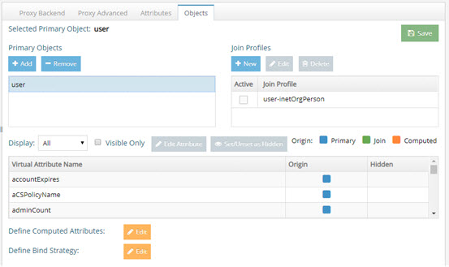
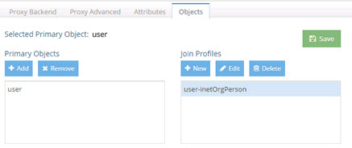
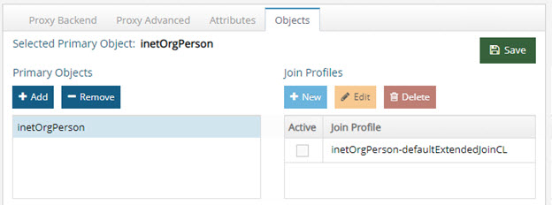
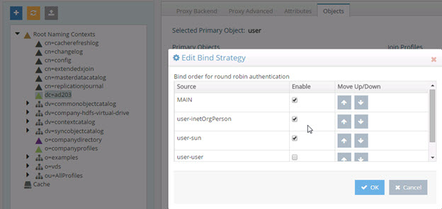
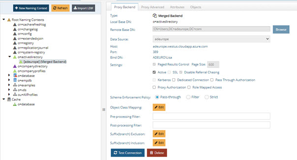
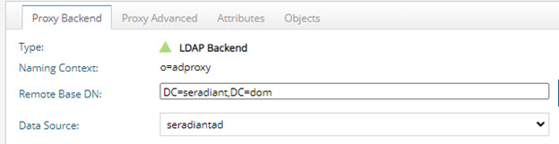
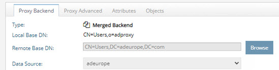
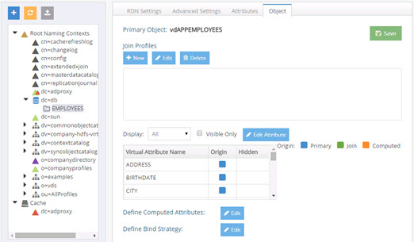
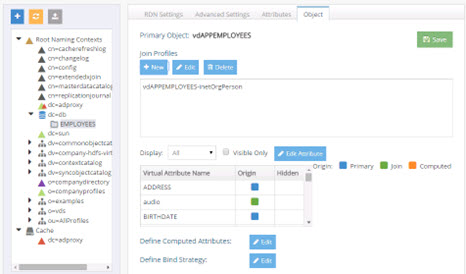
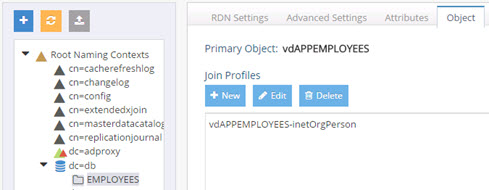

# Object and Attribute Commands

This chapter explains how to perform various object and attribute commands using the REST API.

## LDAP Proxy Global Attributes

Managing special properties (e.g. Always Requested, Virtual Attribute Name, Hidden, DN remapping) for attributes associated with primary LDAP backends (globally, meaning that the attributes could be associated with any object class in the backend) is done from the Main Control Panel > Directory Namespace tab > selected LDAP proxy view > Attributes tab.


### list-ldap-attr

This command displays the list of attributes associated with an LDAP proxy view, that have been customized with special properties (e.g. Always Requested, Virtual Attribute Name, Hidden, DN Remapping).

**Usage:**
<br>list-ldap-attr -namingcontext <namingcontext> [-instance <instance>][-mergedatasource <mergedatasource>] [-mergeremotedn <mergeremotedn>]`

**Command Arguments:**

**`- namingcontext <namingcontext>`**
<br>[required] The full DN of the node or naming context.

**`- instance <instance>`**
<br>The name of the RadiantOne instance. If not specified, the default instance named vds_server is used.

**`- mergedatasource <mergedatasource>`**
<br>The data source name for the merge tree backend. Note: specify this option only if you intend to use the command on a merge tree backend. Required when used on merged backends.

**`- mergeremotedn <mergeremotedn>`**
<br>The remote base DN for the merge tree backend. Note: specify this option if only you intend to use the command on a merge tree backend. Required when used on merged backends.

**REST (ADAP) Example**

In the following example, a request is made to display the attributes associated with an LDAP proxy view.

```
https://<rli_server_name>:8090/adap/util?action=vdsconfig&commandname=list-ldap-attr&namingcontext=o=companyprofiles,o=mergetree&mergedatasource=vdsha&mergeremotedn=o=companyprofiles
```

## add-ldap-attr

This command adds attributes associated with an LDAP proxy view, to be customized with special properties.

**Usage:**
`add-ldap-attr -name <name> -namingcontext <namingcontext> [-alwaysreq <alwaysreq>] [-dnremap <dnremap>] [-hidden <hidden>] [-instance <instance>] [-mappedname <mappedname>] [-mergedatasource <mergedatasource>] [-mergeremotedn <mergeremotedn>]`

**Command Arguments:**

**`- name <name>`**
<br>[required] The name of the attribute to be added.

**`- namingcontext <namingcontext>`**
<br>[required] The full DN of the node or naming context.

**`- alwaysreq <alwaysreq>`**
<br>The 'always requested' property value for an attribute. Accepted values are: true, false.

**`- dnremap <dnremap>`**
<br>The 'DN Remapping' property value for an attribute. Accepted values are: true, false.

**`- hidden <hidden>`**
<br>The 'hidden' property value for an attribute. Accepted values are: true, false.

**`- instance <instance>`**
<br>The name of the RadiantOne instance. If not specified, the default instance named vds_server is used.

**`- mappedname <mappedname>`**
<br>The mapped/virtual name for the attribute.

**`- mergedatasource <mergedatasource>`**
<br>The data source name for the merge tree backend. Note: specify this option only if you intend to use the command on a merge tree backend. Required when used on merged backends.

**`- mergeremotedn <mergeremotedn>`**
<br>The remote base DN for the merge tree backend. Note: specify this option if only you intend to use the command on a merge tree backend. Required when used on merged backends.

**REST (ADAP) Example**

In the following example, a request is made to add the Phone attribute with a remapped name of “mobile” to the LDAP proxy view mounted at o=mergetree.

```
https://<rli_server_name>:8090/adap/util?action=vdsconfig&commandname=add-ldap-attr&name=phone&namingcontext=o=mergetree&alwaysreq=true&dnremap=false&mappedname=mobile
```

## update-ldap-attr

This command updates the special properties for a given attribute associated with an LDAP proxy view.

**Usage:**
`update-ldap-attr -name <name> -namingcontext <namingcontext> [-alwaysreq <alwaysreq>] [-dnremap <dnremap>] [-hidden <hidden>] [-instance <instance>] [-mappedname <mappedname>] [-mergedatasource <mergedatasource>] [-mergeremotedn <mergeremotedn>]`

**Command Arguments:**

**`- name <name>`**
<br>[required] The name of the attribute before remapping.


**`- namingcontext <namingcontext>`**
<br>[required] The full DN of the node or naming context.

**`- alwaysreq <alwaysreq>`**
<br>The 'always requested' property value for an attribute. Accepted values are: true, false.

**`- dnremap <dnremap>`**
<br>The 'DN Remapping' property value for an attribute. Accepted values are: true, false.

**`- hidden <hidden>`**
<br>The 'hidden' property value for an attribute. Accepted values are: true, false.

**`- instance <instance>`**
<br>The name of the RadiantOne instance. If not specified, the default instance named vds_server is used.

**`- mappedname <mappedname>`**
<br>The mapped/virtual name for the attribute.

**`- mergedatasource <mergedatasource>`**
<br>The data source name for the merge tree backend. Note: specify this option only if you intend to use the command on a merge tree backend. Required when used on merged backends.

**`- mergeremotedn <mergeremotedn>`**
<br>The remote base DN for the merge tree backend. Note: specify this option if only you intend to use the command on a merge tree backend. Required when used on merged backends.

**REST (ADAP) Example**

In the following example, a request is made to update the automatic DN remapping (set it to true) for the manager attribute in the LDAP proxy view mounted at o=mergetree.

```
https://<rli_server_name>:8090/adap/util?action=vdsconfig&commandname=update-ldap-attr&name=manager&namingcontext=o=mergetree&alwaysreq=true&dnremap=true&mappe
dname=fidmanager
```

## delete-ldap-attr

This command removes an attribute that has been customized with special properties from LDAP proxy view.

**Usage:**
`delete-ldap-attr -name <name> -namingcontext <namingcontext> [-instance <instance>] [-mergedatasource <mergedatasource>] [-mergeremotedn <mergeremotedn>]`

**Command Arguments:**

**`- name <name>`**
<br>[required] The name of the attribute before remapping.

**`- namingcontext <namingcontext>`**
<br>[required] The full DN of the node or naming context.

**`- instance <instance>`**
<br>The name of the RadiantOne instance. If not specified, the default instance named vds_server is used.

**`- mergedatasource <mergedatasource>`**
<br>The data source name for the merge tree backend. Note: specify this option only if you intend to use the command on a merge tree backend. Required when used on merged backends.

**`- mergeremotedn <mergeremotedn>`**
<br>The remote base DN for the merge tree backend. Note: specify this option if only you intend to use the command on a merge tree backend. Required when used on merged backends.

REST (ADAP) Example

In the following example, a request is made to delete the special handling of the Phone attribute from the LDAP proxy view mounted at o=mergetree.

```
https://<rli_server_name>:8090/adap/util?action=vdsconfig&commandname=delete-ldap-attr&name=phone&namingcontext=o=mergetree
```
## LDAP Proxy Primary Objects

Primary objects associated with LDAP proxy views can be managed from the Main Control Panel > Directory Namespace tab > selected LDAP proxy view > Objects tab.


The following commands can be used with the <RLI_HOME>/bin/vdsconfig utility instead of the UI mentioned above.

### list-ldap-primary

This command displays the list of primary objects that can be added to a specific LDAP proxy view.

**Usage:**
<br>`list-ldap-primary -namingcontext <namingcontext> [-instance <instance>] [-mergedatasource <mergedatasource>] [-mergeremotedn <mergeremotedn>]`

**Command Arguments:**

**`- namingcontext <namingcontext>`**
[required] The full DN of the node or naming context.

**`- instance <instance>`**
The name of the RadiantOne instance. If not specified, the default instance named vds_server is used.

**`- mergedatasource <mergedatasource>`**
The data source name for the merge tree backend. Note: specify this option only if you intend to use the command on a merge tree backend. Required when used on merged backends.

**`- mergeremotedn <mergeremotedn>`**
The remote base DN for the merge tree backend. Note: specify this option if only you intend to use the command on a merge tree backend. Required when used on merged backends.

**REST (ADAP) Example**

In the following example, a request is made to list the primary objects configured for an LDAP proxy view mounted at o=mergetree.

```
https://<rli_server_name>:8090/adap/util?action=vdsconfig&commandname=list-ldap-primary&namingcontext=o=mergetree
```

### add-ldap-primary

This command adds a primary object and all its associate attributes to an LDAP proxy view.

**Usage:**
add-ldap-primary -namingcontext <namingcontext> -primaryobject <primaryobject> [-instance <instance>][-mergedatasource <mergedatasource>] [-mergeremotedn <mergeremotedn>]

**Command Arguments:**

**`- namingcontext <namingcontext>**
<br>[required] The full DN of the node or naming context.

**`- primaryobject <primaryobject>`**
<br>[required] The name of the primary object.

**`- instance <instance>`**
<br>The name of the RadiantOne instance. If not specified, the default instance named vds_server is used.

**`- mergedatasource <mergedatasource>`**
<br>The data source name for the merge tree backend. Note: specify this option only if you intend to use the command on a merge tree backend. Required when used on merged backends.

**`- mergeremotedn <mergeremotedn>`**
<br>The remote base DN for the merge tree backend. Note: specify this option if only you intend to use the command on a merge tree backend. Required when used on merged backends.

**REST (ADAP) Example**

In the following example, a request is made to add the inetorgperson primary object to the LDAP proxy view mounted at o=mergtree.

```
https://<rli_server_name>:8090/adap/util?action=vdsconfig&commandname=add-ldap-primary&namingcontext=o=mergetree&primaryobject=inetOrgPerson
```

### delete-ldap-primary

This command deletes an existing primary object on an LDAP proxy view.

**Usage:**
<br>`delete-ldap-primary -namingcontext <namingcontext> -primaryobject <primaryobject> [-instance <instance>][-mergedatasource <mergedatasource>] [-mergeremotedn <mergeremotedn>]`

**Command Arguments:**

**`- namingcontext <namingcontext>`**
<br>[required] The full DN of the node or naming context.

**`- primaryobject <primaryobject>`**
<br>[required] The name of the primary object.

**`- instance <instance>`**
<br>The name of the RadiantOne instance. If not specified, the default instance named vds_server is used.

**`- mergedatasource <mergedatasource>`**
<br>The data source name for the merge tree backend. Note: specify this option only if you intend to use the command on a merge tree backend. Required when used on merged backends.

**`- mergeremotedn <mergeremotedn>`**
<br>The remote base DN for the merge tree backend. Note: specify this option if only you intend to use the command on a merge tree backend. Required when used on merged backends.

**REST (ADAP) Example**

In the following example, a request is made to delete the inetorgperson primary object from an LDAP proxy view mounted at o=mergetree.

```
https://<rli_server_name>:8090/adap/util?action=vdsconfig&commandname=delete-ldap-primary&namingcontext=o=mergetree&primaryobject=inetOrgPerson
```

## LDAP Proxy Primary Object Attributes

Attributes associated with primary objects configured for LDAP proxy views can be managed from the Main Control Panel, Directory Namespace tab, selected LDAP proxy view, Objects tab. Once a primary object has been added, properties can be assigned for the attributes. Computed attributes can also be defined.



The following commands can be used with the <RLI_HOME>/bin/vdsconfig utility instead of the UI mentioned above.

### list-ldap-primary-attr

This command displays a list of all attributes found for a primary object on an LDAP proxy view. The objectclass must be defined as a primary object for the LDAP proxy view before using this command.

**Usage:**
<br>`list-ldap-primary-attr -namingcontext <namingcontext> -primaryobject <primaryobject> [-columns <columns>] [-instance <instance>][-mergedatasource <mergedatasource>]
[-mergeremotedn <mergeremotedn>]`

**Command Arguments:**

**`- namingcontext <namingcontext>`**
<br>[required] The full DN of the node or naming context.

**`- primaryobject <primaryobject>`**
<br>[required] The name of the primary object.

**`- columns <columns>`**
<br>The list of attribute properties to display, separated by commas. If this parameter is not specified, all properties are shown. Accepted property names are: Source, Mapped, Hidden, Searchable, Updatable, Priority.

**`- instance <instance>`**
<br>The name of the RadiantOne instance. If not specified, the default instance named vds_server is used.

**`- mergedatasource <mergedatasource>`**
<br>The data source name for the merge tree backend. Note: specify this option only if you intend to use the command on a merge tree backend. Required when used on merged backends.

**`- mergeremotedn <mergeremotedn>`**
<br>The remote base DN for the merge tree backend. Note: specify this option if only you intend to use the command on a merge tree backend. Required when used on merged backends.

**REST (ADAP) Example**

In the following example, a request is made to display a list of all attributes found for a primary object on an LDAP proxy view.

```
https://<rli_server_name>:8090/adap/util?action=vdsconfig&commandname=list-ldap-primary-attr&namingcontext=o=ldapproxy&primaryobject=inetOrgPerson
```

### add-ldap-primary-attr

This command adds an attribute to a primary object for an LDAP proxy view.

**Usage:**
<br>`add-ldap-primary-attr -name <name> -namingcontext <namingcontext> - primaryobject <primaryobject> -source <source> [-computedexpr <computedexpr>] [-hidden <hidden>] [-instance <instance>] [-mappedname <mappedname>]
[-mergedatasource <mergedatasource>] [-mergeremotedn <mergeremotedn>] [-priority <priority>] [-searchable <searchable>] [-updatable <updatable>]`

**Command Arguments:**

**`- name <name>`**
<br>[required] The original name of the attribute.

**`- namingcontext <namingcontext>`**
<br>[required] The full DN of the node or naming context.

**`- primaryobject <primaryobject>`**
<br>[required] The name of the primary object.

**`- source <source>`**
<br>[required] The source of an attribute. For computed attributes use 'Computed'. For join attributes, use the join ID.

**`- computedexpr <computedexpr>`**
The computed expression for the attribute. This expression should contain the attribute name. Example: EMAIL=lastname+"@radiant.com". Note: applies only to computed attributes. For information on parsing options for the values in this argument, see [Parsing Command Argument Strings](introduction.md#parsing-command-argument-strings).

**`- hidden <hidden>`**
<br>The 'hidden' property value for an attribute. Accepted values are: true, false.

**`- instance <instance>`**
<br>The name of the RadiantOne instance. If not specified, the default instance named vds_server is used.

**`- mappedname <mappedname>`**
<br>The mapped name for the attribute.

**`- mergedatasource <mergedatasource>`**
<br>The data source name for the merge tree backend. Note: specify this option only if you intend to use the command on a merge tree backend. Required when used on merged backends.

**`- mergeremotedn <mergeremotedn>`**
<br>The remote base DN for the merge tree backend. Note: specify this option if only you intend to use the command on a merge tree backend. Required when used on merged backends.

**`- priority <priority>`**
<br>The priority for an attribute. Accepted values are: LOWEST, LOW, NORMAL, HIGH, HIGHEST.

**`- searchable <searchable>`**
<br>The 'searchable' property value for an attribute. Accepted values are: true, false.

**`- updatable <updatable>`**
<br>The 'updatable' property value for an attribute. Accepted values are: true, false.

**REST (ADAP) Example**

In the following example, a request is made to add the loginID primary attribute to an LDAP proxy view.

```
https://<rli_server_name>:8090/adap/util?action=vdsconfig&commandname=add-ldap-primary-attr&namingcontext=o=ldapproxy&primaryobject=inetOrgPerson&name=loginID&source=inetorgperson-inetorgperson
```

### update-ldap-primary-attr

This command updates the properties of an existing attribute for a primary object of an LDAP proxy view.

**Usage:**
<br>`update-ldap-primary-attr -name <name> -namingcontext <namingcontext> -primaryobject <primaryobject> -source <source> [-computedexpr <computedexpr>] [-hidden <hidden>] [-instance <instance>] [-mappedname <mappedname>] [-mergedatasource <mergedatasource>] [-mergeremotedn <mergeremotedn>] [-priority <priority>] [-searchable <searchable>] [-updatable <updatable>]`

**Command Arguments:**

**`- name <name>`**
<br>[required] The original name of the attribute.

**`- namingcontext <namingcontext>`**
<br>[required] The full DN of the node or naming context.

**`- primaryobject <primaryobject>`**
<br>[required] The name of the primary object.

*`- source <source>`**
<br>[required] The source of an attribute. For primary backend attributes use 'Main'. For computed attributes use 'Computed'. For join attributes, use the join ID.

**`- computedexpr <computedexpr>`**
<br>The computed expression for the attribute. This expression should contain the attribute name. Example: EMAIL=lastname+"@radiant.com". Note: applies only to computed attributes. For information on parsing options for the values in this argument, see Parsing Command Argument
Strings.

**`- hidden <hidden>`**
<br>The 'hidden' property value for an attribute. Accepted values are: true, false.

**`- instance <instance>`**
<br>The name of the RadiantOne instance. If not specified, the default instance named vds_server is used.

**`- mappedname <mappedname>`**
<br>The mapped name for the attribute.

**`- mergedatasource <mergedatasource>`**
<br>The data source name for the merge tree backend. Note: specify this option only if you intend to use the command on a merge tree backend. Required when used on merged backends.

**`- mergeremotedn <mergeremotedn>`**
<br>The remote base DN for the merge tree backend. Note: specify this option if only you intend to use the command on a merge tree backend. Required when used on merged backends.

**`- priority <priority>`**
<br>The priority for an attribute. Accepted values are: LOWEST, LOW, NORMAL, HIGH, HIGHEST.

**`- searchable <searchable>`**
<br>The 'searchable' property value for an attribute. Accepted values are: true, false.

**`- updatable <updatable>`**
<br>The 'updatable' property value for an attribute. Accepted values are: true, false.

**REST (ADAP) Example**

In the following example, a request is made to update the properties of the loginID primary attribute in an LDAP proxy view mounted at o=ldapproxy in the RadiantOne namespace.

```
https://<rli_server_name>:8090/adap/util?action=vdsconfig&commandname=update-ldap-primary-attr&namingcontext=o=ldapproxy&primaryobject=inetOrgPerson&name=loginID&source=inetorgperson-inetorgperson&priority=high&searchable=true&updatable=true
```

### delete-ldap-primary-attr

This command deletes an attribute from a primary object on an LDAP proxy.

**Usage:**
`delete-ldap-primary-attr -name <name> -namingcontext <namingcontext> -primaryobject <primaryobject> -source <source> [-instance <instance>] [-mergedatasource <mergedatasource>] [-mergeremotedn <mergeremotedn>]`

**Command Arguments:**

**`- name <name>`**
<br>[required] The original name of the attribute.

**`- namingcontext <namingcontext>`**
<br>[required] The full DN of the node or naming context.

**`- primaryobject <primaryobject>`**
<br>[required] The name of the primary object.


**`- source <source>`**
<br>[required] The source of an attribute. For computed attributes use 'Computed'. For join attributes, use the join ID.

**`- instance <instance>`**
<br>The name of the RadiantOne instance. If not specified, the default instance named vds_server is used.

**`- mergedatasource <mergedatasource>`**
<br>The data source name for the merge tree backend. Note: specify this option only if you intend to use the command on a merge tree backend. Required when used on merged backends.

**`- mergeremotedn <mergeremotedn>`**
<br>The remote base DN for the merge tree backend. Note: specify this option if only you intend to use the command on a merge tree backend. Required when used on merged backends.

**REST (ADAP) Example**

In the following example, a request is made to delete a primary attribute from an LDAP proxy view mounted at o=ldapproxy in the RadiantOne namespace.

```
https://<rli_server_name>:8090/adap/util?action=vdsconfig&commandname=delete-ldap-primary-attr&namingcontext=o=ldapproxy&primaryobject=inetOrgPerson&name=loginID&source=inetorgperson-inetorgperson
```

## Joins on LDAP Primary Objects

Joins associated with primary objects configured for LDAP proxy views can be managed from the Main Control Panel, Directory Namespace tab, selected LDAP proxy view, Objects tab. Once a primary object has been added, joins can be configured.



The following commands can be used with the <RLI_HOME>/bin/vdsconfig utility instead of the UI mentioned above.

### list-ldap-xjoin

This command displays a list of all join IDs found for a primary object on an LDAP proxy.

**Usage:**
<br>`list-ldap-xjoin -namingcontext <namingcontext> -primaryobject <primaryobject> [-instance <instance>] [-joinid <joinid>] [-mergedatasource <mergedatasource>] [-mergeremotedn <mergeremotedn>]`

**Command Arguments:**

**`- namingcontext <namingcontext>`**
<br>[required] The full DN of the node or naming context.

**`- primaryobject <primaryobject>`**
[required] The name of the primary object.

**`- instance <instance>`**
<br>The name of the RadiantOne instance. If not specified, the default instance named vds_server is used.

**`- joinid <joinid>`**
<br>The join profile name for an existing join. If this option is specified, the command displays the join URL associated with that ID.

**`- mergedatasource <mergedatasource>`**
<br>The data source name for the merge tree backend. Note: specify this option only if you intend to use the command on a merge tree backend. Required when used on merged backends.

**`- mergeremotedn <mergeremotedn>`**
<br>The remote base DN for the merge tree backend. Note: specify this option if only you intend to use the command on a merge tree backend. Required when used on merged backends.

For example, assume a proxy view from Sun Directory is joined to a view from Active Directory. An example configuration as seen in the Main Control Panel is shown below.


Using the example above, the following command would list the join condition:

```
C:\radiantone\vds\bin>vdsconfig.bat list-ldap-xjoin -namingcontext dc=sun -primaryobject inetOrgPerson -joinid inetOrgPerson-user
```

Resulting in something like the following for this join condition.

```
ldaps://[vds]/OU=Users,dc=ad204?cn:1664,mail:1664,memberOf:1664,userAccountControl:1664,sAMAccoutName:1664?sub?(&(cn=@[uid:varchar])(objectclass=user))##SIZELIMIT=0
##XJOIN_GROUP_ID=inetOrgPerson-user##TARGET_OBJECTCLASS=user

```
**REST (ADAP) Example**

In the following example, a request is made to display a list of all join IDs found for a primary object (e.g. inetOrgPerson) configured for an LDAP proxy view.

```
https://<rli_server_name>:8090/adap/util?action=vdsconfig&commandname=list-ldap-xjoin&namingcontext=o=ldapproxy&primaryobject=inetOrgPerson
```

### add-ldap-xjoin

This command adds a new join to a primary object on an LDAP proxy.

**Usage:**
<br>`add-ldap-xjoin -joinid <joinid> -namingcontext <namingcontext> -primaryobject <primaryobject> [-active <active>] [-basedn <basedn>] [-datasourcename <datasourcename>] [-extended] [-instance <instance>] [-joinattr <joinattr>] [-joincondition <joincondition>] [-mergedatasource <mergedatasource>] [-mergeremotedn <mergeremotedn>] [-primaryattr <primaryattr>] [-scope <scope>] [-secondaryattr <secondaryattr>] [-secondaryoc <secondaryoc>] [-sizelimit <sizelimit>]`

**Command Arguments:**

**`- joinid <joinid>`**
<br>[required] The join profile name for the join to be added.

**`- namingcontext <namingcontext>`**
<br>[required] The full DN of the node or naming context.

**`- primaryobject <primaryobject>`**
<br>[required] The name of the primary object.

**`- active <active>`**
<br>Indicates if the external join should be active or disabled. If this argument is not specified, the external join is set to active by default. Accepted values are: true, false.

**`- basedn <basedn>`**
<br>The base DN that is used as a starting point to retrieve entries from the join data source.

**`- datasourcename <datasourcename>`**
<br>The data source name of a registered LDAP data source that is used for the join.

**`- extended`**
<br>Indicates that an extended join should be created. If this option is not specified, a regular join is generated.

**`- instance <instance>`**
<br>The name of the RadiantOne instance. If not specified, the default instance named vds_server is used.

**`- joinattr <joinattr>`**
<br>A list of attributes (separated by comma) to return from the secondary/joined source. Mapped names can be specified using the colon character (Example: EMAIL:mail). If this argument is not specified, all attributes are returned by default.

**`- joincondition <joincondition>`**
<br>The filter for the join. Note: if this argument is not specified, the join condition filter is automatically generated based on the other arguments passed to the command.

**`- mergedatasource <mergedatasource>`**
<br>The data source name for the merge tree backend. Note: specify this option only if you intend to use the command on a merge tree backend. Required when used on merged backends.

**`- mergeremotedn <mergeremotedn>`**
<br>The remote base DN for the merge tree backend. Note: specify this option if only you intend to use the command on a merge tree backend. Required when used on merged backends.

**`- primaryattr <primaryattr>`**
<br>The name of the attribute from the primary object that is used to establish the join condition.

**`- scope <scope>`**
<br>The scope that is used to retrieve entries from the join data source. Accepted values are: sub, one, base.

**`- secondaryattr <secondaryattr>`**
<br>The name of the attribute from the secondary object that is used to establish the join condition.

**`- secondaryoc <secondaryoc>`**
<br>The name of the object class from the secondary object that is used to establish the join condition.

- sizelimit <sizelimit>
<br>The maximum number of entries that should be returned from the secondary object (for each entry in the primary source). If this argument is not specified, the default is 1000.

#### Examples

In the following example, the external join 'inetOrgPerson-defaultExtendedJoinCL' is added to the primary object 'inetorgperson' for the node 'dc=mydjsam'.



Using the example above, the following command could be used to configure the external join from command line.

```
C:\radiantone\vds\bin\vdsconfig.bat add-ldap-xjoin -joinid "inetOrgPerson-defaultExtendedJoinCL" -namingcontext "dc=mydjsam" -active true -primaryobject "inetorgperson" -extended -joinattr "test3" -secondaryoc "extensibleobject"
```

**REST (ADAP) Example**

In the following example, a request is made to add a new join to a primary object (e.g. inetOrgPerson) on an LDAP proxy view mounted at o=ldapproxy.

```
https://<rli_server_name>:8090/adap/util?action=vdsconfig&commandname=add-ldap-xjoin&namingcontext=o=ldapproxy&primaryobject=inetOrgPerson&active=true&basedn=ou=AllProfiles&datasourcename=vds&joinattr=inetorgperson&joincondition=employeeNumber=
@[uid:varchar])(objectclass=user)&scope=sub&joinid=inetorgperson-user
```

### update-ldap-xjoin

This command updates the properties of an existing join associated with a given primary object on an LDAP proxy view.

**Usage:**
<br>`update-ldap-xjoin -joinid <joinid> -namingcontext <namingcontext> - primaryobject <primaryobject> [-active <active>] [-basedn <basedn>] [-datasourcename <datasourcename>] [-instance <instance>] [-joinattr <joinattr>] [-joincondition <joincondition>] [-mergedatasource <mergedatasource>] [-mergeremotedn <mergeremotedn>] [-primaryfilter <primaryfilter>][-returnall] [-scope <scope>] [-secondaryoc <secondaryoc>] [-sizelimit <sizelimit>]`

**Command Arguments:**

**`- joinid <joinid>`**
<br>[required] The join profile name for an existing join.

**`- namingcontext <namingcontext>`**
<br>[required] The full DN of the node or naming context.

**`- primaryobject <primaryobject>`**
<br>[required] The name of the primary object.

**`- active <active>`**
<br>Indicates if the external join should be active or disabled. If this argument is not specified, the external join is set to active by default. Accepted values are: true, false.

**`- basedn <basedn>`**
<br>The base DN that is used as a starting point to retrieve entries from the join data source.

**`- datasourcename <datasourcename>`**
<br>The data source name of a registered LDAP data source that is used for the join.

**`- instance <instance>`**
<br>The name of the RadiantOne instance. If not specified, the default instance named vds_server is used.

**`- joinattr <joinattr>`**
<br>A list of join attributes (separated by comma) to return. Mapped names can be specified using the colon character (Example: EMAIL:mail). If this argument is not specified, all attributes are returned by default.

**`- joincondition <joincondition>`**
<br>The filter for the join. Note: if this argument is not specified, the join condition filter is automatically generated based on the other arguments passed to the command.

**`- mergedatasource <mergedatasource>`**
<br>The data source name for the merge tree backend. Note: specify this option only if you intend to use the command on a merge tree backend. Required when used on merged backends.

**`- mergeremotedn <mergeremotedn>`**
<br>The remote base DN for the merge tree backend. Note: specify this option if only you intend to use the command on a merge tree backend. Required when used on merged backends.

**`- primaryfilter <primaryfilter>`**
<br>A LDAP filter to apply to the primary object, before a join is performed. Note: you can specify the value 'EMPTY' to clear this filter.

**`- returnall`**
<br>Indicates that a join should return all attributes from the secondary source.

**`- scope <scope>`**
<br>The scope that it used to retrieve entries from the join data source. Accepted values are: sub, one, base.

**`- secondaryoc <secondaryoc>`**
<br>The name of the object class from the secondary object that is used to establish the join condition.

**`- sizelimit <sizelimit>`**
<br>The maximum number of entries that should be returned from the secondary object (for each entry in the primary source). If this argument is not specified, the default is 1000.

**REST (ADAP) Example**

In the following example, a request is made to update an existing join on an LDAP proxy view.

```
https://<rli_server_name>:8090/adap/util?action=vdsconfig&commandname=update-ldap-xjoin&namingcontext=o=ldapproxy&primaryobject=inetOrgPerson&active=true&basedn=ou=
AllProfiles&datasourcename=vds&joincondition=employeeNumber=@[uid:varchar])(objectclass=user)&scope=sub&joinid=inetorgperson-user&returnall&sizelimit=20
```

### delete-ldap-xjoin

This command deletes an existing join associated with a given primary object on an LDAP proxy view.

**Usage:**
<br>`delete-ldap-xjoin -joinid <joinid> -namingcontext <namingcontext> - primaryobject <primaryobject> [-instance <instance>] [-mergedatasource <mergedatasource>] [-mergeremotedn <mergeremotedn>]`

**Command Arguments:**

**`- joinid <joinid>`**
<br>[required] The join profile name for an existing join.

**`- namingcontext <namingcontext>`**
<br>[required] The full DN of the node or naming context.

**`- primaryobject <primaryobject>`**
<br>[required] The name of the primary object.

**`- instance <instance>`**
<br>The name of the RadiantOne instance. If not specified, the default instance named vds_server is used.

**`- mergedatasource <mergedatasource>`**
<br>The data source name for the merge tree backend. Note: specify this option only if you intend to use the command on a merge tree backend. Required when used on merged backends.

**`- mergeremotedn <mergeremotedn>`**
<br>The remote base DN for the merge tree backend. Note: specify this option if only you intend to use the command on a merge tree backend. Required when used on merged backends.

**REST (ADAP) Example**

In the following example, a request is made to delete an existing join associated with a primary object (e.g. inetOrgPerson) on an LDAP proxy view mounted at o=ldapproxy in the RadiantOne namespace.

```
https://<rli_server_name>:8090/adap/util?action=vdsconfig&commandname=delete-ldap-xjoin&namingcontext=o=ldapproxy&primaryobject=inetOrgPerson&joinid=inetorgperson-user
```

## Bind Order on LDAP Proxy Views

After joins are defined, bind order can be configured on the bottom of the Objects tab.



The following commands can be used with the <RLI_HOME>/bin/vdsconfig utility instead of the UI mentioned above.

### get-ldap-primary-bindorder

This command displays the bind order for authentication on a primary object.

**Usage:**
<br>`get-ldap-primary-bindorder -namingcontext <namingcontext> -primaryobject <primaryobject> [-instance <instance>] [-list] [-mergedatasource <mergedatasource>] [-mergeremotedn <mergeremotedn>]`

**Command Arguments:**

**`- namingcontext <namingcontext>`**
<br>[required] The full DN of the node or naming context.

**`- primaryobject <primaryobject>`**
<br>[required] The name of the primary object.

**`- instance <instance>`**
<br>The name of the RadiantOne instance. If not specified, the default instance named vds_server is used.

**`- list`**
<br>Indicates that the command should display the list of all available bind source IDs.

**`- mergedatasource <mergedatasource>`**
<br>The data source name for the merge tree backend. Note: specify this option only if you intend to use the command on a merge tree backend. Required when used on merged backends.

**`- mergeremotedn <mergeremotedn>`**
<br>The remote base DN for the merge tree backend. Note: specify this option if only you intend to use the command on a merge tree backend. Required when used on merged backends.

**REST (ADAP) Example**

In the following example, a request is made to display the list of possible sources that can be configured for authentication on an LDAP proxy view.

```
https://<rli_server_name>:8090/adap/util?action=vdsconfig&commandname=get-ldap-primary-bindorder&namingcontext=o=ldapproxy&primaryobject=inetorgperson &list
```

### set-ldap-primary-bindorder

Sets the bind order for authentication on a primary object.

**Usage:**
<br>`set-ldap-primary-bindorder -bindorder <bindorder> -namingcontext <namingcontext> - primaryobject <primaryobject> [-instance <instance>][-mergedatasource <mergedatasource>] [-mergeremotedn <mergeremotedn>]`

**Command Arguments:**

**`- bindorder <bindorder>`**
<br>[required] The bind order to set. This should be an ordered comma-separated list of source IDs. Use the value MAIN to designate the primary backend. Use the join ID to designate other bind sources. Example: MAIN,joinid1,joinid2

**`- namingcontext <namingcontext>`**
<br>[required] The full DN of the node or naming context.

**`- primaryobject <primaryobject>`**
<br>[required] The name of the primary object.

**`- instance <instance>`**
<br>The name of the RadiantOne instance. If not specified, the default instance named vds_server is used.

**`- mergedatasource <mergedatasource>`**
<br>The data source name for the merge tree backend. Note: specify this option only if you intend to use the command on a merge tree backend. Required when used on merged backends.

**`- mergeremotedn <mergeremotedn>`**
<br>The remote base DN for the merge tree backend. Note: specify this option if only you intend to use the command on a merge tree backend. Required when used on merged backends.

**REST (ADAP) Example**

In the following example, a request is made to set the bind order for an LDAP proxy view.

```
https://<rli_server_name>:8090/adap/util?action=vdsconfig&commandname=set-ldap-primary-bindorder&namingcontext=o=ldapproxy&primaryobject=inetOrgPerson&bindorder=inetorgperson-user,MAIN,inetorgperson-employeenumber
```

## LDAP Proxy Merge Tree

Merged backends are configured from the Main Control Panel > Directory Namespace tab.



### list-merge-backend

Outputs a list of the merged backends found under an existing LDAP proxy naming context.

Usage:
list-merge-backend -namingcontext <namingcontext> [-instance <instance>]

**Command Arguments:**

**`- namingcontext <namingcontext>`**
<br>[required] The full DN of an LDAP proxy naming context located in the RadiantOne namespace that contains a merged backend configuration.

**`- instance <instance>`**
<br>The name of the RadiantOne instance. If not specified, the default instance named vds_server is used.

### add-merge-backend

Adds a merged tree backend to an existing LDAP proxy naming context. Create the root naming context for the primary LDAP proxy backend before using the add-merge-backend command.

**Usage:**
add-merge-backend -datasourcename <data source name> -namingcontext <namingcontext> [-basedn <basedn>] [-instance <instance>]

**Command Arguments:**

**`- datasourcename`**
<br>[required] The data source name of the LDAP backend to be merged.

**`- namingcontext <namingcontext>`**
<br>[required] The full DN in the primary LDAP proxy naming context indicating where you want the merged backend to appear.

**`- basedn <basedn>`**
<br>The base DN in the LDAP backend to be merged. This is the starting point for the branch from the LDAP backend that is merged into the main naming context.

**`- instance <instance>`**
<br>The name of the RadiantOne instance. If not specified, the default instance named vds_server is used.

**Example:**

The LDAP proxy view example seen below in the Main Control Panel can have a merged tree added with the following command:

```
C:\radiantone\vds\bin>vdsconfig add-merge-backend -datasourcename adeurope - namingcontext CN=Users,o=adproxy -basedn CN=Users,DC=adeurope,DC=com -instance vds_server
```



After the command is run, the following screen shows the configuration in the Main Control Panel.


### delete-merge-backend

Removes a merged tree backend from an LDAP proxy naming context.

**Usage:**
<br>`delete-merge-backend -datasourcename <data source name> - namingcontext <namingcontext> [-basedn <basedn>] [-instance <instance>]`

**Command Arguments:**

**`- datasourcename`**
<br>[required] The data source name of the merged LDAP backend.

**`- namingcontext <namingcontext>`**
<br>[required] The full DN in the primary LDAP proxy naming context indicating where the merged backend appears.

**`- basedn <basedn>`**
<br>The base DN in the LDAP backend that is merged into the primary proxy view.

**`- instance <instance>`**
<br>The name of the RadiantOne instance. If not specified, the default instance named vds_server is used.

Example:
<br>The merged backend example seen below in the Main Control Panel can be removed with the following command:

```
C:\radiantone\vds\bin>vdsconfig delete-merge-backend -datasourcename adeurope - namingcontext CN=Users,o=adproxy -basedn CN=Users,DC=adeurope,DC=com -instance vds_server
```



## Database Proxy Attributes

Attributes associated with database proxy views can be managed from the Main Control Panel, Directory Namespace tab, selected database proxy view, Attributes tab and from the Object tab. Computed attributes can also be defined.




The following commands can be used with the <RLI_HOME>/bin/vdsconfig utility instead of the UI mentioned above.

### list-content-attr

This command displays a list of all attributes found for a content/container node.

**Usage:**
<br>`list-content-attr -namingcontext <namingcontext> [-columns <columns>] [-instance <instance>]`

**Command Arguments:**

**`- namingcontext <namingcontext>`**
<br>[required] The full DN of the node or naming context.

**`- columns <columns>`**
<br>The list of attribute properties to display, separated by commas. If this parameter is not specified, all properties are shown. Accepted property names are: Source, Mapped, Hidden, Searchable, Updatable, Priority.

**`- instance <instance>`**
<br>The name of the RadiantOne instance. If not specified, the default instance named vds_server is used.

**REST (ADAP) Example**

In the following example, a request is made to list the searchable attributes in a content node for a database proxy view.

```
https://<rli_server_name>:8090/adap/util?action=vdsconfig&commandname=list-content-attr&namingcontext=employees,dc=db&columns=searchable
```

### add-content-attr

This command adds an attribute to a content or container node.

**Usage:**
<br>`add-content-attr -name <name> -namingcontext <namingcontext> -source <source> [-computedexpr <computedexpr>] [-hidden <hidden>] [-instance <instance>] [-mappedname <mappedname>] [-priority <priority>] [-searchable <searchable>] [-updatable <updatable>]`

**Command Arguments:**

**`- name <name>`**
<br>[required] The original name of the attribute.

**`- namingcontext <namingcontext>`**
<br>[required] The full DN of the node or naming context.

**`- source <source>`**
<br>[required] The source of an attribute. For primary backend attributes use 'Main'. For computed attributes use 'Computed'. For join attributes, use the join ID.

**`- computedexpr <computedexpr>`**
<br>The computed expression for the attribute. This expression should contain the attribute name. Example: EMAIL=lastname+"@radiant.com". Note: applies only to computed attributes. For information on parsing options for the values in this argument, see [Parsing Command Argument
Strings](introduction.md#parsing-command-argument-strings).

**`- hidden <hidden>`**
The 'hidden' property value for an attribute. Accepted values are: true, false.

**`- instance <instance>`**
The name of the RadiantOne instance. If not specified, the default instance named vds_server is used.

**`- mappedname <mappedname>`**
The mapped name for the attribute.

**`- priority <priority>`**
The priority for an attribute. Accepted values are: LOWEST, LOW, NORMAL, HIGH, HIGHEST.

**`- searchable <searchable>`**
The 'searchable' property value for an attribute. Accepted values are: true, false.

**`- updatable <updatable>`**
The 'updatable' property value for an attribute. Accepted values are: true, false.

**REST (ADAP) Example**

In the following example, a request is made to add an attribute called LOGIN to a content node of a database proxy view.

```
https://<rli_server_name>:8090/adap/util?action=vdsconfig&commandname=add-content-
attr&namingcontext=employees,dc=db&name=login&source=main
```

### update-content-attr

This command updates the properties of an existing attribute for a content or container node.

**Usage:**
<br>`update-content-attr -name <name> -namingcontext <namingcontext> -source <source> [-computedexpr <computedexpr>] [-hidden <hidden>] [-instance <instance>][-mappedname <mappedname>] [-priority <priority>] [-searchable <searchable>] [-updatable <updatable>]`

**Command Arguments:**

**`- name <name>`**
<br>[required] The original name of the attribute.

**`- namingcontext <namingcontext>`**
<br>[required] The full DN of the node or naming context.

**`- source <source>`**
<br>[required] The source of an attribute. For primary backend attributes use 'Main'. For computed attributes use 'Computed'. For join attributes, use the join ID.

**`- computedexpr <computedexpr>`**
<br>The computed expression for the attribute. This expression should contain the attribute name. Example: EMAIL=lastname+"@radiant.com". Note: applies only to computed attributes. For information on parsing options for the values in this argument, see [Parsing Command Argument Strings](introduction.md#parsing-command-argument-strings).

**`- hidden <hidden>`**
<br>The 'hidden' property value for an attribute. Accepted values are: true, false.

**`- instance <instance>`**
<br>The name of the RadiantOne instance. If not specified, the default instance named vds_server is used.

**`- mappedname <mappedname>`**
<br>The mapped/virtual name for the attribute.

**`- priority <priority>`**
<br>The priority for an attribute. Accepted values are: LOWEST, LOW, NORMAL, HIGH, HIGHEST.

**`- searchable <searchable>`**
<br>The 'searchable' property value for an attribute. Accepted values are: true, false.

**`- updatable <updatable>`**
<br>The 'updatable' property value for an attribute. Accepted values are: true, false.

**REST (ADAP) Example**

In the following example, a request is made to update the properties of the LOGIN attribute of a content node for a database proxy view.

```
https://<rli_server_name>:8090/adap/util?action=vdsconfig&commandname=update-content-attr&namingcontext=employees,dc=db&name=login&source=main&priority=high&searchable=true&mappedname=LOGINID
```

### delete-content-attr

This command deletes an attribute from a content or container node.

**Usage:**
delete-content-attr -name <name> -namingcontext <namingcontext> -source <source> [-instance <instance>]

Command Arguments:

**`- name <name>`**
<br>[required] The original name of the attribute.

**`- namingcontext <namingcontext>`**
<br>[required] The full DN of the node or naming context.

**`- source <source>`**
<br>[required] The source of an attribute. For primary backend attributes use 'Main'. For computed attributes use 'Computed'. For join attributes, use the join ID.

**`- instance <instance>`**
<br>The name of the RadiantOne instance. If not specified, the default instance named vds_server is used.

**REST (ADAP) Example**

In the following example, a request is made to delete the LOGIN attribute from a database proxy view.

```
https://<rli_server_name>:8090/adap/util?action=vdsconfig&commandname=delete-content-attr&namingcontext=employees,dc=db&name=login&source=main
```

## Joins on Database Objects

Joins configured for database proxy views can be managed from the Main Control Panel > Directory Namespace tab > selected Database proxy view > Object tab.



The following commands can be used with the <RLI_HOME>/bin/vdsconfig utility instead of the UI mentioned above.

### list-content-xjoin

This command displays a list of all joins defined for a given content or container node.

**Usage:**
<br>`list-content-xjoin -namingcontext <namingcontext> [-instance <instance>] [-joinid <joinid>]`

**Command Arguments:**

**`- namingcontext <namingcontext>`**
<br>[required] The full DN of the node or naming context. For the RDN part, use the name appended with "=*". For example, assume a join is defined on a content node for a naming context associated with a database backend (like shown below).



In this case, the proper command to list the join condition would be:

```
C:\radiantone\vds\bin>vdsconfig.bat list-content-xjoin -namingcontext EMPLOYEES=*,dc=db -joinid vdAPPEMPLOYEES-inetOrgPerson
```

Resulting in something like the following for this join condition.

```
ldaps://[vds]/o=companydirectory?audio:1664,businessCategory:1664,carLicense:1664,cn:1664,departmentNumber:1664,description:1664,destinationIndicator:1664,displayName:1664,employeeNumber:1664,employeeType:1664,facsimileTelephoneNumber:1664,givenName:1664,homePhone:1664,homePostalAddress:1664,initials:1664,internationaliSDNNumber:1664,jpegPhoto:1664,l:1664,labeledURI:1664,mail:1664?sub?(&(cn=@[vsysafullname:varchar])(objectclass=inetOrgPerson))##SIZELIMIT=0##XJOIN_GROUP_ID=vdAPPEMPLOYEES-inetOrgPerson##TARGET_OBJECTCLASS=inetOrgPerson
```

**`- instance <instance>`**
<br>The name of the RadiantOne instance. If not specified, the default instance named vds_server is used.

**`- joinid <joinid>`**
<br>The join profile name for an existing join. If this option is specified, the command displays the join URL associated with that ID.

**REST (ADAP) Example**

In the following example, a request is made to display a list of all joins defined for employees=*,dc=db in a database proxy view.

```
https://<rli_server_name>:8090/adap/util?action=vdsconfig&commandname=list-content-xjoin&namingcontext=employees=*,dc=db&joinid=vdappemployees-inetorgperson
```

#### add-content-xjoin

This command adds a new join to a content or container node.

**Usage:**
<br>`add-content-xjoin -joinid <joinid> -namingcontext <namingcontext> [-active <active>] [-basedn <basedn>] [-datasourcename <datasourcename>] [-extended] [-instance <instance>] [-joinattr <joinattr>] [-joincondition <joincondition>] [-primaryattr <primaryattr>] [-scope <scope>] [-secondaryattr <secondaryattr>] [-secondaryoc <secondaryoc>] [-sizelimit <sizelimit>]`

**Command Arguments:**

**`- joinid <joinid>`**
<br>[required] The join profile name for the join to be added.

**`- namingcontext <namingcontext>`**
<br>[required] The full DN of the node or naming context.

**`- active <active>`**
<br>Indicates if the external join should be active or disabled. If this argument is not specified, the external join is set to active by default. Accepted values are: true, false.

**`- basedn <basedn>`**
<br>The base DN that is used as a starting point to retrieve entries from the join data source.

**`- datasourcename <datasourcename>`**
<br>The data source name of a registered LDAP data source that is used for the join.

**`- extended`**
<br>Indicates that an extended join should be created. If this option is not specified, a regular join is generated.

**`- instance <instance>`**
<br>The name of the RadiantOne instance. If not specified, the default instance named vds_server is used.

**`- joinattr <joinattr>`**
<br>A list of join attributes (separated by comma) to return. Mapped names can be specified using the colon character (example: EMAIL:mail). If this argument is not specified, all attributes are returned by default.

**`- joincondition <joincondition>`**
<br>The filter for the join. Note: if this argument is not specified, the join condition filter is automatically generated based on the other arguments passed to the command.

**`- primaryattr <primaryattr>`**
<br>The name of the attribute from the primary object that is used to establish the join condition.

**`- scope <scope>`**
<br>The scope that is used to retrieve entries from the join data source. Accepted values are: sub, one, base.

**`- secondaryattr <secondaryattr>`**
<br>The name of the attribute from the secondary object that is used to establish the join condition.

**`- secondaryoc <secondaryoc>`**
<br>The name of the object class from the secondary object that it used to establish the join condition.

**`- sizelimit <sizelimit>`**
<br>The maximum number of entries that should be returned from the secondary object (for each entry in the primary source). If this argument is not specified, the default is 1000.

**REST (ADAP) Example**

In the following example, a request is made to add a regular join based on the employeeid attribute.

```
https://<rli_server_name>:8090/adap/util?action=vdsconfig&commandname=add-content-xjoin&joinid=vdappemployees-user&namingcontext=employees=*,dc=db&active=true&basedn=o=companyprofiles&datasourcename=vdsha&joinattr=employeeid&scope=sub
```

### update-content-xjoin

This command updates the properties of an existing join from a content or container node.

**Usage:**
<br>`update-content-xjoin -joinid <joinid> -namingcontext <namingcontext> [-active <active>] [-basedn <basedn>] [-datasourcename <datasourcename>] [-instance <instance>] [-joinattr <joinattr>] [-joincondition <joincondition>] [-primaryfilter <primaryfilter>] [-returnall] [-scope <scope>] [-secondaryoc <secondaryoc>] [-sizelimit <sizelimit>]`

**Command Arguments:**

**`- joinid <joinid>`**
[required] The join profile name for the join to be updated.

**`- namingcontext <namingcontext>`**
<br>[required] The full DN of the node or naming context.

**`- active <active>`**
<br>Indicates if the external join should be active or disabled. If this argument is not specified, the external join is set to active by default. Accepted values are: true, false.

**`- basedn <basedn>`**
<br>The base DN that is used as a starting point to retrieve entries from the join data source.

**`- datasourcename <datasourcename>`**
The data source name of a registered LDAP data source that is used for the join.

**`- instance <instance>`**
<br>The name of the RadiantOne instance. If not specified, the default instance named vds_server is used.

**`- joinattr <joinattr>`**
<br>A list of join attributes (separated by comma) to return. Mapped names can be specified using the colon character(Example: EMAIL:mail). If this argument is not specified, all attributes are returned by default.

**`- joincondition <joincondition>`**
<br>The filter for the join. Note: if this argument is not specified, the join condition filter is automatically generated based on the other arguments passed to the command.

**`- primaryfilter <primaryfilter>`**
<br>A LDAP filter to apply to the primary object, before a join is performed.

>[!note]
>Specify the value 'EMPTY' to clear this filter.

**`- returnall`**
<br>Indicates that a join should return all attributes from the secondary source.

**`- scope <scope>`**
<br>The scope that is used to retrieve entries from the join data source. Accepted values are: sub, one, base.

**`- secondaryoc <secondaryoc>`**
<br>The name of the object class from the secondary object that is used to establish the join condition.

**`- sizelimit <sizelimit>`**
<br>The maximum number of entries that should be returned from the secondary object (for each entry in the primary source). If this argument is not specified, the default is 1000.

**REST (ADAP) Example**
In the following example, a request is made to update a join by setting a size limit of the number of entries returned for the secondary object.

```
https://<rli_server_name>:8090/adap/util?action=vdsconfig&commandname=update-content-xjoin&joinid=vdappemployees-
user&namingcontext=employees=*,dc=db&active=true&basedn=o=companyprofiles&datasourcename=vdsha&joinattr=employeeid&scope=sub&sizelimit=20
```

#### delete-content-xjoin

This command deletes an existing join from a content or container node.

**Usage:**
<br>`delete-content-xjoin -joinid <joinid> -namingcontext <namingcontext> [-instance <instance>]`

**Command Arguments:**

**`- joinid <joinid>`**
<br>[required] The join profile name for the join to be deleted.

**`- namingcontext <namingcontext>`**
<br>[required] The full DN of the node or naming context.

**`- instance <instance>`**
<br>The name of the RadiantOne instance. If not specified, the default instance named vds_server is used.

**REST (ADAP) Example**

In the following example, a request is made to delete a join.

```
https://<rli_server_name>:8090/adap/util?action=vdsconfig&commandname=delete-content-xjoin&joinid=vdappemployees-user&namingcontext=employees=*,dc=db
```

### Bind Order on Database Proxy Views

After [joins](#joins-on-database-objects) are defined, bind order can be configured on the bottom of the Objects tab.


The following commands can be used with the <RLI_HOME>/bin/vdsconfig utility instead of the UI mentioned above.

#### get-content-bindorder

This command displays the bind order for authentication on a content/container node.

**Usage:**
<br>`get-content-bindorder -namingcontext <namingcontext> [-instance <instance>] [-list]`

**Command Arguments:**

**`- namingcontext <namingcontext>`**
<br>[required] The full DN of the node or naming context.

**`- instance <instance>`**
<br>The name of the RadiantOne instance. If not specified, the default instance named vds_server is used.

**- list**
<br>Indicates that the command should print out the list of ALL available bind source IDs.

**REST (ADAP) Example**

In the following example, a request is made to list all available sources for configuring bind order.

```
https://<rli_server_name>:8090/adap/util?action=vdsconfig&commandname=get-content-bindorder&namingcontext=employees=*,dc=db&list
```

### set-content-bindorder

Sets the bind order for authentication on a content/container node.

**Usage:**
<br>`set-content-bindorder -bindorder <bindorder> -namingcontext <namingcontext> [-instance <instance>]`

**Command Arguments:**

**`- bindorder <bindorder>`**
<br>[required] The bind order to set. This should be an ordered comma-separated list of source ids. Use the value MAIN to designate the primary backend. Use the join ID to designate other bind sources. Example: MAIN,joinid1,joinid2

**`- namingcontext <namingcontext>`**
<br>[required argument] The full DN of the node or naming context.

**`- instance <instance>`**
<br>The name of the RadiantOne instance. If not specified, the default instance named vds_server is used.

**REST (ADAP) Example**

In the following example, a request is made to set the bind order for employees=*,dc=db.

```
https://<rli_server_name>:8090/adap/util?action=vdsconfig&commandname=set-content-bindorder&bindorder=vdappemployees-user,vdappemployees-
inetorgperson,main&namingcontext=employees=*,dc=db
```
