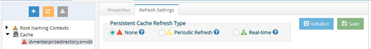
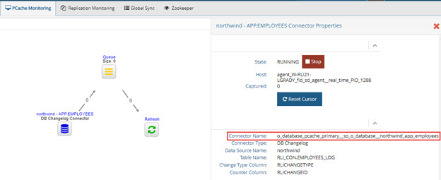

# Real-time Persistent Cache Refresh Commands

This chapter outlines commands used to configure Real-time Persistent Cache.

Real-time persistent cache refresh commands can be performed on the Directory Namespace tab and PCache Monitoring tab in the Main Control Panel.



Several commands in this chapter contain the argument connectorname. For persistent cache refreshes, the value for this argument can be found in the Main Control Panel > PCache Monitoring tab. Select the cache under the PCaches node on the left. Click the connector. Note the Connector Name value. An example is shown below.



## change-connector-state

This command starts or stops a specified connector in a real-time persistent cache refresh.

**Usage**
<br>`change-connector-state [-connectorname <connectorname>] [-state <state>]`

**Command Arguments:**

**`- connectorname <connectorname>`**
<br>The name of the real-time persistent cache connector.

**`- state <state>`**
<br>Indicates that the connector be started or stopped. Accepted values are “start” and “stop”.

**REST (ADAP) Example**

In the following example, a request is made to start a real-time persistent cache refresh connector.

```
https://<rli_server_name>:8090/adap/util?action=vdsconfig&commandname=change-connector-state&connectorname=o_derby_pcache_primary__so_o_derby__northwind_app_employees&state=start
```

## empty-queues

This command empties the queue of a specified real-time persistent cache refresh, identified by a pipeline ID.

**Usage**
<br>`empty-queues -pipelineid <pipelineid> [-mode <mode>]`

**Command Arguments:**

**`- pipelineid <pipelineID>`**
<br>[required] The identifier of the pipeline. Run the list-topologies command to locate the pipelines
identifiers for each topology.

**`- mode <mode>`**
<br>This property indicates which queue to empty. Accepted values are: QUEUE_ONLY, DEAD_LETTER_QUEUE, or ALL. If mode is not passed in the command, ALL is the default. For persistent cache refreshes, mode is typically left empty. For global synchronization queues, you may want to only empty the main queue or the dead letter queue.

**REST (ADAP) Example**

In the following example, a request is made to empty a cache’s queue.

```
https://fid:8090/adap/util?action=vdsconfig&commandname=empty-queues&pipelineid=o_db_pcache_primary__so_o_db__northwind_app_employees
```

## reset-cursor

This command resets the cursor for a specified persistent cache refresh.

**Usage(())
<br>`reset-cursor [-connectorname <connectorname>]`

**Command Arguments:**

**`- connectorname <connectorname>`**
<br>The name of the persistent cache connector.

**REST (ADAP) Example**

In the following example, a request is made to reset the cursor of a persistent cache.

```
https://<rli_server_name>:8090/adap/util?action=vdsconfig&commandname=reset-cursor&connectorname=o_derby_pcache_primary__so_o_derby__northwind_app_employees
```

## list-agents

Agents manage connectors used for real-time persistent cache refreshes. Persistent Cache Refresh Agents are started automatically once a persistent cache with real-time refresh is configured. Agents can run on any type of RadiantOne cluster node (follower or leaders) and there is only one agent running at any given time in a RadiantOne cluster.

Agents are also used for CPLDS sync processes. CPLDS Agents run on follower-only cluster nodes and multiple agents can be running at the same time. The more agents the better in order to distribute the load. For more details, see the [RadiantOne CPLDS Guide](/documentation/cplds-guide/introduction).

This command lists the currently running agents, both the ones used for persistent cache refresh and the ones used for CPLDS.

>[!note]
>This command lists both CPLDS agents and real-time persistent cache agents.

**Usage**
<br>list-agents

**Command Arguments**
<br>No command arguments are required.

**REST (ADAP) Example**

In the following example, a request is made to list the agents that are currently running.

```
https://<rli_server_name>:8090/adap/util?action=vdsconfig&commandname=list-agents
```

## stop-agent

Agents manage connectors used for real-time persistent cache refreshes. Persistent Cache Refresh Agents are started automatically once a persistent cache with real-time refresh is configured. Agents can run on any type of RadiantOne cluster node (follower or leaders) and there is only one agent running at any given time in a RadiantOne cluster.

Agents are also used for CPLDS sync processes. CPLDS Agents run on follower-only cluster nodes and multiple agents can be running at the same time. The more agents the better in order to distribute the load. For more details, see the [RadiantOne CPLDS Guide](/documentation/cplds-guide/introduction).

This command stops an agent specified by name.

>[!note]
>This command can be used to stop either Persistent Cache Refresh agents or CPLDS agents.

**Usage**
<br>`stop-agent [-agentname <agentname>]`

**Command Arguments:**

**`- agentname <agentname>`**
<br>The name of the agent to stop.

>[!note]
>This value can be found by running the command monitoring.bat -d orchestrator-agent-job. Monitoring.bat is located at <RLI_HOME>\bin.


**REST (ADAP) Example**

In the following example, a request is made to stop an agent.

```
https://<rli_server_name>:8090/adap/util?action=vdsconfig&commandname=stop-agent&agentname=agent_fid_sd_agent__event_driven_PID_3788
```

## stop-all-agents

Agents manage connectors used for real-time persistent cache refreshes. Persistent Cache Refresh Agents are started automatically once a persistent cache with real-time refresh is configured. Agents can run on any type of RadiantOne cluster node (follower or leaders) and there is only one agent running at any given time in a RadiantOne cluster.

Agents are also used for global synchronization and CPLDS sync processes. CPLDS Agents run on follower-only cluster nodes and multiple agents can be running at the same time. The more agents the better in order to distribute the load. For more details on CPLDS, see the [RadiantOne CPLDS Guide](/documentation/cplds-guide/introduction). For more details on [global synchronization](global-sync-commands.md), see the RadiantOne Global Sync Guide.

This command stops all agents.

>[!note]
>This command stops agents used in CPLDS, global synchronization and real-time persistent cache refresh.

**Usage**
<br>stop-all-agents

**Command Arguments**
<br>No command arguments are required.

**REST (ADAP) Example**

In the following example, a request is made to stop all agents.

```
https://<rli_server_name>:8090/adap/util?action=vdsconfig&commandname=stop-all-agents
```

## stop-all-local-agents

Agents manage connectors used for real-time persistent cache refreshes. Persistent Cache Refresh Agents are started automatically once a persistent cache with real-time refresh is configured. Agents can run on any type of RadiantOne cluster node (follower or leaders) and there is only one agent running at any given time in a RadiantOne cluster.

Agents are also used for [global synchronization](global-sync-commands.md) and CPLDS sync processes. CPLDS Agents run on follower-only cluster nodes and multiple agents can be running at the same time. The more agents the better in order to distribute the load. For more details on CPLDS, see the RadiantOne CPLDS Guide. For more details on global synchronization, see the [RadiantOne CPLDS Guide](/documentation/cplds-guide/introduction).

This command stops all local agents running on the machine from which the command was launched.

>[!note]
>This command stops agents used in CPLDS, global synchronization and real-time persistent cache refresh.

**Usage**
<br>stop-all-local-agents

**Command Arguments:**
<br>No command arguments are required.

**REST (ADAP) Example**

In the following example, a request is made to stop all local agents.

https://<rli_server_name>:8090/adap/util?action=vdsconfig&commandname=stop-all-local-agents

## configure-real-time-pcache-sync-topology

This command configures a persistent cache with a real-time refresh strategy.

**Usage**
<br>configure-real-time-pcache [-namingcontextdn <namingcontextdn>]

**Command Arguments:**

**`- namingcontextdn <namingcontextdn>`**
<br>The naming context DN of the persistent cache to configure as a real-time refresh.

**REST (ADAP) Example**

In the following example, a request is made to configure a persistent cache with real-time refresh for a naming context of o=derby.

```
https://<rli_server_name>:8090/adap/util?action=vdsconfig&commandname=configure-real-time-pcache&namingcontextdn=o=derby
```

## configure-connector-type

This command configures a connector’s type.

**Usage**
configure-connector-type [-connectorname <connectorname>]
[-connectortype <connectortype>] [-skipconfirmation]

**Command Arguments:**

**`- connectorname <connectorname>`**
<br>The name of the persistent cache connector.

**`- connectortype <connectortype>`**
<br>The connector type. Possible values are: CHANGELOG, AD_DIRSYNC, AD_USN, AD_HYBRID, DB_TIMESTAMP, DB_COUNTER, DB_TRIGGER, SCIM2, SCIM1, GRAPHAPI, MGRAPH, OKTA, KAFKA, KAFKA_GG, PERSISTENT_SEARCH, LDAP_APPLY, SCIM2_APPLY

**`- skipconfirmation`**
<br>Bypasses the confirmation when deconfiguring the connector. If this argument is omitted, the command requires confirmation before deconfiguring the connector.

**REST (ADAP) Example**

In the following example, a request is made to change a connector’s type.

```
https://<rli_server_name>:8090/adap/util?action=vdsconfig&commandname=configure-connector-type&connectorname=o_derby_pcache_primary__so_o_derby__northwind_app_employees&connectortype=db_timestamp
```

## list-connectors

This command lists the connector names for a specified real-time cache refresh.

**Usage:**
<br>list-connectors -namingcontextdn <namingcontextdn>

**Command Arguments:**

**`- namingcontextdn <namingcontextdn>`**
<br>[required] The DN of the naming context (must have a persistent cache).

**REST (ADAP) Example**

In the following example, a request is made to list connector names a persistent cache for cn=Accouting,ou=Virtual Groups,ou=AllProfiles.

```
https://<rli_server_name>:8090/adap/util?action=vdsconfig&commandname=list-connectors&namingcontextdn=cn=Accouting,ou=Virtual Groups,ou=AllProfiles
```

## list-connector-properties

This command lists properties and their values for a connector.

**Usage**
<br>`list-connector-properties [-connectorname <connectorname>]`

**Command Arguments:**

**`- connectorname <connectorname>`**
<br>The name of the persistent cache connector.

**REST (ADAP) Example**

In the following example, a request is made to list connector configuration properties.

```
https://<rli_server_name>:8090/adap/util?action=vdsconfig&commandname=list-connector-properties&connectorname=o_derby_pcache_primary__so_o_derby__northwind_app_employees
```

## get-connector-property

This command gets a property for a connector configuration.

**Usage**
<br>`get-connector-property [-connectorname <connectorname>] [propertyid <propertyid>]`

**Command Arguments:**

**`- connectorname <connectorname>`**
<br>The name of the persistent cache connector.

**`- propertyid <propertyid>`**
<br>The connector configuration property ID.

>[!note]
>you can use the list-connector-properties command to display available options for this argument.

**REST (ADAP) Example**

In the following example, a request is made to display the value for a connector’s Max Retries On Error property.

```
https://<rli_server_name>:8090/adap/util?action=vdsconfig&commandname=get-connector-property&connectorname=o_derby_pcache_primary__so_o_derby__northwind_app_employees&propertyid=maxRetriesOnError
```

## set-connector-property

This command sets a property for a connector configuration. Run the list-connector-properties command first to get the propertyid for the ones you want to update.

**Usage**
<br>`set-connector-property -connectorname <connectorname> -propertyid <propertyid>`

**`- propertyvalue <propertyvalue>`**

**Command Arguments:**

**`- connectorname <connectorname>`**
<br>[required] The name of the persistent cache connector.

**`- propertyid <propertyid>`**
<br>[required] The connector property ID.

>[!note]
>You can use list-connector-properties to display available options for this argument.

**`- propertyvalue <propertyvalue>`**
<br>[required] The connector property value.

>[!note]
>For Windows command line, some property values require double quotes surrounding them. In this case, you can use the \ to protect the “. E.g. C:\radiantone\vds\bin>vdsconfig.bat set-connector-property -connectorname o_sead_pcache_proxy__dc_seradiant_dc_dom__seradiantad -propertyid "excludedAttributes" -propertyvalue [\"member\",\"memberOf\",\"whenCreated\"]

>**If the property value contains a <space>, protect the entire value with double quotes. E.g. C:\radiantone\vds\bin>vdsconfig.bat set-connector-property -connectorname o_sead_pcache_proxy__dc_seradiant_dc_dom__seradiantad -propertyid includedBranches -propertyvalue “[ \"cn=users,dc=seradiant,dc=dom\",\"cn=domain groups,dc=seradiant,dc=dom\ "]”**

**REST (ADAP) Example**

In the following example, a request is made to set a property for a connector's configuration.

```
https://<rli_server_name>:8090/adap/util?action=vdsconfig&commandname=set-connector-property&connectorname=o_derby_pcache_primary__so_o_derby__northwind_app_employees&propertyid=maxRetriesOnError&propertyvalue=10
```

## file-set-connector-properties

This command sets multiple connector configuration properties with a text file.

**Usage**
<br>`file-set-connector-properties [-connectorname <connectorname>] [-propertyfilename <propertyfilename>]`

**Command Arguments:**

**`- connectorname <connectorname>`**
<br>The name of the persistent cache connector.

**`- propertyfilename <propertyfilename>`**
<br>The full path to a file containing the connector configuration properties.

>[!note]
>The contents of the file must be in JSON format. An example of the syntax used inside the properties file is shown below.

>**{ "pollingInterval" : 10001, "sizeLimit" : 1001, "retryIntervalOnError" : 10001,
"retryIntervalOnConnectionError" : 10001, "retryIntervalOnCommitError" :
10001, "retryIntervalOnPartialCommitError" : 10001, "queueCommitDelay" :
10001, "queueCommitSize" : 1001}**

**REST (ADAP) Example**

In the following example, a request is made to set connector configuration properties using a text file named ConnectorConfig.txt.

```
https://<rli_server_name>:8090/adap/util?action=vdsconfig&commandname=file-set-connector-properties&commandname=file-set-connector-properties&connectorname=o_derby_pcache_primary__so_o_derby__northwind_app_employees&propertyfilename=c:/radiantone/ConnectorConfig.txt
```

## execute-db-changelog-scripts

This command executes DB changelog configure or deconfigure scripts for a DB connector.

**Usage**
<br>`execute-db-changelog-scripts -connectorname <connectorname> - namingcontextdn <namingcontextdn> [-deconfigure]`

**Command Arguments:**

**`- connectorname <connectorname>`**
<br>[required] The name of the persistent cache connector.

**`- namingcontextdn <namingcontextdn>`**
<br>[required] The DN of the naming context (must have a persistent cache).

**`- deconfigure`**
<br>If this option is specified, deconfigure scripts are run instead of configure scripts.

**REST (ADAP) Example**

In the following example, a request is made to execute deconfigure logs for a DB connector.

```
https://<rli_server_name>:8090/adap/util?action=vdsconfig&commandname=execute-db-changelog-scripts&namingcontextdn=ou=hr,o=examples&connectorname=ou_hr_o_examples_pcache_primary__so_ou_hr_o_examples__examples_app_hr&deconfigure
```

## fix-cacherefresh

This command attempts to refresh the cache on entries where errors occurred during the cache refresh process. The command searches the cn=cacherefreshlog with a filter of (&(changenumber>=0)(status=2)). The changenumber and status can be defined in the command arguments. The command invokes an “action=synchronizecache” operation for each entry returned from the search, which attempts to update them in the persistent cache.

**Usage:**
<br>`fix-cacherefresh [-changenumber <changenumber>] [-instance <instance>] [-status <status>] [-verbose]`

**Command Arguments:**

**`- changenumber <changenumber>`**
<br>The changenumber used to search the 'cn=cachefreshlog'. Only entries equal or greater to the given changenumber will be processed. The default value is 0.

**`- instance <instance>`**
<br>The name of the RadiantOne instance. If not specified, the default instance named vds_server is used.

**`- status <status>`**
<br>The value of the 'status' attribute for the entries to be refreshed. By default, all entries with a
status value equal to 2 are refreshed.

**`- verbose`**
<br>Indicates if the command should log details of its progress.

**REST (ADAP) Example**

In the following example, a request is made to fix a cache refresh.

```
https://<rli_server_name>:8090/adap/util?action=vdsconfig&commandname=fix-cacherefresh&changenumber=1&status=2&verbose
```
