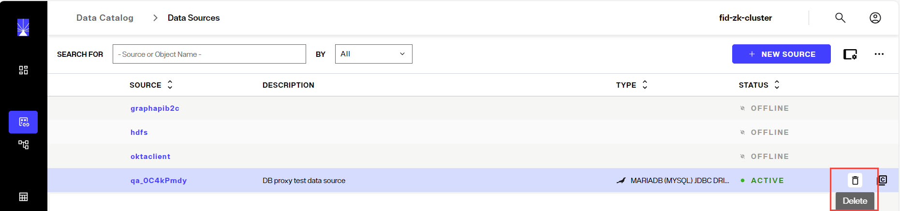
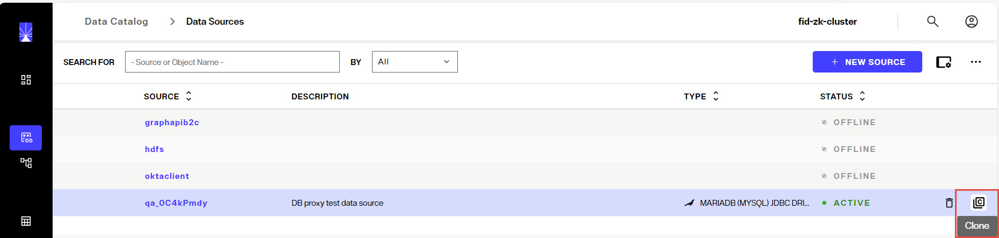
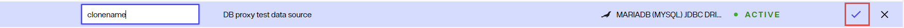
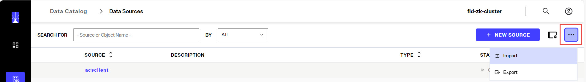
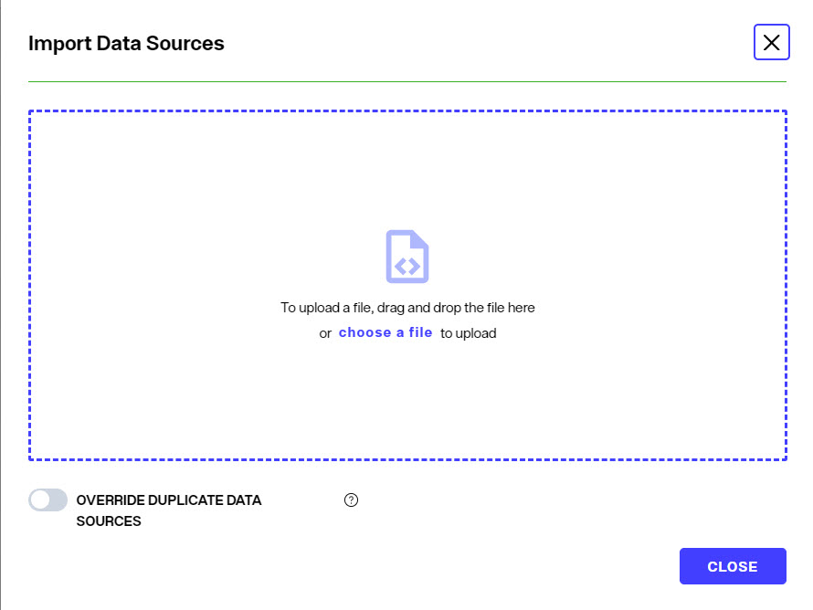
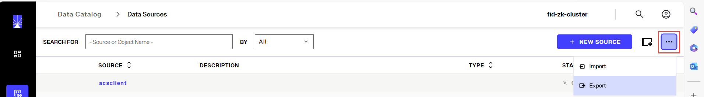
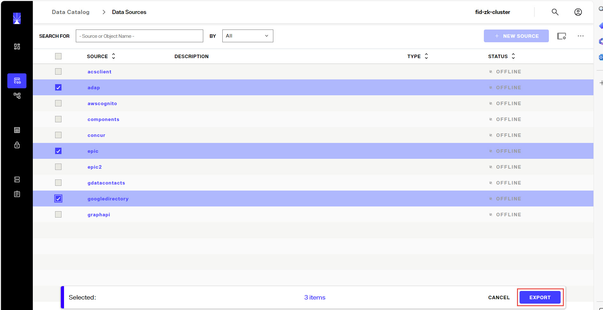

## Overview

The first step in configuring RadiantOne Identity Data Management is defining connections to all identity data sources. This can be done from Control Panel > SETUP > Data Catalog > Data Sources.

Each data source is associated with a template that defines how to connect and integrate the identity data source. Default templates are included for LDAP, Active Directory, Oracle, SQL Server, Maria DB, MySQL, Apache Derby and others.  Custom templates can be created for those that don't have a default template, as long as they offer a JDBC-driver and/or API that supports the needed operations (e.g authenticate, create, read, update, delete, and ideally a change detection mechanism).

After an identity data source is defined, a schema can be extracted. A schema represents the metadata for all identity objects contained in the data source. Schemas can be managed in the Data Catalog > Data Sources > Selected data source > SCHEMA section. This metadata is used to define identity views that are then accessed by clients that query the RadiantOne service. Identity views can be managed from Control Panel > SETUP > Directory Namespace > Namespace Design.

## Managing Data Sources
Data sources are managed from Control Panel > SETUP > Data Catalog > Data Sources.

### Creating Data Sources
To create a data source:
1.  Navigate to Control Panel > SETUP > Data Catalog > Data Sources.
1.  Click .
1.  Select a template associated with the identity data source type from the list. Use the Search field to quickly find a template name, or click on LDAP, DATABASE or OTHER tabs to narrow down the template choices by type. JDBC-accessible source templaes are located on the DATABASE tab. LDAP-accessible data source templates are located on the LDAP tab. Custom data source templates are located on the OTHER tab.
1.  Enter the basic details about the identity data source.

PROPERTY	| DESCRIPTION
-|-
Data Source Name	| Unique name representing the identity source backend. Do not use spaces, commas, brackets or parenthesis, colons, or the word “domain”.
Data Source Type	| Auto-populated, non-editable. Based on the template.
Secure Data Connector	|  The Secure Data Connector group used to establish a connection to an identity data source in a different network, like one running in an on-prem data center.
Description	| Details about the identity source backend.
Status	| Toggled to either OFFLINE (indicates the identity source is not available and should not be accessed by the RadiantOne service) or ACTIVE (indicates the identity source is available and can be accessed by the RadiantOne service).

1.  Enter the Connection details. These properties vary depending on the type of identity source.

For LDAP Data Sources:

PROPERTY	| DESCRIPTION
-|-
Host	| Fully-qualified server name or IP address for the identity source.
Port	| A numeric value indicating the port number the LDAP service is listening on.
SSL	|  Toggled ON if SSL/TLS should be used in the connection to the backend. Enter the SSL port in the Port property. Toggled OFF if SSL/TLS should not be used. Enter the non-SSL port in the Port property.
Bind DN	| Service account credentials that the RadiantOne service should use to connect to the backend. Enter a full user DN.
Bind Password	| Credentials associated with the account indicated in the Bind DN property.
Base DN	|  Enter the Remote Base DN or click the **folder** button, select a base DN and then click **OK**. Do not use special characters in the Base DN value.

For Database Data Sources:

PROPERTY	| DESCRIPTION
-|-
Driver Class Name	| Auto-populated, non-editable. Based on the template.
Driver URL	| Enter the URL to connect to the Database server.
User 	| Service account name that the RadiantOne service should use to connect to the backend.
Password	| Credentials associated with the account indicated in the User property.

For Custom Data Sources, the property names can vary and are dictated by the template.

1.  Configure applicable properties in the Advanced section (only applicable for LDAP data sources).

PROPERTY	| DESCRIPTION
-|-
Disable Referral Chasing	| By default, RadiantOne does not attempt to chase referrals that have been configured in the underlying LDAP server. If you want RadiantOne to chase referrals when searching the underlying LDAP server, then you should uncheck the Disable Referral Chasing option. Chasing referrals can affect the overall performance of the RadiantOne service because if the referral server is unresponsive, RadiantOne could take a long time to respond to the client. For example, in the case of querying an underlying Active Directory (with a base DN starting at the root of Active Directory) you may get entries like the following returned:  *ldaps://ForestDnsZones.na.radiantlogic.com:636*   *ldaps://DomainDnsZones.na.radiantlogic.com:636*  If RadiantOne attempts to “chase” these referrals, there can be extreme degradation in response times. Therefore, it is recommended that you disable referral chasing if you need to connect to Active Directory starting at the root of the Active Directory tree, or connect to any other directory where you don’t care about following referrals.
Paged Results Control	| If you enable the paged results option, and indicate a page size, RadiantOne (as a client to other LDAP servers) will request the result of a query in chunks (to control the rate at which search results are returned). This option can be useful when RadiantOne (as a client to other LDAP servers) has limited resources and may not be able to process the entire result set from a given LDAP query, or if it is connecting to the backend LDAP server over a low-bandwidth connection. The backend LDAP directory must support the Paged Results Control.
Verify SSL Certificate Hostname	| This setting is only applicable if SSL is used to connect to the backend. If enabled, RadiantOne validates the CN/SAN of the certificate and only establishes a connection to the backend if the hostname matches. This setting is not enabled by default meaning that RadiantOne doesn’t validate the hostname to the CN/SAN of the certificate for SSL connections. RadiantOne does not perform a reverse lookup when the Host Name for the backend is defined as an IP address instead of a fully qualified server name.

1.  Configure Failover servers. For database backends, select the configured database data source that contains the failover server connection details. For LDAP backends, click **NEW** and enter the host, port and SSL option to connect to the failover server. For LDAP backends, you can configure as many LDAP failover servers as needed.

For LDAP backends, RadiantOne attempts to connect to failover servers only if there is an error in connection to the primary server (it attempts to connect twice) or if the SSL certificate for the backend server is expired.

>[!note] 
>If your data source is Active Directory and you are using Host Discovery in your data source settings, there is no need to define failover server. RadiantOne automatically leverages the first five LDAP servers listed in the SRV record as primary/failover servers. 

1.  Click **TEST CONNECTION**.

>[!note] Not all custom data sources support test connection, meaning this may return a connection error even if all properties have been configured successfully.

1.  Click **CREATE**. The new data source appears in the list of configured sources and is briefly noted with a *new* tag next to it.
   
### Updating Data Sources
To update a data source, navigate to Control Panel > SETUP > Data Catalog > Data Sources. Click the data source name in the list of configured sources. The connection properties displays. Update the properties and click **SAVE**.

### Deleting Data Sources
To delete a data source, navigate to Control Panel > SETUP > Data Catalog > Data Sources. Select the configured data source in the list, click the inline trash can icon and click **DELETE** to confirm. Otherwise, click **KEEP DATA SOURCE** to not delete.

### Cloning Data Sources
Cloning a data source allows you to make a copy of the connection information and provide a new name for the data source. To clone a data source, navigate to Control Panel > SETUP > Data Catalog > Data Sources. Select the configured data source in the list and click the clone icon.

Enter a data source name and click the checkmark inline with the cloned data source.

### Importing Data Sources
If you have existing data sources defined (exported from another RadiantOne configuration) and you would like to import those, navigate to the Control Panel > SETUP > Data Catalog > Data Sources, click **...** and choose Import. 

Either browse to the file containing the data source definitions that you have exported from another RadiantOne server or drag-and-drop the file into the window and click **CLOSE** after the import.

>[!note] 
>To override existing data sources containing the same names as ones from the import file, toggle the **OVERRIDE DUPLICATE DATA SOURCES** option on. 

### Exporting Data Sources
To export data sources, navigate to the Control Panel > SETUP > Data Catalog > Data Sources, click **...** and choose Export.

Select the data sources to include in the export and click **EXPORT**

WHERE DO THE EXPORTED FILES GO???

## Managing Templates

### Creating Templates
### Updating Templates
### Deleting Templates

## Managing Schemas
### Extracting Schemas
### Comparing Schemas
### Modifying Schemas
