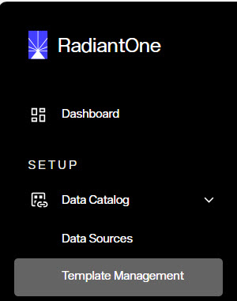
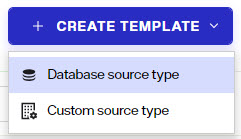
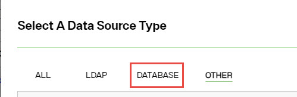
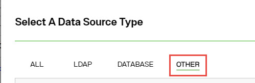
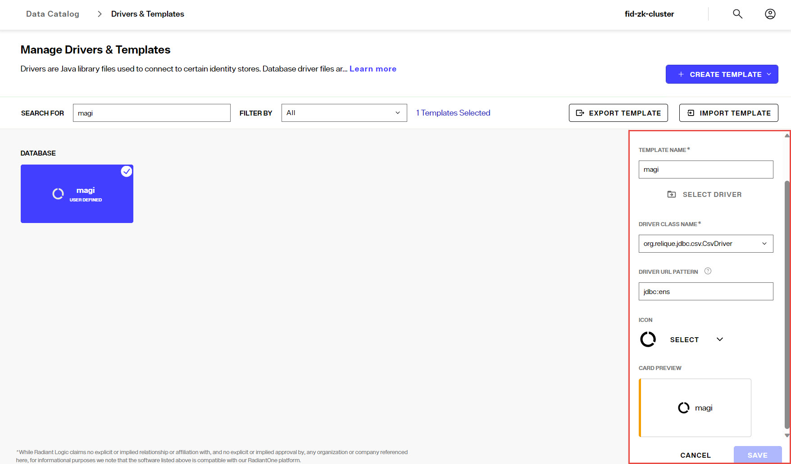
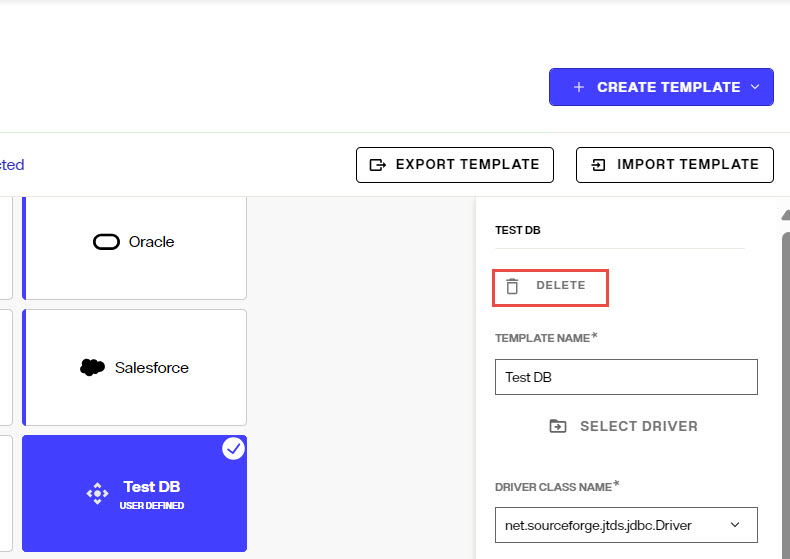
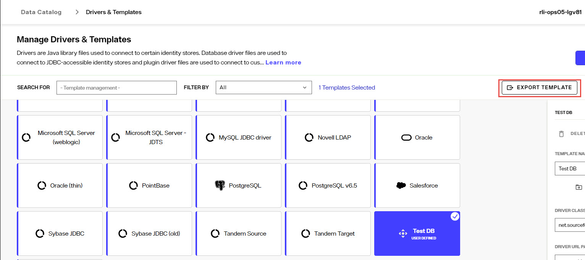
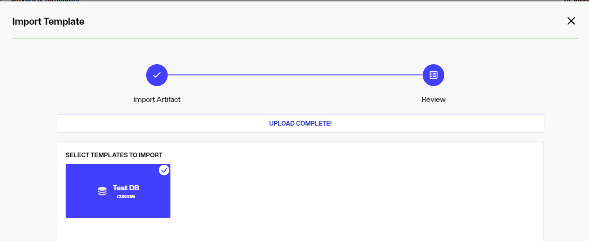

## Overview

The first step in configuring RadiantOne Identity Data Management is defining connections to all identity data sources. This can be done from Control Panel > Setup > Data Catalog > Data Sources.

Each data source is associated with a template that defines how to connect and integrate the identity data source. Default templates are included for LDAP, Active Directory, Oracle, SQL Server, Maria DB, MySQL, Apache Derby and others.  Custom templates can be created for those that don't have a default template, as long as they offer a JDBC-driver and/or API that supports the needed operations (e.g authenticate, create, read, update, delete, and ideally a change detection mechanism).

After an identity data source is defined, a schema can be extracted. A schema represents the metadata for all identity objects contained in the data source. Schemas can be managed in the Data Catalog > Data Sources > Selected data source > SCHEMA tab. This metadata is used to define identity views that are then accessed by clients that query the RadiantOne service. Identity views can be managed from Control Panel > Setup > Directory Namespace > Namespace Design.

## Managing Data Sources
Data sources are managed from Control Panel > Setup > Data Catalog > Data Sources.

### Creating Data Sources
To create a data source:
1.  Navigate to Control Panel > Setup > Data Catalog > Data Sources.
1.  Click .
1.  Select a template associated with the identity data source type from the list. Use the Search field to quickly find a template name, or click on LDAP, DATABASE or OTHER tabs to narrow down the template choices by type. JDBC-accessible source templaes are located on the DATABASE tab. LDAP-accessible data source templates are located on the LDAP tab. Custom data source templates are located on the OTHER tab.
1.  Enter the basic details about the identity data source.

   PROPERTY	| DESCRIPTION
   -|-
   Data Source Name	| Unique name representing the identity source backend. Do not use spaces, commas, brackets or parenthesis, colons, or the word “domain”.
   Data Source Type	| Auto-populated, non-editable. Based on the template.
   Secure Data Connector	|  The Secure Data Connector group used to establish a connection to an identity data source in a different network, like one running in an on-prem data center.
   Description	| Details about the identity source backend.
   Status | Toggled to either OFFLINE (indicates the identity source is not available and should not be accessed by the RadiantOne service) or ACTIVE (indicates the identity source is available and can be accessed by the RadiantOne service).

1.  Enter the Connection details. These properties vary depending on the type of identity source.

**For LDAP Data Sources:**

PROPERTY	| DESCRIPTION
-|-
Host	| Fully-qualified server name or IP address for the identity source. For Active Directory sources, if you want to use host discovery, you can enter the Active Directory domain here surrounded by [ ].
Port	| A numeric value indicating the port number the LDAP service is listening on.
SSL	|  Toggled ON if SSL/TLS should be used in the connection to the backend. Enter the SSL port in the Port property. Toggled OFF if SSL/TLS should not be used. Enter the non-SSL port in the Port property.
Bind DN	| Service account credentials that the RadiantOne service should use to connect to the backend. Enter a full user DN.
Bind Password	| Credentials associated with the account indicated in the Bind DN property.
Base DN	|  Enter the Remote Base DN or click the **folder** button, select a base DN and then click **OK**. Do not use special characters in the Base DN value.

**Host Discovery**
Automatic host discovery can be used when connecting to underlying Active Directory servers using DNS lookups.

>[!warning] if you plan to use persistent cache with real-time/connector-based refresh for your virtual view of Active Directory, do not use host discovery since the native Active Directory capture connector requires the FQDN of the primary and failover servers defined in the data source, in combination with the replication vector to perform failover. If you do not plan on caching your virtual view and/or you plan on using a periodic refresh strategy, then using host discovery is fine.

The LDAP services reached are the ones published in the DNS service record. If the LDAP service is not published, it cannot be reached (the service is defined by a host AND port in the SRV record). Some examples are shown below (0 means highest priority level)

_ldap._tcp.example.com. SRV 1 100 389 ldap.example.net
_ldap._tcp.example.com. SRV 0 100 636 ldap.example.net

DNS lookups leverage the domain specified in the host parameter. When the specific domain is set in the host parameter, the BaseDN value can be omitted. To use this functionality, the host option should specify the domain name you are interested in and optionally a port (if you are looking for a specific service on a specific port). If you do specify a port, then RadiantOne tries to get the first LDAP service it finds that is listening on that specific port (no matter what order of that particular service in the srv record). Additionally, if you enter a port and there is no LDAP service available on that port, RadiantOne uses the first LDAP service returned from the srv record.

>[!note] The number of LDAP services available in the SRV record that RadiantOne uses as the “main/primary” and “failover” servers is indicated by the Active Dir. SRV Record Limit properety that is configured in Classic Control Panel > Settings > Server Backend > Connection Pooling/Other section. RadiantOne uses these servers to automatically failover if the primary LDAP is down. Do not manually specify failover servers in the data source.

Below are some examples of the syntax.

Example 1 - Host specified with port set to 0 (a value of zero means no port is indicated). This uses the novato.radiantlogic.com domain and returns the first server found as there is no specific port mentioned.

`host:[domain:novato.radiantlogic.com] 
port:0`

Example 2 - This example tries to get the 'global catalog' ldap service (the one listening on port 3268).

`host:[domain:radiantlogic.com]
port: 3268`

Example 3 - This example tries to get an SSL connection to the LDAP server (on port 636).

`host: [domain:na.radiantlogic.com] port: 636`

**For Database Data Sources:**

PROPERTY	| DESCRIPTION
-|-
Driver Class Name	| Auto-populated, non-editable. Based on the template.
Driver URL	| Enter the URL to connect to the Database server.
User 	| Service account name that the RadiantOne service should use to connect to the backend.
Password	| Credentials associated with the account indicated in the User property.

**For Custom Data Sources:**
The property names can vary and are dictated by the template.

1.  Configure applicable properties in the Advanced section (only applicable for LDAP data sources).

PROPERTY	| DESCRIPTION
-|-
Disable Referral Chasing	| By default, RadiantOne does not attempt to chase referrals that have been configured in the underlying LDAP server. If you want RadiantOne to chase referrals when searching the underlying LDAP server, then you should uncheck the Disable Referral Chasing option. Chasing referrals can affect the overall performance of the RadiantOne service because if the referral server is unresponsive, RadiantOne could take a long time to respond to the client. For example, in the case of querying an underlying Active Directory (with a base DN starting at the root of Active Directory) you may get entries like the following returned:  *ldaps://ForestDnsZones.na.radiantlogic.com:636*   *ldaps://DomainDnsZones.na.radiantlogic.com:636*  If RadiantOne attempts to “chase” these referrals, there can be extreme degradation in response times. Therefore, it is recommended that you disable referral chasing if you need to connect to Active Directory starting at the root of the Active Directory tree, or connect to any other directory where you don’t care about following referrals.
Paged Results Control	| If you enable the paged results option, and indicate a page size, RadiantOne (as a client to other LDAP servers) will request the result of a query in chunks (to control the rate at which search results are returned). This option can be useful when RadiantOne (as a client to other LDAP servers) has limited resources and may not be able to process the entire result set from a given LDAP query, or if it is connecting to the backend LDAP server over a low-bandwidth connection. The backend LDAP directory must support the Paged Results Control.
Verify SSL Certificate Hostname	| This setting is only applicable if SSL is used to connect to the backend. If enabled, RadiantOne validates the CN/SAN of the certificate and only establishes a connection to the backend if the hostname matches. This setting is not enabled by default meaning that RadiantOne doesn’t validate the hostname to the CN/SAN of the certificate for SSL connections. RadiantOne does not perform a reverse lookup when the Host Name for the backend is defined as an IP address instead of a fully qualified server name.

1.  Configure Failover servers. For database backends, select the configured database data source that contains the failover server connection details. For LDAP backends, click **NEW** and enter the host, port and SSL option to connect to the failover server. For LDAP backends, you can configure as many LDAP failover servers as needed.

   For LDAP backends, RadiantOne attempts to connect to failover servers only if there is an error in connection to the primary server (it attempts to connect twice) or if the SSL certificate for the backend server is expired.

   >[!note] If your data source is Active Directory and you are using Host Discovery in your data source settings, there is no need to define failover server. RadiantOne automatically leverages the first five LDAP servers listed in the SRV record as primary/failover servers. 

1.  Click **TEST CONNECTION**.

   >[!note] Not all custom data sources support test connection, meaning this may return a connection error even if all   properties have been configured successfully.

1.  Click **CREATE**. The new data source appears in the list of configured sources and is briefly noted with a *new* tag next to it.
   
### Updating Data Sources
To update a data source, navigate to Control Panel > Setup > Data Catalog > Data Sources. Click the data source name in the list of configured sources. The connection properties displays. Update the properties and click **SAVE**.

### Deleting Data Sources
To delete a data source, navigate to Control Panel > Setup > Data Catalog > Data Sources. Select the configured data source in the list, click the inline trash can icon and click **DELETE** to confirm. Otherwise, click **KEEP DATA SOURCE** to not delete.

### Cloning Data Sources
Cloning a data source allows you to make a copy of the connection information and provide a new name for the data source. To clone a data source, navigate to Control Panel > Setup > Data Catalog > Data Sources. Select the configured data source in the list and click the clone icon.

Enter a data source name and click the checkmark inline with the cloned data source to save it. Click **X* to delete the clone instead of saving it.

### Importing Data Sources
If you have existing data sources defined (exported from another RadiantOne configuration) and you would like to import those, navigate to the Control Panel > Setup > Data Catalog > Data Sources, click **...** and choose Import. 

Either browse to the file containing the data source definitions that you have exported from another RadiantOne server or drag-and-drop the file into the window and click **CLOSE** after the import.

>[!note] 
>To override existing data sources containing the same names as ones from the import file, toggle the **OVERRIDE DUPLICATE DATA SOURCES** option on. 

### Exporting Data Sources
To export data sources, navigate to the Control Panel > Setup > Data Catalog > Data Sources, click **...** and choose Export.

Select the data sources to include in the export and click **EXPORT**

Your internet browser settings determine the download location. The download file is named fid-datasources-export.json.

## Managing Templates
Each identity data source is associated with a template. The template indicates all properties required to connect to the data source. RadiantOne includes some default templates and new templates can be created for JDBC-accessible databases and other data sources than can be queried through a web services API.

Only database templates that are associated with JDBC drivers installed with RadiantOne are shown by default. These drivers are included to help save configuration time, but are not owned, licensed or managed by Radiant Logic. If newer versions of the drivers are available from the database vendors, customers must update and replace the drivers used in RadiantOne. Some JDBC drivers, like IBM DB2 (UDB) require additional license files (e.g. db2jcc_license_cisuz.jar) to be included as well. Downloading and associating any updated drivers or additional license files with RadiantOne templates is the responsibility of the customer. 

Templates can be managed from Control Panel > Setup > Data Catalog > Template Management.

### Creating Templates

Templates for JDBC-accessible databases and other data sources that can be queried through a web services API are managed from Control Panel > Setup > Data Catalog > Template Management.

Click the **+CREATE TEMPLATE** drop-down and select either *Database Source Type* (for JDBC-accessible data sources), or *Custom Source Type* (for web service API-accessible services).

**Database Source Types**

1. Choose the option to either *Upload New* or *Select Existing* driver file. Use the *Select Existing* option only if the driver library already exists on the RadiantOne node. For *Upload New*, either drag-and-drop the library into the window or click the link to choose a file.
2. Enter a unique template name. This name is displayed on the card that can be selecting during data source creation.
3. Enter or select the driver class name associated with the library. This is typically auto-populated from the driver file that was selected in step 1.
4. Enter the driver URL pattern indicating the values required by the driver to establish a connection to the database. This is helpful for the administrator that is using the template to create the data source.
5. Select a unique icon to display on the card associated with the template.
6. Click **ADD**. A new card is available for defining "Database" type of data sources.

**Custom Source Types**

1. Choose the option to either *Upload New* or *Select Existing* plugin file. Use the *Select Existing* option only if the plugin file already exists on the RadiantOne node. For *Upload New*, either drag-and-drop the plugin fie into the window or click the link to choose a file.
2. Enter a unique template name. This name is displayed on the card that can be selecting during data source creation.
3. Enter a plugin name associated with the file that was selected in step 1.
4. Select or enter the class name associated with the plugin file.
5. Select a unique icon to display on the card associated with the template.
6. Click **NEXT**.
7. Use **+SECTION** to create categories for properties required to be passed when establishing connections to the custom API. Create as many sections as needed.
8. In each section created in the previous step, click *+* to add properties. Create as many properties as needed.
9. Click **ADD**. A new card is available for defining "Other" (type) of data sources.

### Updating Templates
All user-defined templates can be updated from Control Panel > Setup > Data Catalog > Template Management. Default templates associated with JDBC-accessible types of data sources can also be updated from here to update jdbc drivers. 

Select the template and use the drawer that appears on the right to update properties. Click **SAVE**.

### Deleting Templates

Only user-defined templates can be deleted.

Templates can be deleted from Control Panel > Setup > Data Catalog > Template Management. Select the user-defined template and click **Delete**. Click **DELETE** to confirm.

### Exporting Templates

Only user-defined templates can be exported.

Templates can be exported from Control Panel > Setup > Data Catalog > Template Management. Select the user-defined template and click **EXPORT TEMPLATE**. The template is exported and automatically downloaded based on your web browser settings.

### Importing Templates

Templates that have been exported from a RadiantOne v8.1.X deployment can be imported into other RadiantOne v8.1.X deployments. Templates can be imported from Control Panel > Setup > Data Catalog > Template Management. Click **IMPORT TEMPLATE**. Either drag-and-drop the template file into the window or click *Choose a File* to upload. The templates included in the file are shown. Select which templates to import and click **IMPORT**. Imported templates can be used to create data sources from Control Panel > Setup > Data Catalog > Data Sources.

## Managing Schemas
Each data source can be associated with one or more schema files. The first schema file extracted for a data source is considered the default one. For LDAP data sources, the default schema is automatically extracted when the data source is defined. For JDBC-accessible and SCIMv2 accessible data sources, you must manually extract the schema so you can selectively choose the objects that are required for creating identity views. For custom data sources, you must manually create the schema in RadiantOne.

For details, see [Managing Schemas](/schemas.md).
