## Overview

A schema file in RadiantOne Identity Data Management contains the metadata pertaining to objects in identity data sources. This metadata is the basis for configuring identity views. Each identity data source must have at least one schema file.

Schemas are managed from Control Panel > Setup > Data Catalog > Data Sources > [Selected data source] > SCHEMA tab.

It is important to understand that RadiantOne publishes an LDAP schema for clients to query using a base DN of cn=schema. Some clients leverage this information to integrate with the service, while others do not. This schema likely differs from the schemas of the identity data sources (backends). Therefore, if you have client applications that rely on metadata published in the RadiantOne LDAP schema, ensure that you either [Map the Backend Metadata](#mapping-metadata) to objects and attributes in the RadiantOne LDAP schema, or [Extend the RadiantOne LDAP Schema](#Include-in-RadiantOne-LDAP-Schema) with the metadata from the schema files associated with the backends.

## Concepts

The following concepts are important to understand for managing schemas in RadiantOne Identity Data Management.

### Primary Key

In a well-designed relational database, every table has a column, or combination of columns, known as the primary key of the table. These values uniquely identify each row in the table. Occasionally you will find tables that were created in the database, but the uniquely identifying column(s) were not documented in the system catalog as the primary key. Declaring implicit primary keys is one of the schema refining processes you perform in the Data Catalog. 

>[!warning] All objects you want to virtualize in an identity view must have a primary key defined, and any attribute that you declare as the primary key in the schema file must be unique for all entries in your database source table.

In a directory, there is a notion of a “unique identifier” which is an attribute in each entry that uniquely identifies it from the sibling entries. This is not something that is explicitly documented in the directory schema; therefore, you must declare the primary key for the object class in the schema file. Typically, the unique identifier in the directory comprises the RDN. For example, if a user DN associated with the *person* object class were: uid=lcallahan,dc=ldap,dc=com, the unique identifier for the person object class would be the uid attribute.

The yellow key next to the name in the attributes list denotes it as the primary key for the object (see screen shot below). If no primary key is defined, you can use the right-click menu to edit/define one. For more information see [Declaring Primary Keys](#declaring-primary-keys). 
 

### Display Name 

You can create a RDN Attribute and Value Name, or alias/display name, for a Primary Key. This allows the consumer browsing the directory to be shown more useful information. For example, if the Primary Key of a Customer table is CustID with an integer attribute type, then a list of numbers is displayed in the identity view at run time. Chances are, the person who created the database is the only one for whom those numbers mean anything. Therefore, a display name could be created using the customer’s first name and last name. Instead of the consumer of the identity view seeing a number, they now see a more meaningful customer name. The display name is a combination of the primary key and one or more attributes. Because it is comprised of the Primary Key, an RDN Attribute and Value Name is always unique and can qualify as a candidate key. For more information, see [Declaring RDN Attribute Name and Value](#declaring-rdn-attribute-name-and-value). 

### Derived View 

Derived views result from queries to a base object. These views are built by promoting one of the attributes of the base object to the entity level. Once the view is created, it is added into the schema file and this new relationship can be used to create more detailed, flexible views of information. 

For example, let’s say your database includes a table that lists Customers and related attributes, including Country. You can create a list of all countries in which you have customers. Derived views allow you to create a view that lists all applicable countries. Derived views contain summary data. For example, in the Customers.Countries derived view shown below all occurrences of one country are combined into one record. 

You can create derived views by using the right-click menu on the object that contains the attribute you want to create a derived view from. 

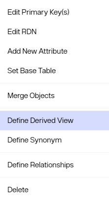

For more information on derived views, see [Creating Derived Views](#creating-derived-views). 

### Relationships 

If relationships exist in a database and are not explicitly declared in the system catalog, then the schema extraction process does not capture them. Some relationships are created implicitly (exist in the application, but are not recorded within the database dictionary). This is fine if you do not need to build an identity view based on the relationships. On the other hand, if you want to use the existing relationships to build identity views, then you must define the relationships in the schema file. 

To evaluate missing relationships in the schema file, you need a working knowledge of the underlying database application on which the schema is based. Once you have determined which relationships are missing, you can declare them by using the Define Relationships option from the right-click menu available when an object is selected. For more information, see [Declaring Implicit Relationships](#declaring-implicit-relationships). 

### Recursive Relationships 

A recursive relationship is an object related to itself. For example, an employee may be managed by another employee. Therefore, an Employee table would have a recursive relationship with itself. Please see [Declaring Recursive Relationships](#declaring-recursive-relationships) to see how this can be accomplished. 

## Extracting Schemas
Each identity data source must have at least one schema file associated with it. For LDAP data sources, a schema is extracted when the data source is defined. For all other data sources, the schema must be extracted. If you select a data source that does not have any schemas, a notice appears and prompts the user to extract the schema.

Schemas can also be extracted using the **...** > Extract New Schema option.

### LDAP-Accessible Backend 

Examples of LDAP-accessible backends are Sun Java Directory, Microsoft Active Directory, IBM Tivoli Directory, eDirectory, Red Hat Directory, and OpenLDAP. The LDAP data source must be created before completing the schema extraction steps below. See [Data Sources](/data-sources.md) for details about creating data sources.

1. In the Control Panel > Setup > Data Catalog > Data Sources > Selected Data Source > SCHEMA Tab, click **...** > Extract New Schema.

1.	Enter a schema file name (do not use hyphens) and click **OK**.
	 

1. You can view/modify this schema by selecting it from the drop-down list. Any changes made (such as attribute name remapping), do not affect the underlying schema. 

**Handling Auxiliary Object Classes from LDAP Backends** 

Sometimes, an LDAP entry in a directory is comprised of more than one object class where the object classes do not necessarily inherit from each other. This is referred to as an auxiliary class. For example, a person entry in the directory can be a part of an object class such as inetOrgPerson and also contain attributes from a custom object class like rliuser (this is the auxiliary class). During the schema extraction, since the object classes do not inherit from each other, they are displayed as two separate objects each having their own list of attributes. To retrieve the proper information from the directory in the identity view, you must merge the objects together in the schema file. 

To merge object classes together: 

1.	 Right-click on the structured object class in the list and select Merge Objects. 

2.  Enter an object name for the merged object to be created.
  
3.	 Select the auxiliary object class from the list that you would like to merge with (RLIUser for example).

4.	Click **OK**. 

A new object is created below the Views branch and contains all attributes from both object classes. An identity view can be created from this merged object and the entries can contain attributes from either of the object classes. 

>[!warning] The direction in which you merge the objects is significant because the ‘base’ object (the structured object class) is used in the filter for the query that is sent to the backend directory. Note that the attributes defined for this merged object come from both the structured objectclass inetorgperson (uid, cn, displayName) and the auxiliary objectclass, RLIUser (rliuserattribute2, rliuserattribute3).

### JDBC-Accessible Database Backend 

Examples of JDBC-accessible backends are Microsoft SQL Server, Oracle, DB2, and Sybase. 

The database data source must be created before completing the schema extraction steps below. See [Data Sources](../configuration/data-sources/data-sources) for details about creating data sources.

1.	In the Control Panel > Setup > Data Catalog > Data Sources > Selected Data Source > SCHEMA Tab, click **...** > Extract New Schema.

1.	Enter a schema file name and click **OK**.
    >[!note] DO NOT USE HYPHENS (-) IN FILE NAMES.
 
1. The ANSI standard syntax for naming relational database tables is catalog.schema.table. Therefore, if you are authenticating as a user who has access to multiple different schemas, and want to narrow the search, you can enter in the specific schema name in the Database Schema property.

1.	Limit the types of objects to be returned by selecting tables, views, system tables, or synonyms. If you would like all types of objects returned, then select all options. If you only want a subset of the selected objects returned, then you can enter a pattern for the Table Pattern parameter using the “%” for a wildcard character. For example, if you want to return only tables that start with “N”, then for the Table Pattern you can enter N%.

1.	Click **NEXT** to proceed and select the desired Tables and Views from the list.
	

1.	Click **EXTRACT**. This creates the schema file and adds it into the drop-down list next to *Schema Name*.

You can view/modify this schema by selecting it from the drop-down list. Any changes made (such as declaring primary keys or creating relationships), do not affect the underlying schema. 

### SCIMv2 Backends

The SCIMv2 data source must be created before completing the schema extraction steps below. See [Data Sources](../configuration/data-sources/data-sources) for details about creating data sources.

1.	 In the Control Panel > Setup > Data Catalog > Data Sources > Selected Data Source > SCHEMA Tab.

1.	 In the upper-right corner, click **...** > Extract New Schema.

1.	 Enter a schema file name and click OK. This creates the schema file and adds it into the drop-down list next to *Schema Name*.

      >[!note] DO NOT USE HYPHENS (-) IN FILE NAMES.
      
You can view/modify this schema by selecting it from the drop-down list. Any changes made do not affect the underlying schema.

### Custom Backends

The custom data source must be created before completing the steps below. See [Data Sources](../configuration/data-sources/data-sources) for details about creating data sources. The schemas associated with custom sources cannot be extracted. You must manually define the objects and attributes matching the custom data source API after providing a schema name. Every object (e.g. user) that stores identity data must be defined.

1.	 In the Control Panel > Setup > Data Catalog > Data Sources > Selected Data Source > SCHEMA Tab, click **...** > Extract New Schema.
1.	 Enter a schema file name. Click OK.

      >[!note] DO NOT USE HYPHENS (-) IN FILE NAMES.

1.  Expand Objects.
1.  Right-click on *Tables* and choose **Add New Object**.

1.  Enter an object name and an (optional) LDAP object class to associate with it.
1.  Click OK.
1.  Repeat steps 3-6 to add all objects. 
1.  Expand below *Tables* to see the new object. Right-click on the object and choose **Add New Attribute**.
1.  Repeat step 8 to add all attributes.
1.  Repeat steps 8 & 9 for all objects. 
   
## Managing Schemas

This section describes displaying objects and relationships as well as declaring primary keys. 

### Displaying Objects and Relationships 

When you select a schema file next to the *Schema Name* drop-down list, the objects are displayed in alphabetical order. Objects are tables and views (for databases), or object classes (for LDAP directories). As you select an object, information about that object appears on the right side.

>[!note] 
>If you select the Fields (for database objects) or Attributes (for LDAP objects) node (below a specific object) the Nullable column on the right side indicates which attributes are required. Attributes that have a ‘false’ value in the Nullable column are required. Attributes that have a ‘true’ value are optional. This is important to know if you want to insert users into the backend. Make sure that all required attributes are populated for the new entry or else the insert operation will fail in the underlying source.

Relationships between database objects are displayed below the relationships node. 

The figure shown below displays all tables, views and relationships from an example schema. Notice that the top level is the name of the file followed by a section named Objects. When the objects node is selected, the Properties tab on the right side displays important summary information. A blue icon designates Tables. A green icon designates Views, and Relationships are designated by the relationship icon (a set of connected tables). 
 
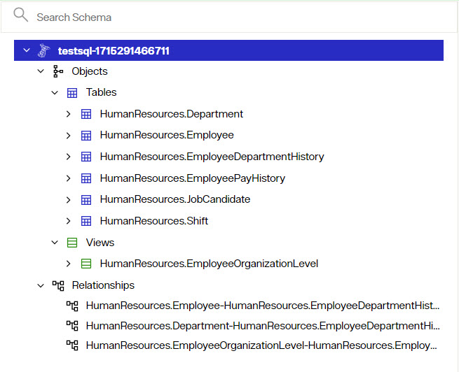

### Declaring Primary Keys

Once the metadata has been captured, the next step is to improve it in a way that best serves your needs. This may involve declaring primary keys.

>[!note] Changes made in the schema settings do not affect the underlying schema.

Primary keys that are implicit, but not declared in the data dictionary, are not included in schema files unless you declare them. 

>[!warning] All objects you want to create identity views from must have a primary key defined, and any attribute that you declare as the primary key in the schema file must be unique for all entries in your table.

For directory schemas, declare the attribute that uniquely identifies each entry as the primary key. 

To declare and modify the primary keys: 

1.	 Right-click on the desired object and choose **Edit Primary Key(s)**.
   
	 

1.	 Choose the column(s) from the Attributes List that you want to use as the primary key and click the right arrow button. 

1. 	To remove the column(s) from the key(s) list, choose the column(s) and click the left arrow button.
   
 
1. 	Click **OK** when finished. The key(s) you selected are now declared as the primary key. 

### Declaring Implicit Relationships

Once the metadata has been captured, the next step is to improve it in a way that best serves your needs. This may involve declaring implicit relationships.

>[!note] Changes made in the schema file do not affect the underlying schema.

Sometimes a database schema does not contain all relationships that can exist between objects. The schema extraction process cannot capture these implicit relationships that are known by the programmers but not declared in the database data dictionary. You should declare any relationships you will need for your identity views. 

The declaration process is a critical step as it affects the quality of the identity views that are created. Any undeclared relationships or primary keys result in a meaningless path, directly affecting the quality or availability of information displayed in the identity views.

The Relationships dialog box requires source and destination tables (or views). When setting relationships, it does not matter which entity is the source and which is the destination. 

>[!note] Declaring implicit relationships relates to database schemas only.

To set a relationship between two objects:

1.	Right-click on the desired object and choose the Define Relationships option. The Relationships dialog box appears.
	

1.	Select the *Regular* relationship type.
1. 	Select an object from the Source Object drop-down list.
1. 	Select the attribute from the Source Attribute drop-down list that contains the value to be used to relate to the secondary object.
1.	Select the destination object that has a relationship with the source object from the Related Object drop-down list. 
1.	Choose the attribute from the Related Attribute drop-down list that contains the value to be used to relate to the source object.
	

1.	Click **OK**. The relationships are created and appear at the bottom of the list of relationships in the schema file.

### Declaring Recursive Relationships

Once the metadata has been captured, the next step is to improve it in a way that best serves your needs. This may involve declaring recursive relationships.

>[!note] Changes made in the schema settings do not affect the underlying schema.

If a table has a relationship to itself, you can create this recursive relationship in the schema file.

To create a recursive relationship: 

1.	Right-click on the object that has a recursive relationship and select Define Relationships.
1.	Select the *Recursive* relationship type.

2.	Select the foreign key and enter the number of recursions possible (the depth level).

3.	Click **OK**.

You should now see new views created corresponding to the depth level entered, and new relationships between these objects.

Once the recursive relationship is described in the schema file, a hierarchical [Identity View](../identity-views/intro-view-design) can be created. 

### Creating Synonyms

Once the metadata has been captured, the next step is to improve it in a way that best serves your needs. This may involve declaring synonyms. 

>[!note] Changes made in the schema settings do not affect the underlying schema.

For flexibility in modeling identity views, you can create a synonym from any object in the schema. A synonym is a complete replica of the object with a new name. 

To create a synonym for an object: 

1.	Right-click on the object and select *Define Synonym*.

	

1.	Enter a name for the Synonym when prompted and click **OK**.

>[!note] Synonyms may NOT have the same name as an existing object in the schema.

The new object appears under the list of Views. This new object does not change the underlying schema but can be used when building identity views. For details on building identity views, please see: [Identity Views](../identity-views/intro-view-design)

### Declaring RDN Attribute Name and Value

Once the metadata has been captured, the next step is to improve it in a way that best serves your needs. This may involve defining RDN attribute name and values. 

>[!note] Changes made in the schema settings do not affect the underlying schema.

RDN Attribute Name and Display Columns are a combination of the primary key and at least one other attribute. You can also declare RDN Attribute Name and Display Columns in the [Identity Views](../identity-views/intro-view-design).

To declare or Modify RDN Attribute Name and/or Value in the schema file: 

1.	Right-click on the desired table or view and choose the Edit RDN option. 

2.	Enter an RDN Attribute Name (the value that comprises the DN) and use the right arrow button to move the attribute(s) that you want to comprise the RDN value into the list on the right (remember that these attributes are used in addition to the primary key). 

3.	Use the  icon to reorder the attributes they way you want them to appear at runtime.
4.	Click **OK** when finished.
5.	Click **SAVE** to save the schema file. 

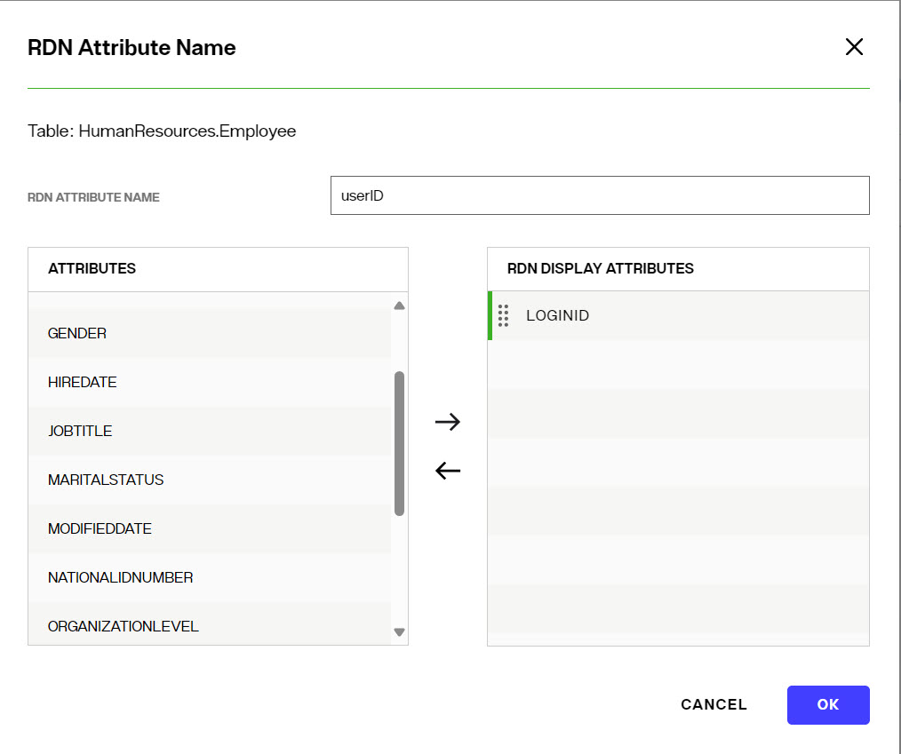

>[!warning] The attributes that you select as the display attribute(s) should not allow NULL values.

To remove attribute(s) from the RDN Display Attribute(s) list, choose the attribute(s) from the list on the right and click the left arrow button. 

This RDN attribute name becomes the default name (for a container or content object) when the corresponding object is used to build an [Identity Views](../identity-views/intro-view-design).

For example, if you set the RDN attribute name for the Employee table to equal Name, then when you access the Employee table to create a container or content level in the [Identity Views](../identity-views/intro-view-design), the default RDN attribute name for that specific level will be Name. The RDN will be Name = First Name Last Name {Employee Primary Key value}. An example of this is shown in the screen shot below. 

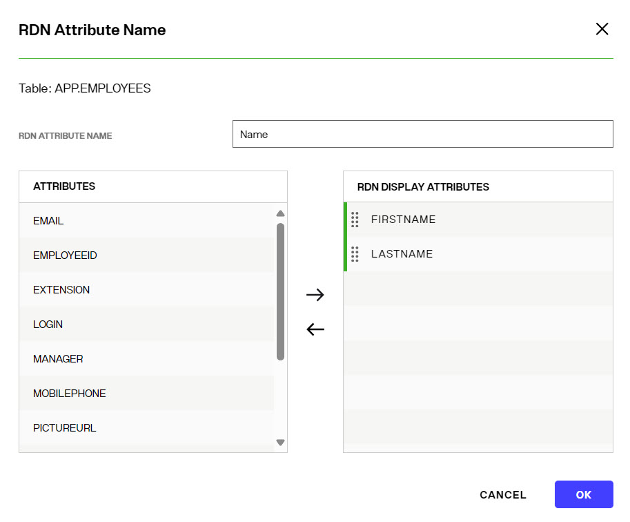
 
### Removing Objects, Attributes or Relationships from the Schema 

Unwanted tables, views, attributes, or relationships can be removed from the schema. Remember to save the schema after making any changes. 
You can use the tables/attributes list shown on the left to remove items. Attributes can also be removed by selecting the parent/container named "Attrbutes" in the list on the left and using the inline trashcan icon from the summary table of all attributes shown on the right.

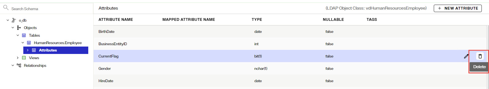

**Removing Objects**

Objects in a database schema are tables or views. Objects in an LDAP schema are object classes. Right-click on the desired object from the list on the left and choose *Delete*. Click **DELETE** to confirm. Click **SAVE** to save the schema file.

>[!note] If any of the objects are involved in a relationship, the corresponding relationship must be removed first.

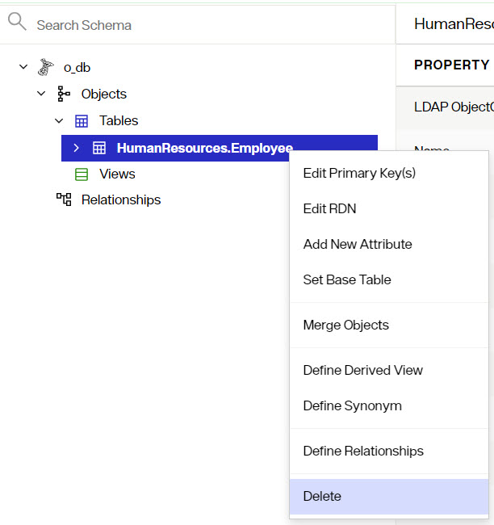

**Removing Attributes**

Some attributes can be removed from objects. Primary keys and attributes involved in relationships cannot be removed. Right-click on the attribute you want to remove and choose *Delete*. Click **DELETE** to confirm. Click **SAVE** to save the schema file.

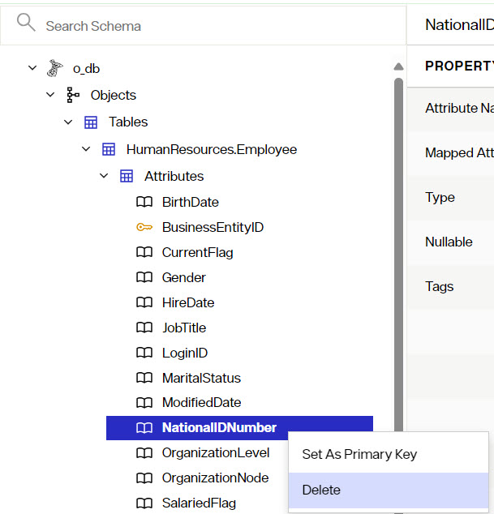
 
**Removing Relationships**

To remove a relationship, right-click on the desired relationship and choose *Delete*. Click **DELETE** to confirm. Click **SAVE** to save the schema file.
 
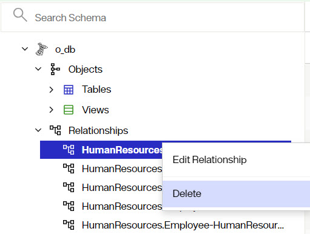
 
### Creating Derived Views

Derived views are created from a base table and consist of one attribute that contains normalized data, such as a single column table for countries, postal codes, city names, etc. Derived views are objects that are added to the schema file to allow for more flexibility when creating identity views. 

See [Derived View](#derived-view) for more information. 

To create a derived view, follow the steps below. 
1.	Right-click on a table or view and select **Define Derived View**. 
2.	Select the appropriate object from the drop-down list. 
3.	Select the column you want to use and click **OK**.
4.	Click **SAVE** to save the schem file.

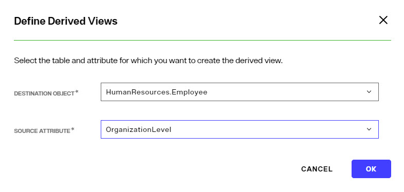

The new derived view object appears in the list of views in the schema. This new object can be used when building [Identity Views](../identity-views/intro-view-design).

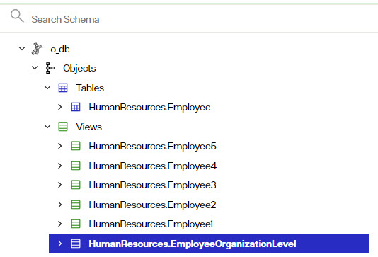

>[!note] A derived view cannot be created from the same attribute twice.

### Mapping Metadata 

Mapping metadata into a common vocabulary is essential for facilitating a global search. Clients searching the RadiantOne service should be able to use one common naming structure to locate information no matter which backend source the data resides. This can only be achieved by properly mapping the metadata. 

Default LDAP object classes and attributes are generated for all database objects. This default object class is comprised of a “vd” prefix, followed by the name of the database (and/or schema/owner), and the name of the database object. The object class assigned to the database object is stored as an LDAP Object Class property in the schema file. The default attributes are based on the attribute names as they exist in the database. 

In the example shown below, the LDAP object class generated by default is vdAPPCUSTOMERS. The attribute names in the entries built from the database schema matches the names as they exist in the database. 

For LDAP backends, the object class(es) from the backend schema definition is the default value shown in the schema file. The # sign is used to separate the class hierarchy. The default attribute names also match the backend schema definition. 

The default object class can be changed if needed. Database and LDAP objects can be mapped to an existing object class definition or you can manually enter your own custom one.

### Mapping Database Objects to LDAP Object Classes and Attributes

To map to LDAP object classes and/or attributes, open the database schema containing the objects you want to map in the Control Panel > Setup > Data Catalog > Data Sources > [Selected Data Source] > Schema tab. 

**Mapping to LDAP Object Classes**

1.	Select the database object you want to map and locate the LDAP ObjectClass property on the right.
1.	Click the 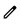 icon inline with the LDAP ObjectClass property.
   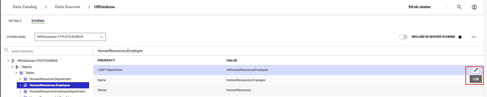

1.	Select the object class from the drop-down list that you want mapped to the database object. If you prefer to enter your own custom object class name, you can type it in the LDAP ObjectClass property. 

1.	Click the  inline with the LDAP ObjectClass property.
1. Click **SAVE**.	

**Mapping to LDAP Attributes**

1. Expand the database object you want to map the attributes for and select the *Attributes* node.
1. Click the  inline with the attribute you want to map.
1. Use the Mapped Attribute Name column to define attribute mappings. If you have mapped the object to a (known) LDAP object class, the list of attributes shown in the drop-down list are populated from the schema definition. If you prefer to enter your own custom attribute names, type them in the Mapped Attribute Name property next to the database attribute name.
1. Click the  inline with the database attribute to save the mapping.
1. Click **SAVE**.	

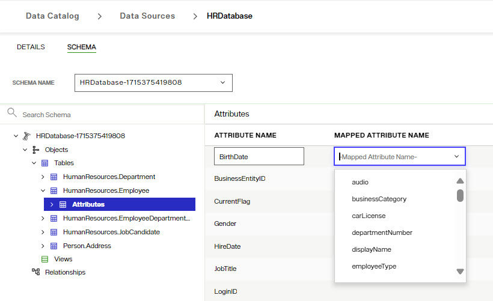

### Mapping LDAP Objects to New Object Classes and Attributes

To map to LDAP object classes and/or attributes, open the LDAP schema containing the objects you want to map in the Control Panel > Setup > Data Catalog > Data Sources > [Selected Data Source] > Schema tab.

**Remapping LDAP Object Classes**

1.	Select the LDAP object class that you want to re-map and locate the LDAP ObjectClass property on the right.
1.	Click the  icon inline with the LDAP ObjectClass property.
   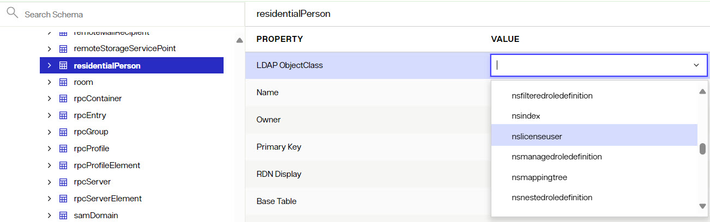

1.	Select the object class from the drop-down list that you want mapped to re-map the LDAP object to. If you prefer to enter your own custom object class name, you can type it in the LDAP ObjectClass property. 

1.	Click the  inline with the LDAP ObjectClass property.
1. Click **SAVE**.	

**Remapping LDAP Attributes**

1. Expand the LDAP object class you want to map the attributes for and select the *Attributes* node.
1. Click the  inline with the attribute you want to map.
1. Use the Mapped Attribute Name column to define attribute mappings. If you have mapped the object to a (known) LDAP object class, the list of attributes shown in the drop-down list are populated from the schema definition. If you prefer to enter your own custom attribute names, type them in the Mapped Attribute Name property next to the database attribute name.
1. Click the  inline with the attribute to save the mapping.
1. Click **SAVE**.	

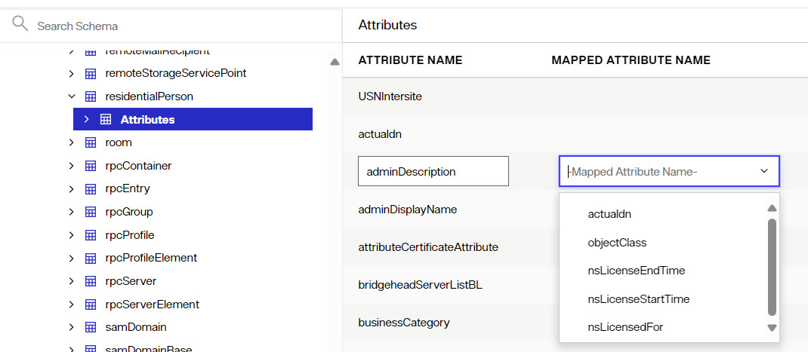

## Comparing Schemas

This option allows you to view the differences between an extracted schema file and the current backend schema. You can choose to update the selected schema file with the differences or save a new schema file. Comparing and then merging changes is helpful if you have extracted and enhanced (declared keys, relationships, mapping…etc.) a very large schema and you need to bring in new objects from that same server. You can compare the selected schema file with the current backend schema and just merge in new objects/attributes with the existing schema. This saves time over having to extract and enhance the entire schema again. 

To compare schemas:

1. In the Control Panel, navigate to Setup > Data Catalog > Data Sources. 

1. Select a data source. 

1. Click the data source's Schema tab. Choose the schema file that you want compared against the current backend schema.

1. From the Options menu ("..."), select **Compare Schema**. The Schema Differences Detected window displays. 

1. Expand the Tables, Views, and Relationships nodes. Red highlighted items indicate what is not in the current schema but is in the selected schema. Green highlighted items indicate what is in the current schema and not in the selected schema.
  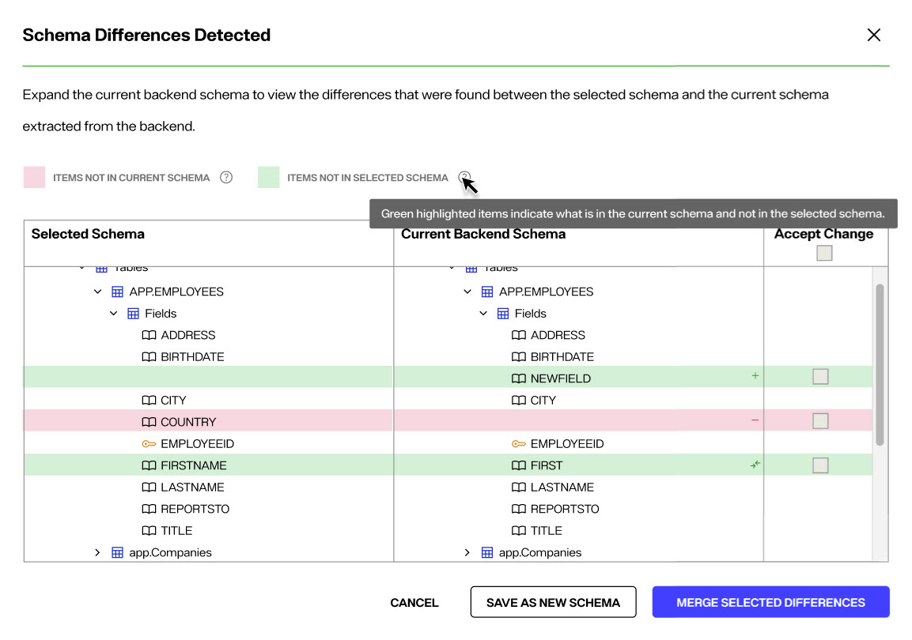

1. Check *Accept Change* next to the items that you want to merge into the selected schema file and click **Merge Selected Differences**.

>[!note] To save differences in a new schema, click **Save As New Schema**. The new schema file is added to the drop-down list for the associated data source.

## Include in RadiantOne LDAP Schema

If you want to extend the RadiantOne LDAP schema with objects and attributes from the currently selected data source schema, toggle "Include in Server Schema" on. If this option is disabled, the objects and attributes are not included. The RadiantOne LDAP schema can be viewed and managed from Control Panel > Setup > Directory Namespace > Directory Schema.
