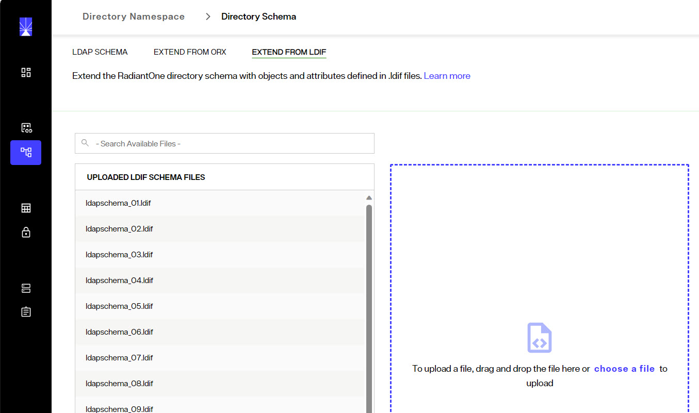
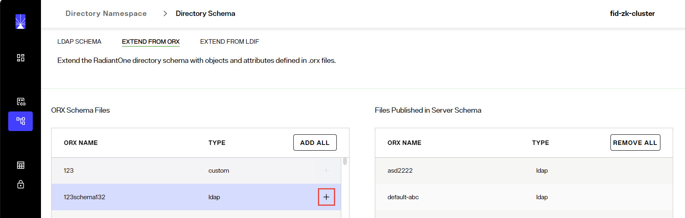
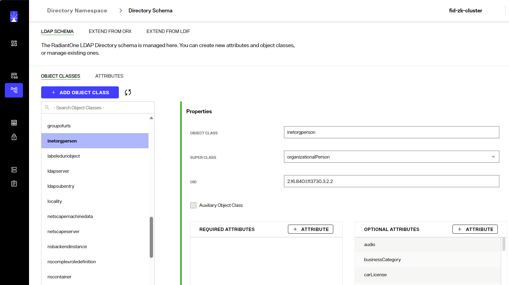
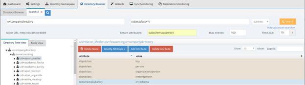

## Overview

The default schema is contained in two LDIF files. They are, ldapschema_00.ldif and ldapschema_01.ldif. Radiant Logic specific object classes and attributes found in these files are assigned identifiers (oid) prefixed with 1.3.6.1.4.1.40747.1.X for attributes and 1.3.6.1.4.1.40747.2.X for object classes.

>[!warning]
>If you have WebSphere configured to use RadiantOne as the LDAP security directory, and RadiantOne is accessing an Active Directory server backend, you must extend the RadiantOne LDAP schema with all objects and attributes from the Active Directory schema. Otherwise, you can encounter problems with WebSphere not being able to properly get group membership. For detailed steps, please see below. You must already have established a connection to Active Directory before following the steps in the Extending the RadiantOne LDAP Schema section.

## Extending the Directory Schema

You can extend the schema in three different ways. Each is summarized below and further described in its own section after. 
-	Uploading an LDIF file that contains the new object classes and attributes. This file should be named ldapschema_<2 digit number greater than the existing file names>.ldif. After restarting the RadiantOne service, the new schema information is loaded into the server. Restart the service from the Environment Operations Center.
-	Extending the Schema with Objects and Attributes from metadata extracted from existing identity data sources.
-	Creating new object classes and attributes in the Control Panel.

### Extending the Schema with Objects and Attributes from an LDIF File

The LDIF file should be properly named, formatted, and uploaded using Control Panel > Setup > Directory Namespace > Directory Schema.

**Figure 1: Extending Directory Schema with LDIF Files**

The name of the LDIF file should be ldapschema_<any 2 digit number greater than the existing file names>.ldif. For example, the following schema files already exist by default: ldapschema_00.ldif, ldapschema_01.ldif, and ldapschema_05.ldif, so a new schema file could be ldapschema_03.ldif (any unused 2 digit number could be used).	

>[!warning] 
>If an object class or attribute is defined in multiple ldapschema files numbered between ldapschema_00.ldif and ldapschema_49.ldif, the ldapschema file with the largest number overrides the definition in lower numbered files. For example, if an object class named domain is defined in both ldapschema_01.ldif and ldapschema_10.ldif, the definition from ldapschema_10.ldif is used. The ldapschema_50.ldif is a special file generated from .orx schema definitions. If an object class or attribute is defined in multiple ldapschema files numbered between ldapschema_50.ldif and ldapschema_98.ldif, the ldapschema file with the largest number will override the definition in the lower numbered files but will not override any definition in files numbered between ldapschema_00.ldif through ldapschema_49.ldif. For example, ldapschema_90.ldif would override ldapschema_50.ldif, but would not override a definition in ldapschema_48.ldif. The ldapschema_99.ldif overrides all previous definitions in ldapschema_00-98.ldif.

## Extending the Schema with Objects and Attributes from Existing Identity Sources

The metadata from any backend that is virtualized by RadiantOne is maintained in a file with an .orx extension. All .orx files are shown in the Control Panel > Setup > Directory Namespace > Directory Schema > EXTEND FROM ORX section. If you extracted a new schema in Data Catalog, and it does not appear in the list, click **Refresh**. To add the object classes and attributes contained in a file to the RadiantOne Directory schema, click **+** next to the schema name. This lists the schema file in the table on the right. After all schema files have been added click **Generate**.

**Figure 2: Metadata Files Available for Extending Directory Schema**

The object classes and attributes contained in the select files are added to the RadiantOne schema and can be viewed from the Control Panel > Setup > Directory Namespace > Directory Schema > LDAP Schema section.

>[!note] 
>If you have already added object classes and attributes from some .orx files, then they automatically published in the table on the right. If you want them removed from the RadiantOne directory schema, click the delete icon next to the schema name.

## Extending the RadiantOne Schema with New Objects and Attributes from the Main Control Panel

Object classes and attributes can be manually defined from the Control Panel > Setup > Directory Namespace > Directory Schema > LDAP Schema section.

**Figure 3: Manually Defining New Object Classes and Attributes**

### Create New Object Class

1.	Go to the Control Panel > Setup > Directory Namespace > Directory Schema > LDAP Schema section.
2.  Select the OBJECT CLASSES sub-section.
3.	Click **+ADD OBJECT CLASS**.
4.	An auxiliary object class is one that does not define the core type of an entry, but defines additional characteristics of that entry. If the object class you are creating should be auxiliary, check the Auxiliary Object Class option.
5.	Enter a name for the object class, parent/super class (if it inherits from an existing object class), and OID (optional). Using the **+ATTRIBUTE** buttons, declare which attributes are required and which are optional.
6.	Click **OK** to add the new object class to the RadiantOne Directory schema.

### Create New Attribute

1.	Go to the Control Panel > Setup > Directory Namespace > Directory Schema > LDAP Schema section.
2.	Select the ATTRIBUTES sub-section.
3.	Expand the User-defined attributes section.
4.	Click **+ADD**.
5.	Enter new attribute name, OID (optional), attribute aliases (optional), description (optional), and syntax (from the drop-down list).
6.	Check whether the attribute allows multi-values.
7.	Click **ADD** to add the new attribute to the RadiantOne Directory schema.

## Requesting the Schema Associated with Entries - subschemaSubentry

The subschemaSubentry attribute is an operational attribute that is returned by RadiantOne for every entry in the directory when it is specifically requested. The value of the subschemaSubentry attribute is the DN of the entry that contains schema information for this entry. An example of an LDAP search with subschemaSubentry requested is shown below.

**Figure 4: Requesting subschemaSubentry**
