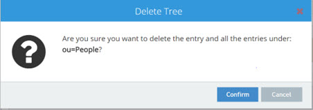

## Overview

Topics related to managing directory stores include the following:
- How to intialize directory stores from LDIF files.
- How to manually manage entries from the Directory Browser.
- How to backup and restore.
- How to reindex.
- How to export directory stores.

## Initializing Directory Stores

Initialization of RadiantOne directory stores on new nodes is done automatically when they are added to the RadiantOne cluster.

Directory stores can be initialized with LDIF files. The Control Panel supports a simplified version of the LDIF file format. For example, it does not support 'changetypes'. 

To import an LDIF file:

1.	On the Control Panel > Setup > Directory Namespace > Namespace Design, select the node where the directory store is mounted below Root Naming Contexts.
1.	On the Properties tab, click . 
1.	Choose to either *Upload file* and browse to the file, or *Select file on the server* to display a list of files to choose from.
1.	Click **OK**.

	 >[!warning] If using an LDIFZ file, the security key used on the RadiantOne node where the file was exported must be the same security key value used on the RadiantOne node that you are trying to import the file into. For steps on defining key generation or changing the encryption security key, see the [Attribute Encryption](/security/attribute-encryption).
1.	The initialization process is performed as a task. The Tasks Monitor window displays at the bottom of the screen. Click **DISMISS** to exit the window. To view the task details, you can click **MANAGE TASKS**, or you can click **VIEW LOG** and then select the LOGS tab, which is helpful in case there are errors.


If you have a large data set and generated multiple LDIF files for the purpose of initializing the local store (each containing a subset of what you want to store), name the files with a suffix of “_2”, “_3”…etc. For example, let’s say the initial LDIF file (containing the first subset of data you want to import) is named init.ldif. After this file has been imported, the process tries to find init_2.ldif, then init_3.ldif…etc. Make sure all files are located in the same place so the initialization process can find them.

>[!warning] 
>Deactivate any inter-cluster replication on the RadiantOne directory store prior to re-initializing them. To do so, navigate to the node where the RadiantOne Directory store is mounted from the Control Panel > Setup > Directory Namespace > Namespace Design. On the Properties tab, uncheck “Inter-cluster Replication”, then click **SAVE**. 

### EntryDN

For every entry inserted into a RadiantOne directory store, an entryDN operational attribute is generated. This attribute contains a normalized form of the entry’s DN. This attribute is indexed by default and can be used in search filters. An example of a user entry inserted into a RadiantOne Directory store from the Control Panel > Manage > Directory Browser is shown below. The entryDN attribute that was auto-generated is highlighted.


 
Extensible match filters are supported on entryDN. An example of a search request for the user entry shown above that leverages the entrydn attribute is shown below. The filter used in this example is: (ou:dn:=Users) and is equivalent to requesting entries that have ou=Users somewhere in their entryDN.


 
An example of a more complex filter on entryDN is shown below and is equivalent to requesting entries associated with the objectclass named “person” that have ou=Accounting or ou=Management somewhere in their entryDN: <br>
`(&(objectclass=person)(|(ou:dn:=accounting)(ou:dn:=Management)))`

### Universally Unique Identifier (UUID)

The Universally Unique Identifier (UUID) attribute is a reserved, internal attribute that is assigned to each entry and can guarantee uniqueness across space and time.

When adding entries into a RadiantOne directory store (LDAP ADD operations) from an LDIF file, if there are UUID attributes, they are ignored during import. RadiantOne generates a unique value for each entry based on the specifications in RFC 4122.

When initializing with an LDIF file (LDIF INIT), if the entry has a UUID attribute, RadiantOne keeps it. If the entry does not have a UUID attribute, RadiantOne generates a unique value for each entry based on the specifications in RFC 4122.

UUID is an operational attribute meaning that if a client wants this attribute, they must explicitly ask for it in the search request sent to RadiantOne.

When exporting a RadiantOne directory store to an LDIF file, you have the option to export the UUID attribute or not. The UUID attribute should be exported into LDIF if you plan on using this export to initialize another RadiantOne directory store, a replica for inter-cluster replication. Otherwise, the UUID attribute generally should not be exported. To export a RadiantOne directory store and include the UUID attributes, check the *Export for Replication* option in the export window shown when you click the **EXPORT** button on the Control Panel > Setup > Directory Namespace > Namespace Design > node representing the RadiantOne directory > Properties tab on the right. 


 
If you only need to replicate a sub-branch instead of the whole RadiantOne directory store, you can use the Export option  on the Control Panel > Manage > Directory Browser when you have the sub-branch selected.


**NEEDS NEW SCREEN SHOT**

 

## Number of Supported Clauses in Search Filters

**NEEDS UPDATED TO INDICATE THE PROPER API REQUEST TO SET THIS INSTEAD OF USING ZK SETTING!!**

By default, the RadiantOne directory supports a maximum of 1024 clauses in search filters. To increase the maximum number of clauses supported, edit the maxClausesLimit property setting in /radiantone/v1/cluster/config/vds_server.conf from the Main Control Panel -> ZooKeeper tab (requires [Expert Mode](01-introduction#expert-mode)). The RadiantOne service does not need to be restarted after modifying this value.

## Exporting Directory Stores

Stores can be exported into an LDIF file from the Control Panel > Setup > Directory Namespace > Namespace Design. 

>[!warning] 
>If exporting to an LDIFZ file, a security key must be configured for RadiantOne. Any target stores where you want to import this LDIFZ file must use the same LDIFZ security key value. For steps on defining key generation or changing the encryption security key, see [LDIF File Encryption](managing-properties).

1.	 From the Control Panel > Setup > Directory Namespace > Namespace Design select the node where the directory store is mounted. 
1.	 On the right side, click **EXPORT**. 
1.	 Enter a file name and select an extension type (.ldif or .ldifz). If you want the exported file to be zipped and encrypted, select the .ldifz option from the drop-down list. In order to support exporting to an encrypted file, a security key must be configured for RadiantOne. Any target RadiantOne directory stores where you want to import this LDIFZ file must use the same LDIFZ security key value. For steps on defining key generation or changing the encryption security key, see the [LDIF File Encryption](managing-properties).


1.  If this exported file is going to be used to initialize another RadiantOne directory store for replication, check the option to Export for Replication. Otherwise, leave this option unchecked. All entries in the RadiantOne directory store are exported with this option.
1.	 Click **DOWNLOAD FILE**.

## Rebuilding Indexes

If the Indexed Attributes or Sorted Attributes properties are changed, click the **RE-BUILD INDEX** button on the Properties Tab for the selected RadiantOne directory store. 

Rebuilding an index should not happen very frequently. It is a time-consuming process, and should be performed during a scheduled maintenance window. During the rebuild of the index, the RadiantOne directory store is not accessible. When the indexing is complete, the store is active again and the follower/follower-only nodes (if any) get the data from the leader node to update their local copy.

## Backing up a Directory Store

To back up a RadiantOne directory store, click **Backup** on the Properties Tab.

To download a copy of the backed up directory store, click **DOWNLOAD .ZIP**. The compressed file is located in your web browser's default download location. 

## Restoring a Directory Store

To restore a RadiantOne directory store from a previous backed up image, click Restore on the Properties Tab for the selected store. Select a date associated with the backup point you would like to restore in the default directory, or upload an existing .zip file containing the image to restore. The RadiantOne directory store is deactivated and is inaccessible by clients during the restore operation.

## Interception Scripts

Only a global interception script is supported for RadiantOne directory stores. For details on global interception, see the [Global Interception](/global-settings/global-interception).

## Deleting a Directory Store

To delete a RadiantOne directory store, first de-activate it (uncheck the Active checkbox) and click **SAVE**. Then, click the **DELETE** button on the Properties Tab for the selected store.

## Inter Cluster Replication

Inter Cluster replication in RadiantOne leverages a publish-and-subscribe architecture. The leader nodes within each cluster play the role of a master in the multi-master replication. Each leader node publishes their changes in the common replication journal. Each leader node is also responsible for periodically checking the journal for changes that they need to apply locally. The default checking interval is 7 seconds. Should conflicting change events occur, a combination of timestamps and sequence numbers associated with the conflicting events are used to resolve the conflict.

>[!note] 
>On startup, a RadiantOne node first applies any missed change events from the replication journal. After these changes have been applied it is able to serve as an active node in the cluster.

A data source named replicationjournal is included in the RadiantOne install and plays the role of the journal. This data source points to the default cn=replicationjournal naming context installed with RadiantOne and should not be deleted or deactivated. You can decide to have the journal running on one of the clusters that is participating in replication, or run a separate cluster whose only role is to house the central journal. Having the journal housed in a Universal Directory (HDAP) store deployed in a cluster ensures high availability of this repository. The replicationjournal data source should indicate a primary server/node in the cluster and the failover servers should point to the other cluster nodes.


 
Figure 5.12: The Journal Leveraged for Inter Cluster Replication

To configure inter-cluster replication, follow the steps below.

1.	The replicationjournal data source for all clusters must be configured to point to the same journal. For example, if there are three clusters (1, 2, and 3) and cluster 1 is where the journal is located, the replicationjournal data source in clusters 2 and 3 must point to the cn=replicationjournal naming context in Cluster 1. All nodes running in Cluster 1 should be defined in the data source: one of them as the primary server and the others as failover.


 
Figure 5.13: Configuration of Multi-Master Replication

>[!note] 
>All clusters that participate in the inter cluster replication topology must have unique cluster names to be uniquely identified.

1.	To modify the replicationjournal data source in clusters 2 and 3, launch the Main Control Panel associated with the leader node of that cluster and login as the RadiantOne Directory manager. From the Settings Tab-> Server Backend section -> LDAP Data Sources sub-section, click on the replicationjournal data source and click **Edit**. Modify the hostname and port to point to the replicationjournal running in cluster 1. The base DN should be cn=replicationjournal. All nodes running in the cluster housing the journal should be defined in the data source: one of them as the primary server and the others as failover.

>[!warning] 
>Make sure the port used in the replicationjournal settings can be accessed from all clusters and that firewall rules do not prevent the cluster from reading and writing into the central journal.

1.	The same naming context and RadiantOne Universal Directory store to be replicated must be configured in each cluster. To create a new Universal Directory store, go to the leader node’s Main Control Panel > Directory Namespace tab and click . Remember, configuration changes in a cluster are shared across all cluster nodes. Therefore, you only need to configure the Universal Directory store on one node.

1.	Enter the new naming context (e.g. dc=replication) and select the Universal Directory (HDAP) Store option. 
1.	Click Next.
1.	Click OK.
1.	Repeat these steps on the leader node within each cluster.
1.	Before enabling replication, all replicas must have the same initial image: either an empty store or an initialized store. 
1.	To initialize a store, go to the leader node of a given cluster. To determine the leader node of a cluster, go to the Main Control Panel -> Dashboard tab and check the details associated with each node. On the Main Control Panel for the leader node, go to the Directory Namespace tab. Select the naming context representing the Universal Directory store. 
1.	In the properties tab on the right, click on the initialize button at the bottom of the screen and choose a location for the LDIF to initialize your store with. 
1.	Click OK and the initialization is launched as a Task which can be viewed from the Server Control Panel associated with the leader node > Tasks tab. Once the task completes, the store is initialized. As the initialization is performed on the leader node, all follower/follower-only nodes are also initialized automatically.
1.	(Optional) If you want to [exclude certain attributes from replication](#changing-excluded-attributes), enter a comma-separated list of attributes in “Replication Excluded Attributes” property. Then, you can click “Export” to generate an LDIF file (make sure you have “Export for Replication” enabled), that excludes these attributes. This LDIF file can be used to initialize replicas in other clusters. 
1.	After the Universal Directory stores are initialized in each cluster, inter-cluster replication must be enabled. Remember, configuration changes in a cluster are shared across all cluster nodes. Therefore, you only need to enable the replication on one node.
1.	To enable inter-cluster replication for a specific Universal Directory store, go to the Main Control Panel > Directory Namespace Tab on the leader node and select the Universal Directory store below the Root Naming Contexts section. 
1.	On the Properties tab on the right, check the box for Inter-cluster Replication as shown in the screen below.
1.	Click **Save**.
 


Figure 5.14: Enabling Universal Directory Store for Inter-Cluster Replication

### Fractional Replication

With fractional replication, you can indicate that certain attributes should be excluded from replication. This allows you to control which data is distributed and reduce the replication bandwidth by excluding attributes like photo, jpegPhoto and audio.

Fractional replication can be enabled per Universal Directory naming context by indicating a comma-separated list of attributes to exclude from replication in the Replication Excluded Attributes list. This property is available on the Properties tab of a selected store naming context. Click the Edit button next to the property to configure the comma-separated list of attributes. You must configure this excluded attribute list (same list of attributes) in every cluster participating in inter-cluster replication. Therefore, you should plan and configure the excluded attributes list prior to starting inter-cluster replication. If you need to make changes to the excluded attributes list, see [Changing Excluded Attributes](#changing-excluded-attributes).


 
Figure 5.15: Replication Excluded Attributes

When you export the store on the main cluster, make sure the “Export for Replication” checkbox is enabled. This ensures the excluded attributes are not included in the exported LDIF file and will not be included when the replicas are initialized.


 
Figure 5.16: Export for Replication

### Changing Excluded Attributes

Adding and removing attributes from the Replication Excluded Attributes list takes effect immediately after saving the configuration change. To keep all clusters consistent, you should temporarily suspend replication if you need to make changes to the Replication Excluded Attributes list. The steps are outlined below.

1.	Log into the Main Control Panel.

2.	Navigate to the ZooKeeper tab (requires [Expert Mode](01-introduction#expert-mode)).

3.	Navigate to `/radiantone/<zk_version>/<clustername>/config/namings/<namingcontext_being_replicated>`.
4.	Click **Edit Mode**.

5.	Set the replicationInSuspendMode property to true (as shown below).


 
Figure 5.17: Location of Configuration to Suspend Inter-cluster Replication

6.	Click **Save**.

7.	Repeat steps 1-6 for each cluster involved in inter-cluster replication.

8.	Navigate to the Main Control Panel > Directory Namespace tab.

9.	Select the Universal Directory store naming context below Root Naming Contexts.

10.	On the Properties tab, for the selected store, click Edit next to Replication Excluded Attributes.

11.	Enter a comma-separated list of attributes to exclude from replication and click Save Changes.

12.	Click **Save**.

13.	Repeat steps 8-12 in each cluster playing a role in inter-cluster replication.

14.	Navigate to the Main Control Panel -> ZooKeeper tab.

15.	Navigate to `/radiantone/<zk_version>/<clustername>/config/namings/<namingcontext_being_replicated>`.

16.	Click **Edit Mode**.

17.	Set the replicationInSuspendMode property to false (to restart inter-cluster replication).

18.	Repeat step 17 in each cluster playing a role in inter-cluster replication.

### Subtree Replication

With subtree replication, you can indicate which containers/sub-branches should be replicated. To export the sub-branches to initialize replicas, use the Main Control Panel > Directory Browser tab. Select the container/sub-branch that should be replicated and use  to export. Check the option to Export for Replication to ensure the UUID attribute is included in the export. Copy this exported LDIF file to the replica server and use it to initialize the Universal Directory store.


Figure 5.18: Export to LDIF for a Specific Sub-branch (e.g. ou=Accounting)

The replication sub-trees must be defined in a comma-separated list in the “replicationSubtreeDomains” property located in ZooKeeper at: /radiantone/<version>/<cluster_name>/config/namings/<root_naming_context>

An example of configuring two sub-trees for replication would be:

“replicationSubtreeDomains” : [“ou=Accounting,o=companydirectory”, “ou=Sales,o=companydirectory”],

## Managing Universal Directory Entries

On the Main Control Panel > Directory Browser tab of the leader node, you can see the entire directory structure instantiated with the directory entries. There could be nodes for Universal Directory stores, virtual directory trees, the change log (if enabled stores all changes made to local storage or virtual entries), and other default configuration below cn=config. If you do not see your new naming context after clicking on the Directory Browser tab, click the  button at the top.

### Creating New Entries

>[!warning] 
>The user you are logged into the Control Panel as must have rights to create users.

To create new entries, select the parent location in the tree above where you want the entry created and click . Select New Entry, New inetOrgPerson, New Active Directory User New OrganizationalUnit, or New Group. The sections below describe these default options including the object classes that are used. If you want to create entries using different types of object classes than the ones mentioned here, then choose the New Entry option and select the desired object class from the drop-down list. Only object classes available in the RadiantOne LDAP schema are shown here. If the desired object class is not shown, extend the RadiantOne LDAP schema first and then come back to this screen to add your entry. See the [RadiantOne System Administration Guide](/documentation/sys-admin-guide-rebuild/01-introduction) for steps on extending the RadiantOne LDAP schema.

>[!warning] 
>Creating/Modifying entries on the Directory Browser tab is not just for local Universal Directory stores. If a backend other than a local store is mounted under the naming context where you are creating/modifying entries, the backend source is modified accordingly. For example, if you are modifying a branch that represents an LDAP backend and you create a new user entry, that operation is sent to the backend (assuming the credentials stored in the connection string/data source to the backend has the appropriate rights to create users).

**New Entry**

To create entries based on an object class other than group, organizationalUnit, inetOrgPerson, or user, choose the New Entry option. When you select the “New Entry” option, you are shown a drop-down list with all object classes available in the RadiantOne LDAP schema. Select the object class that the entry should belong to. After the object class is selected, enter the RDN in the space provided, and then enter values for the attributes below (all required attributes must have values – required attributes are noted with a “yes” in the “Required?” column). Type the value after clicking in the Value column. 
 


Figure 5.19: Creating a New Entry

**New Group**

When creating a new group, you are able to select from the following list of object classes: group, groupOfNames, groupOfUniqueNames, groupOfUrls. More than one object class may be selected. 

>[!note] 
>If you want the group to be a dynamic group, you must choose the groupOfUrls object class.


 
Figure 5.20: Creating a New Group Entry

**New OrganizationalUnit**

If you choose to create a new organizationalUnit, the entry is associated with the organizationalUnit object class. 

**New Active Directory User**

This is only relevant if the underlying source is Active Directory. This is a special template for Active Directory due to the specific attributes that are required to be set during the creation of an account. When creating a new Active Directory user, an SSL connection is required if a password is entered for the account. If you do not want to set a password during the account creation, check the Account is Disabled option.

**New inetOrgPerson**

If you choose to create a new user, the entry is associated with the inetOrgperson object class. 

**New Dynamic Object – Entry that has an Expiration**

RadiantOne Universal Directory supports temporary entries using the dynamicObject auxiliary object class as specified in [RFC 2589](https://www.rfc-editor.org/rfc/rfc2589). These entries are associated with a time to live attribute and once expired, the entry is automatically removed from the directory. The attribute that determines the expiration is named entryTTL and has a value in seconds. The minimum entryTTL value supported is 900 seconds. If there is no value specified for entryTTL when the entry is created, a default of 86400 (24 hours) is used.

Dynamic objects have the following conditions:

-	A static object cannot be turned into a dynamic object (you cannot simply add the dynamicObject object class to an existing entry), and vice versa. The object must be marked as dynamic when it is created.

-	Dynamic objects can be created under static objects but cannot be created under dynamic objects.

-	Dynamic objects that are containers cannot have static child objects.

There is no GUI way to create Dynamic Objects so it is common to use an LDAP command line utility. Below is an example of an LDIF file that contains a dynamic entry to create followed by an ldapmodify command to create the entry:

```
dn: uid=tempuser2,o=companydirectory
changetype: add
objectclass: user
objectclass: dynamicObject
uid: tempuser2
entryTtl: 1000
```

C:\SunResourceKit>ldapmodify -h fidserver -p 2389 -D "cn=directory manager" -w password -f addtempuser2.ldif

The temporary entry can be seen from the Main Control Panel in the example below. This entry will exist for 1000 seconds and then be deleted automatically.


 
Figure 5.21: Dynamic Object/Entry Example

To update the time-to-live for an entry, you can use the “refresh” extended operation as outlined in RFC 2589. The refresh operation is sent by a client to RadiantOne, to indicate that the dynamic directory entry is still accurate and valuable. The client sends a periodic refresh request and if the server receives the request within the timeout period, the lifetime of the dynamic entry can be extended. Below is an example of using the LDAP extended operation command line utility to change the entryTTL to 900 seconds.

ldapexop -v -h "fidserver" -p 2389 -D"cn=Directory Manager" -w password refresh "uid=tempuser2,o=companydirectory" 900

ldap_initialize( ldap://fidserver:2389 )
newttl=900
Result: Success (0)

### Managing Group Entries

Groups stored in a Universal Directory store may contain members from any branch in the RadiantOne namespace (not just limited to the local store where the group is defined). The easiest way to manage group membership is from the Main Control Panel -> Directory Browser tab. Select the desired group and click .

**Adding Explicit Members**

To add explicit members, follow the steps below.

1.	Select a group and click the Manage Group option on the Directory Browser tab.

2.	If the group is a dynamic group (contains the groupOfUrls object class), the Manage Group window displays an Edit Dynamic Members option and an Edit Explicit Members option. Click the Edit Explicit Members option. If the group is not a dynamic group, the member list displays.

3.	In the Members window, click the Add Members button. The Find Users and Groups window opens.

4.	Select either Groups or Users from the Find drop-down menu and then click  to select a starting point in the RadiantOne namespace to look for groups/users.

5.	To limit the search criteria, enter a value in the Keywords field before clicking Find Now. If “Users” was selected from the Find menu in the previous step, the value must match a uid, sn, sAMAccountName, or cn value. If “Groups” was selected in the previous step, the value must match the cn value.

The objectclass for the user must be inetOrgPerson, user, person, or organizationalPerson (for the search to return them as a user entry). For groups, the objectclass must be group, groupOfNames or groupOfUniqueNames.

6.	Select the user or group you want to add and click . To select all users returned from the search result, click .

7.	Click Confirm. New members to be added are highlighted in a different color than current members. An example of adding three members is shown below.


Figure 5.22: Example of adding three members
 
8.	Click Close to exit the Members screen. 

**Dynamic Members**

Dynamic group members are different than explicit group members because instead of specifying a user DN in the group membership attributes (either the member or uniqueMember attributes), you need to specify the LDAP URL containing the filter to find the group members in an attribute named memberURL. The syntax for the memberURL value is as follows:

```
<base_dn>?[attrs]?[sub|one|base]?<filter>
```

-	base_dn is the location in the RadiantOne namespace to start searching from to find the user entries you want to be a member of the group.

-	attrs is optional and here you can provide certain attributes to return about the user entries.

-	the next value is for the scope of the search. This can be either sub (for sub tree search scope), one (for one level search scope), or base (for base level search scope).

-	the final parameter is the filter that should be used to return all members for the group. 

For example, if all users that have departmentNumber=0332 should be members of a group named Sales, the group entry should have the following attributes:

-	objectclass = groupOfURLs (in addition to any other objectclasses for the group --- like group or groupOfUniqueNames…etc. If you only want dynamic members, then groupOfURLs is the only objectclass required). 

-	memberURL = ou=People,ou=Sun,o=vds??one?(departmentNumber=0332)

To add dynamic members with the assistance of a wizard, follow the steps below.

1.	Select a dynamic group and click the Manage Group option on the Directory Browser tab. The Manage Group window opens.

1.	Click **Edit Dynamic Members**. 

>[!note] 
>The Edit Dynamic Members option displays only if the group contains the groupOfUrls object class.

1.	Click **Add Member(s)**.
1.	Enter a base DN (starting point in the RadiantOne namespace) or click  to navigate to the location of the users. 
1.	Select the scope of search needed to find the users. 
1.	Finally, enter the filter that qualifies the users or groups as members of the specific group. 
1.	Click **Confirm**. 
1.	Click **Close** to exit the Dynamic Members screen. 
1.	Once the memberURL is defined, you can enter optional return attributes separated by a comma instead of the default which is to return all attributes. If the user or group entries are large, you may want to only return the attribute that contains the user DN for example (dn, distinguishedName…etc.). To do so, select the memberURL attribute and choose Modify Attribute > Edit. 
1.	In the LDAP URL, replace. 1.1 with a comma separated list of attributes to return and click OK.


 
Figure 5.23: memberURL Criteria for Dynamic Group

**Manually Adding Dynamic Members**

An option to manage dynamic group members is to manually add the groupOfUrls objectclass and memberURL to the group entry. Follow the steps below.

1.	Navigate to the group in the Main Control Panel > Directory Browser Tab.

2.	Select the group entry and on the right side, select the objectclass attribute.

3.	Choose Modify Attribute > Add Value.

4.	Enter groupOfURLs for the new object class and click Confirm.

5.	To add members, with the group selected in the tree, click **Add Attribute** on the right side.

6.	In the attribute drop-down list, select memberURL. 

7.	Enter the memberURL using the syntax mentioned above. Click Confirm and the group entry is updated accordingly.

>[!note] 
>Groups stored in RadiantOne Universal Directory can contain both explicit members and dynamic members. If RadiantOne is the enforcement point for authorization it first checks to see if the user is an explicit member of the group(s). Then, dynamic group membership is evaluated.

The notion of dynamic group membership is discussed in the Concepts section of the [RadiantOne System Administration Guide](/documentation/sys-admin-guide-rebuild/02-concepts). It is worth mentioning again, that if the client application is the enforcement point for authorization, then the logic to perform the extra search to the directory to find the group members (based on the memberUrl value of the group entry) must be implemented in the client application code. If the application does not support LDAP dynamic groups, then RadiantOne can be configured to dynamically build the group membership on-the-fly and make all groups managed by RadiantOne appear to have static (explicit) group members.

For more information on LDAP dynamic groups, please see Groups in the [RadiantOne System Administration Guide](/documentation/sys-admin-guide-rebuild/02-concepts).

**Removing Members**

To remove explicit group members, from the Main Control Panel > Directory Browser Tab, select the group entry and click . If the group is a dynamic group that has both static and dynamic members, there is an option to edit “explicit” members and one to edit “dynamic” members. If there are no dynamic members, the list of unique members is displayed. Click Remove Member(s), select the member(s) and click Confirm Remove Member(s). If there are dynamic members, click the Edit Dynamic Members option first to reach the screen to remove members. If the group has many members, you can type a value in the filter box on the top right to reduce the entries shown.

To remove dynamic members, select the group entry and click . Click **Edit Dynamic Members**. Click **Remove Member(s)**, select the LDAP URL representing the members to remove and click **Confirm Remove Member(s)**. Click **Close**. 

>[!note] 
>Only groups that are of objectclass type groupOfUrls can have dynamic members. If the group you are managing does not have this object class, then the Dynamic Members option is not shown.

**Modifying Group Attributes**

All group attributes that allow modifications can be changed from the Main Control Panel -> Directory Browser tab. 

1.	Select the group entry in the tree and then on the right side, click the attribute you want to update.

2.	Click **Modify Attribute** > **Edit**. 

3.	Enter the new value.

4.	Click **Confirm**.

To add a value to a multi-valued attribute, select the attribute and choose Modify Attribute > Add Value. 

To delete a value from a multi-valued attribute, select the attribute and value you want to remove and choose Modify Attribute > Delete Value and click **Confirm**.

### Searching Using Range Retrieval

Searching for multi-valued attributes (generally members) in a group may result in the retrieval of many returned values. To define the range of returned attribute values, use the Range option. This feature can be used with any object class (e.g. group, groupOfUniqueNames) and any attribute (e.g. member, uniqueMember). Both RadiantOne Universal Directory stores and RadiantOne FID persistent cache support range searches. 

An example of how to perform a Range Retrieval search in RadiantOne is described below:

1.	With the RadiantOne service started, click the Main Control Panel > Directory Browser tab. 
1.	Click the  icon. 
1.	Enter a DN in the Search DN field. 
1.	Specify an object class. 
1.	Select a scope. Searches with a lower limit other than 0 must have a scope of “base”. 
1.	Click “Show Advanced Search”. 
1.	In the Return Attributes field, enter your range in the following syntax. 

`<member> or <uniquemember>;range=<lowerlimit>-<upperlimit>`

>[!note] 
>For more information on lower and upper limits, see the [Range Limits](#range-limits) section. Refer to the [Examples](#base-search-with-the-dereferencing-flag-set-to-search) section for example searches.

1.	Click **Search**. 

**Range Limits**

Range retrieval involves requesting either a limited or unlimited number of attribute values in your search. In the RadiantOne Main Control Panel’s Directory Browser search function, the range is specified in the Return Attributes field. This section describes the lower and upper range limits. 

*Lower Range Limit*

The range’s lower limit must be expressed as a numerical value and must not exceed the number of members in the group. If the lower limit is greater than 0, the search scope must be “Base”. If the lower limit is greater than 0, and the search scope is “One Level” or “Subtree”, an error occurs. 

*Upper Range Limit*

The upper limit can be expressed by a numerical value, or, to express a limitless upper limit, use the asterisk [*]. If the upper limit is expressed as a numerical value, it must exceed the lower limit. RadiantOne has no server size limit on range retrieval searches. Be aware that searches with large ranges might affect client performance. 

**Range Syntax**

The following table describes syntax for a few example range searches. 

Syntax 	| Description
-|-
range=0-* | Retrieves all attribute values. 
range=1-10	| Retrieves the second through eleventh values. 
range=0-5000 | Retrieves the first through 5001st values. 

**Examples**

Below are some example range searches. 

**Full-range Search**

In the following example, a search is performed on all group member attributes. 

>[!warning] 
>Searches with large ranges may impact client performance.

The Return Attributes value for this example is as follows.

member;range=0-*


Figure 5.23: Full-range Search Example

**Mid-range Search**

This search retrieves the second through eleventh values. The following search parameters are used in this example.

Scope: Base
Return attributes: member;range=1-10


Figure 5.24: Mid-range Search Example

**Large-range Search**

The following search retrieves the first through 5001st values. The Return Attributes value for this example is the following. 

member;range=0-5000


Figure 5.25: Large-range Search Example

### Nested Groups

RadiantOne Universal Directory supports nested groups, where groups can be members of other groups. To enable support for nested groups, navigate to the Main Control Panel > Settings tab > Security > Access Controls. Check the option to “Enable Nested Groups”.
 
**Searching for Group Members using LDAP_MATCHING_RULE_IN_CHAIN**

The following example is used to describe the ability to search group membership for a user that is a member of a nested group.

User Ada Rule (identified with a DN of uid=Ada_Rule,ou=Administration,o=companydirectory) is a member of a group named WebUsers. The WebUsers group is a member of a group named Intern. The Intern group is a member of a group named AllUsers. Ada is implicitly a member of WebUsers, Intern and AllUsers. To query RadiantOne for a list of all groups Ada is a member of, the following filter leveraging the LDAP_MATCHING_RULE_IN_CHAIN OID can be used:

(uniquemember:1.2.840.113556.1.4.1941:=uid=Ada_Rule,ou=Administration,o=companydirectory)

An example query using the RadiantOne LDAP Browser is shown below.


 
Figure 5.26: Sample Search Request Leveraging LDAP_MATCHING_RULE_IN_CHAIN

If a Linked Attribute configuration has been configured for isMemberOf on the naming context, and “Optimize Linked Attribute” is enabled on the Universal Directory store, a filter requesting the ismemberOf attribute using the LDAP_MATCHING_RULE_IN_CHAIN OID is also supported. An example is shown below.


Figure 5.27: Linked Attribute Settings


Figure 5.28: Optimize Linked Attribute Setting
An example query using the RadiantOne LDAP Browser is shown below.


Figure 5.29: Sample Search Request Leveraging LDAP_MATCHING_RULE_IN_CHAIN

### Managing User Entries

User entries can be managed from the Main Control Panel > Directory Browser tab or any client that issues standard LDAP or SCIM requests The RadiantOne Restful Web Service (ADAP) interface can also be used to manage accounts.

#### Disabling User Accounts

Disabled accounts are inactive. The user is not able to authenticate (bind) to the directory anymore. To disable an account, add an attribute named nsAccountLock with a value of true to the user entry. To enable the account, set nsAccountLock to false.

1.	Administrators can disable an account from the Main Control Panel > Directory Browser tab. Navigate to the Universal Directory store and select the user entry. On the right side, click **Add Attribute**.

2.	Type in nsAccountLock and press Enter on your keyboard.


Figure 5.30: Adding nsAccountLock to a User Entry

3.	Enter a value of true and click Confirm. 


 
Figure 5.31: Disabling a User Account

The account is now disabled. If this user tries to authenticate to the directory, the server responds with: [LDAP: error code 53 - Account inactivated. Contact system administrator to activate this account].

A disabled account in RadiantOne Universal Directory appears in the Main Control Panel > Directory Browser tab with a red X next to the entry. 

#### Enabling User Accounts

If an account is disabled because the nsAccountLock attribute is set to true, simply set the value to false to enable the account.

If an account is locked by the RadiantOne server, due to a password policy violation (e.g. too many invalid login attempts), it can become unlocked by resetting the user’s password. Any user (other than the locked-out user) that has the proper permissions (ACI’s) can reset the user’s password. If the lockout policy has a duration period, the account is automatically unlocked after the duration has passed.

#### Modifying Attributes

Attributes can be updated, added or deleted.

>[!warning] 
>The user you are logged into the Main Control Panel as must have rights to modify users.

##### Updating Attributes

To update attributes, select the user in the tree and on the right side, select the attribute you want to change. Click the Modify Attribute > Edit option and provide the new value. To add a value to a multi-valued attribute, select the attribute and choose Modify Attribute > Add Value. To delete a value from a multi-valued attribute, select the attribute value you want to remove and choose Modify Attribute > Delete Value.

##### Adding Attributes

To add attributes, select the user in the tree and on the right side, click **Add Attribute**. Enter an attribute name or select the attribute from the drop-down list and provide a value. Click **Confirm**.

##### Deleting Attributes

To delete attributes, select the user in the tree and on the right side, select the attribute you want to remove then click **Delete Attribute**.

##### Editing Photo Attributes
If an attribute is of binary type, select the attribute and choose Modify Attribute > Edit. This brings up the binary editor. Browse to the new file and click **Confirm**.


 
Figure 5.32: Binary Attribute Editor

##### Resetting Passwords

RadiantOne Universal Directory uses the userPassword attribute to store passwords.

To reset a user’s password, select the user entry in the tree and on the right, select the userPassword attribute. Click **Modify Attribute** > **Edit**. Change the value and click **OK**.

#### Moving Entries

To move a user entry from one container to another within the same root naming context representing the same backend data source, select the entry and click the Move Entry () button. Browse to the location where you want the entry moved to and click **OK**. Click **OK** to confirm the move.

>[!warning] 
>Entries can only be moved to/from containers below the same naming context representing the same backend data source.


Figure 5.33: Move Entry

#### Setting Access Permissions

For information on setting access permissions, please see the [RadiantOne System Administration Guide](/documentation/sys-admin-guide-rebuild/06-security).

### Deleting Entries

From the Main Control Panel > Directory Namespace tab, select the entry in the tree and click . Click Confirm to accept the deletion. If the entry being deleted is a container with child entries, you are prompted a second time to confirm the deletion of the sub-tree.



Figure 5.34: Delete Tree Confirmation

### Alias Entries

RadiantOne Universal Directory supports alias entries as defined in RFC 22521. Alias entries point to/reference another entry in the directory. The attribute containing the location of the target entry (DN) is aliasedObjectName and the object class associated with these entries is alias. When a client requests an alias entry, they can indicate if they want the alias dereferenced or not. The indicators are outlined in the table below.

>[!warning] 
>Dereferencing alias entries is only supported on base-level searches. One-level and subtree searches are not supported at this time.

Flag | RadiantOne Behavior
-|-
derefAliases=0 <br> (equivalent to using -a never in an ldapsearch command) | Never dereferences aliases. <br>This is the default behavior.
derefAliases=1 <br> (equivalent to using -a search in an ldapsearch command) | Dereferences aliases in subordinates of the base object in a search but not in locating the base object of the search.
derefAliases=2 <br> (equivalent to using -a find in an ldapsearch command) | Dereferences the base object in a search, but does not dereference alias entries that are under the base.
derefAliases=3 <br>(equivalent to using -a always in an ldapsearch command)	| Dereferences aliases both in searching and in locating the base object of the search.

The following two entries, described in LDIF format, are used to explain how alias entries work.

dn: uid=Adan_Caudy,ou=Management,o=companydirectory
uid: Adan_Caudy
sn: Caudy
objectclass: inetOrgPerson

dn: uid=President,o=companydirectory
objectclass: alias
objectclass: extensibleobject
uid: President
aliasedobjectname: uid=Adan_Caudy,ou=Management,o=companydirectory

Based on the two entries above, the uid=President entry is an alias for the uid=Adan_Caudy user. The example searches below describe how RadiantOne handles searches on the alias entry.

**Base Search with the Dereferencing Flag set to find**

ldapsearch -p 2389 -h r1fidserver -D "cn=directory manager" -w password -b "uid=president,o=companydirectory" -a find -s base "objectclass=*"

In this example, RadiantOne automatically dereferences the alias entry and returns the entry it points to. In this example, the search dereferences “uid=president,o=companydirectory”, which is an alias entry, and returns uid=Adan_Caudy,ou=Mangement,o=companydirectory as shown below.

version: 1
dn: uid=Adan_Caudy,ou=Management,o=companydirectory
employeeType: Intern
homePhone: +1 008 952 2404
givenName: Adan
entrydn: uid=Adan_Caudy,ou=Management,o=companydirectory
mobile: +1 730 681 9001
modifyTimestamp: 20170823171430.973Z
objectClass: top
objectClass: person
objectClass: organizationalperson
objectClass: inetorgperson
userPassword: {SSHA}yeF7G1Z1sVuCkgQguNMmdkArvIHYLN7Y3MG4tg==
createTimestamp: 20170823171430.973Z
ou: Management
uid: Adan_Caudy
mail: Adan_Caudy@rli.com
cn: Adan Caudy
modifiersName: cn=directory manager
creatorsName: cn=directory manager
employeeNumber: 6937
l: Eureka
sn: Caudy

**Base Search with the Dereferencing Flag set to search**

ldapsearch -p 2389 -h r1fidserver -D "cn=directory manager" -w password -b "uid=president,o=companydirectory" -a search -s base "objectclass=*"

In this example, RadiantOne returns the entry without dereferencing it. The uid=President,o=companydirectory entry is returned.

version: 1
dn: uid=President,o=companydirectory
entrydn: uid=President,o=companydirectory
objectClass: top
objectClass: alias
objectClass: extensibleObject
uid: President
modifyTimestamp: 20180511202649.932Z
modifiersName: cn=directory manager
creatorsName: cn=directory manager
createTimestamp: 20180511202539.737Z
aliasedObjectName: uid=Adan_Caudy,ou=Management,o=companydirectory

**Base Search with the Dereferencing Flag set to always**

ldapsearch -p 2389 -h r1fidserver -D "cn=directory manager" -w password -b "uid=president,o=companydirectory" -a always -s base "objectclass=*"

In this example, RadiantOne automatically dereferences the alias entry and returns the entry it points to. In this example, the search dereferences “uid=president,o=companydirectory”, which is an alias entry, and returns uid=Adan_Caudy,ou=Mangement,o=companydirectory as shown below.

version: 1
dn: uid=Adan_Caudy,ou=Management,o=companydirectory
employeeType: Intern
homePhone: +1 008 952 2404
givenName: Adan
entrydn: uid=Adan_Caudy,ou=Management,o=companydirectory
mobile: +1 730 681 9001
modifyTimestamp: 20170823171430.973Z
objectClass: top
objectClass: person
objectClass: organizationalperson
objectClass: inetorgperson
userPassword: {SSHA}yeF7G1Z1sVuCkgQguNMmdkArvIHYLN7Y3MG4tg==
createTimestamp: 20170823171430.973Z
ou: Management
uid: Adan_Caudy
mail: Adan_Caudy@rli.com
cn: Adan Caudy
modifiersName: cn=directory manager
creatorsName: cn=directory manager
employeeNumber: 6937
l: Eureka
sn: Caudy

### Searching for Number of Subordinates

To search for the number of subordinates an entry contains, use the numSubordinates attribute in your filter. This indicates how many immediate subordinates an entry has. Entries returned when using a search filter of (numSubordinates=0) are leaf entries because they currently have no subordinates/child nodes. You can also leverage “greater than” or “less than” in your filter. A filter of (numSubordinate>=5) would return only entries that have 5 or more subordinates.

Numsubordinates is an operational attribute and is only returned in searches when it is specifically requested. An example search is shown below.


 
Figure 5.35: Sample Search Requesting numSubordinates Attribute

## Detecting Changes in RadiantOne Universal Directory

Changes to entries can be detected based on changelog (listening for change on the cn=changelog naming context) or using the Persistent Search Control. For details on these change detection mechanisms, please see the [RadiantOne System Administration Guide](/documentation/sys-admin-guide-rebuild/03-front-end-settings/#persistent-search-control). 
