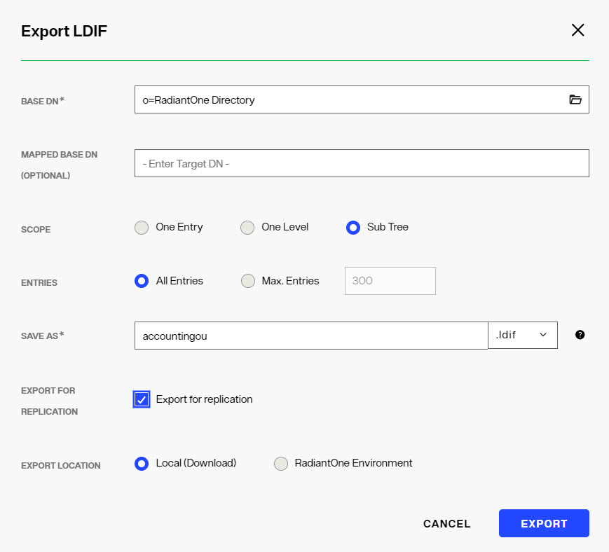
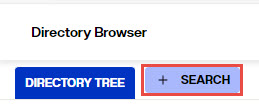

## Overview

Topics related to managing directory stores include the following:
- How to intialize directory stores from LDIF files.
- How to manually manage entries from the Directory Browser.
- How to backup and restore.
- How to reindex.
- How to export directory stores.

## Initializing Directory Stores

Initialization of RadiantOne directory stores on new nodes is done automatically when they are added to the RadiantOne cluster.

Directory stores can be initialized with LDIF files. The Control Panel supports a simplified version of the LDIF file format. For example, it does not support 'changetypes'. 

To import an LDIF file:

1.	On the Control Panel > Setup > Directory Namespace > Namespace Design, select the node where the directory store is mounted below Root Naming Contexts.
1.	On the Properties tab, click:  
1.	Choose to either *Upload file* and browse to the file, or *Select file on the server* to display a list of files to choose from.
1.	Click **OK**.

	 >[!warning] If using an LDIFZ file, the security key used on the RadiantOne node where the file was exported must be the same security key value used on the RadiantOne node that you are trying to import the file into. For steps on defining key generation or changing the encryption security key, see the [Attribute Encryption](/security/attribute-encryption).
1.	The initialization process is performed as a task. The Tasks Monitor window displays at the bottom of the screen. Click **DISMISS** to exit the window. To view the task details, you can click **MANAGE TASKS**, or you can click **VIEW LOG** and then select the LOGS tab, which is helpful in case there are errors.


If you have a large data set and generated multiple LDIF files for the purpose of initializing the local store (each containing a subset of what you want to store), name the files with a suffix of “_2”, “_3”…etc. For example, let’s say the initial LDIF file (containing the first subset of data you want to import) is named init.ldif. After this file has been imported, the process tries to find init_2.ldif, then init_3.ldif…etc. Make sure all files are located in the same place so the initialization process can find them.

>[!warning] 
>Deactivate any inter-cluster replication on the RadiantOne directory store prior to re-initializing them. To do so, navigate to the node where the RadiantOne Directory store is mounted from the Control Panel > Setup > Directory Namespace > Namespace Design. On the Properties tab, uncheck “Inter-cluster Replication”, then click **SAVE**. 

### EntryDN

For every entry inserted into a RadiantOne directory store, an entryDN operational attribute is generated. This attribute contains a normalized form of the entry’s DN. This attribute is indexed by default and can be used in search filters. An example of a user entry inserted into a RadiantOne Directory store from the Control Panel > Manage > Directory Browser is shown below. The entryDN attribute that was auto-generated is highlighted.


 
Extensible match filters are supported on entryDN. An example of a search request for the user entry shown above that leverages the entrydn attribute is shown below. The filter used in this example is: (ou:dn:=Users) and is equivalent to requesting entries that have ou=Users somewhere in their entryDN.


 
An example of a more complex filter on entryDN is shown below and is equivalent to requesting entries associated with the objectclass named “person” that have ou=Accounting or ou=Management somewhere in their entryDN: <br>
`(&(objectclass=person)(|(ou:dn:=accounting)(ou:dn:=Management)))`

### Universally Unique Identifier (UUID)

The Universally Unique Identifier (UUID) attribute is a reserved, internal attribute that is assigned to each entry and can guarantee uniqueness across space and time.

When adding entries into a RadiantOne directory store (LDAP ADD operations) from an LDIF file, if there are UUID attributes, they are ignored during import. RadiantOne generates a unique value for each entry based on the specifications in RFC 4122.

When initializing with an LDIF file (LDIF INIT), if the entry has a UUID attribute, RadiantOne keeps it. If the entry does not have a UUID attribute, RadiantOne generates a unique value for each entry based on the specifications in RFC 4122.

UUID is an operational attribute meaning that if a client wants this attribute, they must explicitly ask for it in the search request sent to RadiantOne.

When exporting a RadiantOne directory store to an LDIF file, you have the option to export the UUID attribute or not. The UUID attribute should be exported into LDIF if you plan on using this export to initialize another RadiantOne directory store, a replica for inter-cluster replication. Otherwise, the UUID attribute generally should not be exported. To export a RadiantOne directory store and include the UUID attributes, check the *Export for Replication* option in the export window shown when you click the **EXPORT** button on the Control Panel > Setup > Directory Namespace > Namespace Design > node representing the RadiantOne directory > Properties tab on the right. 


 
If you only need to replicate a sub-branch instead of the whole RadiantOne directory store, you can use the Export option  on the Control Panel > Manage > Directory Browser when you have the sub-branch selected.


 

## Number of Supported Clauses in Search Filters

**NEEDS UPDATED TO INDICATE THE PROPER API REQUEST TO SET THIS INSTEAD OF USING ZK SETTING!!**

By default, the RadiantOne directory supports a maximum of 1024 clauses in search filters. To increase the maximum number of clauses supported, edit the maxClausesLimit property setting in /radiantone/v1/cluster/config/vds_server.conf from the Main Control Panel -> ZooKeeper tab (requires [Expert Mode](01-introduction#expert-mode)). The RadiantOne service does not need to be restarted after modifying this value.

## Exporting Directory Stores

Stores can be exported into an LDIF file from the Control Panel > Setup > Directory Namespace > Namespace Design. 

>[!warning] 
>If exporting to an LDIFZ file, a security key must be configured for RadiantOne. Any target stores where you want to import this LDIFZ file must use the same LDIFZ security key value. For steps on defining key generation or changing the encryption security key, see [LDIF File Encryption](managing-properties).

1.	 From the Control Panel > Setup > Directory Namespace > Namespace Design select the node where the directory store is mounted. 
1.	 On the Properties tab, click . 
1.	 Enter a file name and select an extension type (.ldif or .ldifz). If you want the exported file to be zipped and encrypted, select the .ldifz option from the drop-down list. In order to support exporting to an encrypted file, a security key must be configured for RadiantOne. Any target RadiantOne directory stores where you want to import this LDIFZ file must use the same LDIFZ security key value. For steps on defining key generation or changing the encryption security key, see the [LDIF File Encryption](managing-properties).

	 

1.  If this exported file is going to be used to initialize another RadiantOne directory store for replication, check the option to Export for Replication. Otherwise, leave this option unchecked. All entries in the RadiantOne directory store are exported with this option.
1.	 Click **DOWNLOAD FILE**.

## Rebuilding Indexes

If the Indexed Attributes or Sorted Attributes properties are changed, click the  button on the Properties Tab for the selected RadiantOne directory store. 

Rebuilding an index should not happen very frequently. It is a time-consuming process, and should be performed during a scheduled maintenance window. During the rebuild of the index, the RadiantOne directory store is not accessible. When the indexing is complete, the store is active again and the follower/follower-only nodes (if any) get the data from the leader node to update their local copy.

## Backing up a Directory Store

To back up a RadiantOne directory store, click  on the Properties Tab.

To download a copy of the backed up directory store, click **DOWNLOAD .ZIP**. The compressed file is located in your web browser's default download location. 

## Restoring a Directory Store

To restore a RadiantOne directory store from a previous backed up image, click  on the Properties Tab for the selected store. Select a date associated with the backup point you would like to restore in the default directory, or upload an existing .zip file containing the image to restore. The RadiantOne directory store is deactivated and is inaccessible by clients during the restore operation.

## Interception Scripts

Only a global interception script is supported for RadiantOne directory stores. For details on global interception, see the [Global Interception](/global-settings/global-interception).

## Deleting a Directory Store

To delete a RadiantOne directory store, first de-activate it (uncheck the Active checkbox) and click **SAVE**. Then, click the  button on the Properties Tab for the selected store.

## Managing RadiantOne Directory Entries

On the Control Panel > Manage > Directory Browser you can see the entire directory structure instantiated with the directory entries. There could be nodes for RadiantOne Directory stores, LDAP Proxy views, and any other Root Naming Contexts that have been configured in the Control Panel > Setup > Directory Namespace > Namespace Design. If you do not see your new naming context after navigating to the Directory Browser, click .

### Creating New Entries

>[!warning] 
>The user you are logged into the Control Panel as must have rights to create users.

To create new entries, right-click on the parent location in the tree above where you want the entry created and select New > Entry, inetOrgPerson, Active Directory User, OrganizationalUnit, Group, or Active Directory Group. The sections below describe these default options including the object classes that are used. If you want to create entries using different types of object classes than the ones mentioned here, then choose the New Entry option and select the desired object class from the *Available Object Classes* list. Only object classes available in the RadiantOne LDAP schema are shown here. If the desired object class is not shown, extend the RadiantOne LDAP schema first and then come back to this screen to add your entry. See [Managing the RadiantOne Schema](/managing-directory-schema) for steps on extending the RadiantOne LDAP schema.

>[!warning] 
>Creating/Modifying entries on the Directory Browser tab is not just for RadiantOne Directory stores. If a backend other than a RadiantOne Directory is mounted under the naming context where you are creating/modifying entries, the backend source is modified accordingly. For example, if you are modifying a branch that represents an LDAP backend and you create a new user entry, that operation is sent to the backend (assuming the credentials stored in the connection string/data source to the backend has the appropriate rights to create users).

**New Entry**

To create entries based on an object class other than groupOfUniqueNames, group, organizationalUnit, inetOrgPerson, or user:
1. Choose the New > Entry option. When this option is selected, a list of object classes available in the RadiantOne LDAP schema is shown.
1. Select the object class(es) that the entry should belong to and use the -> to move it to the list on the right.
1. After the object classes are selected, click **NEXT**.
1. Enter the RDN in the space provided, and then enter values for the attributes below.
1. All required attributes should have values. Required attributes associated with all of the selected object classes are noted. For each required attribute, click +ADD VALUE, enter the value for the attribute and click the  inline with the attribute and then click **CONFIRM**.

      

1. To add more non-required attributes, click .
1. Select an attribute from the drop-down list, or manually enter a name.
1. Enter a value for the attribute and click the  inline to apply it.
1. Click **CONFIRM**.
1. To add more values for a multi-valued attribute, click the  inline with the attribute. Enter the additional value and click the  inline to apply it.
1. After all attribute values have been added, click **CREATE** to insert the entry.


**New Group**

When creating a new group, you are able to select from the following list of object classes: group, groupOfNames, groupOfUniqueNames, groupOfUrls. More than one object class may be selected. 

>[!note] 
>If you want the group to be a dynamic group, toggle on the *Dynamic Group* option.


 
1. Enter a Group Name.
2. Enter a description (optional).
3. Toggle the Dynamic Group option on (optional).
4. Select the object class to associate with the group entry.
5. Click **CREATE** to insert the entry.

**New OrganizationalUnit**

If you choose to create a new organizationalUnit, the entry is associated with the organizationalUnit object class. 

**New Active Directory User**

This is only relevant if the underlying source is Active Directory. This is a special template for Active Directory due to the specific attributes that are required to be set during the creation of an account. When creating a new Active Directory user, an SSL connection is required if a password is entered for the account. If you do not want to set a password during the account creation, check the Account is Disabled option.

**New inetOrgPerson**

If you choose to create New > inetOrgPerson, the entry is associated with the inetOrgPerson object class. A list of commonly populated attributes is shown in the input form. To include more, use the click  once the entry is created.

**New Dynamic Object – Entry that has an Expiration**

The RadiantOne Directory supports temporary entries using the dynamicObject auxiliary object class as specified in [RFC 2589](https://www.rfc-editor.org/rfc/rfc2589). These entries are associated with a time to live attribute and once expired, the entry is automatically removed from the directory. The attribute that determines the expiration is named entryTTL and has a value in seconds. The minimum entryTTL value supported is 900 seconds. If there is no value specified for entryTTL when the entry is created, a default of 86400 (24 hours) is used.

Dynamic objects have the following conditions:

-	A static object cannot be turned into a dynamic object (you cannot simply add the dynamicObject object class to an existing entry), and vice versa. The object must be marked as dynamic when it is created.

-	Dynamic objects can be created under static objects but cannot be created under dynamic objects.

-	Dynamic objects that are containers cannot have static child objects.

There is no template in the Control Panel to create Dynamic Objects so it is common to use an LDAP command line utility. Below is an example of an LDIF file that contains a dynamic entry to create followed by an ldapmodify command to create the entry:

```
dn: uid=tempuser2,ou=Sales,o=RadiantOne Directory
changetype: add
objectclass: user
objectclass: dynamicObject
uid: tempuser2
entryTtl: 1000
```

C:\SunResourceKit>ldapmodify -h fidserver -p 2389 -D "cn=directory manager" -w password -f addtempuser2.ldif

The temporary entry can be seen from the Directory Browser in the example below. This entry will exist for 1000 seconds and then be deleted automatically.


 
To update the time-to-live for an entry, you can use the “refresh” extended operation as outlined in [RFC 2589](https://www.rfc-editor.org/rfc/rfc2589). The refresh operation is sent by a client to RadiantOne, to indicate that the dynamic directory entry is still accurate and valuable. The client sends a periodic refresh request and if the server receives the request within the timeout period, the lifetime of the dynamic entry can be extended. Below is an example of using the LDAP extended operation command line utility to change the entryTTL to 900 seconds.

ldapexop -v -h "radiantoneserver" -p 2389 -D"cn=Directory Manager" -w password refresh "uid=tempuser2,ou=Sales,o=RadiantOne Directory" 900

ldap_initialize( ldap://radiantoneserver:2389 )
newttl=900
Result: Success (0)

### Managing Group Entries

Groups stored in a RadiantOne directory may contain members from any branch in the RadiantOne namespace (not just limited to the same directory store where the group is defined). The easiest way to manage group membership is from the Control Panel > Manage > Directory Browser. Select the desired group (use the search if needed) and click: 

**Adding Explicit Members**

To add explicit members, follow the steps below.

1.	Select a group and click the **Manage Group** option on the Directory Browser.

2.	If the group is a dynamic group (contains the groupOfUrls object class), the Manage Group window displays a Dynamic Members tab and an Explicit Members tab. Click the Explicit Members tab. If the group is not a dynamic group, only the Explicit Members tab appears.

3.	On the Explicit Members tab, select either Groups or Users from the Find drop-down menu.
4.	Either enter the Base DN to indicate where to search for members, or click  to browse the RadiantOne namespace to select a location. 

5.	To limit the search criteria, enter a value in the Keywords field before clicking **SEARCH**. If *Users* was selected from the Find menu in the previous step, the value must match a uid, sn, sAMAccountName, or cn value. If *Groups* was selected in the previous step, the value must match the cn value.

The objectclass for the user must be inetOrgPerson, user, person, or organizationalPerson (for the search to return them as a user entry). For groups, the objectclass must be group, groupOfNames or groupOfUniqueNames.

6.	Select the user or group you want to add and click  inline next to the entry. To select all entries returned from the search, click .

7.	Click **SAVE**. 


**Dynamic Members**

Dynamic group members are different than explicit group members because instead of specifying a user DN in the group membership attributes (typically either the member or uniqueMember attributes), you need to specify the LDAP URL containing the filter to find the group members in an attribute named memberURL. The syntax for the memberURL value is as follows:

```
<base_dn>?[attrs]?[sub|one|base]?<filter>
```

-	base_dn is the location in the RadiantOne namespace to start searching from to find the user entries you want to be a member of the group.

-	attrs is optional and here you can provide certain attributes to return about the user entries.

-	the next value is for the scope of the search. This can be either sub (for sub tree search scope), one (for one level search scope), or base (for base level search scope).

-	the final parameter is the filter that should be used to return all members for the group. 

For example, if all users that have departmentNumber=0332 should be members of a group named Sales, the group entry should have the following attributes:

-	objectclass = groupOfURLs (in addition to any other objectclasses for the group --- like group or groupOfUniqueNames…etc. If you only want dynamic members, then groupOfURLs is the only objectclass required). 

-	memberURL = ou=People,ou=Sun,o=vds??one?(departmentNumber=0332)

To add dynamic members in Control Panel > Manage > Directory Browser, follow the steps below.

1.	Select a dyanmic group and click the **Manage Group** option on the Directory Browser

1.	Click the Dynamic Members tab.
	>[!note] The Dynamic Members tab displays only if the group contains the groupOfUrls object class.

1.	Either enter the Base DN to indicate where to search for members, or click  to browse the RadiantOne namespace to select a location.
1.	Select the scope of search needed to find the users. 
1.	Finally, enter the filter that qualifies the users or groups as members of the specific group. 
1.	Click **ADD MEMBERSHIP RULE**. 
1.	Click **SAVE**. 

**Manually Adding Dynamic Members**

An option to manage dynamic group members is to manually add the groupOfUrls objectclass and memberURL to the group entry. Follow the steps below.

1.	Navigate to the group in the Control Panel > Manage > Directory Browser.

2.	With the group entry selected, on the right side, click the  inline with the objectclass attribute.

3.	Enter *groupOfURLs* for the new object class and click the  to confirm.

4.	To add members, with the group selected in the tree, click  on the right side.

5.	In the attribute drop-down list, enter *memberURL*. 

6.	Enter the memberURL using the syntax mentioned above. Click the  to confirm.
7.	Click **CREATE** to add the attribute.

>[!note] 
>Groups stored in a RadiantOne Directory can contain both explicit members and dynamic members. If RadiantOne is the enforcement point for authorization it first checks to see if the user is an explicit member of the group(s). Then, dynamic group membership is evaluated.

If the client application is the enforcement point for authorization, then the logic to perform the extra search to the directory to find the group members (based on the memberUrl value of the group entry) must be implemented in the client application code. If the application does not support LDAP dynamic groups, then RadiantOne can be configured to dynamically build the group membership on-the-fly and make all groups managed by RadiantOne appear to have static (explicit) group members using [Special Attributes Handling](/special-attributes-handling).

**Removing Members**

To remove explicit group members, from the Control Panel > Manage > Directory Browser, select the group entry and click . If the group is a dynamic group that has both explicit and dynamic members, there is a tab to manage *Explicit* members and one to manage *Dynamic* members. If there are no dynamic members, the list of explicit members is displayed. Select the trashcan icon  inline with the member to remove them and click **SAVE**. If there are dynamic members, select the *Dynamic Members* tab and locate the current membership rules. Use the trashcan icon inline with the rule to delete it and click **SAVE**.

>[!note] 
>Only groups that are of object class type groupOfUrls can have dynamic members. If the group you are managing does not have this object class, then the Dynamic Members option is not shown.

**Modifying Group Attributes**

All group attributes that allow modifications can be changed from the Control Panel > Manage > Directory Browser. 

1.	Select the group entry in the tree and then on the right side, click the  icon inline with the attribute you want to update.

2.	Enter the new value.

3.	Click the  icon inline with the attribute to confirm.

To add a value to a multi-valued attribute, click the  inline with the attribute name. Add the value and click the  to confirm.

To delete a value from a multi-valued attribute, select the attribute and click the trashcan icon inline with the value you want to remove. Click **DELETE** to confirm. Note that multi-valued attributes appear collapsed in the attribute list.


Click the ">" to expand the attribute to locate the value to delete. 


### Searching Using Range Retrieval

Searching for multi-valued attributes (generally members) in a group may result in the retrieval of many returned values. To define the range of returned attribute values, use the Range option. This feature can be used with any object class (e.g. group, groupOfUniqueNames) and any attribute (e.g. member, uniqueMember). Both RadiantOne Directory stores and Identity Views stored in persistent cache support range searches. 

An example of how to perform a Range Retrieval search in RadiantOne is described below:

1.	Navigate to the Main Control Panel > Manage > Directory Browser. 
1.	Click the **+SEARCH** button. If you already have other saved searches, the button shows as a **+**.
	
1.	Enter a Name to represent the (saved) search criteria. 
1.	Either enter the Base DN to indicate where to search from, or click  to browse the RadiantOne namespace to select a location. 
1.	Select a scope from the drop-down list. Searches with a lower limit other than 0 must have a scope of “base”. 
1.	In the Return Attributes field, enter your range in the following syntax: `<member> or <uniquemember>;range=<lowerlimit>-<upperlimit>`
	>[!note] For more information on lower and upper limits, see the **Range Limits** and **Examples** sections below.

1.	Click **SAVE**, this runs the query.

**Range Limits**

Range retrieval involves requesting either a limited or unlimited number of attribute values in your search. In the RadiantOne Control Panel’s Directory Browser search function, the range is specified in the Return Attributes field. This section describes the lower and upper range limits. 

*Lower Range Limit*

The range’s lower limit must be expressed as a numerical value and must not exceed the number of members in the group. If the lower limit is greater than 0, the search scope must be “Base”. If the lower limit is greater than 0, and the search scope is “One Level” or “Subtree”, an error occurs. 

*Upper Range Limit*

The upper limit can be expressed by a numerical value, or, to express a limitless upper limit, use the asterisk [*]. If the upper limit is expressed as a numerical value, it must exceed the lower limit. RadiantOne has no server size limit on range retrieval searches. Be aware that searches with large ranges might affect client performance. 

**Range Syntax**

The following table describes syntax for a few example range searches. 

Syntax 	| Description
-|-
range=0-* | Retrieves all attribute values. 
range=1-10	| Retrieves the second through eleventh values. 
range=0-5000 | Retrieves the first through 5001st values. 

**Full-range Search Example**

In the following example, a search is performed on all group member attributes. 

>[!warning] 
>Searches with large ranges may impact client performance.

The Return Attributes value for this example is as follows.

member;range=0-*


Figure 5.23: Full-range Search Example

**Mid-range Search**

This search retrieves the second through eleventh values. The following search parameters are used in this example.

Scope: Base
Return attributes: member;range=1-10


Figure 5.24: Mid-range Search Example

**Large-range Search**

The following search retrieves the first through 5001st values. The Return Attributes value for this example is the following. 

member;range=0-5000


Figure 5.25: Large-range Search Example

### Nested Groups

RadiantOne Directory supports nested groups, where groups can be members of other groups. To enable support for nested groups, navigate to the Control Panel > Manage > Security > Access Controls > General tab. Toggle on the “Enable Nested Groups” and click **SAVE**.
 
**Searching for Group Members using LDAP_MATCHING_RULE_IN_CHAIN**

The following example is used to describe the ability to search group membership for a user that is a member of a nested group.

User Ada Rule (identified with a DN of uid=Ada_Rule,ou=Administration,o=RadiantOne Directory) is a member of a group named WebUsers. The WebUsers group is a member of a group named Intern. The Intern group is a member of a group named AllUsers. Ada is implicitly a member of WebUsers, Intern and AllUsers. To query RadiantOne for a list of all groups Ada is a member of, the following filter leveraging the LDAP_MATCHING_RULE_IN_CHAIN OID can be used:

(uniquemember:1.2.840.113556.1.4.1941:=uid=Ada_Rule,ou=Administration,o=RadiantOne Directory)

An example query using the Control Panel > Manage > Directory Browser is shown below.


 

If a Linked Attribute configuration has been configured for isMemberOf on the naming context, and “Optimize Linked Attribute” is enabled on the RadiantOne Directory store, a filter requesting the ismemberOf attribute using the LDAP_MATCHING_RULE_IN_CHAIN OID is also supported. An example of the Linked Attributes setting is shown below.


An example of the Optimize Linked Attributes setting is shown below.


An example query using the Control Panel > Manage > Directory Browser is shown below.


Figure 5.29: Sample Search Request Leveraging LDAP_MATCHING_RULE_IN_CHAIN

### Managing User Entries

User entries can be managed from the Control Panel > Manage > Directory Browser or any client that issues standard LDAP or SCIM requests to the RadiantOne Restful Web Service (ADAP) interface can also be used to manage accounts.

**Disabling User Accounts**

Disabled accounts are inactive. The user is not able to authenticate (bind) to the directory anymore. To disable an account, add an attribute named nsAccountLock with a value of true to the user entry. To enable the account, set nsAccountLock to false.

1.	Administrators can disable an account from the Control Panel > Manage > Directory Browser. Navigate to the RadiantOne Directory store and select the user entry. On the right side, click **+ADD ATTRIBUTE**.

2.	Type in nsAccountLock for the attribute name.

3.	Enter a value of *true* and click .

 
 
4. Click **CREATE**.

The account is now disabled. If this user tries to authenticate to the directory, the server responds with: [LDAP: error code 53 - Account inactivated. Contact system administrator to activate this account].

**Enabling User Accounts**

If an account is disabled because the nsAccountLock attribute is set to true, simply set the value to false to enable the account.

If an account is locked by the RadiantOne server, due to a password policy violation (e.g. too many invalid login attempts), it can become unlocked by resetting the user’s password. Any user (other than the locked-out user) that has the proper permissions (ACI’s) can reset the user’s password. If the lockout policy has a duration period, the account is automatically unlocked after the duration has passed.

**Modifying Attributes**

Attributes can be updated, added or deleted.

>[!warning] 
>The user you are logged into the Control Panel as must have rights (defined as access controls) to modify users.

*Updating Attributes*

To update attributes:
1. Select the user that you want to update the attributes for in the directory tree.
2. Click the  icon inline with the attribute you want to update.
3. Update the value and click .
4. (Optional) To add a value to a multi-valued attribute, click the  inline with the attribute name.
5. Add the value and click the  to confirm.
6. (Optional) To delete a value from a multi-valued attribute, select the attribute and click the trashcan icon inline with the value you want to remove. Click **DELETE** to confirm. Note that multi-valued attributes appear collapsed in the attribute list. Click the ">" to expand the attribute to locate the value to delete. 

*Adding Attributes*

To add attributes:
1. Select the user in the directory tree.
2. On the right side, click **+ADD ATTRIBUTE**.
3. Enter an attribute name or select the attribute from the drop-down list and provide a value.
4. Click  and then click **CREATE**.

*Modifying RDN*
Changing the RDN of an entry is a special operation. To change the RDN attribute value:
1. Select the user in the directory tree.
2. On the right side, click: .
3. Enter the RDN (name and value) and click **SAVE**.
4. Click **REFRESH ENTRY** to see the updated RDN attribute.


*Deleting Attributes*

To delete attributes:
1. Select the user in the directory tree.
2. On the right side, click the  incon inline with the attribute you want to delete.
3. Click **DELETE** to confirm.

##### Editing Photo Attributes
If an attribute is of binary type, select the attribute and choose Modify Attribute > Edit. This brings up the binary editor. Browse to the new file and click **Confirm**.


 
Figure 5.32: Binary Attribute Editor

*Resetting Passwords*

The RadiantOne Directory uses the *userPassword* attribute to store passwords for user entries associated with the inetOrgPerson object class.
To reset a user’s password:
1. Select the user entry in the directory tree.
2. On the right, click the  icon inline with the userPassword attribute.
3. Enter a new password and click the .  

*Moving Entries*

To move a user entry from one container to another within the same root naming context representing the same backend data source:
1. Select the user entry in the diretory tree.
2. Click the Move Entry () option.
3. Either enter the DN or browse to the location where you want the entry moved to and click **SAVE**.

>[!warning] 
>Entries can only be moved to/from containers below the same naming context representing the same backend data source. In the example shown below, the entry is moved from ou=Management to the ou=Inventory container.


### Setting Access Permissions

For information on setting access permissions, please see: [Access Controls](../security/access-controls)

### Deleting Entries

From the Control Panel > Manage > Directory Browser, select the entry in the directory tree and click ...> Delete.
. 
Click **DELETE** to accept the deletion. If the entry being deleted is a container with child entries, the entire subtree is removed.

### Alias Entries

The RadiantOne Directory supports alias entries as defined in [RFC 4512](https://www.rfc-editor.org/rfc/rfc4512). Alias entries point to/reference another entry in the directory. The attribute containing the location of the target entry (DN) is aliasedObjectName and the object class associated with these entries is alias. When a client requests an alias entry, they can indicate if they want the alias dereferenced or not. The indicators are outlined in the table below.

>[!warning] 
>Dereferencing alias entries is only supported on base-level searches. One-level and subtree searches are not supported at this time.

Flag | RadiantOne Behavior
-|-
derefAliases=0 <br> (equivalent to using -a never in an ldapsearch command) | Never dereferences aliases. <br>This is the default behavior.
derefAliases=1 <br> (equivalent to using -a search in an ldapsearch command) | Dereferences aliases in subordinates of the base object in a search but not in locating the base object of the search.
derefAliases=2 <br> (equivalent to using -a find in an ldapsearch command) | Dereferences the base object in a search, but does not dereference alias entries that are under the base.
derefAliases=3 <br>(equivalent to using -a always in an ldapsearch command)	| Dereferences aliases both in searching and in locating the base object of the search.

The following two entries, described in LDIF format, are used to explain how alias entries work.

dn: uid=Adan_Caudy,ou=Management,o=companydirectory
uid: Adan_Caudy
sn: Caudy
objectclass: inetOrgPerson

dn: uid=President,o=companydirectory
objectclass: alias
objectclass: extensibleobject
uid: President
aliasedobjectname: uid=Adan_Caudy,ou=Management,o=companydirectory

Based on the two entries above, the uid=President entry is an alias for the uid=Adan_Caudy user. The example searches below describe how RadiantOne handles searches on the alias entry.

**Base Search with the Dereferencing Flag set to find**

ldapsearch -p 2389 -h r1fidserver -D "cn=directory manager" -w password -b "uid=president,o=companydirectory" -a find -s base "objectclass=*"

In this example, RadiantOne automatically dereferences the alias entry and returns the entry it points to. In this example, the search dereferences “uid=president,o=companydirectory”, which is an alias entry, and returns uid=Adan_Caudy,ou=Mangement,o=companydirectory as shown below.

version: 1
dn: uid=Adan_Caudy,ou=Management,o=companydirectory
employeeType: Intern
homePhone: +1 008 952 2404
givenName: Adan
entrydn: uid=Adan_Caudy,ou=Management,o=companydirectory
mobile: +1 730 681 9001
modifyTimestamp: 20170823171430.973Z
objectClass: top
objectClass: person
objectClass: organizationalperson
objectClass: inetorgperson
userPassword: {SSHA}yeF7G1Z1sVuCkgQguNMmdkArvIHYLN7Y3MG4tg==
createTimestamp: 20170823171430.973Z
ou: Management
uid: Adan_Caudy
mail: Adan_Caudy@rli.com
cn: Adan Caudy
modifiersName: cn=directory manager
creatorsName: cn=directory manager
employeeNumber: 6937
l: Eureka
sn: Caudy

**Base Search with the Dereferencing Flag set to search**

ldapsearch -p 2389 -h r1fidserver -D "cn=directory manager" -w password -b "uid=president,o=companydirectory" -a search -s base "objectclass=*"

In this example, RadiantOne returns the entry without dereferencing it. The uid=President,o=companydirectory entry is returned.

version: 1
dn: uid=President,o=companydirectory
entrydn: uid=President,o=companydirectory
objectClass: top
objectClass: alias
objectClass: extensibleObject
uid: President
modifyTimestamp: 20180511202649.932Z
modifiersName: cn=directory manager
creatorsName: cn=directory manager
createTimestamp: 20180511202539.737Z
aliasedObjectName: uid=Adan_Caudy,ou=Management,o=companydirectory

**Base Search with the Dereferencing Flag set to always**

ldapsearch -p 2389 -h r1fidserver -D "cn=directory manager" -w password -b "uid=president,o=companydirectory" -a always -s base "objectclass=*"

In this example, RadiantOne automatically dereferences the alias entry and returns the entry it points to. In this example, the search dereferences “uid=president,o=companydirectory”, which is an alias entry, and returns uid=Adan_Caudy,ou=Mangement,o=companydirectory as shown below.

version: 1
dn: uid=Adan_Caudy,ou=Management,o=companydirectory
employeeType: Intern
homePhone: +1 008 952 2404
givenName: Adan
entrydn: uid=Adan_Caudy,ou=Management,o=companydirectory
mobile: +1 730 681 9001
modifyTimestamp: 20170823171430.973Z
objectClass: top
objectClass: person
objectClass: organizationalperson
objectClass: inetorgperson
userPassword: {SSHA}yeF7G1Z1sVuCkgQguNMmdkArvIHYLN7Y3MG4tg==
createTimestamp: 20170823171430.973Z
ou: Management
uid: Adan_Caudy
mail: Adan_Caudy@rli.com
cn: Adan Caudy
modifiersName: cn=directory manager
creatorsName: cn=directory manager
employeeNumber: 6937
l: Eureka
sn: Caudy

### Searching for Number of Subordinates

To search for the number of subordinates an entry contains, use the numSubordinates attribute in your filter. This indicates how many immediate subordinates an entry has. Entries returned when using a search filter of (numSubordinates=0) are leaf entries because they currently have no subordinates/child nodes. You can also leverage “greater than” or “less than” in your filter. A filter of (numSubordinate>=5) would return only entries that have 5 or more subordinates.

Numsubordinates is an operational attribute and is only returned in searches when it is specifically requested. An example search is shown below.


 
Figure 5.35: Sample Search Requesting numSubordinates Attribute

## Detecting Changes in RadiantOne Directory

Changes to entries can be detected based on changelog (listening for change on the cn=changelog naming context) or using the Persistent Search Control.

### Changelog
The changelog is one of the recommended approaches for other processes to detect changes that have happened to RadiantOne entries. 

The Changelog settings can be managed from the Classic Control Panel > Settings Tab > Logs section > Changelog sub-section. 
To switch to Classic Control Panel, use the menu options for the logged in user in the upper right.


If enabled, the change log stores all modifications made to any entry in the RadiantOne namespace including entries that are stored in persistent cache. The contents of the change log can be viewed below the cn=changelog suffix in the directory. This suffix is indicated in the RadiantOne rootDSE changelog attribute. The rootDSE also contains the firstchangenumber and lastchangenumber attributes. This information can be used by clients as a cursor to track changes. Access the rootDSE by querying the RadiantOne service with an empty/blank Base DN.

Each entry in the changelog is comprised of the following attributes:

-	changeNumber – number that uniquely identifies an entry
-	changes – LDIF formatted value that describes the changes made to the entry.
-	changeTime – time of the change.
-	changeType – type of change: add, modify, delete
-	entrydn – DN of the entry that changed.
-	objectClass – all entries are associated with top and changelogEntry object classes.
-	targetContextId – used internally by RadiantOne for isolation per naming context.
-	targetDN - DN of the entry that changed.
-	timestampms –used by RadiantOne internally for changelog isolation per naming context.

For more details on these operational attributes, see: [Operational Attributes](./understanding-operational-attributes)

### Disabling Changelog for Certain Naming Contexts 

Changes to entries in certain naming contexts representing specific RadiantOne Directory stores or local persistent cache, are not applicable to logging into changelog (e.g. cn=replicationjournal, cn=config…etc.). Other naming contexts that represent backend directories (proxy views to these directories) might not require changelog either. Therefore, these naming contexts can have this function disabled. The list of disabled naming contexts is configured from the Classic Control Panel > Settings Tab > Logs section > Changelog sub-section. Uncheck the Changelog box to disable the naming context.

>[!warning] 
>In most cases, this setting should not be touched. Only naming contexts representing RadiantOne Directory stores, persistent cache, or proxy views are shown in the list. Disabling changelog for certain naming contexts should only be done when advised by Radiant Logic.

### Automatic Backup of Changelog

Whenever the RadiantOne service starts, the changelog storage is checked to see if there are enough change numbers left for use (a total of 2 billion numbers are allocated for use). If there is less than 10% of the 2 billion numbers left, the existing records are automatically be rolled over into the corresponding backup storage and the change number will start over at number 1. 

While the RadiantOne service running, once the change log number reaches 90% capacity (90% of the allocated 2 billion numbers are used), the following warning message will appear in the RadiantOne log "!!! 90% change numbers have been used! The VDS should be restarted to prevent any possible exhaust of change number and loss of change records." When this message appears, the RadiantOne service should be restarted. If it is not restarted and the entire 2 billion allocated numbers are used, changes are no longer logged into the changelog.

### Excluded Change Log Attributes

When entries are changed, the change log reports the attributes under its "changes" attribute. This may pose a security risk if sensitive attributes have been changed, and the change log is searchable by outside applications such as sync connectors. To eliminate this risk, the Excluded Change Log Attributes option allows you to exclude selected attributes from members of the “ChangelogAllowedAttributesOnly” group. Though these attributes are logged in the change log, they are not returned for these group members when performing a search on the change log. 

To exclude attributes in changelog searches:

1.	In the Control Panel > Manage > Directory Browser expand cn=config and ou=groups. 

2.	Select cn=ChangelogAllowedAttributesOnly. 

3.	Add users and/or groups that you do not want to have access to the “changes” attribute for certain attributes.  

5.	On the Zookeeper tab, expand `radiantone/<version>/<clustername>/config`. 

6.	Select vds_server.conf. 

7.	In the pane on the right, find changelogExcludedAttributes. 

8.	Click **Edit Mode**. 

9.	In the brackets, enter attributes to be excluded in a comma-separated list. Wrap each attribute in double quotes. For example:

```
["mail", "l", "homePhone"],
```

10.	Click **Save**. 

11.	Click **OK** to close the Save Node button. 

When a member of the group searches the changelog, the specified attributes are not included in the “changes” attribute. An example is shown below that compares 
 a search with no excluded attributes (left) and one with attributes excluded (right). 


### Changelog and Replication Journal Max Age

For the RadiantOne service to maintain efficiency and performance (as well as save disk space), you should set a maximum age for changelog entries. The maximum age parameter specifies the number of days an entry stays in storage for the following event stores.
-	cn=changelog
-	cn=cacherefreshlog
-	cn=replicationjournal

  >[!note] 
  >Maximum age also applies to the vdsSyncHist attribute maintained at the level of entries involved in inter-cluster replication. This attribute is multi-valued and continues to grow until the RadiantOne service scans the values and removes ones that are older than the maximum age. RadiantOne scans the values only when the entry is modified. For entries that aren’t updated often, vdsSyncHist will potentially contain values that are older than the maximum age.
-	cn=localjournal
-	cn=tombstone
-	stores below cn=queue 
-	stores below cn=dlqueue

Records older than the maximum age are deleted automatically. Old change log numbers (from deleted records) do not get re-used.

This parameter is set in the Classic Control Panel > Settings Tab > Logs section > Changelog sub-section. The default value is 3 days which means records are automatically deleted after 3 days.

### Persistent Search Control
Using the Persistent Search Control is one of the recommended approaches for other processes to detect changes that have happened to RadiantOne entries. 

This control can be enabled/disabled from the Control Panel > Global Settings > Client Protocols > LDAP. Enable the Persistent Search option and click **SAVE**. Restart the RadiantOne service on all nodes.

If you enable the persistent search control, an LDAP client can receive notifications of changes that occur in the RadiantOne namespace. When a persistent search is requested, RadiantOne keeps the search operation going so clients can receive changed entries (and additional information about the changes that occurred). 

>[!note] 
>The changelog number associated with the changed entries (logged into cn=changelog) is also returned in the persistent search response.

