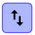
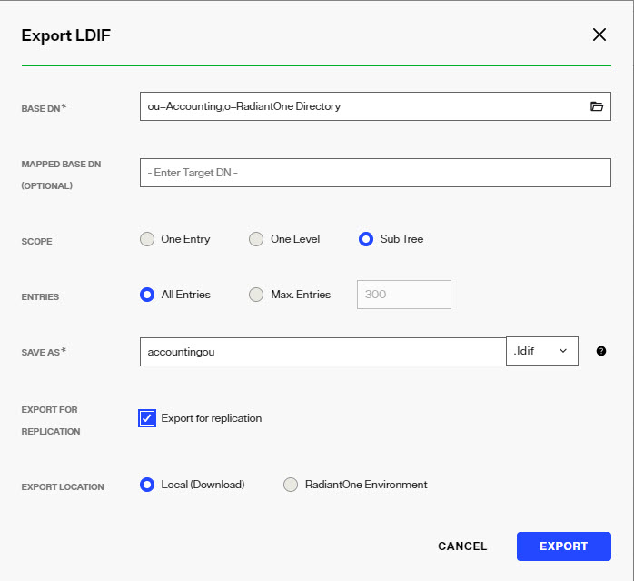

## Overview

The settings described below appear on the Properties tab for the selected Directory store in the Control Panel > Setup > Directory Namespace > Namespace Design.

## Naming Context
The external suffix used by clients to access this branch in the RadiantOne namespace. 

## Schema Checking

Toggle on the **Enable Schema Checking** option if you want Schema Checking enabled.

Enabling schema checking means whenever entries or attributes are added or modified for this naming context, RadiantOne Directory checks them to ensure that:

-	Object classes and attributes in the entry are defined in the directory schema 

-	Attributes required for an object class are contained in the entry 

-	Only attributes allowed by the object class are contained in the entry 

Schema checking occurs when populating the directory from the Control Panel > Manage > Directory Browser, or when using an LDIF file. Schema checking does not enforce the validity of values against their syntax.

## Add Superior Objectclasses

This option is to dictate whether, when creating an entry or adding an 'objectClass' value to an entry, all superclasses of the named classes will be implicitly added as well if not already present. By default, this option is not enabled. This means that when an entry is created, or an objectclass value is added to an existing entry, only the object classes explicitly listed in the request are included in the final objectclass attribute value. If this option in enabled, RadiantOne automatically adds associated superclasses (based on the LDAP schema definition) to the final objectclass attribute value if they are not already present. Toggle on the **Add Superior Objectclasses** option if you want to enable this behavior.

## Normalize Attribute Names

This option is for determining the case that is used for attribute names of an entry. If this option is enabled, all attribute names entered during an insert of an entry conform to the same case as defined in the RadiantOne LDAP schema. The attribute name is stored in the same case as defined in the schema. If the attribute is not defined in the RadiantOne LDAP schema then the attribute name is stored as all lower case. Toggle on the **Normalize Attribute Names** option if you want to enable this behavior.

If this option is not enabled, then the attributes are stored in the entry with the same case as used in the insert request.

This option is to improve the performance of initializing the local store when possible. If the attribute names are not normalized, the import of user entries is faster.

## Indexed Attributes

This property lists the attributes that should be indexed. Attributes in this list support client search filters that use presence, equality, approximate, substring, matching rule, and browsing indexes. By default, all attributes are indexed (except for binary attributes and a few “internal” attributes defined in the Non Indexed Attributes property). If the Indexed Attributes setting is empty, this means all attributes are indexed. If you do not want all attributes indexed, define a list of attributes to index in this setting by entering the attribute name and pressing the "Enter" key on your keyboard after each. If you indicate a list of attributes and later add attributes to index, you must remember to re-build the index. To do so, select the naming context on Control Panel > Setup > Directory Namespace > Namespace Design and on the Properties tab on the right side, click **RE-BUILD INDEX**. 

>[!note] 
>Although the underlying Lucene engine enforces a size limit of 32K characters for indexed attributes, we generally advise not indexing attributes containing more than 4K characters. To ignore these attributes, add them to the Non-indexed Attributes list and Re-build the Index (click Re-build Index). Using OR conditions in filters containing non-indexed attributes is strongly discouraged since it requires a full scan and all entries fetched from disk.

## Non Indexed Attributes

If the Indexed Attributes list is empty, all attributes (except binary ones and the description attribute) are indexed by default. Also, the following *internal* ones are not indexed either: “pwdLastLogonTime”, "creatorsName", "createTimestamp", "modifiersName", "modifyTimestamp", "cacheCreatorsName", "cacheCreateTimestamp", "cacheModifiersName", "cacheModifyTimestamp", "uuid", "vdsSyncState", "vdsSyncHist", "ds-sync-generation-id", "ds-sync-state", "ds-sync-hist", "vdsSyncCursor", "entryUUID", "userpassword”. Any additional attributes that you do not want indexed should be added to the Non-Indexed Attributes list on the Properties tab for the selected RadiantOne Directory store. Define a list of attributes in this setting by entering the attribute name and pressing the "Enter" key on your keyboard after each. This parameter is an alternative to listing all the attributes you want to index in the Indexed Attributes parameter.

If you change the non indexed attributes, you must re-build the index. You can do this from the Properties tab by clicking **RE-BUILD INDEX**.

>[!warning] 
>If possible, add attributes that must be modified frequently to the non-indexed attribute list to improve update performance of the RadiantOne Directory. Attributes that don’t need to be used in searches are good candidates for the non-indexed attribute list. Limit the number of configured non-indexed attributes to further improve update performance.

## Sorted Attributes

Defined on the Properties Tab for the selected RadiantOne Directory, this is a list of attributes to be used in association with Virtual List Views (VLV) or sort control configured for RadiantOne. Define a list of attributes to sort in this setting by entering the attribute name and pressing the "Enter" key on your keyboard after each. These sorted indexes are managed internally in the store and kept optimized for sorting. They are required if you need to sort the search result or to execute a VLV query on the RadiantOne Directory.

If you need to support VLV, the VLV/Sort control must be enabled in RadiantOne. You can enable this from Control Panel > Global Settings > Client Protocols > LDAP. Toggle the VLV/Sort control on in the Supported Controls section and click **SAVE**.

If you change the sorted attributes, re-build the index. You can do this from the Properties tab by clicking **RE-BUILD INDEX**.

## Encrypted Attributes for Data at Rest

Attribute encryption protects sensitive data while it is stored in the RadiantOne Directory. You can specify that certain attributes of an entry are stored in an encrypted format. This prevents data from being readable while stored, in any temporary replication stores/attributes (cn=changelog, cn=replicationjournal, cn=localjournal), in backup files, and exported in LDIF files (must use the LDIFZ file extension). Attribute values are encrypted before they are stored in the RadiantOne Directory, and decrypted before being returned to the client, as long as the client is authorized to read the attribute (based on ACLs defined in RadiantOne), is connected to RadiantOne via SSL, and is not a member of the special restricted group (e.g. cn=ClearAttributesOnly,cn=globalgroups,cn=config). 

>[!warning] 
>Define a security encryption key from the Control Panel > Manage > Security > Attribute Encryption prior to configuring encrypted attributes. For steps on defining key generation, changing the encryption security key, or using an HSM like Amazon Web Services KMS as the master security key storage, see the [Attribute Encryption](/documentation/configuration/security/attribute-encryption).

Defined on the Properties Tab for the selected RadiantOne Directory, this is a list of attributes to store encrypted. Define a list of attributes to encrypt in this setting by entering the attribute name and pressing the "Enter" key on your keyboard after each. Attributes listed in the Encrypted Attributes property are added to the Non-indexed attribute list by default. This means these attributes are not searchable by default. Indexing encrypted attributes is generally not advised as the index itself is less secure than the attribute stored in RadiantOne Directory, because the index is not salted. However, if you must be able to search on the encrypted attribute value, it must be indexed. Only “exact match/equality” index is supported for encrypted attributes. To make an encrypted attribute searchable, remove the attribute from the list of nonindexed attributes, save the configuration and then click **RE-BUILD INDEX**.

>[!warning] 
>To prevent the sensitive attribute values from being logged in clear in RadiantOne logs, make sure you add them to the Attributes Not Displayed in Logs property on the Classic Control Panel > Settings tab > Server Front End > Attributes Handling. Each attribute name should be separated with a single space. Any attribute indicated here has a value of ***** printed in the RadiantOne logs instead of the value in clear.

### Clear Attributes Only Group

To apply a deny-by-exception policy to encrypted attributes, you can add users to the ClearAttributesOnly group. Members of this group cannot get encrypted attributes in clear, even if ACLs dictate they can read the encrypted attribute(s) and they are connecting to RadiantOne via SSL.

The table below summarizes the behavior of this special group when a user is connected to RadiantOne via SSL.

Is user a member of the special group?	| Attributes In DIT	| Values in “changes” attribute In Changelog
-|-|-
No		| Clear text	| Clear text
Yes		| Not displayed	| Encrypted

To add a user to the Clear Attributes Only group:

1.	Navigate to the Control Panel > Manage > Directory Browser.

2.	Expand the cn=config naming context and then expand ou=globalgroups.

3.	Select cn=ClearAttributesOnly.

4.	On the right, click: 

5.	From here you can add users to the group.

>[!note] 
>To change the default group, on the Classic Control Panel, go to the Zookeeper tab (requires Expert Mode and Directory Administrator role). Expand radiantone > `<version>` > `<clustername>` > config and select vds_server.conf. Modify the value for "encryptedAttributeBlacklistGroupDn" to the full DN that points to the group entry to which the exclusion behavior should apply.

### Updating Encrypted Attributes

In order to update encrypted attributes, the client must connect to RadiantOne via SSL, be authorized (via ACLs) to read and update the attribute, and not be a member of the special restricted group (e.g. cn=ClearAttributesOnly,cn=Global Groups,cn=config) described above.  When editing entries from the  Control Panel > Manage > Directory Browser > selected RadiantOne Directory store, encrypted attributes appear as encrypted because this operation is not connected to RadiantOne via SSL. If you are connected to the Control Panel via SSL, then the Directory Browser tab connects to the RadiantOne service via SSL and the attributes defined as encrypted are shown in clear as long as the user you’ve connected to the Control Panel is authorized to read those attributes. In this case, the connected user can also update the encrypted attribute if permissions allow for it. 

### Removing Attribute Encryption

If you need to remove attribute encryption, follow the steps below.

1.	Go to the Control Panel > Setup > Directory Namespace > Namespace Design.

2.	Select the naming context representing the RadiantOne Directory.

3.	On the right, remove all values from the encrypted attributes list by clicking on the little *x* by the attribute name.

4.	Click **SAVE**.

5.	Click **RE-BUILD INDEX**.

## Support for Full Text Search

RadiantOne Directory can support full text searches. This offers additional flexibility for clients as they can search data based on text (character) data. These types of searches are no longer linked to specific attributes as the characters requested could be found in any attribute value. An entry is returned by RadiantOne if any attribute in the entry contains the character string(s) requested by the client.

Clients issue full text searches similar to the way they issue LDAP searches. The only difference is the filter contains (fulltext=`<value>`) where `<value>` would be the text they are interested in. As an example, if a client was interested in the text John Doe as an exact phrase, the search filter sent to RadiantOne would be (fulltext= “John Doe”) where the phrase is encapsulated in double quotes. If the phrase in the filter is not encapsulated in double quotes it means the client wants any entries that have at least one attribute that contains the character string John and one attribute that contains the character string Doe.

The part of the filter that contains the piece related to the full text search can also be combined with other “standard” LDAP operators. As an example, a filter could be something like (&(uid=sjones)(fulltext=”John Doe”)). This would return entries that contain a uid attribute with the value sjones AND any other attribute that contains the exact character string John Doe.

Below are two examples of LDAP filters leveraging the NEAR operator in full text searches: 

Example Filter 1: (fulltext~="A B") 

RadiantOne returns all the entries with A before B and A near B: 

The examples below show different possible values for an attribute and whether they would match the fulltext filter: 

"A Z B C D" (matches the filter) 

"A Z C D B" (doesn't match the filter, A not near enough to B) 

"B Z A C D" (doesn't match the filter, A is after B) 

Example Filter 2: (fulltext~=A B) 

RadiantOne returns all the entries containing an attribute value with A near B. 

The examples below show different possible values for an attribute and whether they would match the fulltext filter: 

"A Z B C D" (matches the filter) 

"A Z C D B" (doesn't match the filter, A not near enough to B) 

"B Z A C D" (matches the filter) 

When using the NEAR operator, the indicated texts must be in the same attribute value. 

When you search for A NEAR B, RadiantOne looks at all the entries with an attribute value containing A and B where B and A have a maximum of 2 words in between.

If you want to support full text searches, toggle the Full-Text Search option on the Properties tab for the selected RadiantOne Directory and click **SAVE**. Click **RE-BUILD INDEX**.

## Active

Toggle the Active option on if you want to activate this naming context. Toggle the Active option off to deactivate the naming context. Only active naming contexts are accessible in RadiantOne and returned when querying the rootDSE.

## Optimize Linked Attribute

Linked attributes are attributes that allow relationships between objects. A typical example would be isMemberOf/uniqueMember for user/groups objects. A group has members (uniqueMember attribute) which is the forward link relationship. Those members have an isMemberOf attribute which is the back link (to the group entry) relationship. Other examples of linked attributes are:

manager/directReports
 altRecipient/altRecipientBL
 dLMemRejectPerms/dLMemRejectPermsBL
 dLMemSubmitPerms/dLMemSubmitPermsBL
 msExchArchiveDatabaseLink/msExchArchiveDatabaseLinkBL
 msExchDelegateListLink/msExchDelegateListBL
 publicDelegates/publicDelegatesBL
 owner/ownerBL

The most common back link/forward link relationship is between group and user objects. A list of groups a user is a member of can be automatically calculated by RadiantOne and returned in the membership attribute of the user entry. The default attribute name in the user entry for the group membership is isMemberOf. However, you can configure any attribute name (e.g. memberOf) you want. This is configured on the Control Panel > Setup > Directory Namespace > Namespace Design. Select the Root Naming Context where you want the Linked Attributes to be configured and click the **SPECIAL ATTRIBUTES** tab. Define the configuration in the Linked Attribute section.

>[!note] 
>When the Optimize Linked Attribute setting is enabled, the backlink attribute is always returned to clients even when not requested unless Hide Operational Attributes is enabled in RadiantOne (in which case isMemberOf is only returned when a client explicitly requests it). The Hide Operational Attributes is configured from Classic Control Panel > Settings tab > Server Front End > Attributes Handling.

If the back link attribute location and forward link attribute location in the Linked Attributes setting is a RadiantOne Directory, the computation of the references can be optimized in order to return client requests for the back link attribute(s) at high speed. To enable this optimization, follow the steps below.

It is assumed you have configured the Linked Attribute Special Attributes Handling. If you have not, please do so prior to continuing with the steps below.

1.	Select the Optimize Linked Attribute option on the Properties tab for the selected RadiantOne Directory on the Control Panel > Setup > Directory Namespace > Namespace Design.
2.	Click **SAVE**.
3.	Click **RE-BUILD INDEX**.

>[!warning] 
>If your users and groups are in a RadiantOne Directory, and you enable the Optimize Linked Attribute setting, and must support nested groups, only one Target Base DN location and Source Base DN location per RadiantOne Directory store is supported. For example, in the Linked Attribute Special Attribute Handling, having a Target Base DN location configured for ou=people1,dc=myhdap and ou=people2,dc=myhdap (both in the same dc=myhdap store) is not supported. In this case, you should configure a single location as dc=myhdap as a shared parent for both containers.

### Enable Changelog

When Optimize Linked Attributes is enabled, the Enable Changelog option is available. Check this option if you want the RadiantOne service to publish changes to the back link attribute into the cn=changelog. By default, the RadiantOne service doesn’t publish changes to operational back link attributes like isMemberOf into the cn=changelog. 

This option should only be enabled if downstream applications are leveraging the changelog to detect changes in the RadiantOne service and need access to entries that have had their back link attribute (e.g. memberOf, isMemberOf) updated by RadiantOne. If this option is not enabled, and the back link attribute is the only change on an entry, it is not published into cn=changelog.

The most common linked objects are groups and users. Use caution when enabling this option because modifications that add or update dynamic (memberURL attribute) or static group members can result in changing memberOf/isMemberOf for many users, causing many time-consuming writes into the changelog. Also, all RadiantOne changelog connectors (e.g. Sync connectors and/or persistent cache refresh connectors), and downstream applications leveraging the changelog for capturing changes, will have to process many potentially irrelevant changes. Enabling this option forces the RadiantOne service to update the linked entries (e.g. groups and users) asynchronously, allowing the client that issued the group modification request to get a response immediately after the group membership is updated without waiting for the backlink attribute in all related objects to be updated. This can avoid a modification timeout getting returned to the client that issued the modify request, but can result in transactional integrity because all related objects haven’t necessarily been updated when the modify response is returned. For example, if a client application queries a user entry to get isMemberOf during this period (could be as much as a few seconds), there is a risk that they receive outdated information because the backlink attribute hasn’t been updated yet. Also, the asynchronous processing results in higher CPU usage on the RadiantOne node while it is processing the modifications on objects containing the forward link and back link attributes, which could trigger monitoring alerts if configured thresholds are reached. 

### Async Indexing

When Optimize Linked Attributes is enabled, the Aysnc Indexing option is available to be used in conjunction with the Enable Changelog option, or on its own. 

Enabling this option forces the RadiantOne service to update the linked entries (most commonly, groups and users) asynchronously, allowing the client that issued the group modification request to get a response immediately after the group membership (object containing the forward link attribute) is updated without waiting for the back link attribute in all related objects to be updated. This can avoid a modification timeout getting returned to the client that issued the modify request, but can result in transactional integrity because all related objects haven’t necessarily been updated when the modify response is returned. For example, if a client application queries a user entry to get isMemberOf during this period (could be as much as a few seconds), there is a risk that they receive outdated information because the back link attribute hasn’t been updated yet. Also, the asynchronous processing results in higher CPU usage on the RadiantOne node while it is processing the modifications on objects containing the forward link and back link attributes, which could trigger monitoring alerts if configured thresholds are reached. 

If async indexing is not used, all objects containing either a forward link or back link attribute are updated before the modify response is returned to the client. If the modification request results in many objects getting updated, this can be time-consuming and the client may receive a timeout error.

>[!note] 
>For persistent cached branches, you should only consider enabling this option if client applications issue modification requests to the RadiantOne service for the cached branch. If the data is only modified directly on the backend, and this is the event that triggers the persistent cache refresh, async indexing is irrelevant and not used.

## Inter-Cluster Replication
Inter Cluster replication in RadiantOne leverages a publish-and-subscribe architecture. The leader nodes within each cluster play the role of a master in the multi-master replication. Each leader node publishes their changes in the common replication journal. Each leader node is also responsible for periodically checking the journal for changes that they need to apply locally. The default checking interval is 7 seconds. Should conflicting change events occur, a combination of timestamps and sequence numbers associated with the conflicting events are used to resolve the conflict.

>[!note] 
>On startup, a RadiantOne node first applies any missed change events from the replication journal. After these changes have been applied it is able to serve as an active node in the cluster.

A data source named replicationjournal is included with RadiantOne and plays the role of the journal. This data source points to the default cn=replicationjournal naming context installed with RadiantOne and should not be deleted or deactivated. You can decide to have the journal running on one of the clusters that is participating in replication, or run a separate cluster whose only role is to house the central journal. Having the journal housed in a RadiantOne Directory store deployed in a cluster ensures high availability of this repository. The replicationjournal data source should indicate a primary server/node in the cluster and the failover servers should point to the other cluster nodes.

 
To configure inter-cluster replication, follow the steps below.

1.	The replicationjournal data source for all clusters must be configured to point to the same journal. For example, if there are three clusters (1, 2, and 3) and cluster 1 is where the journal is located, the replicationjournal data source in clusters 2 and 3 must point to the cn=replicationjournal naming context in Cluster 1. All nodes running in Cluster 1 should be defined in the data source: one of them as the primary server and the others as failover.
	
	>[!note] All clusters that participate in the inter cluster replication topology must have unique cluster names to be uniquely identified.

1.	To modify the replicationjournal data source in clusters 2 and 3, access the Control Panel of that cluster/environment as a user that is authorized to manage data sources. From the Control Panel > Setup > Data Catalog > Data Sources, click on the replicationjournal data source. Modify the host and port in the *Connection* section to point to the replicationjournal running in cluster 1. The base DN should be cn=replicationjournal (this will be the default if the setting is empty). All nodes running in the cluster housing the journal should be defined in the data source: one of them as the primary server and the others as failover. Edit the Failover LDAP Servers section in the data source.
	>[!warning] Make sure the port used in the replicationjournal settings can be accessed from all clusters and that firewall rules do not prevent the cluster from reading and writing into the central journal.

1.	The same naming context and RadiantOne Directory store to be replicated must be configured in each cluster/environment. To create a new RadiantOne Directory store, go to the Control Panel > Setup > Directory Namespace > Namespace Design and click: 

1.	Enter the new naming context (e.g. dc=replication) and click **CONFIRM**. 
1.	Select the naming context and click: .
1.	Choose the RadiantOne Directory option and click **SELECT**.
1.	Click **MOUNT**.
1.	Repeat these steps on one node within each cluster/environment.
1.	Before enabling replication, all replicas must have the same initial image: either an empty store or an initialized store. 
1.	To initialize a store, go to Control Panel > Setup > Directory Namespace > Namespace Design for one of the clusters/environments. Select the naming context representing the RadiantOne Directory store. 
1.	In the properties tab on the right, click on the **INITIALIZE** button and choose a location for the LDIF to initialize your store with. 
1.	Click **OK** and the initialization is launched as a Task which can be viewed from the Control Panel > Manage > Tasks. Once the task completes, the store is initialized. 
1.	(Optional) If you want to exclude certain attributes from replication, click **EDIT** next to the *Replication Excluded Attributes* property. If inter-cluster replication is configured, click the option to "pause" it prior to changing the excluded attributes list. With inter-cluster replication paused, enter the attribute name(s) and press "Enter" on the keyboard after each. Click **SAVE CHANGES** after all excluded attribute names have been entered. Then, click **EXPORT** on the PROPERTIES tab to generate an LDIF file (make sure you have “Export for Replication” enabled), that excludes these attributes. This LDIF file can be used to initialize replicas in other clusters. 
1.	After the RadiantOne Directory stores are initialized in each cluster, inter-cluster replication must be enabled. 
1.	To enable inter-cluster replication for a specific RadiantOne Directory store, go to the Control Panel > Setup > Directory Namespace > Namespace Design and select the RadiantOne Directory store below the Root Naming Contexts section. 
1.	On the Properties tab on the right, check the box for Inter-cluster Replication as shown in the screen below.
1.	Click **SAVE**.
 

### Fractional Replication

With fractional replication, you can indicate that certain attributes should be excluded from replication. This allows you to control which data is distributed and reduce the replication bandwidth by excluding attributes like photo, jpegPhoto and audio.

Fractional replication can be enabled per RadiantOne Directory naming context by indicating a list of attributes to exclude from replication in the *Replication Excluded Attributes* list. This property is available on the PROPERTIES tab of a selected store naming context. Click the **EDIT** button next to the property to configure the list of attributes. You must configure this excluded attribute list (same list of attributes) in every cluster participating in inter-cluster replication. Therefore, you should plan and configure the excluded attributes list prior to starting inter-cluster replication. 

 
When you export the store on the main cluster, make sure the “Export for Replication” checkbox is enabled. This ensures the excluded attributes are not included in the exported LDIF file and will not be included when the replicas are initialized. Click the **DOWNLOAD FILE** option to use this file to initialize other replicas.

### Changing Excluded Attributes

Adding and removing attributes from the *Replication Excluded Attributes* list takes effect immediately after saving the configuration change. To keep all clusters consistent, you should temporarily suspend replication if you need to make changes to the Replication Excluded Attributes list. The steps are outlined below.

1.	From the Control Panel > Manage > Directory Namespace > Namespace Design select the RadiantOne Directory below Root Naming Contexts.
1.	On the PROPERTIES tab on the right, click **EDIT** next to the *Replication Excluded Attributes* property.
1.	Click the link to "pause replication" prior to changing the excluded attributes list.
	
  	
1.	With inter-cluster replication paused, enter the attribute name(s) and press "Enter" on the keyboard after each.
1.	Click **SAVE CHANGES** after all excluded attribute names have been entered.
1.	Repeat these steps for each cluster involved in inter-cluster replication.

### Subtree Replication

With subtree replication, you can indicate which containers/sub-branches should be replicated. To export the sub-branches to initialize replicas, use the Control Panel > Manage > Directory Browser. Select the container/sub-branch that should be replicated and use  to export. Check the option to Export for Replication to ensure the UUID attribute is included in the export. Select Local (download) for the Export Location. Use the downloaded LDIF file on the replica server to initialize the RadiantOne Directory store.

The replication sub-trees must be defined in a comma-separated list in the “replicationSubtreeDomains” property located in ZooKeeper at: /radiantone/<version>/<cluster_name>/config/namings/<root_naming_context>

An example of configuring two sub-trees for replication would be:

“replicationSubtreeDomains” : [“ou=Accounting,o=companydirectory”, “ou=Sales,o=companydirectory”],

### Push Mode Replication

To address a very small subset of use cases, namely where a global load balancer directs client traffic across data centers/sites, where the inter-cluster replication architecture might be too slow, you have the option to enable an additional, more real-time replication mode where changes can be pushed directly to intended targets. For example, an update made by a client to one data center might not be replicated to other data centers in time for the client to immediately read the change, if the read request is sent to a different data center than where the update was. This is depicted in the diagram below.

This is generally not a best practice distribution policy when working with distributed systems. Load balancing is best deployed across multiple nodes within the same site/data center.

In any event, to address scenarios like this, a push replication mode is available to directly send the changes to intended targets. The targets must be other RadiantOne Directory stores. The LDAP data source definition could represent all nodes in the target cluster by indicating one as the primary and the rest of the nodes as failover, or it could point to a load balancer which in turn is configured to distribute requests across the cluster nodes.

Pushing replication events can make the changes available in other data centers faster than waiting for the publish/subscribe method. There are two modes to push events: default and ensured push mode. The default push mode is a broadcast of the changes to the configured targets. There is no waiting for acknowledgement that the targets can be reached prior to returning the modify response to the client. The server that receives the write operation pushes the change to all configured targets, updates its local store, writes the change to the replication journal and responds to the client with a modify response. With the ensured push mode, the server sends the changes to the configured targets and waits for an acknowledgement about whether the target(s) could be reached or not. Enabling this mode provides a certain level of assurance that the target(s) have received the changes without any guarantee that they were actually able to update their replica. However, this can reduce the throughput of the RadiantOne service because it does not respond to the client’s modify request until it gets an acknowledgment from all configured targets. If a target server is not responding with an acknowledgement, the “Write Operation Timeout” configured for LDAP connection pooling indicates at what point RadiantOne should stop waiting for the acknowledgment and update its own image, publish the change to the replication journal and send a modify response back to the client.

>[!note]
>The intended targets receive the changes from the replication journal whether the changes were successfully replicated with push mode.

To enable push mode:
1.	Select the RadiantOne Directory on the Control Panel > Setup > Directory Namespace > Namespace Design.
2.	On the PROPERTIES tab, locate the Replication section.
3.	Click **CONFIGURE PUSH MODE** next to the *INTER-CLUSTER REPLICATION* setting.
4.	Select the LDAP data source configured for the RadiantOne Directory where you want to push replication events to.
5.	(Optional) enable the Ensure Push Mode option if you to wait for acknowledgement of replication events before sending the response back to the client.
6.	Click **OK**.
7.	Click **SAVE**.
