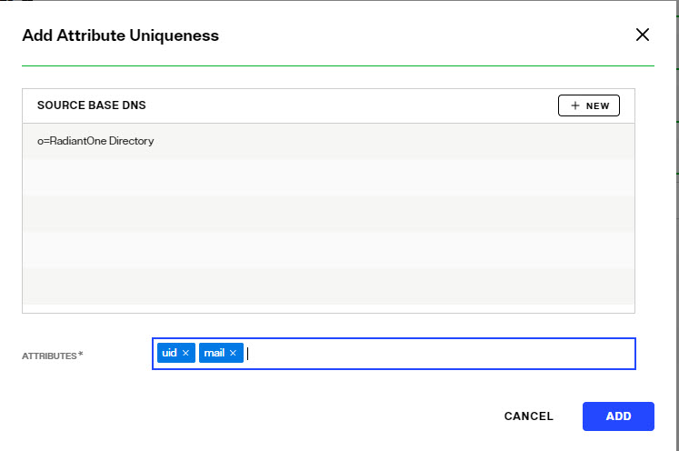

## Overview

The Special Attributes Handling options allow you to perform the following functions: 

-	Configure the automatic relationship management between linked attributes
-	Configure Referential Integrity
-	Configure Dynamic Groups (only applicable to groups that are associated with groupOfURLs object class)
-	Configure Attribute Uniqueness 
-	Configure unnesting of nested groups 

## Attribute Uniqueness
Attribute Uniqueness enforcement is applicable to RadiantOne Directory stores only.

Certain attribute values (e.g. uid) should be unique across a given container or Directory Information Tree (DIT). The server stops any operation that tries to add an entry that contains an existing value for the given attribute. It also stops any operation that adds or modifies the attribute to a value that already exists in the directory.

Attribute uniqueness is not enabled by default. To define which attributes require unique values, follow the steps below.

1.	From the Control Panel > Manage > Directory Namespace > Namespace Design, select the RadiantOne Directory below Root Naming Contexts.
2.	On the right side, click the SPECIAL ATTRIBUTES tab and locate the Attribute Uniqueness section.

3.	In the Attribute Uniqueness section, click **+ATTRIBUTE UNIQUENESS**.
4.	Click **+NEW** and select the Base DN (location of a RadiantOne Directory store) for which attribute uniqueness should be enforced. All entries below this point require unique values for the attributes indicated in the next step.

5.  Click **SELECT**
6.	Enter a list of attribute names that should contain unique values. Press the "Enter" key on the keyboard after each attribute name. In the example shown in the screen below, the attributes uid and mail must be unique across all entries located below o=RadiantOne Directory.

    

7.	Click **SAVE**.

Repeat these steps to configure attribute uniqueness checking for additional containers/branches.

## Linked Attributes
The Linked Attributes setting is only compatible with entries located in RadiantOne Directory stores or persistent cache.

Linked attributes are attributes that allow relationships between objects. A typical example would be isMemberOf/uniqueMember for user/groups objects. A group has members (uniqueMember attribute) which is the forward link relationship. Those members have an isMemberOf attribute which is the back link (to the group entry) relationship. Other examples of linked attributes are:

`manager/directReports`
  `altRecipient/altRecipientBL`
  `dLMemRejectPerms/dLMemRejectPermsBL`
  `dLMemSubmitPerms/dLMemSubmitPermsBL`
  `msExchArchiveDatabaseLink/msExchArchiveDatabaseLinkBL`
  `msExchDelegateListLink/msExchDelegateListBL`
  `publicDelegates/publicDelegatesBL`
  `owner/ownerBL`

The most common back link/forward link relationship is between group and user objects. A list of groups a user is a member of can be automatically calculated by RadiantOne and returned in the membership attribute of the user entry. The default attribute name for the back link attribute is isMemberOf. However, you can configure any attribute name (e.g. memberOf) you want. 

The back link attribute is returned only when explicitly requested by a client unless the back link location and forward link location are stored in a RadiantOne Directory store or Persistent Cache and the Optimize Linked Attribute option is enabled, in which case the back link attribute is always returned even when not requested (unless [Hide Operational Attributes](/understanding-operational-attributes) is enabled). Also, if the groups returned in the backlink attribute (isMemberOf/memberOf) can be members of other groups (nested groups) and you want to un-nest/flatten these groups (return all the groups in isMemberOf/memberOf), you must check the option to [Enable Nested Groups](06-security#enable-nested-groups) on the Main Control Panel > Settings tab > Security section > Access Control sub-section. Users can also be members of dynamic groups (indicated in the criteria of the memberURL attribute of the group entry).

To configure rules for linked attributes, following the steps below:

1.	On the Main Control Panel, click Settings > Interception > Special Attributes Handling.

    
 
    Figure 12: Special Attributes Handling

2.	Under the Linked Attributes section, click **Add**. The Configure Mapping window is displayed.

3.	Select a back link attribute name from the drop-down list. If you don’t find the attribute that matches your needs, manually enter the attribute name. This dictates which attribute name RadiantOne returns the back link attribute value as and is generally either memberOf or isMemberOf (for group/user linked attributes).

4.	Click **Choose** next to the Target Base DN field. The Choose your base DN window is displayed.

5.	Select a base DN containing the entries (e.g. users) for which the back link attributes should be managed. In the example below, ou=allprofiles is selected.

    >[!warning] If your users and groups are in RadiantOne Directory stores, and you plan on enabling the Optimize Linked Attribute setting and must support nested groups, only one user location per RadiantOne Directory store is supported. For example, having a user location configured for ou=people1,dc=myhdap and ou=people2,dc=myhdap (both in the same dc=myhdap store) is not supported. In this case, you should configure a single user location as dc=myhdap as a shared parent for both user containers. For information about the Optimize Linked Attribute function for RadiantOne Directory stores, see the Namespace Configuration Guide. For information about the Optimize Linked Attribute function for persistent cache stores, see the [RadiantOne Deployment and Tuning Guide](/deployment-and-tuning-guide/00-preface).

    
 
    Figure 13: Selecting a Location for Users

6.	Click **OK**. You are returned to the Add Linked Attribute Mapping window.

7.	Under Source Base DNs, click **Add**. The Choose your base DN windows is displayed.

8.	Select a base DN containing the entries (e.g. groups) applicable for the objects (containing the forward link) matching what was defined in step 5 above and click **OK**. In the example below, ou=allprofiles is selected.

9.	In the source object class list, verify the list includes the class associated with your entries (e.g. groups). Add any missing object classes.

10.	If the Source Base DNs location is for group objects, and the groups can be nested (contain members that are groups), check the option to Enable Nested Relationships.

11.	Click **OK**. The configuration is displayed in the Linked Attributes section.

    
 
    Figure 14: Linked Attributes Configuration Rules

12.	Click **Save** in the upper right corner.

13.	To view the results of the example used in this section, on the Directory Browser Tab, and expand the ou=allprofiles and then example the ou=ad_sample node.

14.	Select a user under ou=ad_sample (e.g. cn=Aggie_Newcombe) and select Search . The Search window is displayed.

15.	In the Return Attributes field enter ismemberof (assuming this is the back link attribute name configured for returning the groups).

16.	Select the Subtree option for Scope.

17.	Click **Search**. 

18.	In the Directory Tree View pane, click the user value. The results are displayed as shown below.

 
Figure 15: Example of isMemberOf Calculation

The user Aggie Newcombe is currently a member of groups named Global, Inside Sales and Sales as referenced by the values of the isMemberOf attribute returned for her entry. If she were removed from one of these groups, or added to a new group located below ou=allprofiles, her isMemberOf attribute would reflect this automatically.

## Referential Integrity
Referential integrity is the process of automatically maintaining consistent relationships among certain entries. This mechanism ensures that any references to an entry are updated whenever that entry is removed or altered. If it is configured, during every LDAP add, modify, delete, and rename operation, RadiantOne updates all necessary DN references (all other entries that refer to that entry). For example, if you remove a user's entry from the directory, and the user is a member of a group, the server also removes the user from the group. If referential integrity is not enabled, the user remains a member of the group until manually removed. Historically, referential integrity is primarily used to ensure that attributes with a distinguished name syntax (especially group membership attributes like member and uniqueMember) are properly maintained in the event of delete or modify DN operations. For a delete operation, any references to the target entry are removed. For modify DN operations, any references to the target entry are renamed accordingly.

The following referential integrity rules are supported by RadiantOne:

-	Disabled
Referential integrity is not enforced for the specified Base DN.
-	Enabled
Referential integrity applies to the member, uniquemember and manager attributes by default. Add any attribute that is of type DN syntax as needed (comma-separated if you need to list many attributes). Some examples are: owner and managedBy.

If referential integrity is enabled, and you want RadiantOne to ensure any values entered for member/uniquemember, or attribute in this list, references a valid DN in the Directory Information Tree (DIT), check the “Validate User Exists in DIT” checkbox. If this option is selected, and a value does not reference a valid Distinguished Name (DN) that is part of the current DIT, the modify operation will fail. Error code 19 will be returned indicating a referential integrity violation.

Referential integrity is only supported for RadiantOne Directory stores and persistent cache. This means that the users and groups locations configured must point to a RadiantOne Directory store or persistent cache.

>[!warning]
>If you cache entries from a directory backend that maintains referential integrity, and use a native change type for detecting changes for cache refresh (e.g. Changelog, Active Directory, DirSync), you must list all backlink attributes that need refreshed in the cache when a change is detected on the main object. For example, to update the directReports attribute in the persistent cache when a change is detected on a user entry, list the manager attribute in the List of Referential Integrity Attributes property. Some common related attributes typically found in Active Directory are listed below (this list is not exhaustive):  member/memberOf   manager/directReports   owner/ownerBL    altRecipient/altRecipientBL      dLMemRejectPerms/dLMemSubmitPermsBL    publicDelegates/publicDelegatesBL

Referential integrity is not enabled by default. To enable and configure it, following the steps below.

1.	From the Main Control Panel > Settings Tab > Interception section > Special Attributes Handling sub-section, locate the Referential Integrity section on the right side.

2.	Click **Add**.

3.	In the Groups Location section, click **Add**.

4.	Navigate to the container where group entries are located and click **OK**. Referential integrity is enforced for any group below this location. The groups must be in a RadiantOne Directory store or persistent cache.

5.	In the Users Location section, click **Choose** and navigate to the location containing the possible members associated with the groups you defined in the previous step. The users must be in a RadiantOne Directory store or persistent cache. If a user is moved or deleted from this location, all groups referencing this user entry are updated accordingly (the value is updated or deleted). Click **OK**.

6.	Select the applicable referential integrity rule (based on the descriptions above) and click **OK**.

7.	Click **Save** in the top right.

## Dynamic Group
For dynamic groups, the membership is determined by search criteria using an LDAP URL as opposed to being maintained explicitly in a list. For example, suppose that you want a Sales group to contain every employee that has a title of Sales Manager. To do this, you create a dynamic group named Sales associated with the groupOfURLs objectclass. Then, instead of statically assigning member DNs as unique members (in the member or uniqueMember attribute), you define a memberURL attribute that contains the LDAP URL and criteria (seach base, scope and filter) to be used for determining members of the group. 

Dynamic groups are not enabled by default. Therefore, any groups in RadiantOne associated with the groupOfURLs objectclass will have their memberURL returned directly to clients as is. This group could be in a RadiantOne Directory store, or virtualized from some LDAP backend. 

To enable support for dynamic groups, follow the steps below.

1.	From the Main Control Panel > Settings Tab > Interception section > Special Attributes Handling sub-section, locate the Dynamic Groups section on the right side.

2.	Select either member or uniquemember from the Member Attribute drop-down list. This will determine the attribute name that will contain the members of the dynamic groups.

3.	Click **Add**.

4.	Browse to the exact group entry that you like RadiantOne to automatically evaluate members for and click OK. To configure this logic for multiple groups located in the same container, just enter an LDAP URL that encompasses all groups instead of browsing to the exact group entry. E.g. ldap:///cn=config??sub?(objectClass=groupOfURLs) could be used to indicate all dynamic groups located below cn=config. If you are not knowledgeable about LDAP URL syntax, just browse to the container/parent node where all dynamic groups are located and the LDAP URL is automatically calculated for you.

    Below is an example of a dynamic group indicating a memberURL of: ldap:///ou=ad_sample,ou=allprofiles??sub?(&(objectclass=*)(l=San Mateo)) and how this would be configured respectively.

    
 
    Figure 16: Dynamic Group Example

    
 
    Figure 17: Dynamic Group Configuration

5.	Repeat steps 3 and 4 to add all dynamic groups. 

6.	Click **Save** in the top right.

7.	If the group configured in step 4 above is in a proxy view of an LDAP backend (as opposed to located in an HDAP store), you must configure DN Remapping for the memberURL attribute. From the Directory Namespace tab, select the node where the proxy is mounted below the Root Naming Contexts section.

8.	On the Attributes tab on the right side, click **ADD**.

9.	Enter memberURL for the Name and Virtual Name properties.

10.	Check the DN Remapping option.

11.	Click **OK**.

    

    Figure 18: Defining memberURL Attribute for DN Remapping

12.	Click **Save** in the upper right.

For groups defined in this section, RadiantOne automatically evaluates and computes the list of members based on the memberURL attribute indicated in the group. The group named “Dynamic” configured above would be returned by RadiantOne as a virtual static group like shown below (with the member list computed automatically based on the criteria indicated in the memberURL attribute). 

Figure 19: Example - Dynamic Group Translated into Virtual Static Group

>[!note] To avoid returning duplicate entries, when a dynamic group is queried in RadiantOne, if both member and memberURL are requested, the memberURL attribute is not returned.

### Caching Dynamic Groups

If the dynamic groups are from a proxy view of an LDAP backend you can choose to cache the group entries. If the dynamic groups are in a RadiantOne Directory store, you cannot cache them since persistent cache is not applicable for RadiantOne Directory stores. 

The default and recommended behavior of RadiantOne for cached dynamic groups is to only cache the group entry with the memberURL attribute not computed. Based on requests from clients, RadiantOne computes the memberURL to return a static list of members as needed. 

If you require the group members to be cached as static group entries, check the Enable Caching option when you define the Dynamic Group in Special Attributes Handling. Enabling this setting means that the static groups are stored in the persistent cache (members are evaluated and cached in the member attribute) and refreshed as needed with either a periodic refresh or a real-time refresh. If caching is not enabled, the dynamic groups are stored in the cache, and the evaluation of membership to compute the static group is performed when the group is requested. 

>[!note]
>if the location of the dynamic group is already configured for persistent cache when you select to Enable Caching in the dynamic group setting, you must reindex the persistent cache to ensure the group members are also in the cache.

Figure 20: Cache Setting for Group Members

## Unnest Groups
Some directory vendors, like Microsoft Active Directory, support nested groups where groups can be members of other groups. For clients that are unable to process nested groups, RadiantOne can flatten them and return all members in a single response. The unnest groups setting is applicable to proxy views or model-driven views (designed in Context Builder) that have been configured for persistent cache. Flattening nested groups adds processing overhead to RadiantOne, so persistent cache is required for optimal performance, and you must configure the unnest groups setting before initializing the persistent cache. The unnest group setting is not applicable to RadiantOne Directory stores.

>[!note]
>Using a computed attribute in the virtual view to unnest groups is an alternative to using the unnest groups setting. However, the computed attribute approach does not support circular groups (GroupA is a member of GroupB and Group B is a member of GroupA) whereas the unnest groups setting does.

The unnest groups setting is not enabled by default. To define a naming context that contains nested groups that RadiantOne should automatically flatten for client queries, follow the steps below.

1.	From the Main Control Panel > Settings tab > Interception section > Special Attributes Handling sub-section, locate the Unnest Groups section on the right.

2.	Click **Add**.

3.	Click **Add** and select the naming context that contains the nested groups.

4.	Click **OK**.

5.	Click **OK** to close the configuration window.

6.	Click **Save**.

7.	Configure the persistent cache for the virtual view containing the nested groups. For help with configuring persistent cache, see the [RadiantOne Deployment and Tuning Guide](/deployment-and-tuning-guide/00-preface).
