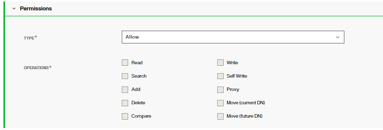

## Overview

Operational Attributes are used for processing within the RadiantOne service and typically are not to be modified by user operations. In the RadiantOne LDAP schema, these attributes have `USAGE directoryOperation`.

An example schema entry is shown below for the createTimestamp attribute.

attributeTypes: ( 2.5.18.1 NAME 'createTimestamp' DESC 'Standard LDAP attribute type' EQUALITY generalizedTimeMatch ORDERING generalizedTimeOrderingMatch SYNTAX 1.3.6.1.4.1.1466.115.121.1.24 SINGLE-VALUE NO-USER-MODIFICATION USAGE directoryOperation X-ORIGIN 'RFC 2252' )

## General Operational Attributes

### vendorversion

An attribute found in the rootDSE (<RLI_HOME>\vds_server\conf\rootdse.ldif) that indicates the RadiantOne version/release. An example would be RadiantOne 7.2. This is only updated with each major release, not each patch release.

### supportedControl

An attribute found in the rootDSE (<RLI_HOME>\vds_server\conf\rootdse.ldif) that indicates the LDAP controls and extensions that RadiantOne supports. Some of the default LDAP controls and features are explicitly mentioned in the roodse.ldif file while some are determined during startup by the RadiantOne service and returned automatically when clients request the rootDSE of the service (an LDAP search request with a empty base DN). The values could be any combination of the following:

-	Subtree Delete Control - 1.2.840.113556.1.4.805

-	Password expired notification control - 2.16.840.1.113730.3.4.4

-	Password expiring notification control - 2.16.840.1.113730.3.4.5

-	Password policy control - 1.3.6.1.4.1.42.2.27.8.5.1

-	Persistent search control - 2.16.840.1.113730.3.4.3

-	Virtual list view request control - 2.16.840.1.113730.3.4.9

-	Proxied authorization (version 2) control, described in RFC 4370 - 2.16.840.1.113730.3.4.18

-	Server-side sort request, described in RFC 2891 - 1.2.840.113556.1.4.473

-	Authorization bind identity response control, described in RFC 3829 - 2.16.840.1.113730.3.4.15

-	Authorization bind identity request control, described in RFC 3829 - 2.16.840.1.113730.3.4.16

-	Who Am I extended operation, described in RFC 4532 - 1.3.6.1.4.1.4203.1.11.3

-	Paged Results Control - 1.2.840.113556.1.4.319

-	Dynamic entries extension, described in RFC 2589  - 1.3.6.1.4.1.1466.101.119.1

-	All Operational Attributes feature, described in RFC 3673 - 1.3.6.1.4.1.4203.1.5.1

-	Absolute True and False Filters as described in RFC 4526 - 1.3.6.1.4.1.4203.1.5.3

### changelog

An attribute found in the rootDSE (<RLI_HOME>\vds_server\conf\rootdse.ldif) that indicates the location in RadiantOne where changes that have occurred in the directory are logged. This allows clients to query this location to learn about these changes. 

### serverType

An attribute found in the rootDSE (<RLI_HOME>\vds_server\conf\rootdse.ldif) that indicates the type of server. For RadiantOne, the value is VDS.

### namingContexts

An attribute found in the rootDSE (<RLI_HOME>\vds_server\conf\rootdse.ldif) that indicates the naming contexts which the server contains. This attribute allows a client to choose suitable base objects for searching when it contacts the server.

### supportedldapversion

An attribute found in the rootDSE (<RLI_HOME>\vds_server\conf\rootdse.ldif) that indicates which protocol version of LDAP RadiantOne supports. It has values of 2 and 3.

### supportedSASLMechanisms

An attribute found in the rootDSE (<RLI_HOME>\vds_server\conf\rootdse.ldif) that indicates the names of the supported SASL mechanisms which RadiantOne supports. The values could be any combination of the following:

 EXTERNAL
 DIGEST-MD5
 GSSAPI
 GSS-SPNEGO

### vendorname

An attribute found in the rootDSE (<RLI_HOME>\vds_server\conf\rootdse.ldif) that indicates the name of the LDAP server implementer. It has a value of Radiant Logic, Inc.

### createTimestamp

This attribute contains the date and time that the entry was initially created.

### creatorsName

This attribute contains the name of the user which created the entry.

### entrydn

For every entry inserted into a RadiantOne Universal Directory (HDAP) store, an entryDN operational attribute is generated. This attribute contains a normalized form of the entry’s DN. This attribute is indexed by default and can be used in search filters.

### nsAccountlock

This attribute shows whether the account is active (value of false or the attribute doesn’t exist for the entry) or inactive (value of true).

### modifiersName 

This attribute contains the name of the user which last modified the entry.

### modifyTimestamp

This attribute contains the date and time that the entry was most recently modified.

### hasSubordinates

To search for entries in a RadiantOne Universal Directory store (or persistent cache) that have child entries, use the hasSubordinates attribute in your filter. The value is either true (for entries that have subordinates) or false (for entries that don’t have subordinates). Entries returned when using a search filter of (hasSubordinates=false) are leaf entries because they currently have no subordinates/child nodes.

### numSubordinates

To search for the number of subordinates an entry in a RadiantOne Universal Directory store contains, use the numSubordinates attribute in your filter. This indicates how many immediate subordinates an entry has. Entries returned when using a search filter of (numSubordinates=0) are leaf entries because they currently have no subordinates/child nodes. You can also leverage “greater than” or “less than” in your filter. A filter of (numSubordinate>=5) would return only entries that have 5 or more subordinates.

### uuid

The Universally Unique Identifier (UUID) attribute is a reserved, internal attribute that is assigned to each entry and can guarantee uniqueness across space and time.

### subschemaSubentry

The value of the subschemaSubentry attribute is the DN of the entry that contains schema information for this entry.

### isMemberOf

isMemberOf is an operational attribute that automatically maintains the relationships between groups and user entries. A user’s group memberships are available in the isMemberOf/memberOf attribute and updated automatically if a user is added or removed from a group. A user can be a member of a nested group, dynamic group, or standard static group. The isMemberOf/memberOf attribute can either be computed dynamically when it is explicitly requested or pre-computed at indexing time of the RadiantOne Universal Directory store if the “Optimize MemberOf” option is enabled. 

## Authorization Enforcement

### aci

A multi-valued attribute that stores information about the configured access controls that RadiantOne uses to enforce authorization to data in the RadiantOne namespace. Each value includes:

-	“target” indicating where to enforce the access control.

-	“targetscope” how many child entries the access control affects. Values could be subtree, base, or one.

-	“targetattr” indicates the list of attributes affected. A value of * indicates all attributes.

-	“version” an internal tracking number used to indicate the version.

-	“acl” indicates a unique name of the access permission.

-	The permission (allow or deny) for which kind of operations: read, compare, add, delete, search, write, proxy, move. These values correspond to the operations defined for the access control. If Read, Search, Add, Delete, Compare, Write, Self Write, Proxy, and Move are enabled, you will see “All” in the value. For example, assuming every operations is selected, you see (all,proxy) in the aci attribute value (this can be seen in the manual edit mode in the Control Panel).

 
-	“groupdn” indicates the subject the access control is applicable for.

    An example value is: (target="ldap:///ou=globalaci,cn=config")(targetscope="subtree")(targetattr="*")(version 3.0; acl "aci7"; allow (read,search,write) groupdn="ldap:///cn=directory administrators,ou=globalgroups,cn=config";)

### acilocation

A single-valued attribute that indicates the location/target DN that an access control is applicable for.

### vdPrivilege

An attribute used by RadiantOne Control Panel to enforce authorization for users associated with the delegated administration groups.

## Password Policy Operational Attributes

### pwdHistory

Stores the previous values used for passwords to prevent users from re-using previous passwords. The number of passwords that are stored is determined by the value set in the pwdInHistory attribute of the Password Policy.

### pwdChangedTime

A Generalized Time attribute containing the time the password was last changed. 

### pwdAccountLockedTime 

A Generalized Time attribute containing the time at which the account was locked. If the account is not locked, this attribute is not present. 

If the maximum consecutive login failures (pwdMaxFailure) have been reached during a certain period of time (pwdFailureCountInterval), the user entry will have the operational attribute of: pwdAccountLockedTime and it will contain the time the account became locked.

### passwordExpWarned

A Generalized Time attribute containing the time at which the password expiration warning was first sent to the client. 

### pwdFailureTime

A multi-valued Generalized Time attribute containing the times of previous consecutive login failures. If the last login was successful, this attribute is not present.

### pwdGraceUseTime 

A multi-valued Generalized Time attribute containing the times of the previous grace logins. 

### pwdPolicySubentry 

An attribute that contains the DN of the password policy associated with the user. RadiantOne does not write to this attribute or allow password policies to be defined on individual users from the Main Control Panel. However, if the entry was imported from another directory, this attribute could have a value that dictates which password policy affects the user. If the value matches a policy defined in RadiantOne, this policy is enforced for the user. If the value does not match a policy defined in RadiantOne it is ignored and other configured policies below cn=Password Policy,cn=config are checked. If multiple policies affect the user, the one with the highest priority (based on precedence level) is enforced.

### pwdReset

A Boolean attribute containing the value TRUE if the password has been reset and must be changed by the user. If a user’s password is set/reset by the RadiantOne super user (e.g. cn=directory manager), a member of the cn=directory administrators group (cn=directory administrators,ou=globalgroups,cn=config), or the user himself, this does not trigger pwdReset set to TRUE. Only when a user’s password is set/reset by other users (e.g. helpdesk) is the pwdReset set to TRUE. When the affected user logs in with the new password for the first time, they are not allowed to perform operations until they reset their password. For example, if the user attempts a search, the RadiantOne service responds with error code 53 and a message indicating “You must change your password before submitting any other requests”. After the user updates their password, pwdReset is removed from their entry.

### pwdLastLogonTime

If the option to “Keep track of the user’s last successful login time” is enabled in the password policy, this attribute stores the time associated with the user’s last successful login/bind.

## Replication Operational Attributes

### timestampms

This attribute indicates the date/time (Unix epoch time format) the entry was added into the “changelog” (“changelog” meaning cn=changelog, cn=replicationjournal, and/or cn=replicationjournal…depending on the context) as opposed to the time the entry (originally) changed. Entries in the cn=changelog, cn=replicationjournal, and cn=localjournal branches contain this attribute. This attribute is used by RadiantOne internally for storage cleanup and changelog isolation per context.

### targetContextID

This attribute is used by RadiantOne internally for storage cleanup and changelog isolation per context.

### targetEntryuuid

UUID of the target entry.

### replicationDomain

The naming context on which the replication topology is established.

### replicationCSN, CSN

Change Sequence Number (CSN) which is a unique number to differentiate change events that have happened within the replication topology.

### replicaIdentifier

The identifier to distinguish each replica within the replication topology.

### changetype

This attribute indicates the type of change associated with the entry. Possible values are add, modify and delete. Entries in the cn=changelog, cn=replicationjournal, and cn=localjournal branches contain this attribute.

### changetime

This attribute indicates the time the entry (originally) changed, as opposed to the exact time it was added into the “changelog” (“changelog” meaning cn=changelog, cn=replicationjournal, and/or cn=replicationjournal…depending on the context). Entries in the cn=changelog, cn=replicationjournal, and cn=localjournal branches contain this attribute.

### changes

This attribute includes details about the changes associated with the entry. Entries in the cn=changelog, cn=replicationjournal, and cn=localjournal branches contain this attribute. The following example is associated with an update to the “l” attribute of an entry:

`replace: l`
 `l: San Francisco`
 `-`
 `replace: modifiersName`
 `modifiersName: cn=directory manager`
 `-`
 `replace: modifyTimestamp`
 `modifyTimestamp: 20180904173203.571Z`
 `-`

### changenumber

This attribute uniquely identifies an entry in the changelog and is automatically incremented by RadiantOne. Changes are automatically removed from the changelog after a configurable amount of days (default is 3). Old change log numbers do not get re-used.

### firstChangeNumber 

This attribute contains the first changelog number. This attribute is part of the rootdse entry (<RLI_HOME>\vds_server\conf\rootdse.ldif). This attribute is also in the cn=changelog entry and cn=replicationjournal entry and is used internally by RadiantOne for cluster consistency and cursor positioning during startup or when switching leadership.

### lastChangeNumber

This attribute contains the last changelog number. This attribute is part of the rootdse entry (<RLI_HOME>\vds_server\conf\rootdse.ldif) and can be used by clients to detect (and keep track of) changes on RadiantOne entries from the changelog. This attribute is also in the cn=changelog entry and cn=replicationjournal entry and is used internally by RadiantOne for cluster consistency and cursor positioning during startup or when switching leadership.

### targetDN

This attribute contains the DN for the entry that changed. This attribute is found in entries logged into both cn=replicationjounal, cn=localjournal, and cn=changelog.  For certain entries, this attribute could also contain details related to replication configuration.

### vdsSyncState

Keeps track of the sync state of replicas within the replication topology.

### vdsSyncCursor

Keeps track of the cursor which is the last record applied on this replica.

### vdsSyncHist

Keeps track of the historical information (attribute changes) within the entry. Whenever an attribute's value is changed, the information indicating who/when/what is logged inside the vdsSyncHist attribute to be used for replication conflict resolution.

>[!note] The maximum age defined for the changelog at Main Control Panel > Settings > Logs > Changelog also applies to the vdsSyncHist attribute maintained at the level of entries involved in inter-cluster replication. This attribute is multi-valued and continues to grow until the RadiantOne service scans the values and removes ones that are older than the maximum age. RadiantOne scans the values only when the entry is modified. For entries that aren’t updated often, vdsSyncHist will potentially contain values that are older than the maximum age.
