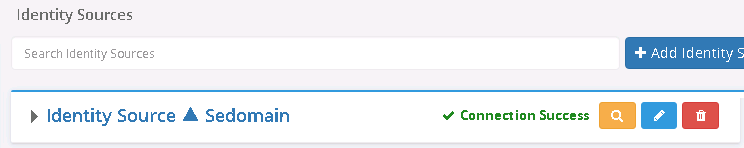

# Global Identity Builder concepts

This chapter introduces concepts applicable to the Global Identity Builder.

## Project

A project builds a unique reference list of identities from disparate data sources. This reference list is known as the global profile view. Clients of the RadiantOne service can leverage the global profile view to identify and authenticate users and retrieve profile attributes to enforce authorization and personalization.

## Identity Correlation

Identity Correlation is the process of linking overlapping users based on correlation rules. Once linked, the entries are joined into a global profile and a union is created by RadiantOne.

>[!warning]
>Once identities are linked in the global profile, they remain linked forever unless the identity is deleted from a data source or an administrator [manually unlinks](identity-administration.md#identity-unlinking) them.

## Identity source

An identity source is a data source such as Active Directory, Oracle database, Oracle Directory Server, etc. that can contribute identities to the global profile view. Any data source configured in RadiantOne can be an identity source used in the tool. When correlation rules result in a source identity matching exactly one global profile identity, the identities are automatically linked.  If a source identity does not match any identities in the global profile, or matches more than one global profile identity, the default behavior is to categorize it as [unresolved](#unresolved-identity) and not add it to the global profile.

>[!warning]
>Custom data sources are supported. However, you must first virtualize the identities in RadiantOne and store them in persistent cache. Then, use the persistent cache as the LDAP data source for the project. For details on this process, please see [integrate and configure a Global Identity Builder custom data source](integrate-configure-data-source.md).

## Identity Source Browser

The Identity Source Browser is accessible after an identity source is configured and is an interface where you can search for users directly in the source. Select  to launch the identity browser for a given source.

## Global profile

The global profile is a general term to define the final view of correlated identity sources. The global profile view is comprised of a unique list (a union) of identities along with attributes sourced from identity sources or computed in the attribute mappings configured in the Global Identity Builder project.

>[!warning]
>The RDN for the global profile entries is a unique identifier that is auto-generated. If you are virtualizing existing groups from backend data sources in FID, you should define a computed attribute for the `member`/`uniquemember` attribute in the groups virtual view that uses the `remapDN` function to lookup in the global profile view to get the list of member DNs. This configuration is described in the chapter [link existing groups to global profile identities](link-groups/overview.md).

## Global Profile Browser

The Global Profile Browser is accessible after identity sources have been uploaded into the global profile. From here you can search for identities in the global profile, see all sources the user is located in, and their complete profile. You can also manually unlink overlapping entries from here.

From the main project configuration, select **Identities Browser**.

## Unresolved identity

An unresolved identity is one that either did not match a global profile identity, or matched more than one identity in the global profile based on the correlation rules defined for the identity source.

Unresolved identities do not automatically appear in the global profile view (unless you have configured otherwise in your correlation rules). An administrator can [manually link](identity-administration.md) these identities to a global profile identity, or choose to have the identity become a new, unique identity in the global profile.

## Persistent cache

After uploading identity sources into the global profile, a persistent cache is automatically defined for the view. Persistent cache is a local copy of global profile stored in a RadiantOne HDAP store. Although the Global Identity Builder process automatically defines a persistent cache, a real-time cache refresh mechanism must be manually configured. The persistent cache refresh is the process that keeps the identity sources synchronized to the global profile store. Changes are synchronized one-way, from the identity sources to the global profile. Once the real-time persistent cache refresh process is running, no changes can be made to the project. If changes are needed, you must stop cache refresh. For details on configuring a real-time persistent cache refresh process, see the chapter on [managing real-time persistent cache refresh](manage-persistent-cache/overview.md).

>[!warning]
>Real-time cache refresh is the only option available for the global profile view.

## Correlation rule

Correlation rules are defined for each identity source and indicate how a source identity can be automatically linked to a global profile identity. When correlation rules result in a source identity matching exactly one global profile identity, the identities are automatically linked and share the same [VUID](#vuid) unique identifier.  If a source identity does not match any identities in the global profile, or matches more than one global profile identity, the default behavior is to categorize it as [unresolved](#unresolved-identity) and not add it to the global profile.

## Attribute mapping

Attribute mapping is the process of mapping identity source attributes to global profile attributes. During the upload/sync processes, the source identities are inserted/updated into the global profile store and the attribute mapping dictates how the global profile attribute values are populated. This mapping can be a direct mapping where the exact source value is mapped to a single global profile attribute value, or it can be a computed value based on one or more source attributes that get mapped to a single global profile attribute. The mapping can also indicate a constant value to be used for the global profile attribute.

## Bind order

The RadiantOne service can send the client bind request (credentials checking) to many identity sources (any that contributed to the global profile identity). After the project is configured, you can define the bind order to indicate the order of identity sources RadiantOne should attempt binds against. For example, if a global profile identity is linked to identities from two different sources, RadiantOne attempts the bind against the source configured first in the bind order. If the bind fails, it tries against the next identity source in the bind order. If the bind fails against all identity sources, the client receives a bind failure error from the RadiantOne service.

## Attribute priority

Attribute priority/precedence can be defined when a global profile attribute is populated from multiple identity sources. The default priority level set for all attributes is **normal**. This means, when a global profile attribute is populated from multiple identity sources, all unique values are returned in the global profile entry. For example, assume the following use case where two identity sources contain an overlapping user account and both identity sources are configured to publish the title attribute into the global profile. By default, the global profile title attribute contains the value from both identity sources. If the value of the title attribute was the same in both sources, the global profile title would just have one value. In the example depicted below, each identity source has a different value for title, so the global profile title attribute is multi-valued and has both values.

You can assign different priority levels for identity sources. In which case the highest priority, non-empty identity source attribute values will be used for the global profile attribute. The priority levels are:

- Lowest
- Low
- Normal
- High
- Highest

## VUID

The VUID attribute is the unique identifier for the identity in the global profile. All unique identities are assigned a VUID value when the entry is added into the global profile and keep this value permanently. All linked/correlated users are assigned the same VUID because they represent the same physical person. The VUID is unique not only in the enterprise, but also across the world. VUID values are not re-used. If an identity is removed from the global profile, and there are no other user accounts linked to the identity, the VUID is deleted and not re-used.

An example of a global profile entry and the correlation process can be found in the section on [upload](create-projects/upload.md).

>[!warning]
>Once identities are linked in the global profile, they remain linked forever unless the identity is deleted from a data source or an administrator [manually unlinks](identity-administration.md#identity-unlinking) them.

## Global Identity Viewer

RadiantOne includes an easy-to-use, web-based application named the Global Identity Viewer that facilitates searching for identities and/or groups across all data sources that have been integrated in the Global Identity Builder project. When a query returns an identity, a list of tabs display for the selected user based on how many identity sources the user has an account in. If the identity is found in the global profile list, the attributes corresponding to this account display on the Global Profile tab. The names of the other tabs indicate the identity source's "friendly name" as configured in the Global Identity Builder project. When a tab is selected, the identity attributes and group membership associated with the user's account in that particular identity source are displayed. In the diagram below, a user identified as Brian Carmen has an account in the RadiantOne global profile store, and accounts in identity sources named `adpartnerdomain`, `ldap`, and `azuread`. The example shows the `adpartnerdomain` tab selected and Brian's attributes from that particular data source returned.

In order to automate the configuration of the Global Identity Viewer, some properties must be defined in your Global Identity Builder project. These aspects are outlined below.

>[!note]
>If you will not use the Global Identity Viewer, you do not need to define these properties in your Global Identity Builder project.

For each Identity Source:

- Groups object (class) and location (Base DN) – allows for searches on groups from within the Global Identity Viewer.
- Identity Attributes containing a DN value (Identity DN Attributes) that should be automatically translated into the virtual namespace (for example `isMemberOf`, `manager`)
- Group Attributes containing a DN value (Group DN Attributes) that should be automatically translated into the virtual namespace (for example `uniqueMember`, `managedBy`)

>[!warning]
>If your identity sources contain LDAP dynamic groups or nested groups, you should consider using RadiantOne to automatically compute the membership (for example, evaluate dynamic groups, and un-nest groups) prior to starting your Global Identity Builder project. Otherwise, when you view the group information from the Global Identity Viewer, they will contain the exact values from the sources (for example, Sales group has the following members `ldap:///ou=users,o=directory??one?(department=Sales)` instead of the actual members of the Sales group). For details on this process, please see [address group membership challenges](address-group-challenges/ldap-dynamic-groups.md).

For details on the Global Identity Viewer, please see the RadiantOne Global Identity Viewer Guide.
