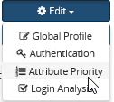
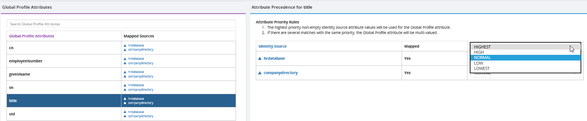

# Define attribute priority in Global Identity Builder

If a Global Identity Builder project has multiple identity sources that publish values to the same global profile attribute (defined in the attribute mapping), you can define attribute priority/precedence.

>[!note]
>For an example of the need for attribute priority, see [attribute priority](../concepts.md#attribute-priority) in the Global Identity Builder concepts section.

From the main project page, select **Edit** > **Attribute Priority**.

Each attribute that is mapped from multiple sources is displayed in the table. Choose the attribute and the priority setting as shown on the right.

In the Priority drop-down list, choose a priority level for the identity source. If all sources have the same priority, and the attribute values in each source are unique, the global profile attribute will be multi-valued, containing all source values. Otherwise, the attribute is only populated from the identity source configured with the highest priority. If the attribute does not have a value in the identity source configured with the highest priority, the global profile attribute is populated from the identity source configured for the next highest priority.

>[!warning]
>If you change attribute priority after you have uploaded into the global profile, you must re-upload the data sources.
