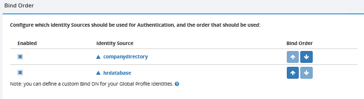
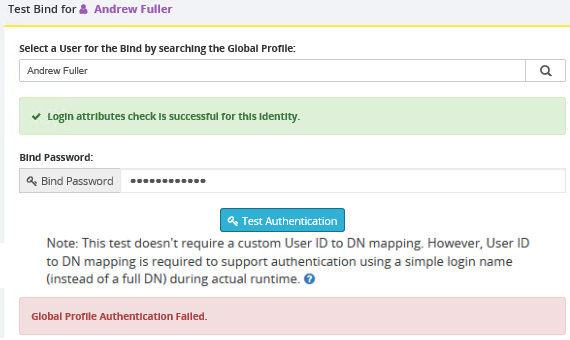

# Define bind order in Global Identity Builder

After [uploading](upload.md) into the global profile of a Global Identity Builder project you can define a bind order. For an example of how bind order works, see [bind order](../concepts.md#bind-order) in the Global Identity Builder concepts section.

From the main project page, select **Edit** > **Authentication**.

All identity sources configured in the project are displayed in a table. Check the Enabled option for identity sources that can be used for authentication and use the up/down arrows to indicate the order.

## Test authentication

On the right side of the bind order section, you can test authentication for an identity in the global profile. Search for a user in the global profile and enter the password in the **Bind Password** property. Select **Test Authentication**. If the credentials-checking fails, you get a **Global Profile Authentication Failed** message like shown below.

Otherwise, for successful authentications you would see: **Global Profile Authentication Successful!**.

The credentials checking is delegated to the underlying identity source views and the order is dictated by the Bind Order configured. The underlying source might be a persistent cache, an LDAP backend or a database backend. Keep this in mind to be able to troubleshoot authentication failures. For example, if the underlying identity source is a database, you must have an attribute mapped to `userPassword` in the virtual view (that is auto-generated by the Global Identity Builder. `dv=ids_Database_globalprofile,dv=sourcecatalog,ou=globalprofile,dv=globalprofile` is an example) and potentially an interception script that can handle the authentication by calling a stored procedure, or maybe hashing the password value received in the bind request to compare it to the value of the attribute mapped to `userPassword`. If the underlying identity source is an LDAP directory, the credentials checking is delegated to the backend. If the underlying identity source is a persistent cache, the credentials checking might be handled directly by the cache (if the passwords are in the cache), or delegated to the backend.

After a Global Identity Builder project has been created, you may need to perform manual interventions to resolve common issues, and maintenance to keep a project up-to-date. To learn more, please read the chapters that describe how to [perform manual identity administration](../identity-administration.md) and how to [manage real-time persistent cache refresh](../manage-persistent-cache/overview.md).
