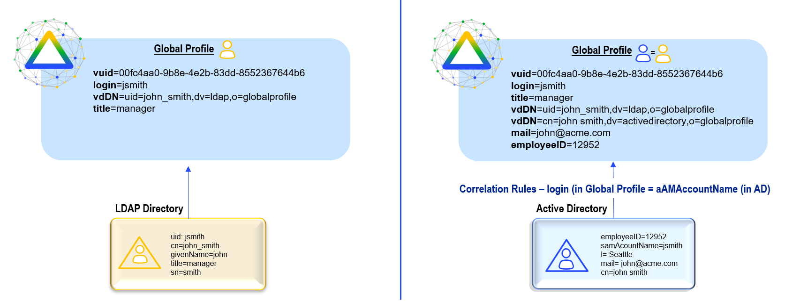
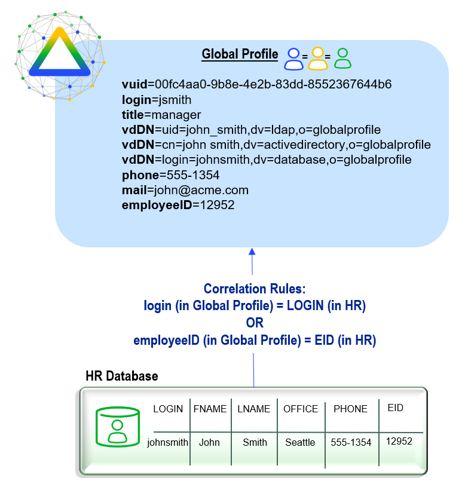
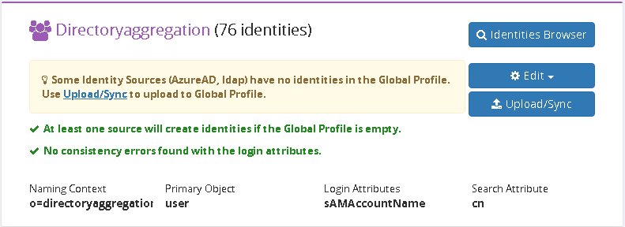

# Upload a Global Identity Builder project

When creating a Global Identity Builder project, after defining the project properties and adding identity sources, you can upload identities to the global profile.

Do not run uploads when the [real-time persistent cache refresh](../manage-persistent-cache/overview.md) process is running.

As the number of sources and/or the complexity of correlation rules increases, the importance of the upload order also increases. The first uploaded source should represent the most authoritative list of identities because it establishes the baseline reference by which identities uploaded from subsequent data sources are compared against. Be mindful of the different combinations of identity linking that can occur based on the conditions in your correlation rules and upload order because it can result in identities not getting linked properly, creating duplicate identities in the global profile view or ending up as [unresolved](../concepts.md#unresolved-identity).

Consider the example shown below.

Assume the upload order is 1) LDAP Directory, 2) Active Directory, 3) HR Database. The LDAP directory populates the `title` and `login` attributes into the global profile. The rules to correlate Active Directory entries involves the `login` attribute and this data source contributes `mail` and `employeeID` into the global profile as depicted below.

The last identity source to upload is the HR database and the rules to correlate HR entries involves the `login` attribute or the `employeeID` attribute as depicted below.

Now consider if the upload order was different and the HR Database was uploaded before Active Directory. Since one of my correlation rules indicates when `login` (in the Global Profile) matches `LOGIN` (in the HR database), this is the same physical person, the John Smith user from the HR database would not be automatically linked to the John Smith user in the global profile. In this case, the attribute to dictate the proper link (`employeeNumber` in global profile = `EID` in HR database) would only be populated after the identities from Active Directory were uploaded into the global profile. So John Smith from the HR database would either go into [unresolved](../concepts.md#unresolved-identity), or if you selected the option to **Create a new identity when there is no match** when you configured the correlation rules for the HR database, another identity for John Smith would be created in the global profile. Either of these scenarios would require human intervention to fix, to either manually link the accounts or remove the duplicate account from the global profile.

>[!note]
>If you need to correlate overlapping users from the same source, and this source is the one you are uploading first, be sure to disable the [skip correlation on first source upload](project-properties.md#skip-correlation-on-first-source-upload) option.

To upload identities into the global profile, from the project page, select **Upload/Sync**.

There are two sections visible on the upload step. One section is for bulk loads, loading all identity sources in a particular order. One section is for single uploads, uploading from a select identity source.

## Bulk upload

Bulk upload is for processing identities from all sources in the indicated order. Use the  to change the order and then select **Upload All**.

During the upload, correlation rules are evaluated and source identities are either linked to matching global profile identities, created as new identities in the global profile, or marked as [unresolved](../concepts.md#unresolved-identity) and not added into the global profile. During an upload, the upload and reset buttons are temporarily disabled.

>[!warning]
>Upload order is very important. Consider your correlation rules and identity source data to determine the best upload order. If you modify the upload order during a bulk upload, the modification is implemented in the next upload. For more details, see the [previous section](#upload).

To download the log file for the bulk upload task, select the  button. Your internet browser settings determine the download location. The file name syntax is as follows.

`task.Upload_IdentitySource_{PROJECT_NAME}.ALL_SOURCES.log.`

To remove all entries from the global profile, select **Reset All**. This allows you to change the correlation rules, attribute mappings, upload order, etc. and re-upload identities into the global profile.

## Single uploads

Single uploads are for processing identities from a single source. Select **Upload** next to the identity source you want to process and upload into the global profile. During the upload, correlation rules are evaluated and source identities are either linked to matching global profile identities, created as new identities in the global profile, or marked as [unresolved](../concepts.md#unresolved-identity) and not added into the global profile. During an upload, the upload and reset buttons are temporarily disabled.

>[!warning]
>Upload order is very important. Consider your correlation rules and identity source data to determine the best upload order. For more details, see the [previous section](#upload).

To download the log file for the single upload task, select the  button. Your internet browser settings determine the download location. The file name syntax is as follows.

`task.Upload_IdentitySource_{PROJECT_NAME}.{IDENTITY_SOURCE_NAME}.log.`

To remove identities associated with a specific source from the global profile, select **Reset**. This allows you to change the correlation rules, attribute mappings, upload order, etc. and re-upload identities into the global profile.

## Upload behavior

After you have uploaded the identities into the global profile, if you run the single upload again for a given source, the behavior outlined below occurs.

| Source Event | Result |
|---|---|
| An entry that is currently correlated/linked in the global profile entry has been updated. | The upload will update applicable attributes in the global profile. Correlation rules are not re-evaluated, so the entry will not be unlinked or re-linked (to a new global profile entry). |
| An entry that is currently marked as unresolved has been updated. | If the update results in a correlation, the entry is linked in the global profile and removed from unresolved. |
| An entry that is currently correlated/linked in the global profile has been deleted. | If the entry is linked to other entries in the global profile, the attributes coming from the source the entry was deleted from are removed from the global profile. If there are no other linked entries in the global profile for the user, the entry is deleted from the global profile. |
| An entry that is currently marked as unresolved has been deleted. | The entry is removed from unresolved. |
| A new entry has been added. | Correlation rules are evaluated and the entry is either linked to a matching global profile identity, created as a new identity in the global profile, or marked as [unresolved](../concepts.md#unresolved-identity) and not added into the global profile. |
| An entry is moved to a new container that is not below the naming context configured for the identity source, making it out of the scope of the Global Identity Builder project. For example, assume the user `uid=sam,ou=people,dc=domainA` is moved to `uid=sam,ou=globalpeople,dc=domainA` and the identity source definition for the correlation project was configured for `ou=people,dc=domain`. | If the entry is linked to other entries in the global profile, the attributes coming from the entry identified by the old DN are removed from the global profile. If the entry is in the global profile and not linked to any other entries, it is removed from the global profile and added to unresolved (represented only by the old DN). If the entry is not in the global profile, it is ignored, since the suffix of the new entry does not match what is defined for the identity source in the correlation project. |
| An entry is moved to a new container that is below the naming context configured for the identity source. For example, assume the user `uid=joan,ou=internaluser,dc=domainB` was moved to `uid=joan,ou=externaluser,dc=domainB` and the identity source definition for the correlation project was configured for `dc=domainB`. | If the entry is in the global profile, the `vddn` attribute representing the identity is removed and all attributes associated with the identity are removed. The entry is processed as a new identity and correlation rules are evaluated and the entry is either linked to a matching global profile identity, created as a new identity in the global profile, or marked as [unresolved](../concepts.md#unresolved-identity) and not added into the global profile. If the entry is not in the global profile, correlation rules are evaluated and the entry is either linked to an existing global profile identity, added as a new identity, or added to unresolved. |

## Upload logs

Uploads are performed as tasks. Each identity source is associated with its own task log. The task logs are located here: `{RLI_HOME}\vds_server\logs\scheduler\`

Log file name syntax: `task.ID_Correl_Upload_{PROJECT_NAME}.{IDENTITY_SOURCE_NAME}.log`

If there are errors during uploads, check the task log.

You can also download the log in the Global Identity Builder by selecting  next to the process in the upload screen.

