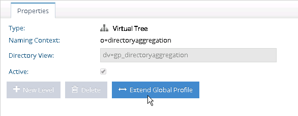
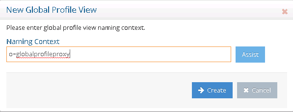
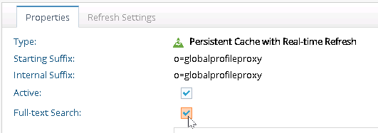

# Extend the global profile view

The virtual view generated by the Global Identity Builder tool is not editable from the Main Control Panel > Directory Namespace tab. Changes must be made using the Global Identity Builder tool. If you need to add interception scripts, computed attributes, or external joins, virtualize/extend the naming context containing the global profile view and define these configurations on the new view. The steps required to extend the global profile view to support the Global Identity Viewer application are outlined in this chapter. This ensures any attributes that are joined and returned from secondary data sources are available in the Global Identity Viewer. If you will not use the Global Identity Viewer application, then you do not need to follow the steps outlined in this chapter. You can create a new root naming context with an LDAP proxy backend that points to the cached global profile view. Define needed interception scripts, computed attributes or joins on the proxy view. Refer to the RadiantOne Namespace Configuration Guide for steps on creating root naming contexts for LDAP proxy views.

1. From the Main **Control Panel** > **Directory Namespace** tab, select the naming context associated with your global profile view below the **Root Naming Context** section.
1. Select the **Extend Global Profile** button on the **Properties** tab. In the example shown below, the root naming context associated with the global profile view is `o=directoryaggregation`. 
    
1. Enter the name of the root naming context where the proxy view is mounted and select **Create**.
    
1. Select the new root naming context to configure needed extensions. Interception scripts are enabled on the **Proxy Advanced** tab. Joins and computed attributes are configured on the **Objects** tab.
1. To configure a persistent cache for the new root naming context, select **Cache**.
1. Select **Browse** and navigate to the new naming context.
1. Select **OK**.
1. Select **Create Persistent Cache**.
1. Select **Ok** to exit the confirmation.
1. Select the **Refresh Settings** tab.
1. Choose the real-time refresh option and select **Save**. Since this cache is built on top of another cached view, the built-in HDAP trigger mechanism is automatically configured and ensures this cache is refreshed when the underlying cached view is refreshed.
1. Select **Initialize**.
1. Select **OK** to exit the initialization window.
1. On the **Properties** tab, enable the **Full-text Search** option and select **Save**.
    
1.  Select **OK** to exit the confirmation/warning.
1. Select **Re-build index**.
1. Select **Yes** to confirm.
1. Select **OK** to exit the confirmation of the rebuild index task.
