# Perform manual identity administration in Global Identity Builder

With every Global Identity Builder project, there is usually an element of manual intervention required after initial project creation. This is because the quality of the data in identity sources makes it difficult to come up with enough combinations of correlation rules to match 100% of the overlapping identities. The manual tasks that an administrator can perform are described in this chapter.

## Remove identities from the global profile

During the design and configuration of the global profile view (when [real-time persistent cache refresh](manage-persistent-cache/overview.md) is not running), you may need to remove the entire contents of the global profile or just identities from a specific source. From the configured project, select **Upload/Sync**. In the Bulk Upload section, select **Reset All** to delete all identities from the global profile view. To only remove identities uploaded from a specific data source, select **Reset** next to the identity source in the Single Upload section.

>[!warning]
>The reset options should only be used during the initial design and configuration of the global profile. Once deployed and [real-time persistent cache refresh](manage-persistent-cache/overview.md) is running, the reset options generally are not needed. When you reset a data source, the identities are removed from the global profile. If the identity is the last reference in the global profile (there are no other users linked to it) it is deleted and the unique identifier (VUID) assigned to the identity is removed. In this case, identities that are uploaded again from the same data source are assigned a new value for VUID. If other downstream applications rely on this unique identifier, they are impacted when an identity source is reset because the identifier for the identity changes.

### Identity unlinking

>[!warning]
>Once identities are linked in the global profile, they remain linked forever unless the identity is deleted from a data source or an administrator [manually unlinks](#identity-unlinking) them.

To manually unlink an identity in the global profile, use the global profile identities browser to locate the identity.

On the main project page, select **Identities Browser**.

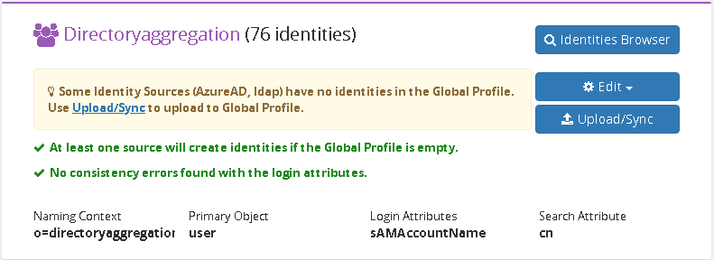

Search for and choose the identity to unlink.

A list of data sources the user is from is displayed. Select **Unlink** for the identity you want to remove. The unlinked identity goes into the list of [unresolved](concepts.md#unresolved-identity).

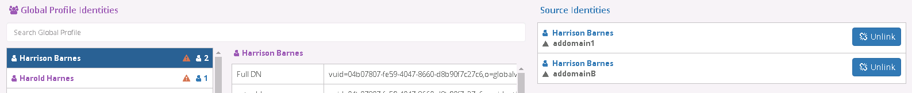

If the user is not linked to any other identities in the global profile, selecting **Unlink** removes them from the global profile and adds them to the list of [unresolved](concepts.md#unresolved-identity).

## View unresolved identities

An unresolved identity is one that either did not match a global profile identity, or matched more than one identity in the global profile based on the correlation rules defined for the identity source.

You can view unresolved identities per identity source. From the main project page, select  next to the identity source.

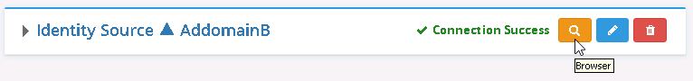

From the drop-down list, choose **Unresolved** to just view the identities that were flagged as unresolved in this source.

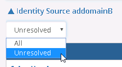

For each unresolved identity, you can view the source attributes, their current status in the global profile (Correlation Status tab), and if there are any correlation rules that would match them to a global profile identity (Rules Matches tab). You can also search the global profile to find an identity to link the user to (Link Manually tab).

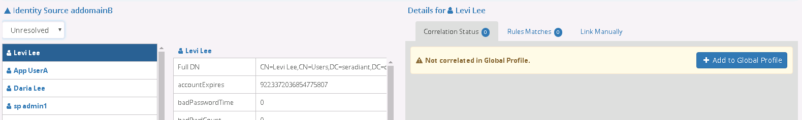

## Add unresolved identities into the global profile

Any [unresolved](concepts.md#unresolved-identity) identity can be manually added to the global profile as a new entry, or linked to an existing global profile entry from the source identity browser. You can view unresolved identities per identity source. From the main project page, select  next to the identity source.

>[!warning]
>Once identities are linked in the global profile, they remain linked forever unless the identity is deleted from a data source or an administrator [manually unlinks](#identity-unlinking) them.

From the drop-down list, select **Unresolved** to just view the identities that were flagged as unresolved in this source. Choose an unresolved identity and you can manually add the identity into the global profile by selecting **Add to Global Profile** on the **Correlation Status** tab.

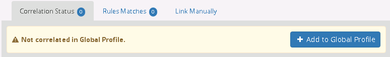

If you want to manually link the identity to an existing global profile identity, select the **Link Manually** tab and enter search criteria to locate the global profile user. The results from the global profile are returned and you can link the source identity to this profile by selecting **Link**.

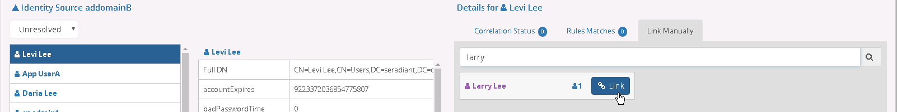

If the unresolved user matches multiple global profile users based on correlation rules, the Rules Matches tab displays which global profile users are a potential match. You can link the source identity to a profile by selecting **Link**.

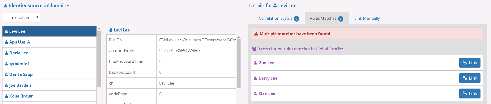

## Login Conflict analysis

A login attribute is one that an application uses to uniquely identify a user that needs to be authenticated. Therefore, the attributes configured as login attributes for the project should be populated and unique across all identities in the global profile view. If a login attribute does not have a value and/or the value is duplicated across multiple global profile identities, those identities are flagged as Login Conflict.

To view all identities with a login conflict, go to the Main Project configuration and select **Edit** > **Login Analysis**. If you disabled the **Automatic Logic Attribute Analysis** in the project properties, you must run the **Login Analysis** from here.

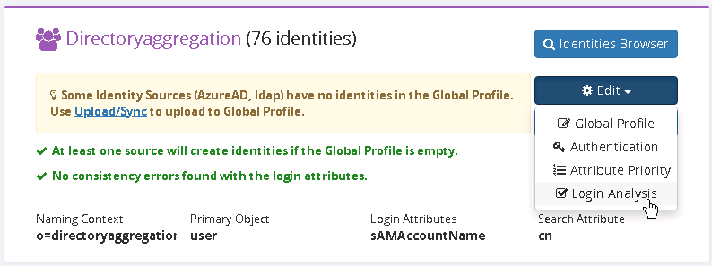

In the example below, a user (`Levi Lee`) in the global profile, has a login conflict (`mail` has been designated as the login attribute) with another global profile entry (`Larry Lee`).

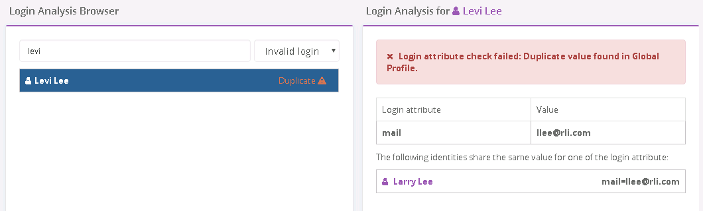

As another example, a user (`Harrison Barnes`) in the global profile, has a login conflict (`mail` has been designated as the login attribute) because he has no value for his email address.

Possible ways to resolve a conflicted identity are:

1. Verify that the Global Profile entry has been correlated properly. If it has not, fix your correlation rules, [reset](#remove-identities-from-the-global-profile) and re-upload the identity sources. If correlation logic is insufficient, you can always [manually link](#perform-manual-identity-administration) identities.

>[!warning]
>This approach should only be done when [real-time persistent cache refresh](manage-persistent-cache/overview.md) is not running. When you reset a data source, the identities are removed from the global profile. If the identity is the last reference in the global profile (there are no other users linked to it) it is deleted and the unique identifier (VUID) assigned to the identity is removed. In this case, identities that are uploaded again from the same data source are assigned a new global identifier.

2. Change the attribute mappings that populates the login attribute from one (or more) of the identity sources. Then re-upload the identity sources.  

>[!note]
>This approach should only be done if when [real-time persistent cache refresh](manage-persistent-cache/overview.md) is not running.

3. Change the data in the identity source so the login attribute pushed to the global profile has a unique value.

>[!note]
>If the [real-time persistent cache refresh](manage-persistent-cache/overview.md) is running, the connectors should detect and propagate the change to the global profile. If real-time persistent cache refresh is not running, re-upload this source to the global profile.

### Launch login analysis

The attributes designated as the Login Attributes in the project configuration is analyzed during uploads. When the [real-time persistent cache refresh](manage-persistent-cache/overview.md) process is running, the login analysis is performed for every insert, update and delete operation that is applied to the global profile.

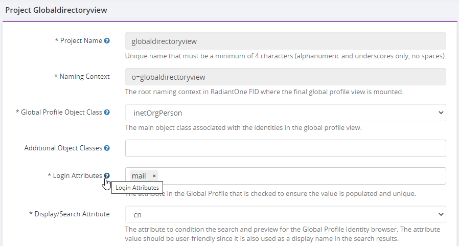

During the design phase of your project (while [real-time persistent cache refresh](manage-persistent-cache/overview.md) is not running), if you have already uploaded identities into the global profile and decide to change the login attribute (to some other attribute already existing in the global profile), you can re-launch the login analysis without having to re-upload the data. To manually launch the login analysis, go to the Main Project configuration and select **Configure** > **Login Analysis**.

>[!warning]
>If the new login attribute does not exist in the global profile, you must re-upload the data. In this case, the login analysis is launched automatically so there is no need to manually trigger it.

To learn more about the post-creation process, please read the chapter that describes how to [manage real-time persistent cache refresh](manage-persistent-cache/overview.md).
