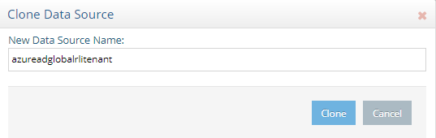
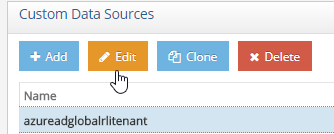
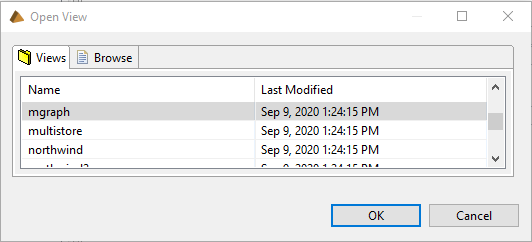
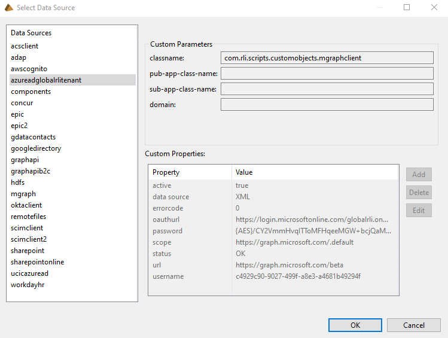
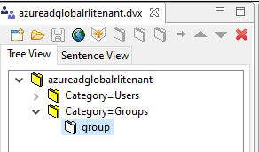
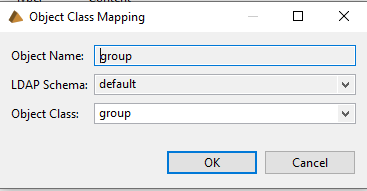
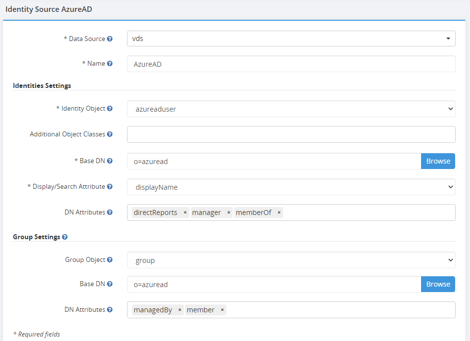

# Integrate and configure a Global Identity Builder custom data source

The custom data source example described in this section is Azure AD. RadiantOne includes a default custom data source to virtualize Azure AD. Edit this data source to point to your Azure AD. You must have an application registered in your Azure AD and have the APPLICATION ID and PASSWORD KEY before proceeding with the following steps.

>[!note]
>If you have not already registered an application in Azure AD, you must do so prior to configuring RadiantOne. If you need help registering an application, see the RadiantOne Namespace Configuration Guide or the Microsoft Azure AD documentation.

## Customize data source

The Azure application APPLICATION ID and PASSWORD KEY are required to configure the Azure AD data source.

1. On the Main Control Panel > Settings tab > Server Backend section, go to Custom Data Sources.
1. On the right, select **mgraph** and select **Clone**.
1. Enter a data source name and select **Clone**. Select **OK** to exit the confirmation. In this example, the data source is named `azureadglobalrlitenant`. 
    
1. Choose the new data source (for example `azureadglobalrlitenant`) and select **Edit**. 
    
1. Choose the `username` property and select **Edit**.
1. Enter the value of the Azure AD Application ID and select **OK**.
1. Choose the `password` property and select **Edit**.
1. Enter the password key associated with your Azure AD application and select **OK**.
1. Choose the `oauthurl` property and select **Edit**. Enter the URL for your Azure AD tenant (for example `https://login.microsoftonline.com/{YOUR_TENANT_NAME}/oauth2/v2.0/token`) and select **OK**.
1. Choose the `active` property and select **Edit**.
1. Set the value to `true` and select **OK**.
1. Select **Save**.

## Create virtual view

RadiantOne includes a default virtual view for Azure AD. Edit this virtual view to point to your [Azure AD custom data source](#customize-data-source) configured in the previous section.

1. Launch **RadiantOne Context Builder** and select the **View Designer** perspective.
1. Choose **File** > **Open** > **View**.
1. Choose the **mgraph** view and select **OK**.
    
1. Choose **File** > **Save As** and enter a file name (for example `azureadglobalrlitenant`).
1. Select **OK**.
1. On the Tree View tab, right-click on the view name and select **Edit Connection String**.
1. Select **Edit**.
1. Choose the custom data source created in the previous section and select **OK**.
    
1. Select **OK** to exit the connection string dialog.
1. Since contacts and devices are not needed for this use case, on the **Tree View** tab, right-click on **Category=contacts** and choose **Delete**. Select **Yes**, to confirm.
1. On the **Tree View** tab, right-click on **Category=devices** and choose **Delete**. Select **Yes**, to confirm.
1. The default group object class need remapped to a common name because the group settings allowed by the Global Identity Builder are currently, `group`, `groupOfNames` and `groupOfUniqueNames`. On the **Tree View** tab, expand **category=groups** and select **group**.
    
1. Select the **Properties** tab and locate the Object Class.
1. Select **Edit** next to Object Class.
1. From the drop-down list, choose **group** and select **OK**.
    
1. Select  to save the view.
1. In the **RadiantOne Main Control Panel**, go to the **Directory Namespace** tab.
1. Select **New Naming Context**.
1. Enter a naming context (for example `o=azuread`) and select the **Virtual Tree** type.
1. Select **Next**.
1. Choose the **Use an existing view (.dvx)** option and select **Browse**.
1. Choose the virtual view created in Context Builder (saved in step 1. above) and select **OK**.
1. Select **OK** and then **OK** again to exit the confirmation.
1. Select the **Main Control Panel** > **Directory Browser** tab and select  to re-load the tree.
1. Navigate to the root naming context created in step 21. Expand the tree and verify your Azure AD user and groups are returned.

## Configure persistent cache

Prior to using FID as an identity source in your Global Identity, configure and initialize a persistent cache for your virtual views.

1. Select the **Main Control Panel** > **Directory Namespace** tab.
1. Select **Cache**.
1. Select **Browse** to navigate to the naming context you want to cache.
1. Select **Create Persistent Cache**.
1. On the Refresh Settings tab, choose the type of cache refresh strategy you want to use. For details on the different refresh options and how to initialize the cache, see the RadiantOne Deployment and Tuning Guide.
1. After the persistent cache is configured, choose the cached branch below **Cache** and on the **Refresh Settings** tab, select **Initialize**.
1. If you selected a Real-time refresh strategy, configure the connectors accordingly and start them. For details, see the Connector Properties Guide and the Deployment and Tuning Guide. If you selected a periodic cache refresh approach, configure the refresh interval. For details, see the Deployment and Tuning Guide.

## Add RadiantOne cache as an identity source in the project

After configuring a persistent cache, add it as an an identity source. This will enable synchronization between your identity source and the global profile.

1. Select **Add Identity Source** to add an identity source to a project.
2. Enter the required [properties](create-projects/identity-sources.md).
    
3. Select **Save changes**.
4. Configure [attribute mappings](create-projects/identity-sources.md#attribute-mappings).
5. Select **Save Mappings**.
6. Configure [correlation rules](create-projects/identity-sources.md#correlation-rules).
7. Select **Save Rules**.
8. [Upload](create-projects/upload.md#single-uploads) Azure AD entries into the global profile.

To learn more about Global Identity Builder, please read the chapter that describes how to [address group membership challenges](address-group-challenges/ldap-dynamic-groups.md).
