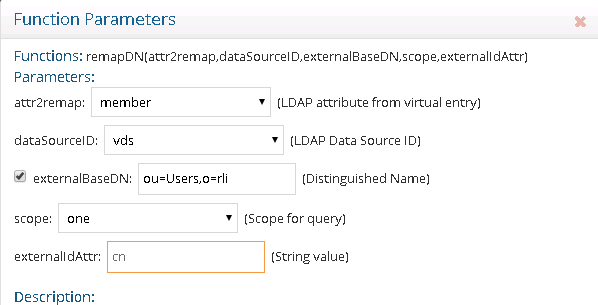
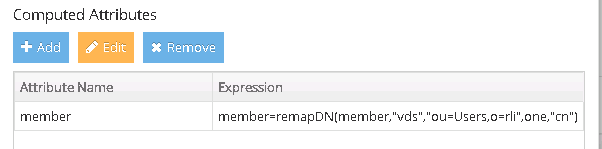
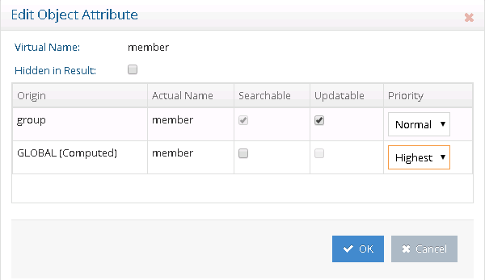

# Define computed group membership in Global Identity Builder

The virtual view of group entries needs a computed attribute defined for the membership attribute. Steps to define a computed attribute are described in this section.

1. With the `ou=ADDomain1` level selected, select the **Objects** tab.
1. In the Primary Object section, select **Add**.
1. Select the object class associated with the group entries in the backend directory (for example `group`) and select **OK**.
1. Select the group object class in the **Primary Object** table and select **Edit** next to **Define Computed Attributes** (at the bottom).
1. Select **Add**.
1. Enter the computed attribute name. Since the existing groups maintain members in the `member` attribute, this should be the computed attribute name.
1. For the expression to compute the `member` attribute, select **Function**.
1. Select the **remapDN(attr2remap,dataSourceID,externalBaseDN,scope,externalIdAttr)** function and select **OK**.
1. Select the `member` attribute as the `attr2remap` attribute. This the existing group entry attribute that contains the information needed to lookup the member in the global profile view.
1. Select **vds** as the data source ID.
1. Check the **External Base DN** option and enter the container where the global profile view was mounted below the `ou=Users` described in this chapter (for example `ou=Users,o=rli`).
1. The `externalIdAttr` attribute must be the one in the global profile that contains that matching value of the RDN in the existing group member DNs. In this example, it is the `cn` attribute.
    
1. Select **Ok**.
1. Select **Validate**.
1. Select **OK** and **OK** again to exit the computed attributes window.
    
1.  Select **Save**.
1.  Select **Yes** to apply the changes to the server.
1.  On the **Objects** tab, in the **Virtual Attribute Name** table, select the `member` attribute. It is noted that the attribute is populated from both the primary backend and a computed attribute: . To avoid returning the existing actual member DNs and return only the computed value, select **Edit Attribute**.
1.  In the **Priority** drop-down list for the **GLOBAL (Computed)** origin, choose **Highest** (or **High** – as long as the value has more priority than the one assigned to the group origin).
    
1. Select **OK**.
1. Select **Save**.
1. Select **Yes** to apply the changes to the server.
1. Repeat steps 1-22 for the container representing the groups in the second backend directory.
