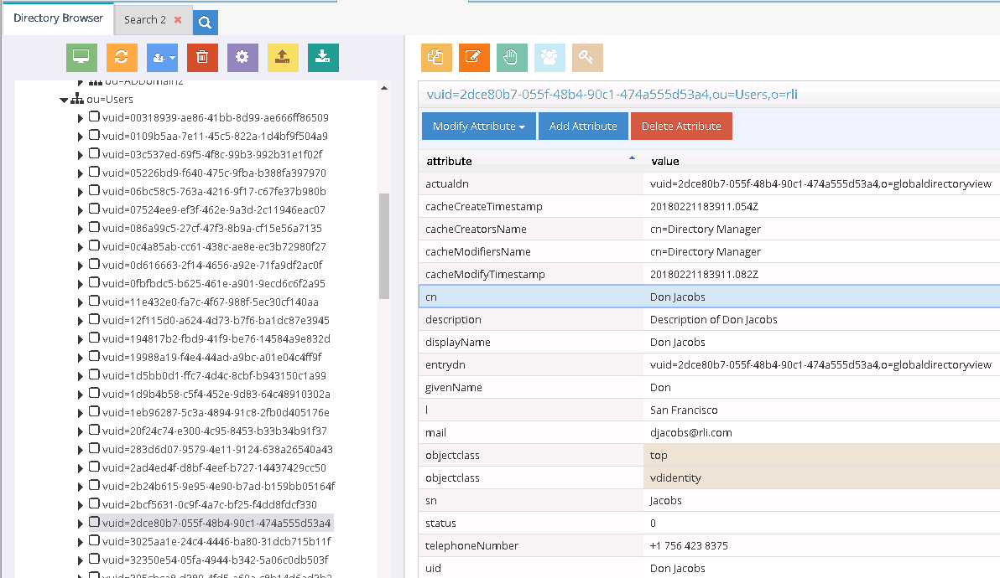

# Remapped Global Identity Builder group membership

After defining a computed attribute, you can get a runtime view of the result from the Main Control Panel > Directory Browser.

In the following example, a global profile identity, `Don Jacobs`, is selected. Note that his DN in the virtual namespace is: `vuid=2dce80b7-055f-48b4-90c1-474a555d53a4,ou=Users,o=rli`.

Before RadiantOne is configured to compute the `member` attribute for groups, you can see in the following screen that `Don Jacobs` is a member of the `Accounting` group in the `ADDomain1` backend.

After RadiantOne is configured to compute the group members, you can see that Don Jacob's DN associated with his global profile identity is returned as an `Accounting` group member. This is essential for client applications that will identify and authenticate Don Jacobs with a DN of `vuid=2dce80b7-055f-48b4-90c1-474a555d53a4,ou=Users,o=rli` to be able to find the corresponding groups that he is a member of for enforcing authorization and personalization.

To learn more about Global Identity Builder, please read the chapter that describes how to [integrate and configure a Global Identity Builder custom data source](../integrate-configure-data-source.md)
