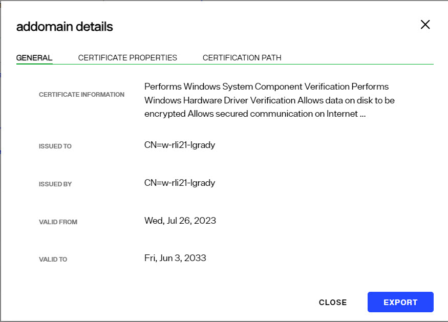
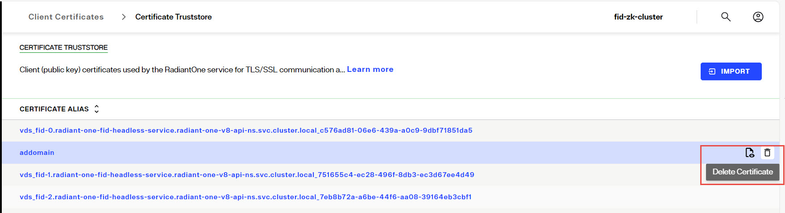

## Overview

The certificates in the Client Certificate trust store are used by RadiantOne to connect via SSL to underlying data sources. Therefore, the appropriate client (public key) certificate (associated with the server certificate of the backend) needs imported into the Client Certificate trust store (unless they are signed by a trusted/known Certificate Authority).

>[!note]
> Client certificates used for the RadiantOne Identity Data Management nodes to communicate with each other over TLS/SSL are automatically imported into the truststore.

Client certificates can be added to the Client Certificate truststore at any time without needing to restart the RadiantOne service. All RadiantOne cluster nodes share the contents of the Client Certificate truststore.

Import client certificates into the truststore from the Control Panel > Global Settings > Client Certificates. Certificates can be viewed, imported, exported or deleted from here.

## Viewing Client Certificates

To view a certificate, select the  button inline with the certificate you want to view. Valuable information about the certificate is shown (who issued the certificate, who the certificate was issued to, when the certificate is set to expire, status…etc.).

### Importing Client Certificates

To add a certificate:
1.	Click .
2.	Enter a short, unique name (alias) for the certificate.
3.	Browse to the location of the client certificate file and click **OPEN**.
4.	Click **OK**.

### Deleting Client Certificates

To delete a certificate:

1.	Click the trashcan inline with the certificate to be removed.
  .
  
2.	Click **DELETE**.

### Exporting Client Certificates

To export a certificate:

1.	To export a certificate, select the  button inline with the certificate you want to view.
2.	Click the **EXPORT** button. The certificate is automatically downloaded to the client machine.

