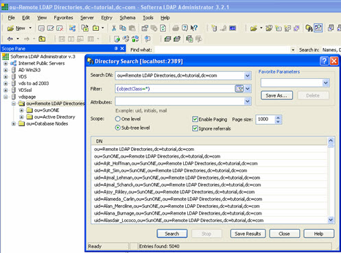

## Overview

RadiantOne Identity Data Management supports client operations via LDAP, SCIMv2 and REST. Details about these client protocols and their configuration are described below.

Settings related to client protocols are configured from the Control Panel > GLOBAL SETTINGS > Client Protocols.

## LDAP
RadiantOne Identity Data Management supports LDAPv3 as documented in [RFC 2251](http://www.faqs.org/rfcs/rfc2251.html) as a client protocol for querying the service.

Settings related to the LDAP client protocol are configured from the Control Panel > GLOBAL SETTINGS > Client Protocols > LDAP.

### User to DN Mapping
Typically, an LDAP client performs authentication first by searching the RadiantOne namespace for a specific user (based on configuration of the client to search for a specific attribute like cn, sAMAccountName, uid…etc.), and then issues a bind with the user DN returned in the search. These two steps are referred to as identification and credential checking respectively.

If this functionality is not implemented at the client level, RadiantOne can be configured to perform the identification step with user ID to DN mappings. This configuration describes how RadiantOne should find the user DN based on the ID that was received in the bind request.

Let’s look at the following examples to describe the difference.

In the diagrams below, the client is configured to search for the user account and then issue the bind.

Once the user is identified, the full DN is issued in the Bind Request.

 

If the client application is not configured (or cannot be configured) to issue a search and then bind, RadiantOne can be configured to perform the search (to find the DN). This is accomplished using User ID to DN mappings.

 
There are three different ways to determine the DN from the user ID (using regular expression syntax). Each is described below.

-	Setting a specific User ID to DN. In this example, if lcallahan were received in the authentication request, RadiantOne would base the authentication on the DN: cn=laura Callahan,cn=users,dc=mycompany,dc=com

`    lcallahan (the user ID) -> (maps to) cn= laura Callahan, cn=users,dc=mycompany,dc=com`

-	Specify a DN Suffix, replacing the $1 value with the User ID.

`(.+) -> uid=$1,ou=people,ou=ssl,dc=com` 
  `(.+) represents the value coming in to RadiantOne. If it received a User ID of lcallahan, the DN used to issue the Bind to the underlying directory would be: uid=lcallahan,ou=people,ou=ssl,dc=com.`

-	Specify a Base DN, scope of the search, and a search filter to search for the user based on the User ID received in the bind request.

`(.+) -> dc=domain1,dc=com??sub?(sAMAccountName=$1)`

If RadiantOne received a User ID of lcallahan, it would issue a search like:

`dc=domain1,dc=com??sub?(sAMAccountName=lcallahan)`

Then, a bind request is issued with the user DN that is returned.

For options 2 and 3 described above, multiple variables can be used (not just 1 as described in the examples). Let’s look at an example mapping that uses multiple variables:

`(.+)@(.+).(.+).com -> ou=$2,dc=$3,dc=com??sub?(&(uid=$1)(dc=$3))`

If RadiantOne received a user ID like laura_callahan@ny.radiant.com, the search that would be issued would look like:

`ou=ny,dc=radiant,dc=com??sub?(&(uid=laura_callahan)(dc=radiant))`

RadiantOne uses the DN returned in the search result to issue the Bind request to the backend directory.

**Processing Multiple Mapping Rules**

Many User to DN Mapping rules can be configured. They are processed by RadiantOne in the order they appear.

If a single User ID is found with the first mapping rule, then no other rules are evaluated. If the credential is correct, the user is authenticated (by the underlying directory). If the credentials are not correct, the authentication fails. If the authentication fails, no other DN mapping rules are executed. Only if the user is not found using the first DN mapping rule or if multiple users are returned based on the first rule causing ambiguity, will the other rules be evaluated. 

For example, if Laura Callahan, with a login of laura_callahan, is in two sources and there are two DN Mapping rules configured:

`dc=domain1,dc=com??sub?(sAMAccountName=$1)
uid=$1,ou=people,ou=ssl,dc=com`

The first DN Mapping rule is evaluated (dc=domain1,dc=com??sub?(sAMAccountName=laura_callahan)

If Laura Callahan’s account is found from the search, a BIND request is issued using her DN. If the credentials don’t match what are in the underlying directory, the authentication fails. The second DN mapping rule is NOT evaluated. Only when the first DN mapping rule fails to find a user, or if multiple users are returned by the first rule (causing ambiguity), will the other DN mapping rules be used. If no other rules are defined, the authentication fails.

### Supported Controls
LDAP controls, as documented in [RFC 2251](http://www.faqs.org/rfcs/rfc2251.html), offer clients and directory services a mechanism for extending an LDAP operation. 
A client can use a control to specify additional information as part of a request. For example, a client can send a control to a server as part of a search request to indicate that the server should sort the search results before sending the results back to the client. A directory service can return a control in an LDAP operation response to provide additional information to a client. For example, a directory service can send a control in a client bind response to indicate that a password is about to expire. The client could then prompt the user to update their password.

LDAP controls have a unique object identifier (OID) and notion of criticality. The criticality is a flag that indicates how the server should behave if it does not recognize a requested control from a client, or if it cannot support the control in the context in which it was requested. A criticality of “true” indicates that the control is a critical part of the request, and that the server should reject the request if it cannot support the control. A criticality of “false” indicates that the control is optional, and that if the server cannot support the control then it should go ahead and process the operation as if the control had not been included. The criticality does not come into play if the server does support the control within the context of the request.

RadiantOne supports the following LDAP controls.

>[!warn] The Proxied Authorization Control and the Paged Results Controls are enabled by default and cannot be disabled from the Control Panel. If you require these to be disabled, use a client to call the RadiantOne config API directly with an [Access Token](/documentation/configuration/security/access-tokens).

2.16.840.1.113730.3.4.18 – Proxied Authorization Control

1.2.840.113556.1.4.805 – Subtree Delete Control

1.2.840.113556.1.4.319 – Paged Results Control

2.16.840.1.113730.3.4.3 – Persistent Search LDAPv3 Control

1.2.840.113556.1.4.473 – LDAP Server Side Sort Control

2.16.840.1.113730.3.4.9 – VLV Request LDAPv3 Control

1.3.6.1.4.1.42.2.27.8.5.1 - Password policy control

1.3.6.1.1.13.1 - LDAP pre-read

1.3.6.1.1.13.2 - LDAP post-read

RadiantOne supports the following LDAP features:

1.3.6.1.1.14 – Modify-Increment Extension

1.3.6.1.4.1.4203.1.5.1 – All Operational Attributes Extension

1.3.6.1.4.1.4203.1.5.3 - Absolute True and False Filters as described in RFC 4526

1.3.6.1.4.1.4203.1.11.3 - Who Am I Extension

The Paged Results, VLV, Server Side Sort, Persistent Search and Proxy Authorization controls are not enabled by default. The Subtree Delete and Password Policy Controls are enabled by default. The Modify-Increment, All Operational Attributes, and Absolute True/False filters extensions are enabled by default.

This section describes each control or feature and how to enable it if needed.

 

**Paged Results Control**

The Paged Results Control allows an LDAP client to retrieve the results of a query in chunks (to control the rate at which search results are returned from the RadiantOne service). This feature can be useful when the client has limited resources and may not be able to process the entire result set from a given LDAP query. The client should specify the page size (number of entries per chunk) during the initial query. For more details on this control, please refer to the LDAP RFC 2696. This control is enabled by default.

The LDAP control ID is 1.2.840.113556.1.4.319. If you query the RadiantOne service using an empty base DN (starting point), you should see a supportedControl attribute with the value of 1.2.840.113556.1.4.319.

Below is an example of an LDAP client issuing a query to RadiantOne using paging.

 
In the vds_server_access.log you should see multiple search requests returning a maximum number of entries specified in the page size from the client (a minimum log level of ACCESS must be set for RadiantOne server log). In the screen shot above, a total of 5,040 entries were returned to the client.

Sample vds_server_access.log content:

2006-09-27 09:21:40,390 INFO  --> conn=9 op=35 SearchRequest {dn="ou=Remote LDAP Directories,dc=tutorial,dc=com",scope=2,derefAliases=0,sizeLimit=0,timeLimit=0,attrsOnly=false,filter="(objectclass=*)",attributes="1.1"} LDAPControl {1.2.840.113556.1.4.319 true}

2006-09-27 09:21:43,984 INFO  <== conn=9 op=35 SearchResult {resultCode=0, matchedDN=null, errorMessage=null} LDAPControl {1.2.840.113556.1.4.319 true} **### nEntries=1000 ###**

2006-09-27 09:21:46,953 INFO  --> conn=9 op=36 SearchRequest {dn="ou=Remote LDAP Directories,dc=tutorial,dc=com",scope=2,derefAliases=0,sizeLimit=0,timeLimit=0,attrsOnly=false,filter="(objectclass=*)",attributes="1.1"} LDAPControl {1.2.840.113556.1.4.319 true}

2006-09-27 09:21:47,718 INFO  <== conn=9 op=36 SearchResult {resultCode=0, matchedDN=null, errorMessage=null} LDAPControl {1.2.840.113556.1.4.319 true} **### nEntries=1000 ###**

2006-09-27 09:21:48,890 INFO  --> conn=9 op=37 SearchRequest {dn="ou=Remote LDAP Directories,dc=tutorial,dc=com",scope=2,derefAliases=0,sizeLimit=0,timeLimit=0,attrsOnly=false,filter="(objectclass=*)",attributes="1.1"} LDAPControl {1.2.840.113556.1.4.319 true}

2006-09-27 09:21:49,187 INFO  <== conn=9 op=37 SearchResult {resultCode=0, matchedDN=null, errorMessage=null} LDAPControl {1.2.840.113556.1.4.319 true} **### nEntries=1000 ###**

2006-09-27 09:21:50,359 INFO  --> conn=9 op=38 SearchRequest {dn="ou=Remote LDAP Directories,dc=tutorial,dc=com",scope=2,derefAliases=0,sizeLimit=0,timeLimit=0,attrsOnly=false,filter="(objectclass=*)",attributes="1.1"} LDAPControl {1.2.840.113556.1.4.319 true}

2006-09-27 09:21:50,687 INFO  <== conn=9 op=38 SearchResult {resultCode=0, matchedDN=null, errorMessage=null} LDAPControl {1.2.840.113556.1.4.319 true} **### nEntries=1000 ###**

2006-09-27 09:21:51,968 INFO  --> conn=9 op=39 SearchRequest {dn="ou=Remote LDAP Directories,dc=tutorial,dc=com",scope=2,derefAliases=0,sizeLimit=0,timeLimit=0,attrsOnly=false,filter="(objectclass=*)",attributes="1.1"} LDAPControl {1.2.840.113556.1.4.319 true}

2006-09-27 09:21:52,265 INFO  <== conn=9 op=39 SearchResult {resultCode=0, matchedDN=null, errorMessage=null} LDAPControl {1.2.840.113556.1.4.319 true} **### nEntries=1000 ###**

2006-09-27 09:21:53,546 INFO  --> conn=9 op=40 SearchRequest {dn="ou=Remote LDAP Directories,dc=tutorial,dc=com",scope=2,derefAliases=0,sizeLimit=0,timeLimit=0,attrsOnly=false,filter="(objectclass=*)",attributes="1.1"} LDAPControl {1.2.840.113556.1.4.319 true}

2006-09-27 09:21:53,562 INFO  <== conn=9 op=40 SearchResult {resultCode=0, matchedDN=null, errorMessage=null} LDAPControl {1.2.840.113556.1.4.319 true} **### nEntries=40 ###**

**VLV and Server Side Sort Controls**

The Virtual List Views (VLV) control works in conjunction with the Server Side Sort Control, and allows a client to request that the RadiantOne service only return a subset of a large sorted dataset. By default, RadiantOne does not order its results because doing so is often a waste of the server's time since there may not be a need for ordering. However, when the VLV control is enabled, it works in conjunction with a server-side sort control. This ensures that the subset of values returned to the client are in order and the consecutive subsets follow that order continuously so there are no overlapping entries.

By using the VLV control, the client can retrieve results more quickly and is not required to store too many search results at a time. This is more efficient and prevents the client from being overwhelmed with too many entries that it may not be able to handle.

This control can be enabled/disabled from the Control Panel > GLOBAL SETTINGS > Client Protocols > LDAP > Server Front End section > Supported Controls sub-section. Check the Enable VLV/Sort option and click Save. Restart the RadiantOne service. If you have a cluster deployed, restart the service on all nodes.

*Configure a Sorted Attributes List*

A sorted attributes list is required at the level of the RadiantOne Universal Directory store or Persistent Cache configuration for the service to enforce the VLV/sort control on the branch. 

1.	From the Main Control Panel > Directory Namespace tab, navigate to the naming context associated with a RadiantOne Universal Directory (HDAP) store or persistent cache (located below the Cache node).

2.	In the Sorted Attributes list, enter a comma separated list of attribute names that should have a special, sorted index. Any attribute that the client requests the sorting be based on should be entered here. The value of this attribute must be unique across all entries in the selected branch. For example, if your client is going to be Microsoft Outlook, the attribute cn must be added to the Sorted Attribute list.

3.	Click **Save** in the upper right corner. The RadiantOne service does not need to be restarted.

If the VLV control has been enabled but a client searches (and passes the VLV control) in a branch that is not associated with a RadiantOne Universal Directory store or persistent cache, it performs one of the following:

-	Forwards the search request along with the included control to the backend LDAP server (if the branch in the RadiantOne namespace is associated with an LDAP backend). In this case, it is the responsibility of the backend LDAP server to implement the VLV control. RadiantOne returns any controls received from the LDAP backend to the client.

-	Not use the VLV control at all (if the backend is associated with something other than an LDAP server or local Universal Directory store/persistent cache).

If the VLV control has not been enabled at all, but a client issues it in the search request as a critical control, the RadiantOne service returns LDAP protocol error code 2.

The flowchart shown below depicts the behavior of RadiantOne for applying the VLV control.

 

**Persistent Search Control**

Using the Persistent Search Control is one of the recommended approaches for other processes to detect changes that have happened to RadiantOne entries. The changelog is the other method that can be used.

This control can be enabled/disabled from the Control Panel > GLOBAL SETTINGS > Client Protocols > LDAP > Supported Controls sub-section. Check the Persistent Search option and click Save. Restart the RadiantOne service. If you have a cluster deployed, restart the service on all nodes.

If you enable the persistent search control, an LDAP client can receive notifications of changes that occur in the RadiantOne namespace. When a persistent search is requested, RadiantOne keeps the search operation going so clients can receive changed entries (and additional information about the changes that occurred). 

>[!note] The changelog number associated with the changed entries (logged into cn=changelog) is also returned in the persistent search response.

**Proxied Authorization Control**

This control is enabled by default.

Authorization for RadiantOne data is checked based on the user who authenticated. The authorization ID (DN) is linked to the authenticated ID (DN) for the same connection. With the proxy authorization control enabled, the client can switch the user ID (for authorization purposes) without having to re-authenticate with a new connection. After the Proxy Authorization control is enabled from here, the configuration (who is allowed to impersonate whom) is defined as access controls from the Control Panel > MANAGE > Security > Access Control (create an ACI with the *Proxy* permission). 

>[!warning] To allow the RadiantOne super user (e.g. cn=directory manager) to impersonate other users, you must enable the *Allow Directory Manager to Impersonate Other Users* setting in Control Panel > MANAGE > Security > Access Control > GENERAL tab. In this special scenario, access controls defining the “proxy” permission is not required. However, the Proxy Authorization Control must be enabled.

**Subtree Delete Control**

By default, only leaf nodes (nodes without child entries) can be deleted. If you need to delete an entire subtree, you must pass the subtree delete control (1.2.840.113556.1.4.805) in the request.

By default, only the RadiantOne super user (e.g. cn=directory manager) is allowed to issue delete requests with the subtree delete control. To configure access controls to allow other non-admin/super user accounts to perform sub-tree deletes, follow the steps below.

1.	Go to the Control Panel > MANAGE > Security > Access Control.

1.	Click **Manual Edit Mode** at the top.

1. Enter the following (update the userdn value to the DN of the user that you want to allow to use the subtree delete control):(targetcontrol = "1.2.840.113556.1.4.805") (version 3.0; acl "Tree delete control access"; allow(read) userdn="ldap:///uid=Aaron_Medler,ou=Accounting,o=companydirectory";).
 

>[!note] To allow anyone to perform a subtree delete request, use a value of “ldap:///anyone” for the userdn as shown in the example below.  (targetcontrol = "1.2.840.113556.1.4.805") (version 3.0; acl "Anonymous tree delete control access"; allow(read) userdn ="ldap:///anyone";).

1.	Click **CREATE**.

    If the target DN is associated with a RadiantOne Directory store, then RadiantOne processes the subtree delete control. If the target DN is a proxy view to a backend directory, RadiantOne request with the subtree delete control is delegated to the backend for processing.

    For example, there are two delete requests shown below (snippets from vds_server.log). The first delete request shows the scenario where the sub tree delete control isn’t passed and the delete fails (with error code 66) and the other shows where the control (1.2.840.113556.1.4.805) is passed and the delete is successful.

Delete request without passing the subtree delete control:

`2017-10-03 10:39:51,526 INFO  SessionHandler:1115 - --> conn[SSL/TLS]=1886 op=16 MsgID=16 DeleteRequest {entry=ou=test,o=companydirectory} LDAPControl {2.16.840.1.113730.3.4.2 false}`

`2017-10-03 10:39:51,606 ERROR BackendRouter:3743 - ??? BackendRouter.deleteEntry(): Error from backend: com.rli.slapd.server.LDAPException:  (66); Only leaf entry can be deleted.; Operation not allowed on nonleaf`

`2017-10-03 10:39:51,654 INFO  SessionHandler:3152 - <== conn[SSL/TLS]=1886 op=16 MsgID=16 DeleteResponse {resultCode=66, matchedDN=null, errorMessage=Only leaf entry can be deleted.} ### etime=128 ###`

`2017-10-03 10:40:40,583 WARN  session:561 - Session 17zh5m7l2n01j1gis29nv1entj is now immortal (maxInactiveInterval=-1)`

Delete request passing the subtree delete control:

`2017-10-03 10:40:40,584 INFO  SessionHandler:1115 - --> conn[SSL/TLS]=1886 op=17 MsgID=17 DeleteRequest {entry=ou=test,o=companydirectory} LDAPControl {1.2.840.113556.1.4.805 true} LDAPControl {2.16.840.1.113730.3.4.2 false}`

`2017-10-03 10:40:40,654 INFO  SessionHandler:3152 - <== conn[SSL/TLS]=1886 op=17 MsgID=17 DeleteResponse {resultCode=0, matchedDN=null, errorMessage=null} ### etime=70 ###`

**Password Policy Control**

The Password Policy Control is enabled by default and allows a client to request information about the current password policy information for a user entry. Specify the Password Policy Control in the LDAP request in the following ways:

-	With the OID. Use the --control or -J option with the Password Policy Control OID: 1.3.6.1.4.1.42.2.27.8.5.1 with no value.

-	Use the --usePasswordPolicyControl option. This option is used for bind requests. An example request and response is shown below.

`PS C:\Users\test> ldapsearch -h localhost -p 2389 -D "uid=Aaron_Medler,ou=Accounting,o=companydirectory" -w password -b o=companydirectory-s sub --usePasswordPolicyControl "(uid=Aaron)"`
  `# Bind Result:`
  `# Result Code: 19 (constraint violation)`
  `# Diagnostic Message:  Reason: 775 - Account locked : The password failure limit has been reached and the account is locked. Please retry later or contact the system administrator to reset the password.`
  `# Password Policy Response Control:`
  `#      OID:  1.3.6.1.4.1.42.2.27.8.5.1`
  `#      Error Type:  account locked`
  `#      Warning Type:  None`
  `# An error occurred while attempting to create a connection pool to communicate with the directory server:  LDAPException(resultCode=19 (constraint violation), errorMessage='Reason: 775 - Account locked : The password failure limit has been reached and the account is locked. Please retry later or contact the system administrator to reset the password.', diagnosticMessage='Reason: 775 - Account locked : The password failure limit has been reached and the account is locked. Please retry later or contact the system administrator to reset the password.', responseControls={PasswordPolicyResponseControl(errorType='account locked', isCritical=false)}, ldapSDKVersion=4.0.1, revision='26090')`

**Modify Increment Extension Feature**

RadiantOne supports the modify-increment extension feature as outlined in RFC 4525 by default. This is advertised in the rootDSE in the supportedFeature attribute with a value of 1.3.6.1.1.14.

This extension allows ldap modify operations to support increment capability. The attribute being modified must be appropriate for the request, meaning that it must be of type numeric or integer. The definition of the attribute, in the RadiantOne LDAP schema, must indicate AUTO INCREMENT ATTRIBUTE for the description. An example is shown below for an attribute named uidNumber:

`attributetypes: ( 1.3.6.1.4.1.40747.92.154461398.154346690.151743700.95511113.1090264 NAME 'uidnumber' DESC 'AUTO INCREMENT ATTRIBUTE' SYNTAX 1.3.6.1.4.1.1466.115.121.1.27 )`

An example of an ldapmodify request for incrementing the uidNumber by a value of 1 is shown below.

`# Increment uidNumber
  dn: uid=user1,dc=example,dc=com
  changetype: modify
  increment: uidNumber
  uidNumber: 1`

**All Operational Attributes Extension Feature**

RadiantOne supports the All Operational Attributes extension feature as outlined in [RFC 3673](https://www.rfc-editor.org/rfc/rfc3673) by default. This is advertised in the rootDSE to support searching for all operational attributes. 

Using the + character in your comma-separated list of return attributes, this extension allows LDAP searches of RadiantOne Universal Directory stores to return all operational attributes (except computed operational attributes, which must be specified by name). This feature can be useful when trying to determine which operational attributes exist in an entry.

>[!note] Search results may not include all requested attributes if precluded by access controls.

**Absolute True and False Filters**

This extension is intended to allow a more direct mapping between DAP and LDAP as needed to implement DAP-to-LDAP gateways. Clients can verify the support of this feature by accessing the RadiantOne RootDSE and verifying OID 1.3.6.1.4.1.4203.1.5.3 is advertised.

This extension allows clients to use “and” and “or” filters with zero filter elements. An “and” filter consisting of an empty set of filters evaluates to true. This filter is represented by the string “(&)”. An “or” filter consisting of an empty set of filters evaluates to false. This filter is represented by the string “(|)”.

**Authorization Identity Control**

Authorization Identity Control is a mechanism that allows a client to retrieve the authorization identity established in a bind operation. This is useful when certificates-based authentication is used. Also, some SASL authentication mechanisms may not involve explicitly providing a DN, or may result in an authorization identity which is different from the authentication identity provided by the client.

The Authorization Identity Control (--reportAuthzID) may be submitted in a bind request only. The authorization identity request control has an object identifier of "2.16.840.1.113730.3.4.16" and does not have a value. RadiantOne advertises support for the Authorization Identity Control in the rootDSE. A client that requests the rootDSE sees this value returned as a supported control.

>[!warning] The Authorization Identity Control is allowed for use in conjunction with LDAP bind operations only and therefore cannot be used after the client has authenticated. To obtain the authorization identity at any time after the bind has completed, use the *Who Am I* extended operation.

In the following example, the authorization identity control is requested by sending --reportAuthzID in the request.

`$ ./ldapsearch.bat -h 10.0.3.86 -p 2389 -D "uid=Aaron_Medler,ou=Accounting,o=companydirectory" 
-w password --reportAuthzID -b o=companydirectory -s base objectclass=*`

The sample command above results in the following type of bind request logged by RadiantOne.

`BindRequest {version=3, name=uid=Aaron_Medler,ou=Accounting,o=companydirectory, authentication=********} AuthorizationIdentityRequestControl {2.16.840.1.113730.3.4.16 false}`

The bind response from RadiantOne contains the identity assumed by the client. If the bind request succeeds and results in an identity (not anonymous), the control value contains the authorization identity (authzID). If the bind request resulted in an anonymous association, the control value field is a string of zero length. In the example shown below, the authorization identity is uid=aaron_medler,ou=Accounting,o=companydirectory.

BindResponse {resultCode=0, matchedDN=null, errorMessage=null} AuthorizationIdentityResponseControl {2.16.840.1.113730.3.4.15 false authzID=dn:uid=Aaron_Medler,ou=Accounting,o=companydirectory} ### etime=3 ###

**Who Am I Extended Operation**

The "Who am I?" extended operation, as outlined in [RFC 4532](https://www.rfc-editor.org/rfc/rfc4532), provides a mechanism for a client to request the authorization identity associated with the bound connection. Using this extended operation obtains the authorization identity associated with the user or application entity after the bind has established integrity and data confidentiality protections. This approach provides greater flexibility than the *Authorization Identity Control* because it can be requested at any time, not just during a bind operation. In addition, this extended operation can be augmented with a Proxied Authorization Control to determine the authorization identity that the server associated with the identity asserted in the *Proxied Authorization Control*.
RadiantOne advertises support for the “Who Am I” extended operation in the rootDSE. A client that requests the rootDSE sees the 1.3.6.1.4.1.4203.1.11.3 OID value returned as a supported control.

In the following example, a whoami extended request is performed.

`$ ldapwhoami -h 10.11.12.21 -p 2389 -D "uid=Aaron_Medler,ou=Accounting,o=companydirectory" -w password dn:uid=Aaron_Medler,ou=Accounting,o=companydirectory`

If the server can provide the authorization identity it associates with the client, the server returns a whoami Response with a successful resultCode. If the client is an anonymous entity, the response field is present but empty. Otherwise, the authzId represents the authorization identity it currently associates with the client in the response field.

Below is an example of a RadiantOne response to a “Who Am I” extended operation request.

`2018-05-25 08:20:45,246 INFO  SessionHandler:1135 - --> conn=477 op=2 MsgID=2 ExtendedRequest {OID='1.3.6.1.4.1.4203.1.11.3', value=''}`

`2018-05-25 08:20:45,246 INFO  SessionHandler:3498 - <== conn=477 op=2 MsgID=2 ExtendedResponse {resultCode=0, matchedDN=null, errorMessage=null, OID='1.3.6.1.4.1.4203.1.11.3', value='dn:uid=Aaron_Medler,ou=Accounting,o=companydirectory'} ### etime=0 ###`

**Dynamic Entries Extension**

The RadiantOne Directory supports temporary entries using the dynamicObject auxiliary object class as specified in [RFC 2589](https://www.rfc-editor.org/rfc/rfc2589). These entries are associated with a time to live attribute and once expired, the entry is automatically removed from the directory. For details on creating entries using this extension, see: [Creating Dynamic Entries](/configuration/directory-stores/managing-directory-stores)

### Authentication Methods

**Simple LDAP Bind**
 For accounts stored in a RadiantOne directory store, the following table lists the potential LDAP response codes returned during bind operations.

Condition | Bind Response Error Code and Message
-|-
User Name and Password are Correct. Bind is successful.	 | Error code 0
Valid User Name with Incorrect Password. Bind is unsuccessful. | Error code 49, Reason 52e - invalid credentials
Invalid User Name/DN. Bind is unsuccessful. | Error code 49, Reason 525 – User not found
Valid User Name with Expired Password. Bind is unsuccessful.| Error code 49, Reason 532 – Password expired. Password has expired.  Password Expired Response Control: 2.16.840.1.113730.3.4.4
User Name and Password are Correct. Account is locked due to nsAccountLock attribute set to true. Bind is unsuccessful. |Error code 53, Reason 533 - Account disabled: Account inactivated. Contact system administrator to activate this account.
Valid User Name with Incorrect Password. Account locked due to too many bind attempts with invalid password. Bind is unsuccessful. | Error code 19, Reason 775 – Account Locked: The password failure limit has been reached and the account is locked. Please retry later or contact the system administrator to reset the password.
Valid User Name with no password. Bind might succeed; it depends on the “Bind Requires Password” setting. | If “Bind Requires Password” is enabled, error code 49, invalid credentials, is returned. If “Bind Requires Password” is not enabled, the user is authenticated as Anonymous.
User Name and Password are Corrrect. Account is locked due to inactivity. Bind is unsuccessful.	| Error Code 50, Reason 775 – Account Locked. This account has been locked due to inactivity. Please contact the system administrator to reset the password.
No User Name with no password. Bind is successful. | Error code 0. User is authenticated as Anonymous.  Even if “Bind Requires Password” is enabled, error code 0 is returned. User is authenticated as Anonymous.

## SCIMv2
[RadiantOne SCIM API](../../web-services-api-guide/scim)

## REST
[RadiantOne REST API](../../web-services-api-guide/rest)
