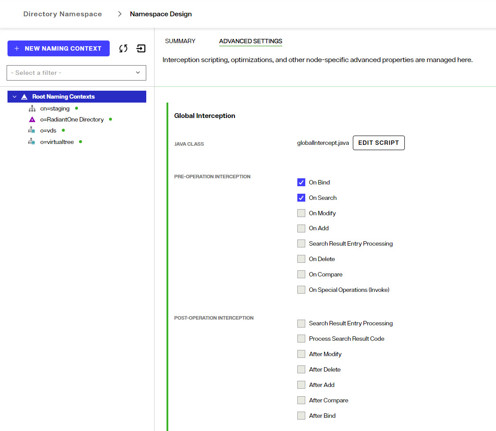

## Overview

For information on Interception scripts, please see [Interception Scripts](../identity-views/view-interception). The following steps describe how to enable interception scripts at a global level (which are applicable to the entire RadiantOne namespace – all naming contexts).

To enable global interception:

1.	From the Control Panel > Setup > Directory Namespace > Namespace Design, select the top node named: Root Naming Contexts.

1.	On the right side, select the ADVANCED SETTINGS tab.
1.	Enable the operations you want to intercept and click **SAVE**.
	 

1. Click: 
1 After your script has been customized, save the file and then rebuild the intercept.jar by clicking:  

1.	Restart the RadiantOne service. The can be done in your environment in Environment Operations Center. After restart, the global interception script logic is invoked for the enabled operations.
