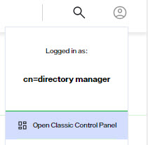

## Overview

## Global Join

A global join is a universal join condition that applies to all Root Naming Contexts configured in the RadiantOne service. If you have the need to extend all identity views with the same attributes from the same secondary sources, a global join is more efficient than configuring the join at each Root Naming Context level.  Global joins are configured from Classic Control Panel > Settings > Interception > Global External Joins. To switch to Classic Control Panel, use the menu options for the logged in user in the upper right.

For details, see: [Global Joins](../identity-view/joins#configuring-a-global-join)

## Global Interception Script

A global interception script is a "hook" that applies to all Root Naming Contexts configured in the RadiantOne service. If you have the need to extend all identity views with the same interception script capabilities, a global interception is more efficient than configuring an interception script at the identity view levels. A global interception script is configured from the Control Panel > Setup > Directory Namespace > Namespace Design, select the top node named: Root Naming Contexts. On the right side, select the ADVANCED SETTINGS tab to configure the script.

For details, see: [Global Interception Script](global-interception.md)

## Client Protocols

## Client Certificates

## Tasks

When you perform various actions in the tools or wizards, a notification appears alerting you that the task has been defined and added to the scheduler. These tasks can be viewed and updated in the Control Panel > Manage > Tasks.

For details, see: [Tasks](tasks.md)

