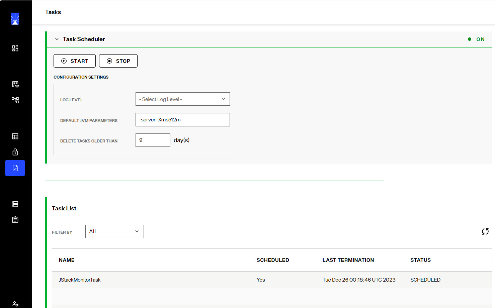
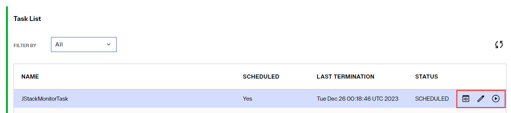

## Overview

When you perform various actions in the tools or wizards, a notification appears alerting you that the task has been defined and added to the scheduler. These tasks can be viewed and updated in the Control Panel > MANAGE > Tasks. You can define a task as re-occurring in addition to setting the execution interval. You can also configure the JVM parameters for tasks that run inside their own dedicated JVM.

 
The following operations are considered tasks and generate an event in the Task Scheduler when they occur: 
-	Initializing a persistent cache 
-	Initializing a RadiantOne Directory store 
-	Re-indexing a persistent cache
-	Exporting entries to an LDIF file
-	Importing entries from an LDIF file
-	Login Analysis (initiated from the Global Identity Builder)

## Task Scheduler Configuration

Task Scheduler parameters can be modified in the *Configuration Settings* in the Task Scheduler section. 

By default, each task executes in its own dedicated JVM. If the option “Dedicated JVM” is not checked in the specific task configuration, then the task executes inside the JVM of the scheduler. Users can customize the default JVM parameters to allow more memory, or change the performance settings. However, tuning the JVM of the task scheduler is less important than tuning the dedicated JVM for the individual task. For a full list of possible behavioral and performance options, please see the link below.

http://www.oracle.com/technetwork/java/javase/tech/vmoptions-jsp-140102.html

You can specify the number of days that completed tasks are kept on the task list for users to see. For example, if you set the parameter to “10 days” then after 10 days all of the tasks with a status of “Finished” are deleted from the system. 

## Managing Tasks 

When actions are processed as tasks, they appear in the Task List section, with information about the task displayed. The task list can be filtered by: All, Scheduled, Not Scheduled, or Terminated using the *Filter By* drop-down list. 
Tasks can be managed with the inline buttons for: *Task Details*, *Edit Task*, and *Start Task*. 

 
### Task Details

Task Details displays two tabs showing the PROPERTIES and LOGS. The task log can also be downloaded from the LOGS tab.

### Editing Tasks

To edit a task, click the pencil icon. The Task Configuration menu displays all task components. The name and status are shown, but cannot be changed. To make the task non-recurring (the task no longer repeats) uncheck the “Recurrent” box, the task runs one final time and then the status automatically changes to “Finished.” The execution interval (the frequency at which the task is executed) can be modified by changing the hours, minutes, and second boxes.

By default, all tasks run in their own dedicated JVM and the memory allocated for the task automatically expands up to ¼ of the total machine memory. For example, if the machine where RadiantOne is installed has 16 GB of RAM, the task memory expands up to 4 GB to process a task. If you prefer, you can define a max Java heap size in the JVM parameters instead of leveraging this default expansion. Other custom settings can be entered in the JVM Parameters as well. For a full list of possible behavioral and performance options, please see the link below.

http://www.oracle.com/technetwork/java/javase/tech/vmoptions-jsp-140102.html

If the “Dedicated JVM” option is unchecked, the task runs inside the JVM of the Task Scheduler.

Users must click “Update Task” before closing out of the task configuration screen to save the changes.

### Running Tasks

To manually start a task, click the *Start Task* button inline with the task.
