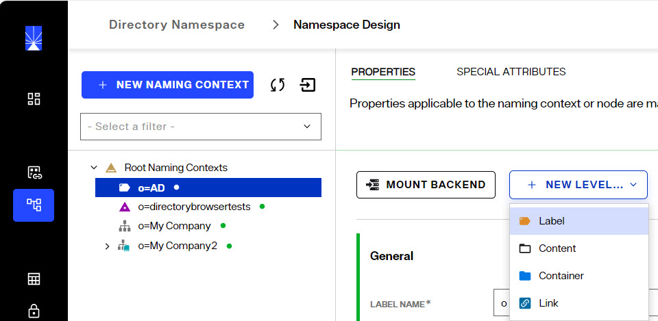
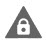
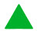
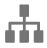
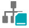

## Overview
The Directory Namespace and the Directory LDAP Schema are managed from Control Panel > Setup > Directory Namespace.

## Namespace Design
Identity views are created from the Control Panel > Setup > Directory Namespace > Namespace Design section. 

If the applications that are consuming the RadiantOne service are expecting a naming/hierarchy that matches an existing directory structure, the simplest method to creating an identity view is to use an LDAP proxy approach. To do this, create a new naming context and then mount a backend of type LDAP. 

To design an identity view that aggregates multiple data sources, create a new naming context and mount a series of label levels until you achieve the desired hierarchy. Then, mount backends at the needed labels. Once you mount a backend at a label, you cannot mount other backends at the same label level. You must define other label levels in order to mount additional backends. The options available at each level in the identity view are based on how you've defined the parent node.

### Icon Overview

Each naming context visible on the Control Panel > Setup > Directory Namespace > Namespace Design can represent a unique type of configuration. Some nodes represent a direct mapping to an LDAP directory identity source backend. Some represent nodes that are configured as persistent cache. Some nodes represent a combination of many different types of identity sources backends. The following table outlines the icons used and their meaning. This gives you global visibility into how the namespace is constructed without having to click on each node to understand the type.

Icon	| Meaning
-|-
	| Very top configuration node in the Directory Namespace. All Root Naming Contexts appear below this.
	| A Reserved RadiantOne Directory Store.
	| A RadiantOne Directory Store.
	| An identity view from an LDAP Backend created using a proxy approach.
	| An identity view that contains a link to another identity view.
 | An identity view created using a model-driven approach.
 | A label node in an identity view.
 | A container node in an identity view.
 | A content node in an identity view.
 | An identity view from an LDAP Backend created using a proxy approach that has a persistent cache defined. Click on this node and navigate to the CACHE tab to see what refresh strategy is configured.
 | An identity view from an LDAP Backend created using a proxy approach that has a merge defined to another ldap proxy view.
 | An identity view created using a model-driven approach that has been configured for persistent cache. Click on this node and navigate to the CACHE tab to see what sublevels are cached and the applicable refresh strategy.
 | A label node in an identity view that has child nodes where at least one child node has a backend or view mounted.
 | A container node in an identity view that has a link mounted below it.

## Directory Schema
