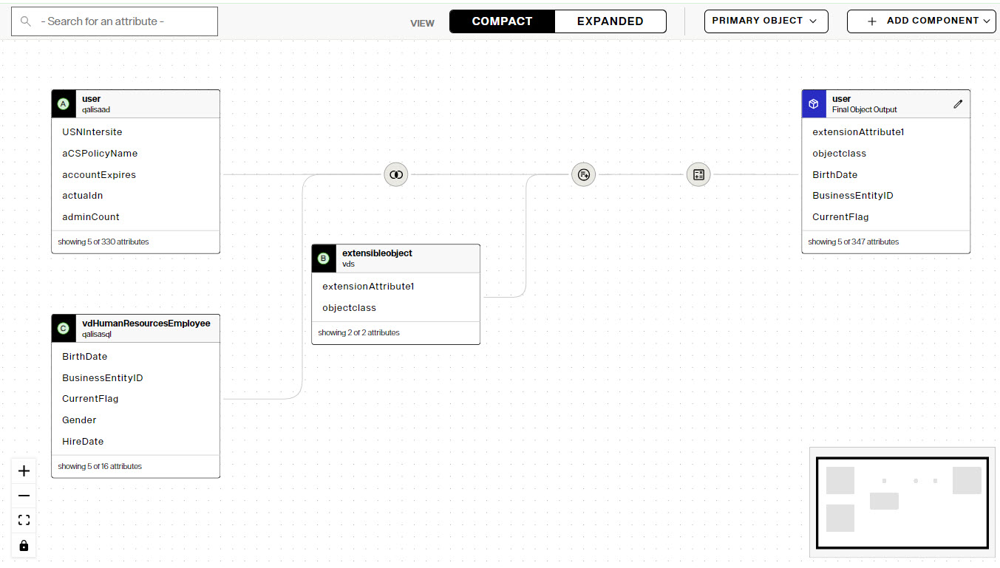
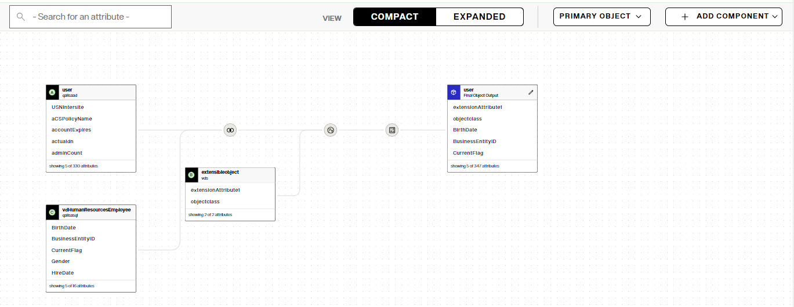
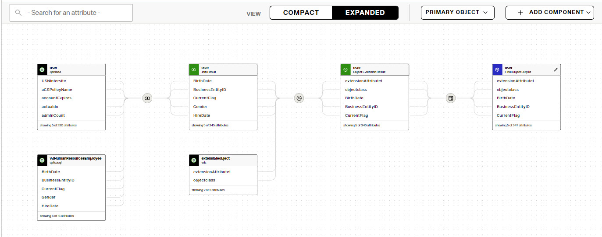
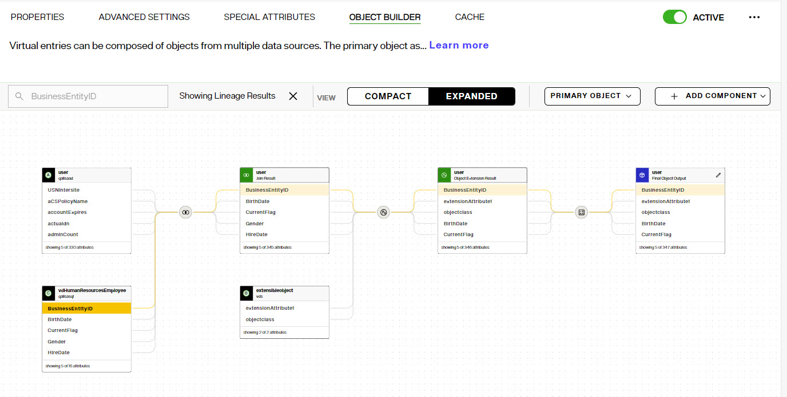
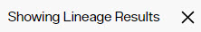
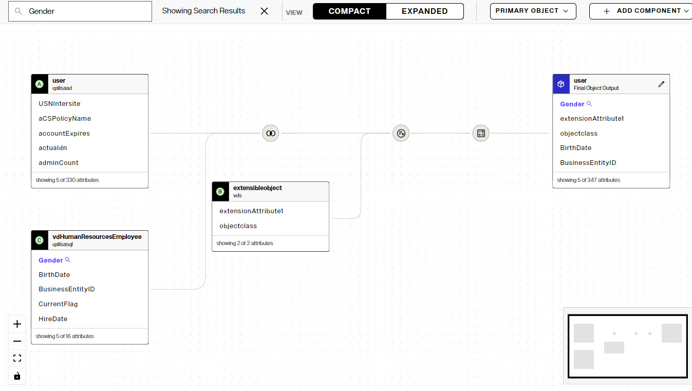

## Overview
The Directory Namespace and the Directory LDAP Schema are managed from Control Panel > Setup > Directory Namespace.

## Namespace Design
Identity views are created from the Control Panel > Setup > Directory Namespace > Namespace Design section. 

If the applications that are consuming the RadiantOne service are expecting a naming/hierarchy that matches an existing directory structure, the simplest method to creating an identity view is to use an LDAP proxy approach. To do this, create a new naming context and then mount a backend of type LDAP. 

To design an identity view that aggregates multiple data sources, create a new naming context and mount a series of label levels until you achieve the desired hierarchy. Then, mount backends at the needed labels. Once you mount a backend at a label, you cannot mount other backends at the same label level. You must define other label levels in order to mount additional backends. The options available at each level in the identity view are based on how you've defined the parent node. Container and content nodes are defined based on objects in schemas from backends, and Links allow you to mount an existing identity view at the node location. For details see [Creating Identity Views](../identity-views/intro-view-design).

### Icon Overview

Each naming context visible on the Control Panel > Setup > Directory Namespace > Namespace Design can represent a unique type of configuration. Some nodes represent a direct mapping to an LDAP directory identity source backend. Some represent nodes that are configured as persistent cache. Some nodes represent a combination of many different types of identity sources backends. The following table outlines the icons used and their meaning. This gives you global visibility into how the namespace is constructed without having to click on each node to understand the type.

Icon	| Meaning
-|-
	| Very top configuration node in the Directory Namespace. All Root Naming Contexts appear below this.
	| A Reserved RadiantOne Directory Store.
	| A RadiantOne Directory Store.
	| An identity view from an LDAP Backend created using a proxy approach.
	| An identity view that contains a link to another identity view.
 | An identity view created using a model-driven approach.
 | A label node in an identity view.
 | A container node in an identity view.
 | A content node in an identity view.
 | An identity view from an LDAP Backend created using a proxy approach that has a persistent cache defined. Click on this node and navigate to the CACHE tab to see what refresh strategy is configured.
 | An identity view from an LDAP Backend created using a proxy approach that has a merge defined to another ldap proxy view.
 | An identity view created using a model-driven approach that has been configured for persistent cache. Click on this node and navigate to the CACHE tab to see what sublevels are cached and the applicable refresh strategy.
 | A label node in an identity view that has child nodes where at least one child node has a backend or view mounted.
 | A container node in an identity view that has a link mounted below it.

### Introduction to the Object Builder

The Object Builder is used to customize how entries associated with a specific object class are joined, how attributes are remapped for specific object classes, defining attributes properties (e.g. updateable, searchable, hidden), and managing computed attributes.

Access the Object Builder from the Control Panel > Directory Namespace > Namespace Design. Select the node below Root Naming Contexts and go to the OBJECT BUILDER tab.

*Canvas* - The main area of the Object Builder is the canvas. This is where objects that will comprise the final RadiantOne entries appear. 

*View* - the view options are: COMPACT (default) and EXPANDED. The compact view doesn't display intermediate join result objects, whereas the expanded view does. You can also track attribute lineage in the expanded view.

The following images depict the difference between compact view (shown first) and expanded view (the same canvas, shown in expanded view).

*Attribute Lineage* - Attribute lineage allows you to visualize how an attribute of the final object makes its way from source objects. Switch to expanded view and then click on an attribute in the final output object. The attribute lineage is highlighted allowing you to track the origin(s).

To remove the lineage highlighting from the canvas, click the *X*: 

*Search Attributes* - The "Search for an attribute" box on the top left allows you to locate an attribue in any object shown on the canvas. The search results are shown in blue text in the objects on the canvas. In the example shown below, the attribute "Gender" is entered and the search results are shown in blue in the objects identified as origin C and the final object output.

*Primary Object* - The Primary Object option is only shown for objects from LDAP proxy views. Use this menu to select a primary object from the source view and/or managing primary objects (add or remove) on the canvas.

*Add Component* - The Add Component drop-down allows you add objects to the canvas and add joins.

*Moving Objects on Canvas* - to move the objects around on the canvas, either left-click the mouse on the canvas (NOT on any objects) and move the objects (they move around as a whole image), or you can use the +/-/[] buttons on the bottom left to zoom in/zoom out/fit to the window.

*Node Details* - Click on an object in the canvas to access the Node Details panel. You can delete secondary nodes from here. To remove primary object nodes (only applicable to LDAP proxy views), use: Primary Object > Manage Primary Object

For details on joining objects see: [Joins](/joins.md)

## Directory Schema
Applications can request the directory schema by issuing a search with a base DN of *cn=schema*. The object classes and attributes defined in the schema are managed from the Control Panel > Setup > Directory Namespace > Directory Schema section. 
For details, see [Managing Directory Schema](../directory-stores/managing-directory-schema).
