## Overview

If you don’t have a single source of users, an application would have to look in all the different data stores across the enterprise to find a particular user. Even if a user is listed in only one store (unless that exact store is already known), an application still needs to locate them, resulting in multiple queries issued (at least one to each source the user could potentially be located in). However, if you have a master index (an “identity hub”), the application only needs to query this list to locate a user, which results in queries to only the backend stores where the user is located. The more sources involved, the more valuable this global index is. It is this global list that is created and maintained by RadiantOne.

In cases where the data stores contain user overlap, RadiantOne performs aggregation and correlation, creating a common key to identify users across disparate systems. However, the union operation is still important for data sources that may or may not have identity intersection. If they do not have identity overlap there is no need for correlation, but the function of union is still crucial for building your identity service.

The diagrams below provide a summary/review of data sources containing duplicate/intersecting identities.

In the first scenario, the data sources have no overlap of identities. In this scenario the benefits of union would still be important for identity management since a single unique index/list is still required for applications to identify a user for authentication. However, the design effort is a bit easier as no correlation logic is required. An aggregation of sources A, B, and C is sufficient, so the primary design consideration in this case is what hierarchy applications are expecting and to build this namespace accordingly.

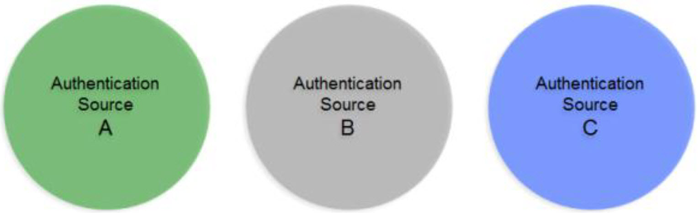
 

In cases where there starts to be user overlap (as seen in Sources A and B in the diagram below), the configuration starts to require correlation. In this scenario, an aggregation of users from sources A, B and C is required in addition to correlation for the overlapping users in sources A and B. The design considerations now involve correlation logic in addition to where you want the unique list of users to appear in the virtual namespace.

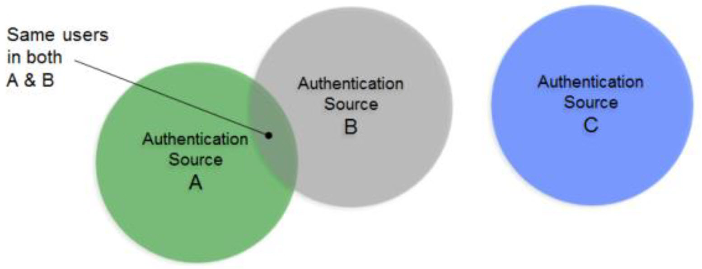
 

In scenarios where the number of data sources increases, the amount of overlapping identities varies (as depicted in the diagram below), and the logic required to correlate identities becomes complex with the possible need of cascading rules to determine correlation. 

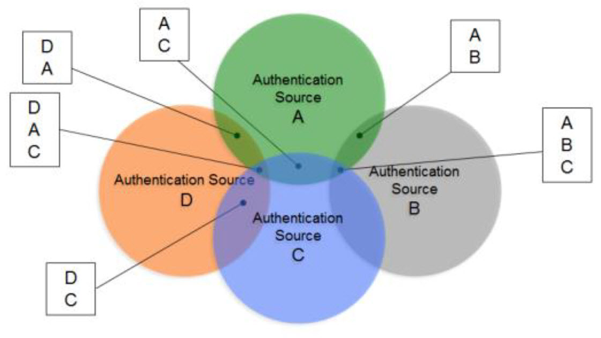
 

The RadiantOne Identity Data Analysis tool analyzes the quality of data in the backends, helping you determine which attributes would be the best candidates for correlation rules. 

The Identity Data Analysis tool generates a report for each of your data sources. These reports give you a glimpse of your existing data and provide insight on the quality of your data and what is available for you to use for correlation logic. 

>[!warning] 
>You can also choose to mount virtual views from each of your data sources below a global root naming context in RadiantOne and point the Identity Data Analysis tool to this location to perform a single analysis/report from all of your sources at once. This helps you detect attribute uniqueness and statistics across heterogeneous data sources.

## Using the Identity Data Analysis Tool

The Identity Data Analysis tool is accessible from the Classic Control Panel > Wizards tab. 

>[!note]
>Images displayed in this guide are meant to describe expected behavior of features in RadiantOne. Your results may vary from those shown in this guide as data sets are subject to change at any time.


## Working with Datasets

The first page of the Identity Data Analysis tool offers two options: [Creating a New Dataset](#creating-a-new-dataset) and [Using an Existing Dataset](#using-an-existing-dataset). These options are discussed in this chapter. 

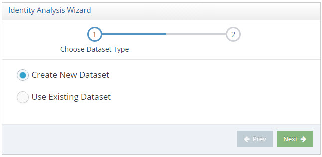
 
### Creating a New Dataset

This option generates and analyzes an LDIF file based on your specifications. Creating a new dataset is the default option on this page. This option allows you to select a point of analysis within the RadiantOne namespace. 

>[!warning] 
>You can mount virtual views from each of your data sources below a global root naming context in the RadiantOne namespace and point the Data Analysis tool to this location to perform a single analysis/report from all of your sources at once. This helps you detect attribute uniqueness and statistics across heterogeneous data sources.

There are two default LDAP filters that can be used for creating a new data set – one for identities and one for groups – and allows you to provide an export location and file name for the LDIF that the Data Analysis tool generates. 

>[!note]
>The RadiantOne service must be running to create a new dataset.

To create a new dataset: 

1.	Click the Create New Dataset option and click Next. The Create New Dataset page displays.
	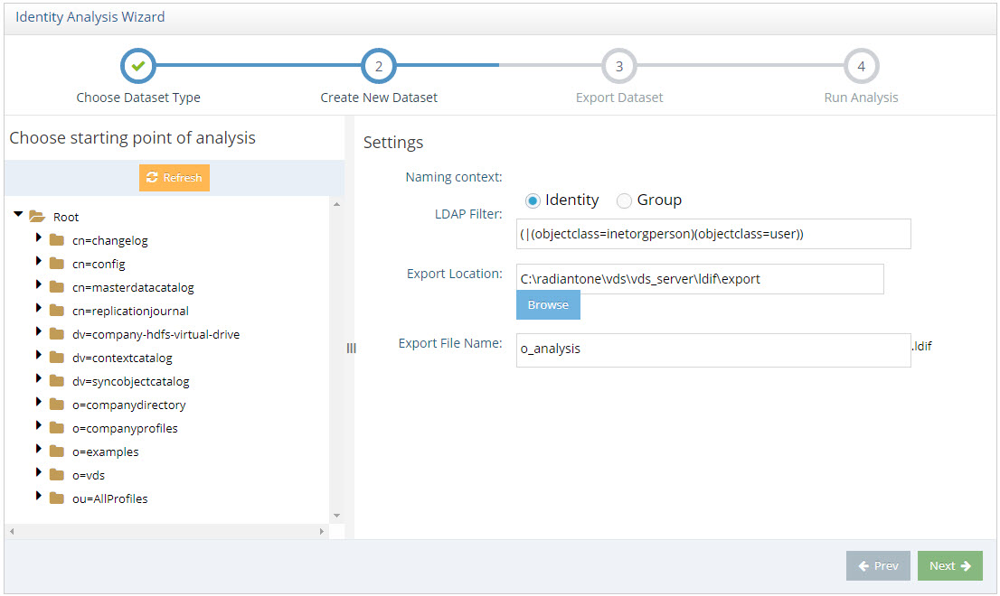

1.	Select a branch in the Directory Tree in the left pane. 

1.	Select Identity or Group depending on the type of object you want to analyze. These but-tons modify the default LDAP filter. Selecting the Identity option sets the default identity LDAP filter to:

```
(|(objectclass=inetorgperson)(objectclass=user))
```

1.	Selecting the Group option sets the default group LDAP filter to: 

```
(|(objectclass=group)(objectclass=groupOfNames)(objectclass=groupOfUniqueNames))
```

1.	If necessary, modify the LDAP filter to match your data. In this example, the LDAP filter is modified as follows. 
(|(objectclass=inetorgperson)(objectclass=vdAPPEMPLOYEES))

1.	Specify an export location. The default export location (based on a default RadiantOne FID installation) is:
<RLI_HOME>\vds_server\ldif\export

1.	Verify the export file name. The export file name is based on the selected branch in the virtual namespace. 

>[!note]
>Avoid using invalid characters (< > : " / \ | ? or *) in the file name.

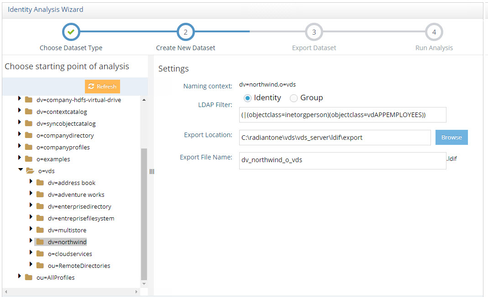


1.	Click Next. 

1.	Wait for the message “Dataset exported successfully”. The time to export the data into an LDIF file varies depending on the number of entries in the naming context being export-ed.

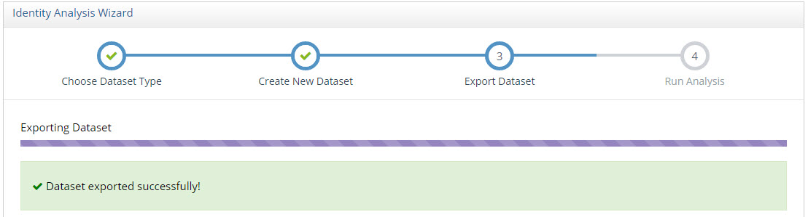


1.	Click Run Analysis. The data analysis process time varies depending on the size of the LDIF file.

>[!note]
>If you click the Run Analysis button to analyze an LDIF that has already been created without moving or renaming the output .csv and .xls files, they are overwritten.

### Using an Existing Dataset

If an LDIF has already been generated, you can use the Data Analysis tool to analyze it. 

To analyze an existing dataset: 

1.	In the Data Analysis tool, click the Use Existing Dataset option and click Next. 

1.	Click the Browse button next to the LDIF File Path field, and navigate to the pathname of the LDIF to be analyzed.
	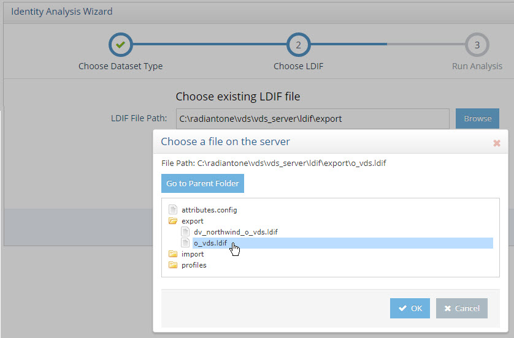

1.	Click OK. 

1.	Click Run Analysis. The Identity Data Analysis Tool displays the Summary tab. 

### Data Analysis Results

When data analysis is complete, four tabs are displayed at the top of the Data Analysis window. The Summary tab is displayed by default. 

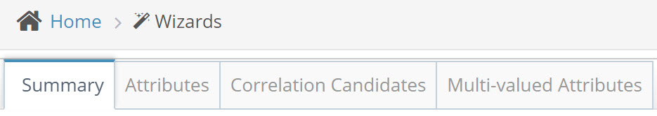

The four Data Analysis tabs are described in the following sections. 

[Summary Tab ](#summary-tab)

[Attributes Tab](#attributes-tab)

[Correlation Candidates Tab](#correlation-candidates-tab)

[Multi-valued Attributes Tab](#multi-valued-attributes-tab)

## Summary Tab

The Summary tab compiles the results of the analysis and displays the total number of entries that matched the parameters in the analyzed LDIF file. It lists the size (in KB) of the largest entry and average entry size. The twenty biggest entries are displayed. To sort a column in ascending or descending order, click a column header. 

Understanding entry size can help in developing a strategy for sizing memory and disk space for HDAP storage, including caching. 

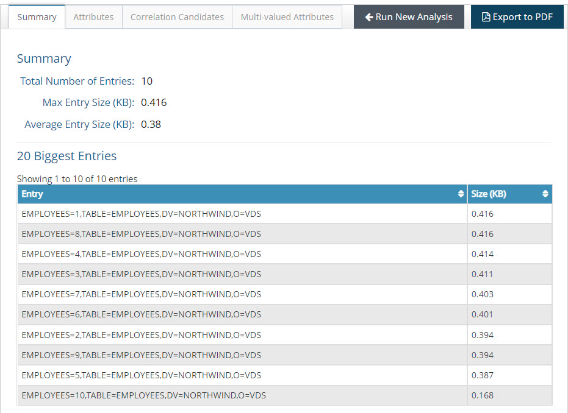

The Run New Analysis button restarts the analysis process and returns you to the Choose Dataset Type. 

>[!note]
>Re-starting the analysis process over discards your current analysis re-sults.

To export your data analysis to PDF, click the Export to PDF button. The Export to PDF button generates a PDF report of the entire analysis, which it displays in a PDF web viewer in a new browser tab. You may then download and save the generated PDF file. 

## Attributes Tab

The Attributes tab aggregates and displays statistics for every attribute of the entries analyzed by the Data Analysis tool. The analysis of each attribute is divided into two groups: [Entry Statistics](#entry-statistics) and [Value Statistics](#value-statistics). To display entry and value statistics for a different attribute, select the attribute from the column on the left side of the window. 

Review the Entry Statistics and Value Statistics pie charts (located below the biggest and smallest counts sections). These charts display the counts for the analysis of the selected attribute. In this example, the CITY attribute is selected. 


### Entry Statistics

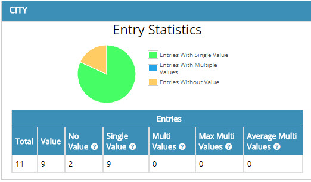

Values in the Total column indicate the number of entries in the analyzed data set. This value is the same for all the attributes (11 in this case, as seen above). This means there are 11 entries containing these attributes. 

Values in the Value column indicate the number of entries which contain some value for the analyzed attribute. In the example used for this section, the attribute CITY has a value of 9, which implies that out of the 11 entries in the database data source, 9 have a value for the CITY attribute. 

Values in the No Value column indicate the number of entries which contain no value for the analyzed attribute. This column is the opposite of the “Value” column. So for the CITY attribute, the value for the No Value column is 2, implying that two identities do not have a value for the CITY attribute. 

Values in the Single Value column indicate the number of entries which contain only one value for the analyzed attribute. 

Values in the Multi Values column indicate the number of entries which contain more than one value for the analyzed attribute. For example, let’s say a single identity (uid=Aggie Newcombe) has 2 title values, one is “Guru Inside Sales Manager” and another is “Account Manager” (shown below). In this case, the value for Multi Values for the Title attribute would be 1 indicating one entry has multiple values for the Title attribute.

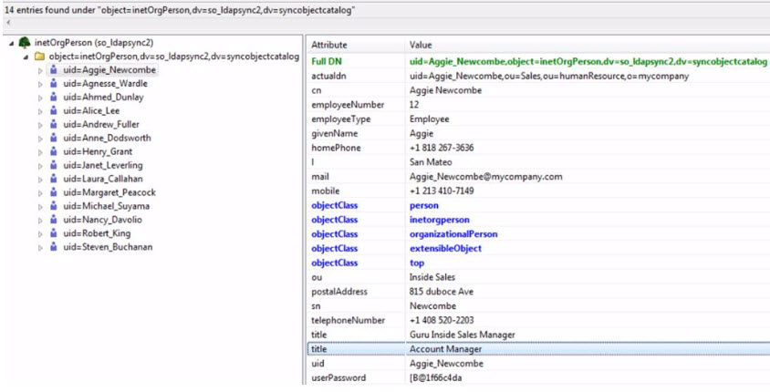

If entries have multiple values for the analyzed attribute, then the Max Multi Value column indicates the maximum number of values. In the image above, one entry associated with the Title attribute has two values for Title. So, the counter for the Max Multi Value column is 2. Similarly, if the source contained an identity with 3 values for the Title attribute and another identity contained four values for its Title attribute, then the Max Multiple Value column would have a value of four.

If entries have multiple values for the analyzed attribute, then the Average Multi Value indicates the mean quantity of values. This value is derived by dividing the total count of multivalues by the number of entries containing a multi-value, rounded to the closest integer. 

### Value Statistics

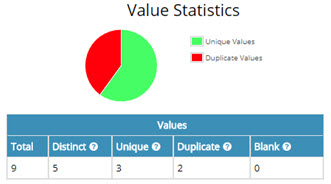
 
Values in the Total column indicate the number of attribute values among all entries. An entry that does not have values for the attribute does not contribute any amount for the value analysis; an entry that has one value contributes one value for the value analysis and so on. The image above shows that the attribute CITY has a count of 9 for the Values column. This implies that this attribute has 9 entries which are used for the value analysis.

Values in the Distinct Values column indicate the number of distinct (different) values in the analyzed attributes. For example, based on the database object analyzed, the count for number of distinct values for the attribute CITY is 5. A table with FIRSTNAME and CITY values for our database would look something like the following. 


Values in the Unique Values column indicate the number of values that occur only once in the attribute values. From the table above, the number of unique values of CITY for our database source is 3 (Kirkland, Redmond, and Tacoma) since these values occur only once each in the database source.

>[!note]
>Distinct values = `<Unique Values> + <Duplicate Values>`.

Values in the Duplicate Values column indicate the number of values that occur more than once in the database source. To continue with the example above, this value would be 2 for the CITY attribute - London and Seattle.

Values in the Blank Values column indicate the number of blank (empty) values for the analyzed attribute. Before analysis, the value is trimmed (spaces deleted at the beginning and end of the value). The result for blank values in the analysis used in this section is 0, which means that no entries had blank values for the attributes analyzed.

Below the pie chart, click the  button to the right of Distinct Values Biggest/Smallest Counts. 


The Distinct Values Biggest/Smallest Counts table displays. 

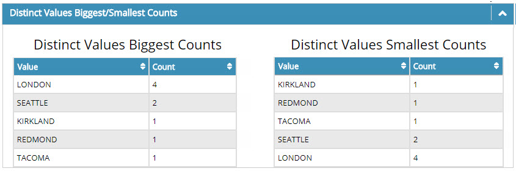

Review the Biggest Counts section (located below the Entry and Value statistics). This section lists the different values for the CITY attribute starting with the most-used value. A similar section named “Smallest Counts” lists the values for the attribute CITY starting with the least-used value.

Below the Distinct Values Biggest/Smallest Counts section, click the  button to the right of Entries with the most values in `<attributename>` header. 

>[!note]
>This section displays for multi-value attributes only.


The values in the Count column in this table indicate the number of values found for the analyzed entry. In the example below, the entry cn=Aggie Newcombe has six values for the objectclass attribute. 

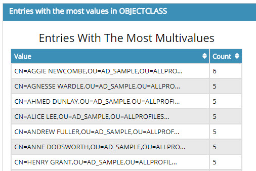

## Correlation Candidates Tab

The Identity Data Analysis tool helps you determine which attributes would be the best candidates for correlation rules. The best attributes to base correlation logic on are ones that are not empty and have unique values for all entries. 

For example, if, after analysis, the report indicates an attribute named “EmployeeID” has values for only half the user population in your backend data source, this might not be the best attribute to use in correlation rules. Or if the analysis report indicates that the same “EmployeeID” value is used for more than one entry, this would also mean that it is not the best attribute to base correlation rules on (unless of course the entries with the same “EmployeeID” value do in fact represent the same person, meaning the identity has more than one entry in the same data source). 

Once you’ve determined the best attributes for correlation rules, the Global Identity Builder can be used to build a unique view of overlapping identities. For more details, see: [Global Identity Builder Guide](/configuration/global-identity-builder/introduction)

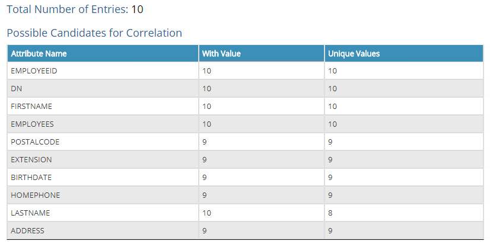


### Multi-valued Attributes Tab

The Multi-valued Attributes tab shows maximum multiple values and average multiple values by attribute. It also shows which groups have the highest number of values by attribute. This can be useful, for example, to examine the number of members (based on the member or, uniquemember attributes). 

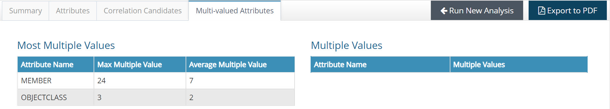

To display data for a multi valued attribute, click an attribute in the Most Multiple Values table on the left. The `<ATTRIBUTE>` Multiple Values table on the right populates. In the example below, the MEMBER attribute is selected and the table on the right shows a list of groups and the number of values in the MEMBER attribute (meaning number of members) for each. For example, you can see that there is 24 members in the CN=GLOBAL,OU=VIRTUAL GROUPS,OU=ALLPROFILES group. 
 
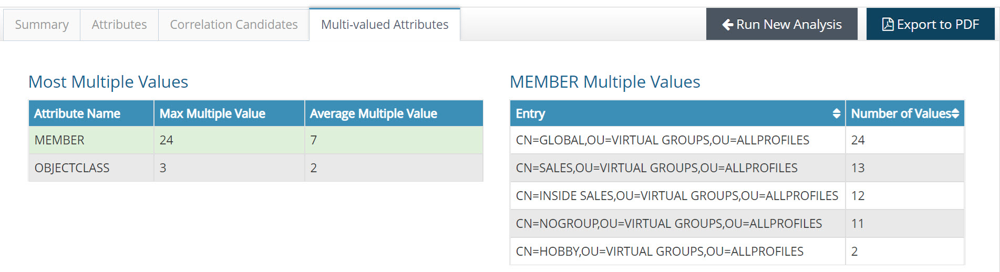
