## Creating Identity Views

There are two main design approaches to creating identity views.
 1. Using an LDAP proxy approach, where the identity view deployed in RadiantOne represents an exact hierarchy (or specific sub-branch) of an existing LDAP directory data source. With this view design approach you are limited to the exact hierarchical structure of the existing directory store backend.
 2. Using a model-driven approach, where the identity view deployed in RadiantOne can be designed based on the metadata extracted from existing identity sources. With this view design approach you have infinite flexibility and can create relatively flat views, or very complex hierarchies. Use the model-driven approach to create identity views from LDAP, JDBC-accessible data sources and Custom data sources.

## LDAP Proxy Views Overview

Identity views can be configured for LDAP directories and are associated with a specific root naming context. A root naming context is the very top level in the RadiantOne namespace, and you can have many different root naming contexts. This section describes how to create root naming contexts for mounting identity views from LDAP directory backend data sources. 

### Configuration

If you configure the LDAP backend directly at the Root Naming Context, it is the only backend that can be mounted at this specific naming context. If you want to comprise the identity view from many different backends, choose the Virtual Tree option for the type of backend to mount instead of LDAP. The virtual tree option allows you to define child nodes using labels and then you can mount different backends at each label level.

1.	First, data sources for each backend must be defined. From the Control Panel > Setup > Data Catalog > Data Sources, click . Use the Active Directory, Generic LDAP, Open DJ or RadiantOne directory template to define data sources.

2.	In the  Control Panel > Setup> Directory Namespace > Namespace Design, click . 

3.	Enter the new root naming context and click **SAVE**.

4.	Click .

5.	Select the **LDAP** backend type and click **SELECT**.
6.	Select the data source defined in step 1.
7.	Click  to select a remote base DN.

8.	Click **MOUNT**.

>[!note] For every virtual view of an LDAP backend you create, a file containing the schema definition is created. The schema file is stored on the file system at <RLI_HOME>\vds_server\lod\<normalized root naming context where the view is mounted>.orx. An LDIF formatted file containing the schema is also saved in the lod folder (with the same name as the .orx file) and is used to retrieve object class and attribute definitions if the metadata is used to extend the RadiantOne LDAP schema. For details see [RadiantOne LDAP schema](/directory-stores/managing-directory-schema).

9.	If you need to modify the LDAP backend configuration, select the appropriate node below Root Naming Contexts and modify the settings on the right side. Click **SAVE** when finished.

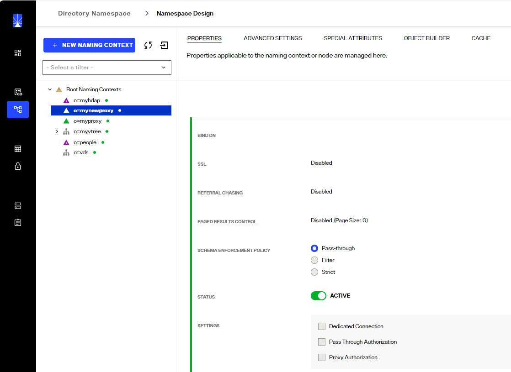
 
Figure 3.2: Modifying an LDAP Backend Configuration

LDAP Backends can also be configured at any label node in a virtual directory tree naming context. For details on this, please see [Virtual Views based on Multiple Types of Backends](03-virtual-view-of-ldap-backends).

### Host 

Server name or IP address.

### Failover Servers

You can list replica servers in the Failover LDAP Servers section. The only properties to indicate are server/host, port and if the port is for SSL. The same bind DN and password listed in the primary server are used to connect to the failover servers. If a connection to a backend fails, RadiantOne tries to connect to the primary server again. After two failures, RadiantOne connects to the failover servers in the order they are listed.

>[!note] At DEBUG log level, the following comments are shown in the <RLI_HOME>/vds_server/logs/vds_server.log indicating that RadiantOne has exhausted connection attempts and is switching to a failover server.   After several tries (2), new resource could not be acquired: Cannot assign requested address.     Followed by:   Error connecting to: ldap://<primary_server>/, switching to failover backend: ldap://<failover_server>

### Port

Port that the server is listening on. 

### Bind DN

Service account user DN. This user is used by RadiantOne to create connections to the backend LDAP directory. 

### Bind password

The password for the user specified in the Bind DN parameter.

### Pass Thru Authorization

Pass thru authorization is for determining which account RadiantOne uses to connect to a backend directory and ultimately how access rights (authorization) is enforced. A high-level diagram detailing the behavior is shown below.

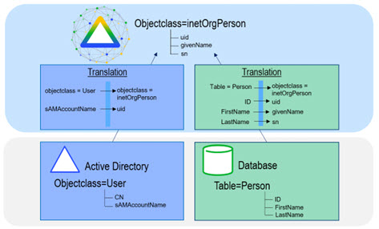

Figure 3: Pass Thru Authorization
 
This functionality is best described with examples. The following three examples/diagrams detail the different configurations possible.

>[!warning] This feature (and the description below) is for AUTHORIZATION.

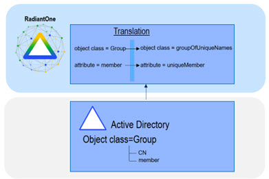
 
Figure 4: Sample Proxy Configuration

In the diagram above, there are two different proxy views configured in RadiantOne. One for an Enterprise Directory mounted in the virtual namespace below dc=server1people,ou=global,o=vds. The other one is for a Partner Directory and is mounted in the virtual namespace below dc=server2,ou=global,o=vds.

If there is a service account credential (user Bind DN/password) specified in the data source representing the backend for the LDAP proxy configuration, the person that successfully binds to RadiantOne uses this account when searching, adding, modifying, or deleting information in the corresponding backend directory. In other words, anyone who binds successfully has the access rights defined for the service account user. This is called delegation.

The example below explains what happens when a service account credential defined in the data source.

Data Source for Server 1 in this example is:

`Hostname: Server1`
 `Port:1389`
 `Base DN: o=airius,dc=server1`
 `Bind DN (service account): cn=specialuser,ou=people,o=airius,dc=server1`
 `Bind Password: password`
 `Data Source for Server 2 in this example is:`
 `Hostname: Server 2`
 `Port: 389 `
 `Base DN: dc=server2`
 `Bind DN (service account): cn=superuser,dc=partners,dc=airius,dc=com,dc=server2`
 `Bind Password: password2`

**Example 1: No Pass Thru Authorization**
 If user: “cn=joe,dc=partners,dc=airius,dc=com,dc=server2,ou=global,o=vds” binds successfully to RadiantOne and accesses the dc=server2,ou=global,o=vds branch (the same backend server that processed the bind request), then his access rights to the data are determined by the service account user credentials in the backend server (“cn=superuser,dc=partners,dc=airius,dc=com,dc=server2”).

If “cn=joe,dc=partners,dc=airius,dc=com,dc=server2,ou=global,o=vds” accesses the dc=server1people,ou=global,o=vds branch, then he has the access rights associated with the service account user specified in the data source for server 1 (“cn=specialuser,ou=people,o=airius,dc=server1”).

If user “cn=aaron,ou=people,o=airius,dc=server1people,ou=global,o=vds” binds successfully and accesses the dc=server1people,ou=global,o=vds branch, then he has the access rights associated with the service account user specified in data source, “uid=specialuser,ou=people,dc=server1”.

If “cn=aaron,ou=people,o=airius,dc=server1people,ou=global,o=vds” accesses the dc=server2,ou=global,o=vds branch, then he has the access rights (assigned in the underlying server) associated with the service account user: “cn=superuser,dc=partners,dc=airius,dc=com,dc=server2”.

With this configuration approach, any user that successfully binds (anywhere in the RadiantOne namespace), no matter what proxy branch in the virtual namespace they access, has the same access rights (because they inherit the access rights of the service account Bind DN user).

**Example 2: Using Pass Thru Authorization**
 The three LDAP proxy definitions shown in the diagram below are used to explain the Pass Thru Authorization feature.

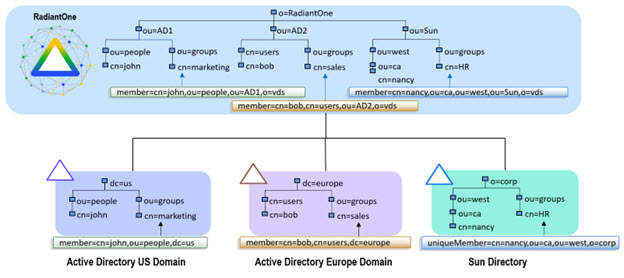
 
Figure 5: Sample Proxy Configuration

Data Source for Server 1 in this example is:

`Hostname: Server1`
 `Port: 1389`
 `Base DN: ou=People,o=airius,dc=server1`
 `Pass Thru Authorization: Enabled`

Another Proxy Configuration for Server 1 (with a different Base DN) is:

`Hostname: Server 1`
 `Port: 1389 `
 `Base DN: ou=temps,o=airius,dc=server1`
 `Pass Thru Authorization: Enabled`

Data Source for Server 2 in this example is:

`Hostname: Server 2`
 `Port: 389 `
 `Base DN: dc=server2`
 `Pass Thru Authorization: Enabled`

If no service account credentials (Bind DN/Bind password) are configured in the data source, and Pass Thru Authorization is enabled on the proxy view, then the user that binds successfully has access rights that are defined for them in the directory where they have been authenticated. This is known as impersonation. RadiantOne impersonates this user when performing operations on the underlying server.

For example, if user “cn=aaron,dc=server1people,ou=global,o=vds” successfully binds and accesses the dc=server1people,ou=global,o=vds branch, he is assigned the access rights that have been defined in Server1 for him.

If “cn=aaron,dc=server1people,ou=global,o=vds” accesses the dc=server1grp,ou=global,o=vds branch (since dc=server1people and dc=server1grp are different proxy views to the SAME data soure), Aaron also uses the access rights that have been defined in Server1.

However, if Aaron accesses the dc=server2,ou=global,o=vds branch, he is only allowed anonymous access to this server (because no service account was specified in the data source configuration and Aaron did not originally bind to dc=server2).

**Example 3: Advanced Capability of the Pass Thru Authorization**

The two LDAP proxy definitions shown in the diagram below are used to explain the Pass Thru Authorization feature when there is also a service account Bind DN specified in the data source configuration.

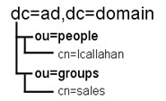
 
Figure 6: Sample Proxy Configuration

Data Source for Server 1 in this example is:

`Hostname: Server1`
 `Port:1389`
 `Base DN: o=airius,dc=server1
Bind DN (service account): cn=specialuser,ou=people,o=airius,dc=server1`
 `Bind Password: password `
 `Pass Thru Authorization defined on the proxy view defined: Enabled`

Data Source for Server 2 in this example is:

`Hostname: Server 2`
 `Port: 389 `
 `Base DN: dc=server2`
 `Bind DN (service account): cn=superuser,dc=partners,dc=airius,dc=com,dc=server2`
 `Bind Password: password2`
 `Pass Thru Authorization defined on the proxy view defined: Enabled`

If a service account (Bind DN/Bind Password) is specified in the data source and the Pass Thru Authorization feature is enabled on the proxy view, then, as in the previous sample, a user that successfully binds has the access rights that have been defined for them in the corresponding server (impersonation). 

For example, if user “cn=aaron,ou=people,dc=server1people,ou=global,o=vds” successfully binds and accesses the dc=server1,ou=global,o=vds branch, then he has the access rights that have been defined for him in Server1. In this case, the specific user that binds access rights override those of the user in the Bind DN parameter in the data source definition. As mentioned before, this is known as impersonation. RadiantOne connects to the backend LDAP server with the user who binds successfully, and the access rights allowed for them are applied when performing all operations (the backend LDAP enforces access rights).

If user “cn=joe,dc=partners,dc=airius,dc=com,dc=server2,ou=global,o=vds” successfully binds to RadiantOne and accesses the dc=server1,ou=global,o=vds branch, he has the access permissions assigned to the service account user that is specified in the Bind DN parameter of the LDAP data source for server 1. Since “cn=joe,dc=partners,dc=airius,dc=com,dc=server2,ou=global,o=vds” was NOT authenticated to the backend LDAP server that he is now trying to access, he only has the access rights that have been allocated to the service account user (“cn=specialuser,ou=people,o=airius,dc=server1”). This is known as delegation. Had there not been a service account specified for Server 1, Joe would have anonymous access (as described in Example 2 above).

### LDAP Controls

A control is additional information that can be included in an LDAP request or response. RadiantOne can play the role of both an LDAP server and an LDAP client to other backend directories. To understand controls supported by RadiantOne as an LDAP server, see the [RadiantOne System Administration Guide](/sys-admin-guide/01-introduction)
. RadiantOne’s handling of LDAP controls as a client to a backend directory is described in this section.

**VLV/Sort**

If a client searches and passes the VLV control against a branch that is associated with an LDAP directory backend (not a persistent cache or a Universal Directory store), RadiantOne forwards the search request along with the included control to the backend LDAP server. In this case, it is the responsibility of the backend LDAP server to implement the VLV control. RadiantOne returns any controls received from the LDAP backend to the client.

**Paged Results**

If the backend LDAP directory supports the paged results control, RadiantOne can request that the results from the backend be returned in pages. The support for paging is enabled, and the page size is set, at the level of the LDAP data source definition.

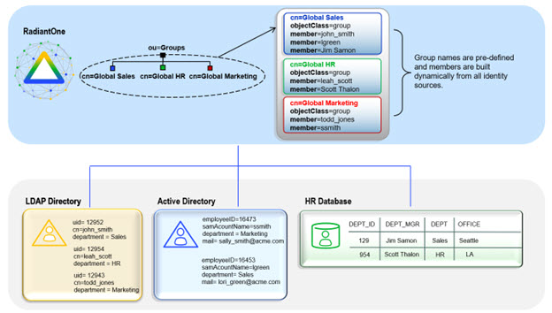

Figure 7: Paged Results Control for an LDAP Backend

**Controls Passed from Client Requests**

All LDAP controls that RadiantOne receives from clients during LDAP modify, modifyDN, add, or delete requests are forwarded to the backend LDAP directory. An example would be a client sending a modify request for a user’s password to RadiantOne along with LDAP Control 1.2.840.113556.1.4.2239. RadiantOne would send the password update to the backend directory along with the LDAP control. The backend directory is the enforcement point for the control. RadiantOne responds to the client with all information returned from the backend directory.

**Pre-Read Attributes**

This control indicates that all modify, modify DN, and delete requests should include the pre-read control to retrieve the specified attribute’s value(s) as they appear immediately before the operation has been processed. Pre-read controls may be used to obtain replaced or deleted values of modified attributes or a copy of the entry being deleted. The backend directory is the enforcement point for the control. RadiantOne responds to the client with all information returned from the backend directory.

**Post-Read Attributes**

This control indicates that all add, modify, and modify DN requests should include the post-read control to retrieve the specified attribute’s value(s) as they appear immediately after the operation has been processed. Post-read controls may be used to obtain values of operational attributes, such as the “entryUUID” and “modifyTimestamp” attributes, updated by the server as part of the update operation. The backend directory is the enforcement point for the control. RadiantOne responds to the client with all information returned from the backend directory.

**Proxy Authorization**

When RadiantOne acts as a client and connects to a backend directory, certain credentials are used (e.g. the Bind DN and Bind Password configured in the data source connection string). These credentials determine what operations are allowed and it is the backend directory which enforces authorization for this user. Some directories support the Proxy Authorization control allowing a client to switch the user ID, for authorization purposes, without having to re-authenticate with a new connection. If the backend directory supports the Proxied Authorization control, and there is the need to base authorization on a different user than the one who authenticated, you can enable the Proxy Authorization checkbox. With this approach, RadiantOne can use certain credentials (e.g. the Bind DN and Bind Password configured in the data source connection string) when connecting to the backend directory and pass the needed control along with the user DN of the person they want to represent for authorization in the requests. The backend directory checks the proxy authorization rules that have been configured to make sure the service account RadiantOne used to connect with is allowed to represent the person passed in the request. If so, the service account is allowed to perform any operations the person it is impersonating would be allowed to do. Again, for this functionality to work, the Proxy Authorization control must be supported by the backend directory and proxy authorization rules must be properly defined in the backend directory. A high-level diagram detailing the behavior is shown below.

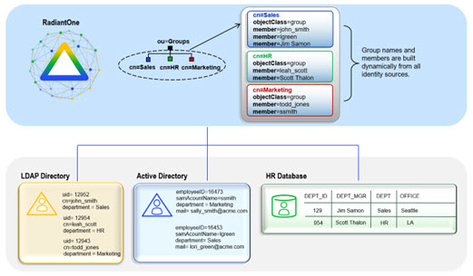

Figure 8: Proxy Authorization
 
### Role Mapped Access

If proxy impersonation rules are defined at the level of the LDAP data source associated with the proxy virtual view, you can check the Role Mapped Access option to enable them. If the Role Mapped Access option is not checked, any impersonation rules defined for the LDAP backend data source associated with the selected proxy view are not used. 

For details on defining proxy impersonation rules for LDAP data sources, please see the [RadiantOne System Administration Guide](/sys-admin-guide/01-introduction)

A high-level diagram detailing the behavior is shown below.

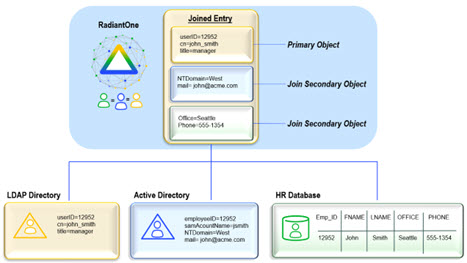

Figure 9: Role-mapped Access
 
### Remote Base DN

The Remote Base DN is the starting point to search from in the backend directory. This is set when you create the data source and can be changed later if needed by selecting the root naming context node representing the virtual view associated with the backend. On the right side, select the Proxy Backend tab. Either enter the base DN, or click the **Browse** button to select the location in the backend directory tree.

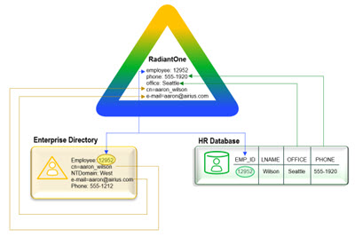

Figure 10: Proxy Backend Settings

All entries below the remote base DN a
re displayed when clients navigate below the mapped base DN location in the RadiantOne namespace.

### Mapped Base DN

The value here is determined from the hierarchy built in the first step. This is the DN that clients access to retrieve the data from RadiantOne and is set when you create the data source.

### DN Remapping

This setting allows for automatic re-mapping of attributes of DN syntax type. This functionality is primarily useful for existing groups/members in an LDAP backend. When an LDAP backend is configured, you have the option to return the group members “real” DNs (as they exist in the backend directory), or to re-map them to the DN for the RadiantOne namespace. For example, the figure below depicts a proxy view that has been defined for a backend LDAP directory. The routing happens at the ou=SunOne,ou=RemoteDirectories,o=vds level in the RadiantOne namespace.

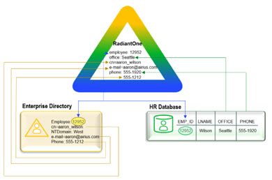

Figure 11: LDAP Backend Attributes Defined with DN Remapping

For the selected LDAP Backend, click on the **Attributes** tab. If there are no attributes defined with DN Remapping in this list, then all attributes that have the DN syntax data type will be returned with the DN that exists in the backend LDAP directory. For example, the figure below shows the HR Managers group members, and you can see that they contain the real DN (for the uniqueMember attributes) that exists in the backend LDAP because there is no DN Remapping defined for the uniquemember attribute (i.e “uid=LCallahan,ou=People,dc=toshiba,dc=com”).

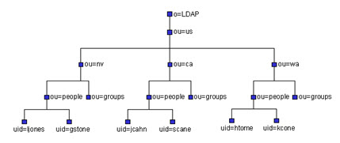 

Figure 12: Sample of Actual DN (non-remapped) Returned for Uniquemember

Now, if you enter a specific attribute name that contains a DN value that you want to re-map for the RadiantOne namespace, then the DN suffix for this namespace is returned for that attribute. In the figure below, you can see that the uniqueMember attribute has been specified for the DN Remapping.

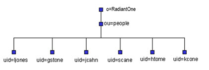

Figure 13: Configuration to Re-Map the UniqueMember Attribute

RadiantOne re-maps the uniqueMember attribute values into the proper DN for the location in the RadiantOne namespace. In the figure below, the HR Managers group (from the backend LDAP server) contains unique members whose DN’s have been remapped to their DN’s in the RadiantOne namespace (containing a suffix of “ou=RemoteDirectories,o=vds”). 

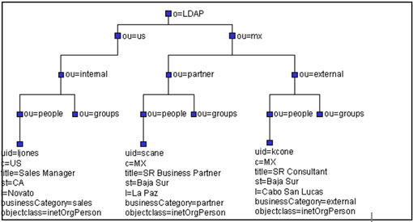

Figure 14: Result of Re-Mapping the UniqueMember Attribute

This auto re-mapping capability is useful for two main purposes:

-	To re-use existing groups and group memberships – this prevents you from having to re-create the groups and the group membership in the RadiantOne namespace.

-	Manage group membership from an external application – when new users are added to these groups, the “real” DN is entered properly in the backend LDAP directory even though the members can be returned with their re-mapped DNs in RadiantOne.

>[!warning] If RadiantOne is configured to re-map DN attributes, and you need to perform searches on these attributes, then your options for the search filter are as follows:
 Enter the whole attribute value in the search filter (i.e. uniqueMember=uid=Cbrady,ou=people,ou=SunOne,ou=RemoteDirectories,o=vds) 
 Only use the wild card character (*) in the filter up to the point of the new suffix (i.e. uniqueMember=uid=Cbrady,ou=*) or (uniqueMember=uid=*)

If your virtual view does not keep the existing backend hierarchy (for example if you don’t map direct to a backend LDAP), then you can use the Groups Migration Wizard to auto-translate the member DNs to the new virtual namespace. For details on the Groups Migration Wizard, please see the [RadiantOne Identity Service Wizards Guide](/identity-service-wizards-guide/01-overview).

### Always Requested Attributes

In some cases, certain attributes are not returned by the LDAP backend even if RadiantOne requests all attributes. These attributes are typically known as operational attributes and you must ask for them specifically by name. If you would like RadiantOne to always request specific operational attributes (in addition to all, or the attributes requested by the client), you can set them as Always Requested.

To specify these requested attributes, from the Main Control Panel > Directory Namespace Tab, select the LDAP backend below the Root Naming Contexts node and on the right side, select the Attributes tab. If the attribute you want to have RadiantOne always request is not in the list, click on the **Add** button. Enter the attribute name and select the Always Requested option. If the attribute appears in the list but the Always Requested column is not checked, select the attribute and click **Edit**. Check the Always Requested option and click **OK**.

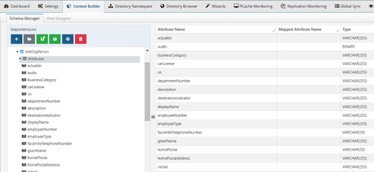

Figure 15: Defining Attribute as Always Requested

Attributes that have a checkmark in the Always Requested column are always requested by RadiantOne (in addition to all, or only attributes requested in the query – depending on which option you have selected in the Attribute Handling section). 

The client only receives the attributes it requests (and is allowed to see via ACL’s) even though RadiantOne may actually request more attributes from the backend LDAP server.

>[!warning] this is NOT the approach you should take to prevent certain attributes from being returned to the client. Preventing attributes from being returned should be accomplished with ACL’s.

For example, if objectclass, cn, sAMAccountName, and employeeID are set as Always Requested attributes and a client requests the title attribute in the query to RadiantOne, it requests, title, objectclass, cn, sAMAccountName, and employeeID from the backend LDAP.

As another example: If the client requests ALL attributes in its query to RadiantOne, it requests ALL attributes from the underlying LDAP in addition to any attributes set as Always Requested (again, because the use of (*) in an LDAP query does not return operational attributes – these must be specifically requested). 

>[!warning] If you plan on caching (either entry memory cache or persistent cache) the branch in the RadiantOne namespace that maps to an LDAP backend, you must list the operational attributes you want to be in the cache as “always requested”. Otherwise, the entry stored in cache would not have these attributes and clients accessing these entries may need them.

If you make any changes, click **Save** in the upper right corner and then click **Yes** to apply the changes to the server.

### Active

Check the Active option to activate the node. Uncheck the Active option to deactivate the node. Only active nodes are accessible in RadiantOne by clients.

### Dedicated Connection

By default, RadiantOne uses the service account configured in the data source and connection pooling for connecting to backend LDAP servers. Therefore, when clients access RadiantOne, it can re-use any open connections in the pool to connect to the underlying LDAP server. Then, authorization is enforced at the RadiantOne level based on access controls. This is best practice and the recommended approach.

If [Proxy Authorization](#proxy-authorization) and [Role Mapped Access](#role-mapped-access) are insufficient to condition the connection to the backend, and you want the connection from the client to RadiantOne to determine the lifecycle of the connection to the underlying LDAP server, you can enable the dedicated connection option from the Main Control Panel > Directory Namespace tab. Select the desired node representing the LDAP backend below Root Naming Contexts, and on the right side, select the Proxy Backend tab.

 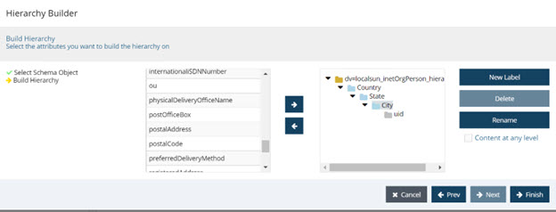

Figure 16: Dedicated Connection Setting

If the dedicated connection option is enabled, RadiantOne does not use the connection pool and the connection to the underlying LDAP directory is closed when the client disconnects from RadiantOne. If dedicated connections are not used, and a client disconnects from RadiantOne, the connection to the underlying LDAP server can still remain in the connection pool (until the configured timeout parameter is reached, which then removes the connection from the pool).

>[!note] Dedicated connections are best used in cases where there are only a few clients accessing RadiantOne but generate a lot of traffic. Clients must handle the opening and closing of connections efficiently (e.g. don’t leave open connections idle for long periods of time).

**Schema Enforcement Policy**

The schema enforcement policy option allows you to choose how you want the proxy to behave when adding entries that may not match the schema of the backend directory (i.e. having an attribute that is not part of the object class).

To define a schema enforcement policy:

1.	From the Main Control Panel > Directory Namespace Tab, select a node representing the LDAP backend below the Root Naming Contexts node. 

2.	On the right side, select the Proxy Backend tab and locate the Schema Enforcement Policy setting. 

3.	Select one of the three following options. 

    -	Pass-through: All attributes in the operation are sent to the backend regardless of whether they match the backend schema. This is the default mode.

    >[!note] Modifications may fail at the backend if this option is selected and the entry to be added violates the backend schema definition.

    - Filter: Attributes in the operation that do not match the backend schema are removed before being passed to the backend layer.

    - Strict: RadiantOne adds objectclass=extensibleObject to the entry before passing the operation to the backend directory. This ensures the operation succeeds without an object class violation.

4.	Click **Save** and **Yes** to apply the changes to the server.

### Object Class Mapping

For applications to perform a global search in the RadiantOne namespace and be able to locate entries from many different types of underlying sources, the schemas must be mapped to a common naming. You must establish the common mapping based on the criteria a client application uses to search. For example, if a client application were to look for user entries based on a filter of (objectclass=User), you must make sure that all required objects match this class definition. 

To map object classes:

1.	From the Main Control Panel > Directory Namespace Tab, select the desired node representing the LDAP backend below Root Naming Contexts.

2.	On the right side, select the Proxy Backend tab.

3.	Click the **Edit** button next to Objectclass Mapping. A list of all objectclasses available in the underlying schema displays. 

4.	Enter the object class in the Mapped Objectclass column and click **OK**.

5.	Click **Save** in the upper right corner and click **Yes** to apply the changes to the server.

In the example below, the inetOrgPerson object class is set to map to User.

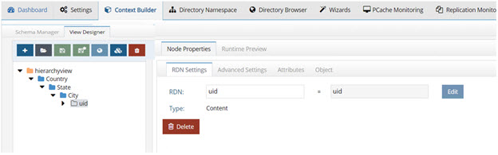

Figure 17: Example of Setting up Objectclass Mapping

This means that all inetOrgPerson entries from the underlying source are returned with objectclass=user (as depicted in the screen shot below).

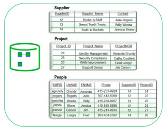 
 
Figure 18: Result of Objectclass Mapping

### Pre-Processing Filter

Proxy virtual views from LDAP backends can be conditioned by using a pre-processing filter. A pre-processing filter is any valid LDAP filter that you want to always be sent by RadiantOne when querying the backend LDAP server. The query filter that is sent to the backend is based on the client request that came into RadiantOne in addition to whatever you have set as a pre-processing filter. 

To define a pre-processing filter:

1.	From the Main Control Panel > Directory Namespace Tab, select the desired node representing the LDAP backend below the Root Naming Contexts node. 

2.	On the right side, select the Proxy Backend tab and locate the Pre-Processing Filter setting. 

3.	Enter a valid LDAP filter or select one from the drop-down list. 

    >[!note] As mentioned, the value set here is added to the filter requested from RadiantOne client when it issues the query to the backend.

4.	Click **Save** when finished and **Yes** to apply the changes to the server.

5.	Click **OK** to exit the confirmation window.

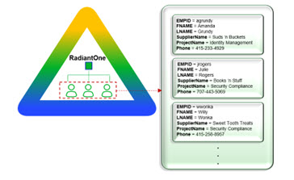

Figure 19: Pre-Processing Filter Settings

### Post-processing exclusion filter

Proxy virtual views from LDAP backends can be conditioned by using a Post-processing exclusion filter. After RadiantOne queries the backend and retrieves the results, this filter excludes certain entries from being returned to the client. 

To define a pre-processing filter:

1.	From the Main Control Panel > Directory Namespace Tab, select the desired node representing the LDAP backend below the Root Naming Contexts node. 

2.	On the right side, select the Proxy Backend tab and locate the Post-processing exclusion filter setting. 

3.	Enter a valid LDAP filter to indicate which entries you want excluded from the results prior to RadiantOne returning them to the client. 

4.	Click **Save** when finished and **Yes** to apply the changes to the server.

5.	Click **OK** to exit the confirmation.

### Attribute Mapping

As described in the object class mapping section, all underlying schemas must be mapped to a common schema to facilitate global searching. The process of mapping object classes was defined in the previous section. This section depicts how to setup attribute mappings.

To set up attribute mappings:

1.	On the Main Control Panel > Directory Namespace tab, select the desired node representing the LDAP backend below the Root Naming Contexts node. 

2.	On the right side select the Attributes Tab. A list of requested/remapped attributes for this backend is displayed. 

3.	If an attribute you want to map does not appear in the list, click on **Add** and enter the Name (as it exists in the backend), the Virtual Name (what you want the name to be in the virtual entry), whether it contains a [DN value that needs remapped](#dn-remapping) and if you want RadiantOne to [always request](#always-requested-attributes) it from the backend.

4.	If you already see the attribute you want to map in the list, select it and click on **Edit**. Enter a value for Virtual Name and click **Ok**. This is the name of the attribute that appears for the entry in the virtual directory.

5.	Click **Save** in the upper right corner and **Yes** to apply the changes to the server.

6.	Click **OK** to exit the confirmation.

The screen shot below shows a mapping established between uid and sAMAccountName.

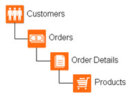
 
Figure 20: Example of Attribute Mapping

This means that all entries from the underlying source containing a uid attribute be returned with it mapped as sAMAccountName (as depicted in the screen shot below).

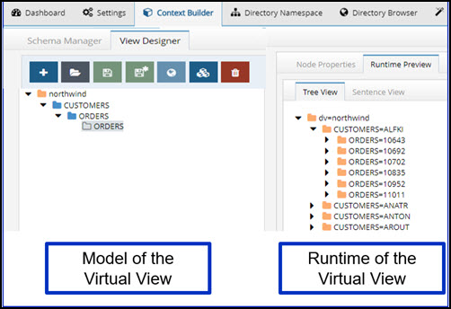
 
Figure 21: Result of Attribute Mapping

### Hidden Attributes

By default, all attributes available for the LDAP objects are present in the virtual entries. To see a list of all attributes that are returned in the virtual entries, click on the **Objects** tab and locate the Virtual Attribute table (if you have no primary objects listed, you must add one first). If you do not want an attribute visible in the virtual entries, make sure a checkmark appears in the Hidden column next to that attribute. To hide an attribute, select it and click the **Edit** button. Check the Hidden in Result option and click **OK**. The checked attributes will not be visible in the virtual entries. 

To only see the attributes that are visible in the virtual entry, check the Visible Only checkbox at the top of the table. All attributes marked as hidden do not show in the list.

### Suffix (branch) Exclusion

By default, once you establish a Remote Base DN (starting point to search from in the underlying directory) for the virtual view, all container levels from the backend are mounted in the virtual tree.

If you want to exclude some branches/containers, you can specify them by clicking the **EDIT** button next to Suffix (branch) Exclusion parameter on the Proxy Backend tab.

Click on **ADD** and select the branch you would like to exclude from the virtual tree. The example below shows how to exclude the ou=accounting,dc=na,dc=radiantlogic,dc=com branch.

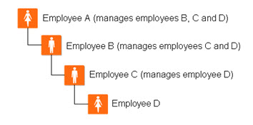
 
Figure 22: Suffix Branch Exclusion Settings

You can exclude as many branches as you want. The image below depicts three branches configured for exclusion. These branches will not appear in the virtual tree. [Suffix (branch) Inclusion](#suffix-branch-inclusion) can be used as an alternative to the Exclusion setting.

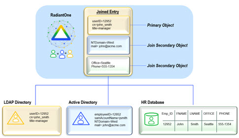
 
Figure 23: Multiple Branches can be Excluded from the Virtual View

The default size limit is set to 100 meaning only 100 containers below the Remote Base DN are visible to select for exclusion. Increase the size limit if you need to display more branches and click **Refresh Tree**. You can also enter a result filter to dynamically reduce the branches to the ones you want to exclude.

### Suffix (branch) Inclusion

By default, once you establish a Remote Base DN (starting point to search from in the underlying directory) for the virtual view, all container levels from the backend are mounted in the virtual view.

If you want to limit the branches/containers, you can indicate the ones you want by clicking the **EDIT** button next to Suffix (branch) Inclusion parameter on the Proxy Backend tab.

Click **ADD** and select the branch you would like to include in the virtual tree. The example below shows how to include the ou=Advertising,dc=na,dc=radiantlogic,dc=com branch.

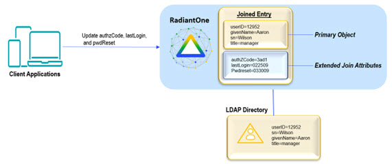
 
Figure 24: Suffix Branch Inclusion Settings

You can include as many branches as you want. The screen shot below depicts three branches configured for inclusion. These branches will appear in the virtual tree. [Suffix (branch) Exclusion](#suffix-branch-exclusion) can be used as an alternative to the Inclusion setting.

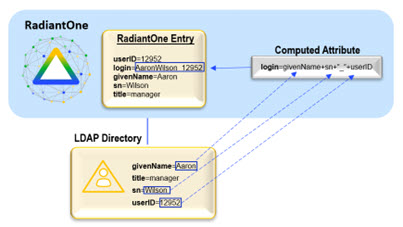
 
Figure 25: Multiple Branches can be Included in the Virtual View

The default size limit is set to 100 meaning only 100 containers below the Remote Base DN are visible to select for exclusion. Increase the size limit if you need to display more branches and click **Refresh Tree**. You can also enter a result filter to dynamically reduce the branches to the ones you want to exclude.

### Interception Scripts

For specific details, please see Interception Scripts in the Concepts section of the [RadiantOne System Administration Guide](/sys-admin-guide/01-introduction). This section describes how to enable interception scripts for an LDAP backend.

1.	From the Main Control Panel > Directory Namespace Tab, select the LDAP backend node below Root Naming Contexts. 

2.	On the right side, select the Proxy Advanced tab.

3.	Enable the operations you want to customize by checking the box next to it. The Java script associated with this LDAP backend is displayed in the Source Location parameter. This is this script that you must customize and it is located at <RLI_HOME>/vds_server/custom/src/com/rli/scripts/intercept.

4.	Click **Save** in the upper right corner and then **Yes** to apply the changes to the server.

5.	Lastly, follow the steps defined in the Interception Scripts section of Concepts of the [RadiantOne System Administration Guide](/sys-admin-guide/01-introduction).

### Include and Exclude Search Filters

Multiple different LDAP backends can be configured below the same root naming context. Therefore, client applications can perform searches from the root which could result in querying numerous backend directories. Sometimes, this can affect performance. In order to have more control over which LDAP queries get sent to which LDAP backends, RadiantOne offers inclusion and exclusion search filters. 

From the Main Control Panel > Directory Namespace Tab, select the LDAP backend node below Root Naming Contexts. On the right side, click on the **Proxy Advanced** tab to set these filters.

**Inclusion Filters**: Allow you to specify which filters are allowed to be sent to the backend LDAP directory.

**Exclusion Filters**: Allow you to specify which filters are not allowed to be sent to the backend LDAP directory.

Typically you would specify one or the other (inclusion filters or exclusion filters). The filter can be in the form of any valid LDAP filter. Also, different filters can apply on different search scopes (base, one level, or subtree).

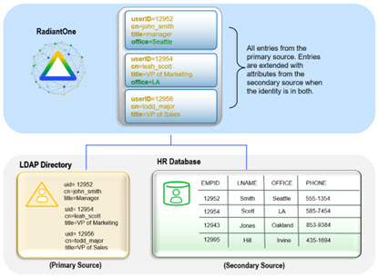
 
Figure 26: Sample Inclusion Filter for LDAP Backend 1

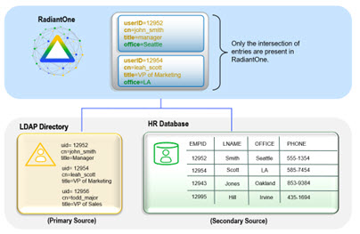
 
Figure 27: Sample Inclusion Search Filter LDAP Backend 2

In the examples shown above, different inclusion filters have been set for two different LDAP backend configurations. The sample configured for LDAP backend 1 dictates that it only receives subtree queries that have a filter of (`mail=<something>@radiantlogic.com`). The * in the filter indicates any value. Therefore, if the filter is searching for an email address of someone with a suffix of @radiantlogic.com, then LDAP Backend 1 receives the query.

The sample configured for LDAP backend 2 dictates that it only receives subtree queries when the filter is searching for an email address of someone with a suffix of @testserver.com.

On the other hand, exclusion filters allow you to specify which queries to not send to the backend LDAP server. In the figures below, subtree queries that contain a filter of department=sales are not sent to the LDAP backend 1.

Subtree queries that contain a filter of department=marketing are not sent to LDAP backend 2.

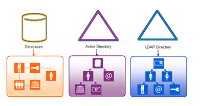
 
Figure 28: Sample Exclusion Filter set for LDAP Backend 1

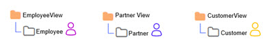
 
Figure 29: Sample Exclusion Filter Set for LDAP Backend 2

The use of inclusion and exclusion filters can improve performance and efficiency because only relevant queries are routed to the appropriate remote servers.

### Computed Attributes

For specific details, please see Computed Attributes in the Concepts section of the [RadiantOne System Administration Guide](/sys-admin-guide/01-introduction). This section describes how to configure computed attributes for an LDAP backend.

To create computed attributes:

1.	From the Main Control Panel > Directory Namespace Tab, select the node representing the LDAP backend below Root Naming Contexts. 

2.	On the right side, select the Objects Tab.

3.	Make sure the actual object class (not a remapped one) associated with your backend entries appears in the Primary Objects list. If not, click **Add** to add it. If you have more than one object class in your Primary Objects list, select the one you want to associate with the computed attribute.

4.	Click the **Edit** button next to Define Computed Attributes. 

5.	Click **Add**.

6.	Enter the Computed Attribute name in the Name parameter.

7.	Configure the needed expression to comprise the computed attribute. This is based on Java and if you are already familiar with the syntax, you can enter it directly for the value. 

If you would like to build the attribute based on a constant and need assistance, click on the constant button and enter the value. 

If you would like the computed attribute to be based on an existing attribute, click on the **Attribute** button for assistance (a list of all attributes available in the virtual object will display). 

If you would like to use a function to build your computed attribute, click on the **Function** button for a list to display.

8.	Click the **Validate** button to check the syntax of your expression. 

9.	Once your expression compiles properly (no errors in the Compilation Results window), click **OK**. 

10.	Click the **Save** button in the upper right corner and **Yes** to confirm the changes.

The computed attribute should appear in the list of attributes for the virtual object (indicated by an orange square in the Origin column) and the value is populated based on your configured expression when RadiantOne returns virtual entries.

If you would like to see a list of only computed attributes for the virtual object, select the “Computed” option in the Display drop-down list. 

For more details, please see Computed Attributes in the Concepts section of the [RadiantOne System Administration Guide](/sys-admin-guide/01-introduction).

**Deactivate Computed Attributes**

If you have defined multiple computed attributes, it can be helpful to deactivate some for testing or if you (temporarily) don’t need them anymore. 

To deactivate a computed attribute:

1.	From the Main Control Panel > Directory Namespace Tab, select the node representing the LDAP backend below Root Naming Contexts. 

2.	On the right side, select the Objects Tab. 

3.	In your Primary Objects list, select the one that contains the computed attribute(s) that you need to deactivate.

4.	Click the **Edit** button next to Define Computed Attributes. 

5.	Uncheck the “Active” checkbox next to the computed attributes that you want to deactivate.

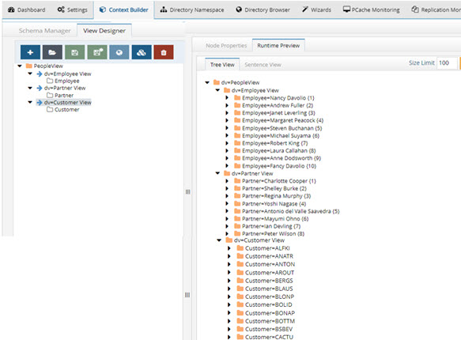
 
Figure 30: Computed Attributes Example with One Deactivated

6.	Click **OK**.

7.	Click **Save**.

### Bind Order

If you have configured joins between the selected LDAP object and other sources, RadiantOne can send the bind request (credential checking) to many backends. 

To configure the bind order:

1.	From the Main Control Panel > Directory Namespace Tab, select the node representing your LDAP backend below Root Naming Contexts. 

2.	On the right side, select the Objects Tab.

3.	Click the **Edit** button next to Define Bind Strategy at the bottom. The Edit Bind Strategy window displays a list of all sources (the primary along with any secondary sources you have joined with). 

4.	Enable the source as a possible participant in the bind operation. 

5.	Use the up and down arrow to determine the order RadiantOne should attempt the credential checking. RadiantOne attempts to verify the credentials against the first enabled source in the list. If it fails, then the next is tried and so forth. If all enabled sources have been tried without success, RadiantOne returns a bind failed error to the client.

For more information on bind order and joining, please see the sections titled Bind Order and Joins in the Concepts section of the [RadiantOne System Administration Guide](/sys-admin-guide/01-introduction).

### Joins

Objects from any sources in the RadiantOne namespace can be joined. With joins, you can extend the LDAP entries with attributes coming from another data source, or new application-specific attributes (required by applications, but don’t exist yet). This section assists you in finding the location to configure the join for your virtual view associated with an LDAP backend data source.

Joins are configured by first selecting the virtual view built from the primary source below Root Naming Contexts in the Main Control Panel > Directory Namespace Tab. On the right side, select the Objects tab, choose the primary object class (add it if it isn’t listed), and click **New** in the Join Profiles section. To deactivate a join, uncheck the join’s Active box in the Join Profiles section on the Objects tab and click **Save**. To reactivate the join, check the join’s Active box and click **Save**.

For complete details, please see Joins in the Concepts section of the [RadiantOne System Administration Guide](/sys-admin-guide/01-introduction).

### Optimizations

For certain use cases, there are three parameters that may be enabled to improve processing/performance. They are located on the Main Control Panel > Directory Namespace Tab. Navigate below the Root Naming Context section and select the node representing the virtual view to your backend. On the right side, select the Proxy Advanced tab and locate the Optimizations section. Each optimization is described below.

**Limit Attributes Requested from the LDAP Backend**

Whenever RadiantOne queries a backend LDAP, the default behavior is to ask for all attributes (although ONLY the attributes requested in the query are returned to the client). This default behavior of RadiantOne is for the following reasons:

-	Joins have been configured and the filter in the search request involves attributes from both the primary and secondary sources (i.e. the query filter contains conditions on both primary and secondary objects). 

-	Interception scripts that involve logic based on attributes from the backend. These attributes may not be specifically requested or searched for by the client. However, RadiantOne must retrieve them from the backend in order for the script logic to be valid.

-	ACL checking. You can setup ACLs on attribute/values of an entry (i.e. mystatus=hidden), so RadiantOne may need the whole entry to check the authorization.

-	For entry caching. The entire entry needs to be in the entry cache.

    If your virtual view does not require any of the conditions mentioned above, you can enable this option for better performance. If this option is enabled, RadiantOne queries the backend server only for attributes requested from the client in addition to attributes set as 'Always Requested' on the Attributes tab.

**Process Joins and Computed Attributes only when necessary**

The default behavior of RadiantOne is to process associated joins and build computed attributes whenever a virtual object is reached from a query regardless of whether the attributes requested come from a secondary source or computation. 

If you enable this option, RadiantOne does not perform joins or computations if a client requests or searches for attributes from a primary object only. If a client requests or searches for attributes from secondary objects or computed attributes, then RadiantOne processes the join(s) and computations accordingly. For more details on this behavior, please see the Join Behavior Diagram in the [RadiantOne System Administration Guide](/sys-admin-guide/01-introduction).

Use caution when enabling this option if you have interception scripts defined on these objects, or access controls based on filters are being used (both of which may require other attributes returned from secondary sources or computations regardless of whether the client requested or searched for them).

>[!warning] Do not enable this option if a memory entry cache is used (as the whole virtual entry is needed for the cache).

**Use Client Sizelimit Value to Query Backend**

Whenever RadiantOne queries a backend LDAP, the default behavior is to ask for all entries (sizelimit=0) even if the client to RadiantOne indicates a size limit. 
This default behavior is because the entries returned by the backend are possible candidates, but may not be retained for the final result that is sent to the client. For example, if an ACL has been defined in RadiantOne, not all entries from the backend may be authorized for the user (connected to RadiantOne) to access. Other cases are when joins or interception scripts are involved with the virtual view, these may also alter the entries that match the client’s search. 

To limit the number of entries from the backend, using paging is the recommended approach. If the backend supports paging, RadiantOne does not get all the results at once, only one page at a time (pagesize indicated in the configuration). In this case, if RadiantOne has returned the sizelimit required to the client, it does not go to the next page.

If your virtual view does not require any of the conditions mentioned above (joins, interceptions, ACL), and using paging between RadiantOne and the backend is not possible, you can enable this option to limit the number of entries requested from the backend. If this option is enabled, RadiantOne uses the sizelimit specified by the client instead of using sizelimit=0 when querying the backend.

### ActualDN

The DN of entries in the virtual namespace may differ from the actual DN from the backend. Therefore, for LDAP proxy views, a special virtual attribute named actualdn is returned by RadiantOne for each entry. The value contains the DN of the entry in the backend directory.

If you want to use the actualdn attribute in computed attributes, the actualdn attribute must be configured as Always Requested in the virtual view. From the Main Control Panel -> Directory Namespace tab, select the naming context associated with your LDAP proxy view. On the right, select the Attributes tab and add the actualdn attribute as Always Requested. An example is shown below.

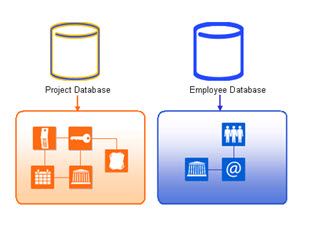
 
Figure 31: Configuring ActualDN Attribute as Always Requested

This attribute can be used in computed attributes by using the getactualDN() function. 
 
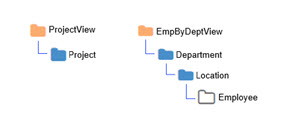

Figure 32: Using ActualDN in a Computed Attribute

## Model-driven Identity Views
Creating model-driven identity views requires the use of the metadata extracted from backend sources. The views can be flat or hierarchical and comprised of an aggregation of many views. This provides greater flexibility for view design than creating simple LDAP proxy views.

In order to create model-driven identity views, 

