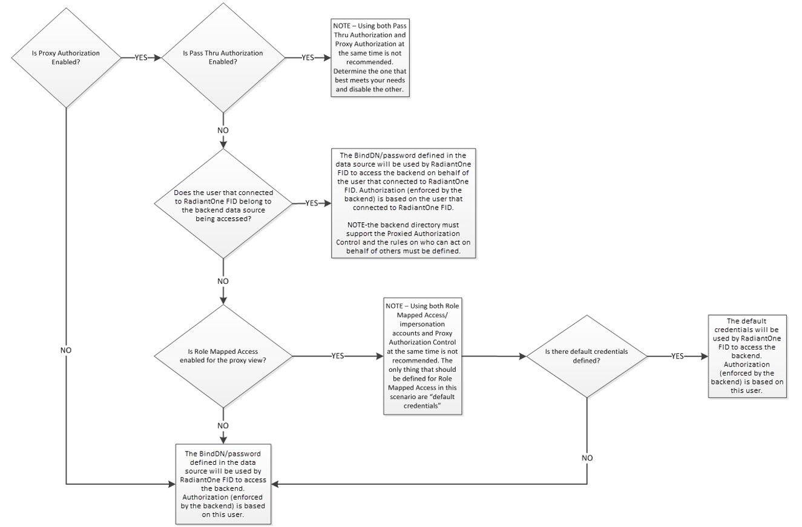
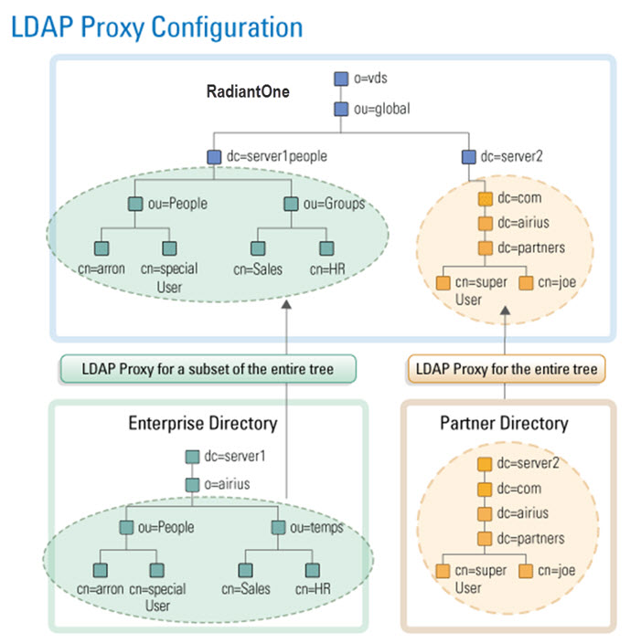
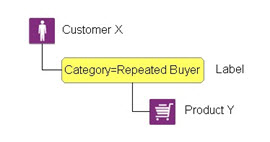
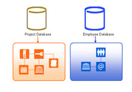
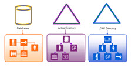

## Creating Identity Views

There are two main design approaches to creating identity views.
 1. Using an LDAP proxy approach, where the identity view deployed in RadiantOne represents an exact hierarchy (or specific sub-branch) of an existing LDAP directory data source. With this view design approach you are limited to the exact hierarchical structure of the existing directory store backend. However, you can choose to include or exclude specific branches to limit the data in the identity view.
 2. Using a model-driven approach, where the identity view deployed in RadiantOne can be designed based on the metadata extracted from existing identity sources. With this view design approach you have infinite flexibility and can create flat views, or very complex hierarchies based on the objects and attributes from each identity source. Use the model-driven approach to create identity views from LDAP, JDBC-accessible data sources and Custom data sources.

A special type of identity view that leverages the model-driven design approach is generated by the Global Identity Builder tool. This tool can be used to address two commmon identity data challenges:
- No single identity source containing all user accounts. This means integrating with multiple identity sources containing various levels of overlapping user accounts. The Global Identity Builder generates an identity view that provides a unique reference list of user accounts, joining overlapping ones as needed.
- Multiple identity sources containing 100% overlapping user accounts without a single attribute to uniquely identify the overlap. The Global Identity Builder generates an identity view that provides a unique reference list of user accounts, joining overlapping ones based on one or more cascading matching rules. Each pair of identity sources can have their own list of matching rules, allowing identity architects to address a variety of complex data quality challenges (e.g. Sources A, B and C have overlapping identities that can be identified by their Employee Name + Department Name + Last 4 characters of Employee ID, if there is no match found, check Location + Last 4 characters of Employee ID + Login Name).

For more details, see [Global Identity Builder](../global-identity-builder/introduction).

Every Root Naming Context configured in the RadiantOne namespace can be active or inactive.
There is a toggle to indicate whether the naming context is active or not. Toggle it off to deactivate the naming context. Only active naming contexts are accessible in RadiantOne by clients.

## LDAP Proxy Views Overview

Identity views can be created from LDAP directories and associated with a specific root naming context. A root naming context is the very top level in the RadiantOne namespace, and you can have many different root naming contexts. This section describes how to create root naming contexts for mounting identity views from LDAP directory backend data sources. 

### Configuration

If you configure an LDAP proxy view by mounting an LDAP backend directly at the Root Naming Context, it is the only backend that can be mounted at this specific naming context. If you want to comprise the identity view from many different backends, add new labels below the root naming context. Use labels to layout the hierarchy that you want and then mount backends for the data sources that you want to aggregate at the corresponding labels.

1.	First, data sources for each backend must be defined. From the Control Panel > Setup > Data Catalog > Data Sources, click . Use the Active Directory, Generic LDAP, Open DJ or RadiantOne directory template to define data sources.

2.	In the  Control Panel > Setup> Directory Namespace > Namespace Design, click . 

3.	Enter the new root naming context and click **SAVE**.

4.	Click .

5.	Select the **LDAP** backend type and click **SELECT**.
6.	Select the data source defined in step 1.
7.	Click  to select a remote base DN.

8.	Click **MOUNT**.

9.	To modify the LDAP proxy view, select the appropriate node below Root Naming Contexts and modify the settings on the right side. Click **SAVE** when finished.

 

LDAP Backends can also be mounted at any label node that doesn't already have something mounted at it in a naming context. 

## LDAP Proxy View Properties

LDAP proxy view properties are managed from the Control Panel > Setup > Directory Namespace > Namespace Design. These settings are found on the PROPERTIES tab for the naming context where the LDAP proxy view is mounted.

### Type

Indicates the type of identity view. LDAP Backend is the value for LDAP proxy views. This value is read-only for informational purposes.

### Naming Context

Indicates the naming context in the RadiantOne namespace where the identity view is mounted. This value is determined when you mount the LDAP backend based on the naming context where you've chosen to mount the view and is read-only from here.

### Remote Base DN

The Remote Base DN is the starting point to search from in the backend directory. This is set when you create the data source and can be changed later from here by either entering the base DN, or clicking the  button to select the location in the backend directory tree.

All entries below the remote base DN are displayed when clients navigate below the naming context in the RadiantOne namespace.

### Data Source

The RadiantOne data source associated with the LDAP directory backend that is mounted for this identity view. The data source can be changed by clicking the drop-down menu and selecting a new data source.

### Host

Server name or IP address. This is read-only from here. To modify the value, go to Control Panel > Setup > Data Catalog > Data Sources and edit the data source from this list.

### Port

Port that the server is listening on. This is read-only from here. To modify the value, go to Control Panel > Setup > Data Catalog > Data Sources and edit the data source from this list.

### Bind DN

Service account user DN. This user is used by RadiantOne to create connections to the backend LDAP directory.
This is read-only from here. To modify the value, go to Control Panel > Setup > Data Catalog > Data Sources and edit the data source from this list.

### SSL

Indicates if the SSL port is configured in the data source. This is read-only from here. To modify the value, go to Control Panel > Setup > Data Catalog > Data Sources and edit the data source from this list.

### Referral Chasing

Indicates if referral chasing is configured in the data source. This is read-only from here. To modify the value, go to Control Panel > Setup > Data Catalog > Data Sources and edit the data source from this list.

### Paged Results Control

Indicates if the Paged Results Control is configured in the data source. This is read-only from here. To modify the setting and value, go to Control Panel > Setup > Data Catalog > Data Sources and edit the data source from this list.

### Schema Enforcement Policy

The schema enforcement policy option allows you to choose how you want the proxy to behave when adding entries that may not match the schema of the backend directory (i.e. having an attribute that is not part of the object class).

Select one of the three following options. 

*Pass-through*: All attributes in the operation are sent to the backend regardless of whether they match the backend schema. This is the default mode.

    >[!note] Modifications may fail at the backend if this option is selected and the entry to be added violates the backend schema definition.

*Filter*: Attributes in the operation that do not match the backend schema are removed before being passed to the backend layer.

*Strict*: RadiantOne adds objectclass=extensibleObject to the entry before passing the operation to the backend directory. This ensures the operation succeeds without an object class violation.

### Dedicated Connection

By default, RadiantOne uses the service account configured in the data source and connection pooling for connecting to backend LDAP servers. Therefore, when clients access the RadiantOne service, it can re-use any open connections in the pool to connect to the underlying LDAP server. Then, authorization is enforced at the RadiantOne level based on access controls. This is best practice and the recommended approach.

If [Proxy Authorization](#proxy-authorization) is insufficient to condition the connection to the backend, and you want the connection from the client to RadiantOne to determine the lifecycle of the connection to the underlying LDAP server, you can enable the dedicated connection option.

 

If the dedicated connection option is enabled, RadiantOne does not use the connection pool and the connection to the underlying LDAP directory is closed when the client disconnects from RadiantOne. If dedicated connections are not used, and a client disconnects from RadiantOne, the connection to the underlying LDAP server can still remain in the connection pool (until the configured timeout parameter is reached, which then removes the connection from the pool).

>[!note] Dedicated connections are best used in cases where there are only a few clients accessing the RadiantOne service but generate a lot of traffic. Clients must handle the opening and closing of connections efficiently (e.g. don’t leave open connections idle for long periods of time).

### Proxy Authorization

When the RadiantOne service acts as a client and connects to a backend directory, certain credentials are used (e.g. the Bind DN and Bind Password configured in the data source connection string). These credentials determine what operations are allowed and it is the backend directory which enforces authorization for this user. Some directories support the Proxy Authorization control allowing a client to switch the user ID, for authorization purposes, without having to re-authenticate with a new connection. If the backend directory supports the Proxied Authorization control, and there is the need to base authorization on a different user than the one who authenticated, you can enable the Proxy Authorization checkbox. With this approach, RadiantOne can use certain credentials (e.g. the Bind DN and Bind Password configured in the data source connection string) when connecting to the backend directory and pass the needed control along with the user DN of the person they want to represent for authorization in the requests. The backend directory checks the proxy authorization rules that have been configured to make sure the service account RadiantOne used to connect with is allowed to represent the person passed in the request. If so, the service account is allowed to perform any operations the person it is impersonating would be allowed to do. Again, for this functionality to work, the Proxy Authorization control must be supported by the backend directory and proxy authorization rules must be properly defined in the backend directory. A high-level diagram detailing the behavior is shown below.

### Pass Thru Authorization

Pass thru authorization is for determining which account RadiantOne uses to connect to a backend directory and ultimately how access rights (authorization) is enforced. A high-level diagram detailing the behavior is shown below.

This functionality is best described with examples. The following three examples/diagrams detail the different configurations possible.

>[!warning] This feature (and the description below) is for AUTHORIZATION.

 

In the diagram above, there are two different proxy views configured in RadiantOne. One for an Enterprise Directory mounted in the virtual namespace below dc=server1people,ou=global,o=vds. The other one is for a Partner Directory and is mounted in the virtual namespace below dc=server2,ou=global,o=vds.

If there is a service account credential (user Bind DN/password) specified in the data source representing the backend for the LDAP proxy configuration, the person that successfully binds to RadiantOne uses this account when searching, adding, modifying, or deleting information in the corresponding backend directory. In other words, anyone who binds successfully has the access rights defined for the service account user. This is called delegation.

The example below explains what happens when a service account credential defined in the data source.

Data Source for Server 1 in this example is:

`Hostname: Server1`
 `Port:1389`
 `Base DN: o=airius,dc=server1`
 `Bind DN (service account): cn=specialuser,ou=people,o=airius,dc=server1`
 `Bind Password: password`
 `Data Source for Server 2 in this example is:`
 `Hostname: Server 2`
 `Port: 389 `
 `Base DN: dc=server2`
 `Bind DN (service account): cn=superuser,dc=partners,dc=airius,dc=com,dc=server2`
 `Bind Password: password2`

**Example 1: No Pass Thru Authorization**
 If user: “cn=joe,dc=partners,dc=airius,dc=com,dc=server2,ou=global,o=vds” binds successfully to RadiantOne and accesses the dc=server2,ou=global,o=vds branch (the same backend server that processed the bind request), then his access rights to the data are determined by the service account user credentials in the backend server (“cn=superuser,dc=partners,dc=airius,dc=com,dc=server2”).

If “cn=joe,dc=partners,dc=airius,dc=com,dc=server2,ou=global,o=vds” accesses the dc=server1people,ou=global,o=vds branch, then he has the access rights associated with the service account user specified in the data source for server 1 (“cn=specialuser,ou=people,o=airius,dc=server1”).

If user “cn=aaron,ou=people,o=airius,dc=server1people,ou=global,o=vds” binds successfully and accesses the dc=server1people,ou=global,o=vds branch, then he has the access rights associated with the service account user specified in data source, “uid=specialuser,ou=people,dc=server1”.

If “cn=aaron,ou=people,o=airius,dc=server1people,ou=global,o=vds” accesses the dc=server2,ou=global,o=vds branch, then he has the access rights (assigned in the underlying server) associated with the service account user: “cn=superuser,dc=partners,dc=airius,dc=com,dc=server2”.

With this configuration approach, any user that successfully binds (anywhere in the RadiantOne namespace), no matter what proxy branch in the virtual namespace they access, has the same access rights (because they inherit the access rights of the service account Bind DN user).

**Example 2: Using Pass Thru Authorization**
 The three LDAP proxy definitions shown in the diagram below are used to explain the Pass Thru Authorization feature.

 

Data Source for Server 1 in this example is:

`Hostname: Server1`
 `Port: 1389`
 `Base DN: ou=People,o=airius,dc=server1`
 `Pass Thru Authorization: Enabled`

Another Proxy Configuration for Server 1 (with a different Base DN) is:

`Hostname: Server 1`
 `Port: 1389 `
 `Base DN: ou=temps,o=airius,dc=server1`
 `Pass Thru Authorization: Enabled`

Data Source for Server 2 in this example is:

`Hostname: Server 2`
 `Port: 389 `
 `Base DN: dc=server2`
 `Pass Thru Authorization: Enabled`

If no service account credentials (Bind DN/Bind password) are configured in the data source, and Pass Thru Authorization is enabled on the proxy view, then the user that binds successfully has access rights that are defined for them in the directory where they have been authenticated. This is known as impersonation. RadiantOne impersonates this user when performing operations on the underlying server.

For example, if user “cn=aaron,dc=server1people,ou=global,o=vds” successfully binds and accesses the dc=server1people,ou=global,o=vds branch, he is assigned the access rights that have been defined in Server1 for him.

If “cn=aaron,dc=server1people,ou=global,o=vds” accesses the dc=server1grp,ou=global,o=vds branch (since dc=server1people and dc=server1grp are different proxy views to the SAME data soure), Aaron also uses the access rights that have been defined in Server1.

However, if Aaron accesses the dc=server2,ou=global,o=vds branch, he is only allowed anonymous access to this server (because no service account was specified in the data source configuration and Aaron did not originally bind to dc=server2).

**Example 3: Advanced Capability of the Pass Thru Authorization**

The two LDAP proxy definitions shown in the diagram below are used to explain the Pass Thru Authorization feature when there is also a service account Bind DN specified in the data source configuration.

 

Data Source for Server 1 in this example is:

`Hostname: Server1`
 `Port:1389`
 `Base DN: o=airius,dc=server1
Bind DN (service account): cn=specialuser,ou=people,o=airius,dc=server1`
 `Bind Password: password `
 `Pass Thru Authorization defined on the proxy view defined: Enabled`

Data Source for Server 2 in this example is:

`Hostname: Server 2`
 `Port: 389 `
 `Base DN: dc=server2`
 `Bind DN (service account): cn=superuser,dc=partners,dc=airius,dc=com,dc=server2`
 `Bind Password: password2`
 `Pass Thru Authorization defined on the proxy view defined: Enabled`

If a service account (Bind DN/Bind Password) is specified in the data source and the Pass Thru Authorization feature is enabled on the proxy view, then, as in the previous sample, a user that successfully binds has the access rights that have been defined for them in the corresponding server (impersonation). 

For example, if user “cn=aaron,ou=people,dc=server1people,ou=global,o=vds” successfully binds and accesses the dc=server1,ou=global,o=vds branch, then he has the access rights that have been defined for him in Server1. In this case, the specific user that binds access rights override those of the user in the Bind DN parameter in the data source definition. As mentioned before, this is known as impersonation. RadiantOne connects to the backend LDAP server with the user who binds successfully, and the access rights allowed for them are applied when performing all operations (the backend LDAP enforces access rights).

If user “cn=joe,dc=partners,dc=airius,dc=com,dc=server2,ou=global,o=vds” successfully binds to RadiantOne and accesses the dc=server1,ou=global,o=vds branch, he has the access permissions assigned to the service account user that is specified in the Bind DN parameter of the LDAP data source for server 1. Since “cn=joe,dc=partners,dc=airius,dc=com,dc=server2,ou=global,o=vds” was NOT authenticated to the backend LDAP server that he is now trying to access, he only has the access rights that have been allocated to the service account user (“cn=specialuser,ou=people,o=airius,dc=server1”). This is known as delegation. Had there not been a service account specified for Server 1, Joe would have anonymous access (as described in Example 2 above).

### LDAP Controls

A control is additional information that can be included in an LDAP request or response. RadiantOne can play the role of both an LDAP server and an LDAP client to other backend directories. To understand controls supported by RadiantOne as an LDAP server, see the [RadiantOne System Administration Guide](/sys-admin-guide/01-introduction). RadiantOne’s handling of LDAP controls as a client to a backend directory is described in this section.

**VLV/Sort**

If a client searches and passes the VLV control against a branch that is associated with an LDAP directory backend (not a persistent cache or a Universal Directory store), RadiantOne forwards the search request along with the included control to the backend LDAP server. In this case, it is the responsibility of the backend LDAP server to implement the VLV control. RadiantOne returns any controls received from the LDAP backend to the client.

**Paged Results**

If the backend LDAP directory supports the paged results control, RadiantOne can request that the results from the backend be returned in pages. The support for paging is enabled, and the page size is set, at the level of the LDAP data source definition.

Figure 7: Paged Results Control for an LDAP Backend

**Controls Passed from Client Requests**

All LDAP controls that RadiantOne receives from clients during LDAP modify, modifyDN, add, or delete requests are forwarded to the backend LDAP directory. An example would be a client sending a modify request for a user’s password to RadiantOne along with LDAP Control 1.2.840.113556.1.4.2239. RadiantOne would send the password update to the backend directory along with the LDAP control. The backend directory is the enforcement point for the control. RadiantOne responds to the client with all information returned from the backend directory.

**Pre-Read Attributes**

This control indicates that all modify, modify DN, and delete requests should include the pre-read control to retrieve the specified attribute’s value(s) as they appear immediately before the operation has been processed. Pre-read controls may be used to obtain replaced or deleted values of modified attributes or a copy of the entry being deleted. The backend directory is the enforcement point for the control. RadiantOne responds to the client with all information returned from the backend directory.

**Post-Read Attributes**

This control indicates that all add, modify, and modify DN requests should include the post-read control to retrieve the specified attribute’s value(s) as they appear immediately after the operation has been processed. Post-read controls may be used to obtain values of operational attributes, such as the “entryUUID” and “modifyTimestamp” attributes, updated by the server as part of the update operation. The backend directory is the enforcement point for the control. RadiantOne responds to the client with all information returned from the backend directory.

### Merging Other LDAP Proxy Views

 
## LDAP Proxy View Advanced Settings
LDAP proxy view advanced settings are managed from the Control Panel > Setup > Directory Namespace > Namespace Design. These settings are found on the ADVANCED SETTINGS tab for the naming context where the LDAP proxy view is mounted.

### Interception Script
For specific details, please see Interception Scripts in the Concepts section of the [RadiantOne System Administration Guide](/sys-admin-guide/01-introduction). This section describes how to enable interception scripts for an LDAP backend.

1.	From the Main Control Panel > Directory Namespace Tab, select the LDAP backend node below Root Naming Contexts. 

2.	On the right side, select the Proxy Advanced tab.

3.	Enable the operations you want to customize by checking the box next to it. The Java script associated with this LDAP backend is displayed in the Source Location parameter. This is this script that you must customize and it is located at <RLI_HOME>/vds_server/custom/src/com/rli/scripts/intercept.

4.	Click **Save** in the upper right corner and then **Yes** to apply the changes to the server.

5.	Lastly, follow the steps defined in the Interception Scripts section of Concepts of the [RadiantOne System Administration Guide](/sys-admin-guide/01-introduction).

### Optimizations
	limit attribute requested from ldap backend
	process joins/computed only when necessary
	use client size limit

### Object Class Mapping

For applications to perform a global search in the RadiantOne namespace and be able to locate entries from many different types of underlying sources, the schemas must be mapped to a common naming. You must establish the common mapping based on the criteria a client application uses to search. For example, if a client application were to look for user entries based on a filter of (objectclass=User), you must make sure that all required objects match this class definition. 

To map object classes:

1.	From the Control Panel > Setup > Directory Namespace > Namespace Design, select the desired node representing the LDAP backend below Root Naming Contexts.

2.	On the right side, select the ADVANCED SETTINGS tab.

3. In the *Other Settings* section, locate the Object Class Mapping setting.
   
4. 	Click the **Edit** button next to Objectclass Mapping. A list of all objectclasses available in the underlying schema displays. 

5.	Enter the object class in the Mapped Objectclass column and click **OK**.

6.	Click **Save** in the upper right corner and click **Yes** to apply the changes to the server.

In the example below, the inetOrgPerson object class is set to map to User.

This means that all inetOrgPerson entries from the underlying source are returned with objectclass=user (as depicted in the screen shot below).

 
 
### Pre-processing Filter

Proxy identity views from LDAP backends can be conditioned by using a pre-processing filter. A pre-processing filter is any valid LDAP filter that you want to always be sent by RadiantOne when querying the backend LDAP server. The query filter that is sent to the backend is based on the client request that came into RadiantOne in addition to whatever you have set as a pre-processing filter. 

To define a pre-processing filter:

1.	From the Control Panel > Setup > Directory Namespace > Namespace Design, select the desired node representing the LDAP backend below Root Naming Contexts.

2.	On the right side, select the ADVANCED SETTINGS tab.

3.	In the *Other Settings* section, locate the Pre-Processing Filter setting. 

4.	Click the  icon.
5.	Enter a valid LDAP filter or toggle on the  to use an assistant form to generate the filter.

    >[!note] As mentioned, the value set here is added to the filter requested from RadiantOne client when it issues the query to the backend.

6.	Click **CONFIRM**.

7.	Click **SAVE**.

### Post-processing Filter

Proxy identity views from LDAP backends can be conditioned by using a Post-processing  filter. After RadiantOne queries the backend and retrieves the results, this filter excludes certain entries from being returned to the client. 

To define a post-processing filter:

1.	From the Control Panel > Setup > Directory Namespace > Namespace Design, select the desired node representing the LDAP backend below Root Naming Contexts.

2.	On the right side, select the ADVANCED SETTINGS tab.

3.	In the *Other Settings* section, locate the Post-Processing Filter setting.

4.	Click the  icon.
5.	Enter a valid LDAP filter or toggle on the  to use an assistant form to generate the filter to indicate which entries you want excluded from the results prior to RadiantOne returning them to the client. 

6.	Click **CONFIRM**.

7.	Click **SAVE**.
   
### Suffix Branch Exclusion

By default, once you establish a Remote Base DN (starting point to search from in the underlying directory) for the virtual view, all container levels from the backend are mounted in the virtual tree.

If you want to exclude some branches/containers, you can specify them by clicking the **EDIT** button next to Suffix (branch) Exclusion parameter on the Proxy Backend tab.

Click on **ADD** and select the branch you would like to exclude from the virtual tree. The example below shows how to exclude the ou=accounting,dc=na,dc=radiantlogic,dc=com branch.

 
You can exclude as many branches as you want. The image below depicts three branches configured for exclusion. These branches will not appear in the virtual tree. [Suffix (branch) Inclusion](#suffix-branch-inclusion) can be used as an alternative to the Exclusion setting.

### Suffix Branch Inclusion

By default, once you establish a Remote Base DN (starting point to search from in the underlying directory) for the virtual view, all container levels from the backend are mounted in the virtual view.

If you want to limit the branches/containers, you can indicate the ones you want by clicking the **EDIT** button next to Suffix (branch) Inclusion parameter on the Proxy Backend tab.

Click **ADD** and select the branch you would like to include in the virtual tree. The example below shows how to include the ou=Advertising,dc=na,dc=radiantlogic,dc=com branch.

 
You can include as many branches as you want. The screen shot below depicts three branches configured for inclusion. These branches will appear in the virtual tree. [Suffix (branch) Exclusion](#suffix-branch-exclusion) can be used as an alternative to the Inclusion setting.

 
The default size limit is set to 100 meaning only 100 containers below the Remote Base DN are visible to select for exclusion. Increase the size limit if you need to display more branches and click **Refresh Tree**. You can also enter a result filter to dynamically reduce the branches to the ones you want to exclude.

### Global Attributes handling
- actual name
-virtual name
-DN remapping
-always requested
-hidden

ADDING NEW ATTRIBUTES

### DN Remapping

This setting allows for automatic re-mapping of attributes of DN syntax type. This functionality is primarily useful for existing groups/members in an LDAP backend. When an LDAP backend is configured, you have the option to return the group members “real” DNs (as they exist in the backend directory), or to re-map them to the DN for the RadiantOne namespace. For example, the figure below depicts a proxy view that has been defined for a backend LDAP directory. The routing happens at the ou=SunOne,ou=RemoteDirectories,o=vds level in the RadiantOne namespace.

For the selected LDAP Backend, click on the **Attributes** tab. If there are no attributes defined with DN Remapping in this list, then all attributes that have the DN syntax data type will be returned with the DN that exists in the backend LDAP directory. For example, the figure below shows the HR Managers group members, and you can see that they contain the real DN (for the uniqueMember attributes) that exists in the backend LDAP because there is no DN Remapping defined for the uniquemember attribute (i.e “uid=LCallahan,ou=People,dc=toshiba,dc=com”).

 

Now, if you enter a specific attribute name that contains a DN value that you want to re-map for the RadiantOne namespace, then the DN suffix for this namespace is returned for that attribute. In the figure below, you can see that the uniqueMember attribute has been specified for the DN Remapping.

RadiantOne re-maps the uniqueMember attribute values into the proper DN for the location in the RadiantOne namespace. In the figure below, the HR Managers group (from the backend LDAP server) contains unique members whose DN’s have been remapped to their DN’s in the RadiantOne namespace (containing a suffix of “ou=RemoteDirectories,o=vds”). 

This auto re-mapping capability is useful for two main purposes:

-	To re-use existing groups and group memberships – this prevents you from having to re-create the groups and the group membership in the RadiantOne namespace.

-	Manage group membership from an external application – when new users are added to these groups, the “real” DN is entered properly in the backend LDAP directory even though the members can be returned with their re-mapped DNs in RadiantOne.

>[!warning] If RadiantOne is configured to re-map DN attributes, and you need to perform searches on these attributes, then your options for the search filter are as follows:
 Enter the whole attribute value in the search filter (i.e. uniqueMember=uid=Cbrady,ou=people,ou=SunOne,ou=RemoteDirectories,o=vds) 
 Only use the wild card character (*) in the filter up to the point of the new suffix (i.e. uniqueMember=uid=Cbrady,ou=*) or (uniqueMember=uid=*)

If your virtual view does not keep the existing backend hierarchy (for example if you don’t map direct to a backend LDAP), then you can use a computed attribute function to auto-translate the member DNs to the new virtual namespace. The functions available for computed attributes for this purpose are: DNremapLookup, DNremapLookupForeign, and DNremapLookupUnnest.

### Always Requested Attributes

In some cases, certain attributes are not returned by the LDAP backend even if RadiantOne requests all attributes. These attributes are typically known as operational attributes and you must ask for them specifically by name. If you would like RadiantOne to always request specific operational attributes (in addition to all, or the attributes requested by the client), you can set them as Always Requested.

To specify these requested attributes, from the Main Control Panel > Directory Namespace Tab, select the LDAP backend below the Root Naming Contexts node and on the right side, select the Attributes tab. If the attribute you want to have RadiantOne always request is not in the list, click on the **Add** button. Enter the attribute name and select the Always Requested option. If the attribute appears in the list but the Always Requested column is not checked, select the attribute and click **Edit**. Check the Always Requested option and click **OK**.

Attributes that have a checkmark in the Always Requested column are always requested by RadiantOne (in addition to all, or only attributes requested in the query – depending on which option you have selected in the Attribute Handling section). 

The client only receives the attributes it requests (and is allowed to see via ACL’s) even though RadiantOne may actually request more attributes from the backend LDAP server.

>[!warning] this is NOT the approach you should take to prevent certain attributes from being returned to the client. Preventing attributes from being returned should be accomplished with ACL’s.

For example, if objectclass, cn, sAMAccountName, and employeeID are set as Always Requested attributes and a client requests the title attribute in the query to RadiantOne, it requests, title, objectclass, cn, sAMAccountName, and employeeID from the backend LDAP.

As another example: If the client requests ALL attributes in its query to RadiantOne, it requests ALL attributes from the underlying LDAP in addition to any attributes set as Always Requested (again, because the use of (*) in an LDAP query does not return operational attributes – these must be specifically requested). 

>[!warning] If you plan on caching (either entry memory cache or persistent cache) the branch in the RadiantOne namespace that maps to an LDAP backend, you must list the operational attributes you want to be in the cache as “always requested”. Otherwise, the entry stored in cache would not have these attributes and clients accessing these entries may need them.

If you make any changes, click **Save** in the upper right corner and then click **Yes** to apply the changes to the server.

### Attribute Mapping

As described in the object class mapping section, all underlying schemas must be mapped to a common schema to facilitate global searching. The process of mapping object classes was defined in the previous section. This section depicts how to setup attribute mappings.

To set up attribute mappings:

1.	On the Main Control Panel > Directory Namespace tab, select the desired node representing the LDAP backend below the Root Naming Contexts node. 

2.	On the right side select the Attributes Tab. A list of requested/remapped attributes for this backend is displayed. 

3.	If an attribute you want to map does not appear in the list, click on **Add** and enter the Name (as it exists in the backend), the Virtual Name (what you want the name to be in the virtual entry), whether it contains a [DN value that needs remapped](#dn-remapping) and if you want RadiantOne to [always request](#always-requested-attributes) it from the backend.

4.	If you already see the attribute you want to map in the list, select it and click on **Edit**. Enter a value for Virtual Name and click **Ok**. This is the name of the attribute that appears for the entry in the virtual directory.

5.	Click **Save** in the upper right corner and **Yes** to apply the changes to the server.

6.	Click **OK** to exit the confirmation.

The screen shot below shows a mapping established between uid and sAMAccountName.

 

This means that all entries from the underlying source containing a uid attribute be returned with it mapped as sAMAccountName (as depicted in the screen shot below).

 
Figure 21: Result of Attribute Mapping

### Hidden Attributes

By default, all attributes available for the LDAP objects are present in the virtual entries. To see a list of all attributes that are returned in the virtual entries, click on the **Objects** tab and locate the Virtual Attribute table (if you have no primary objects listed, you must add one first). If you do not want an attribute visible in the virtual entries, make sure a checkmark appears in the Hidden column next to that attribute. To hide an attribute, select it and click the **Edit** button. Check the Hidden in Result option and click **OK**. The checked attributes will not be visible in the virtual entries. 

To only see the attributes that are visible in the virtual entry, check the Visible Only checkbox at the top of the table. All attributes marked as hidden do not show in the list.

The default size limit is set to 100 meaning only 100 containers below the Remote Base DN are visible to select for exclusion. Increase the size limit if you need to display more branches and click **Refresh Tree**. You can also enter a result filter to dynamically reduce the branches to the ones you want to exclude.

### Computed Attributes

For specific details, please see Computed Attributes in the Concepts section of the [RadiantOne System Administration Guide](/sys-admin-guide/01-introduction). This section describes how to configure computed attributes for an LDAP backend.

To create computed attributes:

1.	From the Main Control Panel > Directory Namespace Tab, select the node representing the LDAP backend below Root Naming Contexts. 

2.	On the right side, select the Objects Tab.

3.	Make sure the actual object class (not a remapped one) associated with your backend entries appears in the Primary Objects list. If not, click **Add** to add it. If you have more than one object class in your Primary Objects list, select the one you want to associate with the computed attribute.

4.	Click the **Edit** button next to Define Computed Attributes. 

5.	Click **Add**.

6.	Enter the Computed Attribute name in the Name parameter.

7.	Configure the needed expression to comprise the computed attribute. This is based on Java and if you are already familiar with the syntax, you can enter it directly for the value. 

If you would like to build the attribute based on a constant and need assistance, click on the constant button and enter the value. 

If you would like the computed attribute to be based on an existing attribute, click on the **Attribute** button for assistance (a list of all attributes available in the virtual object will display). 

If you would like to use a function to build your computed attribute, click on the **Function** button for a list to display.

8.	Click the **Validate** button to check the syntax of your expression. 

9.	Once your expression compiles properly (no errors in the Compilation Results window), click **OK**. 

10.	Click the **Save** button in the upper right corner and **Yes** to confirm the changes.

The computed attribute should appear in the list of attributes for the virtual object (indicated by an orange square in the Origin column) and the value is populated based on your configured expression when RadiantOne returns virtual entries.

If you would like to see a list of only computed attributes for the virtual object, select the “Computed” option in the Display drop-down list. 

For more details, please see Computed Attributes in the Concepts section of the [RadiantOne System Administration Guide](/sys-admin-guide/01-introduction).

**Deactivate Computed Attributes**

If you have defined multiple computed attributes, it can be helpful to deactivate some for testing or if you (temporarily) don’t need them anymore. 

To deactivate a computed attribute:

1.	From the Main Control Panel > Directory Namespace Tab, select the node representing the LDAP backend below Root Naming Contexts. 

2.	On the right side, select the Objects Tab. 

3.	In your Primary Objects list, select the one that contains the computed attribute(s) that you need to deactivate.

4.	Click the **Edit** button next to Define Computed Attributes. 

5.	Uncheck the “Active” checkbox next to the computed attributes that you want to deactivate.

 

6.	Click **OK**.

7.	Click **Save**.

### Bind Order

If you have configured joins between the selected LDAP object and other sources, RadiantOne can send the bind request (credential checking) to many backends. 

To configure the bind order:

1.	From the Main Control Panel > Directory Namespace Tab, select the node representing your LDAP backend below Root Naming Contexts. 

2.	On the right side, select the Objects Tab.

3.	Click the **Edit** button next to Define Bind Strategy at the bottom. The Edit Bind Strategy window displays a list of all sources (the primary along with any secondary sources you have joined with). 

4.	Enable the source as a possible participant in the bind operation. 

5.	Use the up and down arrow to determine the order RadiantOne should attempt the credential checking. RadiantOne attempts to verify the credentials against the first enabled source in the list. If it fails, then the next is tried and so forth. If all enabled sources have been tried without success, RadiantOne returns a bind failed error to the client.

For more information on bind order and joining, please see the sections titled Bind Order and Joins in the Concepts section of the [RadiantOne System Administration Guide](/sys-admin-guide/01-introduction).

### Joins

Objects from any sources in the RadiantOne namespace can be joined. With joins, you can extend the LDAP entries with attributes coming from another data source, or new application-specific attributes (required by applications, but don’t exist yet). This section assists you in finding the location to configure the join for your virtual view associated with an LDAP backend data source.

Joins are configured by first selecting the virtual view built from the primary source below Root Naming Contexts in the Main Control Panel > Directory Namespace Tab. On the right side, select the Objects tab, choose the primary object class (add it if it isn’t listed), and click **New** in the Join Profiles section. To deactivate a join, uncheck the join’s Active box in the Join Profiles section on the Objects tab and click **Save**. To reactivate the join, check the join’s Active box and click **Save**.

For complete details, please see Joins in the Concepts section of the [RadiantOne System Administration Guide](/sys-admin-guide/01-introduction).

### Optimizations

For certain use cases, there are three parameters that may be enabled to improve processing/performance. They are located on the Main Control Panel > Directory Namespace Tab. Navigate below the Root Naming Context section and select the node representing the virtual view to your backend. On the right side, select the Proxy Advanced tab and locate the Optimizations section. For details on optimizing identity views, see the [Tuning Guide](../tuning/optimize-views.md).

### ActualDN

The DN of entries in the virtual namespace may differ from the actual DN from the backend. Therefore, for LDAP proxy views, a special virtual attribute named actualdn is returned by RadiantOne for each entry. The value contains the DN of the entry in the backend directory.

If you want to use the actualdn attribute in computed attributes, the actualdn attribute must be configured as Always Requested in the virtual view. From the Main Control Panel -> Directory Namespace tab, select the naming context associated with your LDAP proxy view. On the right, select the Attributes tab and add the actualdn attribute as Always Requested. An example is shown below.

 

This attribute can be used in computed attributes by using the getactualDN() function. 
 

### Virtualizing Active Directory User Passwords
If you want to include user passwords in your identity view from Active Directory, so that you can have the passwords stored in persistent cache to bind locally instead of delegating the bind to the backend Active Directory, use the getADpassword() function in a computed attribute.

For virtual views from an Active Directory backend, passwords associated with the user entries are not a part of the view by default. When a user associated with this virtual view authenticates to RadiantOne, the credentials checking is delegated to the backend Active Directory. This is the behavior whether the virtual view is configured for persistent cache or not because RadiantOne does not have access to the Active Directory passwords. If you have the virtual view configured for persistent cache and you want RadiantOne to validate the passwords locally as opposed to delegating this to the backend Active Directory, you must cache the passwords from Active Directory. A computed attribute is required to get the hashed password to store in the persistent cache. Once the passwords are cached, you can use the Use Cache for Authentication option.  

To cache user passwords, the virtual view of Active Directory needs a computed attribute named userPassword that is based on the function named getADPassword(). RadiantOne considers this computed attribute as the user’s password and the value of the computed attribute contains the user’s Active Directory password (encrypted as PBKDF2AD).  

>[!warning] - If you plan on using the persistent cache as a source image for synchronizing entries to a target Active Directory and you want to synchronize passwords, you must use the function named getADPasswordMD4() instead of getADPassword(). This is to ensure the password format can be handled properly by the target Active Directory.  

To validate credentials, RadiantOne compares the value of the user’s cached userPassword attribute to the value that comes in the bind request. If it matches, the authentication is successful. If it doesn’t match, the authentication is unsuccessful. If the local authentication is unsuccessful, and you have the Delegate on Failure option checked, RadiantOne delegates the credentials checking to the backend Active Directory. The backend Active Directory is responsible in determining if the authentication is successful. 

>[!note] – The ability to get and cache passwords is supported for Active Directory 2008 R2(+) backends. Also, the RadiantOne Secure Data Connector client must be deployed on a Windows OS. All Windows updates should be applied to both the machine hosting the Secure Data Connector and the backend Active Directory machine. The credentials configured in the Active Directory data source for RadiantOne must have the following permissions. Domain Level: Read, Replicating Directory Changes, Replicating Directory Changes All, Replicating Directory Changes in Filtered Set.   Ou Level: Read all properties. 

To leverage the Active Directory native replication mechanism to get the password, Microsoft recommends the following firewall ports are opened between the Active Directory server and the machine where the RadiantOne Secure Data Connector are running. Check with your Active Directory administrator to confirm these ports. 

 
  PORTS	| PURPOSE
   -|-
   TCP 135	| RPC
   TCP 139	| NetBIOS 
   TCP and UDP 389	|  LDAP    *This could be used by RadiantOne to get the user information. Some other port may be used. 
   TCP and UDP 445	| SMB over IP 
   TCP and UDP 464  | Kerberos change/set password 
   TCP 636  | LDAPS      *This could be used by RadiantOne to get the user information. Some other port may be used. 
   TCP 3268 and TCP 3269   | Global Catalog non SSL and SSL      *This could be used by RadiantOne to get the user information. Some other port may be used. 
   TCP 49152 through 65535    | Dynamic ports. 

An example of a proxy view to an Active Directory backend, and the required steps to cache the user passwords associated with this view, are shown below. 

1. Select the configured proxy view on the Main Control Panel -> Directory Namespace tab.
2. Select the Attributes tab on the right.
3. Click Add
4. Select unicodePwd from the Name drop-down list.
5. Enter a virtual name of userPassword.
6. Click OK.
7. Click Save.

Define a computed attribute named userPassword with the value based on the getADPassword() function. An example for a proxy view to an Active Directory backend is shown below. 

1. Select the configured proxy view on the Main Control Panel -> Directory Namespace tab.
2. Select the Objects tab on the right.
3. In the Primary Objects section, click Add.
4. Choose the User object class and click OK.
5. Click Edit next to “Define Computed Attributes”.
6. Click Add.
7. Enter a value of userPassword as the Attribute Name.
8. Click the Function button.
9. Select the getADPassword() function and click OK.
10. Click Validate.
11. Click OK.
12. Click OK to exit the computed attributes window. 

>[!note] – If your proxy view is using a Merged Tree configuration to merge another Active Directory view into the primary proxy view, you must have the userPassword computed attribute configured in both the primary proxy view and the merged view for passwords to be retrieved properly from both Active Directory backends.

Lastly a persistent cache on the virtual view can be configured and initialized. Afterwards, check the option to Use Cache for Authentication. When this option is enabled, RadiantOne validates the credentials against the local cache as opposed to delegating the credentials checking to the backend Active Directory. 

## Model-driven Identity Views
Creating model-driven identity views requires the use of the metadata extracted from backend sources. The views can be flat or hierarchical and comprised of an aggregation of many views. This provides greater flexibility for view design than creating simple LDAP proxy views.

In order to create model-driven identity views, the data sources configured in RadiantOne [Data Catalog](/data-sources/schemas) must have their schemas extracted. The schemas contain the metadata that is used for creating model-driven identity views. Container and content nodes types in identity views are created from objects in the metadata.

When designing your identity views and namespace, you can use different kinds of node types to build your model. 
-	Container
-	Label 
-	Content 
-	Link 

Each of these is described in more details below. 

### Container

A container object is a node that can have descendants. A container can include other containers or content objects.

You can think of a container as a directory similar to a “directory inside a file system”, where a directory can contain other directories or files. However, the comparison should stop there, because a container is an object represented in an identity view. When you create a container, you base it on an object that has been extracted/created from a data source and this information is used to populate the entries at run time. The container automatically inherits the primary key attribute of the underlying objects. You can also expose other attributes that belong to the underlying object into the RadiantOne entries. 

For more information, see [Working with Container Objects](#working-with-container-objects). 

### Label

A label node is a container object whose default attribute is a text label. The name of the label is defined during the creation and can be updated on the Properties tab. Other attributes can be defined for labels on the Primary Object tab. 

Use labels when you want to separate different types of information for display. In this respect, a label acts as an ad hoc way to aggregate objects from the same schema. However, when combined with links, you can aggregate objects coming from different schemas as well. 

When a label is used as an intermediate link between two objects, it acts as a “pass-through” for the underlying relationship. The label does not affect the value of the keys that are propagated from the parent to the descendant. The objects are still linked by the same relationships. 

For instance, if you have the following configuration in your view definition, at run time it depicts that Customer X purchased Product Y: 

Now, if the model of the tree were changed and a label were introduced (see the new design below), you still get Product Y below Customer X. The key of Customer X is passed through the label to condition products (to only show products purchased by Customer X). 

When you want to categorize a collection of data from objects or resulting from combined objects (through joins), you can use labels to categorize these sub-levels of information. For each label, you are saying that this sub-level of information will reside under this category.

You can create an unlimited number of labels, depending on how many categories of information you need to define.

For more information, see [Working with Labels](#working-with-labels). 

### Content

A Content Object is a node that has no descendants. It is a “leaf” or “terminal” node in the view.

A content node represents an object in a virtual view. When you create a content node, you base it on an object that has been extracted/created in the Schema Manager and this information is used to populate the entries at run time. The content automatically inherits the primary key attribute of the underlying objects. You can also expose other attributes that belong to the underlying object in the entries. 

For more information, see [Working with Content Objects](#working-with-content-objects). 

### Link

Links are a special kind of node that allows you to point to a specific sub tree defined in an existing virtual view (.dvx file) or a new sub tree that you design on-the-fly based on objects from other schemas. Using this mechanism in conjunction with a label (although a label is not necessary) you can aggregate information from different schemas (simple objects or whole sub trees). Links allow you to transparently navigate from schema to schema in an ad hoc way. 

There are two different types of links: Standard and Merge. Each is described in more details below. 

*Standard Link* 

A standard link offers a simple way to aggregate virtual views. Each view file has a top node named with the following syntax: `dv=<file name>`. When aggregating virtual views using standard links, the “dv” label level remains and becomes part of the naming in the hierarchy. 

Let’s take a look at an example. Assume there are three data sources: a database, an Active Directory, and an LDAP directory. This is represented in the diagram below.

Next, a virtual view from each is configured. This is represented by the three views shown below. 

Finally, standard links are used to aggregate the views. This is represented in the virtual view model shown in the screen shot below. The runtime preview shows what the populated view looks like. Notice that the “dv” level comprises the runtime view. 

*Merge Link* 

A merge link offers more flexibility than a standard link because the “dv” label level is suppressed (making the tree simpler for browsing). In addition, with merge links, a link parameter can be configured to condition the subtree based on the parent view. This is optional but offers flexibility by allowing you to build a context-driven virtual view that navigates across multiple data sources.

A link parameter is based on a unique key of the parent entry. The value of this key must match an attribute in the view to be mounted. Two examples are used to describe the benefits of using a merge link with a parameter. One example is based on the attribute in the parent object being single-valued and the other example is based on a multi-valued attribute.

The following diagram depicts two databases and will be used to describe how to link identity views based on a single-valued attribute. One database maintains project information while the other database stores employee information including department and location. 

 
Let’s assume the desired identity view should represent projects, followed by the department associated with the project, followed by the location of the employee, and finally the employees working on the project. Since the information is maintained in two separate databases, a virtual view can be built from each. This is depicted in the diagram below. One view is built for projects while the other is a view of employees based on departments and location.

A merge link (noted with the blue arrow) is used to aggregate the virtual views. This is depicted in the diagram below. 

In the linked view shown above, the sub-branch (view named EmpByDeptView) can be conditioned by setting a linking attribute. In this example, all projects are associated with a department (there is a one-to-one relationship based on the project ID), so the project ID can be established as the linking attribute. By adding a condition to the link based on the project ID attribute, the subtree shown at runtime is dependent upon the project (the parent node). The link parameter syntax is: 
`<childobject.attribute>=@[<parentobject_attribute>:<datatype>]`

An example value is: 
APP.EMP.PROJECTID=(@[projectid:INTEGER])

Without this link condition, all departments would be shown below each project and the hierarchy would not make sense. The difference between using a link parameter and not using one are shown in the following two figures. The first uses a merge link with no parameter. The second one uses a merge link with a parameter to condition the subtree.

 

As the figure above shows, the subtree is not conditioned by the parent object which is why all departments are shown below each project. This does not accurately depict the context needed. The ideal virtual view would show each project and then below each project show the department working on that project followed by location and employees accordingly. 

Since the department object has a relationship with projects (the project ID is available in the department entry), the project ID can be used as the link parameter to condition the subtree. This is shown in the figure below. 
 

Based on the examples shown above, a link parameter is required for the identity view to represent the proper context of showing projects per department.

In the previous example, the link condition was based on a single-valued attribute in the parent entry. This is the primary use case for a link parameter. However, if the attribute in the parent entry contains multiple values you can use it to configure the link parameter.

>[!warning] 
>There are limitations when working with link parameters involving multi-valued attributes from parent objects. The link is limited to one multi-valued parent attribute. If there are too many values in the parent node, the query might fail due to the limit on LDAP filter size or SQL statement size.

The example in this section describes using a multi-valued attribute in the parent object to condition the child object(s). The following diagrams depicts two objects. One object contains identity information including a list of entitlements the user has, while the other object contains entitlements information including which application the entitlement is associated with. 

Let’s assume the desired virtual view should represent identities followed by a list of entitlements associated with the identities. Since the information is maintained in two separate objects, an identity view can be built from each. This is depicted in the diagram below. One view is built for identities while the other is a view of entitlements. 

A merge link (noted with the blue arrow) is used to aggregate the identity views. This is depicted in the diagram below. 

In the linked view shown above, the sub-branch (view named EntitlementView) can be conditioned by setting a linking attribute. In this example, all identities are associated with entitlements, so the entitlements attribute in the identity can be established as the linking attribute to the idlink attribute of the entitlement view. By adding a condition to the link based on the entitlements attribute, the subtree shown at runtime is dependent upon the entitlements associated with parent identity. However, since the value of the entitlements attribute in the parent identity is multi-valued, the link condition must be manually altered to include a special syntax. If the link parameter is associated with a child node from an LDAP backend, the syntax to handle a multi-valued parent attribute is: 

<childobject.attribute>~=@[<parentattribute>:<datatype>] 

An example value is:

vdentitlements.idlink~=@[entitlements:VARCHAR(255)] 

If the link parameter is associated with a child node from a database backend, the syntax to handle a multi-valued parent attribute is: 

<childobject.attribute> IN (@[<parentattribute>:<datatype>]) 

An example value is: 

APP.IDENTITY.IDLINK IN (@[entitlements:VARCHAR(255)] 

>[!warning] 
>For child nodes from database backends, make sure in the link parameter value there is a `<space>` between the “IN” and the following open parenthesis. Also, performance can be negatively impacted because the “IN” operator does not benefit from prepared statements.
 
An example depicting the model of the identity view and the runtime view leveraging the link parameter between the two virtual views described in this section is shown below. 

### Merge Links without a Link Parameter

This section describes a scenario where linking is used to aggregate objects from different schemas where a link parameter is not needed. In this example, three data sources are used. One data source is an LDAP directory storing partner information. One data source is Active Directory storing employee information. The third data source is a database storing customer information. Each data source is depicted below with objects representing their schemas. 

In this example, the desired identity view is one that aggregates people (employees, partners and customers) into one complete list to be used for authentication. 

First, three identity views (one from each source) are created. This is depicted in the figure below. 

Finally, links are used to aggregate the virtual views into one common hierarchy. The virtual view will consist of employees from Active Directory, partners from an LDAP directory, and customers from a database. Both the virtual view model and the runtime view are depicted below.

This example described how links can be used to aggregate a list of people from three different data sources. Since there is no overlap of users in this scenario, using merge links is a simple way to create a union of all user accounts across three different data sources. Since the subtrees linked do not need to be conditioned by a parent attribute, a link parameter was not required to achieve the desired result. 

>[!note] 
>The intermediate virtual view names (EmployeeView, PartnerView and CustomerView respectively) are suppressed in the final runtime view because merge links were used.

Configuration steps for using links can be found in the [Working with Links](#working-with-links) section.

## Creating a Root Naming Context to Manage Unmounted Identity Views 

The new Control Panel does not have Context Builder. Therefore, only identity views that have been mounted somewhere below a root naming context are editable. Any identity views imported from older versions of RadiantOne that were not mounted cannot be edited until they are mounted. 
Create a new Root Naming Context from Control Panel > Manage > Directory Namespace > Namespace Design and then mount a label below the naming context for each identity view you want to mount. 

Once all labels are created, use the “MOUNT BACKEND” button at each label level and choose the Virtual Tree type, selecting the identity view (.dvx file) to mount: one identity view per label. 

This will allow you to edit the identity view configuration using the PROPERTIES, ADVANCED SETTINGS and OBJECT BUILDER tabs. 

### Node Properties tab

As you select a node in the view definition, the Node Properties tab is activated. This tab includes all parameters needed to customize the virtual view. The parameters are spread across 2-4 sub-tabs (depending on the type of node) each of which is described below.

#### RDN Settings Tab

The RDN Settings tab displays summary information about the node you have selected. If the node type is Content or Container, the RDN Settings tab has the RDN name and value, and type of node. For Container nodes, you also have buttons to add a label, content, container and link.

Figure 22: Node Properties Tab for Containers

For details on creating an alias for the primary key, see [Declaring RDN Attribute Name and Value](#declaring-an-rdn-attribute-name-and-value).

If the node type is a label, a Properties tab replaces the RDN Settings tab. On the Properties tab, you can view the RDN attribute name and value (neither are editable), You can change the object class by clicking the change button. There are also buttons to add a label, content, container and link. Use the delete button to remove the label.

If the node type is a link, a Properties tab replaces the RDN Settings tab. On the Properties tab you can see the RDN Name, definition, type, object class, and connection string associated with the linked view. You also have buttons to add a label, content, container, and link, in addition to an option to edit the connection string for the linked view. There is also a button to delete the link.

Figure 23: Properties for a Link Node

#### Advanced Settings Tab

The Advanced Settings tab is available when you select Content or Container nodes. From this tab you can configure Interception scripts and set optimizations for your virtual view. You can also customize how to handle case-sensitive databases and define SQL filters from here (this is irrelevant if the backend is an LDAP source).

Figure 24: Advanced Settings Tab

#### Attributes Tab

The Attributes tab is available when you select Content or Container nodes. 
For Content and Container nodes, the Attributes tab allows you to select and modify (remap) the attributes from the primary source that you want the entries to be comprised of.

Figure 25: Attributes Tab

For procedures on defining output, see [Working with Container Objects](#working-with-container-objects) and [Working with Content Objects](#working-with-content-objects).

For creating filters, see [Adding Filters to Condition Virtual Views](#adding-filters-to-condition-virtual-view-content).

For combining tables, see [Joins](concepts-and-utilities.md#joins-between-objects-of-the-same-schemasource) (this is only relevant for database backends). 

##### Re-mapping Attribute Names

By setting a mapping for an attribute name, you are defining the name that appears in the virtual entries for this view. The value shown in the Virtual Name column is the name of the attribute in the virtual entries. If you would like to map an attribute to a different name, click in the Virtual Name column and set the name you would like to use. 

>[!note] 
>If the view you are modifying the attribute mapping for is joined to other virtual views, and the attribute you are changing the mapping for is configured to be returned in the joined view, you must update the external join condition in the joined view to reflect the newly mapped attribute name.

##### Object Tab

The Object tab is available when you select Content or Container nodes. Objects may consist of attributes from the primary object, secondary objects (from joins), or ones that are computed. From the Object tab, you can manage all attributes that will comprise the virtual entries, configure computed attributes, configure joins, and establish a bind order.

Figure 26: Object Tab

## The View Designer Process

The View Designer is a modeling tool used to create virtual views. The schemas that were extracted with the Schema Manager tool are used as a basis to start designing the views. Many different views can be created and tested before committing to a design.

### Working with Labels

You can create labels below an existing label or container. Labels are used as a way to categorize the virtual view. Unlike containers and contents, labels are not populated from objects in an underlying source. Therefore, you can add any attributes you want to labels.

To create a label:

1.	Select a Label or Container object in the pane on the left.

2.	Click the New Label button in the pane on the right.

3.	Select or enter a “level type” (RDN name).

4.	Enter a value for the type you selected in step 3.

5.	Click OK.

To modify a label:

1.	On the Properties tab, you can change RDN name and value.

    >[!note] 
    >DO NOT name a label with “dv”. The dv syntax is reserved for RadiantOne and labels should not contain it.

2.	On the Primary Object tab, you can manage (add/delete) the attributes of the label. All attributes defined here are returned when a client requests label entries in the virtual view. 

### Working with Content Objects 

Use a Content object when you want to create flat views that do not contain sub-branches.

To create content objects:

1.	Select a Label or Container node in the view definition. 

2.	Click the **New Content** button on the right.

3.	In the Select Path dialog box, navigate below root and select the object/object class that contains the information you want to populate this node. 

4.	Click OK. 

This places the new Content object under the selected Label or Container object in the view definition.

The name of the Content object appears on the Node Properties > RDN Settings tab. 

To modify content objects:

1.	In the View Definition, select the Content node and click the Attributes tab. The fields available in the object appear in the column list on the left.

2.	Select the attribute that you want to expose in the virtual entries and use the  button to move it over to the column on the right.

3.	To remove an attribute from the virtual entry definition, highlight the column name and click the  button.

For more information on configuring content objects, please see the following sections:
-	Joins with objects from the same schema. 
-	Joins with heterogeneous objects (objects from other sources/schemas). 
-	Using filters to condition the entries that populate the content object. 
-	Search options for case-sensitive databases. 
-	Advanced Options. 
-	Interception scripts to customize operations performed against the content object. 
-	Performance optimizations. 

### Working with Container Objects 

Use a Container object when you want to create hierarchical virtual views containing many sub-levels. 

To create container objects:

1.	Select a Label or Container object in the pane on the left. 
2.	Click the **New Container** button in the pane on the right. 
3.	Expand below the root node and select the desired object that contains the information you want to populate the node from. 
4.	Click OK. 

To modify container objects: 

1.	In the View Definition, select the container node and click the Attributes tab. The attributes available in the object appear in the Column list on the left. 
2.	Select the attribute that you want to expose in the virtual entries and use the  button to move it over to the column on the right. 
3.	To remove an attribute from the virtual entry definition, highlight the column name and click the  button. 

For more information on configuring container objects, please see the following sections: 
-	Joins with objects from the same schema. 
-	Joins with heterogeneous objects (objects from other sources/schemas). 
-	Using filters to condition the entries that populate the content object. 
-	Search options for case-sensitive databases. 
-	Advanced Options. 
-	Interception scripts to customize operations performed against the content object. 
-	Performance optimizations.

### Working with Links 

Use links when you want to build your virtual view with objects from different schemas. The link is a way to aggregate different virtual views into a common hierarchy/view.

Labels can be used as a way to organize the tree before you configure a link (although adding labels is optional). If you like the idea of having a label to separate the two trees, you can enter a Label and then have a link below it. In the example below, the label Category=Orders has been created as a way to organize the “jump” to the order view. 

Figure 4.28: Link Below a Label

To create a link: 

1.	Have the virtual view you want to add the link to open in the View Designer tab. 

2.	Navigate to the parent node in the view definition (where you want the link below). Click the parent node and click the **New Link** button on the right. 

3.	Choose either **Standard Link** or **Merge Link**. 

4.	If Standard Link is selected, choose the virtual view to link to.

5.	If Merge Link is selected, choose to either link to an existing virtual view (if you already have an existing virtual view that you want to mount in the view definition) or a new view (if you want to build your own sub tree based on objects from a different schema) and click Next. 

6.	If you chose to link to an existing view, navigate to the existing virtual view, select it and click Finish. If you chose to link to a new view, enter a view name and select the schema file that contains the objects you want to use to build the sub tree. 

7.	Click Finish. 

8.	If you chose the Merge Link option and then selected to link to a new virtual view, you can begin to model the new view in the view definition (below the location where you have declared the link). The new view can be comprised of labels, containers or content as needed. 

9.	If you have created a Merge Link, a link parameter can be set if required. See the section below for steps on creating a link parameter. 

To create a link parameter: 

A link parameter can be used to condition the subtree based on the primary key of the parent node. 

1.	Select the merge link node in the view definition and choose the Node Properties -> Properties tab. 

2.	Click Edit next to the Link Parameters. 

3.	Navigate to the first node in the linked virtual view and select the attribute that matches the primary key of the parent node. 

4.	>[!note] 
>If the link attribute in the parent node is multi-valued, manually edit the link parameter condition as described in [Linking on a Multi-Valued Attribute](#linking-on-a-multi-valued-attribute). 

5.	Click OK. 

6.	Save the virtual view. 

At runtime, RadiantOne evaluates the link and builds the appropriate subtree conditioned based on the link parameter. 

### Declaring an RDN Attribute Name and Value 

You can create or modify an RDN attribute value in the View Designer tab. 

To declare an RDN attribute value: 
1.	In the View Definition, select the node and then click the Node Properties -> RDN Settings tab. 

2.	The RDN name and value are displayed here. Click the Edit button to select the attribute(s) that should comprise the RDN value. The attribute(s) that you select is combined with the primary key to comprise the RDN value. 

    >[!warning] 
    >The column(s) that you select as the RDN attribute value should not allow NULL values.

Figure 29: Configuring RDN Name and Value

### Adding Filters to Condition Virtual View Content 

Filters allow you to condition the node to only have entries that contain specific information. You can set the filter conditions at any Container or Content nodes.

The interface for setting filters differs between LDAP and database backends. Each process is described in more details below. 

To create filters for database backends: 

1.	On the View Designer tab, select the Container or Content object and then choose the Advanced Settings tab. 

2.	Click Assist next to SQL Filter. 

3.	From the drop-down menu, select the attribute you want to work with.

4.	Select an operator. The comparison operator default is "equal". The drop-down list includes all available comparison operators. 

Figure 30: Filter for SQL-accessible Backend Dialog Box

5.	Enter a value in the blank field if applicable.
6.	Using the Add Rule and Add Group buttons, repeat steps 2-4 for each attribute you want to use in the filter. 

For example, in the following illustration, the query is for Service Managers in the United States. The inferred operation for the condition in this example is “AND”. This means that the result displays information where Title = Service Manager AND Country = United States. You can see an example of the Where Clause that is generated below the list of columns by clicking the Preview button.

Figure 31: Add Filter Dialog Box

7.	To enter an additional filter, click the Add Rule button. You can choose to either use an AND or OR condition. The example below uses an OR condition. For example, if “Operations Manager” were entered in the Condition 2 column for the Contact Title attribute, the results would include information where Contact Title = Service Manager OR Contact Title = Operations Manager AND Country = United States Therefore, all service and operation managers in the United States are included in the virtual view at runtime. 

Figure 32: Additional Condition for Filter

8.	If more customization is required for the filter than is provided by this interface, then you can use the Additional Clause feature to manually create your own. For more information, please see the [Additional Clause](#additional-clause).

To create filters for LDAP backends: 

1.	On the View Designer tab, select the Container or Content object and then choose the Advanced Settings tab.

2.	Click **Assist** next to LDAP Filter. 

3.	Enter a valid LDAP filter in the LDAP Filter parameter. There is a built-in syntax checker to verify the LDAP filter you have entered. For assistance with building your filter you can use the buttons along the right side. For example, if your filter should contain an AND condition, click on the New AND Operator button and then click New Condition. Enter one of the conditions you would like to filter on and click OK. Click on Next Condition button again and enter the next condition. In the screen shot below, the virtual view is conditioned by only returning entries that have l=Novato and postalCode=94947. 
 

Figure 33: Sample LDAP Filter

4.	To add an OR operation, click the New OR Operator button. Then click **New Condition** to indicate what the OR operation should contain. 

5.	To add a NOT operation, click the New NOT Operator button. Then click the New Condition button to indicate what the OR operation should contain. 

6.	To edit a condition, select it and click Edit. 

7.	To delete a condition, select it and click Delete.

