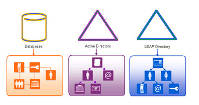
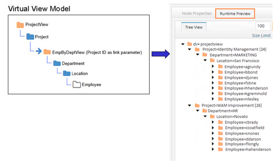

## General Identity View Design

A directory tree is organized in a hierarchy, so that entries in a directory can be referred to by their name relative to the structure of the tree. Within a tree, there is only one namespace for all the entries contained within. Thus, every element of the tree can be located by a distinguished name, one that is unique to that entry.

When designing your directory tree, it is usually recommended that you adopt a relatively simple naming structure. Obviously, the naming structure should be dependent upon what the application that is consuming the data expects to see. Therefore, the approach you should take when creating your tree (either using one of the RadiantOne Wizards or on your own) is to define the simplest tree that meets your application’s needs.

The following sections discuss different design considerations for creating your namespace.

## Design Considerations

The main design considerations can be categorized by the two different security functions addressed by the RadiantOne platform which are authentication and authorization.

### Staging Backend Data

If the identity data sources you plan on integrating with RadiantOne are anything other than LDAP directories or Active Directories, the recommended approach is to first create a basic virtual view that has no specific attribute mappings, computed attributes, joins...etc. and then configure the virtual view with persistent cache and the desired refresh strategy. This is the process to stage the backend data in persistent cache. Then, as a second step, create a virtual view using the cache image as the data source. The virtual view created from the cache should be what is configured with the attribute mappings, computed attributes, joins...etc. This data staging and virtual view layering methodology works well for RDBMS and custom backend data source (e.g. Azure AD, Okta, Salesforce...etc.) that are not as performant as directories for search queries. Keep this in mind as you read through the general view design sections below.

>[!note]
>You can also stage Active Directory and LDAP backends in persistent cache, if these backends are unreliable, or performance needs to be optimized.

### For Authentication

For authentication there are three areas to consider: How to handle overlapping identities (if applicable), if there are overlapping identities what should be the bind order, and finally, what object class and attributes should be associated with the target virtual identity.

**Overlapping Identities**

If there is no identity overlap, then a simple aggregation of all data sources is generally sufficient.

If there is identity overlap, then correlation logic must be defined. Correlation of identities can be expressed in the following simplified example.

An LDAP Directory, Active Directory and an HR database contain different information about users. Some users are in both sources, and some are not. For this example, focusing on a single overlapping user, it is known that you can identify common users across LDAP and Active Directory by comparing uid to sAMAccountName. You can identify common users across Active Directory and the HR database by comparing employeeID to EID. This example is depicted in the diagram below where the order of upload to create the global profile list is LDAP directory, then Active Directory, followed by the HR database. The upload order is important for correlation rules. See the [RadiantOne Global Identity Builder Guide](/global-identity-builder-guide/introduction) for details.

**Bind Order**

If there is identity overlap across data sources, correlation rules must be defined. After, RadiantOne generates a unique list of users in addition to maintaining the reference link (location) to all the sources the identity is located in. With this information, RadiantOne can perform credentials checking against the data sources of your choice in a pre-defined order. The diagram below depicts an example. The database is configured with bind order 1. Therefore, RadiantOne attempts the bind there first. If the bind fails against the database, the LDAP directory receives the bind request (as per the configuration). If the bind were to fail again, Active Directory would receive the bind request. If all sources fail, the client receives a bind failure error from RadiantOne FID.

**Object and Attribute Mapping**

Providing schema compatibility between the application and data source has been a source of pain for any enterprise working with large sets of data on one side, and providing support for new applications on the other. RadiantOne addresses these issues by taking existing schemas (from multiple sources), and mapping them into a common schema which is delivered to the application in a format it understands and expects. Objects and attributes mapping is a key component for addressing the challenges of authentication and authorization.

After connections have been established to the underlying data sources, the next design decision is to map the objects and attributes to a common schema. As mentioned previously, the only way applications can search across the RadiantOne namespace for user accounts contained in a variety of different underlying systems is if all the underlying schemas are mapped to a global schema. This way, an application can search for users based on one common identifier (uid for example), and find the account no matter what the actual underlying source uses as the identifier. The RadiantOne service is responsible for translating the request to search the underlying source appropriately.

### For Authorization

For authorization there are two areas to consider: groups-based authorization and attribute-based authorization.

**Groups-Based Authorization**

There are two approaches for integrating groups into the RadiantOne namespace: Aggregation of existing groups or auto-generation/computation of new virtual groups. Regardless of the design approach, you must also consider how to map the group to the target object class and attributes so applications understand how to locate the groups they are looking for.

**Objects and Attribute Mapping for Groups**

One of the main design considerations for groups-based authorization is to analyze what object class and attributes applications are expecting for locating group entries in the virtual directory. Some applications can be configured to search for groups that match a number of different possible object classes (group, groupOfUniqueNames...etc.) and membership attributes (member, uniqueMember...etc.). Others may expect a very specific object class and attributes. Therefore, you must define a mapping between the group object class and attribute that exists in the underlying directory and the ones your application expects to find. The RadiantOne service is responsible for translating the request to search the underlying source appropriately.

**Aggregation of Existing Groups**

If an aggregation of existing groups from LDAP backends meets your application’s authorization needs, RadiantOne offers two key features for providing this:

Aggregation of Existing Groups – so that all groups can be represented in the same directory namespace. This allows applications to search in one common namespace to find the group they are interested in.

DN Auto-Remapping – to translate the real DN’s contained within the group objects to reflect the new virtual directory tree structure, freeing the DN from the constraints of the underlying source. See diagram below.

For locating existing groups in backend directories, it is important to understand the base DN configuration for the data source. The base DN is the parameter that contains the starting point in the underlying directory where the RadiantOne service starts searching from. For example, let’s say the underlying directory structure looked like the following tree.

If the base DN parameter were set to a value of ou=people,dc=ad,dc=domain, and a search for a particular group came into the RadiantOne service, the group would not be found. This is the because the RadiantOne service searches the underlying directory tree for the group at ou=people,dc=ad,dc=domain and there are no groups located here. In order for the RadiantOne service to be able to retrieve the group entry from the underlying directory, the base DN would have to be configured to point to dc=ad,dc=domain.

Therefore, a design consideration you need to be aware of is where your base DN parameter points to in the data source configuration. If during the initial configuration of the data source, you did not set the base DN to an appropriate location, you can easily change the data source definition in the Control Panel > Setup > Data Catalog > Data Sources.

**User-Defined Groups**

For added flexibility, the RadiantOne service is able to generate group members dynamically. A user-defined group may be named anything and have members that are either explicitly defined or dynamically created based on a specific rule. The diagram below depicts an example of user-defined groups with dynamic members. In the example, group members are built dynamically based on the department attribute in the user entries. If a user’s department were to change, they would automatically be reflected as a member of the new group. For simplicity, only the member ID is shown below in the RadiantOne entry whereas in reality the full user DN is returned (as an LDAP client expects) when these groups are requested.

Static group members are specific user DNs explicitly listed as members for the group entry. Any user DN in the RadiantOne namespace can be assigned to a user-defined group.

Dynamic group members are assigned to groups based on rules defined for specific attributes. The attribute values determine which group the member is associated with. First, determine the starting point in the RadiantOne namespace to locate the possible group members. Then, decide which attribute(s) of these entries should be used to determine which group they belong to. For example, if all user entries that contain a department attribute value of “Sales” or “Sales Associate” should be a member of the Sales group, then the LDAP filter used in the rule would look like: (|(departmentNumber=Sales)(departmentNumber=Sales Associate)). Any valid LDAP filter can be used to create the rule for populating group membership.

**Attributes-Based Authorization**

The term dynamic join means that the RadiantOne service performs the aggregation of attributes from common identities on-the-fly as applications request a particular entry. Each time an application requests a user entry, the RadiantOne service performs the join. This ensures that the most up-to-date information is retrieved in real-time from the authoritative source. If this real-time join does not meet your performance requirements, then a persistent cache may be used. More details on caching can be found in: [Tuning](../tuning/persistent-cache)

Below is a high-level diagram depicting a join across three data sources for a common user.

**Handling Overlapping Attributes**

When you start to join objects across different heterogeneous data source, the possibility of overlapping attributes is high (the same attribute existing in more than one source). Therefore, a common design consideration is determining how you want to handle cases where the same attributes (same names) are found in multiple data sources. Options include:

Have RadiantOne return multi-valued attributes when joining across data sources where attribute names are the same but the values are different.

E.g. join between an Active Directory and Sun Java Directory would yield two different values for phone number. In the joined entry, RadiantOne would return phone number as a multi-valued attribute containing the values from both Active Directory and Sun.

Have RadiantOne only return attributes in the joined entry that are declared as authoritative.

E.g. join between an Active Directory and Sun Java Directory would yield two different values for phone number. Declare the phone number in Active Directory as authoritative. In the joined entry, RadiantOne FID would only return the phone number from Active Directory. In cases where there was no phone number in Active Directory, the one from Sun Java Directory could be returned (or decide to return nothing at all for phone number).

These options are described in more detail in the example below.

If a unique identifier exists (or can be defined based on a logical rule) to relate identities from one data source to another, then the RadiantOne service can easily join the corresponding entries together and return one complete identity. For instance, if a company uses an employee identification number in both its enterprise directory and its HR database, RadiantOne can match the value from each to form an aggregated entry with the attributes from both.

>[!note]
>If a single unique identifier does not exist across the sources, the [Global Identity Builder](../global-identity-builder/introduction) can be used to define correlation rules and create a common identifier that the RadiantOne service can use for the join.

In the example shown below, there is an Enterprise Directory and an HR database, which each contain some information about Aaron Wilson. There is an employee ID number which is found in both sources. RadiantOne uses this attribute’s value to form the join between the two underlying data sources to make a single identity with information from both.

Notice that the phone number stored in the HR database is different than the phone number in the Enterprise Directory. Some analysis is needed to determine how the RadiantOne service should comprise the joined entry. Some possibilities include:

The Enterprise Directory’s phone attributes are known to be out of date and unreliable. Aaron’s unified identity should only use the HR Database’s phone number. In this case, the join can be configured to return the HR database phone number as authoritative. An example of this is shown in the diagram below.

The Enterprise Directory phone numbers are for work phone numbers, and the HR Database tracks home phone numbers. Aaron’s unified identity could show both, either as a multi-valued attribute (as depicted in the diagram below), or by showing each phone number as a separate attribute (each having a different name – one could be mapped/returned by the RadiantOne service as Work Phone while the other could be Home Phone).

Joins and attribute authority are configured in the Control Panel > Setup > Directory Namespace > Namespace Design > Object Builder tab. 

### Model-Driven View Design

When designing your identity view, the main thing to keep in mind is the applications that will be consuming the information. The goal is to design the views of data that applications expect to see. Some applications may work best with a very hierarchical view of data (for delegated administration for example), while a flat view works well for others (a unique list of users for authentication as an example).

There are two aspects to focus on:

- The structure of the identity view (how deep of a hierarchy you need).
- The content of the identity view (which attributes need to be available for the application to provide the expected service)

Again, these are dependent upon the clients that consume the RadiantOne service.

After analyzing the needs of the applications that consume the RadiantOne service, the next thing is to determine where the data that is required to build the virtual views resides. Is the information inside a database (one table? multiple tables?), inside a directory (one or many containers?), inside custom data sources (reachable as a web service?), or does not exist yet (need to build attributes on-the-fly or store new attributes required by the application).

After the primary analysis of your environment and the requirements of client applications, metadata (attributes and relationships) discovery and enhancement (data mapping and analysis) are the next steps.

Once all data source schemas have been extracted, staged in persistent cache (if needed) and enhanced, you are ready to begin building the views that applications will consume.

Identity views are created using Control Panel > Setup > Directory Namespace > Namespace Design.

The sections below introduce possible types of identity views you can build from LDAP and database backends. Building virtual views with objects from many different heterogeneous backends is also discussed.

### Identity Views from LDAP Backends

An LDAP backend is any LDAP-accessible directory. This includes, but is not limited to, Oracle Directory (formerly Sun Java Directory), Active Directory, Novell eDirectory, OpenLDAP, and IBM Tivoli Directory Server.

**Flatten Existing LDAP Hierarchies**

Flat identity views are based on an object class in the LDAP Backend. For example, if an existing LDAP directory tree is hierarchical and user entries are spread across many branches, the virtual view can contain the complete list of users consolidated into one flat list. All entries associated with the configured class are displayed in the identitymview at runtime no matter where the entry exists in the actual LDAP backend. For example, the diagram below depicts an existing LDAP tree. User entries are spread across multiple branches.

The hierarchy shown above can be flattened out in a virtual view based on the object class associated with the users (e.g. inetOrgPerson). The sample flat virtual view structure is shown in the figure below.

When building a flat virtual view, use content objects. For details on content objects, please see: [Model-driven Views](model-driven-views)

### Identity Views from JDBC Backends

A database backend is any JDBC-accessible database. This includes, but is not limited to, Oracle, DB2, Sybase, and Microsoft SQL Server.

**Flatten Existing Relational Databases**

Flat virtual views are based on a database table (or a combination of tables if relationships are present). For example, if an identity view were built from a database table, all records in the table could become an entry in RadiantOne. Attributes of the entries could come from columns in the database table or any related table (according to the schema definition). The diagram below depicts an example database with three related tables.

The information available in the related database objects can be used to build the entries. The RadiantOne entries shown below reflect an identity view based on the database schema/data shown above. Notice that the entries include attributes from all tables.

As described in this section, related database tables can be joined to create the entries in RadiantOne.

Flat identity views are created with content objects. For details on content objects, please see: [Model-driven Views](model-driven-views). For details on joining objects from the same database schema, please see: [Joins](joins.md)

**Context-Driven Hierarchies Based on Existing Metadata**

Context-driven hierarchies, also known as directed knowledge graphs, use the relationships existing in the underlying schema to build the hierarchy. The relationship between the existing objects drives the structure. Relationship-driven hierarchies are composed of container objects, and optionally, content objects.

The following diagram illustrates a relationship-driven hierarchy built from a database that stores customer and related order information.

The screen shot below depicts both the model of the virtual view and the runtime tree shown in the View Designer perspective.

Another example of a relationship-driven hierarchy is one that uses a recursive relationship. In a human resources database, an employees table could have a recursive relationship with itself.
Therefore, you could build an organization hierarchy virtual view depicting the different levels of management. An example is shown in the figure below.

Identity views based on recursive relationships are built with container and optionally content objects. For details on building context-based hierarchies, please see: [Model-driven Views](model-driven-views.md).

### Identity Views Combining Objects from Heterogeneous Sources

Identity views that are comprised of objects and attributes from multiple heterogeneous data sources are built using links and/or joins. Whenever a virtual view needs to contain information from more than one data source, the design options are:

- Extend the entries from the primary source with attributes from other sources that the same users exist in. This is accomplished using [joins](joins.md).
- Condition the identity view hierarchy based on a relationship (common key) between objects across data sources. This is accomplished using: [links](model-driven-views).

### Joins

Joins are used as a way to extend a primary set of entries with attributes from other objects. In general, joins are a way to provide additional context at the level of an entry. Take a person entry as an example; the more attributes available in the person’s entry offers more context about that person (personal information, projects they are working on, who their manager is...etc.).

With RadiantOne, there are two categories of joins:

Regular Join – extend entries with existing attributes from multiple data sources. This is depicted in the figure below.

Extended Join – extend entries with attributes that do not currently exist. These attributes may be required to accommodate specific client application logic (i.e. storage of application-specific attributes) and/or computed (created on-the-fly based on pre-defined logic). Each is portrayed in the architectures below.

In addition to the two different categories of joins, RadiantOne also offers two different join types: left and inner. Each type is discussed in more details below.

**Left Join**

In a left join, all entries from the primary source are returned in the result and if they have a matching entry in a secondary source(s), those additional attributes comprise the main entry. If an entry in the primary source does not have a matching entry in a joined source it is still a possible candidate to be returned to the client (if it matches the original filter in the client request).

**Inner Join**

In an inner join, the primary entries (the starting point for the join) are joined with matching secondary objects. Only entries that can be joined (the intersection) are possible candidates to be returned to the client (if it matches the original filter in the client request). The entry(s) that are returned will be comprised of attributes from the primary object and any joined secondary objects. This is shown in the diagram below.

### Handling Overlapping Attributes

When you start to join objects across different heterogeneous data sources, the possibility of overlapping attributes is high (the same attribute existing in more than one source). You can either map overlapping attributes to unique names or define attribute priority. For details, see: [Joins](joins.md) 

### Links

Links are used to build identity views from objects across heterogeneous data sources.

Two primary uses of links are to:

- Aggregate objects from different data sources into a flat list.
- Build a hierarchical view leveraging relationships that span across data sources.

**Aggregate Objects into a Flat List**

In the example shown below, three data sources are used. One data source is an LDAP directory storing partner information. One data source is Active Directory storing employee information. The third data source is a database storing customer information. Each data source is depicted below with objects representing their schemas.

Let’s assume the desired identity view is one that aggregates people (employees, partners and customers) into one complete list to be used for authentication.

First, three identity views (one from each source) are created. This is depicted in the figure below.

Finally, links are used to aggregate the identity views into one common root naming context. The identity view will consist of employees from Active Directory, partners from an LDAP directory, and customers from a database. Both the identity view model (the link is indicated with a blue arrow in the model view) and the runtime view are depicted below.

This example described virtual views comprised of content objects and links. For more information, please see [Model-driven Views](model-driven-views.md).

**Build a Hierarchical View Leveraging Existing Relationships across Schemas**

To build hierarchical views based on relationships that span across data sources, a link with a special link parameter is required. The link parameter conditions the subtree based on an attribute of the parent object (typically the primary key, but could also be a candidate key). The value of this attribute must match an attribute in the tree to be mounted. An example is used to describe the benefit of using a link with a parameter. The following diagram depicts two databases. One database maintains project information while the other database stores employee information including department and location.

Let’s assume the desired hierarchy should represent projects, followed by the department associated with the project, followed by the location of the employee, and finally the employees working on the project. Since the information is maintained in two separate databases, a virtual view can be built from each. This is depicted in the diagram below. One view is built for projects while the other is a view of employees based on departments and location.

A link (noted with the blue arrow in the virtual view model below) is used to aggregate the virtual views into the required hierarchy. This is depicted in the diagram below.

In the linked view shown in the figure below, the subbranch (view named EmpByDeptView) can be conditioned by setting a linking attribute. In this example, all projects are associated with a department. Since the department object has a relationship with projects (the project ID is available in the department entry), the project ID can be used as the link parameter to condition the subtree. By adding a condition to the link based on the project ID attribute, the subtree shown at runtime is dependent upon the project (the parent node). This is shown in the figure below.

