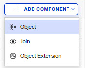
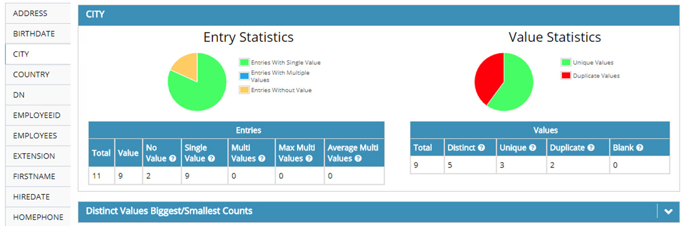

## Overview

Objects from any sources in the RadiantOne namespace can be joined. With joins, you can extend the primary entries with attributes coming from another data source, or new application-specific attributes (required by applications, but don’t exist yet). 

This guide describes the following. 

- [Configuring a Global Join](#configuring-a-global-join)
- [Configuring a Regular Join](#configuring-a-regular-join)
- [Configuring an Extended Join](#configuring-an-extended-join)
- [Bind Order](#bind-order)
- [Attribute Priority](#attribute-priority)

## Configuring a Global Join

To configure a global join:

1. Global joins are configured from Classic Control Panel. To switch to Classic Control Panel, use the menu options for the logged in user in the upper right.

   

1. From the Classic Control Panel, go to the Settings tab > Interception section > Global External Joins.

1. Click **Add**. The Join Wizard opens.

1. Select Regular and click **Next**.

1. Select an Object Class associated with the entries from the primary object that you want to join.

1. Select the attribute you want to base the join condition on from the Join Attribute drop-down menu. Click **Next**.

1. Select the data source that represents the location that contains the secondary objects you want to join with. This can be either RadiantOne or another LDAP server that has been defined as a data source. If using RadiantOne as the secondary join source, select vds as the data source. If you want to join to some other LDAP, you must first configure the data source and then it appears in the drop-down list to select during this step.

1. Click Browse to locate the Base DN or enter the location yourself.

1. Specify the scope of search to perform to find the entries to join with. The drop-down options are base, one, or sub.

1. Select the specific object class associated with the secondary entries you want to join with in the Object Class parameter from the drop-down list. For information on schema extension, please see Extending RadiantOne LDAP Schema.

1. Select the attribute from the secondary object that you want to base the join condition on from the Join Attribute drop-down menu. The value of this attribute should match the value of the primary source join attribute that you set in step above. The Join Condition parameter displays the attribute matching criteria for the join.

1. Click Next.

1. Decide if you would like all the possible attributes returned from the secondary object or if you would like to list the attributes to return. If you choose to list the attributes, click **Add** and enter the name of the attribute (or select from the drop-down list). You also can provide a virtual/mapped name (this is optional and is the name of the attribute that appears in the virtual entry). Click **OK** and repeat this process for each attribute you would like returned from the secondary object. Click **Next**.

1. Enter a unique name for this join profile and click **Finish**.

1. Click **Save**.

## Configuring a Regular Join

Regular joins are configured from the Control Panel > Setup > Directory Namespace > Namespace Design. Select the location where the identity view is mounted below Root Naming Contexts and go to the OBJECT BUILDER tab on the right. The primary source for regular joins is an object in an identity view. If the identity view is created using an LDAP proxy approach, you must select the primary object class on the OBJECT BUILDER tab to start. If the primary object is based on a container or content type of nodes in the identity view, then the object is already known and will automatically appear on the canvas on the OBJECT BUILDER tab.

To configure a regular join:

1.	From the Control Panel > Setup > Directory Namespace > Namespace design, select the location of the node where you want to configure the join. 

1.	On the OBJECT BUILDER tab on the right, select the Object option from the **+ADD COMPONENT** drop-down menu.

  	

1.	To join with an object in an existing identity view mounted in the RadiantOne namespace, choose the *RadiantOne Namespace* option. To join with an object from a data source schema that does not have an identity view created from it, choose the *Secondary Data Source Schema* option.

1.	Click **NEXT**.
1.	If you selected to join with an object in an existing identity view mounted in the RadiantOne namespace, manually enter the target base DN where the secondary entries are located, or click  to select a location in the RadiantOne namespace. Select the object class associated with the secondary entries. Select a scope to locate the secondary entries below the target base dn. Select a Size Limit, this should typically be one (one entry in the primary source matches one entry in the secondary source). Click **SELECT** to add the object to the canvas.
1. If you selected to join with an object from a data source schema, select the data source that contains the secondary object from the drop-down list. Select the schema associated with the data source that contains the object definition (click the *Extract Schema* link if you don't have a schema). Click **NEXT**. Select the object(s) in the schema and click **SELECT** to add the object to the canvas.
1. After all secondary objects are on the canvas, select the Join option from the **+ADD COMPONENT** drop-down menu.

  	
   
1.	Select the secondary object from the drop-down list.

     >[!note] The object associated with the primary object and cannot be changed. Even if you have defined an object class mapping, you see the base object class, not the remapped one.

1.	Select the attribute from the primary object to base the join on from the *Primary Join Attribute* drop-down list.
1.	Select the attribute from the secondary objedct to base the join on from the *Secondary Join Attribute* drop-down list.
1.	The join condition displays and can be manually edited if needed. Click **NEXT**.
   
	
  	
1.	Choose to either *Return all Attributes* from the secondary object, or choose the *Return Attributes Listed below* option and use the **+ATTRIBUTE** button to adjust the list of attributes accordingly.
1.	Click **NEXT**.
1. Enter a unique join ID and click **DONE**.
1. Repeat these steps to add all join conditions. All secondary objects appear on the canvas. An example containing two secondary objects is shown below.

   	

## Configuring Join Condition Based on Computed Attribute

If you would like to create an attribute based on existing attributes of the primary object to base your join condition on, click **Add Computed Attributes**. This allows you to build a new attribute based on the attributes available in the primary object. This new attribute can then be used to base your join condition on. This computed attribute name is prefixed with “vsysa” and is used only to condition the join. It is not returned as part of the virtual entry even if a client were to specifically request it.

## Editing Join Profiles

If you need to edit a join profile, click the  on the canvas that connects to the secondary object. This opens the join configuration panel on the right. 

 
 
-	**Base DN** – The location in the directory containing the objects you would like to join with. This was set in step 7 above.

-	**Scope** – the scope of search that should be performed to locate the entries to join with in the secondary source. This was set in step 8 above.

-	**Join Condition** – the matching criteria used to identify the entries to join. This was set during step 4 and 11 above.

-	**Additional Filter** – By default, the only filter criteria to condition a join is the object class of the parent entry (e.g. objectclass=inetOrgPerson). You can add more criteria to condition the primary entries to join. For example, if you only want to join entries that have a location of San Francisco, you could add (l=San Francisco) in the Additional Filter parameter.

-	**Attributes to return from the secondary objects** – list of attributes to return from the secondary object.

-	**Computed Attributes** – if you are basing the join on a [computed attribute](#computed-attributes) and you want to change the join to use a different/new computed attribute or you want to edit/delete a previously created computed attribute, click **Computed Attributes**. Remember that if you choose to add a new computed attribute, this computed attribute name is prefixed with “vsysa” and is only used to condition the join. It is not returned as part of the virtual entry even if a client were to specifically request it. If you add a new computed attribute to base the join on, you must edit the join condition manually to use the new computed attribute.

If you make any changes to the join condition, remember to click **Save** in the top right corner and click **OK** to apply the changes to the server.

If you are familiar with the [syntax](#deactivating-a-join), you can click **Edit Manually** at the bottom of the Attributes tab in the Edit window. 

## Deactivating a Join

To deactivate a join, uncheck the join’s Active box in the Join Profiles section on the Objects tab and click Save. To reactivate the join, check the join’s Active box and click Save.

## Deleting a Join

## Configuring an Extended Join

The primary source is a virtual view of either an LDAP Backend, Database Backend (a specific object in the database), or a web service backend.

>[!warning] Deleting an extended join does not remove the entries in the extension storage. If you want the extension entries removed, you must do it manually.

### Configuration Steps for LDAP Backends

1.	From the Main Control Panel -> Directory Namespace tab, navigate to the primary/main source below Root Naming Contexts.

2.	On the Objects tab on the right side, click Add and select the object class that will condition the primary entries to be the source of the join.
3.	Click **Save**.

4.	Select an object class from the Primary Objects section, and then locate the Join Profiles section. Click **New**. The Join Wizard opens.

5.	Select the Extended type of join and click **Next**.

6.	Select the object class that will condition the primary entries to be the source of the join.

7.	Choose whether you want the default data store or custom settings.
  **Default** – if this is chosen, RadiantOne stores the extension attributes below the cn=extendedxjoin naming context. This is a hidden naming context and is not seen from the LDAP clients. Hidden naming contexts are prefixed with the keyword hiddenContexts in the rootdse.ldif file. 

  The entries are created automatically and the extension attributes are added, update and deleted based on client requests. The only parameters to configure when using the default settings are the object class you want associated with the extension attributes, and the attribute names.

  **Custom** – if this is chosen, RadiantOne stores the extension attributes in the location of your choice. The location must first exist (create it if you haven’t already) in the virtual namespace. RadiantOne manages the creation of the entries and attributes as well as all modifications to these entries. The parameters you must configure are; the base DN (the location in the virtual namespace where you want to store the extension attributes), the object class to associate the extension attributes with, and how to comprise the RDN attribute (name and attribute from the primary object to populate the target RDN with).

  >[!warning] If your chosen location in the virtual namespace is configured as something other than a RadiantOne Universal Directory store, then the underlying backend must be capable of storing the extension attributes. For example, if the backend is a database table, then columns representing the extension attributes must exist. If the backend is an LDAP directory, the extension attributes should be defined in the schema (if schema checking is enforced) and the object class that is associated with the extension attributes should be set during the configuration steps described below.

8.	The Base DN parameter is relevant only when Custom data store settings has been selected in step 4. The Base DN is the location in the virtual namespace where you want the extension entries/attributes stored.

9.	Enter the object class that is associated with the extension attributes in the Object Class parameter of the Secondary section. The default object class that is used is extensibleObject.

10.	As mentioned above, the RDN setting is only relevant when Custom data store settings have been selected in step 4. This is how the RDN value for the extension entries is set. Enter an RDN name (or leave xid which is the default), and select the attribute that you want to populate the RDN with.

11.	Click **Next**.

12.	Click **Add** to set the extension attribute name. Add as many extension attributes as you need.

13.	When finished, click **Next**.

14.	Enter a unique name for configuration and click Finish to exit the wizard.

15.	Click **Save**. Click **OK** to confirm saving changes to the server.

### Configuration Steps for Database Backends

1.	From the Main Control Panel > Directory Namespace tab, navigate to the primary/main source below Root Naming Contexts.

2.	Select the primary database object selected below Root Naming Contexts (noted as a white or blue folder icon).

3.	Select the Object tab and click New in the Join Profiles section. The Join Wizard opens.

4.	Choose the Extended type of join and click Next.

5.	Choose whether you want the default data store settings or custom.
 Default – if this is chosen, RadiantOne stores the extension attributes below the cn=extendedxjoin naming context. This is a hidden naming context and is not seen from the LDAP clients. Hidden naming contexts are prefixed with the keyword hiddenContexts in the rootdse.ldif file. 

  The entries are created automatically and the extension attributes are added, update and deleted based on client requests. The only parameters to configure when using the default settings are the objectclass you want associated with the extension attributes, and the attribute names.

  **Custom** – if this is chosen, RadiantOne stores the extension attributes in the location of your choice. The location must first exist (create it if you haven’t already) in the RadiantOne namespace. RadiantOne manages the creation of the entries and attributes as well as all modifications to these entries. The parameters you must configure are; the base DN (the location in the virtual namespace where you want to store the extension attributes), the object class to associate the extension attributes with, and how to comprise the RDN attribute (name and attribute from the primary object to populate the target RDN with).

>[!warning] If your chosen location in the RadiantOne namespace is configured as something other than a local RadiantOne Universal Directory store, then the underlying backend must be capable of storing the extension attributes. For example, if the backend is a database table, then columns representing the extension attributes must exist. If the backend is an LDAP directory, the extension attributes should be defined in the schema (if schema checking is enforced) and the object class that is associated with the extension attributes should be set during the configuration steps described below.

6.	The Base DN parameter is only relevant when Custom data store settings have been selected in step 6. The Base DN is the location in the RadiantOne namespace where you want the extension entries/attributes stored. 

7.	Enter the object class that is associated with the extension attributes in the Object Class parameter of the Secondary section. The default object class that will be used is extensibleObject.

8.	As mentioned above, the RDN setting is only relevant when Custom data store settings have been selected in step 6. This is how the RDN value for the extension entries will be set. Enter an RDN name (or leave xid which is the default), and select the attribute that you want to populate the RDN with.

9.	Click **Next**.

10.	Click **Add** to set the extension attribute name. Add as many extension attributes as you need.

11.	When finished, click **Next**.

12.	Enter a unique name for configuration and click **Finish** to exit the wizard.

13.	Click **Save**. Click **OK** to confirm saving changes to the server.

If you need to modify the join condition, select the corresponding join profile and click **Edit**.

-	If the default data store settings are used, then nothing can be changed in the Secondary Object section. If custom data store settings are used, then you can change the Base DN (location in RadiantOne to store the extension entries).

-	Additional Filter – By default, the only filter criteria to condition a join is the object class of the parent entry (e.g. objectclass=inetOrgPerson). You can add more criteria to condition the primary entries to join. For example, if you only want to join entries that have a location of San Francisco, you could add (l=San Francisco) in the Additional Filter parameter.

-	Extended Object Class – this is the objectclass associated with the extension attributes.

-	Extension Attributes to join to the primary objects – list of attributes to return. 

If you make any changes to the join, click **Save** in the top right corner and click **OK** to apply the changes to the server.

If you are familiar with the [syntax](#join-syntax), you can click **Edit Manually** at the bottom of the Attribute tab in the Edit window. 

## Deactivating a Join

To deactivate a join, uncheck the join’s Active box in the Join Profiles section on the Objects tab and click **Save**. To reactivate the join, check the join’s Active box and click **Save**.

### Join Syntax

Examples of the join syntax are shown below. If you need to edit the join condition manually, you must follow this syntax.

**Example 1 – Regular Join**

`LDAP://[VDS]/ou=people,o=myviews?sn:1,cn:1,mail:255,title?sub?(uid=@[CID]) ##JOINTYPE=INNER##SIZELIMIT=1##ALLOW_PARTIAL_ENTRY=yes`

-	The [VDS] shown here indicates the local RadiantOne service as the server containing the secondary objects you want to join.

-	The ou=people,o=myviews section specifies the branch (known as the Secondary Object Base DN) that contains the entries to join to the primary entries.

-	The attributes listed (sn, cn, mail, title) are the attributes to be returned from the secondary entries. The numeric value set after the attribute indicates the precedence level (0 being least authoritative, 255 being most authoritative…if no value is specified, an authority level of 128 is assumed). For more information, please see the section titled [Attribute Priority](#attribute-priority).

-	A sub level search scope is specified to find the secondary objects to join.

-	The join takes place when uid from the ou=people,o=myviews branch matches the CID attribute in the primary source.

-	##JOINTYPE=INNER is set to specify that only primary entries that have a matching entry in the joined source should be returned in the result. Primary entries that do not have a matching entry are not returned. The options for jointype are INNER and LEFT. With LEFT join type, all entries from the primary source are returned. If the primary entry has a matching entry in a secondary source(s), those additional attributes comprise the primary entry.

-	##SIZELIMIT=1 is set to specify only one entry should be returned from the secondary object (for each entry in the primary source). In this case, it is assumed that only one entry should be returned from the ou=people,o=myviews branch (for each entry in the primary source).

>[!note] If no sizelimit is specified, the default used is 1000.

-	##ALLOW_PARTIAL_ENTRY=yes. This is to specify the behavior of RadiantOne if this secondary source is unavailable and it is not able to join. If this is present in the join condition, RadiantOne returns a partial entry to the client. For more details, see [Behavior if a Secondary Source is Unavailable](#behavior-if-a-secondary-source-is-unavailable).

>[!note]
>DO NOT use the ALLOW_PARTIAL_ENTRY=YES property if you plan on caching the joined view as the whole entry must be in the cache and during refresh scenarios you don’t want a partial entry to end up in the cache.

**Example 2 – Regular Join**

`LDAP://198.123.123.444:389/dc=anotherldap,dc=com?sub?(&(sn=@[LASTNAME])(givenname=@[FIRSTNAME]))##USERID=cn=directorymanager##PASSWORD=secret##SIZELIMIT=1`

-	The IP address shown here indicates the server that you want to join to (also known as the Secondary Source).

-	The dc=anotherldap,dc=com section specifies the branch (base dn) in that server that contains the secondary objects to be joined.

-	Since no attributes are listed, all attributes from the secondary object are returned by default.

-	A sub level search scope is specified to find the secondary objects to join.

-	The join takes place when sn matches LASTNAME and givenName matches FIRSTNAME from the dc=anotherldap,dc=com branch.

-	##USERID specifies the user to connect to the secondary source (198.123.123.444)

-	##PASSWORD specifies the password for the user mentioned above.

-	##SIZELIMIT=1 is set to specify only one entry should be returned from the secondary object (for each entry in the primary source). In this case, it is assumed that only one entry should be returned from the dc=anotherldap,dc=com branch (for each entry in the primary source).

>[!note]
>If no sizelimit is specified, the default used is 1000.

**Example 3 – Extended Join**

`LDAP://[VDS]/xid=@[uid],cn=config?newattr1,newattr2?base?(objectclass=*)##EXTENDED=extensibleObject`

-	The [VDS] shown here indicates the local RadiantOne service contains the secondary objects you want to join with.

-	Xid=@[uid] is the RDN of the extension entry. The @[uid] part is substituted with the uid value from the primary entry. This is the unique identifier between the primary entry and the extension entry and used by RadiantOne for the join. The cn=config suffix after the RDN makes up the entire DN for the extension entry.

-	Newattr1 and newattr2 are the extension attributes that will be stored in the RadiantOne Universal Directory store. 

-	A base search scope is specified to find the extension entries to join.

-	(objectclass=*) is part of the primary source filter meaning that only entries that match this filter is extended with the extension attributes during the join.

-	##EXTENDED dictates that this is an extended type of join (as opposed to a regular join which would not have this keyword). The value of EXTENDED is the objectclass to associate the extension entries/attributes with.

**Example 4 – Multiple Join Conditions**

To manually add more than one join condition, separate each LDAP URL with a semicolon (if you go through the wizard to set up multiple join conditions, then they are automatically separated with a semicolon).

`LDAP://[VDS]/dv=activedirectory,o=vds?sAMAccountName,objectclass,cn?one?(employeeID=@[employeeNumber:VARCHAR(255)]);LDAP://[VDS]/dv=oracle,o=vds?EMPNO,ENAME?one?(EMPNO=@[employeeNumber:VARCHAR(255)])`

### Attribute Properties

In a join configuration, attributes from each source can have certain characteristics assigned to them. These properties dictate attribute priority, visibility, searchability and updateability. 

>[!warning]
>The attribute properties described in this section are only applicable for dynamic, non-cached virtual views as they dictate how RadiantOne builds the joined view on-the-fly. Once a virtual view is in persistent cache, these characteristics are irrelevant.

#### Attribute Priority

The priority level is only needed when the attribute name returned from the secondary source is the same (or has been mapped to the same) as in the primary source. The default behavior of RadiantOne is to return a multi-valued attribute if a secondary object returns an attribute with the same name as the primary object (as long as the values are different). If you do not want the attribute to return as a multi-value, you can set a priority for the attributes. The default priority level set for all attributes is normal. From the interface, you would use the priority levels shown below. The corresponding numeric values are also shown and would only be used if you edit the condition manually.

Priority Level – Numeric Value:

-	Lowest – 1
-	Low – 64
-	Normal – 128
-	High – 192 
-	Highest – 255

If you have defined your virtual view from the Main Control Panel > Directory Namespace tab, select the primary object in the list of Root Naming Contexts. On the right side, select the Objects tab (for database backends, this tab is named Object). In the Virtual Object section, the entire list of attributes coming from the primary object is displayed, returned from any secondary objects, and any computed attributes. Select the attribute name that has more than one source and then click Edit Attribute. The details for the attribute are shown. The origin of the attribute shows all sources the attribute comes from. Click in the Priority column to set the priority accordingly. The attribute with the higher priority is returned in the virtual entry.

In addition to setting priority, you can also specify whether the attributes returned from secondary sources are hidden (not visible in the virtual entry), searchable, or updateable.

#### Hidden

You can define an attribute as hidden because you need it for the join (it may be the attribute you are basing your join on), but you don’t want the value to be in the final joined virtual entry. 

To define an attribute as hidden, from the Main Control Panel > Directory Namespace tab, select the view/object below the list of Root Naming Contexts. On the right side, select the Objects tab (for database backends, the Object tab) and in the Virtual Object attribute list, select the attribute you want to hide. Click **Edit Attribute** and check the Hidden in Result box. These attributes are not returned in the virtual entry.

>[!warning] If you edit the join condition manually, and want to make an attribute returned from a secondary object hidden, add a value of 256 to the priority weight you have set. For example, if mail were an attribute returned from a join and you had it set with a priority value of 128 (NORMAL) and NON searchable, and NON updateable, then to make it hidden in the virtual entry, you would change the numeric value to be 1920 (128 + 512 + 1024 +256). Mail:1920 is how it would appear in the join condition if you were to edit the join manually.

#### Searchable

You can define attributes as searchable or not.

-	If an attribute from a secondary source is defined as searchable, and a client uses the attribute in a search filter, RadiantOne must attempt the join on all entries from the primary source and then apply the filter to see which ones match the client search filter. If attributes from secondary sources must be searchable, RadiantOne must go through every entry in the primary source and attempt to join it with a secondary object. After, the client search filter is applied to the result.

-	If an attribute from a secondary source is defined as non-searchable, RadiantOne can apply the search filter on the primary entries (to narrow down the possible join candidates) and then only join those entries. The performance is better in this case because the join only needs to occur on a subset of the primary entries. 

To define an attribute as searchable, from the Main Control Panel > Directory Namespace tab, select the view/object below the list of Root Naming Contexts. On the right side, choose the Objects tab (for database backends, choose the Object tab) and in the Virtual Object attribute list, select the attribute you want to be searchable. Click on Edit Attribute and check the Searchable box. If you do not want the attribute searchable, uncheck this option. When finished, click OK. Click Save in the top right corner and click OK to apply the changes to the server.

>[!warning] If you edit the join condition manually, and want to make an attribute returned from a secondary object non-searchable, add a value of 512 to the priority weight you have set. For example, if mail were an attribute returned from a join and you had it set with a priority value of 128 (NORMAL) and updateable, then to make it non-searchable, you would change the numeric value to be 640 (128 + 512). Mail:640 is how it would appear in the join condition if you were to edit the join manually.

#### Updateable

You can define attributes as updateable or not.

-	If an attribute is updateable, clients may modify the value (remember just because they can doesn’t mean [access controls](access-control) will allow it).

-	If an attribute is not updateable, clients cannot modify the value.

To define an attribute as updateable, from the Main Control Panel -> Directory Namespace tab, select the view/object below the list of Root Naming Contexts. On the right side, choose the Objects tab (for database backends, choose the Object tab) and in the Virtual Object attribute list, select the attribute you want to be updateable. Click on Edit Attribute and check the Updateable box. If you do not want the attribute updateable, uncheck this option. When finished, click OK. Click Save in the top right corner and click OK to apply the changes to the server.

>[!warning]
>If you edit the join condition manually, and want to make an attribute returned from a secondary object not updateable, add a value of 1024 to the priority weight you have set. For example, if phone were an attribute returned from a join and you had it set with a priority value of 128 (NORMAL) and searchable, then to make it not updateable, you would change the numeric value to be 1152 (128 + 1024). Phone:1152 is how it would appear in the join condition if you were to edit the join manually. If you didn’t want the phone attribute to be searchable or updateable (and still have NORMAL priority), it would have a numeric value of 1664. (128 + 512 + 1024).

#### Numeric Values Corresponding to Attribute Properties

The following table indicates the numeric values for each attribute property.

Property	| Numeric Value
-|-
Lowest Priority	| 1
Low Priority	| 64
Normal Priority	| 128
High Priority	| 192
Highest Priority	| 255
Hidden	| 256
NOT Searchable | 512
NOT Updateable	| 1024

Only one priority level is assigned per attribute per source. Whereas a combination of hidden, searchable, and updateable can be assigned per attribute per source. Below are some examples.

Attribute mail coming from a join/secondary source that is searchable, updateable, NORMAL priority and NOT hidden = 128 

Attribute mail coming from a join/secondary source that is NOT searchable, updateable, NORMAL priority and NOT hidden = 640         (128+512=640)

Attribute mail coming from a join/secondary source that is searchable, NOT updateable, HIGHEST priority and NOT hidden = 1279      (255+1024=1279)

Attribute mail coming from a join/secondary source that is NOT searchable, updateable, HIGH priority and hidden = 960      (192+512+256=960)

### How the Join is Performed

>[!warning]
>If the “Limit Attributes Requested from the LDAP Backend” optimization is enabled for a proxy to an LDAP backend, in addition to a join, the attribute(s) from the primary LDAP source that the join(s) are based on should be listed as “always requested” on the Attributes Tab. Otherwise, RadiantOne may not get the attribute(s) from the primary backend that are required to perform the join and the join cannot be done. For more information on limiting attributes requested from the LDAP backend, please see the [RadiantOne Namespace Configuration Guide](/namespace-configuration-guide/01-introduction).

#### Pre-filtering on the Primary Source

If the filter in the client search involves attribute(s) that come from the primary (main) source only, RadiantOne pre-filters (applying that filter to the primary entries to reduce the number of entries that are required to join). If the filter in the client search involves attributes that can come from secondary (joined) sources and those attributes(s) are marked as searchable, then RadiantOne cannot pre-filter on those attributes and must join everything first and then apply the filter on the joined result. RadiantOne knows if attributes used in the filter could come from secondary sources if the attribute(s) are specifically requested in the join condition, or if *  is used in the join condition to return everything from the joined source.

If you require the attributes from the secondary sources to be [Searchable](#searchable) (used in a filter from a client search), you must specify them as such. If the filter received in the search contains any attributes that are defined as searchable from a secondary source, then RadiantOne does not pre-filter against the primary source for those attributes. The join is first performed (all entries are joined), and then the filter is applied on the result. For example, let’s say you have a backend pointing to a Sun Directory and you want to join with a virtual view of Active Directory. The following join condition could be defined:

`LDAP://[VDS]/dv=activedirectory,o=vds?sAMAccountName,objectclass,cn:1152?one?(employeeID=@[employeeNumber:VARCHAR(255)])`

Since cn is requested in the join condition (as searchable, NOT updateable, and NORMAL priority, dictated by the numeric value), RadiantOne knows that it should apply the filter received from the client after first joining the entries. The Sun entries are joined with the Active Directory entries (where employeeNumber=employeeID) and then the filter requested by the client is applied on the result. Obviously, performance is slower if you want attributes from joined sources to be searchable (because of the requirement to first join all entries).

However, if a filter also contains an attribute that is only defined in the primary source (and not listed in any join condition), RadiantOne applies the filter on the primary entries to reduce the number that needs to be joined. Then, the reduced number of entries are joined and the client filter is applied on the joined result.

For example, using the join condition defined above, if RadiantOne receives a filter like: (&(mail=lcallahan@rli.com)(cn=laura callahan)), it first searches the Sun Java Directory for entries matching mail=lcallahan@rli.com (because mail is not defined as an attribute to return from Active Directory). Then it joins the entries that were returned with the corresponding entries in Active Directory. Finally, RadiantOne applies the original filter on the joined entries and the ones that match are returned to the client. The result sent back to the client depends on whether your join configuration is set for a Left or Inner join. Each is described below.

#### Left Join

In a Left Join, all entries from the primary source are returned in the result and if they have a matching entry in a secondary source(s), those additional attributes comprise the main entry. If an entry in the primary source does not have a matching entry in a secondary source it is still a possible candidate to be returned to the client (if it matches the original filter in the client request).

#### Inner Join

In an Inner Join, the primary entries (from the starting point for the join) are joined with matching secondary entries. Only entries that can be joined (the intersection) are possible candidates to be returned to the client (if it matches the original filter in the client request). The entry(s) that are returned will be comprised of attributes from the primary object and any secondary objects that were joined.

#### Behavior if a Secondary Source is Unavailable

The behavior of RadiantOne in cases where one or more of the secondary sources is unavailable depends on if the Process Joins and Computed Attributes Only when Necessary optimization is enabled or not. For more information on this setting, please see the [RadiantOne Namespace Configuration Guide](/namespace-configuration-guide/01-introduction).

If the Process Joins and Computed Attributes Only when Necessary optimization is enabled, and the filter coming in from the client request only involves attributes from the primary source, and the attributes requested are only from the primary (main) source, RadiantOne does not need to perform the join. If one of the secondary backend sources is down, RadiantOne does not know in this case because the optimization tells it to only join if necessary, and in this example, a join is not necessary. Therefore, RadiantOne does not know if a secondary backend is down or not. In this situation, the entry (with the specific attributes requested) is returned to the client. If the filter in the client request involves attributes that could come from a secondary source (and they are configured as searchable), or if the requested attributes from the client include attributes from secondary sources(s), the optimization is not possible and RadiantOne must join. In this case, the default behavior is to not return the entry at all. If the client issued a base search, they receive LDAP error code 32 along with the error message from the secondary backend that was unavailable. If the client issued a one level or subtree search, they receive error code 9 along with the error message from the secondary backend that failed.

If you would prefer RadiantOne return partial entries, then you must specifically indicate this in the external join condition. [Manually edit the join condition](#deactivating-a-join) and add the following:

`##ALLOW_PARTIAL_ENTRY=yes`

If partial entries has been allowed, and the client issued a base search, they receive LDAP error code 0 (no error) along with the partial entry (whatever information RadiantOne was able to retrieve from available sources). Each returned entry contains an additional attribute of vsyspartialentry=true. If the client issued a one level or subtree search, they receive LDAP error code 9 along with the partial entry (whatever information RadiantOne was able to retrieve from available sources) and an error message from the secondary backend that was unavailable. Each returned entry contains an additional attribute of vsyspartialentry=true.

>[!note]
>DO NOT use the ALLOW_PARTIAL_ENTRY=YES property if you plan on caching the joined view as the whole entry must be in the cache and during refresh scenarios you don’t want a partial entry to end up in the cache.

Please see the diagram below for more details on the [join behavior](#join-behavior-diagram).
 
#### Join Behavior Diagram

>[!warning]
>If the joined virtual view is stored in persistent cache, during refresh operations, all backends must be available for the persistent cache to be refreshed. If one of the backends is not available when RadiantOne attempts to rebuild the entry and update the cache (resulting in error code 1 or 9 returned), the cache is not updated and the failed entry is logged in cn=cacherefreshlog. In addition, do not set the ALLOW_PARTIAL_ENTRY property to YES if you plan on caching the joined view as the whole entry must be in the cache and during refresh scenarios you don’t want a partial entry to end up in the cache.

## Bind Order

If you have configured joins between multiple sources, RadiantOne can send the bind request (credential checking) to many backends (any that play a role in the join). If you are not using joins, then bind order is irrelevant.

After the join is configured, you can set the bind order (the backends to check in a particular order). The diagram below depicts an example. The database is configured with bind order 1. Therefore, RadiantOne attempts the bind there first. If the bind fails against the database, the LDAP directory receives the bind request (as per the configuration). If the bind were to fail again, Active Directory would receive the bind request. If all sources fail, the client receives a bind failure error from RadiantOne.

If you have configured joins between the selected LDAP object and other sources, RadiantOne can send the bind request (credential checking) to many backends. 

To configure the bind order:

1.	From the Main Control Panel > Directory Namespace Tab, select the node representing your LDAP backend below Root Naming Contexts. 

2.	On the right side, select the Objects Tab.

3.	Click the **Edit** button next to Define Bind Strategy at the bottom. The Edit Bind Strategy window displays a list of all sources (the primary along with any secondary sources you have joined with). 

4.	Enable the source as a possible participant in the bind operation. 

5.	Use the up and down arrow to determine the order RadiantOne should attempt the credential checking. RadiantOne attempts to verify the credentials against the first enabled source in the list. If it fails, then the next is tried and so forth. If all enabled sources have been tried without success, RadiantOne returns a bind failed error to the client.

## Attribute Priority
