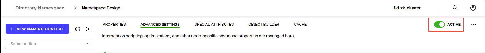
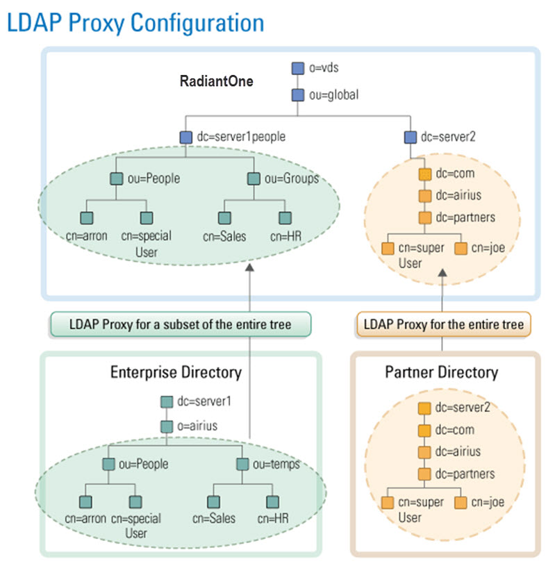
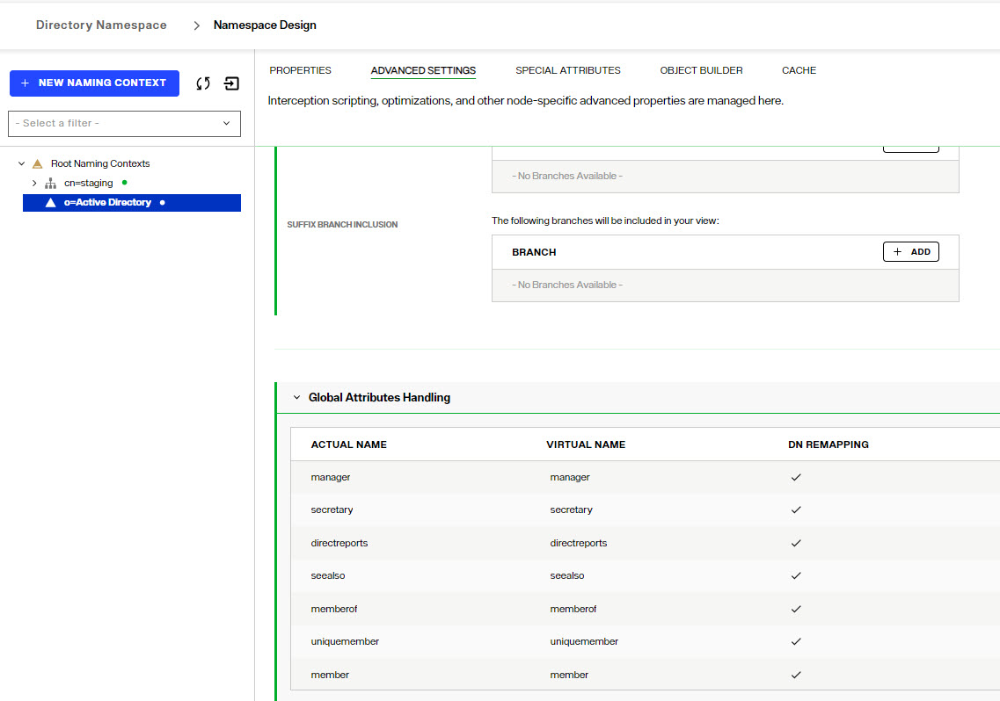

## Overview - Creating Identity Views

There are two main design approaches to creating identity views.
 1. Using an [LDAP proxy approach](#ldap-proxy-views-introduction), where the identity view deployed in RadiantOne represents an exact hierarchy (or specific sub-branch) of an existing LDAP directory data source. With this view design approach you are limited to the exact hierarchical structure of the existing directory store backend. However, you can choose to include or exclude specific branches to limit the data in the identity view.
 2. Using a [model-driven approach](model-driven-views.md), where the identity view deployed in RadiantOne can be designed based on the metadata extracted from existing identity sources. With this view design approach you have infinite flexibility and can create flat views, or very complex hierarchies based on the objects and attributes from each identity source. Use the model-driven approach to create identity views from LDAP, JDBC-accessible data sources and Custom data sources.

A special type of identity view that leverages the model-driven design approach is generated by the Global Identity Builder tool. This tool can be used to address two commmon identity data challenges:
- No single identity source containing all user accounts. This means integrating with multiple identity sources containing various levels of overlapping user accounts. The Global Identity Builder generates an identity view that provides a unique reference list of user accounts, joining overlapping ones as needed.
- Multiple identity sources containing 100% overlapping user accounts without a single attribute to uniquely identify the overlap. The Global Identity Builder generates an identity view that provides a unique reference list of user accounts, joining overlapping ones based on one or more cascading matching rules. Each pair of identity sources can have their own list of matching rules, allowing identity architects to address a variety of complex data quality challenges (e.g. Sources A, B and C have overlapping identities that can be identified by their Employee Name + Department Name + Last 4 characters of Employee ID, if there is no match found, check Location + Last 4 characters of Employee ID + Login Name).

For more details, see [Global Identity Builder](../global-identity-builder/introduction).

Every Root Naming Context configured in the RadiantOne namespace can be active or inactive.
There is a toggle to indicate whether the naming context is active or not. Toggle it off to deactivate the naming context. Only active naming contexts are accessible in RadiantOne by clients.



## LDAP Proxy Views Introduction

Identity views can be created from LDAP directories and associated with a specific root naming context. A root naming context is the very top level in the RadiantOne namespace, and you can have many different root naming contexts. This section describes how to create root naming contexts for mounting identity views from LDAP directory backend data sources. 

### Configuration

If you configure an LDAP proxy view by mounting an LDAP backend directly at the Root Naming Context, it is the only backend that can be mounted at this specific naming context. If you want to comprise the identity view from many different backends, add new labels below the root naming context. Use labels to layout the hierarchy that you want and then mount backends for the data sources that you want to aggregate at the corresponding labels.

1.	First, data sources for each backend must be defined. From the Control Panel > Setup > Data Catalog > Data Sources, click . Use the Active Directory, Generic LDAP, Open DJ or RadiantOne directory template to define data sources.

2.	In the  Control Panel > Setup> Directory Namespace > Namespace Design, click . 

3.	Enter the new root naming context and click **SAVE**.

4.	Click .

5.	Select the **LDAP** backend type and click **SELECT**.
6.	Select the data source defined in step 1.
7.	Click  to select a remote base DN.

8.	Click **MOUNT**.

9.	To modify the LDAP proxy view, select the appropriate node below Root Naming Contexts and modify the settings on the right side. Click **SAVE** when finished.


 

LDAP Backends can also be mounted at any label node that doesn't already have something mounted at it in a naming context. 

### Deleting LDAP Proxy Views

To delete an LDAP Proxy View:

1. Navigate to Control Panel > Setup > Directory Namespace > Namespace Design.
2. Select the root naming context where the LDAP proxy view is mounted.
3. On the PROPERTIES tab on the right, click the Delete button.
4. Click **DELETE** to confirm.


## LDAP Proxy View Properties

LDAP proxy view properties are managed from the Control Panel > Setup > Directory Namespace > Namespace Design. These settings are found on the PROPERTIES tab for the naming context where the LDAP proxy view is mounted.

### Type

Indicates the type of identity view. LDAP Backend is the value for LDAP proxy views. This value is read-only for informational purposes.

### Naming Context

Indicates the naming context in the RadiantOne namespace where the identity view is mounted. This value is determined when you mount the LDAP backend based on the naming context where you've chosen to mount the view and is read-only from here.

### Remote Base DN

The Remote Base DN is the starting point to search from in the backend directory. This is set when you create the data source and can be changed later from here by either entering the base DN, or clicking the  button to select the location in the backend directory tree.


All entries below the remote base DN are displayed when clients navigate below the naming context in the RadiantOne namespace.

### Data Source

The RadiantOne data source associated with the LDAP directory backend that is mounted for this identity view. The data source can be changed by clicking the drop-down menu and selecting a new data source.

### Host

Server name or IP address. This is read-only from here. To modify the value, go to Control Panel > Setup > Data Catalog > Data Sources and edit the data source from this list.

### Port

Port that the server is listening on. This is read-only from here. To modify the value, go to Control Panel > Setup > Data Catalog > Data Sources and edit the data source from this list.

### Bind DN

Service account user DN. This user is used by RadiantOne to create connections to the backend LDAP directory.
This is read-only from here. To modify the value, go to Control Panel > Setup > Data Catalog > Data Sources and edit the data source from this list.

### SSL

Indicates if the SSL port is configured in the data source. This is read-only from here. To modify the value, go to Control Panel > Setup > Data Catalog > Data Sources and edit the data source from this list.

### Referral Chasing

Indicates if referral chasing is configured in the data source. This is read-only from here. To modify the value, go to Control Panel > Setup > Data Catalog > Data Sources and edit the data source from this list.

### Paged Results Control

Indicates if the Paged Results Control is configured in the data source. This is read-only from here. To modify the setting and value, go to Control Panel > Setup > Data Catalog > Data Sources and edit the data source from this list.

### Schema Enforcement Policy

The schema enforcement policy option allows you to choose how you want the proxy to behave when adding entries that may not match the schema of the backend directory (i.e. having an attribute that is not part of the object class).

Select one of the three following options. 

*Pass-through*: All attributes in the operation are sent to the backend regardless of whether they match the backend schema. This is the default mode.

>[!note] Modifications may fail at the backend if this option is selected and the entry to be added violates the backend schema definition.

*Filter*: Attributes in the operation that do not match the backend schema are removed before being passed to the backend layer.

*Strict*: RadiantOne adds objectclass=extensibleObject to the entry before passing the operation to the backend directory. This ensures the operation succeeds without an object class violation.


### Dedicated Connection

By default, RadiantOne uses the service account configured in the data source and connection pooling for connecting to backend LDAP servers. Therefore, when clients access the RadiantOne service, it can re-use any open connections in the pool to connect to the underlying LDAP server. Then, authorization is enforced at the RadiantOne level based on access controls. This is best practice and the recommended approach.

If [Proxy Authorization](#proxy-authorization) is insufficient to condition the connection to the backend, and you want the connection from the client to RadiantOne to determine the lifecycle of the connection to the underlying LDAP server, you can enable the dedicated connection option.
If the dedicated connection option is enabled, RadiantOne does not use the connection pool and the connection to the underlying LDAP directory is closed when the client disconnects from RadiantOne. If dedicated connections are not used, and a client disconnects from RadiantOne, the connection to the underlying LDAP server can still remain in the connection pool (until the configured timeout parameter is reached, which then removes the connection from the pool).

>[!note] Dedicated connections are best used in cases where there are only a few clients accessing the RadiantOne service but generate a lot of traffic. Clients must handle the opening and closing of connections efficiently (e.g. don’t leave open connections idle for long periods of time).

### Proxy Authorization

When the RadiantOne service acts as a client and connects to a backend directory, certain credentials are used (e.g. the Bind DN and Bind Password configured in the data source connection string). These credentials determine what operations are allowed and it is the backend directory which enforces authorization for this user. Some directories support the Proxy Authorization control allowing a client to switch the user ID, for authorization purposes, without having to re-authenticate with a new connection. If the backend directory supports the Proxied Authorization control, and there is the need to base authorization on a different user than the one who authenticated, you can enable the Proxy Authorization checkbox. With this approach, RadiantOne can use certain credentials (e.g. the Bind DN and Bind Password configured in the data source connection string) when connecting to the backend directory and pass the needed control along with the user DN of the person they want to represent for authorization in the requests. The backend directory checks the proxy authorization rules that have been configured to make sure the service account RadiantOne used to connect with is allowed to represent the person passed in the request. If so, the service account is allowed to perform any operations the person it is impersonating would be allowed to do. Again, for this functionality to work, the Proxy Authorization control must be supported by the backend directory and proxy authorization rules must be properly defined in the backend directory. A high-level diagram detailing the behavior is shown below.


### Pass Thru Authorization

Pass thru authorization is for determining which account RadiantOne uses to connect to a backend directory and ultimately how access rights (authorization) is enforced. A high-level diagram detailing the behavior is shown below.


This functionality is best described with examples. The following three examples/diagrams detail the different configurations possible.

>[!warning] This feature (and the description below) is for AUTHORIZATION.


 


In the diagram above, there are two different proxy views configured in RadiantOne. One for an Enterprise Directory mounted in the virtual namespace below dc=server1people,ou=global,o=vds. The other one is for a Partner Directory and is mounted in the virtual namespace below dc=server2,ou=global,o=vds.

If there is a service account credential (user Bind DN/password) specified in the data source representing the backend for the LDAP proxy configuration, the person that successfully binds to RadiantOne uses this account when searching, adding, modifying, or deleting information in the corresponding backend directory. In other words, anyone who binds successfully has the access rights defined for the service account user. This is called delegation.

The example below explains what happens when a service account credential defined in the data source.

Data Source for Server 1 in this example is:

`Hostname: Server1`
<br>`Port:1389`
<br>`Base DN: o=airius,dc=server1`
<br>`Bind DN (service account): cn=specialuser,ou=people,o=airius,dc=server1`
<br>`Bind Password: password`
<br>`Data Source for Server 2 in this example is:`
<br>`Hostname: Server 2`
<br>`Port: 389 `
<br>`Base DN: dc=server2`
<br>`Bind DN (service account): cn=superuser,dc=partners,dc=airius,dc=com,dc=server2`
<br>`Bind Password: password2`

**Example 1: No Pass Thru Authorization**
<br>If user: “cn=joe,dc=partners,dc=airius,dc=com,dc=server2,ou=global,o=vds” binds successfully to RadiantOne and accesses the dc=server2,ou=global,o=vds branch (the same backend server that processed the bind request), then his access rights to the data are determined by the service account user credentials in the backend server (“cn=superuser,dc=partners,dc=airius,dc=com,dc=server2”).

If “cn=joe,dc=partners,dc=airius,dc=com,dc=server2,ou=global,o=vds” accesses the dc=server1people,ou=global,o=vds branch, then he has the access rights associated with the service account user specified in the data source for server 1 (“cn=specialuser,ou=people,o=airius,dc=server1”).

If user “cn=aaron,ou=people,o=airius,dc=server1people,ou=global,o=vds” binds successfully and accesses the dc=server1people,ou=global,o=vds branch, then he has the access rights associated with the service account user specified in data source, “uid=specialuser,ou=people,dc=server1”.

If “cn=aaron,ou=people,o=airius,dc=server1people,ou=global,o=vds” accesses the dc=server2,ou=global,o=vds branch, then he has the access rights (assigned in the underlying server) associated with the service account user: “cn=superuser,dc=partners,dc=airius,dc=com,dc=server2”.

With this configuration approach, any user that successfully binds (anywhere in the RadiantOne namespace), no matter what proxy branch in the virtual namespace they access, has the same access rights (because they inherit the access rights of the service account Bind DN user).

**Example 2: Using Pass Thru Authorization**
<br>The three LDAP proxy definitions shown in the diagram below are used to explain the Pass Thru Authorization feature.


 


Data Source for Server 1 in this example is:

`Hostname: Server1`
<br>`Port: 1389`
<br>`Base DN: ou=People,o=airius,dc=server1`
<br>`Pass Thru Authorization: Enabled`

Another Proxy Configuration for Server 1 (with a different Base DN) is:

`Hostname: Server 1`
<br>`Port: 1389 `
<br>`Base DN: ou=temps,o=airius,dc=server1`
<br>`Pass Thru Authorization: Enabled`

Data Source for Server 2 in this example is:

`Hostname: Server 2`
<br>`Port: 389 `
<br>`Base DN: dc=server2`
<br>`Pass Thru Authorization: Enabled`

If no service account credentials (Bind DN/Bind password) are configured in the data source, and Pass Thru Authorization is enabled on the proxy view, then the user that binds successfully has access rights that are defined for them in the directory where they have been authenticated. This is known as impersonation. RadiantOne impersonates this user when performing operations on the underlying server.

For example, if user “cn=aaron,dc=server1people,ou=global,o=vds” successfully binds and accesses the dc=server1people,ou=global,o=vds branch, he is assigned the access rights that have been defined in Server1 for him.

If “cn=aaron,dc=server1people,ou=global,o=vds” accesses the dc=server1grp,ou=global,o=vds branch (since dc=server1people and dc=server1grp are different proxy views to the SAME data soure), Aaron also uses the access rights that have been defined in Server1.

However, if Aaron accesses the dc=server2,ou=global,o=vds branch, he is only allowed anonymous access to this server (because no service account was specified in the data source configuration and Aaron did not originally bind to dc=server2).

**Example 3: Advanced Capability of the Pass Thru Authorization**

The two LDAP proxy definitions shown in the diagram below are used to explain the Pass Thru Authorization feature when there is also a service account Bind DN specified in the data source configuration.


 

Data Source for Server 1 in this example is:

`Hostname: Server1`
<br>`Port:1389`
<br>`Base DN: o=airius,dc=server1
Bind DN (service account): cn=specialuser,ou=people,o=airius,dc=server1`
<br>`Bind Password: password `
<br>`Pass Thru Authorization defined on the proxy view defined: Enabled`

Data Source for Server 2 in this example is:

`Hostname: Server 2`
<br>`Port: 389 `
<br>`Base DN: dc=server2`
<br>`Bind DN (service account): cn=superuser,dc=partners,dc=airius,dc=com,dc=server2`
<br>`Bind Password: password2`
<br>`Pass Thru Authorization defined on the proxy view defined: Enabled`

If a service account (Bind DN/Bind Password) is specified in the data source and the Pass Thru Authorization feature is enabled on the proxy view, then, as in the previous sample, a user that successfully binds has the access rights that have been defined for them in the corresponding server (impersonation). 

For example, if user “cn=aaron,ou=people,dc=server1people,ou=global,o=vds” successfully binds and accesses the dc=server1,ou=global,o=vds branch, then he has the access rights that have been defined for him in Server1. In this case, the specific user that binds access rights override those of the user in the Bind DN parameter in the data source definition. As mentioned before, this is known as impersonation. RadiantOne connects to the backend LDAP server with the user who binds successfully, and the access rights allowed for them are applied when performing all operations (the backend LDAP enforces access rights).

If user “cn=joe,dc=partners,dc=airius,dc=com,dc=server2,ou=global,o=vds” successfully binds to RadiantOne and accesses the dc=server1,ou=global,o=vds branch, he has the access permissions assigned to the service account user that is specified in the Bind DN parameter of the LDAP data source for server 1. Since “cn=joe,dc=partners,dc=airius,dc=com,dc=server2,ou=global,o=vds” was NOT authenticated to the backend LDAP server that he is now trying to access, he only has the access rights that have been allocated to the service account user (“cn=specialuser,ou=people,o=airius,dc=server1”). This is known as delegation. Had there not been a service account specified for Server 1, Joe would have anonymous access (as described in Example 2 above).

### LDAP Controls

A control is additional information that can be included in an LDAP request or response. RadiantOne can play the role of both an LDAP server and an LDAP client to other backend directories. To understand controls supported by RadiantOne as an LDAP server, see the [Supported Controls](../global-settings/client-protocols#supported-controls). RadiantOne’s handling of LDAP controls as a client to a backend directory is described in this section.

**VLV/Sort**

If a client searches and passes the VLV control against a branch that is associated with an LDAP directory backend (not a persistent cache or a RadiantOne Directory store), RadiantOne forwards the search request along with the included control to the backend LDAP server. In this case, it is the responsibility of the backend LDAP server to implement the VLV control. RadiantOne returns any controls received from the LDAP backend to the client.

**Paged Results**

If the backend LDAP directory supports the paged results control, RadiantOne can request that the results from the backend be returned in pages. The support for paging is enabled, and the page size is set, at the level of the LDAP data source definition.


**Controls Passed from Client Requests**

All LDAP controls that RadiantOne receives from clients during LDAP modify, modifyDN, add, or delete requests are forwarded to the backend LDAP directory. An example would be a client sending a modify request for a user’s password to RadiantOne along with LDAP Control 1.2.840.113556.1.4.2239. RadiantOne would send the password update to the backend directory along with the LDAP control. The backend directory is the enforcement point for the control. RadiantOne responds to the client with all information returned from the backend directory.

**Pre-Read Attributes**

This control indicates that all modify, modify DN, and delete requests should include the pre-read control to retrieve the specified attribute’s value(s) as they appear immediately before the operation has been processed. Pre-read controls may be used to obtain replaced or deleted values of modified attributes or a copy of the entry being deleted. The backend directory is the enforcement point for the control. RadiantOne responds to the client with all information returned from the backend directory.

**Post-Read Attributes**

This control indicates that all add, modify, and modify DN requests should include the post-read control to retrieve the specified attribute’s value(s) as they appear immediately after the operation has been processed. Post-read controls may be used to obtain values of operational attributes, such as the “entryUUID” and “modifyTimestamp” attributes, updated by the server as part of the update operation. The backend directory is the enforcement point for the control. RadiantOne responds to the client with all information returned from the backend directory.


### Merge Backend Configuration - Merging Other LDAP Proxy Views

The merge backend configuration section allows you to merge multiple directory data sources into a single RadiantOne identity view, while maintaining the underlying directory hierarchy. The merge backend configuration is ideal for situations where applications expect to find information in an explicit hierarchy which already exists in a backend LDAP directory and there is a need to extend a part of this hierarchy with additional entries from other directory data sources.  The backend LDAP directory that contains entries to be merged must be configured as a RadiantOne data source before using the merge backend configuration. Use Control Panel > Setup > Data Catalog > Data Sources to configure data sources.

>[!warning]
>When merging backends with this configuration, the RadiantOne service does not perform identity correlation or joins. If the data sources being merged contain overlapping users (identified by the same DN after the merge) only the entry from the primary/main source are returned when browsing or searching against the view. If the overlapping users have an attribute in common, you can join the view with the other virtual view to return attributes from the secondary sources. Use the Object Builder tab to configure joins.

To configure a merged backend:

1. Select the LDAP Proxy View that represents the main directory backend hierarchy in the Control Panel > Setup > Directory Namespace > Namespace Design.
2. Select the PROPERTIES tab on the right.
3. Navigate to the bottom, section named Merge Backend Configuration and click: 
4. Select the data source that represents the directory backend containing the entries to be merged into the main LDAP proxy view from the Data Source drop-down list.
5. Either manually enter the Remote Base DN, or click the  next to the Remote Base DN property to navigate to the container where the entries in the data source to be merged are located.
6. Either manually enter the RadiantOne DN, or click the  next to the RadiantOne DN property to navigate to the location in the main LDAP Proxy view where you want the merged entries to appear.
7. Click **ADD**.
8. Click **SAVE**.

When client queries reach the RadiantOne DN configured in step 6, the entries located in the merged backend at the location configured in step 5 are returned. 

 
## LDAP Proxy View Advanced Settings
LDAP proxy view advanced settings are managed from the Control Panel > Setup > Directory Namespace > Namespace Design. These settings are found on the ADVANCED SETTINGS tab for the naming context where the LDAP proxy view is mounted.

### Interception Script

Interception scripts allow for overriding default behavior of the RadiantOne service and can be invoked for pre-operations (prior to the RadiantOne service querying the backend identity sources, or post-operations (prior to the RadiantOne service returning results to clients).

To invoke an interception script for pre-operations, use the: On Bind, On Modify, On Compare, On Search, On Add, On Delete, or On Special Operations options.
To invoke an interception script for post-operations, use the: Search Result Entry Processing option.

After enabling the desired options, customize the interception script logic, rebuild the intercept jar file and restart the RadiantOne service.

For complete details, see: [Interception Scripts](view-interception.md)


### Optimizations

There are different options that can be used to optimize identity views from LDAP backends.
The following options can be enabled from the ADVANCED SETTINGS tab. 
- Limit attributes requested from the LDAP backend
- Process joins and computed attributes only when necessary
- Use client size limit value to query backend

For details on these options and other ways to optimize the identity view, see: [Tuning](../../tuning/optimize-views)

### Object Class Mapping

For applications to perform a global search in the RadiantOne namespace and be able to locate entries from many different types of underlying sources, the schemas must be mapped to a common naming. You must establish the common mapping based on the criteria a client application uses to search. For example, if a client application were to look for user entries based on a filter of (objectclass=User), you must make sure that all required objects match this class definition. 

To map object classes:

1.	From the Control Panel > Setup > Directory Namespace > Namespace Design, select the desired node representing the LDAP backend below Root Naming Contexts.

2.	On the right side, select the ADVANCED SETTINGS tab.

3. In the *Other Settings* section, locate the Object Class Mapping setting.
   
4. 	Click the **Edit** button next to Objectclass Mapping. A list of all objectclasses available in the underlying schema displays. 

5.	Enter the object class in the Mapped Objectclass column and click **OK**.

6.	Click **SAVE**.

In the example below, the inetOrgPerson object class is set to map to User.


This means that all inetOrgPerson entries from the underlying source are returned with objectclass=user (as depicted in the screen shot below).

 
### Pre-processing Filter

Proxy identity views from LDAP backends can be conditioned by using a pre-processing filter. A pre-processing filter is any valid LDAP filter that you want to always be sent by RadiantOne when querying the backend LDAP server. The query filter that is sent to the backend is based on the client request that came into RadiantOne in addition to whatever you have set as a pre-processing filter. 

To define a pre-processing filter:

1.	From the Control Panel > Setup > Directory Namespace > Namespace Design, select the desired node representing the LDAP backend below Root Naming Contexts.

2.	On the right side, select the ADVANCED SETTINGS tab.

3.	In the *Other Settings* section, locate the Pre-Processing Filter setting. 

4.	Click the  icon.
5.	Enter a valid LDAP filter or toggle on the  to use an assistant form to generate the filter.

    >[!note] As mentioned, the value set here is added to the filter requested from RadiantOne client when it issues the query to the backend.

6.	Click **CONFIRM**.

7.	Click **SAVE**.

### Post-processing Filter

Proxy identity views from LDAP backends can be conditioned by using a Post-processing  filter. After RadiantOne queries the backend and retrieves the results, this filter excludes certain entries from being returned to the client. 

To define a post-processing filter:

1.	From the Control Panel > Setup > Directory Namespace > Namespace Design, select the desired node representing the LDAP backend below Root Naming Contexts.

2.	On the right side, select the ADVANCED SETTINGS tab.

3.	In the *Other Settings* section, locate the Post-Processing Filter setting.

4.	Click the  icon.
5.	Enter a valid LDAP filter or toggle on the  to use an assistant form to generate the filter to indicate which entries you want excluded from the results prior to RadiantOne returning them to the client. 

6.	Click **CONFIRM**.

7.	Click **SAVE**.
   
### Suffix Branch Exclusion

By default, once you establish a Remote Base DN (starting point to search from in the underlying directory) for the identity view, all container levels from the backend below this location are mounted in it.

If you want to exclude some branches/containers, you can specify them in the Suffix Branch Exclusion property on the ADVANCED SETTINGS tab.

Click **ADD** and select the branch you would like to exclude from the identity view. The example below shows how to exclude the CN=Computers,DC=seradiant,DC=dom branch.


 
You can exclude as many branches as you want. The image below depicts three branches configured for exclusion. These branches will not appear in the identity view at runtime. [Suffix Branch Inclusion](#suffix-branch-inclusion) can be used as an alternative to the Exclusion setting.


In the browse window, the default size limit is set to 40 meaning only 40 containers below the Remote Base DN are visible to select for exclusion/inclusion when you click **ADD**. Increase the size limit if you need to display more branches and click **Apply** in the *Advanced* section in the Select Base DN screen. You can also enter a result filter to dynamically reduce the branches to the ones you want to exclude/include.

### Suffix Branch Inclusion

By default, once you establish a Remote Base DN (starting point to search from in the underlying directory) for the identity view, all container levels from the backend below this location are mounted in it.

If you want to limit the branches/containers, you can specify them in the Suffix Branch Inclusion property on the ADVANCED SETTINGS tab.

Click **ADD** and select the branch you would like to include in the identity view. The example below shows how to include the CN=Users,DC=seradiant,DC=dom branch.


 
You can include as many branches as you want. The screen shot below depicts three branches configured for inclusion. These branches will appear in the identity view at runtime. [Suffix Branch Exclusion](#suffix-branch-exclusion) can be used as an alternative to the Inclusion setting.


 
In the browse window, the default size limit is set to 40 meaning only 40 containers below the Remote Base DN are visible to select for exclusion/inclusion when you click **ADD**. Increase the size limit if you need to display more branches and click **Apply** in the *Advanced* section in the Select Base DN screen. You can also enter a result filter to dynamically reduce the branches to the ones you want to exclude/include.

### Global Attributes Handling

Global attribute handling applies to entries associated with any object class in the backend LDAP directory that are included in the LDAP proxy identity view.

The attributes and the properties related to how they are handled are shown in the table located on the Control Panel > Directory Namespace > Namespace Design. Select the node where the LDAP Proxy View is mounted and go to ADVANCED SETTINGS tab > Global Attributes Handling section. The attributes configured here apply to entries associated with any object class in the backend LDAP directory. For example, if the attribute named *sAMAccountName* is remapped to *uid* in this section, this remapping would apply to any entry associated with any object class (e.g. user and group) that contains the *sAMAccountName* attribute.

The table of attributes includes the following information:
- Actual Name: The attribute name as it exists in the schema from the backend LDAP directory.
- Virtual Name: The remapping of the actual name that appears in the RadiantOne identity view.
- DN Remapping: Indicates that for attributes of DN type syntax, remap the suffix of the DN automatically to match the naming context used in the RadiantOne namespace.
- Always Requested: Indicates if the RadiantOne service should always explicitly request the attribute when querying the backend LDAP directory. These attributes are typically known as operational attributes and you must ask for them specifically by name in order for them to be returned in queries.
- Hidden: Indicates that the attribute should not be returned in the identity view.

The default list of configured attributes includes: manager, secretary, directreports, seealso, memberof, uniquemember, and member. 

To add more attributes:
1. Click .
2. Either manually enter the attribute name, or choose one from the drop-down list.
3. (Optional) Enter the virtual name that the attribute should be remapped to. This is the name of the attribute that is returned in the entries from the identity view.
4. (Optional) Check the option to enable DN remapping. This is only applicable if the attribute selected in step 2 has a DN syntax.
5. (Optional) Check the option to always request the attribute. This is only applicable if the attribute selected in step 2 is an operational attribute and the backend LDAP directory requires it be explicitly requested in queries.
6. (Optional) Check the hidden option if the attribute should not be shown in the entries returned in this LDAP proxy identity view.
7. Click **ADD**.
8. Click **SAVE**.

More details about Virtual Name (Attribute Mapping), DN Remapping, Always Requested, and Hidden are shown below.

**Virtual Name - Attribute Mapping**

As described in the [object class mapping](#object-class-mapping) section, all underlying schemas can be mapped to a common schema to facilitate global searching. This section describes how to setup attribute mappings that apply to any entry associated with any object class in the backend LDAP directory that are included in the LDAP proxy identity view.

To set up global attribute mappings:

1.	Go to the Control Panel > Directory Namespace > Namespace Design. Select the node where the LDAP Proxy View is mounted and go to theADVANCED SETTINGS tab > Global Attributes Handling section.

2.	If an attribute you want to map does not appear in the list, click on **ADD** and enter the Name (as it exists in the backend) and the Virtual Name (what you want the attribute name to be in the identity view).
3.	Click **SAVE**.

4.	If you already see the attribute you want to map in the list, click the  inline with the attribute. Enter a value for Virtual Name and click **SAVE**.
5.	Click **SAVE** in the bottom right to save the page.

The screen shot below shows a mapping established between sAMAccountName and uid.


 

This means that all entries from the underlying source containing a sAMAccountName attribute be returned with it mapped as uid (as depicted in the screen shot below).


 

**DN Remapping**

This setting allows for automatic re-mapping of attributes of DN syntax type. This functionality is primarily useful for existing groups/members in an LDAP backend. Make sure your LDAP proxy view includes the containers where the groups and members are located in order for the automatic DN remapping to work. When an LDAP backend is configured, you have the option to return the group members “real” DNs (as they exist in the backend directory), or to re-map them to the DN for the RadiantOne namespace. For example, the figure below depicts a proxy view that has been defined for a backend LDAP directory. The routing happens at the o=Active Directory level in the RadiantOne namespace.



If there are no attributes defined with DN Remapping in the Global Attribute Handling list, then all attributes that have the DN syntax data type will be returned with the DN that exists in the backend LDAP directory. If you enter a specific attribute name that contains a DN value that you want to re-map for the RadiantOne namespace, then the DN suffix for this namespace is returned for that attribute. In the figure below, you can see that the member attribute has been specified for the DN Remapping.


RadiantOne re-maps the member attribute values into the proper DN for the location in the RadiantOne namespace. In the example below, the Management group (from the backend LDAP server) contains members whose DN’s have been remapped to their DN’s in the RadiantOne namespace (containing a suffix of “o=Active Directory”). 


This auto re-mapping capability is useful for two main purposes:

-	To re-use existing groups and group memberships – this prevents you from having to re-create the groups and the group membership in the RadiantOne namespace.

-	Manage group membership from an external application – when new users are added to these groups, the “real” DN is entered properly in the backend LDAP directory even though the members can be returned with their re-mapped DNs in RadiantOne.

>[!warning] If RadiantOne is configured to re-map DN attributes, and you need to perform searches on these attributes, then your options for the search filter are as follows:
<br>Enter the whole attribute value in the search filter: ```(member=CN=Anna Gold,CN=Users,o=Active Directory)``` 
<br>Only use the wild card * character in the filter up to the point of the new suffix: ```(member=CN=Anna Gold,CN=Users,o=*)``` or ```(member=CN=*)```

If your virtual view does not keep the existing backend hierarchy (for example if you use a model-drive view instead of an LDAP proxy view), then you can use a computed attribute function to auto-translate the member DNs to the RadiantOne namespace. The functions available for computed attributes for this purpose are: DNremapLookup, DNremapLookupForeign, and DNremapLookupUnnest.

**Always Requested Attributes**

In some cases, certain attributes are not returned by the LDAP backend even if RadiantOne requests all attributes. These attributes are typically known as operational attributes and you must ask for them specifically by name. If you would like RadiantOne to always request specific operational attributes (in addition to all, or the attributes requested by the client), you can set them as Always Requested.

To specify always requested attributes:
1.	Go to the Control Panel > Directory Namespace > Namespace Design. Select the node where the LDAP Proxy View is mounted and go to the ADVANCED SETTINGS tab > Global Attributes Handling section.

2.	If an attribute you want to map does not appear in the list, click on **ADD** and enter the Name (as it exists in the backend) and the Virtual Name (what you want the attribute name to be in the identity view).
3. Check the *Always Requested* checkbox.
4.	Click **SAVE**.

5.	If you already see the attribute you want to indicate as "always requested" in the list, click the  inline with the attribute. Check the *Always Requested* checkbox and click **SAVE**.
6.	Click **SAVE** in the bottom right to save the page.

An example of declaring the createTimestamp attribute as always requested is shown below.


Attributes that have a checkmark in the Always Requested column are always requested by RadiantOne (in addition to all, or only attributes requested in the query – depending on if you have the *Limit attributes requested from the LDAP backend* optimization enabled or not). 

The client only receives the attributes it requests (and is allowed to see via ACL’s) even though RadiantOne may actually request more attributes from the backend LDAP server.

For example, if objectclass, cn, sAMAccountName, and employeeID are set as Always Requested attributes and a client requests the title attribute in the query to RadiantOne, it requests, title, objectclass, cn, sAMAccountName, and employeeID from the backend LDAP.

As another example, if the client requests ALL attributes in its query to RadiantOne, it requests ALL attributes from the underlying LDAP in addition to any attributes set as Always Requested (again, because the use of (*) in an LDAP query does not return operational attributes – these must be specifically requested). 

>[!warning] If you plan on caching the branch in the RadiantOne namespace that maps to an LDAP backend, you must list the operational attributes you want to be in the cache as “always requested”. Otherwise, the entry stored in cache would not have these attributes and clients accessing these entries may need them.

**Hidden Attributes**

By default, all attributes available for all LDAP objects are present in the identity views. Configuring an attribute as hidden in Global Attributes Handling applies to all entries that contain the attribute, no matter which object class the entry is associated with. 

To mark an attribute as hidden:
1.	Go to the Control Panel > Directory Namespace > Namespace Design. Select the node where the LDAP Proxy View is mounted and go to the ADVANCED SETTINGS tab > Global Attributes Handling section.

2.	If an attribute you want to mark as hidden does not appear in the list, click on **ADD** and enter the Name (as it exists in the backend) or select it from the drop-down list.
3. Check the *Hidden* checkbox.
4.	Click **SAVE**.

5.	If you already see the attribute you want to mark as hidden in the list, click the  inline with the attribute. Check the *hidden* checkbox and click **SAVE**.
6.	Click **SAVE** in the bottom right to save the page.

>[!warning] this is NOT the approach you should take to prevent certain attributes from being returned to the client. Preventing attributes from being returned should be accomplished with ACL’s.

**ActualDN**

The DN of entries in the RadiantOne namespace may differ from the actual DN from the backend. Therefore, for LDAP proxy views, a special virtual attribute named actualdn is returned by RadiantOne for each entry. The value contains the DN of the entry in the backend directory.

If you want to use the actualdn attribute in computed attributes, the actualdn attribute must be configured as Always Requested in Global Attributes Handling. 

To request the actual DN:
1.	Go to the Control Panel > Directory Namespace > Namespace Design. Select the node where the LDAP Proxy View is mounted and go to the ADVANCED SETTINGS tab > Global Attributes Handling section.

2.	Click on **ADD** and enter *actualdn* for the Name.
3. Check the *Always Requested* checkbox.
4.	Click **SAVE**.
6.	Click **SAVE** in the bottom right to save the page.
   

 
This attribute can be used in computed attributes by using the getactualDN() function. Computed Attributes can be configured from the OBJECT BUILDER tab.
 


### Virtualizing Active Directory User Passwords
If you want to include existing user passwords in your identity view from Active Directory, so that you can have the passwords stored in persistent cache to bind locally instead of delegating the bind to the backend Active Directory, use the getADpassword() function in a computed attribute.

For identity views from an Active Directory backend, passwords associated with the user entries are not a part of the view by default. When a user associated with this identity view authenticates to RadiantOne, the credentials checking is delegated to the backend Active Directory. This is the behavior whether the identity view is configured for persistent cache or not because RadiantOne does not have access to the Active Directory passwords. If you have the identity view configured for persistent cache and you want RadiantOne to validate the passwords locally as opposed to delegating this to the backend Active Directory, you must cache the passwords from Active Directory. A computed attribute is required to get the hashed password to store in the persistent cache. Once the passwords are cached, you can use the Use Cache for Authentication option.  

To cache user passwords, the virtual view of Active Directory needs a computed attribute named userPassword that is based on the function named getADPassword(). RadiantOne considers this computed attribute as the user’s password and the value of the computed attribute contains the user’s Active Directory password (encrypted as PBKDF2AD).  

>[!warning] - If you plan on using the persistent cache as a source image for synchronizing entries to a target Active Directory and you want to synchronize passwords, you must use the function named getADPasswordMD4() instead of getADPassword(). This is to ensure the password format can be handled properly by the target Active Directory.  

To validate credentials, RadiantOne compares the value of the user’s cached userPassword attribute to the value that comes in the bind request. If it matches, the authentication is successful. If it doesn’t match, the authentication is unsuccessful. If the local authentication is unsuccessful, and you have the Delegate on Failure option checked, RadiantOne delegates the credentials checking to the backend Active Directory. The backend Active Directory is responsible in determining if the authentication is successful. 

>[!note] – The ability to get and cache passwords is supported for Active Directory 2008 R2(+) backends. Also, the RadiantOne Secure Data Connector client must be deployed on a Windows OS. All Windows updates should be applied to both the machine hosting the Secure Data Connector and the backend Active Directory machine. The credentials configured in the Active Directory data source for RadiantOne must have the following permissions. Domain Level: Read, Replicating Directory Changes, Replicating Directory Changes All, Replicating Directory Changes in Filtered Set. <br> Ou Level: Read all properties. 

To leverage the Active Directory native replication mechanism to get the password, Microsoft recommends the following firewall ports are opened between the Active Directory server and the machine where the RadiantOne Secure Data Connector are running. Check with your Active Directory administrator to confirm these ports. 

 
  PORTS	| PURPOSE
   -|-
   TCP 135	| RPC
   TCP 139	| NetBIOS 
   TCP and UDP 389	|  LDAP    *This could be used by RadiantOne to get the user information. Some other port may be used. 
   TCP and UDP 445	| SMB over IP 
   TCP and UDP 464  | Kerberos change/set password 
   TCP 636  | LDAPS      *This could be used by RadiantOne to get the user information. Some other port may be used. 
   TCP 3268 and TCP 3269   | Global Catalog non SSL and SSL      *This could be used by RadiantOne to get the user information. Some other port may be used. 
   TCP 49152 through 65535    | Dynamic ports. 


An example of an LDAP proxy view to an Active Directory backend, and the required steps to cache the user passwords associated with this view, are shown below. 

1.	Go to the Control Panel > Directory Namespace > Namespace Design. Select the node where the LDAP Proxy View is mounted and go to the ADVANCED SETTINGS tab > Global Attributes Handling section.
2.	Click on **ADD** and select unicodePwd from the Name drop-down list.
3.	Enter a virtual name of *userPassword*.
4.	Click **SAVE**.
5.	Click **SAVE** in the bottom right to save the page.

Define a computed attribute named userPassword with the value based on the getADPassword() function. An example for a proxy view to an Active Directory backend is shown below. 

1. Go to the Control Panel > Directory Namespace > Namespace Design. Select the node where the LDAP Proxy View is mounted and go to the OBJECT BUILDER tab.
1. Click: 
1. Locate the *User* object in the list on the top and click . This moves it to the list on the bottom.
1. Click **DONE*. This adds the selected primary objects onto the design canvas.
1. Click the icon for the computed attributes on the design canvas. This opens the computed attributes configuration panel.

    
   
1. Click **+ADD** in the computed attributes panel.

    
   
1. Enter a value of *userPassword* as the Attribute Name.
1. Click the  button.
1. Select the getADPassword() function and click **NEXT**.
1. Click **DONE**.

   
   
1. Click **VALIDATE** to make sure the expression compiles without errors.
1. Click **DONE**.
1. Click **SAVE**. 


>[!note] – If your LDAP proxy view is using a Merged Tree configuration to merge another Active Directory view into the primary proxy view, you must have the userPassword computed attribute configured in both the primary proxy view and the merged view for passwords to be retrieved properly from both Active Directory backends.

Lastly a persistent cache on the virtual view can be configured and initialized. Afterwards, check the option to Use Cache for Authentication. When this option is enabled, RadiantOne validates the credentials against the local cache as opposed to delegating the credentials checking to the backend Active Directory. 

## LDAP Proxy View Special Attributes

Certain attributes and entries require special handling due to how they must be computed and/or how they link related entries. This includes handling dynamic and/or nested groups, and relating entries based on backlink/forward link attributes. 

For details see: [Special Attributes](special-attributes.md)

For uncached LDAP proxy views, only Linked Attributes and Dynamic Groups are supported. If you configure LDAP proxy views for persistent cache, Referential Integrity and Unnest Groups are also available. The table below outlines the supported special attributes.

Special Attribute	| Uncached Identity Views from LDAP Backends | Persistent Cached Identity Views
-|-|-
Linked Attributes	| X | X
Referential Integrity	| - | X
Dynamic Groups	| X | X
Attribute Uniqueness	| - | X
Unnest Groups	| - | X


## LDAP Proxy View Object Builder

### Computed Attributes

For specific details, please see Computed Attributes in the Concepts section of the [RadiantOne System Administration Guide](/sys-admin-guide/01-introduction). This section describes how to configure computed attributes for an LDAP backend.

To create computed attributes:

1.	From the Main Control Panel > Directory Namespace Tab, select the node representing the LDAP backend below Root Naming Contexts. 

2.	On the right side, select the Objects Tab.

3.	Make sure the actual object class (not a remapped one) associated with your backend entries appears in the Primary Objects list. If not, click **Add** to add it. If you have more than one object class in your Primary Objects list, select the one you want to associate with the computed attribute.

4.	Click the **Edit** button next to Define Computed Attributes. 

5.	Click **Add**.

6.	Enter the Computed Attribute name in the Name parameter.

7.	Configure the needed expression to comprise the computed attribute. This is based on Java and if you are already familiar with the syntax, you can enter it directly for the value. 

If you would like to build the attribute based on a constant and need assistance, click on the constant button and enter the value. 

If you would like the computed attribute to be based on an existing attribute, click on the **Attribute** button for assistance (a list of all attributes available in the virtual object will display). 

If you would like to use a function to build your computed attribute, click on the **Function** button for a list to display.

8.	Click the **Validate** button to check the syntax of your expression. 

9.	Once your expression compiles properly (no errors in the Compilation Results window), click **OK**. 

10.	Click the **Save** button in the upper right corner and **Yes** to confirm the changes.

The computed attribute should appear in the list of attributes for the virtual object (indicated by an orange square in the Origin column) and the value is populated based on your configured expression when RadiantOne returns virtual entries.

If you would like to see a list of only computed attributes for the virtual object, select the “Computed” option in the Display drop-down list. 

For more details, please see Computed Attributes in the Concepts section of the [RadiantOne System Administration Guide](/sys-admin-guide/01-introduction).

**Deactivate Computed Attributes**

If you have defined multiple computed attributes, it can be helpful to deactivate some for testing or if you (temporarily) don’t need them anymore. 

To deactivate a computed attribute:

1.	From the Main Control Panel > Directory Namespace Tab, select the node representing the LDAP backend below Root Naming Contexts. 

2.	On the right side, select the Objects Tab. 

3.	In your Primary Objects list, select the one that contains the computed attribute(s) that you need to deactivate.

4.	Click the **Edit** button next to Define Computed Attributes. 

5.	Uncheck the “Active” checkbox next to the computed attributes that you want to deactivate.


 


6.	Click **OK**.

7.	Click **Save**.

### Bind Order

If you have configured joins between the selected LDAP object and other sources, RadiantOne can send the bind request (credential checking) to many backends. 

To configure the bind order:

1.	From the Main Control Panel > Directory Namespace Tab, select the node representing your LDAP backend below Root Naming Contexts. 

2.	On the right side, select the Objects Tab.

3.	Click the **Edit** button next to Define Bind Strategy at the bottom. The Edit Bind Strategy window displays a list of all sources (the primary along with any secondary sources you have joined with). 

4.	Enable the source as a possible participant in the bind operation. 

5.	Use the up and down arrow to determine the order RadiantOne should attempt the credential checking. RadiantOne attempts to verify the credentials against the first enabled source in the list. If it fails, then the next is tried and so forth. If all enabled sources have been tried without success, RadiantOne returns a bind failed error to the client.

For more information on bind order and joining, please see the sections titled Bind Order and Joins in the Concepts section of the [RadiantOne System Administration Guide](/sys-admin-guide/01-introduction).

### Joins

Objects from any sources in the RadiantOne namespace can be joined. With joins, you can extend the LDAP entries with attributes coming from another data source, or new application-specific attributes (required by applications, but don’t exist yet). This section assists you in finding the location to configure the join for your virtual view associated with an LDAP backend data source.

Joins are configured by first selecting the virtual view built from the primary source below Root Naming Contexts in the Main Control Panel > Directory Namespace Tab. On the right side, select the Objects tab, choose the primary object class (add it if it isn’t listed), and click **New** in the Join Profiles section. To deactivate a join, uncheck the join’s Active box in the Join Profiles section on the Objects tab and click **Save**. To reactivate the join, check the join’s Active box and click **Save**.

For complete details, please see Joins in the Concepts section of the [RadiantOne System Administration Guide](/sys-admin-guide/01-introduction).

## LDAP Proxy View Persistent Cache


