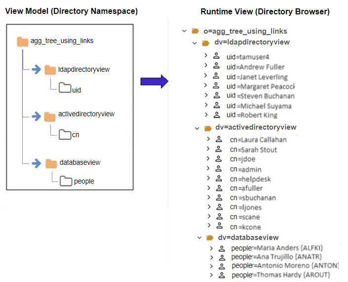

## Overview - Creating Identity Views

There are two main design approaches to creating identity views.
 1. Using an [LDAP proxy approach](ldap-proxy-views.md), where the identity view deployed in RadiantOne represents an exact hierarchy (or specific sub-branch) of an existing LDAP directory data source. With this view design approach you are limited to the exact hierarchical structure of the existing directory store backend. However, you can choose to include or exclude specific branches to limit the data in the identity view.
 2. Using a [model-driven approach](#model-driven-identity-views-introduction), where the identity view deployed in RadiantOne can be designed based on the metadata (schema) extracted from existing identity sources. With this view design approach you have infinite flexibility and can create flat views, or very complex hierarchies based on the objects and attributes from each identity source. Use the model-driven approach to create identity views from LDAP, JDBC-accessible data sources and Custom data sources.

A special type of identity view that leverages the model-driven design approach is generated by the Global Identity Builder tool. This tool can be used to address two commmon identity data challenges:
- No single identity source containing all user accounts. This means integrating with multiple identity sources containing various levels of overlapping user accounts. The Global Identity Builder generates an identity view that provides a unique reference list of user accounts, joining overlapping ones as needed.
- Multiple identity sources containing 100% overlapping user accounts without a single attribute to uniquely identify the overlap. The Global Identity Builder generates an identity view that provides a unique reference list of user accounts, joining overlapping ones based on one or more cascading matching rules. Each pair of identity sources can have their own list of matching rules, allowing identity architects to address a variety of complex data quality challenges (e.g. Sources A, B and C have overlapping identities that can be identified by their Employee Name + Department Name + Last 4 characters of Employee ID, if there is no match found, check Location + Last 4 characters of Employee ID + Login Name).

For more details, see [Global Identity Builder](../global-identity-builder/introduction).

Every Root Naming Context configured in the RadiantOne namespace can be active or inactive.
There is a toggle to indicate whether the naming context is active or not. Toggle it off to deactivate the naming context. Only active naming contexts are accessible in RadiantOne by clients.

## Model-driven Identity Views Introduction
Creating model-driven identity views requires the use of the metadata (schema) extracted from backend sources. The views can be flat or hierarchical and comprised of an aggregation of many existing identity views that have been imported from other environments. This provides greater flexibility for view design than creating simple LDAP proxy views.

In order to create model-driven identity views, the data sources configured in the RadiantOne [Data Catalog](../data-sources/schemas) must have their schemas extracted. The schemas contain the metadata that is used for creating model-driven identity views. Container and content nodes types in identity views are created from objects in the metadata.

When designing your identity views and namespace, you can use different kinds of node types to build your model. 
-	Container
-	Label 
-	Content 
-	Link 

Each of these is described in more details below. 

### Container

A container object is a node that can have descendants. A container can include other containers or content objects.

You can think of a container as a directory similar to a “directory inside a file system”, where a directory can contain other directories or files. However, the comparison should stop there, because a container is an object represented in an identity view. When you create a container, you base it on an object that has been extracted/created from a data source and this information is used to populate the entries at run time. The container automatically inherits the primary key attribute of the underlying objects. You can also expose other attributes that belong to the underlying object into the RadiantOne entries. 

For more information, see: [Working with Container Objects](#working-with-container-objects) 

### Label

A label node is a container object whose default attribute is a text label. The name of the label is defined during the creation and can be updated on the Properties tab. Other attributes can be defined for labels on the Properties tab > Virtual Attributes section.

Use labels when you want to separate different types of information for display. In this respect, a label acts as an ad hoc way to aggregate objects from the same schema or different data source schemas. When combined with links, you can aggregate objects coming from existing identity views as well. 

When a label is used as an intermediate link between two objects, it acts as a “pass-through” for the underlying relationship. The label does not affect the value of the keys that are propagated from the parent to the descendant. The objects are still linked by the same relationships. 

For instance, if you have the following configuration in your view definition, at run time it depicts that Customer X purchased Product Y: 

Now, if the model of the tree were changed and a label were introduced (see the new design below), you still get Product Y below Customer X. The key of Customer X is passed through the label to condition products (to only show products purchased by Customer X). 

When you want to categorize a collection of data from objects or resulting from combined objects (through joins), you can use labels to categorize these sub-levels of information. For each label, you are saying that this sub-level of information will reside under this category.

You can create an unlimited number of labels, depending on how many categories of information you need to define.

For more information, see: [Working with Labels](#working-with-labels) 

### Content

A Content Object is a node that has no descendants. It is a “leaf” or “terminal” node in the view.

A content node represents an object in an identity view.  When you create a content node, you base it on an object that has been extracted/created from a data source and this information is used to populate the entries at run time. The content automatically inherits the primary key attribute of the underlying objects. You can also expose other attributes that belong to the underlying object in the entries. 

For more information, see: [Working with Content Objects](#working-with-content-objects) 

### Links

Links are a special kind of node that allows you to point to a specific sub-tree defined in an existing identity view (.dvx file). Using this mechanism in conjunction with a label (although a label is not necessary) you can aggregate information from different schemas (simple objects or whole sub trees). Links allow you to transparently navigate from schema to schema in an ad hoc way. 

There are two different types of links: Standard and Merge. Each is described in more details below. 

### Standard Links 

A standard link offers a simple way to aggregate existing identity views. Each view file has a top node named with the following syntax: `dv=<file name>`. When aggregating identity views using standard links, the “dv” label level remains and becomes part of the naming in the hierarchy. 

Let’s take a look at an example. Assume there are three data sources: a database, an Active Directory, and an LDAP directory. This is represented in the diagram below.

Assume that each data source has an identity view created for it. This is represented by the three views shown below. 

Finally, standard links are used to aggregate the existing views. This is represented in the virtual view model shown in the screen shot below. The runtime preview shows what the populated view looks like. Notice that the “dv” level comprises the runtime view. 

>[!note]
>This example described linking to existing identity views. If you don't already have existing identity views to aggregate together using links, you can use the Control Panel > Setup > Directory Namespace > Namespace Design to create your identity view using labels, containers and/or content nodes.

### Merge Links

A merge link offers more flexibility than a standard link because the “dv” label level is suppressed (making the tree simpler for browsing). In addition, with merge links, a link parameter can be configured to condition the subtree based on the parent view. This is optional but offers flexibility by allowing you to build a context-driven identity view that navigates across multiple data sources.

A link parameter is based on a unique key of the parent entry. The value of this key must match an attribute in the view to be mounted. Two examples are used to describe the benefits of using a merge link with a parameter. One example is based on the attribute in the parent object being single-valued and the other example is based on a multi-valued attribute.

The following diagram depicts two databases and will be used to describe how to link identity views based on a single-valued attribute. One database maintains project information while the other database stores employee information including department and location. 

 
Let’s assume the desired identity view should represent projects, followed by the department associated with the project, followed by the location of the employee, and finally the employees working on the project. Since the information is maintained in two separate databases, an identity view can be built from each. This is depicted in the diagram below. One view is built for projects while the other is a view of employees based on departments and location.

A merge link (noted with the blue arrow) is used to aggregate the identity views. This is depicted in the diagram below. 

**Merge Links with a Link Parameter**

In the linked view shown above, the sub-branch (view named EmpByDeptView) can be conditioned by setting a linking attribute. In this example, all projects are associated with a department (there is a one-to-one relationship based on the project ID), so the project ID can be established as the linking attribute. By adding a condition to the link based on the project ID attribute, the subtree shown at runtime is dependent upon the project (the parent node). The link parameter syntax is: 
`<childobject.attribute>=@[<parentobject_attribute>:<datatype>]`

An example value is: 
APP.EMP.PROJECTID=(@[projectid:INTEGER])

Without this link condition, all departments would be shown below each project and the hierarchy would not make sense. The difference between using a link parameter and not using one are shown in the following two figures. The first uses a merge link with no parameter. The second one uses a merge link with a parameter to condition the subtree.

 

As the figure above shows, the subtree is not conditioned by the parent object which is why all departments are shown below each project. This does not accurately depict the context needed. The ideal identity view would show each project and then below each project show the department working on that project followed by location and employees accordingly. 

Since the department object has a relationship with projects (the project ID is available in the department entry), the project ID can be used as the link parameter to condition the subtree. This is shown in the figure below. 
 

Based on the examples shown above, a link parameter is required for the identity view to represent the proper context of showing projects per department.

In the previous example, the link condition was based on a single-valued attribute in the parent entry. This is the primary use case for a link parameter. However, if the attribute in the parent entry contains multiple values you can use it to configure the link parameter.

>[!warning] 
>There are limitations when working with link parameters involving multi-valued attributes from parent objects. The link is limited to one multi-valued parent attribute. If there are too many values in the parent node, the query might fail due to the limit on LDAP filter size or SQL statement size.

The example in this section describes using a multi-valued attribute in the parent object to condition the child object(s). The following diagrams depicts two objects. One object contains identity information including a list of entitlements the user has, while the other object contains entitlements information including which application the entitlement is associated with. 

Let’s assume the desired virtual view should represent identities followed by a list of entitlements associated with the identities. Since the information is maintained in two separate objects, an identity view can be built from each. This is depicted in the diagram below. One view is built for identities while the other is a view of entitlements. 

A merge link (noted with the blue arrow) is used to aggregate the identity views. This is depicted in the diagram below. 

In the linked view shown above, the sub-branch (view named EntitlementView) can be conditioned by setting a linking attribute. In this example, all identities are associated with entitlements, so the entitlements attribute in the identity can be established as the linking attribute to the idlink attribute of the entitlement view. By adding a condition to the link based on the entitlements attribute, the subtree shown at runtime is dependent upon the entitlements associated with parent identity. However, since the value of the entitlements attribute in the parent identity is multi-valued, the link condition must be manually altered to include a special syntax. If the link parameter is associated with a child node from an LDAP backend, the syntax to handle a multi-valued parent attribute is: 

<childobject.attribute>~=@[<parentattribute>:<datatype>] 

An example value is:

vdentitlements.idlink~=@[entitlements:VARCHAR(255)] 

If the link parameter is associated with a child node from a database backend, the syntax to handle a multi-valued parent attribute is: 

<childobject.attribute> IN (@[<parentattribute>:<datatype>]) 

An example value is: 

APP.IDENTITY.IDLINK IN (@[entitlements:VARCHAR(255)] 

>[!warning] 
>For child nodes from database backends, make sure in the link parameter value there is a `<space>` between the “IN” and the following open parenthesis. Also, performance can be negatively impacted because the “IN” operator does not benefit from prepared statements.
 
An example depicting the model of the identity view and the runtime view leveraging the link parameter between the two views described in this section is shown below. 

**Merge Links without a Link Parameter**

This section describes a scenario where linking is used to aggregate objects from different schemas where a link parameter is not needed. In this example, three data sources are used. One data source is an LDAP directory storing partner information. One data source is Active Directory storing employee information. The third data source is a database storing customer information. Each data source is depicted below with objects representing their schemas. 

In this example, the desired identity view is one that aggregates people (employees, partners and customers) into one complete list to be used for authentication. 

Assume three identity views (one from each source) already exist and have been imported from another environment. This is depicted in the figure below. 

Finally, merge links are used to aggregate the existing identity views into one common view. The identity view consists of employees from Active Directory, partners from an LDAP directory, and customers from a database. Both the model and the runtime view are depicted below.

This example described how merge links can be used to aggregate a list of people from three different data sources. Since there is no overlap of users in this scenario, using merge links is a simple way to create a union of all user accounts across three different data sources. Since the subtrees linked do not need to be conditioned by a parent attribute, a link parameter was not required to achieve the desired result. 

>[!note] 
>The intermediate view names (EmployeeView, PartnerView and CustomerView respectively) are suppressed in the final runtime view because merge links were used.

Configuration steps for using links can be found in the [Working with Links](#working-with-links) section.

## Creating a Root Naming Context to Manage Unmounted Identity Views 

The latest version of the Control Panel does not have the Context Builder tool. Therefore, only identity views that have been mounted somewhere below a root naming context are editable. Any identity views imported from other versions/environments of RadiantOne that were not mounted cannot be edited until they are mounted. 
Create a new Root Naming Context from Control Panel > Manage > Directory Namespace > Namespace Design and then mount a label below the naming context for each identity view you want to mount. 

Once all labels are created, use the “MOUNT BACKEND” button at each label level and choose the Virtual Tree type, selecting the identity view (.dvx file) to mount: one identity view per label. 

This will allow you to edit the identity view configuration using the PROPERTIES, ADVANCED SETTINGS and OBJECT BUILDER tabs. 

## The View Design Process

Model-driven identity views are created in Control Panel > Setup > Directory Namespace > Namespace Design. The schemas that were extracted in the Control Panel > Setup > Data Catalog > Data Sources are used as the basis for creating model-driven identity views using labels, container and content nodes.

### Creating Root Naming Contexts

Identity view creation starts with defining a root naming context.

To create a root naming context.

1. Navigate to Control Panel > Setup > Directory Namespace > Namespace Design.
2. Click: 
3. Select or enter the RDN name (e.g. o, ou, cn) and enter the value. This is the name that applications use to query data from the identity view that is mounted here.
4. Click **CONFIRM**.
5. Use the **+NEW LEVEL** menu to add labels, containes, contents, or links.

### Working with Labels

You can create labels below an existing label or container. Labels are used as a way to categorize the identity view. Unlike containers and contents, labels are not populated from objects in an underlying source. Therefore, you can add any attributes you want to labels.

To create a label:

1.	Navigate to Control Panel > Setup > Directory Namespace > Namespace Design and select the node in the tree where you want to create a label below.
2.	Use the **+NEW LEVEL** menu and choose *Label*.
3.	Select or enter the RDN name (e.g. o, ou, cn) and enter the value for the label name. 
4. 	Click **CONFIRM**.

To modify a label:

1.	On the Properties tab, you can change RDN name and value in the *LABEL NAME* setting.
	

    >[!note] 
    >DO NOT name a label with “dv”. The dv syntax is reserved for RadiantOne and labels should not contain it.
 
1. To modify the object class associated with the label node, click the drop-down list next to the Object Class setting and choose the object class. You can manually enter an object class name instead of selecting one from the list.
1. To add more object classes to associate with the label node, click + next to the Object Class setting. Another drop-down list appears to allow you to select an object class or manually enter a new object class value.
1. On the Properties tab > Virtual Attributes section, you can manage the attributes of the label. All attributes defined here are returned when a client requests label entries in the identity view.
1. Expand the Virtual Attributes section and click **+NEW ATTRIBUTE**.
1. Select or enter an attribute name and click **+NEW VALUE**.
1. Enter a value for the attribute and click .
1. Click **CONFIRM**.

To delete a label:

1.	On the Properties tab, click .
2.	Click **DELETE** to confirm.

### Working with Content Objects 

Use a Content object when you want to create flat views that do not contain sub-branches. When you create a content node, you base it on an object that has been extracted/created from a data source and this information is used to populate the entries at run time.

To create content objects:

1.	Navigate to Control Panel > Setup > Directory Namespace > Namespace Design and select the node in the tree where you want to create a content below. This node type must be a Label or Container, or you can mount a content level directly at a Root Naming Context. 

1.	Use the **+NEW LEVEL** menu and select content.
1.	Select the data source from the drop-down list. If you don't have a data source defined, use the [Data Catalog](../data-sources/data-sources) to define it.
1.	Select the schema associated with the data source that contains the object to be used to define the content node. If you don't have a schema yet, click the *Extract Schema* link to define one. For assistance see: [Schemas](../data-sources/schemas)
	  

1.	Click **NEXT**. 

1.	Select the object from the schema that contains the information you want the content node to be populated with. If the schema is associated with a JDBC-accessible source and the object has a relationship to the parent container node in the identity view where you mounting this content, toggle the *Related Objects Only* option on to narrow the scope of objects to only those that have a relationships with the parent container node.
	

 1. (Optional) if the schema is associated with a JDBC-accessible source and the object name (or attributes in the object) used mixed case (e.g. EmpLoyees), check the option to *Quote Table Names* and/or *Quote Column Names* to ensure the generated SQL query is compatible with the database vendor.
  

1. Click **SELECT**.

This places the new Content object under the selected Label or Container object, or Root Naming Context in the view definition. Use the PROPERTIES, ADVANCED SETTINGS, SPECIAL ATTRIBUTES and OBJECT BUILDER tabs to customize the node. For details see: [Managing Nodes in Model-driven Identity Views](#managing-nodes-in-model-driven-identity-views)

### Working with Container Objects 

Use a Container object when you want to create hierarchical identity views containing many sub-levels. 

To create container objects:

1.	Navigate to Control Panel > Setup > Directory Namespace > Namespace Design and select the node in the tree where you want to create a container below. This node type must be a Label or Container, or you can mount a container level directly at a Root Naming Context. 

1.	Use the **+NEW LEVEL** menu and select container.
1.	Select the data source from the drop-down list. If you don't have a data source defined, use the [Data Catalog](../data-sources/data-sources) to define it.
1.	Select the schema associated with the data source that contains the object to be used to define the container node. If you don't have a schema yet, click the *Extract Schema* link to define one. For assistance see: [Schemas](../data-sources/schemas)
	  

1.	Click **NEXT**. 

1.	Select the object from the schema that contains the information you want the container node to be populated with. If the schema is associated with a JDBC-accessible source and the object has a relationship to the parent container node in the identity view where you mounting this content, toggle the *Related Objects Only* option on to narrow the scope of objects to only those that have a relationships with the parent container node.
	

 1. (Optional) if the schema is associated with a JDBC-accessible source and the object name (or attributes in the object) used mixed case (e.g. EmpLoyees), check the option to *Quote Table Names* and/or *Quote Column Names* to ensure the generated SQL query is compatible with the database vendor.
  

1. Click **SELECT**.

This places the new Container object under the selected Label or Container object, or Root Naming Context in the view definition. Use the PROPERTIES, ADVANCED SETTINGS, SPECIAL ATTRIBUTES and OBJECT BUILDER tabs to customize the node. For details see: [Managing Nodes in Model-driven Identity Views](#managing-nodes-in-model-driven-identity-views)

### Working with Links 

Use links when you want to build your identity view with existing identity views. The link is a way to aggregate different views into a common hierarchy/view.

Labels can be used as a way to organize the tree before you configure a link (although adding labels is optional). If you like the idea of having a label to separate the two views, you can enter a Label and then have a link below it. In the example below, the label Category=Orders has been created as a way to organize the “jump” to the order view. 

To create a link: 

1.	Have the existing identity view imported/accessible.
2.	Navigate to Control Panel > Setup > Directory Namespace > Namespace Design and select the node in the tree where you want to mount the link at. This node type must be a Label, Container or you can mount an existing identity view directly at a Root Naming Context. 

3.	Use the **+NEW LEVEL** menu and select link. If you want to mount the existing identity view directly at the Root Naming Context, use the **MOUNT BACKEND** > Virtual Tree option.

4.	Choose either **Standard Link** or **Merged Link**. 

5.	Select the identity view to link to and click **CREATE**.

6.	If you have created a Merged Link, a link parameter can be set. See the section below for steps on creating a link parameter. 

To create a link parameter: 

A link parameter can be used to condition the subtree based on the primary key of the parent node. 

1.	Select the merged link node in the view definition and choose the Properties tab. 

1.	Click **EDIT** next to the Link Parameters. 

1.	Navigate to the first node in the linked virtual view and select the attribute that matches the primary key of the parent node.  If the link is based on a multi-valued attribute in the parent node, manually edit the link condition and update it based on the following guidance: If the link parameter is associated with a child node from an LDAP backend, the syntax to handle a multi-valued parent attribute is: <childobject.attribute>~=@[<parentattribute>:<datatype>] An example value is: vdentitlements.idlink~=@[entitlements:VARCHAR(255)]  If the link parameter is associated with a child node from a database backend, the syntax to handle a multi-valued parent attribute is: <childobject.attribute> IN (@[<parentattribute>:<datatype>]) An example value is: APP.IDENTITY.IDLINK IN (@[entitlements:VARCHAR(255)]
	>[!warning] For child nodes from database backends, make sure in the link parameter value there is a `<space>` between the “IN” and the following open parenthesis. Also, performance can be negatively impacted because the “IN” operator does not benefit from prepared statements.

1.	Click **SAVE**. 

At runtime, RadiantOne evaluates the link and builds the appropriate subtree conditioned based on the link parameter. 

## Managing Nodes in Model-driven Identity Views

Nodes in model-driven identity views are comprised of labels, containers, contents and/or links.  Nodes can be managed from the the Control Panel > Setup > Directory Namespace > Namespace Design. Select the node in the tree and use the Properties, Advanced Settings, Special Attributes, and Object Builder tabs on the right.

### Properties tab

As you select a node in the view definition, the Properties tab is activated. This tab includes parameters needed to customize the node in the identity view. 

For container or content node types, you can declare the RDN, view the primary key attribute, view the schema, view the node type and delete the node. Each of these is described below.

**Declare the RDN**

The RDN Name and Value can be defined in the *RDN* property. The RDN name defaults to the name of the object and can be updated on the Properties tab. 

To edit which attributes comprise the RDN value:

1. Click the 
1. Select all attributes that should comprise the RDN and click **NEXT**.
 

    >[!warning] 
    >The column(s) that you select as the RDN attribute value should not allow NULL values.
   
1. Arrange the order of the attributes in which they should appear in the value by clicking  and dragging the attribute up/down and click **SAVE**.

**View the Primary Key Attribute**

The *PRIMARY KEY* property indicates the primary key/unique attribute associated with the object used to define the node. This value is determined by the schema that was extracted from the backend data source.

**View the Schema**

The *SCHEMA* Property indicates what schema file the object is created from. The name of the schema file is a hyperlink that when clicked, takes the user to the schema definition in the Control Panel > Setup > Data Catalog > Data Sources.

**View the Node Type**

The *TYPE* displayed is a read-only value that indicates the node type: Content, Container, Label

**Delete Nodes**

To delete nodes:

1.	On the Properties tab for the selected node to be deleted, click: 
2.	Click **DELETE** to confirm.

### Advanced Settings
As you select a node in the view definition, the Advanced tab is activated. This tab includes parameters needed to customize the node in the identity view.

For container or content node types, you can configure interception scripts, enable optimizations and define other settings. Each of these is described below.

**Interception Scripts**

Interception scripts allow for overriding default behavior of the RadiantOne service and can be invoked for pre-operations (prior to the RadiantOne service querying the backend identity sources, or post-operations (prior to the RadiantOne service returning results to clients).

To invoke an interception script for pre-operations, use the: On Bind, On Modify, On Compare, On Search, On Add, On Delete, or On Special Operations options.
To invoke an interception script for post-operations, use the: Search Result Entry Processing option.

After enabling the desired options, customize the interception script logic, rebuild the intercept jar file and restart the RadiantOne service.

For complete details, see: [Interception Scripts](view-interception.md)

**Optimizations**

The following options can be enabled from the ADVANCED SETTINGS tab > Optimizations section for model-driven identity views from database backends. 
- Request Attributes Only When Necessary
- Process joins and computed attributes only when necessary

The following options can be enabled from the ADVANCED SETTINGS tab > Optimizations section for model-driven identity views from LDAP backends. 
- Process join and computed attributes only when necessary
- Max Requested Attributes

For details on these options and other ways to optimize the identity view, see: [Tuning](../../tuning/optimize-views)

**Other Settings for Database Backends**

The following options can be managed from the ADVANCED SETTINGS tab > Other Settings section for model-driven identity views from database backends. 

*Distinct*

If you need to ensure you get unique records from the database table (to avoid duplicate rows in the result set), toggle the Distinct option on. This modifies the query request RadiantOne issues to the backend database to prevent duplicate rows from being returned.

*Case Sensitivity for search*

There are three options available for handling case sensitive databases. These options are related to how RadiantOne generates the query to send to the database. The options are As Is, Ignore Case and Translate Values to Uppercase. Each is described in details below.

- As Is: If your database is not case sensitive, then you should choose the As Is option. With this option, RadiantOne forwards the search filter to the backend in the exact case it was received in the request from the client. This is the default option.

If your database is case sensitive and you choose this option, the case received in the filter from the client search request must match the case used in the database or else the entry is not found.

For example, if a database attribute named FIRSTNAME had a value of Nancy, and RadiantOne received a search request with a filter of (firstname=nancy), the entry is not returned. The client must use a filter of (firstname=Nancy) for the entry to be properly returned from the database.

- Ignore Case: If your database is case sensitive and you are not sure how the values are stored (mixed case, all upper, all lower…etc.), then you should choose the Ignore Case option. With this option, RadiantOne generates the SQL query so that both the filter that was received in the client request and the values from the backend are converted into uppercase before the search filter can be validated. For example, if a client sent a request with a filter of (firstname=Nancy), RadiantOne would generate the following where clause based on the filter received in the client request.

WHERE (UPPER(APP.EMPLOYEES.FIRSTNAME)=UPPER('Nancy'))

The case used in the filter from the client is irrelevant and everything is converted into uppercase.

This option offers the least performance, so it should only be used when absolutely required. If the database is case sensitive and the values are stored in uppercase, you should use the Translate Values to Uppercase option (see #3 below) as it is more efficient.

- Translate Values to Uppercase: If your database is case sensitive and you know the values are stored in uppercase, you should choose the Translate Values to Uppercase option. With this option, RadiantOne translates the search filter value into uppercase before sending it to the backend database. This option is more efficient than the Ignore Case option mentioned above.

*SQL Filter*

If you want to condition the identity view of your database to only return a set of entries that match a certain criterion, you can enter a SQL Filter. An example of a filter would be ENAME=’s%’, which would only return entries that have an ENAME value that starts with “s” (the % is a wild card character).

>[!note] - You must enter a valid SQL filter and use the actual database attribute names (as opposed to using any virtual names you have configured through > mapping). The SQL syntax you use in your filter must be compatible with the database brand/version you are accessing on the backend.

To enter a SQL filter: **STEPS TO BE UPDATED**

1. Click  next to SQL Filter.
2. From the drop-down list, select the source attribute you want to filter on.
3. Choose an operator (e.g. equals, begins with, ends with…etc.) from the drop-down list in the middle property.
4. In the last property, enter the value that defines the condition.
5. (Optional) To add more conditions to the filter, click Add Rule.
6. (Optional) To remove conditions from the filter, click Delete next to the condition.
7. Click OK.
8. Click Save.

An example filter is shown below where only entries that have CITY = Seattle and a TITLE that contains “Sales” are returned in the virtual view.

*Object Class Mapping*

For database backend objects, RadiantOne provides a default LDAP object class name (based on the name of the database object). This is the object class that clients can base their query filter on to request data from a particular database object.

If you want to map the database objects to a new/different object class:

1. In the Other Settings section on the Advanced Settings tab, click the  next to Object Class Mapping.
2. Select the LDAP schema that contains the object class you want to map to. This selection populates the Mapped Object Class List.
3. Select the object class from the Mapped Object Class List, or manually enter the object class you to want to map to. If the object class inherits from multiple classes, the classes are displayed with a # as the separator.
4. Click **SELECT**.
5. Click **SAVE**.

*Configuration Parameters*

To configure Link Parameters, Base Parameters and configure calls for Stored Procedures, click **EDIT** in the Configuration Parameters section.

- Link Parameters: are only relevant when the view definition has more than one level because this is the parameter that is used to link the entry to the parent. If there is only one level in the tree, this parameter is irrelevant. If RadiantOne has generated UPPER, you can remove it from here if needed. The UPPER is generated here for case sensitive databases. If your database is not case sensitive, then the UPPER can be removed (along with the corresponding set of parentheses). If your database is case sensitive, then you must make sure that the attribute that is indexed (and is used in the link parameter) uses UPPER case. Otherwise, performance of the virtual view is unpredictable.
- Base Parameters: This parameter allows you to remove UPPER (that is generated by default) for base searches and updates. The UPPER is generated here for case sensitive databases. If your database is not case sensitive, then the UPPER can be removed. If your database is case sensitive, then you must make sure that the attribute that is indexed (and is used in the base parameter) uses the UPPER case. Otherwise, performance of the virtual view (during a base search) is unpredictable. Since some databases are case sensitive, RadiantOne transforms primary key attribute values to upper case before comparing. This is only applicable when the database key is a character data type. “UPPER” is generated automatically for the following databases: Oracle, SQL MX, MS SQL Server, Sybase, Interbase, and DB2. If you do not want UPPER to be used for searches and updates (because your database is not case sensitive), you can use the Base parameters to remove it. Below is an example of the parameter that is generated for a database (for the search). If the database is case sensitive and the CN attribute is indexed (and the index stores the value in upper case), then the UPPER generated on the left side of the “=” can be removed and performance is improved (also remove the leading and ending parentheses). 
(UPPER(SCOTT.PEOPLE.CN)=UPPER(@@[cn : VARCHAR2(60)]))

If you are not able to remove the UPPER then you should consider using cache at the level of RadiantOne to improve performance. RadiantOne queries the database the first time (the UPPER is used), the result is cached and future queries receive the information from cache.
- Stored Procedures: Identity views created from database backends can call stored procedures instead of using the default functionality for handling inserts, updates, and deletes.  

To configure calling a stored procedure:
1. From the Stored Procedure tab, select Insert, Update, or Delete from the drop-down menu.
2. Click **+STORED PROCEDURE**.
3. (Optional) In the *Advanced Filters* section, specify a catalog and/or schema name and click **APPLY FILTERS**.
4. Select a stored procedure and click **NEXT**.
5. Select parameters from the drop-down menu and click **SAVE**.

![note] - Once you have declared stored procedures for a database, the standard functionality for inserts, updates, and deletes is no longer used; only the stored procedures are called.

**Other Settings for LDAP Backends**

The following options can be managed from the ADVANCED SETTINGS tab > Other Settings section for model-driven identity views from LDAP backends. 

*LDAP Filter* 

If you want to condition the identity view of your LDAP directory to only return a set of entries that match a certain criterion, you can enter an LDAP Filter.

1. Click the  next to LDAP Filter.
2. Enter a valid LDAP filter in the box provided and click **CONFIRM**.
3. To get assistance with generating the LDAP filter, toggle the **ENABLE ASSIST MODE** on. Use the **+NEW CONDITION** and/or **+NEW GROUP** to add criteria to the filter. The LDAP filter generated from the conditions and groups is shown at the top. Click **CONFIRM** to apply the filter.
4. Click **SAVE**.

*Object Class Mapping*

For LDAP objects, RadiantOne leverages the LDAP object class associated with the backend by default. This is the object class that clients can base their query filter on to request data from the identity view.

If you want to map the LDAP objects to a new/different object class:

1. In the Other Settings section on the Advanced Settings tab, click the  next to Object Class Mapping.
2. Select the LDAP schema that contains the object class you want to map to. This selection populates the Mapped Object Class List.
3. Select the object class from the Mapped Object Class List, or manually enter the object class you to want to map to. If the object class inherits from multiple classes, the classes are displayed with a # as the separator.
4. Click **SELECT**.
5. Click **SAVE**.

*Configuration Parameters*

The Link Parameters and Base Parameters are irrelevant for container/content nodes created from LDAP backends.
The Parent DN Settings tab allows you to customize the base DN from where to start searching from. This can be used in cases where each node in the identity view should populate from entries located in different containers in the backend LDAP directory data source, instead of conditioning all nodes by the base DN configured in the LDAP data source.

### Special Attributes

Certain attributes and entries require special handling due to how they must be computed and/or how they link related entries. This includes handling dynamic and/or nested groups, and relating entries based on backlink/forward link attributes. 

The table below outlines the supported special attributes.

Special Attribute	| Uncached Model-driven Identity Views from LDAP Backends | Uncached Model-driven Identity Views from non-LDAP Backends  | Persistent Cached Model-driven Identity Views
-|-|-|-
Linked Attributes	| X | - | X
Referential Integrity	| - | - | X
Dynamic Groups	| X | - | X
Attribute Uniqueness	| - | - | X
Unnest Groups	| - | - | X

For details see: [Special Attributes](special-attributes.md)

### Object Builder

For Content and Container nodes, the Object Builder tab allows you to select and modify (remap) the attributes from the primary source that you want the final entries to be comprised of.

The Object Builder is used to customize how entries associated with specific objects are joined, how attributes are remapped, defining attributes properties (e.g. updateable, searchable, hidden), and managing computed attributes.  See [Object Builder](directory-namespace-overview#introduction-to-the-object-buider) for an introduction.

**Defining Attributes to Comprise the Final Object**

To define and/or remap source attributes:

1. From Control Panel > Setup > Directory Namespace > Namespace Design, select the content or container node below Root Naming Contexts and choose the Object Builder tab. The object that the nodes is created from automatically appears on the canvas as a source. The default final output object is also shown on the canvas.
1. To publish source attributes in the final output object, click: 
1. In the *Map and Filter Attributes* window, select the attributes that should comprise the final output object. By default, the source attribute names are used in the final output object.
1. To remap the source attribute name, click the inline  icon. Edit the *Virtual Name* value and click the inline  to confirm. In the example shown below, the source attribute named FIRSTNAME is returned as givenName in the final output object.
 
1. Click **DONE**.
1. Click **SAVE**. 

**Managing Attributes of The Final Object**

To define attributes of the final object:

1. From Control Panel > Setup > Directory Namespace > Namespace Design, select the content or container node below Root Naming Contexts and choose the Object Builder tab. The object that the nodes is created from automatically appears on the canvas as a source. The default final output object is also shown on the canvas.
2. Click the  icon on the Final Object Output.
3. (Optional) Use the *Hidden* toggle to mark an attribute as one that should not be in the final entry.
4. (Optional) Expand an attribute to see its origins and for each origin, indicate if the attribute should be searchable and/or updateable. If an attribute has multiple origins, you can indicate an attribute priority level.
5. Click **DONE**.
6. Click **SAVE**.

**Defining Computed Attributes**

To define computed attributes:

1. From Control Panel > Setup > Directory Namespace > Namespace Design, select the content or container node below Root Naming Contexts and choose the Object Builder tab. The object that the nodes is created from automatically appears on the canvas as a source. The default final output object is also shown on the canvas.
2. To define computed attributes, click: 
3. Click **+ADD**.
4. Enter the Computed Attribute name in the Name parameter.
5. Configure the needed expression to comprise the computed attribute. This is based on Java and if you are already familiar with the syntax, you can enter it directly for the value. 

If you would like to build the attribute based on a constant and need assistance, click on the **+CONSTANT** button and enter the value. Click **DONE**.

If you would like the computed attribute to be based on an existing attribute, click on the **+ATTRIBUTE** button for assistance (a list of all attributes available for the object will display). Select the attribute(s) and click **DONE**.

If you would like to use a function to build your computed attribute, click on the **+FUNCTION** button which displays a list of available functions. Depending on the function selected, you may be prompted to provide additional information.

6.	Click the **VALIDATE** button to check the syntax of your expression. 

7.	Once your expression compiles properly (no errors in the Compilation Results window), click **DONE**. 

8.	Click **SAVE**.

**Deactivate Computed Attributes**

If you have defined multiple computed attributes, it can be helpful to deactivate some for testing or if you (temporarily) don’t need them anymore. 

To deactivate a computed attribute:

1. Navigate to Control Panel > Directory Namespace > Namespace Design.
1. Select the node below Root Naming Contexts and go to the OBJECT BUILDER tab. 
1. Click  on the canvas to open the Computed Attributes configuration panel.
1.	Uncheck the "Active" checkbox next to the computed attributes that you want to deactivate.
   
 
1.	Click **SAVE**.

**Using User-defined Classes**
To use external libraries in computed attributes:

1. Navigate to Control Panel > Directory Namespace > Namespace Design.
1. Select the node below Root Naming Contexts and go to the OBJECT BUILDER tab. 
1. Click  on the canvas to open the Computed Attributes configuration panel.
1. Click **MANAGE** to add or remove libraries. Click "choose a file" to upload new libraries. Click the trashcan icon next to an existing library to remove it.
1. After the library file has been uploaded, click **ADD** and enter the package/class name you want to be available to use for computed attributes.

**Configuring Joins**

Objects from any sources in the RadiantOne namespace can be joined. With joins, you can extend the primary entries with attributes coming from another data source, or new application-specific attributes (required by applications, but don’t exist yet). Joins are configured from the Control Panel > Directory Namespace > Namespace Design. Select the node below Root Naming Contexts and go to the OBJECT BUILDER tab. Use **ADD COMPONENT** menu to define joins. 

To join with an object containing the attributes needed to extend the primary object with, choose the Add Component > Object on the canvas. Then use the Add Component > Join option to define the join condition. 

To extend the primary object with new attributes that don't exist, choose the Add Component > Object Extension option to manually define the attribute names.

When you configure joins across multiple objects, you should also consider configuring Bind Order and Attribute Priority for overlapping attributes.

For complete details on configuring joins, bind order and attribute priority, please see: [Joins](joins.md) 
