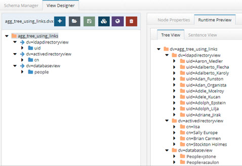
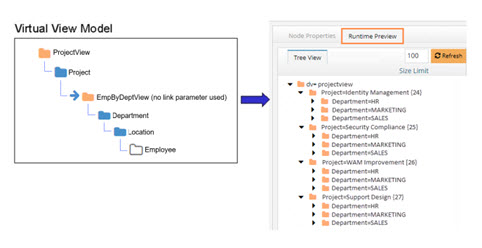
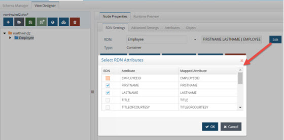
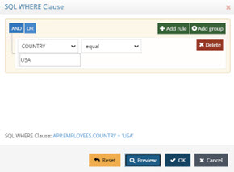
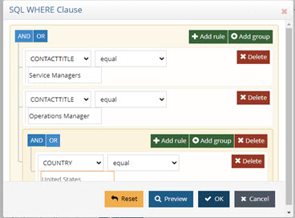
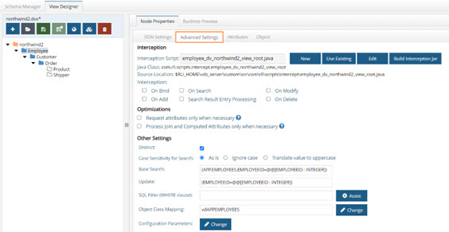

## Overview - Creating Identity Views

There are two main design approaches to creating identity views.
 1. Using an [LDAP proxy approach](ldap-proxy-views.md), where the identity view deployed in RadiantOne represents an exact hierarchy (or specific sub-branch) of an existing LDAP directory data source. With this view design approach you are limited to the exact hierarchical structure of the existing directory store backend. However, you can choose to include or exclude specific branches to limit the data in the identity view.
 2. Using a [model-driven approach](#model-driven-identity-views-introduction) Introduction, where the identity view deployed in RadiantOne can be designed based on the metadata (schema) extracted from existing identity sources. With this view design approach you have infinite flexibility and can create flat views, or very complex hierarchies based on the objects and attributes from each identity source. Use the model-driven approach to create identity views from LDAP, JDBC-accessible data sources and Custom data sources.

A special type of identity view that leverages the model-driven design approach is generated by the Global Identity Builder tool. This tool can be used to address two commmon identity data challenges:
- No single identity source containing all user accounts. This means integrating with multiple identity sources containing various levels of overlapping user accounts. The Global Identity Builder generates an identity view that provides a unique reference list of user accounts, joining overlapping ones as needed.
- Multiple identity sources containing 100% overlapping user accounts without a single attribute to uniquely identify the overlap. The Global Identity Builder generates an identity view that provides a unique reference list of user accounts, joining overlapping ones based on one or more cascading matching rules. Each pair of identity sources can have their own list of matching rules, allowing identity architects to address a variety of complex data quality challenges (e.g. Sources A, B and C have overlapping identities that can be identified by their Employee Name + Department Name + Last 4 characters of Employee ID, if there is no match found, check Location + Last 4 characters of Employee ID + Login Name).

For more details, see [Global Identity Builder](../global-identity-builder/introduction).

Every Root Naming Context configured in the RadiantOne namespace can be active or inactive.
There is a toggle to indicate whether the naming context is active or not. Toggle it off to deactivate the naming context. Only active naming contexts are accessible in RadiantOne by clients.

## Model-driven Identity Views Introduction
Creating model-driven identity views requires the use of the metadata (schema) extracted from backend sources. The views can be flat or hierarchical and comprised of an aggregation of many existing identity views that have been imported from other environments. This provides greater flexibility for view design than creating simple LDAP proxy views.

In order to create model-driven identity views, the data sources configured in the RadiantOne [Data Catalog](../data-sources/schemas) must have their schemas extracted. The schemas contain the metadata that is used for creating model-driven identity views. Container and content nodes types in identity views are created from objects in the metadata.

When designing your identity views and namespace, you can use different kinds of node types to build your model. 
-	Container
-	Label 
-	Content 
-	Link 

Each of these is described in more details below. 

### Container

A container object is a node that can have descendants. A container can include other containers or content objects.

You can think of a container as a directory similar to a “directory inside a file system”, where a directory can contain other directories or files. However, the comparison should stop there, because a container is an object represented in an identity view. When you create a container, you base it on an object that has been extracted/created from a data source and this information is used to populate the entries at run time. The container automatically inherits the primary key attribute of the underlying objects. You can also expose other attributes that belong to the underlying object into the RadiantOne entries. 

For more information, see: [Working with Container Objects](#working-with-container-objects) 

### Label

A label node is a container object whose default attribute is a text label. The name of the label is defined during the creation and can be updated on the Properties tab. Other attributes can be defined for labels on the Properties tab > Virtual Attributes section.

Use labels when you want to separate different types of information for display. In this respect, a label acts as an ad hoc way to aggregate objects from the same schema or different data source schemas. When combined with links, you can aggregate objects coming from existing identity views as well. 

When a label is used as an intermediate link between two objects, it acts as a “pass-through” for the underlying relationship. The label does not affect the value of the keys that are propagated from the parent to the descendant. The objects are still linked by the same relationships. 

For instance, if you have the following configuration in your view definition, at run time it depicts that Customer X purchased Product Y: 

Now, if the model of the tree were changed and a label were introduced (see the new design below), you still get Product Y below Customer X. The key of Customer X is passed through the label to condition products (to only show products purchased by Customer X). 

When you want to categorize a collection of data from objects or resulting from combined objects (through joins), you can use labels to categorize these sub-levels of information. For each label, you are saying that this sub-level of information will reside under this category.

You can create an unlimited number of labels, depending on how many categories of information you need to define.

For more information, see: [Working with Labels](#working-with-labels) 

### Content

A Content Object is a node that has no descendants. It is a “leaf” or “terminal” node in the view.

A content node represents an object in an identity view.  When you create a content node, you base it on an object that has been extracted/created from a data source and this information is used to populate the entries at run time. The content automatically inherits the primary key attribute of the underlying objects. You can also expose other attributes that belong to the underlying object in the entries. 

For more information, see: [Working with Content Objects](#working-with-content-objects) 

### Link

Links are a special kind of node that allows you to point to a specific sub-tree defined in an existing identity view (.dvx file). Using this mechanism in conjunction with a label (although a label is not necessary) you can aggregate information from different schemas (simple objects or whole sub trees). Links allow you to transparently navigate from schema to schema in an ad hoc way. 

There are two different types of links: Standard and Merge. Each is described in more details below. 

*Standard Link* 

A standard link offers a simple way to aggregate existing identity views. Each view file has a top node named with the following syntax: `dv=<file name>`. When aggregating identity views using standard links, the “dv” label level remains and becomes part of the naming in the hierarchy. 

Let’s take a look at an example. Assume there are three data sources: a database, an Active Directory, and an LDAP directory. This is represented in the diagram below.

Assume that each data source has an identity view created for it. This is represented by the three views shown below. 

Finally, standard links are used to aggregate the existing views. This is represented in the virtual view model shown in the screen shot below. The runtime preview shows what the populated view looks like. Notice that the “dv” level comprises the runtime view. 

>[!note]
>This example described linking to existing identity views. If you don't already have existing identity views to aggregate together using links, you can use the Control Panel > Setup > Directory Namespace > Namespace Design to create your identity view using labels, containers and/or content nodes.

*Merge Link* 

A merge link offers more flexibility than a standard link because the “dv” label level is suppressed (making the tree simpler for browsing). In addition, with merge links, a link parameter can be configured to condition the subtree based on the parent view. This is optional but offers flexibility by allowing you to build a context-driven identity view that navigates across multiple data sources.

A link parameter is based on a unique key of the parent entry. The value of this key must match an attribute in the view to be mounted. Two examples are used to describe the benefits of using a merge link with a parameter. One example is based on the attribute in the parent object being single-valued and the other example is based on a multi-valued attribute.

The following diagram depicts two databases and will be used to describe how to link identity views based on a single-valued attribute. One database maintains project information while the other database stores employee information including department and location. 

 
Let’s assume the desired identity view should represent projects, followed by the department associated with the project, followed by the location of the employee, and finally the employees working on the project. Since the information is maintained in two separate databases, an identity view can be built from each. This is depicted in the diagram below. One view is built for projects while the other is a view of employees based on departments and location.

A merge link (noted with the blue arrow) is used to aggregate the identity views. This is depicted in the diagram below. 

In the linked view shown above, the sub-branch (view named EmpByDeptView) can be conditioned by setting a linking attribute. In this example, all projects are associated with a department (there is a one-to-one relationship based on the project ID), so the project ID can be established as the linking attribute. By adding a condition to the link based on the project ID attribute, the subtree shown at runtime is dependent upon the project (the parent node). The link parameter syntax is: 
`<childobject.attribute>=@[<parentobject_attribute>:<datatype>]`

An example value is: 
APP.EMP.PROJECTID=(@[projectid:INTEGER])

Without this link condition, all departments would be shown below each project and the hierarchy would not make sense. The difference between using a link parameter and not using one are shown in the following two figures. The first uses a merge link with no parameter. The second one uses a merge link with a parameter to condition the subtree.

 

As the figure above shows, the subtree is not conditioned by the parent object which is why all departments are shown below each project. This does not accurately depict the context needed. The ideal identity view would show each project and then below each project show the department working on that project followed by location and employees accordingly. 

Since the department object has a relationship with projects (the project ID is available in the department entry), the project ID can be used as the link parameter to condition the subtree. This is shown in the figure below. 
 

Based on the examples shown above, a link parameter is required for the identity view to represent the proper context of showing projects per department.

In the previous example, the link condition was based on a single-valued attribute in the parent entry. This is the primary use case for a link parameter. However, if the attribute in the parent entry contains multiple values you can use it to configure the link parameter.

>[!warning] 
>There are limitations when working with link parameters involving multi-valued attributes from parent objects. The link is limited to one multi-valued parent attribute. If there are too many values in the parent node, the query might fail due to the limit on LDAP filter size or SQL statement size.

The example in this section describes using a multi-valued attribute in the parent object to condition the child object(s). The following diagrams depicts two objects. One object contains identity information including a list of entitlements the user has, while the other object contains entitlements information including which application the entitlement is associated with. 

Let’s assume the desired virtual view should represent identities followed by a list of entitlements associated with the identities. Since the information is maintained in two separate objects, an identity view can be built from each. This is depicted in the diagram below. One view is built for identities while the other is a view of entitlements. 

A merge link (noted with the blue arrow) is used to aggregate the identity views. This is depicted in the diagram below. 

In the linked view shown above, the sub-branch (view named EntitlementView) can be conditioned by setting a linking attribute. In this example, all identities are associated with entitlements, so the entitlements attribute in the identity can be established as the linking attribute to the idlink attribute of the entitlement view. By adding a condition to the link based on the entitlements attribute, the subtree shown at runtime is dependent upon the entitlements associated with parent identity. However, since the value of the entitlements attribute in the parent identity is multi-valued, the link condition must be manually altered to include a special syntax. If the link parameter is associated with a child node from an LDAP backend, the syntax to handle a multi-valued parent attribute is: 

<childobject.attribute>~=@[<parentattribute>:<datatype>] 

An example value is:

vdentitlements.idlink~=@[entitlements:VARCHAR(255)] 

If the link parameter is associated with a child node from a database backend, the syntax to handle a multi-valued parent attribute is: 

<childobject.attribute> IN (@[<parentattribute>:<datatype>]) 

An example value is: 

APP.IDENTITY.IDLINK IN (@[entitlements:VARCHAR(255)] 

>[!warning] 
>For child nodes from database backends, make sure in the link parameter value there is a `<space>` between the “IN” and the following open parenthesis. Also, performance can be negatively impacted because the “IN” operator does not benefit from prepared statements.
 
An example depicting the model of the identity view and the runtime view leveraging the link parameter between the two virtual views described in this section is shown below. 

### Merge Links without a Link Parameter

This section describes a scenario where linking is used to aggregate objects from different schemas where a link parameter is not needed. In this example, three data sources are used. One data source is an LDAP directory storing partner information. One data source is Active Directory storing employee information. The third data source is a database storing customer information. Each data source is depicted below with objects representing their schemas. 

In this example, the desired identity view is one that aggregates people (employees, partners and customers) into one complete list to be used for authentication. 

First, three identity views (one from each source) are created. This is depicted in the figure below. 

Finally, links are used to aggregate the virtual views into one common hierarchy. The virtual view will consist of employees from Active Directory, partners from an LDAP directory, and customers from a database. Both the virtual view model and the runtime view are depicted below.

This example described how links can be used to aggregate a list of people from three different data sources. Since there is no overlap of users in this scenario, using merge links is a simple way to create a union of all user accounts across three different data sources. Since the subtrees linked do not need to be conditioned by a parent attribute, a link parameter was not required to achieve the desired result. 

>[!note] 
>The intermediate virtual view names (EmployeeView, PartnerView and CustomerView respectively) are suppressed in the final runtime view because merge links were used.

Configuration steps for using links can be found in the [Working with Links](#working-with-links) section.

## Creating a Root Naming Context to Manage Unmounted Identity Views 

The new Control Panel does not have Context Builder. Therefore, only identity views that have been mounted somewhere below a root naming context are editable. Any identity views imported from older versions of RadiantOne that were not mounted cannot be edited until they are mounted. 
Create a new Root Naming Context from Control Panel > Manage > Directory Namespace > Namespace Design and then mount a label below the naming context for each identity view you want to mount. 

Once all labels are created, use the “MOUNT BACKEND” button at each label level and choose the Virtual Tree type, selecting the identity view (.dvx file) to mount: one identity view per label. 

This will allow you to edit the identity view configuration using the PROPERTIES, ADVANCED SETTINGS and OBJECT BUILDER tabs. 

## The View Design Process

Model-driven identity views are created in Control Panel > Setup > Directory Namespace > Namespace Design. The schemas that were extracted in the Control Panel > Setup > Data Catalog > Data Sources are used as the basis for creating model-driven identity views using labels, container and content nodes.

### Creating Root Naming Contexts

Identity view creation starts with defining a root naming context.

To create a root naming context.

1. Navigate to Control Panel > Setup > Directory Namespace > Namespace Design.
2. Click: 
3. Select or enter the RDN name (e.g. o, ou, cn) and enter the value. This is the name that applications use to query data from the identity view that is mounted here.
4. Click **CONFIRM**.
5. Use the **+NEW LEVEL** menu to add labels, containes, contents, or links.

### Working with Labels

You can create labels below an existing label or container. Labels are used as a way to categorize the identity view. Unlike containers and contents, labels are not populated from objects in an underlying source. Therefore, you can add any attributes you want to labels.

To create a label:

1.	Navigate to Control Panel > Setup > Directory Namespace > Namespace Design and select the node in the tree where you want to create a label below.
2.	Use the **+NEW LEVEL** menu and choose *Label*.
3.	Select or enter the RDN name (e.g. o, ou, cn) and enter the value for the label name. 
4. Click **CONFIRM**.

To modify a label:

1.	On the Properties tab, you can change RDN name and value in the *LABEL NAME* setting.
	

    >[!note] 
    >DO NOT name a label with “dv”. The dv syntax is reserved for RadiantOne and labels should not contain it.
 
1. To modify the object class associated with the label node, click the drop-down list next to the Object Class setting and choose the object class. You can manually enter an object class name instead of selecting one from the list.
1. To add more object classes to associate with the label node, click + next to the Object Class setting. Another drop-down list appears to allow you to select an object class or manually enter a new object class value.
1. On the Properties tab > Virtual Attributes section, you can manage the attributes of the label. All attributes defined here are returned when a client requests label entries in the identity view.
1. Expand the Virtual Attributes section and click **+NEW ATTRIBUTE**.
1. Select or enter an attribute name and click **+NEW VALUE**.
1. Enter a value for the attribute and click .
1. Click **CONFIRM**.

To delete a label:

1.	On the Properties tab, click .
2.	Click **DELETE** to confirm.

### Working with Content Objects 

Use a Content object when you want to create flat views that do not contain sub-branches.

To create content objects:

1.	Select a Label or Container node in the view definition. 

2.	Click the **New Content** button on the right.

3.	In the Select Path dialog box, navigate below root and select the object/object class that contains the information you want to populate this node. 

4.	Click OK. 

This places the new Content object under the selected Label or Container object in the view definition.

The name of the Content object appears on the Node Properties > RDN Settings tab. 

To modify content objects:

1.	In the View Definition, select the Content node and click the Attributes tab. The fields available in the object appear in the column list on the left.

2.	Select the attribute that you want to expose in the virtual entries and use the  button to move it over to the column on the right.

3.	To remove an attribute from the virtual entry definition, highlight the column name and click the  button.

For more information on configuring content objects, please see the following sections:
-	Joins with objects from the same schema. 
-	Joins with heterogeneous objects (objects from other sources/schemas). 
-	Using filters to condition the entries that populate the content object. 
-	Search options for case-sensitive databases. 
-	Advanced Options. 
-	Interception scripts to customize operations performed against the content object. 
-	Performance optimizations. 

### Working with Container Objects 

Use a Container object when you want to create hierarchical virtual views containing many sub-levels. 

To create container objects:

1.	Select a Label or Container object in the pane on the left. 
2.	Click the **New Container** button in the pane on the right. 
3.	Expand below the root node and select the desired object that contains the information you want to populate the node from. 
4.	Click OK. 

To modify container objects: 

1.	In the View Definition, select the container node and click the Attributes tab. The attributes available in the object appear in the Column list on the left. 
2.	Select the attribute that you want to expose in the virtual entries and use the  button to move it over to the column on the right. 
3.	To remove an attribute from the virtual entry definition, highlight the column name and click the  button. 

For more information on configuring container objects, please see the following sections: 
-	Joins with objects from the same schema. 
-	Joins with heterogeneous objects (objects from other sources/schemas). 
-	Using filters to condition the entries that populate the content object. 
-	Search options for case-sensitive databases. 
-	Advanced Options. 
-	Interception scripts to customize operations performed against the content object. 
-	Performance optimizations.

### Working with Links 

Use links when you want to build your virtual view with objects from different schemas. The link is a way to aggregate different virtual views into a common hierarchy/view.

Labels can be used as a way to organize the tree before you configure a link (although adding labels is optional). If you like the idea of having a label to separate the two trees, you can enter a Label and then have a link below it. In the example below, the label Category=Orders has been created as a way to organize the “jump” to the order view. 

Figure 4.28: Link Below a Label

To create a link: 

1.	Have the virtual view you want to add the link to open in the View Designer tab. 

2.	Navigate to the parent node in the view definition (where you want the link below). Click the parent node and click the **New Link** button on the right. 

3.	Choose either **Standard Link** or **Merge Link**. 

4.	If Standard Link is selected, choose the virtual view to link to.

5.	If Merge Link is selected, choose to either link to an existing virtual view (if you already have an existing virtual view that you want to mount in the view definition) or a new view (if you want to build your own sub tree based on objects from a different schema) and click Next. 

6.	If you chose to link to an existing view, navigate to the existing virtual view, select it and click Finish. If you chose to link to a new view, enter a view name and select the schema file that contains the objects you want to use to build the sub tree. 

7.	Click Finish. 

8.	If you chose the Merge Link option and then selected to link to a new virtual view, you can begin to model the new view in the view definition (below the location where you have declared the link). The new view can be comprised of labels, containers or content as needed. 

9.	If you have created a Merge Link, a link parameter can be set if required. See the section below for steps on creating a link parameter. 

To create a link parameter: 

A link parameter can be used to condition the subtree based on the primary key of the parent node. 

1.	Select the merge link node in the view definition and choose the Node Properties -> Properties tab. 

2.	Click Edit next to the Link Parameters. 

3.	Navigate to the first node in the linked virtual view and select the attribute that matches the primary key of the parent node. 

4.	>[!note] 
>If the link attribute in the parent node is multi-valued, manually edit the link parameter condition as described in [Linking on a Multi-Valued Attribute](#linking-on-a-multi-valued-attribute). 

5.	Click OK. 

6.	Save the virtual view. 

At runtime, RadiantOne evaluates the link and builds the appropriate subtree conditioned based on the link parameter. 

### Declaring an RDN Attribute Name and Value 

You can create or modify an RDN attribute value in the View Designer tab. 

To declare an RDN attribute value: 
1.	In the View Definition, select the node and then click the Node Properties -> RDN Settings tab. 

2.	The RDN name and value are displayed here. Click the Edit button to select the attribute(s) that should comprise the RDN value. The attribute(s) that you select is combined with the primary key to comprise the RDN value. 

    >[!warning] 
    >The column(s) that you select as the RDN attribute value should not allow NULL values.

Figure 29: Configuring RDN Name and Value

### Adding Filters to Condition Virtual View Content 

Filters allow you to condition the node to only have entries that contain specific information. You can set the filter conditions at any Container or Content nodes.

The interface for setting filters differs between LDAP and database backends. Each process is described in more details below. 

To create filters for database backends: 

1.	On the View Designer tab, select the Container or Content object and then choose the Advanced Settings tab. 

2.	Click Assist next to SQL Filter. 

3.	From the drop-down menu, select the attribute you want to work with.

4.	Select an operator. The comparison operator default is "equal". The drop-down list includes all available comparison operators. 

Figure 30: Filter for SQL-accessible Backend Dialog Box

5.	Enter a value in the blank field if applicable.
6.	Using the Add Rule and Add Group buttons, repeat steps 2-4 for each attribute you want to use in the filter. 

For example, in the following illustration, the query is for Service Managers in the United States. The inferred operation for the condition in this example is “AND”. This means that the result displays information where Title = Service Manager AND Country = United States. You can see an example of the Where Clause that is generated below the list of columns by clicking the Preview button.

Figure 31: Add Filter Dialog Box

7.	To enter an additional filter, click the Add Rule button. You can choose to either use an AND or OR condition. The example below uses an OR condition. For example, if “Operations Manager” were entered in the Condition 2 column for the Contact Title attribute, the results would include information where Contact Title = Service Manager OR Contact Title = Operations Manager AND Country = United States Therefore, all service and operation managers in the United States are included in the virtual view at runtime. 

Figure 32: Additional Condition for Filter

8.	If more customization is required for the filter than is provided by this interface, then you can use the Additional Clause feature to manually create your own. For more information, please see the [Additional Clause](#additional-clause).

To create filters for LDAP backends: 

1.	On the View Designer tab, select the Container or Content object and then choose the Advanced Settings tab.

2.	Click **Assist** next to LDAP Filter. 

3.	Enter a valid LDAP filter in the LDAP Filter parameter. There is a built-in syntax checker to verify the LDAP filter you have entered. For assistance with building your filter you can use the buttons along the right side. For example, if your filter should contain an AND condition, click on the New AND Operator button and then click New Condition. Enter one of the conditions you would like to filter on and click OK. Click on Next Condition button again and enter the next condition. In the screen shot below, the virtual view is conditioned by only returning entries that have l=Novato and postalCode=94947. 
 

Figure 33: Sample LDAP Filter

4.	To add an OR operation, click the New OR Operator button. Then click **New Condition** to indicate what the OR operation should contain. 

5.	To add a NOT operation, click the New NOT Operator button. Then click the New Condition button to indicate what the OR operation should contain. 

6.	To edit a condition, select it and click Edit. 

7.	To delete a condition, select it and click Delete.

## Managing Nodes in Model-driven Identity Views

### Properties tab

As you select a node in the view definition, the Properties tab is activated. This tab includes parameters needed to customize the node in the identity view. The parameters are spread across 2-4 sub-tabs (depending on the type of node) each of which is described below.

#### RDN Settings Tab

The RDN Settings tab displays summary information about the node you have selected. If the node type is Content or Container, the RDN Settings tab has the RDN name and value, and type of node. For Container nodes, you also have buttons to add a label, content, container and link.

Figure 22: Node Properties Tab for Containers

For details on creating an alias for the primary key, see [Declaring RDN Attribute Name and Value](#declaring-an-rdn-attribute-name-and-value).

If the node type is a label, a Properties tab replaces the RDN Settings tab. On the Properties tab, you can view the RDN attribute name and value (neither are editable), You can change the object class by clicking the change button. There are also buttons to add a label, content, container and link. Use the delete button to remove the label.

If the node type is a link, a Properties tab replaces the RDN Settings tab. On the Properties tab you can see the RDN Name, definition, type, object class, and connection string associated with the linked view. You also have buttons to add a label, content, container, and link, in addition to an option to edit the connection string for the linked view. There is also a button to delete the link.

Figure 23: Properties for a Link Node

#### Advanced Settings Tab

The Advanced Settings tab is available when you select Content or Container nodes. From this tab you can configure Interception scripts and set optimizations for your virtual view. You can also customize how to handle case-sensitive databases and define SQL filters from here (this is irrelevant if the backend is an LDAP source).

Figure 24: Advanced Settings Tab

#### Attributes Tab

The Attributes tab is available when you select Content or Container nodes. 
For Content and Container nodes, the Attributes tab allows you to select and modify (remap) the attributes from the primary source that you want the entries to be comprised of.

Figure 25: Attributes Tab

For procedures on defining output, see [Working with Container Objects](#working-with-container-objects) and [Working with Content Objects](#working-with-content-objects).

For creating filters, see [Adding Filters to Condition Virtual Views](#adding-filters-to-condition-virtual-view-content).

For combining tables, see [Joins](concepts-and-utilities.md#joins-between-objects-of-the-same-schemasource) (this is only relevant for database backends). 

##### Re-mapping Attribute Names

By setting a mapping for an attribute name, you are defining the name that appears in the virtual entries for this view. The value shown in the Virtual Name column is the name of the attribute in the virtual entries. If you would like to map an attribute to a different name, click in the Virtual Name column and set the name you would like to use. 

>[!note] 
>If the view you are modifying the attribute mapping for is joined to other virtual views, and the attribute you are changing the mapping for is configured to be returned in the joined view, you must update the external join condition in the joined view to reflect the newly mapped attribute name.

##### Object Tab

The Object tab is available when you select Content or Container nodes. Objects may consist of attributes from the primary object, secondary objects (from joins), or ones that are computed. From the Object tab, you can manage all attributes that will comprise the virtual entries, configure computed attributes, configure joins, and establish a bind order.

Figure 26: Object Tab

