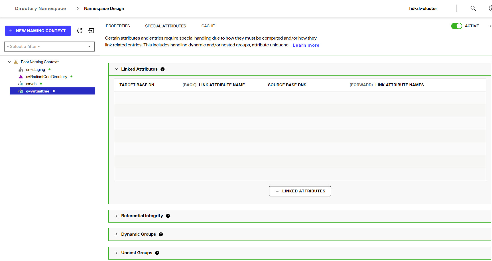
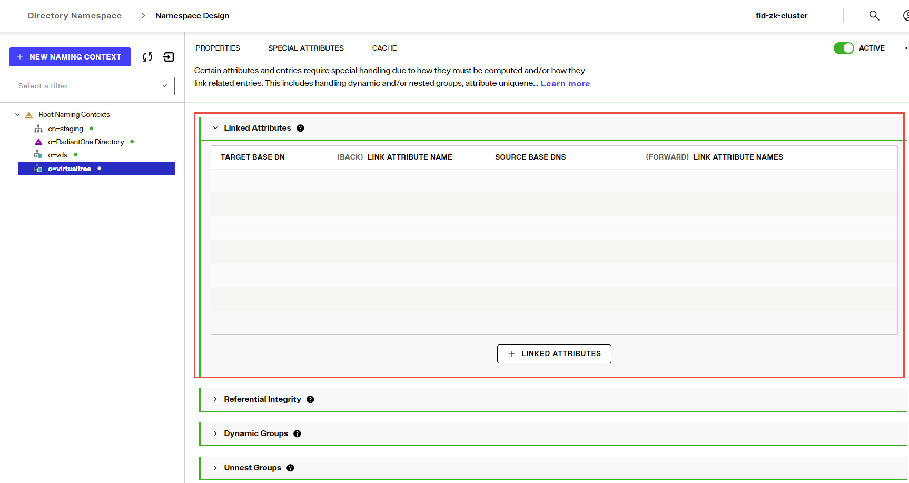
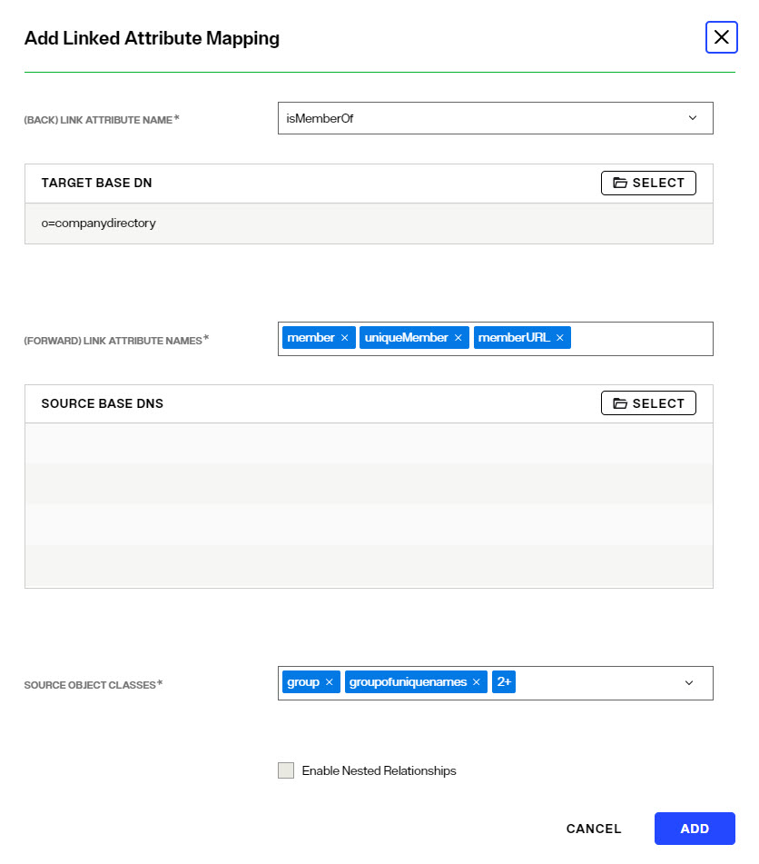
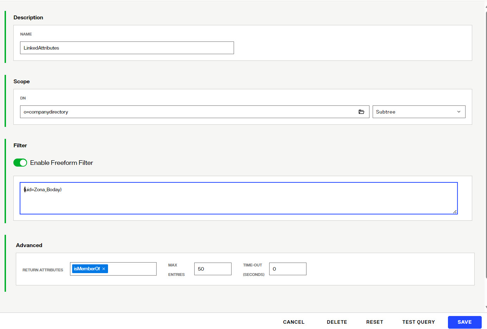
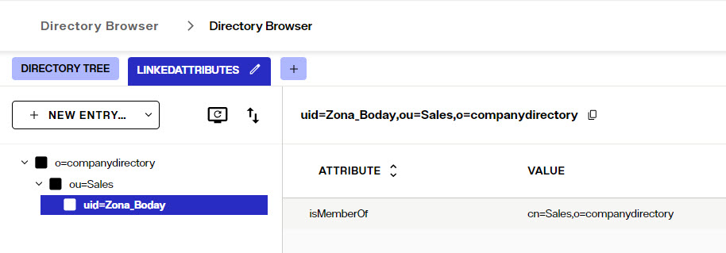
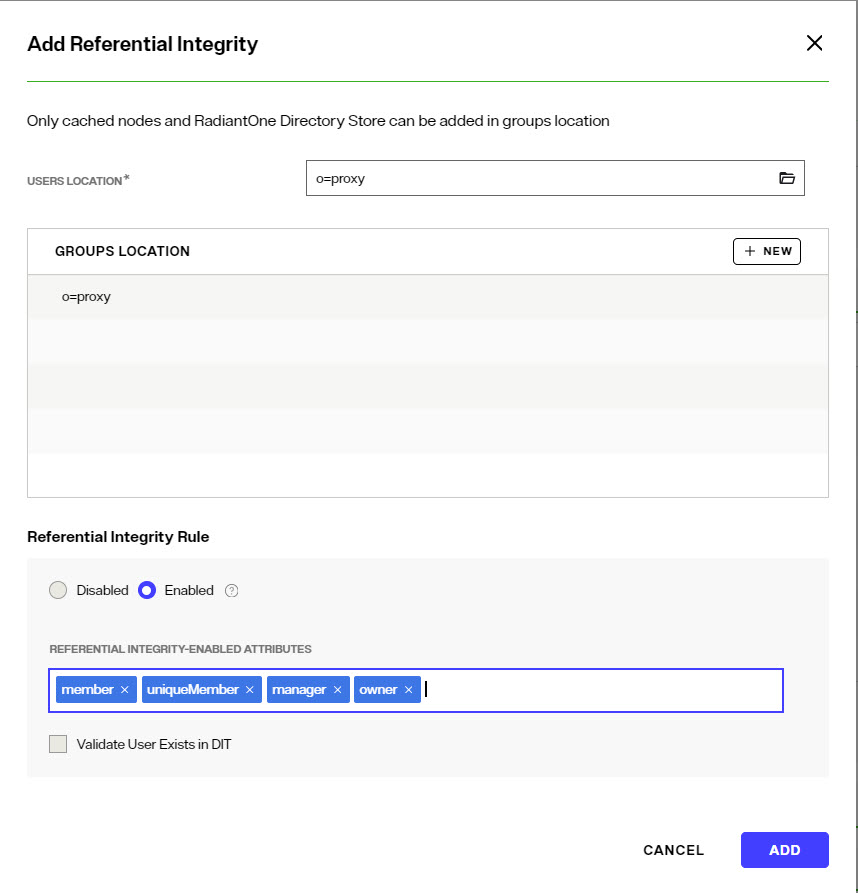
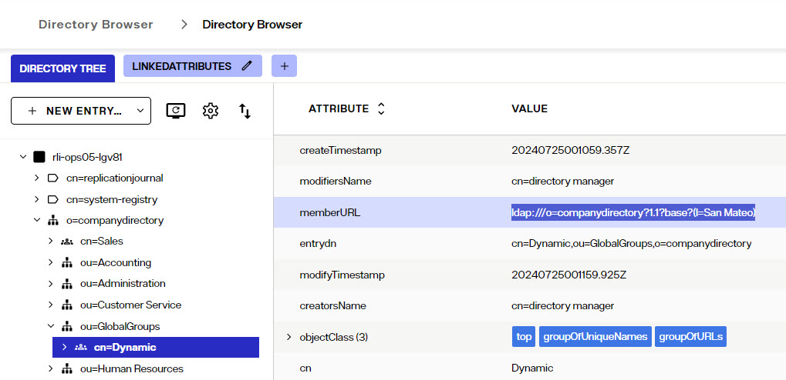
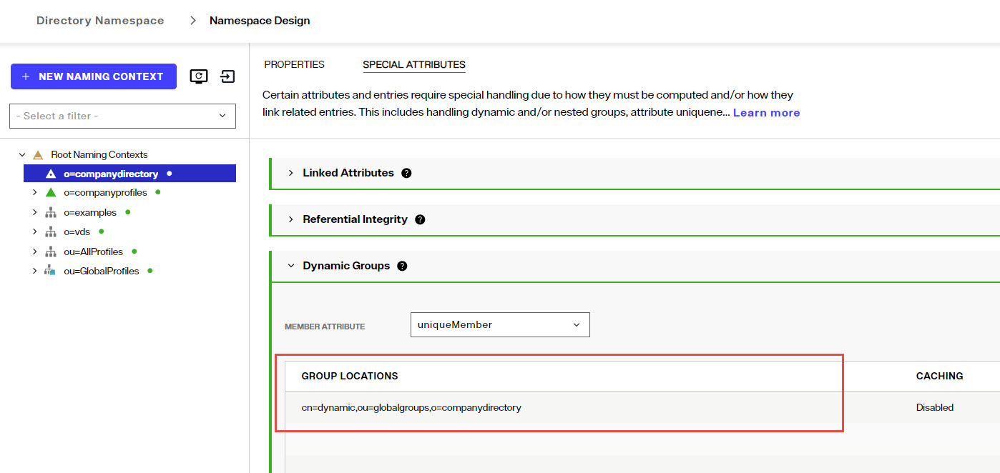
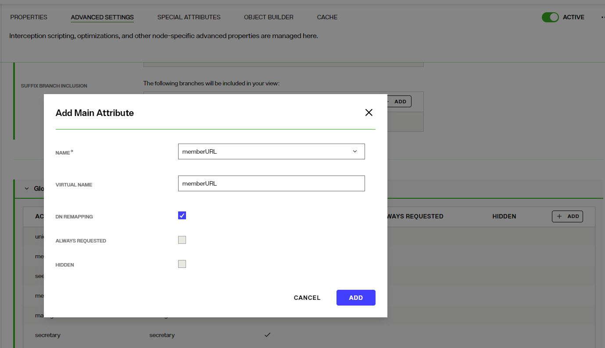
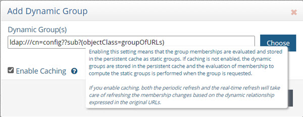

## Special Attributes Handling Overview
Special attributes settings can be found on Control Panel > Setup > Directory Namespace > Namespace Design. Select the root naming context where the special attributes handling should be applied and click the SPECIAL ATTRIBUTES tab.

The Special Attributes Handling options allow you to perform the following functions: 

-	Configure the automatic relationship management between linked attributes
-	Configure Referential Integrity
-	Configure Dynamic Groups
-   Configure Attribute Uniqueness
-	Configure unnesting of nested groups

The types of special attributes that are supported vary depending on the type of identity view. If the special attribute is not supported, you do not see it on the SPECIAL ATTRIBUTES tab for the selected identity view.

Special Attribute	| Uncached Identity Views from LDAP Backends | Uncached Identity Views from non-LDAP Backends | Persistent Cached Identity Views
-|-|-|-
Linked Attributes	| X | - | X
Referential Integrity	| - | - | X
Dynamic Groups	| X | - | X
Attribute Uniqueness	| - | - | X
Unnest Groups	| - | - | X

### Linked Attributes

The Linked Attributes setting is only compatible with entries located in identity views from LDAP backends, [RadiantOne Directory stores](../directory-stores/special-attributes-handling) or persistent cached identity views.

Linked attributes are attributes that allow relationships between objects. A typical example would be isMemberOf/uniqueMember for user/groups objects. A group has members (uniqueMember attribute) which is the forward link relationship. Those members have an isMemberOf attribute which is the back link (to the group entry) relationship. Other examples of linked attributes are:

- manager/directReports
- altRecipient/altRecipientBL
- dLMemRejectPerms/dLMemRejectPermsBL
- dLMemSubmitPerms/dLMemSubmitPermsBL
- msExchArchiveDatabaseLink/msExchArchiveDatabaseLinkBL
- msExchDelegateListLink/msExchDelegateListBL
- publicDelegates/publicDelegatesBL
- owner/ownerBL

The most common back link/forward link relationship is between group and user objects. A list of groups a user is a member of can be automatically calculated by RadiantOne and returned in the membership attribute of the user entry. The default attribute name for the back link attribute is isMemberOf. However, you can configure any attribute name (e.g. memberOf) you want. 

The back link attribute is returned only when explicitly requested by a client unless the back link location and forward link location are stored in a RadiantOne Directory store or Persistent Cache and the Optimize Linked Attribute option is enabled, in which case the back link attribute is always returned even when not requested (unless Hide Operational Attributes is enabled). Also, if the groups returned in the backlink attribute (isMemberOf/memberOf) can be members of other groups (nested groups) and you want to un-nest/flatten these groups (return all the groups in isMemberOf/memberOf), you must toggle the option to *Enable Nested Groups* in the Control Panel > Manage > Security > Access Controls, GENERAL tab. Users can also be members of dynamic groups (indicated in the criteria of the memberURL attribute of the group entry).

To configure rules for linked attributes, following the steps below:

1.	On the Control Panel > Setup > Directory Namespace > Namespace Design, select the node below the Root Naming Contexts where the identity view is located.
1.  On the right, click the SPECIAL ATTRIBUTES tab and locate the Linked Attributes section (expand it if it is collapsed).
    
   
1.  Click **+LINKED ATTRIBUTES**.
1.	Select a back link attribute name from the drop-down list. If you don’t find the attribute that matches your needs, manually enter the attribute name. This dictates which attribute name RadiantOne returns the back link attribute value as and is generally either memberOf or isMemberOf (for group/user linked attributes).
1.  Click **SELECT** next to the Target Base DN field. The *Select Base DN* window is displayed.
1.	Choose a base DN containing the entries (e.g. users) for which the back link attributes should be managed. In the example below, o=companydirectory is selected. The target base DN is limited to a location at or below the root naming context that is selected in the tree on the left.
1.	Click **SELECT**. 

    
     

1.	Under Source Base DNs, click **SELECT**. The *Select base DN* windows is displayed.

1.	Select a base DN containing the entries (e.g. groups) applicable for the objects (containing the forward link) matching what was defined in step 6 above and click **SELECT**. 

1.	In the source object class list, verify the list includes the class associated with your entries (e.g. groups). Add any missing object classes.

1.	If the Source Base DNs location is for group objects, and the groups can be nested (contain members that are groups), check the option to *Enable Nested Relationships*.

1.	Click **ADD**. The configuration is displayed in the Linked Attributes section.

1.	Click **SAVE**.

**Testing Linked Attributes**

To test your results, you can use the Control Panel > Manage > Directory Browser. 

1. Click **+SEARCH**.
2. Enter a name to save the search (e.g. LinkedAttributes).
3. Enter or select your DN containing users.
4. Choose *Subtree* as the scope from the drop-down list.
5. You can enter a filter to look for a specific user (using the freeform/manual mode, or click **+NEW CONDITION**).
6. In the Return Attributes field enter isMemberOf (assuming this is the back link attribute name configured for returning the groups).
7. Click **SAVE** and then **TEST QUERY**. 

The user in your filter should be returned. Select this entry and the attributes should display. The back link attribute (e.g. isMemberOf) should indicate the groups the user is a member of as shown in the example below.

 
### Referential Integrity

Referential integrity is the process of automatically maintaining consistent relationships among certain entries. This mechanism ensures that any references to an entry are updated whenever that entry is removed or altered. If it is configured, during every LDAP add, modify, delete, and rename operation, RadiantOne updates all necessary DN references (all other entries that refer to that entry). For example, if you remove a user's entry from the directory, and the user is a member of a group, the server also removes the user from the group. If referential integrity is not enabled, the user remains a member of the group until manually removed. Historically, referential integrity is primarily used to ensure that attributes with a distinguished name syntax (especially group membership attributes like member and uniqueMember) are properly maintained in the event of delete or modify DN operations. For a delete operation, any references to the target entry are removed. For modify DN operations, any references to the target entry are renamed accordingly.

The following referential integrity rules are supported by RadiantOne:

-	Disabled
Referential integrity is not enforced for the specified Base DN.
-	Enabled
Referential integrity applies to the member, uniquemember and manager attributes by default. Add any attribute that is of type DN syntax as needed. Some examples are: owner and managedBy.

If referential integrity is enabled, and you want RadiantOne to ensure any values entered for member/uniquemember, or attribute in this list, references a valid DN in the Directory Information Tree (DIT), check the “Validate User Exists in DIT” checkbox. If this option is selected, and a value does not reference a valid Distinguished Name (DN) that is part of the current DIT, the modify operation will fail. Error code 19 will be returned indicating a referential integrity violation.

Referential integrity is only supported for RadiantOne Directory stores and persistent cache. This means that the users and groups locations configured must point to a RadiantOne Directory store or persistent cache.

>[!warning] 
>If you cache entries from a directory backend that maintains referential integrity, and use a native change type for detecting changes for cache refresh (e.g. Changelog, Active Directory, DirSync), you must list all backlink attributes that need refreshed in the cache when a change is detected on the main object. For example, to update the directReports attribute in the persistent cache when a change is detected on a user entry, list the manager attribute in the List of Referential Integrity Attributes property. Some common related attributes typically found in Active Directory are listed below (this list is not exhaustive):
     member/memberOf
     manager/directReports
     owner/ownerBL
     altRecipient/altRecipientBL
     dLMemRejectPerms/dLMemSubmitPermsBL
     publicDelegates/publicDelegatesBL

Referential integrity is not enabled by default. To enable and configure it, following the steps below.

1.	On the Control Panel > Setup > Directory Namespace > Namespace Design, select the node below the Root Naming Contexts where the identity view is located.

2.	On the right, click the SPECIAL ATTRIBUTES tab and locate the Referential Integrity section (expand it if it is collapsed).

3.  Click **+REFERENTIAL INTEGRITY**.
4.  For the Users Location section, either enter the location or click the [Folder](Media/folder-icon.jpg) to browse to the location.
5.  In the Groups Location section, click **+NEW**.
6.  Either enter the location or click the [Folder](Media/folder-icon.jpg) to browse to the location of the groups. Referential integrity is enforced for any group below this location. The groups must be in a RadiantOne Directory store or persistent cache.
7.	Select the applicable referential integrity rule (enabled/disabled). If enabled, enter a list of attributes to enforce referential integrity for. The default attributes are: member, uniqueMember, and manager. You can remove these (click the "x" next to the attribute) and/or add more. To add more, enter the value and press "Enter" on the keyboard. 
8. If you want RadiantOne to ensure any values entered for member/uniquemember, or attribute in this list, references a valid DN in the Directory Information Tree (DIT), check the “Validate User Exists in DIT” checkbox. If this option is selected, and a value does not reference a valid Distinguished Name (DN) that is part of the current DIT, the modify operation will fail. Error code 19 will be returned indicating a referential integrity violation.
9.	Click **ADD**.
10.	Click **SAVE**.

### Dynamic Groups

For dynamic groups, the membership is determined by search criteria using an LDAP URL as opposed to being maintained explicitly in a list. For example, suppose that you want a Sales group to contain every employee that has a title of Sales Manager. To do this, you create a dynamic group named Sales associated with the groupOfURLs objectclass. Then, instead of statically assigning member DNs as unique members (in the member or uniqueMember attribute), you define a memberURL attribute that contains the LDAP URL and criteria (seach base, scope and filter) to be used for determining members of the group. 

Dynamic groups are not enabled by default. Therefore, any groups in RadiantOne associated with the groupOfURLs objectclass will have their memberURL returned directly to clients as is. This group could be in a RadiantOne Directory store, or virtualized from some LDAP backend. 

To enable support for dynamic groups, follow the steps below.

1.	From the Control Panel > Setup > Directory Namespace > Namespace Design, select the root naming context where the identity view and/or RadiantOne Directory is mounted that contains the dynamic group.
1.	Click the Special Attributes tab and expand the Dynamic Groups section.

1.	Click Select either member or uniquemember from the Member Attribute drop-down list. This will determine the attribute name that will contain the members of the dynamic groups.
1.	Click **+DYNAMIC GROUP**.

1.	Click  and browse to the exact group entry that you like RadiantOne to automatically evaluate members for and click **SELECT**. To configure this logic for multiple groups located in the same container, just enter an LDAP URL that encompasses all groups instead of browsing to the exact group entry. E.g. ldap:///cn=config??sub?(objectClass=groupOfURLs) could be used to indicate all dynamic groups located below cn=config. If you are not knowledgeable about LDAP URL syntax, just browse to the container/parent node where all dynamic groups are located and the LDAP URL is automatically calculated for you.
1.	Click **ADD**. Below is an example of a dynamic group indicating a memberURL of: ldap:///o=companydirectory?1.1?base?(l=San Mateo) and how this would be configured respectively.
	 
	
 

1.	Repeat these steps to add all dynamic groups. 

1.	Click **SAVE**.

If the dynamic group configured above is in a proxy view of an LDAP backend (as opposed to located in a RadiantOne Directory store), you must configure DN Remapping for the memberURL attribute.

1. From the Directory Namespace > Namespace Design, select the root naming context where the proxy is mounted.

1.	On the Advanced Settings tab on the right side, expand the *Global Attributes Handling* section.

1.	Click **+ADD**.
1.	Enter memberURL for the Name and Virtual Name properties.

1.	Check the DN Remapping option.

1.	Click **ADD**.
	

1.	Click **SAVE**.

For groups defined in this section, RadiantOne automatically evaluates and computes the list of members based on the memberURL attribute indicated in the group. The group named “Dynamic” configured above would be returned by RadiantOne as a virtual static group with the member list computed automatically based on the criteria indicated in the memberURL attribute. 

>[!note] 
>To avoid returning duplicate entries, when a dynamic group is queried in RadiantOne, if both member and memberURL are requested, the memberURL attribute is not returned.

#### Caching Dynamic Groups

If the dynamic groups are from a proxy view of an LDAP backend you can choose to cache the group entries. If the dynamic groups are in a RadiantOne Directory store, you cannot cache them since persistent cache is not applicable for RadiantOne Directory stores. 

The default and recommended behavior of RadiantOne for cached dynamic groups is to only cache the group entry with the memberURL attribute not computed. Based on requests from clients, RadiantOne computes the memberURL to return a static list of members as needed. 

If you require the group members to be cached as static group entries, check the Enable Caching option when you define the Dynamic Group in Special Attributes Handling. Enabling this setting means that the static groups are stored in the persistent cache (members are evaluated and cached in the member attribute) and refreshed as needed with either a periodic refresh or a real-time refresh. If caching is not enabled, the dynamic groups are stored in the cache, and the evaluation of membership to compute the static group is performed when the group is requested. 

>[!note] 
>If the location of the dynamic group is already configured for persistent cache when you select to Enable Caching in the dynamic group setting, you must reindex the persistent cache to ensure the group members are also in the cache.

### Unnest Groups

Some directory vendors, like Microsoft Active Directory, support nested groups where groups can be members of other groups. For clients that are unable to process nested groups, RadiantOne can flatten them and return all members in a single response. The unnest groups setting is applicable to proxy views or model-driven views (designed in Context Builder) that have been configured for persistent cache. Flattening nested groups adds processing overhead to RadiantOne, so persistent cache is required for optimal performance, and you must configure the unnest groups setting before initializing the persistent cache. The unnest group setting is not applicable to RadiantOne Directory stores.

>[!note] 
>Using a computed attribute in the virtual view to unnest groups is an alternative to using the unnest groups setting. However, the computed attribute approach does not support circular groups (GroupA is a member of GroupB and Group B is a member of GroupA) whereas the unnest groups setting does.**

The unnest groups setting is not enabled by default. To define a naming context that contains nested groups that RadiantOne should automatically flatten for client queries, follow the steps below.

1.	From the Main Control Panel > Settings tab > Interception section > Special Attributes Handling sub-section, locate the Unnest Groups section on the right.

2.	Click **Add**.

3.	Click **Add** and select the naming context that contains the nested groups.

4.	Click **OK**.

5.	Click **OK** to close the configuration window.

6.	Click **Save**.

7.	Configure the persistent cache for the virtual view containing the nested groups. For help with configuring persistent cache, see the RadiantOne Deployment and Tuning Guide.

