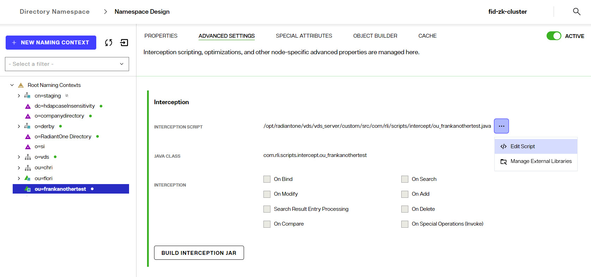

## Interception Script

Interception scripts are written in Java and used to override the default behavior of RadiantOne to implement functionality to meet your needs. Examples of functionality you can introduce are:

-	Complex mappings (concatenations, or string manipulations)

-	Override the incoming query (pre-processing)

-	Processing/changing a result (post processing)

>[!warning] 
>Interception scripts are powerful and offer a lot of flexibility. However, this logic is executed inside the RadiantOne service, so caution should be taken to ensure no undesirable effects. It is highly recommended that you engage Radiant Logic Professional Services to write the interception script(s). If you choose to write your own script(s), the Radiant Logic support team might be unable to diagnose problems in a timely manner. This can result in additional consultation fees imposed on the customer related to the time required to assess and certify the script logic. This is beyond the scope of support and falls under Radiant Logic Professional Services.

Interception scripts can be configured at a [global level](../global-settings/global-interception) (to apply to all root naming contexts configured for the RadiantOne namespace), or for a specific identity view/naming context only. 

To enable an interception script for a specific identity view/naming context:

1. From the Control Panel > Setup > Directory Namespace > Namespace Design, navigate to the identity view/node where the interception script should be invoked.
1. On the right side, select the ADVANCED SETTINGS tab.
1. Enable the operations you want to intercept and click SAVE.
1. Click ... > Edit Script to customize the interception script.
1. Edit the script and click **SAVE**.
1.	Rebuild the intercept.jar file by clicking **Build Interception Jar**.
  	 
1.	Restart the RadiantOne service. This can be done in your environment in Environment Operations Center. After restart, the interception script logic is invoked for the enabled operations.

For samples of interception scripts, please see the Radiant Logic Knowledge Base at: https://support.radiantlogic.com

Only registered customers have access to the Knowledge Base. 

>[!warning]
>If errors result from interception scripts, error code 1 is always returned by the script. 

To use external libraries in the interception script:

1. From the Control Panel > Setup > Directory Namespace > Namespace Design, navigate to the identity view/node where the interception script should be invoked.
1. On the right side, select the ADVANCED SETTINGS tab.
1. Click ... > Manage External Libraries.
1. Click the *Choose a File* Link to browse to the library file.
1. Click **OPEN**.
1. Click **CLOSE**. The libraries are available to use in the interception script. 
