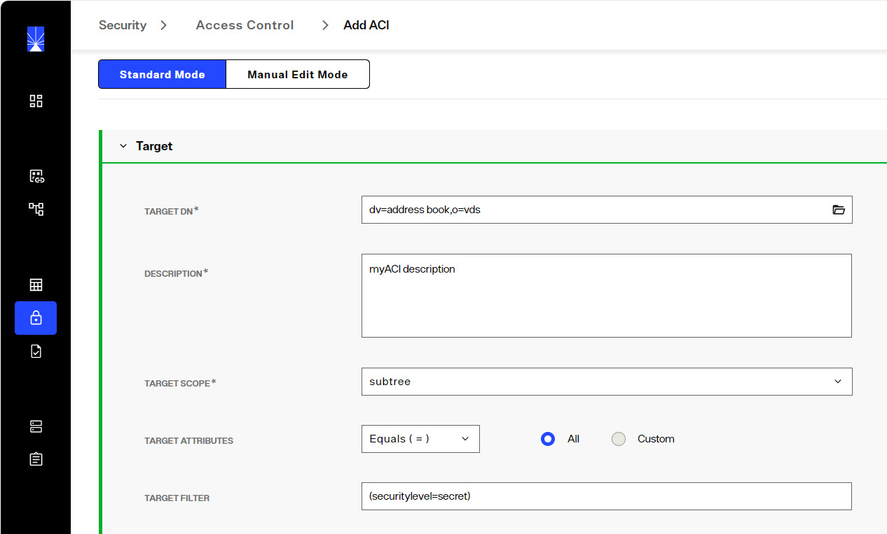
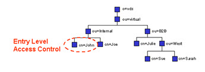
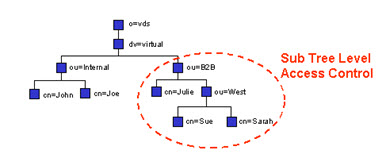
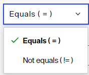
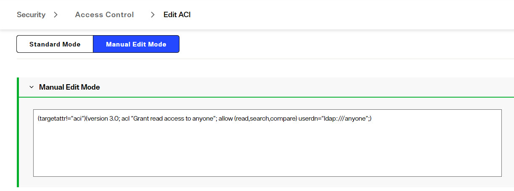
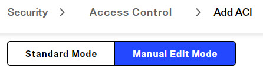
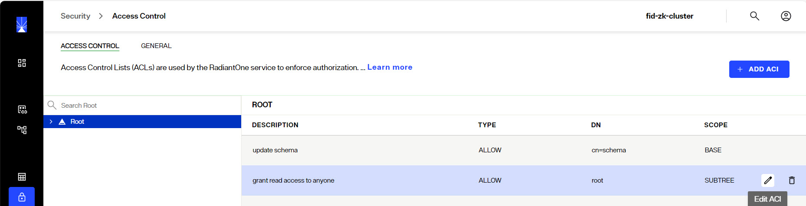
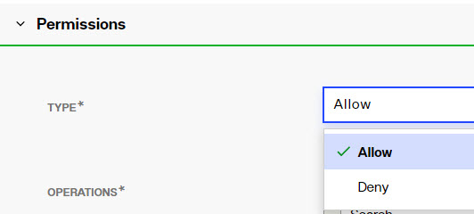
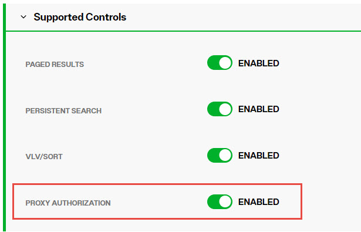

## Overview

When RadiantOne receives a request, it uses the user in the bind operation, and the access control instructions (ACIs) defined in order to allow or deny access to directory information. The server can allow or deny permissions such as read, write, search, or compare. 

>[!warning] 
>ACI are not enforced for the RadiantOne super user, cn=directory manager.

With ACI, you can control access to targets such as:
-	the entire virtual namespace
-	a specific subtree
-	specific entries in the virtual namespace
-	a specific set of entry attributes
-	specific entry attribute values

You can define access to the following subjects:
-	a particular user
-	all users who belong to a specific group
-	all users of the directory

Access controls are managed from the Control Panel > Manage > Security > Access Control. 

The general ACI syntax is as follows:

```
(TARGET_DN)(SCOPE)(ATTRIBUTES)(VERSION; ACI_NAME; ALLOW/DENY (OPERATIONS) SUBJECT;)
```

The following default ACIs are defined:
-	All users have read access to the directory for search, compare, and read operations.

>[!warning] 
>If you delete the default read access, this does not delete read access to the RootDSE for RadiantOne. If you want to remove access to the RootDSE, toggle the ENABLE ROOTDSE ACI option ON, on the GENERAL tab after you delete the default global read access. This denies access to the RootDSE to everyone except cn=directory manager. You can also add a new ACI that dictates RootDSE access. Below is an example of allowing public access to the RootDSE using *Manual Edit Mode*: 
<br>(target="ldap:///")(targetscope="base")(targetattr="*")(version 3.0; acl "RootDSE accessible to public"; allow (read,search,compare) userdn="ldap:///anyone";)

-	Users in the group cn=directory administrators,ou=globalgroups,cn=config have full access to the RadiantOne configuration as it is equivalent to cn=directory manager access. However, unlike cn=directory manager, users in this Directory Administrators group are subject to ACIs when accessing data in the RadiantOne namespace.

Access controls defined in RadiantOne are associated with an objectclass named vdACI.

## Access Control Terms & Definitions

### ACI Description

Each access control instruction has a description which explains the context of the rule.

### Location (Target DN)

The location is the target where the access control is to be applied and is a distinguished name.

>[!warning] 
>It is recommended that you set access permissions at the root of your tree. When setting the target, you can navigate to the specific branch that you want to protect. When setting access controls on a sub-branch, you do not see which access controls have been set up at the parent nodes in the tree. This increases the chance that you may have conflicting access controls defined. Defining access controls at the root helps prevent creating conflicting access rules.

### Target Filter

You can add an LDAP filter condition on the target resource (location) to protect.

For example, you can define the target resource as: all the entries under dv=address book,o=vds that have the attribute securitylevel set to *secret*. 

To create this example, from the Control Panel > Manage > Security > Access Control and click **+ADD ACI**. Browse to select the dv=address book,o=vds branch and enter the target filter. An example is shown below. 




### Scope

The scope of an access control rule can be entry level (base), one level or subtree level. Entry level pertains to the single entry specified in the Target DN. One level pertains to the entry specified in the Target DN and all child branches one level below it. Subtree level pertains to the entry specified in the Target DN as well as all child branches below this point.


 



 


### Target Attributes

The rule can indicate “equal to” (=) or “not equal to” (!=). Select the desired condition in the drop-down list. 




The access rule can apply to “all” attributes or choose the “custom” option and click **SELECT** to narrow the list.

By default, the root ACI prevents only the target attribute *aci* from being returned. This default ACI is shown below.




To improve security, if you want to also prevent userpassword from being returned, you can do so as shown in the following example ACI. Click **+ADD ACI** on the ACCESS CONTROL tab and then switch to MANUAL EDIT MODE.



```
(targetattr != "aci || userPassword")(target = "ldap:///")(targetscope = "subtree")(version 3.0;acl "grant read access to anyone";allow (read,compare,search) (userdn = "ldap:///anyone");)
```

If you do not want to return the userPassword attribute for anyone other than self, you can do so as shown in the following example ACI. Click **+ADD ACI** on the ACCESS CONTROL tab and then switch to MANUAL EDIT MODE.

```
(targetattr = "userPassword")(target = "ldap:///")(targetscope = "subtree")(version 3.0;acl "Allow Access to userPassword to self";allow (all) (userdn = "ldap:///self");)
```

### Authentication Context

The Authentication Context section offers settings related to days and times of the week during which the identity is allowed to access data.

Select the days of the week and enter time ranges which the access control instruction is applicable. Click  to add the time range. Multiple time ranges per day are supported.

### Permissions

If no access permissions have been defined, the default behavior is to grant read access to all attributes except “aci” to everyone. This default is set on the Control Panel > Manage > Security > Access Control > ACCESS CONTROL tab. Select the “root” node. Click  inline with the "grant read access to anyone" ACL.


 
**Type**

You can explicitly allow or deny access permissions by selecting the applicable option from the drop-down.


 

**Operations**

The specific operations a user can perform on directory data are defined below. You can allow or deny all operations, or you can assign one or more of the following:

*All*

Indicates that the subject has the following rights to the targeted entry: read, write, search, delete, compare, and selfwrite. The All access right does not give *proxy* permissions.

Example of the syntax to indicate *all*:

```
(targetattr = "homePhone")(target = "ldap:///dv=address book,o=vds")(targetfilter = "(securitylevel=secret)")(targetscope = "subtree")(version 3.0;acl "myaci";allow (all) (userdn = "ldap:///all");)
```

*Read*

Indicates whether users can read the directory entries and the attributes of entries specified in the ACI. This permission applies only to the search operation. 

*Search*

Indicates whether users can search on the targets specified in the ACI. This permission applies only to the search operation. The Search right is checked once, and after the search is allowed or denied, it is not checked again. If the search is allowed, the read right is then applied to each entry to be returned as a result of the search and to each attribute of each entry.

*Add*

Indicates whether users can create entries.

*Delete*

Indicates whether users can delete entries.

*Compare*

Indicates whether users can compare data they supply in the request with data stored in the directory. With compare rights, the directory returns a success or failure message in response to an inquiry, but the user cannot see the value of the entry or attribute. 

*Write*

Indicates whether users can modify an entry by adding, modifying, or deleting attributes. This permission applies to the modify and modRDN operations.

*Self Write*

Indicates whether users can add or delete their own DN in an attribute of the target group entry. The syntax of this attribute must be a distinguished name. This right is used only for group management. Self write works with proxy authorization: it grants the right to add or delete the proxy DN from the group entry (not the DN of the user from the Bind operation).

*Proxy*

Authorization for RadiantOne data is checked based on the user who authenticated. The authorization ID (DN) is linked to the authenticated ID (DN) for the same connection. With the proxy authorization control enabled, the client can switch the user ID (for authorization purposes) without having to re-authenticate with a new connection.

If there is the need to base authorization on a different user than the one who authenticated, you can use the proxy authorization control. This is primarily useful in environments where an application must authenticate many users and doesn’t want to maintain an open connection to RadiantOne for each of them. With this approach, the application can authenticate the user, and after, impersonate that user for authorization purposes. The application can use its own service account when connecting to RadiantOne and pass the needed control along with the user DN of the person they want to represent for authorization in their requests. RadiantOne then checks the proxy authorization rules that have been configured in access controls to make sure the service account is allowed to represent the person passed in their request. If so, the service account is allowed to perform any operations the person they are impersonating would be allowed to do.

The proxy option indicates whether the subject can access the target with the rights of another entry. You can grant proxy access using the DN of any user in the directory except the special cn=directory manager user. In addition, you cannot grant proxy rights to the cn=directory manager user. If the branch you are protecting with access controls is a RadiantOne Directory store, then this requires the Proxy Authorization control enabled for RadiantOne. Enable this from Control Panel > Global Settings > Client Protocols > LDAP.



### Subjects

A subject is whom the access control rule applies to. The subject types that can be associated with access control rules are described below:

>[!warning] 
>It is recommended to define access controls on subjects that are located in a RadiantOne Directory store or persistent cache. This prevents possible performance or network issues involved with RadiantOne connecting to a backend directory in order to enforce authorization. If your ACI’s require subjects that are located in backend directories, make sure that the backend is configured for high availability and that the [RadiantOne data source](../data-sources/data-sources) is configured with the failover servers appropriately.

-	Users – applicable to any specific user(s).
-	Groups – applicable to a group of users. If the group is a nested group in a RadiantOne Directory, navigate to Control Panel > Manage > Security > Access Control > GENERAL tab and toggle on: ENABLE NESTED GROUPS and configure [Linked Attributes](../directory-stores/special-attributes-handling).
-	Tree Branch - Applicable to the DN specified as part of the subject and all entries below it in the virtual directory tree. The defined access permissions apply to any user found in the tree branch you choose.
-	Group Owner - applicable to the owner, manager, or role of the group. You can also define the target, scope, attributes and permissions using the *Manual Edit Mode* to refine the subject for this complex scenario. See below for an example:<br>
```
(targetattr="*")(target="ldap:///o=My Company?manager,owner,role")(targetscope = "subtree")(version 3.0;acl "Group owner access only";allow (all)(userdn = "ldap:///self");)
```
<br>
The above ACI will dictate that: if the binding user is the "manager", or the "owner", or bearing the "role" of the targeted entity, then the binding user has the access to targeted entry; otherwise, the access is denied.<br>

-	Public – anyone connected to the directory is considered public. This also includes anonymous users.
-	Self – applicable to the user whose authenticated DN matches the DN of the entry that is being accessed.
-	Authenticated – applicable to any user who successfully authenticates.
-	Parent – applicable to the entry only if their bind DN is the parent of the targeted entry. For example, to allow users to modify any child entries of their bind DN, create the following ACI using *Manual Edit Mode* on the dv=address book,o=vds node:
```
(targetattr = "*")(target = "ldap:///dv=address book,o=vds")(targetscope = "subtree")(version 3.0;acl "myaci";allow (write) (userdn = "ldap:///parent");)
```


## ACI Evaluation Rules

The ACI evaluation rules that RadiantOne follows are:

1.	When the RadiantOne service starts, all ACIs defined in the entries below "ou=aggregate,ou=globalaci,cn=config" are loaded.

2.	To determine if an operation is allowed or denied, RadiantOne looks in the ACI list for the target of the operation to collect all target-matched aci values.

3.	RadiantOne separates the aci values into two lists; one list contains all the aci values that match the target and denies the required access, and the other list contains all the aci values that match the target and allows the required access.

4.	If the deny list contains any aci values after this procedure, access is immediately denied.

5.	If the deny list is empty, then the allow list is processed. If the allow list contains any aci values, access is allowed.

If both lists are empty, access is denied.

>[!warning] To troubleshoot/trace ACI evaluation decisions, [RadiantOne server log level](09-logs#log-settings) must be set to DEBUG. When DEBUG level is set, the evaluation rules can be seen in vds_server.log. This log can be viewed from the Environment Operations Center.

## Setting Access Controls

To define access controls:

>[!warning] Access rights can be defined by any user who is a member of the ACI Administrators group or the Directory Administrators group. For details on all administrative groups available for RadiantOne, please see [Delegated Administration of RadiantOne](01-introduction#delegated-administration-of-radiantone).

1.	From the Main Control Panel > Settings Tab > Security section > Access Control sub-section, select the Enable ACI checkbox on the right side in the Authorization section and click **Save**.

2.	In the Access Control section, select root.

>[!note] 
>Although there is not an absolute requirement, it is generally recommended to define all your access controls at the root level so you can come back to this single level and see all configured access controls across the entire virtual namespace.

3.	Click **Add**. The Edit ACI pane is displayed.

>[!note] 
>The Target Scope pull-down menu value defaults to subtree, and the Target Attributes value defaults to All.

4.	Enter an ACI description.

5.	Click **Choose** to navigate to the target DN.

6.	In the Target Scope drop-down list, select base, onelevel or subtree.

7.	In the Target Filter, enter an applicable LDAP filter to narrow the entries affected by the access control rule. This step is optional.

8.	For the Target Attributes, select either “equal to” (=) or “not equal to” (!=) from the drop-down list. Then choose to either have the access rule apply to “all” or “custom”. If custom is selected, click SELECT to narrow the list.

    If you choose custom, and your attribute doesn’t appear in the list, you must update the RadiantOne LDAP schema appropriately before setting the ACI. For details on this, please see [Extending RadiantOne LDAP Schema](07-directory-schema#extending-the-radiantone-ldap-schema). After the schema has been updated, go back to the Settings tab > Security section > Access Controls sub-section and follow the steps mentioned above to add the custom attribute list.

9.	In the Permissions section, select either to allow or deny. 

10.	Select the [operations](06-security#operations) that you want allowed or denied.

11.	In the Authentication Context section, configure bind rules as needed.

12.	In the Apply to section, select the [subjects](06-security#subjects) that will be allowed or denied access. 

    To assign users, groups or users associated in a specific tree/branch, click **LDAP SEARCH**. 

    To assign public, click **ALLOW PUBLIC**.

    To assign self, click **ALLOW SELF**.

    To assign all authenticated users, click **ALLOW AUTHENTICATED**.

    To assign permissions associated with the parent, click **ALLOW PARENT**.

13.	Click **Save** when finished.
