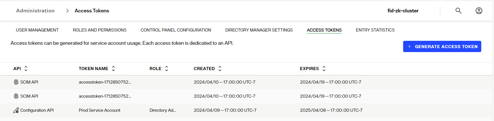

## Overview
Access tokens are used to authorize requests to a RadiantOne API. A token is issued for a specific API which can be the Configuration API to manage the RadiantOne service or one of the APIs used to manage the data accessible in the RadiantOne platform. Data management APIs supported are SCIMv2 or the native RESTful Web Service once known as ADAP. Access tokens are secrets and should be treated like passwords. 

Access tokens have a validity period that is specified when they are generated. The expiration can be indicated with a calendar date, or based on a specific number of days from the time it is generated. Expired tokens can't be used again.

Access tokens are managed from the Control Panel > Admin > ACCESS TOKENS tab.

To delete an access token, click the trashcan icon inline with the token to be removed.

Access tokens can be used to securely query the RadiantOne Service on the REST endpoint. For SaaS deployments, you can view the REST endpoint URL from the Environment Operations Center > Manage > Environments > *Enviroment_Name* > Overview > Application Endpoints.

For self-managed deployments, the REST endpoint depends on your [Port Forwarding Configuration](../../installation/self-managed).

## Configuration API
To configure an access token for calling the RadiantOne configuration API:
1. Navigate to Control Panel > Admin > ACCESS TOKENS tab.
2. Click **+ GENERATE ACCESS TOKEN**.
3. Enter a token name.
4. Select *Configuration API* from the drop-down list.
5. Choose a (delegated admin) role to associate with the token. This role will dictate the RadiantOne settings the token is allowed to configure.
6. Define the token expiration as either a specifc number of days (e.g. 60, 90, 180, 365), or select a specific date that it should expire.
7. Click **CREATE**.

>[!note] 
>Only access tokens for the configuration API can be revoked. The revocation must be done with an API call. The account used to call the API must have [Revoke Access Tokens permission](../../introduction/control-panel-overview). 

## SCIMv2 API
To configure an access token for calling the RadiantOne SCIMv2 API:
1. Navigate to Control Panel > Admin > ACCESS TOKENS tab.
2. Click **+ GENERATE ACCESS TOKEN**.
3. Enter a token name.
4. Select *SCIM API* from the drop-down list.
5. Define the token expiration as either a specifc number of days (e.g. 60, 90, 180, 365), or select a specific date that it should expire.
6. Click **CREATE**.

For details on configuring SCIMv2 access to RadiantOne Identity Data Management, see: [SCIMv2](../../web-services-api-guide/scim)

## REST API
To configure an access token for calling the RadiantOne REST API:
1. Navigate to Control Panel > Admin > ACCESS TOKENS tab.
2. Click **+ GENERATE ACCESS TOKEN**.
3. Enter a token name.
4. Select *REST API* from the drop-down list.
5. Define the token expiration as either a specifc number of days (e.g. 60, 90, 180, 365), or select a specific date that it should expire.
6. Click **CREATE**.

The RadiantOne REST API also supports OIDC tokens that can be validated with an [External Token Validator](./external-token-validators). 

For details on accessing RadiantOne Identity Data Management's REST interface, see: [REST](../../web-services-api-guide/rest)

