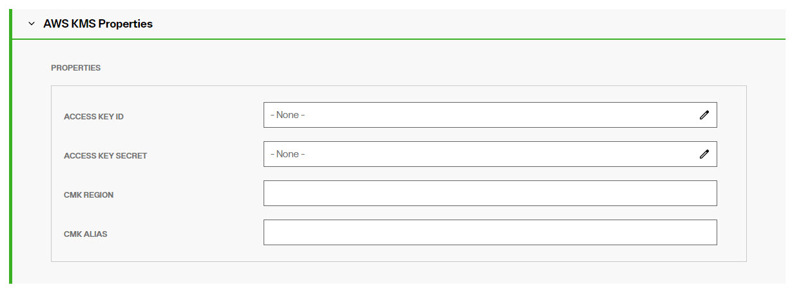
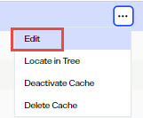
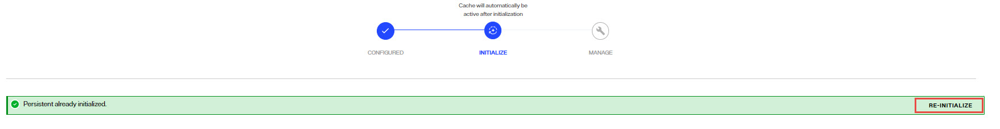
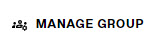
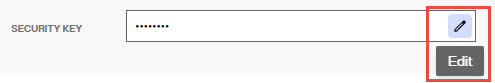

## Overview

Identity Data Management supports encryption for attributes stored in RadiantOne Directory stores and data exported in LDIF files.

Attribute encryption prevents data from being readable while stored in a RadiantOne Directory store, any temporary replication stores/attributes (cn=changelog, cn=replicationjournal, cn=localjournal), backup files, and exported LDIF files (must use the LDIFZ file extension). Attribute values are encrypted before they are stored in the RadiantOne Directory store, and decrypted before being returned to the client, as long as the client is authorized to read the attribute (based on ACLs defined in RadiantOne), is connected to RadiantOne via SSL, and is not a member of the special group (e.g. [cn=ClearAttributesOnly,cn=globalgroups,cn=config)](#clear-attributes-only-group).

There are two items to configure. 
1. The criteria for the key generation used to encrypt/decrypt the attributes.
2. The list of attributes you want to encrypt.

## Attribute Encryption Key Generation

To define the criteria used to generate an encryption key:

1. 	Navigate to Control Panel > Manage > Security > Attribute Encryption.
1. 	In the RadiantOne Directory Attribute Encryption Key section select the desired cipher from the drop-down list or select [AWSKMS](#using-amazon-web-services-aws-with-a-customer-master-key-cmk) if you want to use your own Customer Master Key (CMK) in Amazon Web Services (AWS) Key Management Service (KMS). If you choose AWSKMS, and you also choose this option for LDIFZ encryption, they will share the properties configured in the AWSKMS section.

1. 	If you selected a cipher suite in the previous step, enter a security key. This value is used to auto-generate an encryption key. If you plan on deploying multiple clusters that will participate in inter-cluster replication for encrypted attributes, take note of the value you enter here as you must use it when configuring the security key in the other clusters.
1. 	Click **SAVE**.

An encryption key is auto-generated based on the cipher and security key value provided. This key is used across nodes in a cluster to encrypt/decrypt the attributes configured for encryption. If inter-cluster replication is deployed, all clusters must be configured with the same cipher and security key.

### Using Amazon Web Services (AWS) with a Customer Master Key (CMK)

Instead of using the default key generation, you have the option to use a customer master key stored in AWS. The following steps describe the configuration.

>[!note] 
>Key rotation is optional in AWS for KMS. If enabled, the default key rotation is once every 365 days. For details on AWS Key Management Service, please see the AWS documentation.

1.	Log into your AWS account to create your CMK (Customer Master Key).

1.	With your CMK information, select the AWSKMS option in Control Panel > Manage > Security > Attribute Encryption for the *RadiantOne Directory Attribute Encryption Key* and/or the *LDIFZ Encryption Key*.
1.	When AWSKMS is selected another section appears where you can enter your key details.

  	

1.	For the ACCESS KEY ID property, overwrite the null value with your AWS Access Key ID.

1.	For the ACCESS KEY SECRET property, overwrite the null value with your AWS Access Key Secret.

1.	For the CMK REGION property, overwrite the null value with your AWS region (e.g. "us-east-2").

1.	For the CMK ALIAS property, overwrite the null value with (e.g. "alias/My_Master_Key”).

1.	Click **SAVE**.
1.	If you are using the key for RadiantOne Directory attribute encryption, define the attributes to encrypt as outlined in the next section.

## Attributes to Encrypt in RadiantOne Directory Stores

No attributes are encrypted by default. To configure a list of attributes to encrypt:

1.	Navigate to the RadiantOne Directory store on the Control Panel > Setup > Directory Namespace > Namespace Design. 
2.	On the PROPERTIES tab, in the Encrypted Attributes property, enter an attribute name and press ENTER on the keyboard. Repeat this process for all attributes that should have their values stored encrypted.
3.	Click **SAVE**.
4.	Click **RE-BUILD INDEX**. 

Attributes listed in the Encrypted Attributes property are added to the Non-indexed attribute list by default. This means these attributes are not searchable by default. Indexing encrypted attributes is generally not advised as the index itself is less secure than the attribute stored in RadiantOne Directory. However, if you must be able to search on the encrypted attribute value, it must be indexed. Only “exact match/equality” index is supported for encrypted attributes. To make an encrypted attribute searchable, remove the attribute from the list of nonindexed attributes and then click **RE-BUILD INDEX**.

## Attributes to Encrypt for a Persistent Cached Identity View
No attributes are encrypted by default. To configure a list of attributes to encrypt:

1.	Navigate to the Control Panel > Setup > Directory Namespace > Namespace Design.
1.	Select the root naming context that contains a persistent cached identity view and click the CACHE tab.
1.	Click ... inline with the cached identity view and choose Edit.

      
  	
1.	Click  and expand the Attributes Handling section.
1.	In the Encrypted Attributes property, enter an attribute name and press ENTER on the keyboard. Repeat this process for all attributes that should have their values stored encrypted.
1.	Click **SAVE**.
1.	Click .
1.	Click the **RE-INITIALIZE CACHE** link.
1.	Select what LDIF file to use and click **DONE**. 

      

Attributes listed in the Encrypted Attributes property are added to the Non-indexed attribute list by default. This means these attributes are not searchable by default. Indexing encrypted attributes is generally not advised as the index itself is less secure than the attribute stored in persistent cache. However, if you must be able to search on the encrypted attribute value, it must be indexed. Only “exact match/equality” index is supported for encrypted attributes. To make an encrypted attribute searchable, remove the attribute from the list of nonindexed attributes and then re-initialize the cache.

## Accessing Encrypted Attributes

Attribute values are encrypted before they are stored in a RadiantOne Directory/persistent cache, and decrypted before being returned to the client, as long as the client is authorized to read the attribute (based on ACLs defined in RadiantOne), is connected to RadiantOne via SSL, and not a member of the [special group](#clear-attributes-only-group) containing members not allowed to get these attributes (e.g. cn=ClearAttributesOnly,cn=globalgroups,cn=config). 
 
### Querying Changelog for Entries Containing Encrypted Attributes

When entries containing encrypted attributes are updated and logged into the RadiantOne changelog (e.g. cn=changelog), a client that is connected to RadiantOne via SSL, and is NOT a member of the special [Clear Attributes Only Group](#clear-attributes-only-group) (which by default is the ClearAttributesOnly group located at,ou=globalgroups,cn=config) can see encrypted attributes in clear text. If the client is connected to RadiantOne via SSL and is a member of the special [Clear Attributes Only Group](#clear-attributes-only-group), the value in the “changes” attribute is returned encrypted.

### Clear Attributes Only Group

To apply a deny-by-exception policy to encrypted attributes, you can add users to the ClearAttributesOnly group. Members of this group cannot get encrypted attributes in clear, even if ACLs dictate they can read the encrypted attribute(s) and they are connecting to RadiantOne via SSL.

The table below summarizes the behavior of this special group when a user is connected to RadiantOne via SSL.

Is user a member of the special group?	| Attributes In DIT	| Values in “changes” attribute In Changelog
-|-|-
No		| Clear text	| Clear text
Yes		| Not displayed	| Encrypted

To add a user to the Clear Attributes Only group:

1.	In the Control Panel > MANAGE > Directory Browser.

2.	Expand cn=config and then expand ou=globalgroups.

3.	Select cn=ClearAttributesOnly.

4.	On the top right, click .

5.	From here you can add users to the group.

### Updating Encrypted Attributes

To update encrypted attributes, the client must connect to RadiantOne via SSL and be authorized (via ACLs) to read and update the attribute and not be in the special [Clear Attributes Only Group](#clear-attributes-only-group). When editing entries from the Control Panel > MANAGE > Directory Browser > selected RadiantOne Directory store, the attributes defined as encrypted are shown in clear as long as the user connected to the Control Panel is authorized to read those attributes and is not a member of the blacklisted group. In this case, the connected user can also update the encrypted attribute if permissions allow for it.

### Changing an Encryption Key

If you need to change the encryption security key, follow the steps below.

1.	Go to the Control Panel > Setup> Directory Namespace > Namespace Design.

2.	Select the naming context representing the RadiantOne Directory store.

3.	On the right, remove all values from the encrypted attributes list.

4.	Click **SAVE**.

5.	Click **RE-BUILD INDEX**.

6.	Repeat steps 1-5 for each store that has encrypted attributes.

7.	Go to the Control Panel > Manage > Security > Attribute Encryption.

8.	Click Edit next to Security Key. This option is only available if you removed encrypted attributes and rebuilt the index for all applicable stores.
   

9.	Go to the Control Panel > Setup > Directory Namespace > Namespace Design.

10.	Select the naming context representing the RadiantOne Directory store.

11.	On the right, add required attributes to the encrypted attributes list (remember to press ENTER on the keyboard after each).

12.	Click **SAVE**.

13.	Click **RE-BUILD INDEX**.

14.	Repeat steps 9-13 for all stores that require encrypted attributes.

## LDIF File Encryption

Using the LDIFZ format when exporting entries produces a zipped and encrypted LDIF file. This prevents data from being readable while stored in exported LDIF files. This setting is required to support the LDIFZ option during exports. 

### Key Generation

To define the criteria used to generate an encryption key:

1. 	Navigate to Control Panel > Manage > Security > Attribute Encryption.

2.	 In the LDIFZ Encryption Key section, select the desired cipher from the drop-down list or select [AWSKMS](#using-amazon-web-services-aws-with-a-customer-master-key-cmk) if you want to use your own Customer Master Key (CMK) in Amazon Web Services (AWS) Key Management Service (KMS). If you choose AWSKMS, and you also choose this option for Attribute Encryption Key, they will share the properties configured in the AWSKMS section.

3.	 If you selected a cipher suite in the previous step, enter a security key. This value is used to auto-generate an encryption key. If you plan on deploying multiple clusters that will participate in inter-cluster replication and you are going to initialize RadiantOne Directory stores from an exported LDIFZ file, take note of the value you enter here as you must use it when configuring the LDIFZ cipher and security key in the other clusters.

### Changing an LDIFZ Encryption Key

If you need to change the LDIFZ encryption security key, follow the steps below.

1.	Go to the Control Panel > Manage > Security > Attribute Encryption.

1.	Click Edit next to Security Key.
   
      

1.	Select the cipher and enter a security key.

1.	Click **SAVE**.

>[!note] 
>LDIFZ files generated with the old encryption key are no longer usable.

### Requiring LDIFZ for Exports

The Secure LDIF Export option allows you to enforce the use of the encrypted LDIFZ format when exporting entries from the Directory Browser tab. With this setting enabled, using the unencrypted LDIF format for exports is not supported.

>[!note] Enabling secure LDIF exports requires first defining an LDIFZ encryption key.

To enable the secure LDIF export option:

1.	Go to the Control Panel > MANAGE > Security > Attribute Encryption.

2.	Navigate to the Secure LDIF Export section and click the toggle to Enable it.

4.	Click **SAVE**.

This feature works with the LDIFZ Encryption option as outlined in the table below.

<table>
<tr>
<td>LDIFZ Encryption Key	
<td>Secure LDIF Export	
<td>Available Export Formats:		
 LDIF	 
<td>Available Export Formats: 
 LDIFZ 

<tr>
<td> undefined	
<td>Disabled	
<td>🗹	
<td>⌧

<tr>
<td>undefined
<td>Enabled	
<td> N/A because you can’t enable Secure LDIF if the LDIFZ encryption key is not defined.	
<td>N/A because you can’t enable Secure LDIF if the LDIFZ encryption key is not defined.
<tr>
<td>defined	
<td>Disabled	
<td> 🗹	
<td>🗹
<tr>
<td>defined
<td> Enabled	
<td> ⌧	
<td>🗹
</table>

