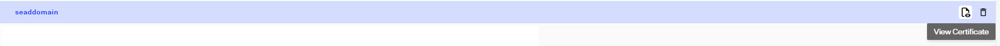
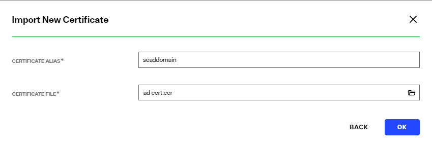
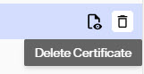
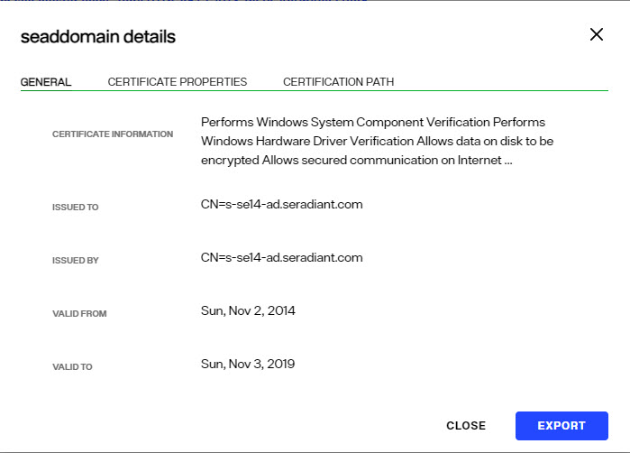

## Overview

The certificates in the Client Certificate Trust Store are used by RadiantOne to connect via SSL to underlying data sources. Therefore, the appropriate client (public key) certificate (associated with the server certificate of the backend) needs imported into the Client Certificate Trust Store (unless they are signed by a trusted/known Certificate Authority).

Client certificates can be added to the Client Certificate Truststore at any time without needing to restart the RadiantOne service. All RadiantOne cluster nodes in the same environment, share the contents of the Client Certificate Truststore.

Manage client certificates into the truststore from the Control Panel > GLOBAL SETTINGS > Client Certificate. Certificates can be viewed, imported, exported or deleted from here.

## Viewing Client Certificates

To view a certificate, select the certificate in the list and click the inline **View Certificate** option. Valuable information about the certificate is shown (who issued the certificate, who the certificate was issued to, when the certificate is set to expire, status…etc.).

## Adding Client Certificates

To add a certificate:
1.	Click **IMPORT**.
2.	Enter a short, unique name (alias) for the certificate.
3.	Browse to the location of the client certificate file and click **OK**.

## Deleting Client Certificates

To delete a certificate:

1.	Select the desired certificate and click the inline trashcan icon
2.	Click **DELETE** to confirm the deletion.

## Exporting Client Certificates

To export a certificate:

1.	Select the desired certificate and click the inline **View Certificate** option.
2.	Click **EXPORT**. The exported file is automatically downloaded to the default location based on the Internet browser settings.

