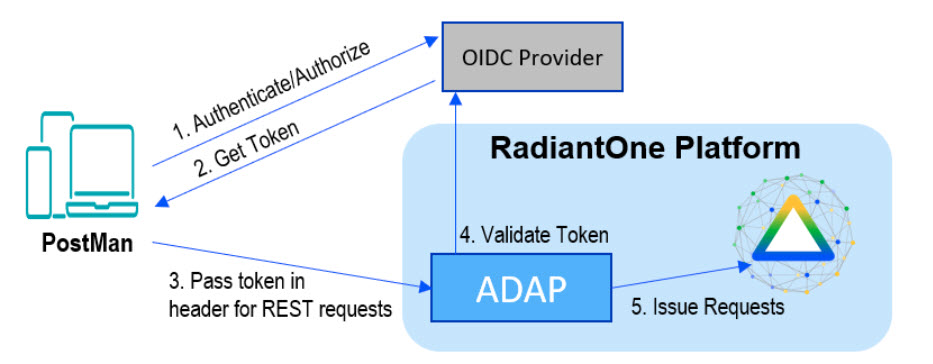
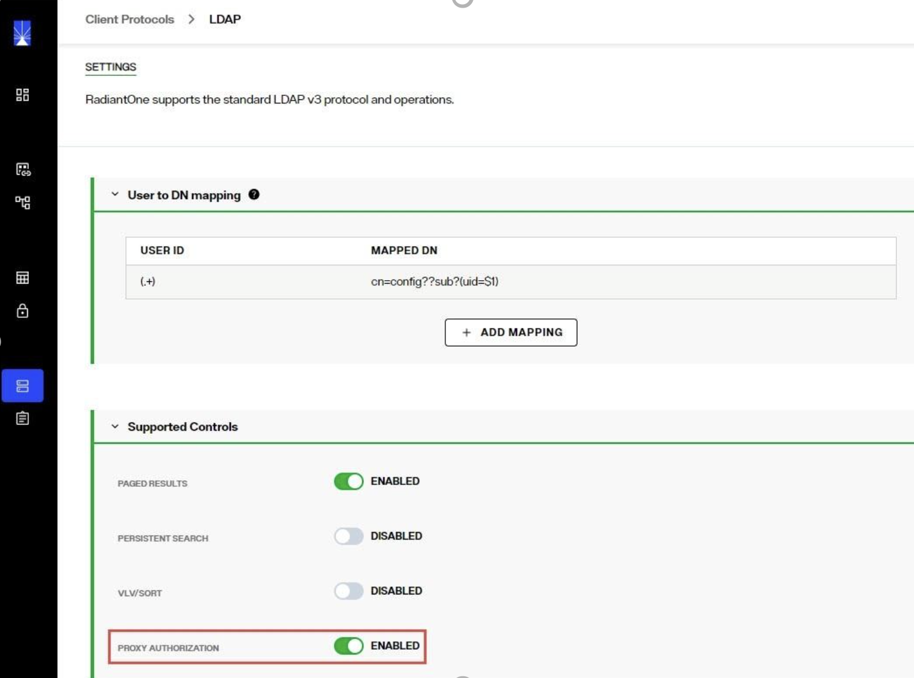
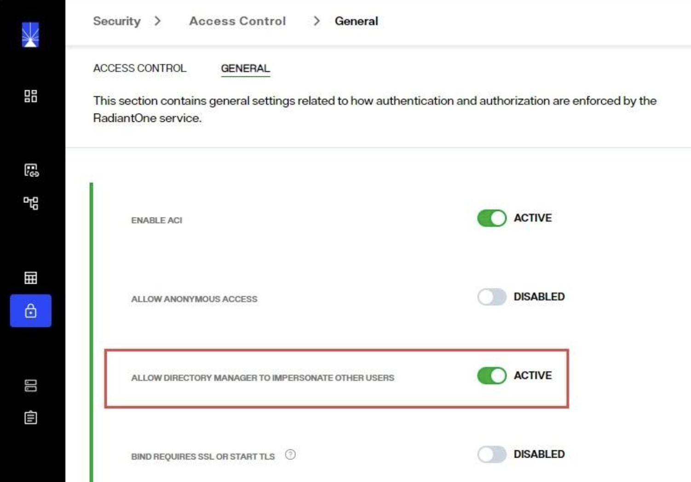
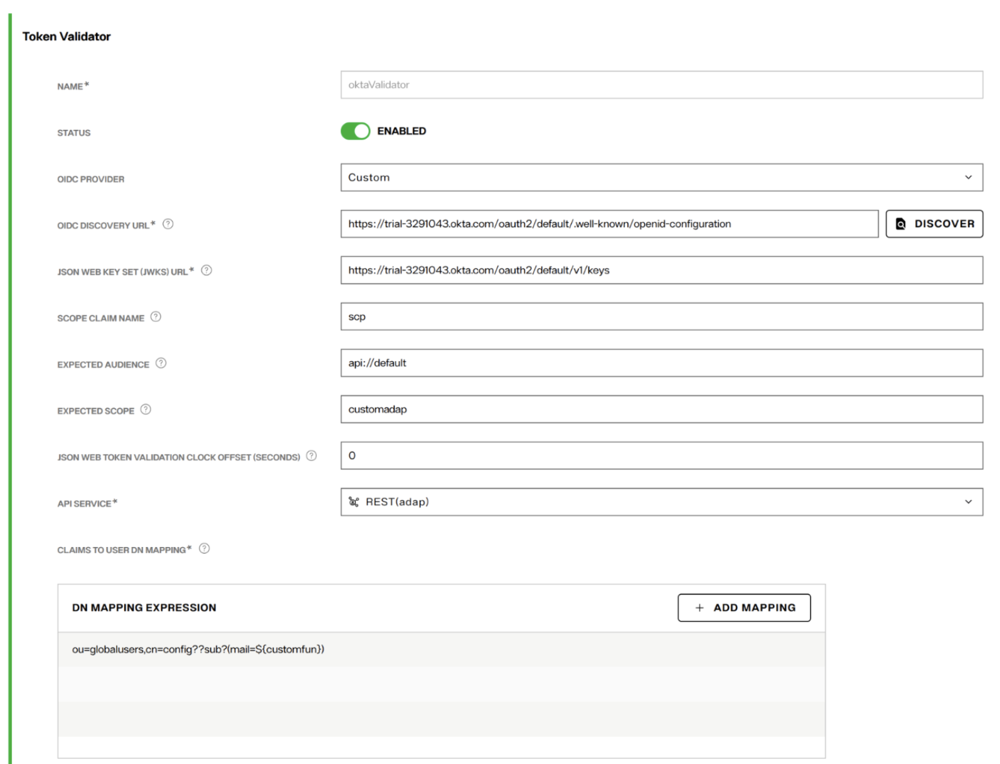
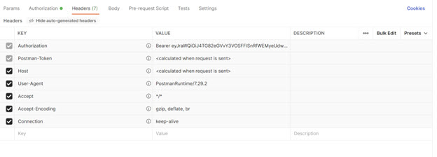
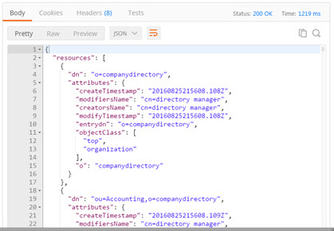
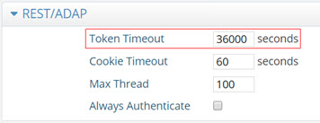
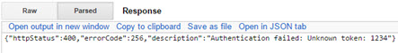

## Overview

RadiantOne REST (ADAP) API supports OAuth 2.0 / OpenID Connect (OIDC) token-based authentication. With this model, clients authenticate with an external authorization server (such as Okta) and use the resulting access token to authenticate API requests to RadiantOne. 

This approach improves security by ensuring that user credentials are never sent to RadiantOne or the application. A single access token can be reused for multiple requests until it expires. 

A high-level diagram of the different components is shown below. Postman is used as a simple client to illustrate the flow. 




In this architecture, you need to follow these high-level steps: 

* Configure an external OIDC authorization server(such as Okta) to issue access tokens. 

* Configure RadiantOne to trust that authorization server using a Token Validator. This document covers additional details about setting up the Token Validator in the later sections.  

* Obtain the access token directly from the authorization server. 

* Call the RadiantOne REST (ADAP) API, presenting the token. 

* RadiantOne validates the token at request time and maps it to a directory identity. 

### Prerequisites 

Before you begin configuring the token validator, ensure you have the following: 

* Configured an OIDC authorization server 

* Client ID and Client Secret  

* OIDC Discovery URL 

* Expected audience and required scopes 

### RadiantOne Configuration 

This section describes configuring proxy authorization, configuring an ADAP external token validator, and Claims to FID User Mapping. 

### Configure Proxy Authorization 

The RadiantOne REST (ADAP) service queries the RadiantOne LDAP service using proxy authorization. 

To configure proxy authorization: 

1. Navigate to Control Panel > Global Settings > Client Protocols > LDAP. 

2. Enable Proxy Authorization and click SAVE.
   
   
   
3. Navigate to Control Panel > Security > Access Controls > General.

4. Enable the “ALLOW DIRECTORY MANAGER TO IMPERSONATE OTHER USERS” option and click SAVE.

   

## Token Validators 

With Token Validators, administrators can configure and manage trusted external token sources to ensure that only valid, verified tokens are accepted for API authentication. 

### Adding a Token Validator 

1. Navigate to Global Settings > Token Validators 
2. Click "Add Token Validator". This opens the configuration form. 
3. Fill in the Required Fields

   
  
   a. **Name**: A unique name for your validator.  
   b. **OIDC Discovery URL**: The OpenID Connect Discovery endpoint for your authorization server (e.g., Okta).  
   c. **JSON Web Key Set (JWKS) URL**: The endpoint where the public keys for token validation are published. Use the **Discover** button to auto-populate this field from the OIDC Discovery URL.
    d. **Scope Claim Name:** The name of the claim in the JWT that contains the scopes. The default value is `scope`. Some OIDC providers use different claim names (e.g., Okta uses `scp` for tokens issued via the client credentials flow). Set this value to match the claim name used by your authorization server.
   e. **Expected Audience:** The audience value your tokens must contain. If the `aud` claim in the JWT does not match this value, authentication is rejected. Leave this field empty to skip audience validation.
   f. **Expected Scope:** The required scope(s) for access. You can specify a single scope or multiple scopes.
      - To specify multiple scopes, separate them with a comma and a space (e.g., `testscp1, testscp2, testscp3`) or with a space only (e.g., `testscp1 testscp2 testscp3`).
      - All specified scopes must be present in the token for validation to succeed. If any expected scope is not found in the token, authentication is rejected with a `400` error.
   g. **JSON Web Token Validation Clock Offset (seconds)**: Adjusts for clock skew between systems.  
   h. **Claims to User DN Mapping**: This is the expression to map JWT claims to user distinguished names in Identity Data Management.  
   It defines how Identity Data Management converts information in a JWT (such as email or username claims) into the  
   Distinguished Name (DN) of a user in its directory. It’s essentially a template that uses JWT claims to locate or identify  
   the correct user account in Identity Data Management.

  
5. By default, new validators are ENABLED. Leave it as enabled if you are using the validator. You can toggle the status to DISABLED if needed.
6. Click Save to create the validator.

#### JSON Array Claims Support

The External Token Validator supports JWT claims whose values are JSON arrays. This is particularly relevant for OIDC providers (such as Okta) that represent scopes or other multi-valued claims as arrays rather than space-delimited strings.

For example, a token issued by Okta using the client credentials flow may contain scopes in the following format:

```json
{
  "scp": [
    "testscp1",
    "testscp2",
    "testscp3"
  ],
  "aud": "http://example.com:8089/adap",
  "sub": "0oa100lhmsfPSMDYP698"
}
```

When configuring the Token Validator for tokens with JSON array claims:

1. Set the Scope Claim Name to the array claim name used by your provider (e.g., `scp` for Okta).
2. Specify one or more values in the Expected Scope field. The validator automatically parses the JSON array and checks that all expected values are present.
3. No additional configuration is needed — the validator detects whether the claim value is a JSON array or a plain string and handles both formats.


## Querying RadiantOne REST API (ADAP)

1. Request an access token from your OIDC provider.

   Here’s an example request where Okta is the OIDC.
   
   ```
   curl --request POST \
   --url "https://trial-3291043.okta.com/oauth2/default/v1/token" \
   --header "Accept: application/json" \
   --header "Content-Type: application/x-www-form-urlencoded" \
   --data "grant_type=client_credentials&client_id=<your client id>&client_secret=<your client secret> &scope=customadap"
   ```

 2. Use the access token as a bearer token. In this example, Postman is used to include the access token in the Authorization header as a bearer token.
    
    

4. Make the API request. In this example, a basic search is performed.

   | Field         | Value                                      |
   |--------------|--------------------------------------------|
   | URL Syntax   | http://<RadiantOneServer>:8089/adap/<baseDN> |
   | Method       | Get                                        |
   | Header Name  | Authorization                              |
   | Header Value | Bearer <token>                             |
   | Example URL  | http://localhost:8089/adap/o=companydirectory |
   
   If successful, the operation displays a response body similar to the following.
   
   


  **Token Lifetime**
  
  By default the token lifetime is set to 10 hours. To configure the token timeout:
  
  1.	Go to Classic Control Panel > Settings tab > Server Front End > Other Protocols section.
  
  2.	In the REST/ADAP section (requires Expert Mode), edit the value in the Token Timeout field.
  
  3.	Click Save.
  
  4.	Restart the RadiantOne service from the Environment Operations Center. In Environment Operations Center, navigate to Environments > <Environment_Name> > Overview tab and restart the Identity Data Management service from here. This performs a rolling restart and all nodes are restarted.
  
   
   
  
  When an expired or unrecognized token is used, the Response section displays the message “Authentication failed: Unknown token”.
  
  
   
  

