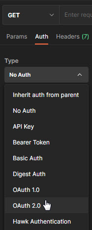
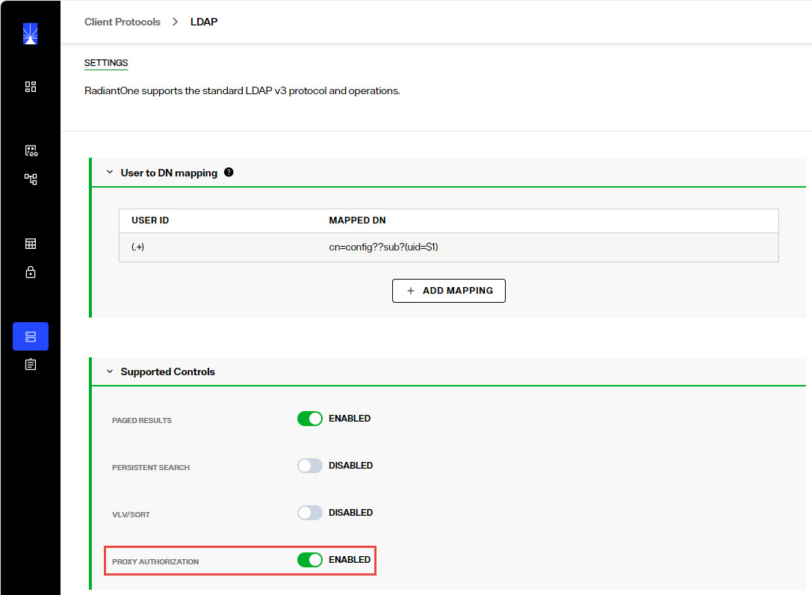
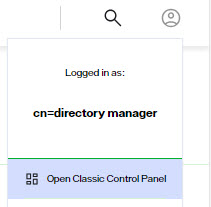

## Overview

The RadiantOne REST (ADAP) interface supports OpenID Connect token-based authentication. This option provides the security of sending user login credentials to the authentication server, not the application (ADAP). OpenID Connect token authentication allows you to send your username and password just once and then pass the token in the request to ADAP. However, the user cannot use the token authentication to request a new token. Multiple requests can be performed during a token’s lifetime.
 
A high-level diagram of the different components is shown below. Postman is used as a simple client to illustrate the flow.

External token validators allow applications to use an access token to call an API on behalf of itself. The API then responds with the requested data. This section assumes that your OIDC provider is already set up and that you know your client ID and secret to test getting a token.

### Getting an Access Token from an External Token Validator

This section describes using the Postman REST client to obtain an access token. 

1. Start a new request. 

1. Click the Auth tab.

1. From the Type drop down menu, select OAuth 2.0. The Current Token section displays. 

    

 
1. In the Configure New Token section, enter the Client ID and client secret.

    >[!note] These values were created during the OIDC provider configuration process. 

1. Provide the access token URL. 

    >[!note] This value can be found using the using the metadata URL from the Authorization Server. 

    

1. Click Get New Access Token. The new access token's details are displayed. 

    

 
1. Copy this token and decode it for the values needed for configuring a mapping between the token contents and a unique identity in the RadiantOne namespace. You can do this at https://jwt.io/. 

### RadiantOne Configuration
This section describes configuring proxy authorization, configuring an ADAP external token validator, and Claims to FID User Mapping.

**Configuring Proxy Authorization**

The RadiantOne REST (ADAP) service queries the RadiantOne LDAP service using proxy authorization.

To configure proxy authorization: 

1. Navigate to Control Panel > Global Settings > Client Protocols > LDAP.

1. Enable Proxy Authorization and click **SAVE**.

    

1. Navigate to Control Panel > SECURITY > Access Controls > GENERAL.

1. Enable the “ALLOW DIRECTORY MANAGER TO IMPERSONATE OTHER USERS” option and click **SAVE**.

    

**Configuring External Token Validators**

To add an external token validator, open Classic Control Panel from the logged in user icon drop-down in the upper right corner:
  

1.  In the Classic Control Panel, navigate to Settings > Security > External Token Validators. 
1.  Click **Add**. The New ADAP External Token Validator page displays.

    

1.  Name the external token validator.
1.  Toggle the Enable switch to On. 
1.  Select an OIDC provider from the drop-down menu (if applicable, to assist with populating the Discovery URL syntax). Otherwise, skip this step and enter your own Discovery URL. 
1.  If the Discovery URL is not loaded automatically, paste the Metadata URI from your OIDC authorization server into the Discovery URL field. 
1.  Click Discover. The JSON Web Key Set URI auto-populates. 
1.  Use the Expected Audience from your OIDC provider configuration to populate the Expected Audience field.
1.  Enter the expected Scope.This property determines what information/claims ("sub" indicates Subject) in the token (based on scopes requested) can be used to identify the relevant account in the RadiantOne namespace for enforcing authorization on subsequent requests for this connection. The value of this attribute is used as input for the *Claims to FID User Mapping* configured later in the steps below. The standard claims associated with the scopes are shown in the table below.

    Scope	| Claims
    -|-
    Email	| email, email_verified
    Address	| address
    Profile	| name, family_name, given_name, middle_name, nickname, preferred_username, profile, picture, website, gender, birthdate, zoneinfo, locale, updated_at
    Phone	| phone_number, phone_number_verified
    Openid	| sub, auth_time, acr

  
1.  Other values can be obtained from the decoded access token. See the [Getting An Access Token](#getting-an-access-token-from-an-External-Token-Validator) section for more information.  

    

1. (Optional) Enter a value for the *JSON Web Token Validation Clock Offset*. This is used during the validation of JWTs to account for slight differences in time between the issuer of the token and the recipient. This clock offset is measured in seconds and provides a buffer that can help prevent issues related to time discrepancies, especially around the token's iat (issued at), nbf (not before), and exp (expiration) claims.

1.  Click Edit next to Claims to FID User Mapping. The OIDC to FID User Mappings page displays.
1.  Click Add. Use either a Simple DN Expression or a Search Expression to map a uniquely identifying attribute to a corresponding claim value in the token (refer to the [Getting An Access Token](#getting-an-access-token-from-an-External-Token-Validator) section for more information). In the following image, a Search Expression is used to map the attribute **mail** to the claim value **email**.

    >[!note] In some cases, creating a new attribute may be required.

    

1.  Click OK.
1.  Click OK again to close the *OIDC to FID User Mappings* window.
1.  Click Save. 

### Querying RadiantOne REST API (ADAP) with a Token

In this example, Postman is the REST client that will issue calls to ADAP. Obtain an OpenID Connect Token for Postman from your OIDC provider. Use the token value in a header configured in a Postman client as follows.

1. Request a new access token (see [Getting An Access Token](#getting-an-access-token-from-an-External-Token-Validator)). 
1. Click *Use Token*. This inserts an Authorization header that inserts your bearer token. 

    

1. Send the bearer token to the REST (ADAP) endpoint. In this example, a basic search is performed. 

Field	| Value
-|-
URL Syntax	| `http://<RadiantOneServer>:8089/adap/<baseDN>`
Method	| Get
Header Name	| Authorization
Header Value	| Bearer `<token>`
Example URL	| http://localhost:8089/adap/o=companydirectory

If successful, the operation displays results similar to the following. 

 
**Token Lifetime**

By default the token lifetime is set to 10 hours. To configure the token timeout:

1.	Go to Classic Control Panel > Settings tab > Server Front End > Other Protocols section.

2.	In the REST/ADAP section (requires Expert Mode), edit the value in the Token Timeout field.

3.	Click Save.

4.	Restart the RadiantOne service from the Environment Operations Center. In Environment Operations Center, navigate to Environments > <Environment_Name> > Overview tab and restart the Identity Data Management service from here. This performs a rolling restart and all nodes are restarted.

  
 

When an expired or unrecognized token is used, the Response section displays the message “Authentication failed: Unknown token”.

 
