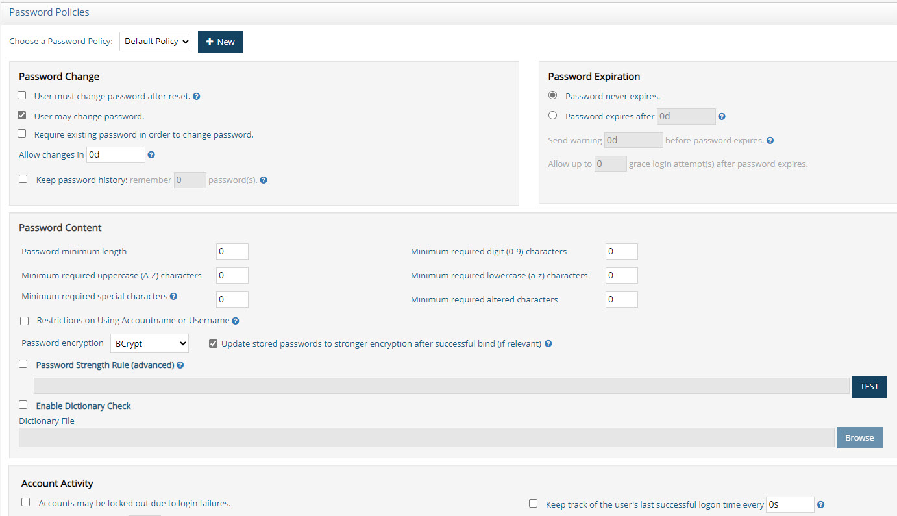
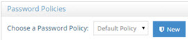
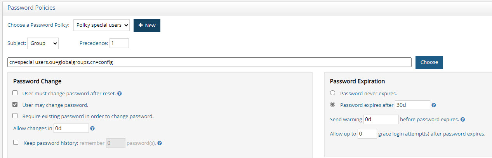
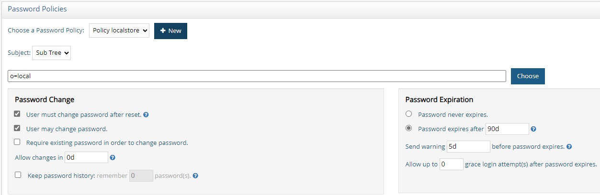
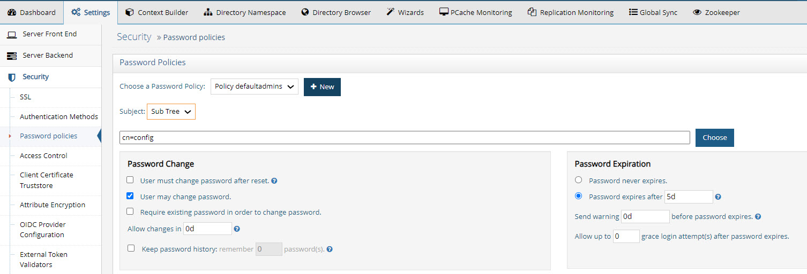
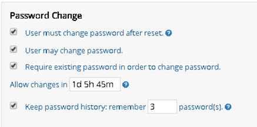
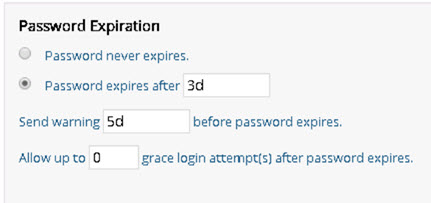
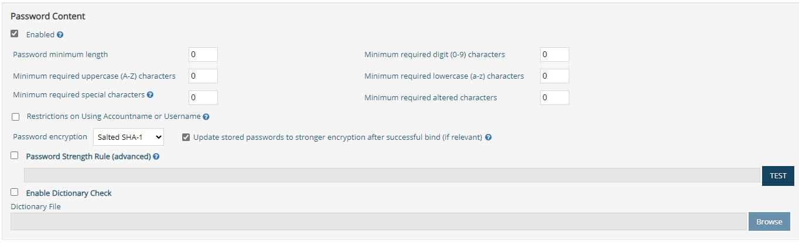
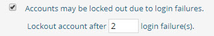

## Overview

When using a RadiantOne Directory store or persistent cache (with password policy enforcement enabled), you can establish password policies for managing things such as password length, quality, reset frequency, lockout…etc. Password policies are only enforced for RadiantOne Directory stores and persistent caches (that contain the user passwords and have enabled the enforcement of password policies) not any other kind of backend configuration (proxies, databases…etc.).

 
Password policies are configured from Classic Control Panel > Settings tab > Security > Password Policies.

## Privileged Password Policy Group

To allow users to bypass password policies, you can add them to the PrivilegedPasswordPolicyGroup group. This group can be useful, for example, if you want a helpdesk user to reset a user’s password. The password policies are not checked, so this user can set a password that does not meet the password content criteria, could be in history, etc.

>[!warning] In addition to PrivilegedPasswordPolicyGroup group members, password policies also do NOT apply to the RadiantOne super user account (cn=directory manager for example) or any member of the cn=directory administrators,ou=globalgroups,cn=config group (or the specific Directory Administrators group you have set on the Main Control Panel > Settings Tab > Server Front End > Administration sub-section).

To assign users to the Privileged Password Policy Group:

1.	In the Main Control Panel, click the Directory Browser tab.

2.	Expand cn=config and ou=globalgroups.

3.	Select cn=PrivilegedPasswordPolicyGroup.

4.	On the right, click **Manage Group**.

5.	Add privileged accounts to this group.

## Password Policy Configuration

From the Classic Control Panel > Settings Tab > Security > Password Policies, you can configure the following:

### Password Policy Scope

There is a default password policy that is enforced at a global level for all RadiantOne Directory stores and persistent cache (if password policy enforcement is enabled), no matter where a user account is located. You can override the default policy with a custom one that is applicable only to a certain subset of the user population (determined by group they are a member of, or the location of the entry in the virtual namespace).

>[!note]
>If a given user entry is affected by both a global and local policy, the local policy takes precedence. For more details, see [Password Policy Precedence](#password-policy-precedence). To enable password policy enforcement for a persistent cache branch, check the Enable Password Policy Enforcement option on the cache settings. For more details on persistent cache, see the [RadiantOne Deployment and Tuning Guide](/deployment-and-tuning-guide/00-preface).

#### Default Password Policy

In the ‘Choose a Password Policy’ drop-down menu, the default password policy is named Default Policy. Choose this option to edit the components of the global default policy.

 
Figure 20: Password Policy Scope

#### Custom Password Policy

To create a custom password policy, next to the ‘Choose a Password Policy’ drop-down, click **New**. Enter a policy name applicable to the intended usage and click **OK**.

The ‘Subject’ of the custom policy can be either Sub-tree or Group and is based on a specific base DN. Click **CHOOSE** to select a base DN. If the subject is set to sub-tree, this means that all user entries below the chosen base DN (which must be a RadiantOne Directory store or persistent cache) are affected by the custom policy. If the subject is set to group, this means that all users that are a member of the group specified in the base DN are affected by the custom policy. The group DN can represent a static group (unique members listed in the group entry) or a dynamic group (associated with the groupOfURLs object class and contains a memberURL attribute dictating the members). RadiantOne evaluates dynamic membership automatically to enforce password policies. If a user is affected by a policy defined for sub-tree and for group, the one associated with the group takes precedence.

>[!note] Custom policy properties override those defined in the default policy. The only exception is the password content properties where you can choose to enable the enforcement of the custom policy, or choose to use the default policy. Keep in mind that a value of 0 (zero) in a custom policy for password content means an unlimited amount is allowed. It does not mean that it is undefined.

An example of a custom password policy is shown below. It is applicable to all users who are located in a RadiantOne Directory store and are a member of the Special Users group identified in the DIT as cn=special users,ou=globalgroups,cn=config.

>[!note] If you define multiple custom password policies associated with groups (as the Subject), they should not have the same precedence if they share members. If a user is affected by multiple group-based policies, the one with the highest precedence (lowest numeric value in the precedence setting) is enforced.

 

An example of a custom password policy applicable to all users below a specific container is shown below. This custom policy is enforced for all users in a RadiantOne Directory store located below o=local.

>[!note] Precedence level is not configurable for policies defined on a sub tree. Multiple password policies configured with sub tree subject, should not be configured for the same location. If multiple policies impact the same branch, the policy defined at the lowest point is enforced.

 

### Password Policy Precedence

If the user entry has a [pwdPolicySubentry](#pwdpolicysubentry) attribute that contains a DN pointing to a password policy located below cn=Password Policy,cn=config in RadiantOne, this policy takes precedence and is enforced for the user. If the user entry doesn’t have a pwdPolicySubentry attribute, or if the value points to a non-existent policy below cn=Password Policy,cn=config, then RadiantOne evaluates other configured password policies that affect the user.

The examples below describe how password policies are enforced.

-	If a user has a [pwdPolicySubentry](#pwdpolicysubentry) attribute that matches a policy configured in RadiantOne, this policy is enforced. No other password policies are considered.

-	If a user is affected by both a global and local policy, the local policy takes precedence. 

-	If a user is affected by both a group-based policy and a sub-tree based policy, the group policy takes precedence. 

-	If a user is affected by multiple group-based policies, the one with the highest precedence (lowest numeric value in the precedence setting) is enforced. 

-	If a user is affected by multiple sub-tree based policies, the one with the deepest DN value is enforced.
Items to keep in mind:

-	The precedence value is a number between 1 and 1000. 1 is the highest level. 1000 is the lowest level. This value is stored in the policyPrecedence attribute of the password policy entry in RadiantOne.

-	The default password policy always has the lowest precedence level (a numeric value of 1000).

-	Each custom password policy defined for groups is associated with a precedence level. This level dictates which policy is enforced for a user that is associated with many group policies. For example, if a user is a member of many groups and each group is associated with a different password policy, the precedence number determines which policy to enforce.

-	Multiple password policies configured with sub tree subject, should not be configured for the same location. If multiple policies impact the same branch, the policy defined at the lowest point (deepest DN) is enforced.
-	If you define multiple custom password policies associated with groups (as the Subject), they should not have the same precedence if they share members.

### Password Policy Associated with Control Panel Delegated Administrator Roles
The default delegated administrator roles and users associated with the RadiantOne Control Panel are located in the cn=config naming context. To define a custom password policy for users associated with these roles, select the sub-tree subject and enter cn=config for the location (or any location where the users are located). An example is shown below where the passwords for the delegated administrator accounts expire after 5 days.

>[!note] If you want a custom password policies to be associated with a specific delegated administrator role, select the "group" subject in the password policy, and click **Choose** to navigate to the group entry that is associated with the role.

## Password Changes

 

### User must change password after reset

This value is stored in the pwdMustChange attribute of the cn=Password Policy entry and has a value of True or False. If True, the user must change their passwords when they first bind to the directory after their password has been reset. The bind error message returned from RadiantOne is “You must change your password before submitting any other requests”.

>[!warning]
>The applicable password policy must indicate: "User must change password after reset" and "User may change password".

Actions considered as a reset that will trigger the “You must change your password before submitting any other requests” bind error are:

-	A new user account is added. In order to be considered a password reset, the account must be created by a user other than the cn=directory manager, or any member of the cn=directory administrators group.

-	An existing user account’s password is changed by a user other than themselves, cn=directory manager, or any member of the cn=directory administrators group (cn=directory administrators,ou=globalgroups,cn=config).

If this attribute is not present, or if the value is False, users are not required to change their password upon binding after the password administrator resets the password. 

### User may change password

This value is stored in the pwdAllowUserChange attribute of the cn=Password Policy entry. This value indicates whether users can change their own passwords. If enabled, the value is True, if not the value is False.

### Require existing password in order to change password

This value is stored in the pwdSafeModify attribute of the cn=Password Policy entry. This value is either True (if enabled) or False. This value specifies whether the existing password must be sent along with the new password when being changed.

### Allow a password to be changed after a certain number of days

This value is stored in the pwdMinAge attribute of the cn=Password Policy entry. It holds the number of seconds that must elapse between modifications to the password. If this attribute is not present, 0 seconds is assumed. From the Main Control Panel, you can indicate the length of time in any combination of days, hours and/or minutes using “d” for days (e.g. 1d), “h” for hours (e.g. 4h), and “m” for minutes (e.g. 5m). A value of 1d 5h 45m would indicate a password could be changed after 1 day, 5 hours and 45 minutes.

>[!note] Your password policy must uphold the following rule: pwdMinAge + pwdExpireWarning < pwdMaxAge.

### Keep a password history

This value is stored in the pwdInHistory attribute of the cn=Password Policy entry. It holds the maximum number of used passwords to store in the pwdHistory attribute. If this attribute is not present, or if the value is 0, used passwords are not stored in the pwdHistory attribute and the value may be reused.

## Password Expiration

 

 
### Password never expires

This value is stored in the pwdMaxAge attribute of the cn=Password Policy entry. If this option is enabled, then the value is 0d.

### Password expires after a certain amount of time

This value is stored in the pwdMaxAge attribute of the cn=Password Policy entry. If this option is enabled, the value contains the amount of time after which a modified password expires. If this attribute is not present, or if the value is 0d, the password does not expire. If not 0d, the value must be greater than or equal to the value of pwdMinAge (the Allow a password to be changed after a certain number of days parameter). From the Main Control Panel, you can indicate the length of time in any combination of days, hours and/or minutes using “d” for days (e.g. 1d), “h” for hours (e.g. 4h), and “m” for minutes (e.g. 5m). A value of 1d 5h 45m would indicate a password expires after 1 day, 5 hours and 45 minutes.

>[!note] Your password policy must uphold the following rule: pwdMinAge + pwdExpireWarning < pwdMaxAge.

If a user’s password is expired, the next time a client (on the user’s behalf) connects to RadiantOne, the bind will fail and the additional information returned to the client indicates the password has expired. An example using an ldapsearch command line client by a user identified as “tuser” is shown below.

`ldapsearch -h 10.11.12.164 -p 2389 -D "uid=tuser,ou=people,o=global" -w password -b "o=global" "(uid=tuser)"`
 `ldap_simple_bind: Invalid credentials`
 `ldap_simple_bind: additional info: Password has expired.`

During the bind, RadiantOne calculates if the user’s password has expired and returns the bind response and additional information to the client. It is up to the client to prompt the user to reset their password, if this functionality is desired.

The user entry stored in RadiantOne doesn’t contain an attribute that indicates a user’s password has expired. However, the entry contains an attribute (passwordExpWarned) indicating when the password expiring warning was send in the bind response.

`dn: uid=tuser,ou=people,o=global`
 `passwordExpWarned: 20170622194148.238Z`

### Send a warning before the password expires

This value is stored in the pwdExpireWarning attribute of the cn=Password Policy entry. It contains the amount of time before a password is due to expire in which case an expiration warning message is returned to an authenticating user. From the Main Control Panel, you can indicate the length of time in any combination of days, hours and/or minutes using “d” for days (e.g. 1d), “h” for hours (e.g. 4h), and “m” for minutes (e.g. 5m). A value of 1d would indicate a password expiration warning should be sent 1 day prior to the password expiring.

If this attribute is not present, or if the value is 0d no warnings are returned. If not 0d, the value must be smaller than the value of the pwdMaxAge attribute.

>[!note] Your password policy must uphold the following rule: pwdMinAge + pwdExpireWarning < pwdMaxAge.

When this is configured, a control is returned with the BindResponse (even if the client doesn’t specifically request it) indicating the amount of time until expiration. An example is shown below.

PasswordExpiringControl {2.16.840.1.113730.3.4.5 false secondsUntilExpiration=432000}

### Allow a certain number of login attempts after the password expires

These are known as grace logins. The value of this parameter is stored in the pwdGraceAuthNLimit attribute of the cn=Password Policy entry. The parameter specifies the number of times an expired password can be used to authenticate. If this attribute is not present, or if the value is 0, authentication fails if the password has expired.

During the grace login attempts, bind requests are processed. However, the subsequent operation after the bind must be a modifyRequest to change the password. Otherwise, an error message is returned indicating “You must change your password before submitting any other requests”.

## Password Content

The following are the password content options.
-	Password minimum length
-	Minimum required digit (0-9) characters
-	Minimum required uppercase (A-Z) characters
-	Minimum required lowercase (a-z) characters
-	Minimum required special characters
-	Password encryption

If more complex password content is required, the Password Strength Rule can be used.

Each of these properties is described below.
 

### Enabled

This option is only applicable to custom password policies.

Custom policies can enforce specific password content criteria or inherit from the default policy. If enabled, the custom policy password contents are enforced and override the conditions defined in the default policy. A value of 0 means unlimited, NOT undefined.

If not enabled, the default policy dictates the password content criteria.

### Password minimum length

This value is stored in the pwdMinLength attribute of the cn=Password Policy entry. This attribute holds the minimum number of characters that must be used in a password. If this attribute is not present, no minimum password length is enforced.

### Minimum Required Digit Characters

This value indicates the number of required numerical characters required in passwords.

### Minimum Required Uppercase Characters

This indicates the number of uppercase characters required in passwords.

### Minimum Required Lowercase Characters

This value indicates the number of lowercase characters required in passwords.

### Minimum Required Special Characters

This value indicates the number of special characters required in passwords.

### Minimum Required Altered Characters

This value indicates the number of characters that must vary between the old password and the new password. This option requires enabling both “User must change password after reset” and “Require existing password in order to change password” in the Password Change section of the password policy.

>[!note] This leverages the Damerau Levenshtein algorithm to determine the variation of characters between the old and new passwords.

### Restrictions on Using Accountname or Username

This value is stored in the pwdEnableNotContainNames attribute of the cn=Password Policy entry and has a value of true or false. If true, the user’s password must not contain the user’s accoutname or parts of the user’s full name that exceed two consecutive characters.

For the accountname value, the sAMAccountname attribute is checked first. If sAMAccountname is not found, the uid attribute is checked. If uid is not found, rdn value is checked. For the user’s full name, the attribute displayName is checked. If displayName is not present, cn is checked. If the cn attribute is not found, the full name is computed (givenName+sn) and checked. These checks are not case-sensitive.

### Password Encryption

The passwords that are stored in a RadiantOne Directory store may be hashed using any of the following methods: Clear, CRYPT, MD5, PBKDF2AD, Salted SHA-1, Salted SHA-256, Salted SHA-384, Salted SHA-512, and SHA-1. The least secure methods of CRYPT, MD5, and SHA-1 have been hidden as options from the Main Control Panel.

>[!warning] PBKDF2AD is the required password encryption expected in Azure AD. Therefore, if your HDAP store (or persistent cache) will be synchronized to Azure AD, and passwords are a part of the synchronization, use the PBKDF2AD encryption option to store passwords in the RadiantOne Directory.

### Automatic Update to Stronger Password Hash

If the “Update stored passwords to stronger encryption after successful bind” is enabled, user accounts that contain a password hashed with a less secure method than allowed for the current password policy are automatically updated to the stronger hash after a successful bind. The only exception to this is for passwords that have a current hash of: PKCS5S2, PBKDF2, PBKDF2AD, SCRYPT, BCRYPT, SMD4, or MD4, in which case the hashing is not changed. This value is stored in the pwdEnableAlgorithmUpgrade attribute of the cn=Password Policy entry and has a value of True or False.

The strength order is as follows:

`CLEAR -> CRYPT -> MD5 -> SHA1 -> SSHA1 -> SHA256 -> SSHA256 -> SHA384 -> SSHA384 -> SHA512 -> SSHA512 -> (PKCS5S2 | PBKDF2 | PBKDF2AD | SCRYPT | BCRYPT | SMD4 | MD4)`

>[!note] PKCS5S2, PBKDF2, PBKDF2AD, SCRYPT, BCRYPT, SMD4, and MD4 are considered as special hashes of the strongest ranking.

### Password Strength Rule

The default options for enforcing password content are based on an AND operation. For example, if you set a minimum password length, minimum number of required digits, and a minimum number of required uppercase letters, the rule would be expressed as follows.

`<min password length> AND <min # of digits> AND <min # uppercase letters>.`

The Password Strength Rule option allows you to define and test password strength requirements that are more complex using an OR condition. For example, you could use the Password Strength Rule option to require a password to have 'n' number of special characters OR 'n' number of Upper Case characters. In another example, a password strength rule requiring at least six total characters, with at least one lower case, at least one uppercase letter, and at least one digit OR one symbol would be expressed in the Password Strength Rule field as follows.

`^.(?=.{6,})(?=.[a-z])(?=.[A-Z])(?=.[\d\W]).*$`

Another example would be if you do not want to allow special characters to be used in the password. This would be expressed in the Password Strength Rule field as:
^[a-zA-Z0-9]+$

>[!note] Checking the Password Strength Rule box disables and overrides all other password Content options except Password minimum length and Password encryption.

Enter your password strength rule using regular expression syntax.

Click **Test** to compile your expression.

### Enable Dictionary Check

The Enable Dictionary Check option is comparable to the Strong Password Check plug-in found in legacy LDAP directories. This enables RadiantOne to verify that a user’s password doesn’t contain unallowed strings from a specified dictionary file. This can be used as a method to enforce strong password policies.

>[!warning] The default behavior uses an exact match comparison of the password to a dictionary value. To enforce a contains match comparison, go to the Main Control Panel > Zookeeper tab, navigate to `/radiantone/<version>/<clusterName>/config/vds_server.conf` and click EDIT MODE. Set the following: "enablePwdPolicyDictionarySubstringCheck" : true   The value of “true” must be in all lowercase, as shown above.  You can also set this property using the vdsconfig command line utility, set-property command. For details, see the [Radiantone Command Line Configuration Guide](/command-line-configuration-guide/01-introduction).

To enable this feature:

1.	From Main Control Panel, navigate to the Settings tab >Security > Password policies section.

2.	Locate the Password Content section and check the option to Enable Dictionary Check. This value is stored in the pwdEnableDictionary attribute of the cn=Password Policy entry and has a value of True or False.

3.	Click **Browse** to navigate to the dictionary file. The value for the location of the dictionary file is stored in the pwdDictionaryFile attribute of the cn=Password Policy entry.

    >[!note] The dictionary file must be a text-formatted file containing one dictionary word per line.

4.	Click **Save**.

## Account Activity and Lockout

Accounts may be automatically locked under two circumstances:

1.	If a user has not authenticated successfully to RadiantOne for longer than a specified period of time.

2.	If a user has reached the failed login threshold.

### Keep Track of User’s Last Successful Login Time

If you want to keep track of a user’s last successful login time, enable the option to “Keep track of the user’s last successful logon time” in the Account Activity section of the password policy.

>[!warning] You can exclude pwdLastLogonTime changes from the RadiantOne changelog by setting the following property in ZooKeeper at /radiantone/<Config_Version>/<RadiantOne_ClusterName>/config/vds_server.conf: "skipLoggingIntoChangelogForPwdLastLogonTime" : "true",   This alleviates excessive writing into the changelog when you have a large volume of user login activity. This property is enforced globally and affects all password policies.

You can indicate the frequency that RadiantOne records the time of the last successful authentication. The default value is 0s meaning that the last login time is updated on every successful authentication. To change the default, indicate the length of time in any combination of days, hours and/or minutes using “d” for days (e.g. 1d), “h” for hours (e.g. 4h), and “m” for minutes (e.g. 5m). For example, a value of 1d indicates the last login time is updated if at least 1 day has passed since the last successful authentication. Subsequent successful authentications, within this time frame, do not change the last login time.

>[!warning] There is a performance impact on RadiantOne if you keep track of last successful logins because a write operation is performed with a successful bind. It is recommended that you indicate a frequency for writing the last login and that you test the usage of this feature to determine if the degradation in performance is acceptable for your usage.

If accounts should be automatically locked when a user has not authenticated successfully for a predetermined amount of time, indicate the threshold (number of days) in the “Account Activity” section of the password policy where you see “Lock user’s account if the user is idle longer than <X> days”. The user’s password must be reset to unlock the account. Once the account is unlocked, if it is not used for login longer than the specified time, the account is locked again. If the value is zero days, this means users will never be locked out.

### Lock Accounts Based on Number of Failed Logins

If accounts should be locked out after a failed login threshold is met, check the Accounts may be locked out option in the password policy, and establish the criteria.

-	How may login failures are allowed? Enter this value for X (Lockout account after X login failures).

This value is stored in the pwdMaxFailure attribute of the cn=Password Policy entry and contains the number of failed login attempts to allow. This corresponds to the operational attribute for the user entry named pwdFailureTime which stores the time(s) of the login failure(s).

-	How often to reset the failure count? Enter this value for X (Reset failure count after X minutes).

This value is stored in the pwdFailureCountInterval attribute of the cn=Password Policy entry. This is the temporary interval of time in which RadiantOne keeps track of the number of failed login attempts. For example, if the number of login failures allowed is 2 and the reset failure account is 5 minutes, this means if a user login fails twice within 5 minutes, the account will be locked. If the user logs in unsuccessfully once and then doesn’t try again until after the 5-minute interval has passed, the number of unsuccessful login attempts is reset and the new failed login attempt counts as the first failure instead of the second failure. This relates to the number of values for the pwdFailureTime operational attribute in the user’s entry which is used to determine how many failed logins have been attempted.

>[!note] Once an account is locked, the reset failure count is irrelevant in terms of determining how many failed login attempts have occurred.

-	How long is an account locked out?
     Lockout forever
     Lockout duration X minutes

    This value is stored in the pwdLockoutDuration attribute of the cn=Password Policy entry. This relates to the operational attribute [pwdAccountLockedTime](#pwdaccountlockedtime) in the user’s entry which includes a timestamp indicating when the user’s account became locked. Once a lockout duration has passed, or a user’s password has been reset by an administrator, the account is unlocked. Any user (other than the locked out user) that has the proper permissions (ACI’s) can reset the user’s password.

### Unlocking Accounts

If a user’s account is locked, it can become unlocked by resetting the user’s password. Any user (other than the locked out user) that has the proper permissions (ACI’s) can reset the user’s password. If the lockout policy has a duration period, the account is automatically unlocked after the duration has passed.

## Operational Password Attributes Stored in User Entries

>[!warning] Since these attributes are defined as operational attributes, they do not appear in the user entries unless specifically requested in the search from the client.

### pwdHistory

Stores the previous values used for passwords to prevent users from re-using previous passwords. The number of passwords that are stored is determined by the value set in the pwdInHistory attribute of the Password Policy.

### pwdChangedTime

A Generalized Time attribute containing the time the password was last changed.

### pwdLastLogonTime

Stores the user’s last successful login time (bind) if the “Keep track of the user’s last successful logon time” is enabled.

### pwdAccountLockedTime

A Generalized Time attribute containing the time at which the account was locked. If the account is not locked, this attribute is not present.

If the maximum consecutive login failures (pwdMaxFailure) have been reached during a certain period of time (pwdFailureCountInterval), the user entry will have the operational attribute of: pwdAccountLockedTime and it will contain the time the account became locked.

### passwordExpWarned

A Generalized Time attribute containing the time at which the password expiration warning was first sent to the client.

### pwdFailureTime

A multi-valued Generalized Time attribute containing the times of previous consecutive login failures. If the last login was successful, this attribute is not present. The number of values will be no more than the value defined in Number of Login Failures for the password policy.

 
If the last login was successful, this attribute is not present.

>[!note]
>Once the Reset Failure count has passed, the values of the pwdFailureTime attribute are updated during the next unsuccessful login attempt and the values are removed if the next login is successful.

### pwdGraceUseTime

A multi-valued Generalized Time attribute containing the times of the previous grace logins.

### pwdPolicySubentry

An attribute that contains the DN of the password policy associated with the user. RadiantOne does not write to this attribute or allow password policies to be defined on individual users from the Main Control Panel. However, if the entry was imported from another directory, this attribute could have a value that dictates which password policy affects the user. If the value matches a policy defined in RadiantOne, this policy is enforced for the user. If the value does not match a policy defined in RadiantOne it is ignored and other configured policies below cn=Password Policy,cn=config are checked. If multiple policies affect the user, the one with the highest priority (based on precedence level) is enforced.

### pwdReset

A Boolean attribute containing the value TRUE if the password has been reset and must be changed by the user. If a user’s password is set/reset by the RadiantOne super user (e.g. cn=directory manager), a member of the cn=directory administrators group (cn=directory administrators,ou=globalgroups,cn=config), or the user himself, this does not trigger pwdReset set to TRUE. Only when a user’s password is set/reset by other users (e.g. helpdesk) is the pwdReset set to TRUE. When the affected user logs in with the new password for the first time, they are not allowed to perform operations until they reset their password. For example, if the user attempts a search, RadiantOne responds with error code 53 and a message indicating “You must change your password before submitting any other requests”. After the user updates their password, pwdReset is removed from their entry.

If a user resets their password, RadiantOne performs the following checks based on the password policy:

-	Check if the user is allowed to change their password
-	Check minimum password age
-	Check if old password is provided with new password (if the “Require Existing Password in order to Change Password” policy is enabled)
-	Check the password length
-	Check the password quality (correct number of required characters – upper/lower/number…etc.)
-	Check if the password is in the history
-	Check if the password contains unallowed strings based on a dictionary file

After the BIND response is returned, it is up to the client to prompt the user accordingly (depending on what kind of password policy response or control was returned). 

RadiantOne returns one of the following responses to the client application:

Modify Response Code | Meaning
-|-
53	| User password changes are not allowed. If the “User may change password” is NOT enabled, and a user tries to change their password, they get this error.     OR     The password cannot be changed because it has not been long enough since the last password change. If a user tries to change their password before the minimum number of days between changes has been reached, they get this error message.     OR     The bind user’s entry contains pwdReset=TRUE, meaning they must change their password because it has been reset. The error message returned from RadiantOne is “LDAP error code 53 – Reason 773 – User must reset password: You must change your password before submitting any other requests”.
19 | This code could mean any of the following:   Not enough time has passed since the password was last changed. If a user tries to change their password before the minimum number of days between changes has been reached, they get this error message.     OR     The user’s current password must be provided for password changing. If the “Require Existing Password in order to Change Password” option is enabled, and a user tries to change their password and doesn’t provide their existing password, they get this error message.     OR     The provided password is too short. If the new password doesn’t meet the required length, they get this error message.     Invalid password syntax: there must be at least <N> special character(s) in the password. If the new password doesn’t contain the appropriate number of special characters as dictated by the password policy, they get this error message. The <N> is the number required per the policy.     Invalid password syntax: there must be at least <N> uppercase character(s) in the password. If a user tries to change their password and it doesn’t contain the appropriate number of upper case characters as indicated in the password policy, they get this error message. The <N> is the number of uppercase characters required.     Invalid password syntax: there must be at least <N> numerical character(s) in the password. If a user tries to change their password and it doesn’t contain the appropriate number of numeric characters as dictated by the password policy they get this error. The <N> is the number of numeric characters required.     Invalid password syntax: there must be at least <N> lowercase character(s) in the password. If a user tries to change their password and it doesn’t contain the appropriate number of lowercase characters as dictated by the password policy, they get this error message. The <N> is the number of lowercase characters required.     OR     Password in history. If a user is allowed to change their password and the “Keep password history” option is enabled, and the user tries to change their password to one that is in the “history”, this error message be returned.     OR     The value is not allowed by the configured password dictionary. Constraint violation.

