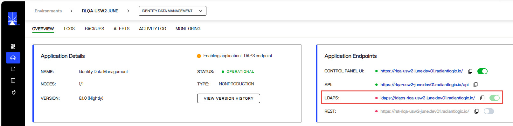

## Overview

The RadiantOne platform offers a variety of methods to ensure a secure service that has been hardened against threats can be deployed. These methods include:
-  Access Controls
-  Access Tokens
-  Attribute Encryption
-  SSL/TLS Communication to the RadiantOne Service.
-  SSL/TLS Communication to backend Identity Data Sources
-  Support for External OIDC Token Validators
-  Password Policies

## Access Controls

Authorization on the RadiantOne namespace is enforced with LDAP Access Controls. LDAP Access Control Lists (ACLs) specify which users or groups have permission to perform specific actions on the RadiantOne namespace. These dictate who can see, modify or delete data within the RadiantOne namespace. Permissions are checked every time a user tries to perform an action on the object. If a user doesn't have permission, the operation is denied and an error message is returned.

LDAP ACLs work by combining both access control rules and access control instructions. Access control rules are used to define which users or groups have permission to perform specific actions on objects within the directory. Access control instructions provide detailed information about the type of access that is granted or denied for each rule.

See [Managing RadiantOne Access Controls](./access-controls) for details.

## Access Tokens

Access tokens are used by applications to make API requests on behalf of a user. The access token represents the authorization of a specific application to access specific parts of a user’s data. Access tokens can be created to call the RadiantOne configuration API, or the data management APIs (via SCIMv2 or the RadiantOne Restful Web Service named ADAP).

See [Managing Access Tokens](./access-tokens) for details.

## Attribute Encryption

RadiantOne Identity Data Management supports encryption for attributes at-rest stored in RadiantOne Directory stores and data exported in LDIF files.
For RadiantOne Directory stores, a security key must be configured and the list of attributes to encrypt must be defined.
For LDIF file encryption, a security key must be configured and the LDIFZ file type must be selected when managing LDIF files for export or import.

See [Managing Attribute Encryption](./attribute-encryption) for details.

## SSL/TLS Communication to the RadiantOne Service

You can enable the LDAPS endpoint in the Environment Operations Center.
Expand your environment and click on the Identity Data Management application.
In the Application Endpoints section, toggle on the LDAPS endpoint. This takes about 10 minutes to activate.

## Client Certificate Truststore

RadiantOne supports SSL/TLS to ensure secure connections are made to identity data sources (backends). The certificates in the Client Certificate Trust Store are used by RadiantOne to establish these secure connections. Therefore, the appropriate client (public key) certificate (associated with the server certificate of the backend) needs imported into the Client Certificate Trust Store (unless they are signed by a trusted/known Certificate Authority).

See [Managing Client Certificates](./client-cert-truststore) for details.

## External Access Token Validators

Externally-managed OIDC access tokens can be used to query the RadiantOne Restful Web Service (ADAP). To support this, an external token validator must be configured for the provider that will issue the access tokens. This would be an alternative to using the RadiantOne internally-issued access tokens described above.

See [Managing External Token Validators](./external-token-validators) for details.

## Password Policies

Password policies include a set of rules that control how passwords are used and managed in RadiantOne Identity Data Management. RadiantOne support policies that address password expiration, failed login attempts, and password quality rules.  These policy rules ensure that users change their passwords periodically, use passwords that meet the organization's password quality requirements, and that accounts are locked after a defined number of invalid authentication attempts.

RadiantOne offers a default password policy that controls all RadiantOne Directory stores and persistent cached identity views. However, custom password policies can be defined for fine-grained control.

See [Managing Password Policies](./password-policies) for details.
